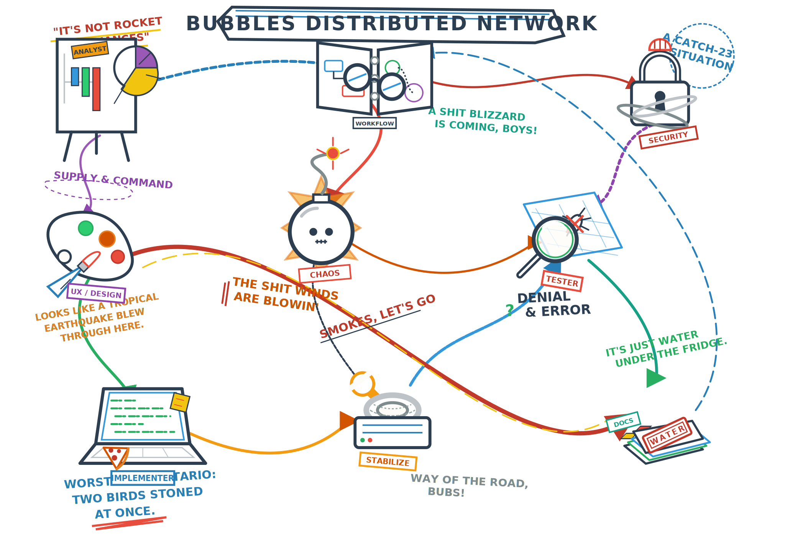

<p align="center">
  
</p>

<h1 align="center"> Bubbles</h1>

<p align="center">
  <strong>AI Agent Orchestration System for VS Code Copilot</strong><br>
  <em>"It ain't rocket appliances, but it works."</em>
</p>

<p align="center">
  <!-- GENERATED:FRAMEWORK_STATS_BADGES_START -->
  
  
  
  <!-- GENERATED:FRAMEWORK_STATS_BADGES_END -->
  
  
</p>

<p align="center">
  <a href="https://pkirsanov.github.io/bubbles/docs/its-not-rocket-appliances.html"><strong>Visual Cheatsheet</strong></a> · <a href="docs/CHEATSHEET.md">Markdown Cheatsheet</a> · <a href="docs/guides/AGENT_MANUAL.md">Agent Manual</a> · <a href="docs/recipes/">Recipes</a>
</p>

---

## What Is This?

Bubbles is a **spec-driven AI agent orchestration system** for VS Code Copilot Chat. It turns your `/` slash commands into a full software delivery pipeline — from business analysis to implementation to testing to audit — with zero tolerance for fabricated work.

Think of it as a trailer park supervisor for your codebase. Except this one actually works.

<table>
<!-- GENERATED:FRAMEWORK_STATS_CALLOUTS_START -->
<tr><td width="64"></td><td><strong>29 specialized agents</strong> — each with a defined role, from implementation to framework ops</td></tr>
<tr><td width="64"></td><td><strong>45 quality gates</strong> — nothing ships without evidence. Nothing.</td></tr>
<tr><td width="64"></td><td><strong>24 workflow modes</strong> — from full delivery to quick bugfixes to chaos sweeps</td></tr>
<!-- GENERATED:FRAMEWORK_STATS_CALLOUTS_END -->
<tr><td width="64"></td><td><strong>Optional execution tags</strong> — opt into Socratic discovery, git isolation, atomic commits, scope sizing, and micro-fix loops without losing autonomous defaults</td></tr>
</table>

---

## Install

One command. No dependencies beyond `curl` and `bash`.

**Supported platforms:** VS Code + GitHub Copilot Chat (required). Works on macOS, Linux, and WSL2. No Windows CMD/PowerShell support.

```bash
# Install shared Bubbles framework files
curl -fsSL https://raw.githubusercontent.com/pkirsanov/bubbles/main/install.sh | bash

# Install agents only (skip shared instructions and skills)
curl -fsSL https://raw.githubusercontent.com/pkirsanov/bubbles/main/install.sh | bash -s -- --agents-only

# Install + scaffold project config (recommended for new projects)
curl -fsSL https://raw.githubusercontent.com/pkirsanov/bubbles/main/install.sh | bash -s -- --bootstrap

# Bootstrap with explicit project name and CLI
curl -fsSL https://raw.githubusercontent.com/pkirsanov/bubbles/main/install.sh | bash -s -- --bootstrap --cli ./myproject.sh --name "My Project"
```

Pin to a version:

```bash
curl -fsSL https://raw.githubusercontent.com/pkirsanov/bubbles/v1.0.0/install.sh | bash -s -- --bootstrap
```

Update:

```bash
# Same command. It overwrites the shared files, leaves your project config alone.
curl -fsSL https://raw.githubusercontent.com/pkirsanov/bubbles/main/install.sh | bash
```

### What `--bootstrap` Does

With `--bootstrap`, the installer goes beyond the shared framework files and scaffolds a fully working project setup:

1. **Auto-detects** your project name (from git/directory) and CLI entrypoint (`*.sh` in root)
2. **Creates** all required project-specific config files (if they don't already exist):
   - `.github/copilot-instructions.md` — project policies, commands, testing config
   - `.github/instructions/terminal-discipline.instructions.md` — CLI discipline rules
   - `.specify/memory/constitution.md` — project governance principles
   - `.specify/memory/agents.md` — command registry (agents resolve all commands from here)
3. **Creates** the `specs/` directory for feature/bug specs
4. **Never overwrites** existing files — safe to re-run

After bootstrap, update the `TODO` items in the generated files, then start using agents.

### What Gets Installed (default shared install)

```
.github/
├── agents/
<!-- GENERATED:FRAMEWORK_STATS_INSTALL_TREE_START -->
│   ├── bubbles.workflow.agent.md    # 29 agent definitions
│   ├── bubbles.implement.agent.md
│   ├── bubbles.super.agent.md       # NEW: first-touch assistant + framework operations
│   ├── ...
│   └── bubbles_shared/              # Shared governance docs
│       ├── agent-common.md
│       ├── scope-workflow.md
│       └── ...
├── prompts/
│   └── bubbles.*.prompt.md          # 29 prompt shims
├── instructions/
│   ├── bubbles-agents.instructions.md       # Portable agent authoring guidance
│   ├── bubbles-skills.instructions.md       # Portable skill authoring guidance
│   └── bubbles-docker-lifecycle-governance.instructions.md
├── skills/
│   ├── bubbles-skill-authoring/             # Portable governance skill
│   ├── bubbles-docker-port-standards/
│   ├── bubbles-spec-template-bdd/
│   └── bubbles-docker-lifecycle-governance/
├── bubbles/
│   ├── workflows.yaml               # 24 workflow mode definitions
│   ├── scripts/                     # Governance scripts
│   │   ├── cli.sh                   # Main CLI
│   │   ├── artifact-lint.sh
│   │   ├── state-transition-guard.sh
│   │   └── ...
│   └── docs/                        # Generated docs
└── scripts/
    └── bubbles.sh                   # CLI shim (dispatches to bubbles/scripts/cli.sh)
<!-- GENERATED:FRAMEWORK_STATS_INSTALL_TREE_END -->
```

Use `--agents-only` if you want to skip the portable shared instructions and governance skills.

### What `--bootstrap` Adds (project-specific)

```
.github/
├── copilot-instructions.md              # Project policies & commands
├── instructions/
│   └── terminal-discipline.instructions.md  # CLI discipline
.specify/memory/
├── constitution.md                      # Project governance
└── agents.md                            # Command registry
specs/                                   # Feature/bug spec folders
```

---

## The Crew

<p align="center">
  
</p>

Every agent has a job. Start with the super when you need help, then hand off to the right specialist.

### Artifact Ownership

Bubbles now enforces hard artifact ownership:

- `bubbles.analyst` owns business requirements in `spec.md`
- `bubbles.ux` owns UX sections inside `spec.md`
- `bubbles.design` owns `design.md`
- `bubbles.plan` owns `scopes.md`, `report.md` structure, and `uservalidation.md`
- Diagnostic agents like `bubbles.validate`, `bubbles.harden`, `bubbles.gaps`, `bubbles.stabilize`, `bubbles.security`, `bubbles.regression`, `bubbles.code-review`, and `bubbles.system-review` must route foreign-artifact changes to the owning specialist instead of editing those artifacts directly

This is enforced by the artifact ownership contract in `.github/agents/bubbles_shared/artifact-ownership.md`, the shared governance index in `.github/agents/bubbles_shared/agent-common.md`, the ownership manifest in `.github/bubbles/agent-ownership.yaml`, and the blocking `agent_ownership_gate` in `.github/bubbles/workflows.yaml`.

###  Start Here

| Icon | Agent | Role | When to Use |
|:----:|-------|------|-------------|
|  | `bubbles.super` | **The park super.** First-touch assistant for prompts, workflow guidance, framework troubleshooting, and getting the right next move without memorizing Bubbles. | When you're unsure what to do, need help using the framework, or want the exact command |

###  Orchestrators

| Icon | Agent | Role | When to Use |
|:----:|-------|------|-------------|
|  | `bubbles.workflow` | **The orchestrator.** Bubbles sees the whole board, keeps the pieces moving, and runs the full operation. | Starting any multi-phase work |
|  | `bubbles.iterate` | **Scope executor.** Quietly pushes the next scope forward, one step at a time. | Continuing scope-by-scope work |
|  | `bubbles.code-review` | **Engineering-first code reviewer.** Reviews repositories, services, packages, modules, and paths strictly from a code perspective. | Reviewing code directly before deciding what to fix |
|  | `bubbles.system-review` | **Holistic system reviewer.** Orangie sees everything from the fishbowl. Reviews the whole system. | Reviewing what the system feels like, does, and implies as a whole |

###  Specialists

| Icon | Agent | Role | When to Use |
|:----:|-------|------|-------------|
|  | `bubbles.implement` | **The implementer.** Delivers every time. | Implementing planned scopes |
|  | `bubbles.test` | **Test verification.** Trusts nothing. Verifies everything. | Running/fixing test suites |
|  | `bubbles.docs` | **Documentation.** Makes sure everything is narrated and recorded. | Updating docs after changes |
|  | `bubbles.validate` | **Gate checker.** Does the grunt work of checking every gate. | Pre-merge validation |
|  | `bubbles.audit` | **Policy enforcer.** Obsessive, thorough. The last line of defense. | Final compliance audit |
|  | `bubbles.chaos` | **Chaos tester.** Breaks things in ways nobody could predict. | Resilience testing |

###  Planning & Design

| Icon | Agent | Role | When to Use |
|:----:|-------|------|-------------|
|  | `bubbles.analyst` | **Business analyst.** Figures out the *why* behind requirements. | Starting new features |
|  | `bubbles.ux` | **UX designer.** Cares about how things feel and look. | UI/UX design work |
|  | `bubbles.design` | **Architect.** Turns loose ideas into a crisp technical shape. | System design |
|  | `bubbles.plan` | **Scope planner.** Defines the scopes, keeps the books. | Breaking work into scopes |
|  | `bubbles.clarify` | **Requirements clarifier.** Asks the obvious but important questions. | Resolving ambiguity |
|  | `bubbles.harden` | **Hardener.** Says the uncomfortable truths. Confrontational. Necessary. | Hardening passes |
|  | `bubbles.gaps` | **Gap finder.** Finds what nobody else sees. | Gap analysis |

###  Quality & Ops

| Icon | Agent | Role | When to Use |
|:----:|-------|------|-------------|
|  | `bubbles.bug` | **Bug hunter.** Finds and fixes bugs with reproduction evidence. | Bug investigation |
|  | `bubbles.bootstrap` | **Scaffolder.** Sets up workspace and artifacts. | New feature/bug setup |
|  | `bubbles.stabilize` | **Stabilizer.** Quiet. Reliable. Just fixes infrastructure. | Stability issues |
|  | `bubbles.regression` | **Regression guardian.** Prowls the codebase catching cross-feature interference. | After implementation/bug fixes |
|  | `bubbles.security` | **Security scanner.** Finds threats. Confrontational. | Security review |
|  | `bubbles.simplify` | **Simplifier.** Cuts through the noise. | Reducing complexity |
|  | `bubbles.cinematic-designer` | **Design system creator.** Over-the-top production value. | Premium UI/design systems |

###  Utilities

| Icon | Agent | Role | When to Use |
|:----:|-------|------|-------------|
|  | `bubbles.status` | **Observer.** Reports state. Never interferes. Read-only. | Checking progress |
|  | `bubbles.handoff` | **Session handoff.** Packages context for the next session. | End of session |
|  | `bubbles.commands` | **Command registry.** Manages the project command reference. | Updating command docs |
|  | `bubbles.create-skill` | **Skill creator.** Packages know-how into reusable tools and playbooks. | Adding new skills |

---

## Quick Start

### 0. Bootstrap (after install)
```
/bubbles.super                       — Ask the super first for help, the right command, or a framework fix
/bubbles.commands                     — Auto-detect project, generate command registry
/bubbles.bootstrap mode: refresh      — Verify config completeness
```

### 1. Plan a Feature
```
/bubbles.analyst  Build a user authentication system with JWT tokens
```

### 2. Design It
```
/bubbles.design   Create the technical design for auth
```

`bubbles.design` no longer backfills missing business requirements itself. If `spec.md` is incomplete, it routes that work to `bubbles.analyst` first.

### 3. Break Into Scopes
```
/bubbles.plan     Create scopes for the auth feature
```

`bubbles.plan` is the only planning owner. If validation, hardening, security, or gap analysis discovers missing Gherkin scenarios, Test Plan rows, DoD items, or `uservalidation.md`, those agents route the change back to `bubbles.plan`.

### 4. Implement
```
/bubbles.implement  Execute scope 1 of auth
```

### 5. Test
```
/bubbles.test     Run all tests for the auth feature
```

### 6. Review Code Directly
```
/bubbles.code-review   profile: engineering-sweep scope: path:services/gateway output: summary-doc
```

### 7. Review A Feature Or System
```
/bubbles.system-review   mode: full scope: feature:auth output: summary-doc
```

### 8. Ship It
```
/bubbles.workflow  full-delivery for auth feature
```

---

## Workflow Modes

<!-- GENERATED:FRAMEWORK_STATS_WORKFLOW_INTRO_START -->
Bubbles supports 24 workflow modes plus optional execution tags. Here are the most common:
<!-- GENERATED:FRAMEWORK_STATS_WORKFLOW_INTRO_END -->

| Mode | What It Does | Use When |
|------|-------------|----------|
| `full-delivery` | All phases: analyze → design → plan → implement → test → validate → audit → docs | New features |
| `bugfix-fastlane` | Fast: reproduce → fix → test → validate | Bug fixes |
| `value-first-e2e-batch` | Prioritized: plan → implement batches → test → validate | Large features |
| `chaos-hardening` | Chaos → harden → test → validate | Resilience work |
| `harden-gaps-to-doc` | Harden → gaps → test → docs | Quality sweeps |
| `stochastic-quality-sweep` | Random quality checks across the codebase | Periodic maintenance |

<!-- GENERATED:FRAMEWORK_STATS_WORKFLOW_OUTRO_START -->
See [docs/guides/WORKFLOW_MODES.md](docs/guides/WORKFLOW_MODES.md) for all 24 modes.
<!-- GENERATED:FRAMEWORK_STATS_WORKFLOW_OUTRO_END -->

For engineering-only code review work that should not enter the spec workflow, use `bubbles.code-review` with a review profile from `bubbles/code-review.yaml`.

For holistic feature, component, journey, or system review, use `bubbles.system-review` with a mode from `bubbles/system-review.yaml`.

Optional execution tags:
- `socratic: true` turns on a bounded clarification loop before discovery/bootstrap work.
- `gitIsolation: true` opts into branch/worktree isolation when project policy allows it.
- `autoCommit: true` opts into atomic commits after validated milestones.
- `maxScopeMinutes` and `maxDodMinutes` tighten planning so scopes stay small and isolated.
- `microFixes: true` keeps failure recovery in narrow error-scoped loops.

---

## The Rules

Bubbles enforces a strict quality system. This isn't optional.

### Zero-Fabrication Policy
Every piece of evidence must come from **actual terminal execution**. Writing "tests pass" without running tests is fabrication. Fabrication is detected and rejected.

<!-- GENERATED:FRAMEWORK_STATS_GATES_HEADING_START -->
### 45 Quality Gates
<!-- GENERATED:FRAMEWORK_STATS_GATES_HEADING_END -->
Every scope must pass all applicable gates before completion. Gates check everything from test coverage to evidence integrity to DoD completeness.

### Artifact Ownership Gate (G042)
Cross-authoring is blocked. If a diagnostic or downstream specialist finds that a foreign-owned artifact must change, it must route that work to the owning specialist instead of rewriting the artifact directly.

### Self-Healing Loops (G039)
When agents hit failures, they attempt bounded self-repair: narrow context, retry up to 3 times, never stack. No infinite loops.

### Zero Deferral
Every issue found is fixed **now**. "We'll fix it later" is not a valid state. If a gate fails, work stops until it's resolved.

### Zero Warnings
Build, lint, and test output must produce zero warnings. Warnings are errors.

---

## Docs

| Document | What's Inside |
|----------|--------------|
| [It's Not Rocket Appliances](https://pkirsanov.github.io/bubbles/docs/its-not-rocket-appliances.html) | Visual agent reference card — rendered on GitHub Pages |
| [Cheatsheet](docs/CHEATSHEET.md) | Markdown quick-reference |
| [Agent Manual](docs/guides/AGENT_MANUAL.md) | Detailed guide for every agent |
<!-- GENERATED:FRAMEWORK_STATS_DOCS_ROW_START -->
| [Workflow Modes](docs/guides/WORKFLOW_MODES.md) | All 24 workflow modes explained |
<!-- GENERATED:FRAMEWORK_STATS_DOCS_ROW_END -->
| [Recipes](docs/recipes/) | Common problems → solutions |
| [Installing in Your Repo](docs/guides/INSTALLATION.md) | Step-by-step setup guide |
| [Spec Examples](docs/examples/) | Annotated reference examples for common patterns |

---

## Recipes (Quick Reference)

> "Boys, we need a plan." — Here's what to type.

| I Want To... | Run This |
|-------------|----------|
| Start a new feature from scratch | `/bubbles.analyst  <describe feature>` |
| Fix a bug | `/bubbles.bug  <describe bug>` |
| Run the full delivery pipeline | `/bubbles.workflow  full-delivery for <feature>` |
| Review code directly and get engineering priorities | `/bubbles.code-review  scope: full-repo output: summary-only` |
| Review a feature or component and turn findings into specs | `/bubbles.system-review  mode: full scope: component:<name> output: create-specs` |
| Check what's going on | `/bubbles.status` |
| Something's not right, validate it | `/bubbles.validate` |
| Find gaps in my implementation | `/bubbles.gaps` |
| Check for regressions | `/bubbles.regression` |
| Harden the code quality | `/bubbles.harden` |
| Break things on purpose | `/bubbles.chaos` |
| Hand off to next session | `/bubbles.handoff` |
| Ask the super for help | `/bubbles.super  help me get this repo ready` |
| Check project health | `/bubbles.super  doctor` |
| Install git hooks | `/bubbles.super  install hooks` |
| Upgrade bubbles | `/bubbles.super  upgrade` |
| Add a custom quality gate | `/bubbles.super  add a pre-push gate for license checking` |
| View scope dependencies | `/bubbles.super  show dag for 042` |
| Enable metrics collection | `/bubbles.super  enable metrics` |

See [docs/recipes/](docs/recipes/) for detailed step-by-step guides.

---

## Project Structure

```
bubbles/
<!-- GENERATED:FRAMEWORK_STATS_PROJECT_TREE_START -->
├── agents/                    # 29 agent definitions
│   ├── bubbles_shared/        # Shared governance docs
│   ├── bubbles.workflow.agent.md
│   ├── bubbles.implement.agent.md
│   ├── bubbles.super.agent.md # NEW: first-touch assistant + framework operations
│   └── ...
├── prompts/                   # 29 prompt shims
<!-- GENERATED:FRAMEWORK_STATS_PROJECT_TREE_END -->
├── bubbles/                   # Workflow config + scripts + generated docs
│   ├── workflows.yaml
│   ├── scripts/               # Governance scripts (artifact-lint, guard, etc.)
│   └── docs/                  # Generated docs (regenerated on upgrade)
├── templates/                 # Bootstrap templates for project setup
├── icons/                     # SVG icons for all agents
├── docs/
│   ├── its-not-rocket-appliances.html
│   ├── guides/                # Detailed documentation
│   ├── recipes/               # Problem → solution guides
│   └── examples/              # Annotated reference specs
├── install.sh                 # One-line installer (supports --bootstrap)
└── VERSION
```

---

## Contributing

1. Fork the repo
2. Make changes to agents/prompts/scripts
3. Test in at least one consumer repo
4. PR with description of what changed

Agent files are Markdown. The system is pure text. No build step. No compilation.

**Rule:** All agent files (`bubbles.*.agent.md`) must be project-agnostic. Zero repo-specific paths, commands, or tool references.

---

## License

MIT — See [LICENSE](LICENSE).

---

<p align="center">
  
  <br>
  <em>"Have a good one, boys."</em>
</p>
