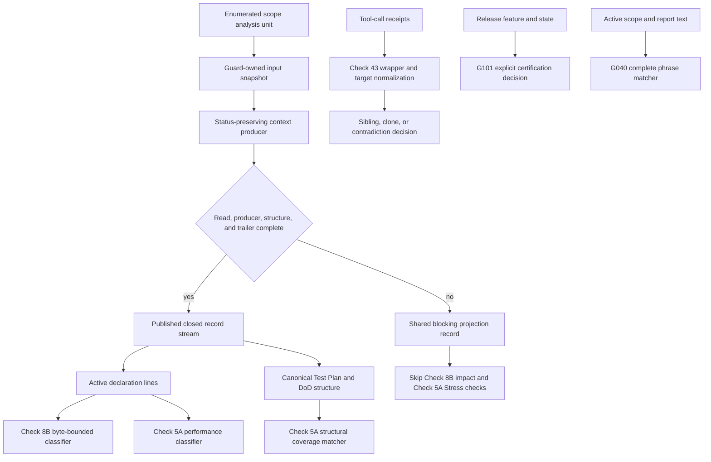

# Bug Fix Design: BUG-032 Planning-Maturity Guard False Positives

## Design Brief

### Current State

The authoritative `spec.md` defines 26 active behavior scenarios. It preserves
the 22 convergence-9 scenarios and adds SCN-032-033 through SCN-032-036. The
four additions close post-implementation security findings in the planning
classifier family.

The active specification reopens Scopes 1 through 3. All four scopes are
`In Progress`. Earlier completion projections remain historical and cannot
override this current scope truth.

The G101 C-GREEN source bytes have independent verification in tool-log rows
125 through 129. That lane remains nonterminal because planning and design
artifacts still require reconciliation. Final certification also requires one
coherent evidence epoch.

Tool-log row 144 is accepted RED for the authorized pre-repair A contract.
Tool-log row 145 is a failed GREEN attempt against the stated post-repair source
hashes. Its exit code is one, so it is nonterminal evidence. Its exact failure
cause remains unclassified.

### Target State

Check 8B and Check 5A classify active declarations only. Check 8B resolves
bounded active and passive ownership. Check 5A requires canonical Stress
planning structure for each affirmative performance contract.

One status-preserving projection prepares each scope analysis unit for both
classifiers. Source-read, producer, structure, and consumer-read failures block
both checks. Partial records never establish or exempt an obligation.

Recognized Gherkin fences retain their marker type and complete length.
Examples and Test Plan tables follow one validated state grammar. Valid fixture
contexts remain inactive, while ordinary text fences remain enforceable.

Check 43 compares complete target sets and underlying program identities. It
fails closed on contradictory stdout metadata. G101 retains explicit v3
certification authority. G040 matches only complete prohibited phrases across
approved horizontal separators and case variants.

Check 8B applies the 4,096-byte line limit and 256-byte token limit before token
count, candidate count, or semantic work. Its existing 128/129 token and eight
or nine candidate decisions remain unchanged.

The final plan must contain exactly 26 behavior scenarios. Five artifact and
generated-surface corrections remain Scope 4 verification obligations. They do
not create behavior scenarios.

### Patterns to Follow

- Keep the finite Check 8B classifier in
  `../../bubbles/scripts/guards/planning-checks.sh`.
- Keep its byte, token, and candidate limits operational in that order.
- Use Bash 4+ built-ins in the per-line classifier path.
- Reuse the guard's `mktemp` registry and `cleanup_tmp_artifacts` trap.
- Project each `scope_analysis_files` entry once for both planning classifiers.
- Keep Check 43 inside
  `../../bubbles/scripts/state-transition-guard.sh`.
- Keep explicit certification authority inside
  `../../bubbles/scripts/release-delivery-reconciliation-guard.sh`.
- Source production behavior from persistent selftests.
- Keep planning artifacts under one planning writer.
- Generate `../../bubbles/release-manifest.json` after every input settles.

### Patterns to Avoid

- Do not classify fenced scenarios, Examples rows, or Test Plan fixtures.
- Do not feed a producer through process substitution when its status matters.
- Do not publish a projection before its completion trailer is validated.
- Do not close a fixture fence with a different marker type or length.
- Do not accept a malformed fixture table as an empty fixture.
- Do not assign a passive mutation to the first nearby surface noun.
- Do not apply `no`, `not`, `never`, or `without` beyond its owned phrase.
- Do not accept any occurrence of `stress` as performance coverage.
- Do not compare one representative target from a receipt group.
- Do not treat a capture wrapper as the program that produced the evidence.
- Do not drop a non-empty hash because `stdoutBytes` reports zero.
- Do not weaken G068 or add a same-ID rejection policy.
- Do not promote artifact corrections into behavior scenarios.
- Do not execute scope text, interpolate it into shell syntax, or derive paths
   from it.

### Resolved Decisions

- The active behavior inventory contains exactly 26 scenario IDs.
- Passive object ownership belongs to SCN-032-013.
- Passive negation belongs to SCN-032-014.
- Active and passive artifact tails belong to SCN-032-015.
- Complete target sets belong to SCN-032-006.
- Transparent wrapper identity belongs to SCN-032-007.
- SCN-032-029 is rejected and must leave the active oracle.
- SCN-032-033 owns projection completion and error propagation.
- SCN-032-034 owns exact fences and validated fixture tables.
- SCN-032-035 owns exact G040 separator equivalence.
- SCN-032-036 owns line-byte and token-byte limits.
- G068 remains structural-strict.
- C-GREEN remains independently verified but nonterminal.
- Row 144 remains accepted RED for its recorded byte epoch.
- Row 145 remains failed and nonterminal without a guessed cause.
- A and B serialize on the state-transition source and selftest family.
- The release manifest runs last.

### Open Questions

- `bubbles.plan` must reconcile the active 26-ID inventory across `scopes.md`,
   `scenario-manifest.json`, `test-plan.json`, report routing, and execution
   state. Those artifacts still encode the prior 22-ID plan.
- `bubbles.test` must recover row 145's exact failure through a fresh unchanged
   baseline run. This design does not infer the cause from its exit code.

## Design Authority And Current Truth

`spec.md` is the behavior authority for this reconciliation. This design owns
technical architecture and sequencing only. It does not change behavior,
planning status, execution evidence, or certification.

| Surface | Current authority | Design treatment |
| --- | --- | --- |
| Behavior inventory | `spec.md` | Implement exactly 26 active scenarios. |
| Scope status | `spec.md` operating contract | Treat Scopes 1 through 4 as `In Progress`. |
| Planning rows and DoD | `scopes.md`, owned by `bubbles.plan` | Reconcile after this design. |
| Execution evidence | `.specify/runtime/tool-calls.jsonl` | Preserve row identity and admissibility. |
| Certification | `state.json.certification`, owned by `bubbles.validate` | Do not mutate or infer completion. |
| Generated release output | `bubbles/release-manifest.json` | Regenerate only after all inputs settle. |

This design does not claim A-RED, A-GREEN, B-RED, or B-GREEN completion. It
does not claim Scope 4 completion. It does not claim full framework validation,
release readiness, certification, or human acceptance.

### Current Evidence Adjudication

| Evidence | Observed disposition | Design consequence |
| --- | --- | --- |
| Tool-log row 130 | Exit 1. Its closure carries SCN-032-029 and the unauthorized G068 assertion. | Inadmissible as accepted RED. Preserve as diagnostic history. |
| Tool-log row 141 | Exit 1. Its closure carries the same unauthorized G068 assertion. | Inadmissible as accepted RED despite being a complete canonical run. |
| Tool-log row 144 | Exit 1 against the authorized pre-repair A closure. | Preserve as accepted RED for that recorded byte epoch. It does not prove SCN-032-033 through SCN-032-036. |
| Tool-log row 145 | Exit 1 against the stated post-first-implementation production hashes and unchanged selftest hash. | Treat as a failed, nonterminal GREEN attempt. Recover the failure before claiming a baseline or GREEN result. |
| Tool-log rows 125 through 129 | Independent C-GREEN checks exited zero against one G101 source and selftest pair. | Preserve the G101 repair. Keep the lane nonterminal pending artifact reconciliation. |

The verified C source hash is
`92ec63dcf9f79aaeb89ec1f319bdb48dc0a70fec7e58e6680ef5a771a6cd6212`.
The verified C selftest hash is
`f4e373f8a46f4102944924c4eaa983a0ee6a74ef7624a5977f792fe63c855a0c`.
These identities describe the C verification epoch. They do not certify the
whole bug packet.

## Purpose And Scope

This design reconciles the convergence architecture with four security
behaviors. It defines the minimum repairs needed for all 26 active behaviors.
It also separates five verification obligations from production behavior.

The design covers these guard decisions:

1. Check 8B consumer-interface mutation classification.
2. Check 5A affirmative performance and Stress coverage classification.
3. Check 43 equal-output receipt identity classification.
4. G101 required-delivery reconciliation.
5. G040 prohibited-phrase boundary matching.
6. G068 structural-strict preservation.
7. Shared context projection completion and structure validation.
8. Check 8B line-byte and token-byte admission.

| Security finding | Design owner | Durable repair |
| --- | --- | --- |
| `BUG032-SEC-001` | Context coordinator | Capture source-read and producer completion. Discard every partial record on failure. |
| `BUG032-SEC-002` | Markdown projection grammar | Track complete fence identity and validate Examples and Test Plan tables before suppression. |
| `BUG032-SEC-003` | G040 lexical matcher | Accept only approved horizontal separator variants inside complete prohibited phrases. |
| `BUG032-SEC-004` | Check 8B byte admission | Enforce line and token byte sentinels before count and semantic work. |

The design does not add a general natural-language parser. It does not change
receipt storage. It does not add configuration, persistence, or network calls.

## Root Cause Analysis

### Investigation Summary

The current source exposes six reduction errors.

| Area | Current reduction | Resulting defect |
| --- | --- | --- |
| Declaration context | Check 8B and Check 5A scan physical lines without a shared active-context boundary. | Fixture text can create production obligations. |
| Passive ownership | Check 8B searches backward for a surface head near a passive mutation. | Another object's mutation can transfer to a used surface. |
| Stress coverage | Check 5A accepts either a canonical Stress row or any `stress` occurrence. | Prose can satisfy structural coverage. |
| Receipt targets | Check 43 selects one target for each command identity. | Later overlapping targets can disappear. |
| Wrapper identity | Check 43 unwraps basic shell and environment prefixes only. | Capture and supervision wrappers can hide the real program. |
| Stdout contradiction | Check 43 filters non-empty hashes with `stdoutBytes: 0`. | Contradictory receipts avoid fail-closed analysis. |
| Projection transport | Both classifiers consume `_scope_project_markdown_context` through process substitution. | The consuming loop cannot observe a producer failure, so partial or empty output can look complete. |
| Fence identity | The projector stores only the first three marker bytes. | A shorter or different closer can terminate the wrong fixture context. |
| Fixture tables | Examples and Test Plan states start from broad labels without validating table structure. | Missing delimiters, missing data, or column drift can hide active prose. |
| G040 separators | The two prohibited phrases use literal single spaces inside one broad pattern. | Case-insensitive tabs, repeated spaces, and approved hyphens do not share one exact phrase identity. |
| Check 8B byte admission | The helper materializes the supplied line and accumulates tokens without line-byte or token-byte sentinels. | Oversized lines and tokens reach work that should have stopped at the first excess byte. |

G101 had a separate authority defect. The C lane repaired that defect and
independently verified the repair. G040 still needs lexical phrase boundaries.
G068 needs planning fidelity, not new matcher behavior.

### Shared Root Cause

Each defect substitutes an easy proxy for the contract fact that matters.

- Physical location substitutes for declaration context.
- Nearby vocabulary substitutes for grammatical ownership.
- One word substitutes for canonical Stress planning structure.
- One representative receipt substitutes for a complete target set.
- Outer argv substitutes for the underlying program.
- Terminal state substitutes for explicit certification authority.
- A shared prefix substitutes for a complete prohibited phrase.
- Process output substitutes for producer and source-read completion.
- A three-byte prefix substitutes for complete fence identity.
- A table-looking prefix substitutes for a valid fixture table.
- Token count substitutes for byte-bounded input admission.

The repair replaces each proxy with the smallest bounded fact needed by its
existing guard. It never disables a protected positive control.

## Architecture Overview



| Component | Input | Bounded decision | Output |
| --- | --- | --- | --- |
| Context coordinator | One enumerated scope analysis unit | Complete source snapshot, producer status, first structure error, and completion trailer | One shared projection state plus a published record path only on success |
| Context producer | One guard-owned input snapshot | Linear Markdown fence and table grammar | Candidate active, DoD, Test Plan, fixture, error, and completion records |
| Check 8B | One active physical line | 4,096 line bytes, 256 token bytes, 128 tokens, and eight mutation candidates | Closed `CHECK8B_*` record |
| Check 5A polarity | One active physical line | Closed performance and opt-out vocabulary | Affirmative or non-affirmative fact |
| Check 5A coverage | One affirmative contract plus planning structure | Canonical Stress row and faithful DoD match | Covered or missing structures |
| Check 43 | One substantive stdout-hash group | Complete programs, targets, exits, categories, and provenance | Sibling, clone, or contradiction |
| G101 | One required release binding and state | Mode semantics plus explicit certification | DELIVERED or NOT-DELIVERED |
| G040 | One active line outside historical evidence | Two complete lexical phrases with approved horizontal separators | Allowed or blocked |

## Active Behavior Contract

### Exact 26-Scenario Inventory

| Scenario | Design owner | Technical behavior |
| --- | --- | --- |
| SCN-032-001 | Check 8B | Stale generated path replacement is not a consumer mutation. |
| SCN-032-002 | Check 8B | Provider, lifecycle, and artifact replacement remain non-mutations. |
| SCN-032-003 | Check 8B | Direct interface rename or removal triggers all three impact checks. |
| SCN-032-004 | Check 5A | Explicit no-SLO wording does not require Stress coverage. |
| SCN-032-005 | Check 5A | Affirmative performance promises require Stress coverage. |
| SCN-032-006 | Check 43 | Complete disjoint target sets allow deterministic siblings. |
| SCN-032-007 | Check 43 | Underlying incompatible programs block through transparent wrappers. |
| SCN-032-008 | Check 43 | The canonical empty stdout hash remains exempt. |
| SCN-032-009 | G101 | Planning maturity is not release delivery. |
| SCN-032-010 | G101 | Coherent full delivery with validate certification remains accepted. |
| SCN-032-011 | G101 | Prototype output remains non-deliverable. |
| SCN-032-012 | G101 | Terminal aliases follow resolved mode semantics. |
| SCN-032-013 | Check 8B | Passive removal stays with its actual object. |
| SCN-032-014 | Check 8B | Owned negation preserves a surface. Unrelated negation does not. |
| SCN-032-015 | Check 8B | Active and passive artifact tails remain unresolved until clarified. |
| SCN-032-016 | Check 8B | Exact finite limits pass. First overflow and helper errors block. |
| SCN-032-020 | Context projection and Check 8B | Fixture mutation prose is inactive. |
| SCN-032-021 | Context projection and Check 5A | Fixture performance prose is inactive. |
| SCN-032-022 | Check 5A coverage | Prose-only `stress` wording cannot satisfy coverage. |
| SCN-032-025 | Check 43 | Non-empty hash plus zero-byte metadata fails closed. |
| SCN-032-026 | G101 | Explicit v3 certification controls delivery authority. |
| SCN-032-028 | G040 | Only complete prohibited phrases block. |
| SCN-032-033 | Context projection | Source-read, producer, or projection-read failure blocks both classifiers and discards partial records. |
| SCN-032-034 | Context projection | Exact fixture fences and valid tables remain inactive. Malformed structures block in document order. |
| SCN-032-035 | G040 | Exact prohibited phrases block across case and approved horizontal separators without benign broadening. |
| SCN-032-036 | Check 8B | Exact line and token byte limits pass. The first excess byte blocks before later work. |

### Scenario-ID Adjudication

| Candidate ID | Disposition | Reason |
| --- | --- | --- |
| SCN-032-017 | Fold into SCN-032-013. | It is passive-object coverage for the existing ownership behavior. |
| SCN-032-018 | Fold into SCN-032-015. | It is the passive form of the existing artifact-tail behavior. |
| SCN-032-019 | Fold into SCN-032-014. | It is the passive form of existing negation ownership. |
| SCN-032-023 | Fold into SCN-032-006. | Complete target sets define deterministic sibling independence. |
| SCN-032-024 | Fold into SCN-032-007. | Wrapper transparency defines underlying program compatibility. |
| SCN-032-027 | Scope 4 verification only. | Evidence-anchor fidelity is not production behavior. |
| SCN-032-029 | Reject. | G068 remains structural-strict and gains no same-ID rejection policy. |
| SCN-032-030 | Scope 4 verification only. | Generated-manifest freshness is an artifact obligation. |
| SCN-032-031 | Scope 4 verification only. | Test-comment truth is an artifact obligation. |
| SCN-032-032 | Scope 4 verification only. | Report routing is an artifact obligation. |
| SCN-032-033 through SCN-032-036 | Retain as new security behavior. | These IDs have no prior active or rejected meaning. |

## Context Projection For Active Declarations

Check 8B and Check 5A consume one shared projection per scope analysis unit.
The parent guard prepares all projections before either classifier performs
semantic work. Check 5A changes from `scope_files` to `scope_analysis_files`, so
both consumers use identical scope boundaries and labels.

### Coordinator Signatures And Ownership

The private coordinator uses these Bash signatures:

```text
_scope_context_prepare <scope-index>
_scope_project_markdown_context <input-snapshot> <candidate-records>
_scope_context_consume <scope-index> <consumer-name>
```

`_scope_context_prepare` accepts only an index into `scope_analysis_files`. It
does not accept a path from scope text. It caches one closed state in parallel
indexed arrays, so a second consumer cannot rerun or reinterpret the producer.

The coordinator creates an input snapshot, candidate record file, and private
stderr sink with the established `mktemp` template form. It registers each path
in `scope_projection_tmp_files` immediately. `cleanup_tmp_artifacts` removes
those exact files through the existing `EXIT` trap.

The coordinator follows this status-preserving sequence:

1. Validate that the selected source is an enumerated artifact or registered
   guard-owned scope split file. Reject a symlink or an unregistered path.
2. Copy the source into the private input snapshot with `cat --`. Capture its
   status directly, without a pipeline or process substitution.
3. On copy failure, clear every partial file and publish
   `context-read-error`. Do not invoke the producer.
4. Run the static AWK producer with direct redirection into the candidate file.
   Capture its exit status in the parent shell.
5. Require exit zero, no `E` record, and one final `C` completion record.
6. On any producer or structure failure, extract only the first bounded error
   record. Discard all candidate semantic records.
7. Publish the candidate path only after every completion condition succeeds.
8. Let each consumer stage its own arrays. Commit them only after it reads the
   final `C` record from the published file.

The source-copy status is `input-read-status`. The AWK exit and completion
trailer determine `producer-status`. A missing trailer during consumer reading
becomes `context-read-error`. No empty stream means success by itself.

### Projection State Record

Each index owns this closed in-memory record:

| Field | Closed content |
| --- | --- |
| `SCOPE_CONTEXT_STATUS` | `complete` or `error` |
| `SCOPE_CONTEXT_PRODUCER_STATUS` | `complete`, `error`, or `not-reached` |
| `SCOPE_CONTEXT_INPUT_READ_STATUS` | `complete`, `error`, or `not-reached` |
| `SCOPE_CONTEXT_REASON` | `none`, `context-projection-error`, `context-read-error`, `fence-identity-error`, `unclosed-fence-error`, `examples-table-error`, or `test-plan-table-error` |
| `SCOPE_CONTEXT_SOURCE_LOCATION` | Scope-relative line or `scope-start` |
| `SCOPE_CONTEXT_BOUNDARY` | `complete`, stage, opener and closer, or row and column facts |
| `SCOPE_CONTEXT_ACTIVE_COUNT` | Non-negative integer or `discarded` |
| `SCOPE_CONTEXT_FIXTURE_COUNT` | Non-negative integer or `discarded` |
| `SCOPE_CONTEXT_STRUCTURAL_STATUS` | `preserved`, `not-applicable`, or `discarded` |
| `SCOPE_CONTEXT_RECORD_FILE` | Registered private file on success, empty on error |

The coordinator returns zero only for `complete`. It returns two for source or
consumer read failure. It returns three for producer or Markdown structure
failure. Callers use the record, not the numeric status, for terminal wording.

### Closed Stream Records

The producer writes one physical record per line. Metadata uses horizontal-tab
separators. Raw text is the final field, and consumers peel fixed leading fields
with parameter expansion. Tabs inside raw text therefore remain data.

| Kind | Required fields | Consumer treatment |
| --- | --- | --- |
| `A` | line, context, byte count, raw text | Both semantic classifiers may inspect the line. |
| `D` | line, `dod`, byte count, raw text | Check 8B may inspect it. Check 5A also preserves it for faithful Stress DoD matching. |
| `T` | line, table id, row kind, column count, type-column index, byte count, raw text | Check 5A preserves valid Test Plan data. Neither semantic classifier treats fixture cells as active prose. |
| `F` | line, fixture kind, byte count | Count the excluded fixture line without exposing it to semantics. |
| `E` | line, stable reason, finite boundary | Record the first structure error, then exit nonzero. |
| `C` | EOF line, active count, fixture count, structural count | Prove successful producer completion. It must be the final record. |

An error stream is diagnostic input only. No `A`, `D`, or `T` prefix from that
stream reaches a consumer.

### Context States

| State | Entry | Exit | Semantic treatment |
| --- | --- | --- | --- |
| `active` | Ordinary prose, list item, or heading outside excluded regions | A recognized excluded region starts | Send each physical line to applicable classifiers. |
| `fixture-fence` | A fence opener has a first info token equal to `gherkin`, case-insensitively. | A closer repeats the exact marker character and complete marker length. | Emit `F` for contained lines. Emit no semantic record. |
| `ordinary-text-fence` | Any other valid backtick or tilde fence opens. | Its exact marker closes. | Emit contained non-delimiter lines as `A` with this context. Do not parse their Markdown headings or tables. |
| `examples-await-header` | A normalized line equals `Examples:` or a heading normalizes exactly to `Examples`. | A canonical table header arrives. | Blank lines may pass before the header. Any other line is the first structure error. |
| `examples-await-delimiter` | A valid header row was read. | The next row is a valid delimiter with the same column count. | Any other physical row is `examples-table-error`. |
| `examples-data` | A valid delimiter was read. | The first non-table line follows at least one data row. | Exclude all rows. Reprocess the terminating non-table line in `active`. |
| `test-plan-await-header` | A heading normalizes exactly to `Test Plan`. | A canonical table header arrives. | Blank lines may pass before the header. Any other line is the first structure error. |
| `test-plan-await-delimiter` | A valid header row was read. | The next row is a valid delimiter with the same column count. | Any other physical row is `test-plan-table-error`. |
| `test-plan-data` | A valid delimiter was read. | The first non-table line follows at least one data row. | Emit data rows as `T`. Reprocess the terminating line in `active`. |

### Fence Identity Grammar

A fence opener allows zero through three leading ASCII spaces. Its marker is a
run of at least three backticks or at least three tildes. The parser stores the
marker character, complete run length, opener line, and first info token.

A fixture closer allows only the identical marker run plus horizontal trailing
whitespace. A closer-looking run with another marker type or length produces
`fence-identity-error` at that line. EOF inside a fixture fence produces
`unclosed-fence-error` at the opener.

Ordinary text fences grant no fixture exemption. Their interior lines remain
active records. An unclosed ordinary text fence therefore cannot hide planning
prose. Fence delimiter lines themselves remain structural and inactive.

### Table Grammar

A canonical table row starts and ends with an unescaped pipe. The parser counts
unescaped separators and treats `\|` as cell data. Every table has at least one
column. The delimiter row has the header's column count, and each trimmed cell
matches an optional colon, at least three hyphens, and an optional colon.

The data state requires at least one row. Every data row must retain the header
column count. EOF while awaiting a header, delimiter, or first data row produces
the table-specific error at the earliest unresolved location.

For a Test Plan table, the header must contain exactly one normalized `Type` or
`Test Type` column. Its index is stored in each `T` record. A canonical Stress
row has `Stress` in that column. Contract identity may appear in any data cell,
but cells remain inactive for semantic performance discovery.

Only a fully validated Examples or Test Plan table suppresses its fixture text.
After a valid table ends, the first non-table line is reprocessed under
`active`. This preserves later declarations without dropping a boundary line.

### Error Propagation

The coordinator emits one Context projection terminal record before either
consumer result. An error sets both consumer dispositions to `error`. It sets
all three Check 8B impact checks and both Check 5A Stress checks to `skipped`.

Check 8B and Check 5A perform no semantic work for that scope index. The parent
guard records one blocking failure. Later independent checks continue normally,
but none may erase the projection block.

## Check 8B Consumer Mutation Design

### Preserved Finite Classifier Contract

The marked Check 8B helper remains the single production grammar. Persistent
tests source that exact block. No copied classifier is allowed.

The helper retains these hard limits:

- Admit exactly 4,096 bytes from one physical line.
- Detect line byte 4,097 before tokenization.
- Admit exactly 256 bytes into one token.
- Detect token byte 257 before retaining that byte.
- Admit exactly 128 tokens.
- Detect token 129 as the first overflow sentinel.
- Retain exactly eight mutation candidates.
- Detect candidate nine before relationship analysis.
- Examine at most eight tokens around one relationship candidate.
- Start no external process per physical line.
- Use Bash 4+ built-ins and deterministic `LC_ALL=C` byte handling.

Line byte 4,097 never enters tokenization. Token byte 257 never enters the token
buffer. Token 129 never enters normalization or semantic analysis. Candidate
nine never enters relationship analysis. A helper error remains distinct from
ambiguity.

### Byte Admission Before Tokenization

`check8b_classify_line <physical-line>` retains one private signature. It uses
two bounded in-process passes under local `LC_ALL=C`.

The first pass examines offsets zero through 4,096 with Bash substring
expansion. It does not call `${#line}` before the decision. An absent byte at an
offset completes the count. A present byte at offset 4,096 returns `ambiguous`,
`line-byte-limit`, and `line-bytes=4097/4096:first-overflow` immediately.

The second pass tokenizes only an admitted line. Before appending one token
byte, it increments the token byte counter. Counter 257 returns `ambiguous`,
`token-byte-limit`, and `token-bytes=257/256:first-overflow`. The 257th byte is
not appended, lowercased, or submitted to token-count logic.

After each complete token, the helper applies the existing 128-token sentinel.
After tokenization, it applies the existing eight-candidate sentinel. This fixes
the evaluation order as line bytes, token bytes, token count, candidate count,
then relationship semantics.

Exact-limit boundary selection is deterministic. A blocking sentinel always
wins. Otherwise, the first exact limit in evaluation order populates
`CHECK8B_BOUNDARY`. Dedicated counters retain every exact count for tests.

### Minimal Passive Ownership Repair

The passive parser resolves the complete subject phrase attached to the
auxiliary chain. It does not select the first earlier consumer surface.

For `The public API route is used while stale cache entries are removed`, the
mutation subject is `stale cache entries`. The route is a used surface. The
result is `negative` with reason `preserved-surface`.

For `The public route is removed`, the subject phrase ends at `route`. The
result is `direct-positive` with the direct pair `remove:route`.

The parser stops at these boundaries:

- a hard punctuation clause boundary.
- a lexical clause boundary.
- another mutation candidate.
- a relationship boundary such as `while`, `before`, or `after`.
- the eight-token relationship limit.

The repair changes passive subject ownership only. It does not widen the verb
or surface vocabularies.

### Passive Negation Repair

Negation binds to the nearest supported auxiliary and mutation relationship.
It never becomes a line-global flag.

| Declaration | Required result |
| --- | --- |
| `The public route will not be removed.` | `negative`, `preserved-surface` |
| `The public route will be removed.` | `direct-positive`, `direct` |
| `No cache migration is required. The public route is removed.` | `direct-positive`, `direct` |
| `The public route without migration is removed.` | `direct-positive`, `direct` |

`No` owns its noun phrase. `Not` and `never` own their auxiliary chain.
`Without` owns its local adjunct or preservation phrase. None can suppress a
later unrelated mutation.

### Active And Passive Tail Repair

A consumer surface becomes direct only when its complete subject or object
phrase closes. An ordinary artifact noun after the surface head keeps ownership
unresolved.

| Declaration | Required result |
| --- | --- |
| `Remove the endpoint test.` | `ambiguous`, `surface-tail` |
| `The endpoint test is removed.` | `ambiguous`, `surface-tail` |
| `Remove the endpoint.` | `direct-positive`, `direct` |
| `The endpoint is removed.` | `direct-positive`, `direct` |
| `The endpoint test is removed. The public endpoint remains unchanged.` | `negative`, `preserved-surface` |

The same rule covers route examples, contract fixtures, and link documentation.
A later explicit preservation clause may resolve an artifact mutation. Proximity
or an implicit pronoun cannot resolve it.

### Result And Caller Contract

| Classification | Stable reason | Impact checks | Guard outcome |
| --- | --- | --- | --- |
| `irrelevant` | `none` | Skip | Continue silently. |
| `negative` | `preserved-surface` | Skip | Continue with named target and preserved surfaces. |
| `direct-positive` | `direct` | Run all three | Continue only when all three pass. |
| `mixed-surface` | `mixed` | Run for direct surfaces | Continue only when all direct surfaces pass. |
| `ambiguous` | Bounded ambiguity reason | Skip | Block with one local rewrite. |
| `error` | `invalid-arguments` or `normalization-error` | Skip | Block as classifier failure. |

The three impact checks remain fixed:

1. Consumer Impact Sweep section.
2. Consumer-impact completion item.
3. Affected-consumer inventory.

Context-excluded lines produce no Check 8B record. An ambiguity never erases a
known direct mutation from another active line.

## Check 5A Performance And Coverage Design

### Active Performance Classification

Check 5A receives active lines from the shared context projection. It ignores
performance wording in fenced scenarios, Examples rows, and Test Plan cells.

The existing polarity rule remains:

- A metric, bound, target, budget, threshold, objective, or guarantee is
  affirmative.
- An explicit absence, opt-out, disabled, unavailable, or not-applicable
  statement is non-affirmative.
- A quantitative bound wins over broad negative wording.

Therefore, `no SLO is declared` remains non-affirmative. The phrase
`no more than 200 ms p95 latency` remains affirmative.

### Canonical Stress Coverage

An affirmative contract is covered only when both structures exist:

1. A canonical Test Plan row whose category is `Stress`.
2. A faithful DoD item for that same performance contract.

The structural matcher compares the contract identity. That identity contains
the metric, bound, and unit when present. A generic `stress` mention cannot
satisfy either structure.

The guard reports each missing structure separately. It accepts the coverage
only when both structures correspond to the active contract.

G068 continues to assess scenario-to-DoD faithfulness under its existing
structural-strict contract. Check 5A does not create a second G068 policy.

## Check 43 Receipt Identity Design

### Receipt Inputs

Check 43 uses existing receipt fields only. It adds no schema field.

| Fact | Source field |
| --- | --- |
| Substantive content | `stdoutHash` |
| Contradiction signal | Present `stdoutBytes` |
| Command text | `cmd` |
| Target set | Every `inputClosure` entry, or documented positional fallback |
| Numeric outcome | `exitCode` |
| Execution independence | `sessionId`, `ts`, and `durationMs` |
| Category sanity | Known, non-mixed `tags` or command classification |

### Transparent Wrapper Reduction

Wrapper reduction removes only a closed set of transparent layers:

- leading environment assignments.
- `env`.
- supported shell launchers and their `-c` form.
- `timeout` or `gtimeout` supervision.
- repository evidence capture ending at its required `--` delimiter.
- repository tool logging ending at its required `--` delimiter.

The reducer retains every removed wrapper as provenance. It never uses `eval`.
It never executes receipt text. An unknown wrapper or malformed delimiter fails
closed as unproven identity.

The normalized program is the first underlying executable plus its dispatch
subject when the executable uses `run` or `exec`. This preserves the difference
between `npm run lint` and `npm run test`.

### Complete Target Sets

For each normalized command identity, Check 43 collects every target from every
receipt in the hash group. It sorts and deduplicates the complete set only after
collection.

Distinct command identities are siblings only when their complete target sets
are non-empty and disjoint. Any set intersection blocks. Selecting the first
receipt or first target is forbidden.

An `inputClosure` target includes path and recorded hash. When closure is
absent, the existing spec, scope, and positional subject fallback remains. A
missing or empty fallback cannot earn sibling status.

### Stdout Metadata Decision

| Hash and byte shape | Decision |
| --- | --- |
| Canonical empty hash with absent bytes | Exempt as empty stdout. |
| Canonical empty hash with zero bytes | Exempt as empty stdout. |
| Non-empty hash with positive bytes | Run ordinary identity analysis. |
| Non-empty hash with zero bytes | Report contradictory metadata and retain the receipt. |
| Non-empty hash with missing bytes | Run ordinary identity analysis. |

The current filter that drops non-empty hashes with zero bytes must be removed.
Contradiction is a fail-closed finding, not an exemption.

### Group Decision Order

1. Exempt only the canonical empty stdout hash.
2. Separate contradictory metadata without dropping its receipt.
3. Reduce transparent wrappers to underlying programs.
4. Build complete target sets for every command identity.
5. Require numeric exit equality.
6. Require known non-mixed categories.
7. Require independent execution provenance.
8. Accept compatible programs with disjoint complete targets as siblings.
9. Block incompatible programs, overlapping targets, contradictions, or
   unproven identity.

Diagnostics name underlying programs, complete targets, wrapper provenance,
numeric exits, categories, and the exact blocking reason.

## G101 Explicit Certification Design

The C lane already implements this contract. This reconciliation preserves it.

When `certification` exists, it is authoritative. It must be an object. Its
status must match the top-level status. Only
`certification.certifiedCompletedPhases` may establish validate certification.

Legacy `completedPhases` compatibility applies only when `certification` is
absent. A malformed or conflicting explicit object is NOT-DELIVERED.

| State shape | Required decision |
| --- | --- |
| Coherent explicit `done` plus certified `validate` | DELIVERED under a delivery-capable mode. |
| Top-level `done` plus certification `in_progress` | NOT-DELIVERED. |
| Explicit certification `in_progress` plus legacy `validate` | NOT-DELIVERED. |
| No certification object plus legacy `done` and `validate` | DELIVERED through documented compatibility. |
| Planning, docs, validation-only, or prototype terminal state | NOT-DELIVERED. |

Rows 125 through 129 independently verify the C source and selftest pair. The
design introduces no new C behavior. Artifact changes still prevent a whole
packet completion claim.

## G040 Lexical Boundary Design

G040 matches exactly two prohibited phrases outside historical evidence:

- `separate ticket`
- `future scope`

Matching is case-insensitive and uses complete lexical boundaries. The internal
separator for these two alternatives is `[[:blank:]-]+`. It accepts one or more
ASCII spaces, horizontal tabs, hyphens, or mixtures. It never accepts a newline.

The hyphen remains literal by placing it last in the bracket expression. POSIX
`[[:blank:]]` and the existing `grep -iE` or portable two-argument AWK `match`
forms run on BSD and GNU userlands. No PCRE token is introduced.

The outer expression remains `(^|[^[:alnum:]_])...([^[:alnum:]_]|$)`. Only the
`future scope` and `separate ticket` alternatives receive the new internal
separator. Every other G040 alternative and exclusion retains its existing
spelling and boundary behavior.

| Text | Required result |
| --- | --- |
| `A separate preservation clause stays negative.` | Allowed. |
| `These are declared future workflow obligations.` | Allowed. |
| `Move this work to a separate ticket.` | Blocked. |
| `Implement this in a future scope.` | Blocked. |
| `Move this work to a Separate  Ticket.` | Blocked. |
| `Move this work to a separate-ticket.` | Blocked. |
| `Implement this in a FUTURE` plus a horizontal tab plus `SCOPE.` | Blocked. |
| `The text says separately ticketed.` | Allowed. |
| `The text says future scoped analysis.` | Allowed. |

The matcher must not use the prefixes `separate` or `future` alone. It must not
match `separately`, `ticketed`, `scoped`, or a pair split across physical lines.
Historical-evidence and certifying-window exclusions remain unchanged.

The formatter maps either exact pair to canonical lowercase identity. A
portable AWK two-argument `match(tolower(line), pattern)` can recover offsets,
then `substr` preserves the original matched case and separators. It renders a
horizontal tab as `\t`. It never prints an unbounded source excerpt.

## G068 Structural-Strict Preservation

G068 keeps its structural-strict correspondence between scenario behavior and
DoD behavior. The real SCN-032-014 DoD wording must cover two required sides.

- Unrelated negation does not suppress a direct mutation.
- Owned negation preserves its consumer surface.

SCN-032-029 is rejected. No same-ID rejection behavior is added. No matcher
change is authorized. The planning repair changes the actual DoD text and its
mapping only.

Rows 130 and 141 cannot serve as accepted RED because their oracle closures
include that rejected assertion. A new A-RED epoch must exclude it.

## Scope 4 Verification Obligations

These obligations verify artifacts or generated surfaces. They are not active
behavior scenarios.

| Finding | Verification obligation | Owner |
| --- | --- | --- |
| `BUG032-HARDEN9-EVIDENCE-ANCHORS-011` | Resolve checked claims to substantive owner evidence. Preserve original evidence bytes. | `bubbles.plan` and original evidence owners |
| `BUG032-HARDEN9-G068-DOD-013` | Repair SCN-032-014 DoD wording under structural-strict G068. | `bubbles.plan` |
| `BUG032-HARDEN9-RELEASE-MANIFEST-014` | Regenerate and check the release manifest after all tracked inputs settle. | `bubbles.devops` |
| `BUG032-HARDEN9-TEST-PROSE-015` | Align each test comment with its adjacent assertion. | `bubbles.test` |
| `BUG032-HARDEN9-REPORT-ROUTE-016` | Route only unresolved findings in the active report summary. | `bubbles.plan` |

No Scope 4 obligation receives SCN-032-027, SCN-032-030, SCN-032-031, or
SCN-032-032. Those IDs leave the active behavior inventory.

## Data Model

This repair adds no persistent entity, table, file format, or migration. No DDL
is required.

The guards derive bounded in-memory records during one invocation.

| Record | Exact fields | Lifetime |
| --- | --- | --- |
| Projection state | scope index, status, producer status, input-read status, reason, source location, boundary, counts, registered record path | One guard invocation |
| Projection stream record | kind, line, context or table metadata, C-locale byte count, final raw-text field | One shared scope projection |
| Check 8B token | normalized token, token byte count, clause identifier | One active line, maximum 128 tokens and 256 bytes per token |
| Check 8B candidate | token index, canonical mutation verb | One active line, maximum eight |
| Check 8B result | classification, reason, target, direct surfaces, preserved surfaces, unresolved phrase, boundary, line bytes, token bytes, token count, candidate count | One active line |
| Performance contract | signal, polarity, metric, bound, unit | One active line |
| Stress coverage | Stress row identity, DoD identity, missing structures | One scope |
| Receipt identity | underlying program, wrapper provenance, complete target set, exit, category, execution provenance | One stdout-hash group |
| Delivery decision | mode, effective status, certification authority, certified phases, result | One required feature |

Every record is discarded after the guard run. Missing required identity data
produces a fail-closed result rather than a default.

## Internal Contracts And Error Model

### Check 8B Helper

`check8b_classify_line <physical-line>` remains the private entry point. It
returns zero for a completed classification. It returns two for invalid input or
normalization failure.

The helper always resets and emits the existing closed `CHECK8B_*` fields. An
error record uses target `unavailable`. An ambiguity uses target `unresolved`.

The record adds `CHECK8B_LINE_BYTE_COUNT` and
`CHECK8B_TOKEN_BYTE_COUNT`. Each holds an admitted count or its first-overflow
sentinel. `CHECK8B_BOUNDARY` adds the four closed line-byte and token-byte forms
from SCN-032-036.

### Context Projection

The coordinator accepts one scope index. It snapshots only its enumerated path,
captures source-read and producer statuses, and publishes one closed stream only
after a valid completion trailer. Both consumers stage their results before
accepting that trailer. Any error discards all staged records.

### Check 5A

The performance classifier returns affirmative only for an active contract.
The coverage checker returns success only when both canonical structures match
that contract.

### Check 43

The Check 43 reducer remains internal to the state-transition guard. It reads
existing JSONL receipts. Invalid JSON, malformed wrappers, missing targets, and
contradictory metadata cannot earn a sibling exemption.

### G101

The release guard retains its existing CLI and exit contract. Required features
produce DELIVERED only from a coherent delivery-capable mode and valid
certification authority.

## Terminal UI And Authorization

### Component Tree And Data Flow

```text
Guard invocation
└── Scope reader
   ├── Context projection coordinator
   │   ├── Guard-owned input snapshot
   │   ├── Exact fence and table producer
   │   ├── Shared Context projection terminal record
   │   ├── Check 8B classifier
   │   └── Check 5A classifier and structural matcher
    ├── Receipt reader
    │   └── Check 43 identity reducer
    └── Ordered diagnostic formatter
```

The formatter receives closed records. It does not infer behavior from raw
input again. It prints one stable reason and one local correction for every
block. It prints the Context projection record before either dependent check.

### Authorization Matrix

| Surface | Scope author | Evidence reviewer | Release reviewer | Mutation authority |
| --- | --- | --- | --- | --- |
| `state-transition-guard.sh <feature-dir>` | Run | Run | Run | None. The guard reads and reports. |
| `release-delivery-reconciliation-guard.sh --repo-root <dir>` | Run | Run | Run | None. The guard reads and reports. |
| Planning artifacts | Read | Read | Read | `bubbles.plan` writes planning content. |
| Certification fields | Read | Read | Read | `bubbles.validate` writes certification. |

Repository and operating-system permissions remain the access boundary. This
bug introduces no authentication or role store.

### Diagnostic Fields

The Context projection record preserves this reading order:

1. Scope, source location, and both consumer names.
2. Projection, producer, and input-read statuses.
3. Context kind and complete or discarded record counts.
4. Stable reason and finite boundary.
5. Check 8B disposition and its impact-check disposition.
6. Check 5A disposition and its Stress-check disposition.
7. Result and one local correction.

On projection error, both dispositions read `error`. Every dependent check
reads `skipped`. Partial counts read `discarded`, not zero.

Check 8B preserves this reading order:

1. Scope and classification.
2. Mutation target.
3. Direct and preserved surfaces.
4. Reason and finite boundary.
5. Impact-check disposition.
6. Result and local correction.

`line-byte-limit` prints
`line-bytes=4097/4096:first-overflow`. `token-byte-limit` prints
`token-bytes=257/256:first-overflow`. Both set all three impact fields to
`skipped` and request only a shorter local declaration or token.

Check 43 names every underlying program and complete target set. G101 names the
certification authority. G040 names the canonical phrase and original matched
form. A tab in that form renders as `\t`.

The terminal reason vocabulary is closed by `spec.md`. No formatter path may
emit a raw AWK, `cat`, Bash, filesystem, or parser error. It must not print a
temporary path, process identifier, stack trace, regex, or source excerpt beyond
the bounded matched form.

All states use text. Color may supplement text but cannot carry meaning.

## Security, Integrity, And Portability

- Treat scope prose and receipt command text as inert data.
- Never use `eval` or execute receipt text.
- Pass scope paths as quoted argv after `--`. Never interpolate them into AWK or
   shell programs.
- Accept projection input only by enumerated scope index.
- Reject source-file symlinks. Accept guard-owned split files only by exact
   membership in the registered temp-file array.
- Create every temp path atomically with `mktemp`. Use no scope text, basename,
   line content, or caller token in the template.
- Require each temp path to be a regular non-symlink file before writing.
- Register every temp path before its first write. Remove only registered exact
   files through the existing cleanup trap.
- Keep temp files private to the current guard process. Concurrent guards share
   no predictable path.
- Use `printf '%s'` for untrusted text. Never use it as a format string,
   function name, variable name, option, redirection target, or command.
- Bound semantic work before relationship analysis.
- Keep the Check 8B per-line path free of external processes.
- Use Bash 4+ syntax supported by the source runtime.
- Use portable `mktemp` templates and POSIX character classes on GNU and BSD
   userlands.
- Preserve deterministic output under `LC_ALL=C`.
- Fail closed on malformed context, wrapper, metadata, or certification shape.
- Read no secret, network endpoint, or external service.
- Mutate no artifact from a guard invocation.

The security boundary treats the scope file, Markdown cells, receipt commands,
matched G040 text, and all terminal substitutions as untrusted data. The static
AWK program, closed regexes, enum values, registered paths, and cleanup arrays
are trusted implementation state.

## Configuration, Migration, And Rollout

No runtime configuration or receipt schema changes. No data migration is
required.

Roll out one source family at a time. The four security repairs belong to the A
state-transition family. A and B still share the state-transition source and
selftest. C uses the disjoint release-delivery family.

The implementation transaction changes projection coordination, the marked
Check 8B helper, G040 matching, and their persistent assertions together. It
does not introduce a compatibility fallback. A projection error blocks instead
of invoking the old whole-file path.

Do not generate the release manifest during an active source, test, planning,
documentation, or registry edit. Run its canonical generator once after every
tracked input settles. Run the freshness check immediately afterward.

A development rollback restores `planning-checks.sh`,
`state-transition-guard.sh`, and the matching persistent assertions as one
versioned unit. It also removes no historical evidence. Never mix a new
projection consumer with the old process-substitution producer, or a new byte
record with an old formatter.

A released rollback uses the repository's whole-version release mechanism. It
does not select old behavior at runtime, weaken a limit, skip structure
validation, or preserve a partial projection.

## Observability And Failure Handling

Terminal diagnostics are the observability surface. No telemetry service is
added.

| Failure | Stable reason | Required diagnostic |
| --- | --- | --- |
| Source snapshot cannot complete | `context-read-error` | Name scope and stage. Discard partial bytes and skip both consumers. |
| Projection producer exits nonzero or lacks its trailer | `context-projection-error` | Name scope and producer stage. Discard every partial record. |
| Fixture closer changes marker type or length | `fence-identity-error` | Name opener and closer locations and the required marker. |
| Recognized fixture remains open at EOF | `unclosed-fence-error` | Name the opener and exact required marker. |
| Examples structure is malformed | `examples-table-error` | Name the first malformed row and expected column count. |
| Test Plan structure is malformed | `test-plan-table-error` | Name the first malformed row and expected column count. |
| Passive ownership is unresolved | `surface-tail` or `unresolved` | Name the bounded phrase. |
| Line byte 4,097 appears | `line-byte-limit` | Report `line-bytes=4097/4096:first-overflow`. |
| Token byte 257 appears | `token-byte-limit` | Report `token-bytes=257/256:first-overflow`. |
| Token 129 appears | `token-limit` | Report `tokens=129/128:first-overflow`. |
| Candidate nine appears | `candidate-limit` | Report `candidates=9/8:first-overflow`. |
| Normalization fails | `normalization-error` | Name classifier failure and skip impact checks. |
| Stress structure is incomplete | structural coverage missing | Name the missing Stress row and DoD item separately. |
| Receipt targets overlap | `target-overlap` | Name both command identities and every shared target. |
| Wrapper identity is unproven | `unproven-program` | Name wrapper provenance and malformed boundary. |
| Stdout metadata contradicts hash | `contradictory-stdout-metadata` | Name hash class and byte count. |
| Certification conflicts | `certification-conflict` | Name explicit v3 certification as authority. |
| G040 phrase matches | `complete-lexical-match` | Print canonical identity and bounded original matched form. |

The guards do not retry and do not rewrite input. The operator applies the
named local correction and reruns the owning command.

## Testing And Validation Strategy

### Evidence Admissibility

Accepted RED must fail because an authorized behavior assertion detects the
current defect. A run containing an unauthorized assertion cannot satisfy that
requirement, even when other failures are valid.

| Lane evidence | Admissibility | Reason |
| --- | --- | --- |
| Row 130 | Inadmissible RED | Its closure includes the rejected SCN-032-029 G068 assertion. |
| Row 141 | Inadmissible RED | Its closure includes the same rejected assertion. |
| Row 144 | Accepted RED for the authorized pre-repair A contract | Preserve its recorded input closure. It predates the four security scenarios. |
| Row 145 | Failed, nonterminal GREEN attempt | It exited one against the stated post-first-implementation hashes. Do not infer or repair a cause until a fresh run exposes it. |
| Rows 125 through 129 | Independent C-GREEN | They verify SCN-032-026 and explicit v3 authority on one C source pair. |

No historical row is relabeled. New evidence must record current bytes and the
authorized 26-scenario set.

### Security Repair Test Seams

The sourceable projection block uses stable begin and end markers. Sourcing the
block declares functions only. It reads no file, creates no temp path, emits no
output, and changes no shell option or trap.

Persistent tests extract that exact block once. They shadow `cat` and `awk` only
inside isolated test subshells to force read failure, producer failure before
output, and producer failure after a valid prefix. Production never reads a
failure-injection variable or public selector.

Structure tests call the extracted producer with real temporary Markdown
inputs. Guard-level tests invoke the complete production guard. Check 8B byte
tests source the existing marked classifier block and inspect its closed record.
G040 tests invoke the real guard over isolated scope and report fixtures.

Hostile-data tests include command substitutions, backticks, quotes, percent
directives, leading hyphens, tabs, traversal text, and shell metacharacters.
They assert that no canary command runs and no path escapes the registered temp
set. A symlink input must block before the source copy.

### Tests-First Order For The Four Security Findings

1. Replay the unchanged row-145 source and selftest family through a fresh
   bounded run. Record its actual failure without assigning a cause in advance.
2. Add persistent adversarial assertions for BUG032-SEC-001 through
   BUG032-SEC-004. Do not change production in this step.
3. Capture a focused RED for each finding against the unchanged
   post-first-implementation production hashes. Every paired valid control must
   execute in the same test epoch.
4. Repair the projection coordinator and exact Markdown grammar. Re-run the
   unchanged focused assertions.
5. Repair G040 separator matching. Re-run the unchanged focused assertions.
6. Add Check 8B line-byte and token-byte admission. Re-run the unchanged
   focused assertions.
7. Require one focused GREEN with all four finding blocks and controls.
8. Run the complete `state-transition-guard-selftest.sh` without changing the
   RED oracle. A nonzero result remains nonterminal even if focused checks pass.
9. Have an independent `bubbles.test` owner repeat the focused and complete
   runs against the recorded final hashes.
10. Have `bubbles.security` repeat the threat review against those exact hashes.

The focused RED and GREEN may use the marker-extracted private helper blocks and
real guard fixtures. They do not add a public flag, environment contract, or
test-selection mode. The complete selftest remains the integration boundary.

### Tests-First Order And Maximum Safe Parallel DAG


| Lane | Writer | Exclusive files | Dependency | Parallel rule |
| --- | --- | --- | --- | --- |
| Design | `bubbles.design` | This `design.md` | Valid binding | Sole design writer. |
| Plan | `bubbles.plan` | Planning, manifest metadata, report routing, and state execution fields | Design | One planning writer only. |
| A baseline | `bubbles.test` | Evidence only from the unchanged row-145 family | Plan | Recover the actual failing assertion before attribution. |
| Security RED | `bubbles.test` | Persistent SCN-032-033 through SCN-032-036 assertions only | A baseline | No production edit may overlap. |
| Security GREEN | `bubbles.implement` | Projection, G040, Check 8B bytes, and unchanged security assertions | Security RED | Holds the state-transition family lock. |
| Complete A | `bubbles.test` | Evidence only | Focused security GREEN | Runs the unchanged complete oracle. |
| A verify | `bubbles.test` | Independent evidence only | Complete A | Releases the family after focused and complete current-byte proof. |
| Security review | `bubbles.security` | Diagnostic evidence only | A verify | Repeats threat and bound checks on the final A hashes. |
| B-RED | `bubbles.test` | Check 43 assertions in the state-transition selftest | A verify | Serialized after A. |
| B-GREEN | `bubbles.implement` | Check 43 source and its persistent assertions | B-RED | Holds the same family lock. |
| B verify | `bubbles.test` | Evidence only | B-GREEN | Releases the family after current-byte proof. |
| C | Existing C owners | Release-delivery source and selftest | Already independently verified | Disjoint from A and B. Do not rewrite without new RED. |
| Scope 4 | Owning specialists | Their owned artifact surfaces | A, B, C, and plan coherence | Parallel only when files are disjoint. |
| Manifest | `bubbles.devops` | Generated release manifest | Every tracked input settled | Always last writer. |

This is the maximum safe parallelism. A and B never run as concurrent writers.
C may coexist because its files are disjoint. Planning and report artifacts
remain single-writer surfaces.

### Scenario-To-Test Mapping

| Scenario | Persistent location | Technical assertion |
| --- | --- | --- |
| SCN-032-001 | `state-transition-guard-selftest.sh` | Replacement-only path prose triggers no impact requirement. |
| SCN-032-002 | `state-transition-guard-selftest.sh` | Provider, lifecycle, and artifact replacements remain non-mutations. |
| SCN-032-003 | `state-transition-guard-selftest.sh` | Each direct surface mutation reports all three missing impact structures. |
| SCN-032-004 | `state-transition-guard-selftest.sh` | Explicit opt-out forms require no Stress coverage. |
| SCN-032-005 | `state-transition-guard-selftest.sh` | Availability, p95, throughput, and p99 promises require Stress coverage. |
| SCN-032-006 | `state-transition-guard-selftest.sh` | All targets are collected. Disjoint sets pass and any overlap blocks. |
| SCN-032-007 | `state-transition-guard-selftest.sh` | Capture wrappers reveal incompatible programs. Compatible wrapped siblings pass. |
| SCN-032-008 | `state-transition-guard-selftest.sh` | Canonical empty hash passes with absent or zero byte metadata. |
| SCN-032-009 | `release-delivery-reconciliation-guard-selftest.sh` | `specs_hardened` remains NOT-DELIVERED. |
| SCN-032-010 | `release-delivery-reconciliation-guard-selftest.sh` | Coherent explicit `done` with validate certification is DELIVERED. |
| SCN-032-011 | `release-delivery-reconciliation-guard-selftest.sh` | `delivered_prototype` remains NOT-DELIVERED. |
| SCN-032-012 | `release-delivery-reconciliation-guard-selftest.sh` | Each alias follows only its owning mode. |
| SCN-032-013 | `state-transition-guard-selftest.sh` | Passive cache removal stays with cache entries. Direct route twins still trigger. |
| SCN-032-014 | `state-transition-guard-selftest.sh` | `will not` is negative. Unrelated negation and `will be` remain direct. |
| SCN-032-015 | `state-transition-guard-selftest.sh` | Active and passive artifact tails block. Direct and clarified twins discriminate. |
| SCN-032-016 | `state-transition-guard-selftest.sh` | Exact limits pass. First overflows and helper errors block before impact checks. |
| SCN-032-020 | `state-transition-guard-selftest.sh` | Three fixture contexts emit no mutation record. Active twins still classify. |
| SCN-032-021 | `state-transition-guard-selftest.sh` | Three fixture contexts emit no performance contract. Active twins remain affirmative. |
| SCN-032-022 | `state-transition-guard-selftest.sh` | Prose-only stress fails. Matching Stress row plus faithful DoD passes. |
| SCN-032-025 | `state-transition-guard-selftest.sh` | Non-empty hash plus zero bytes reports contradiction and stays analyzed. |
| SCN-032-026 | `release-delivery-reconciliation-guard-selftest.sh` | Both v3 conflicts fail. Coherent v3 and absent-certification legacy controls pass. |
| SCN-032-028 | `state-transition-guard-selftest.sh` | Two benign prefixes pass. Two exact prohibited phrases block. |
| SCN-032-033 | `state-transition-guard-selftest.sh` | Complete empty and active projections pass. Source, producer, prefix, and trailer failures block both consumers and discard partial records. |
| SCN-032-034 | `state-transition-guard-selftest.sh` | Exact Gherkin fences and valid tables stay inactive. Marker mismatch, missing closure, delimiter defects, missing data, and column drift block at the first row. |
| SCN-032-035 | `state-transition-guard-selftest.sh` | Case, spaces, tabs, hyphens, and mixtures preserve exact phrase blocking. Prefix, suffix, second-token, and newline controls remain allowed. |
| SCN-032-036 | `state-transition-guard-selftest.sh` | Exact 4,096 and 256-byte limits pass. Sentinels 4,097 and 257 win before token, candidate, and semantic work. Existing count twins remain unchanged. |

Every negative control has a positive adversarial twin. Persistent tests invoke
the real production guards. No copied classifier or self-validating fixture can
close a behavior.

### Final Validation Order

1. Reconcile planning to the 26-scenario inventory.
2. Preserve row 144 and replay row 145 without guessing its cause.
3. Produce persistent RED for all four security findings before production work.
4. Reach focused GREEN with the unchanged security assertions.
5. Run the unchanged complete state-transition selftest.
6. Obtain independent test and repeated security review on the same A hashes.
7. Produce B-RED after A releases shared files.
8. Repair and independently verify B.
9. Preserve C-GREEN unless its source bytes change.
10. Reconcile all five Scope 4 obligations.
11. Generate and check the release manifest last.
12. Run focused checks on one frozen byte epoch.
13. Run full framework validation and the release check.
14. Route the frozen packet to `bubbles.validate` for certification authority.

This design-only reconciliation runs none of those long suites. It records no
new RED, GREEN, scope completion, or certification claim.

## Alternatives Considered

1. **Keep 32 scenario IDs.** Rejected because ten candidates duplicate existing
   behaviors or describe artifact verification.
2. **Keep SCN-032-029 as a G068 behavior.** Rejected because the specification
   preserves structural-strict matching and forbids a same-ID rejection policy.
3. **Filter fixture text with one negative grep.** Rejected because context is
   structural and must preserve identical active sentences.
4. **Search farther left for passive surfaces.** Rejected because distance
   cannot establish subject ownership.
5. **Accept any `stress` occurrence.** Rejected because prose is not a Test Plan
   row or a faithful DoD item.
6. **Compare the first target per command identity.** Rejected because later
   overlaps disappear.
7. **Use the outer wrapper as program identity.** Rejected because unrelated
   programs can share the same capture stack.
8. **Drop zero-byte receipts before analysis.** Rejected because a non-empty
   hash with zero bytes is contradictory evidence.
9. **Reimplement G101 during this reconciliation.** Rejected because C-GREEN is
   independently verified on a disjoint source pair.
10. **Generate the release manifest during source repair.** Rejected because a
    later tracked edit would make it stale again.
11. **Keep process substitution and infer success from records.** Rejected
   because a failed producer can leave an empty or valid-looking prefix.
12. **Write projection records directly into consumer arrays.** Rejected because
   a late structure or read failure would leave partially committed semantics.
13. **Recognize every fenced block as a fixture.** Rejected because an ordinary
   text fence could hide an active planning declaration.
14. **Close a fence on any three matching marker bytes.** Rejected because it
   loses opener type and length identity.
15. **Treat any pipe run after Examples or Test Plan as valid.** Rejected because
   malformed tables could suppress later active prose.
16. **Measure the whole line with `${#line}` before rejecting it.** Rejected
   because the security contract limits the overflow decision to byte 4,097.
17. **Add G040 prefix alternatives for `separate` and `future`.** Rejected
   because benign neighboring phrases would become blocking again.

## Risks And Mitigations

| Risk | Mitigation |
| --- | --- |
| Context projection hides active prose | Pair every fixture with an identical active declaration. |
| Context state crosses a malformed fence | Fail closed and name the unclosed region. |
| Passive parsing transfers mutation ownership | Parse the complete subject phrase and stop at bounded boundaries. |
| Negation suppresses unrelated work | Bind it to one noun phrase or auxiliary chain. |
| Tail handling hides a real mutation | Pair every tail with direct and clarified controls. |
| Structural coverage accepts a proxy | Require both canonical Stress and faithful DoD identities. |
| Wrapper reduction strips a real program | Use a closed transparent-wrapper set and required delimiters. |
| Complete target collection becomes unbounded | Bound work to the current hash group and existing receipt log. |
| C proof becomes stale after artifact changes | Let final receipt freshness and full validation decide the final epoch. |
| Concurrent writers overwrite tests | Serialize A and B. Keep planning single-writer. |
| Generated output becomes stale | Run the release-manifest generator last. |
| G068 weakens during repair | Change planning wording only. Keep matcher semantics unchanged. |
| A producer fails after emitting valid records | Publish only after exit zero and a final completion trailer. Discard every prefix on failure. |
| A source read fails after partial bytes | Snapshot first and require the direct copy status. Never run the producer on a failed snapshot. |
| A malformed table hides a later declaration | Validate header, delimiter, data presence, and column count before granting fixture status. |
| Fence state closes on the wrong delimiter | Store marker type and full length. Treat any closer-looking mismatch as the first error. |
| Ordinary text fences become a new exemption | Emit their interior lines as active records. Pair them with direct controls. |
| A long line consumes unbounded semantic work | Stop the first pass at byte 4,097 before tokenization. |
| One token consumes the line budget | Stop token accumulation at byte 257 before token count. |
| G040 separator widening catches benign prose | Widen only the two internal separators. Preserve complete outer boundaries and benign twins. |
| Temp paths collide or follow attacker-controlled names | Use atomic `mktemp`, registered exact paths, non-symlink checks, and the existing cleanup trap. |
| Row 145 is narrated into a convenient cause | Require a fresh unchanged baseline and record only observed output. |

## Open Questions And Owner Decisions

The behavior and architecture are fixed. Four downstream ownership decisions
remain:

1. `bubbles.plan` adds SCN-032-033 through SCN-032-036 to active Gherkin, Test
   Plan, DoD, scenario manifest, machine plan, report route, and state execution
   truth. It preserves the rejected SCN-032-029 decision.
2. `bubbles.test` replays the unchanged row-145 family, records its actual
   failure, then establishes persistent four-finding RED before production work.
3. `bubbles.security` repeats the threat review after independent GREEN proof.
4. `bubbles.validate` decides final evidence freshness and certification after
   all source, test, artifact, and generated bytes settle.

These decisions cannot change the scenario inventory or weaken any protected
control.

## Change Boundary

### This Reconciliation

Only this `design.md` is mutable. This invocation does not edit source, tests,
planning, state, report, certification, generated output, or release metadata.

It does not mark a scope, run a long test, deploy, commit, or push.

### Downstream Owned Surfaces

- `../../bubbles/scripts/guards/planning-checks.sh`
- `../../bubbles/scripts/state-transition-guard.sh`
- `../../bubbles/scripts/state-transition-guard-selftest.sh`
- `../../bubbles/scripts/release-delivery-reconciliation-guard.sh`
- `../../bubbles/scripts/release-delivery-reconciliation-guard-selftest.sh`
- `scopes.md`
- `scenario-manifest.json`
- `test-plan.json`
- `report.md`
- `state.json`
- `../../bubbles/release-manifest.json`

Each surface remains with its canonical owner.

## Superseded Design Decisions

This section is historical and non-authoritative.

| Superseded statement | Current replacement |
| --- | --- |
| The design covers 16 scenarios. | The active design covers exactly 22 scenarios. |
| The active design covers exactly 22 scenarios. | The post-security active design covers exactly 26 scenarios. |
| Scopes 1 through 3 are Done. | The active specification reopens all four scopes as `In Progress`. |
| Check 43 needs no further change. | Check 43 needs complete targets, transparent wrappers, and contradiction handling. |
| G101 remains unchanged. | C repaired explicit certification authority and received independent verification. |
| G068 needs a new same-ID scenario. | G068 remains structural-strict. SCN-032-029 is rejected. |
| Artifact corrections need behavior scenario IDs. | Five corrections remain Scope 4 verification obligations. |
| Rows 130 or 141 provide accepted RED. | Both rows are inadmissible because their closures include the unauthorized G068 assertion. |
| Row 145 proves A-GREEN. | Row 145 exited one and remains a failed, nonterminal attempt with no inferred cause. |
| Process-substitution output proves projection success. | Both consumers require captured source-read and producer status plus a completion trailer. |
| Three marker bytes identify a fixture fence. | Fixture identity includes marker type and complete delimiter length. |
| Token count alone bounds Check 8B input. | Line and token byte sentinels run before token and candidate counts. |

No other historical architecture remains active.

## Complexity Tracking

| Decision | Simpler alternative | Why rejected |
| --- | --- | --- |
| Shared structural context projection | Let each classifier grep the whole file | Whole-file grep cannot distinguish fixtures from identical active prose. |
| Bounded passive subject parsing | Select the nearest earlier surface | Nearness transfers another object's mutation to a used surface. |
| Canonical Stress plus faithful DoD | Accept any `stress` word | The word does not prove either required planning structure. |
| Complete target-set comparison | Compare one representative target | Representative projection hides later overlap. |
| Closed transparent-wrapper reduction | Compare raw command prefixes | Common wrappers hide incompatible underlying programs. |
| Explicit contradiction path | Filter zero-byte metadata | Filtering converts contradictory evidence into an exemption. |
| Serialized A and B lanes | Run all tests and repairs concurrently | Both lanes write the same state-transition source and selftest family. |
| Manifest generation last | Regenerate after each lane | Later tracked inputs would invalidate earlier generated output. |
| Guard-owned projection snapshots | Keep process substitution | Explicit files preserve source-read and producer statuses and prevent partial publication. |
| One exact Markdown state grammar | Let each consumer infer fixture context | Divergent consumers could exempt different text or disagree on malformed input. |
| Complete fence identity | Compare only the first three bytes | Prefix comparison accepts a different closer and loses the opener contract. |
| Validated table states | Skip any pipe-prefixed region | Prefix skipping can hide active prose behind malformed structure. |
| Pre-tokenization byte sentinels | Measure only tokens | One huge line or token can consume work before count limits apply. |
| Narrow G040 separator equivalence | Add broad prefix matches | Broad matching reintroduces the benign-prefix false positive. |

### Single-Implementation Justification

This work repairs one existing guard foundation. It adds no provider, adapter,
strategy, channel, screen, service, or implementation variant. Check 8B and
Check 5A share one private projection coordinator because they already consume
the same scope truth. The coordinator is not a public extension point. A new
capability layer would add indirection without removing another implementation.

<!--
SUPPRESSED HISTORICAL APPENDIX. The bytes below are obsolete pre-reconciliation
design text retained by the editor during replacement. They are inert and are
not part of the active design contract.

```text
# Bug Fix Design: BUG-032 Planning-Maturity Guard False Positives

## Design Brief

### Current State

Check 8B now uses one bounded built-in classifier in

[`planning-checks.sh`](../../bubbles/scripts/guards/planning-checks.sh). Its

single marked block admits at most 128 tokens and eight mutation candidates.

It applies phrase-local ownership, closed surface phrases, and fail-closed

overflow handling without per-line external normalization.

Check 43 already uses program, target, exit, and provenance identities in

[`state-transition-guard.sh`](../../bubbles/scripts/state-transition-guard.sh).

It accepts differing known non-mixed labels between honest sibling runs. Check

5A and G101 also retain their reconciled contracts.

Scopes 1 through 3 are Done in the current planning and state artifacts. Scope

4 remains In Progress. Full validation, certification, and human acceptance

remain open.

### Target State

The implemented Check 8B architecture remains one bounded in-process lexer and

relationship parser. The marked helper is the only grammar used by production

and persistent tests. It reports a closed result without line-global negation

or a broad regex fallback.

All 16 scenarios retain exact persistent obligations. SCN-032-014 through

SCN-032-016 cover the five source-review findings while preserving SCN-032-013,

Check 5A, Check 43, and G101. Scope 4 must still reconcile published contracts

and complete full validation before certification or human acceptance.

### Patterns to Follow

- Exercise production logic directly. The extraction pattern in

   [`receipt-identity-selftest.sh`](../../bubbles/scripts/receipt-identity-selftest.sh) prevents copied logic from drifting.

- Preserve the existing Check 8B marker names and private entry point in

# Bug Fix Design: BUG-032 Planning-Maturity Guard False Positives

## Design Brief

### Current State

Check 8B now uses one bounded built-in classifier in
[`planning-checks.sh`](../../bubbles/scripts/guards/planning-checks.sh). Its
single marked block admits at most 128 tokens and eight mutation candidates.
It applies phrase-local ownership, closed surface phrases, and fail-closed
overflow handling without per-line external normalization.

Check 43 already uses program, target, exit, and provenance identities in
[`state-transition-guard.sh`](../../bubbles/scripts/state-transition-guard.sh).
It accepts differing known non-mixed labels between honest sibling runs. Check
5A and G101 also retain their reconciled contracts.

Scopes 1 through 3 are Done in the current planning and state artifacts. Scope
4 remains In Progress. Full validation, certification, and human acceptance
remain open.

### Target State

The implemented Check 8B architecture remains one bounded in-process lexer and
relationship parser. The marked helper is the only grammar used by production
and persistent tests. It reports a closed result without line-global negation
or a broad regex fallback.

All 16 scenarios retain exact persistent obligations. SCN-032-014 through
SCN-032-016 cover the five source-review findings while preserving SCN-032-013,
Check 5A, Check 43, and G101. Scope 4 must still reconcile published contracts
and complete full validation before certification or human acceptance.

### Patterns to Follow

- Exercise production logic directly. The extraction pattern in
   [`receipt-identity-selftest.sh`](../../bubbles/scripts/receipt-identity-selftest.sh) prevents copied logic from drifting.
- Preserve the existing Check 8B marker names and private entry point in
   [`planning-checks.sh`](../../bubbles/scripts/guards/planning-checks.sh).
- Preserve the existing mutation and consumer-surface vocabularies.
- Preserve the caller's Consumer Impact Sweep section, completion-item, and
   affected-consumer checks as one fixed group.
- Preserve BUG-028 bounds in [`BUGS.md`](../../BUGS.md): cargo versus npm,
   npm lint versus npm test, distinct targets, and independent provenance.

### Patterns to Avoid

- Do not retain line-global `leading_no` or a backward search for `without`.
- Do not accept the first surface token before proving phrase closure.
- Do not build a full normalized token array before checking the token limit.
- Do not invoke `tr`, `sed`, `awk`, or a subshell pipeline per physical line.
- Do not restore the old co-occurrence regular expression after markers exist.
- Do not add a general natural-language parser. The guard needs a closed grammar
   for four verbs, the existing surface vocabulary, and explicit ambiguity.
- Do not treat operator-supplied evidence category labels as program identity.

### Resolved Decisions

- Collect and lowercase at most 128 tokens with Bash 4+ built-ins.
- Detect token 129 before retaining or normalizing its first byte.
- Detect mutation candidate nine before relationship analysis.
- Track punctuation and lexical clause boundaries in bounded parallel arrays.
- Bind negation only to its owned mutation, surface, or auxiliary phrase.
- Require every direct surface phrase to close under the finite grammar.
- Return `surface-tail` for an unsupported trailing token with unresolved
   ownership.
- Fail closed on ambiguity, limit overflow, and helper errors.
- Source the exact marked production block in the persistent selftest.
- Keep Check 43 receipt schema and tool-log capture unchanged.
- Preserve the reconciled 16-scenario test and DoD mapping in the planning
   artifacts.

### Open Questions

- None design-owned.
- Scope 4 validation, certification, and human acceptance remain open workflow
   obligations. They require no unresolved technical design decision.

## Design Status

The active design covers all 16 scenarios. The specification contains
SCN-032-014 through SCN-032-016 and FR-032-022 through FR-032-028. The current
bounded classifier implements the reconciled Check 8B architecture. The active
Check 5A, Check 43, and G101 decisions remain unchanged.

Current artifacts record Scopes 1 through 3 as Done and Scope 4 as In Progress.
The top-level bug and certification states remain `in_progress`. Full framework
validation, release validation, certification, and human acceptance remain
open. The historical sections below preserve the rejected first-candidate
rationale and do not describe current source behavior.

## Purpose And Scope

This design records the complete Check 8B repair for SCN-032-013 through
SCN-032-016. It accounts for BUG032-CR-01 through BUG032-CR-03 and
BUG032-ENG-01 through BUG032-ENG-02. It preserves the accepted D2, D3, and D4
decisions. It also preserves validate-owned certification, registry ownership,
and human acceptance as separate open obligations.

## Historical Root Cause Analysis

### Investigation Summary

The table preserves the pre-remediation proxies that caused BUG-032. These
proxies explain the repair but no longer describe the current implementations.

| Defect | Controlling source | Pre-remediation decision proxy | Why the proxy was invalid |
| --- | --- | --- | --- |
| D1 | `bubbles/scripts/guards/planning-checks.sh`, Check 8B | The first finite helper resolved negation line-wide, accepted an unclosed surface head, and enforced limits after full external normalization. | The candidate fixed the original co-occurrence defect but could suppress direct mutations, guess artifact ownership, exceed finite work before refusal, and start two `tr` processes per line. |
| D2 | `bubbles/scripts/state-transition-guard.sh`, Check 5A | Presence of `latency`, `throughput`, `p95`, `p99`, `response time`, `sla`, or `slo` anywhere in a scope | Mentioning the absence of an SLO did not declare one. The pre-remediation grep had no polarity or opt-out concept. |
| D3 | `bubbles/scripts/state-transition-guard.sh`, Check 43 | Equal non-empty `stdoutHash` plus differing normalized command identity | Deterministic validators can emit stable summaries for independent runs. Output equality is content equality, not execution identity. |
| D4 | `bubbles/scripts/release-delivery-reconciliation-guard.sh`, G101 | Terminal-for-mode plus validate certification, with a broad terminal fallback list | A planning, docs, or validation-only mode can be terminal without delivering implementation. Terminality answers whether the mode finished, not what the mode delivered. |

### Historical Check 8B Source-Review Findings

| Finding | First-candidate mechanism | Implemented design correction |
| --- | --- | --- |
| BUG032-CR-01 | `_check8b_mutation_is_negated` receives `leading_no` and scans three tokens backward for `without`. | Bind negation to one parsed mutation, surface, or auxiliary phrase. Never carry negation across a clause or unrelated phrase. |
| BUG032-CR-02 | `_check8b_surface_from` returns the first known surface head without validating the following token. | Require a completed surface phrase. Return `ambiguous` with `surface-tail` when an unsupported trailing token keeps ownership unresolved. |
| BUG032-CR-03 | `check8b_classify_line` runs two `tr` commands, materializes every token, and scans all tokens before checking 128. | Collect at most 128 tokens in-process. Detect token 129 as an overflow sentinel before retaining or normalizing it. |
| BUG032-ENG-01 | Every physical line starts two external normalization processes through a pipeline and command substitution. | Use only Bash 4+ built-ins inside the marked helper. Prohibit command substitution, process substitution, and pipelines in the per-line path. |
| BUG032-ENG-02 | The selftest covers only over-limit token and candidate cases. It omits exact limits and the new relationship adversaries. | Add exact 128/129 and eight/nine twins, guard-level error paths, negation and tail adversaries, and all three mixed-surface checks. |

### Shared Root Cause

All four pre-remediation checks collapsed a richer contract into one convenient
proxy:

- word proximity for interface mutation.
- token presence for affirmative promises.
- byte equality for receipt identity.
- lifecycle terminality for release delivery.

The implemented fixes replace each proxy with the smallest available semantic
identity. They do not solve false positives by globally disabling a guard.

## Architecture Overview

| Flow | Input | Decision component | Output consumer |
| --- | --- | --- | --- |
| Check 8B collection | One physical scope line | In-process 128-token collector inside the marked helper | Bounded token and clause arrays, or an overflow/error result |
| Check 8B candidate discovery | At most 128 tokens | Eight-candidate scanner | Bounded candidate indexes, or `candidate-limit` |
| Check 8B relationship parsing | At most eight candidates | Phrase-local active, passive, preservation, and reference parsers | Direct, preserved, used, other-target, and unresolved facts |
| Check 8B reduction | Bounded relationship facts | Closed precedence reducer | One complete `CHECK8B_*` result record |
| Check 8B integration | One result record per physical line | Existing scope-level guard caller | Consumer Impact Sweep section, completion-item, and affected-consumer checks |
| Check 8B regression | Exact marked production block | Marker extraction and sourceability harness | Unit discriminators plus real guard-level outcomes |
| Check 43 | Non-empty `stdoutHash` collision group | Existing jq identity program inside `state-transition-guard.sh` | Clone refusal or deterministic-sibling acceptance diagnostic |

The Check 8B collector owns token admission, lowercase conversion, and clause
metadata. The parser owns only bounded relationships within those arrays. The
reducer owns class and reason precedence. The caller owns scope aggregation,
operator diagnostics, and the three existing planning checks.

The production block remains between `# BEGIN CHECK8B FINITE CLASSIFIER` and
`# END CHECK8B FINITE CLASSIFIER`. Tests require exactly one of each marker.
They extract and source that exact block rather than copying its grammar. A
missing marker, duplicate marker, source failure, or missing
`check8b_classify_line` entry point fails the selftest.

The marked block is declaration-only when sourced. It starts no classification
and emits no output. Each entry call localizes `IFS`, `LC_ALL`, counters, and
scratch arrays. It does not change shell options, traps, working directory, or
the caller's positional arguments.

Check 43 keeps its current pipeline. It unwraps transparent shell and `env`
prefixes, derives command and program identities, resolves targets, verifies
provenance, and classifies each hash collision. No new receipt field or storage
layer is required.

## Fix Design

### D1 - Consumer-interface mutation classifier

#### Consumer Classifier Decision

The implemented marked helper replaces the first candidate as one unit. It
keeps the marker names and `check8b_classify_line` entry point stable. It omits
line-global negation, open surface-head acceptance, an external normalization
pipeline, and post-materialization limit checks.

The current helper has four bounded stages:

1. Collect at most 128 normalized tokens with clause metadata.
2. Record at most eight supported mutation-candidate indexes.
3. Parse each candidate through the finite relationship grammar.
4. Reduce the facts into one closed result record.

The helper accepts exactly one physical scope line. It resets every output and
private array on each call. It returns one class from this closed vocabulary:

| Class | Meaning | Guard action |
| --- | --- | --- |
| `irrelevant` | The bounded declaration has no supported mutation-and-surface question. | Emit no Check 8B diagnostic and continue. |
| `negative` | Another object changes while the named consumer surface is used, locally negated, or explicitly preserved. | Emit the reason and skip all three impact checks. |
| `direct-positive` | A supported mutation owns at least one completed consumer-surface phrase. | Run all three impact checks. |
| `mixed-surface` | At least one completed surface changes and a different surface is explicitly preserved. | Run all three checks for the direct set only. |
| `ambiguous` | Ownership is unresolved, contradictory, or over a finite limit. | Block before guessed impact checks. |
| `error` | Invocation or bounded normalization failed. | Block before impact checks and identify classifier failure. |

BUG032-CR-01 is owned by phrase-local negation. BUG032-CR-02 is owned by
surface closure and tail disposition. BUG032-CR-03 is owned by the bounded
collector and overflow sentinel. BUG032-ENG-01 is owned by the built-in-only
execution contract. BUG032-ENG-02 is owned by the exact discriminator matrix.

#### Finite Token Strategy

The implementation uses Bash 4+ arrays, parameter expansion, `case`, `read`,
and arithmetic only. The marked block invokes no external command. It creates
no command substitution, process substitution, pipeline, or child shell.

The collector processes the physical line from left to right under a local
`LC_ALL=C` setting. It applies these exact byte rules:

1. ASCII letters and digits form tokens. Underscores, hyphens, slashes, and
   other punctuation terminate the current token.
2. `${token,,}` lowercases each admitted token in-process. The collector never
   creates a normalized copy of the full line.
3. Space, tab, and carriage return separate tokens. A newline cannot occur
   because the caller supplies one physical line.
4. Period, comma, colon, semicolon, exclamation mark, and question mark also
   advance the hard-clause identifier after flushing the current token.
5. Other printable punctuation and non-ASCII bytes separate tokens without
   changing the hard-clause identifier.
6. Any other ASCII control byte returns `error` with
   `normalization-error`. The collector retains no partial semantic result.
7. `_CHECK8B_TOKENS`, `_CHECK8B_CLAUSE_IDS`, and bounded delimiter metadata
   receive entries only after a complete token ends.
8. When a token starts after 128 admitted tokens, the collector records only
   the overflow sentinel. It does not append, lowercase, or inspect token 129.
9. The token overflow result is `ambiguous`, `token-limit`, and
   `tokens=129/128:first-overflow`. The retained token count remains 128.

The lexical words `but`, `however`, `although`, and `yet` split local phrase
ownership even when punctuation is absent. Relationship words such as `while`,
`before`, `after`, and `without` remain tokens because their role depends on the
candidate grammar.

After collection succeeds, one linear pass records mutation-candidate indexes.
The supported inflections remain `rename`, `remove`, `move`, and `deprecate`.
Detecting candidate nine immediately returns `ambiguous`, `candidate-limit`,
and `candidates=9/8:first-overflow`. The scanner does not parse candidate nine
or inspect later candidates. Exactly eight candidates continue with
`candidates=8/8`.

The surface vocabulary remains `route`, `path`, `endpoint`, `contract`, `api`,
`url`, `slug`, `identifier`, `symbol`, `link`, `breadcrumb`, `navigation`, and
`redirect`. The modifier vocabulary remains `public`, `private`, `legacy`,
`old`, `new`, `external`, `internal`, `canonical`, `consumer`, `client`, `api`,
`ui`, `deep`, and `navigation`.

Each relationship parser examines at most eight tokens around one candidate.
The arrays hold at most 128 tokens and eight candidate indexes. No later stage
can expand either bound.

#### Clause And Mutation-Phrase Ownership

The parser never stores a line-wide negation flag. Each candidate receives one
local phrase window in its hard clause. Phrase scans also stop at a lexical
clause boundary or another mutation candidate.

Negation binds through these closed forms:

| Form | Owned phrase | Result |
| --- | --- | --- |
| `[auxiliary] not\|never {mutation} {surface}` | The following mutation candidate | Preserve that surface. |
| `{surface} [auxiliary] not\|never {mutation}` | The passive mutation candidate | Preserve that surface. |
| `without {mutation} {surface}` | The immediately following mutation candidate | Preserve that surface. |
| `no {surface} [auxiliary] {mutation}` | The surface noun phrase containing `no` | Preserve that surface. |
| `without changing {surface}` | The following preservation phrase | Preserve that surface. |

An auxiliary before `not` or `never` may be `do`, `does`, `did`, `will`,
`shall`, `must`, `should`, `may`, `might`, `can`, or `could`. Passive
auxiliaries remain `is`, `are`, `was`, `were`, `be`, `been`, `being`, `gets`,
and `got`. The two-token form `will be` remains supported.

`No` never applies beyond its noun phrase. `Without` never applies through a
backward scan. A prefix such as `without migration` ends at the next mutation
candidate or passive auxiliary. This makes `Without migration remove the public
route` direct-positive. The same rule treats `without migration` as a bounded
adjunct in `The public route without migration is removed`.

#### Active And Passive Relationship Grammar

An active candidate has this finite shape:

`{mutation} [determiner] [modifier x 0..4] {surface-head} [identity] {closure}`

A passive candidate has this finite shape:

`[determiner] [modifier x 0..4] {surface-head} [identity] [without adjunct] {auxiliary} [not-or-never] {past-participle-mutation}`

The determiner set is `a`, `an`, `the`, `this`, and `that`. `No` is accepted
only as the locally negating determiner described above. A `without` adjunct in
the passive shape contains one to four ordinary tokens. It cannot contain a
surface head or mutation verb.

Adjacent surface words form one phrase. `api route` resolves to `route`.
`navigation link` resolves to `link`. `api` and `navigation` remain heads when
no later surface word appears inside the phrase.

#### Surface-Phrase Closure And Tail Disposition

A direct active phrase closes only at one of these boundaries:

- the end of its hard clause or physical line.
- another supported mutation candidate.
- `from`, `to`, `into`, `onto`, or `as`.
- `before`, `after`, `while`, `when`, `using`, `via`, `through`, `without`,
  `unless`, `during`, or `because`.
- `and`, `or`, `but`, or `yet` when it starts a new bounded phrase.

The optional `identity` or `identities` suffix belongs to the surface phrase.
Any other ordinary token immediately after the surface phrase is an unsupported
tail. The candidate becomes pending ambiguity and records the normalized phrase
from the surface head through the bounded tail.

`Remove the public API route example` therefore records `route example`.
`Remove the endpoint test`, `Remove the contract fixture`, and
`Remove the link documentation` follow the same rule. If no later explicit
preservation resolves ownership, the reducer returns `ambiguous` with
`surface-tail`.

A later hard clause may resolve a pending tail only by explicitly preserving
the same canonical surface. For example, `Remove the route example. The public
API route remains unchanged.` becomes a negative artifact mutation. Its target
is `route example`, and its preserved surface is `route`. No proximity or
implicit pronoun can resolve a pending tail.

#### Other Targets, Preservation, And References

When an active candidate does not start with a surface phrase, the parser
collects an other-target phrase through the next boundary. It retains at most
eight tokens. SCN-032-013 therefore records `stale cache entries` and stops at
`before`.

Preservation uses only these forms:

- `preserve`, `preserves`, `preserved`, or `preserving` plus a surface phrase.
- `without changing` plus a surface phrase.
- a surface phrase, optional `identity`, a supported copula, and `unchanged`,
  `preserved`, or `stable`.
- one of the locally negated mutation forms above.

Used-surface references use `invoke`, `invokes`, `invoked`, `invoking`, `use`, `uses`,
`used`, `using`, `via`, or `through` plus a surface phrase. A used surface does
not become direct without its own mutation relationship.

`this {surface}` and `that {surface}` resolve only to the nearest preceding
named surface with the same canonical head. The search stays within eight
tokens and one hard clause. It stops at another named surface. An unmatched
reference returns `ambiguous` with `unresolved-reference`. No general pronoun
resolution is permitted.

`replace`, `replaced`, and generic `migration` are not mutation candidates.
When replacement retires an interface, the scope must state its removal,
rename, move, or deprecation explicitly.

The classifier remains line-oriented. It does not scan unrelated paragraphs as
one token bag, and it does not use a list of downstream product names or special
Ozhiva phrases.

#### Negative fixtures

- `The stale generation path is replaced by the current generated artifact.`
- `The provider implementation is replaced without changing its contract.`
- `The lifecycle state is replaced by the successor state.`
- `The stale artifact path is replaced; route and endpoint identities are unchanged.`
- `Remove stale cache entries before invoking the public API route without changing that route.`
- `Remove stale cache entries before invoking the public API route without changing that route`
- `Remove stale cache entries after replacement; the public API contract is unchanged.`
- `Do not remove the public route.`
- `The public route is not removed.`
- `Without removing the public route, purge stale cache entries.`
- `No public route is removed.`

The two cache fixtures differ only by final punctuation. Both must return
`negative`, with `stale cache entries` as the other target and `route` as the
preserved surface. The four local-negation controls must also return `negative`.
They prove that removing line-global negation does not disable true negation.

#### Positive fixtures

Retain the route, path, endpoint, contract, and identifier matrix. Add the exact
imperative `Remove the public API route` and passive `The public API route is
removed` forms. Each must return `direct-positive` with `remove:route`.

SCN-032-014 adds these direct-positive discriminators:

| Declaration | Required direct pair | Negation ownership proof |
| --- | --- | --- |
| `No cache migration is required; remove the public route.` | `remove:route` | `no` stays in the cache-migration phrase. |
| `No cache migration is required. The public route is removed.` | `remove:route` | The hard clause ends before the passive mutation. |
| `Without migration remove the public route.` | `remove:route` | The adjunct ends when the mutation candidate starts. |
| `The public route without migration is removed.` | `remove:route` | The adjunct does not negate the passive mutation. |

Each discriminator also runs through the real guard with an otherwise-valid
scope that omits impact planning. The guard must report all three missing
requirements. The local-negation controls above must not report any of them.

#### Mixed-surface fixtures

`Preserve the public API route while removing the legacy redirect` must return
`mixed-surface`. Its direct set contains `remove:redirect`. Its preserved set
contains `route`. The guard fixture omits all impact planning. It must emit the
section, completion-item, and affected-consumer failures. Its direct diagnostic
must name `redirect` and must not name `route` as direct.

A second mixed fixture uses two direct surfaces and one preserved surface:
`Preserve the public route while removing the legacy redirect and renaming the
endpoint from v1 to v2.` The ordered direct set is
`remove:redirect,rename:endpoint`. The preserved set is `route`. The caller
runs the same three scope-level checks against the complete direct set.

#### Ambiguous fixtures

- `Remove the public API route without changing that route` returns ambiguous
   because the same canonical surface is both direct and preserved.
- `Remove stale cache entries near the public API route` returns ambiguous
   because no supported relationship proves whether the route changes.
- `Remove the public API route example.` returns `surface-tail` and records
   `route example` as the unresolved phrase.
- `Remove the endpoint test.` returns `surface-tail` and records
   `endpoint test`.
- `Remove the contract fixture.` returns `surface-tail` and records
   `contract fixture`.
- `Remove the link documentation.` returns `surface-tail` and records
   `link documentation`.

These fixtures must make the guard fail with rewrite guidance. They must not
silently impose a guessed Consumer Impact Sweep.

Each tail fixture has two discriminators. Removing the trailing artifact noun
must produce a direct-positive result. Adding a separate explicit preservation
clause must produce a negative artifact mutation. The two forms prove that the
parser does not hide a direct mutation or reject clarified artifact ownership.

#### Finite Boundary Fixtures

The token fixtures use generated neutral token sequences. Neutral tokens contain
no mutation, surface, preservation, or relationship word.

| Boundary | Exact fixture | Required result | Internal bound assertion |
| --- | --- | --- | --- |
| 128 tokens | 126 neutral tokens followed by `remove route` | `direct-positive`, `direct`, `tokens=128/128` | Retained token array length is 128. |
| 129 tokens | 127 neutral tokens followed by `remove route` | `ambiguous`, `token-limit`, `tokens=129/128:first-overflow` | Retained token array length is 128, and token 129 is absent. |
| Eight candidates | `remove route remove path remove endpoint remove contract remove api remove url remove slug remove identifier` | `direct-positive`, `direct`, `candidates=8/8` | Candidate-index array length is eight. |
| Nine candidates | The eight-candidate fixture followed by `remove redirect` | `ambiguous`, `candidate-limit`, `candidates=9/8:first-overflow` | Candidate-index array length is eight, and candidate nine is not parsed. |

The candidate-overflow adversary changes the ninth pair to
`remove route example`. The result must remain `candidate-limit`, not
`surface-tail`. This proves candidate nine never enters relationship analysis.

The helper-error fixture appends ASCII byte `0x01` to an otherwise valid direct
declaration in a temporary scope file. The bounded collector must return
nonzero with `error` and `normalization-error`. The real guard must block and
must skip all three impact checks. Tabs and carriage returns remain accepted
separators, so the fixture does not depend on platform line endings.

#### Diagnostic And Exit Semantics

The helper resets and returns this closed record on every call:

| Shell field | Closed content |
| --- | --- |
| `CHECK8B_CLASSIFICATION` | `irrelevant`, `negative`, `direct-positive`, `mixed-surface`, `ambiguous`, or `error` |
| `CHECK8B_REASON` | `none`, `preserved-surface`, `direct`, `mixed`, `conflict`, `unresolved`, `unresolved-reference`, `surface-tail`, `token-limit`, `candidate-limit`, `invalid-arguments`, or `normalization-error` |
| `CHECK8B_VERB` | Canonical mutation verb or `none` |
| `CHECK8B_MUTATION_TARGET` | Normalized other target, canonical surface, `unresolved`, `unavailable`, or `none` |
| `CHECK8B_DIRECT_SURFACES` | Ordered deduplicated CSV of `verb:surface`, or `none` |
| `CHECK8B_PRESERVED_SURFACES` | Ordered deduplicated CSV of canonical surfaces, or `none` |
| `CHECK8B_UNRESOLVED_PHRASE` | Bounded normalized phrase for an ambiguity, or `none` |
| `CHECK8B_BOUNDARY` | `not-applicable`, `tokens=N/128`, `tokens=129/128:first-overflow`, `candidates=N/8`, or `candidates=9/8:first-overflow` |
| `CHECK8B_TOKEN_COUNT` | Integer from zero through 128 |
| `CHECK8B_CANDIDATE_COUNT` | Integer from zero through eight, or sentinel value nine |

The helper returns zero for every completed classification, including
ambiguity. It returns two for `invalid-arguments` or `normalization-error`.
The error record remains complete before return.

The reducer applies this precedence:

1. A collector failure returns `error` and `normalization-error`.
2. Token overflow returns `ambiguous` and `token-limit`.
3. Candidate overflow returns `ambiguous` and `candidate-limit`.
4. An unresolved tail returns `ambiguous` and `surface-tail`.
5. Direct and preserved ownership of one canonical surface returns
   `ambiguous` and `conflict`.
6. An unresolved reference or relationship returns `ambiguous` with its stable
   reason.
7. Distinct direct and preserved sets return `mixed-surface` and `mixed`.
8. A non-empty direct set returns `direct-positive` and `direct`.
9. An other target with a used, negated, or preserved surface returns
   `negative` and `preserved-surface`.
10. A declaration with no supported relationship question returns `irrelevant`.

An ambiguity clears guessed direct surfaces and sets the target to `unresolved`.
An error sets the target to `unavailable`. The unresolved phrase remains
available for a local correction. Overflow results retain only their boundary
and finite counters.

#### Guard Integration Semantics

The caller consumes the helper record without reinterpreting the line. It uses
this fixed mapping:

| Result | Impact checks | Guard outcome |
| --- | --- | --- |
| `irrelevant` | Skip all three. | Continue silently. |
| `negative` | Skip all three. | Continue with one explanatory record. |
| `direct-positive` | Run all three. | Continue only when all three pass. |
| `mixed-surface` | Run all three for the direct set. | Continue only when all three pass. |
| `ambiguous` | Skip all three for that line. | Block with reason-specific local rewrite guidance. |
| `error` or nonzero helper status | Skip all three for that line. | Block as classifier failure. |

The three checks remain the Consumer Impact Sweep section, completion item,
and affected-consumer inventory. The caller records the ordered union of direct
surfaces across a scope. A preserved surface never enters that union.

If one scope contains a valid direct line and a separate ambiguous line, the
guard records both facts. It runs impact checks for the valid direct set and
also blocks on the ambiguous line. Ambiguity never erases a known direct
mutation, and a known direct mutation never launders ambiguity.

The caller prints `scope`, `classification`, `mutation-target`,
`direct-surfaces`, `preserved-surfaces`, `reason`, and `boundary` in that
order. It then prints `impact-checks`, `impact-sweep-section`,
`impact-completion-item`, and `impact-consumer-inventory`. It prints `result`
before `correction`. The correction embeds the unresolved phrase when present.
Missing values use `none`, `unresolved`, `unavailable`, or `skipped`.

The guard remains non-interactive. It never rewrites planning artifacts. Once
the marked helper exists, the caller has no legacy-regex path.

#### No-Subprocess Execution Contract

The exact source between the stable markers may contain only Bash 4+ built-ins
and shell syntax. The per-line path must not contain any of these mechanisms:

- `tr`, `sed`, `awk`, `perl`, `python`, `grep`, `cut`, or `xargs` invocation.
- command substitution, backticks, or process substitution.
- a pipeline or explicit child-shell launch.
- a helper that hides any forbidden mechanism behind another function.

The persistent selftest proves this contract without a timing threshold. It
extracts the marked block once, then performs two checks. First, a structural
scan rejects forbidden commands and process syntax. Second, shadow functions
for `tr`, `sed`, `awk`, `grep`, `perl`, and `python` count every invocation and
return failure. The complete Check 8B fixture matrix must pass with every count
at zero.

Marker extraction may use one bounded `sed` invocation in the selftest harness.
That extraction is not part of per-line classification. The test must report it
separately so a future implementation cannot misstate it as zero-process setup.

#### Why this is not a broad exemption

The positive trigger vocabulary remains unchanged. Direct active and passive
forms still trigger. Mixed declarations still trigger for each changed surface.
Only a proven other target plus use or preservation produces a negative result.
Unresolved wording blocks instead of receiving an exemption. Exact limits are
admitted, and the first overflow fails closed before semantic evaluation.

### D2 - Affirmative performance-contract classifier

#### Performance Classifier Decision

Classify performance promises per line using two stages:

1. Detect a genuine performance signal: SLA, SLO, latency, throughput,
   response-time, p95, or p99.
2. Determine polarity. Explicit opt-out/absence wording suppresses the line only
   when no target, budget, threshold, objective, guarantee, percentile value, or
   quantitative comparator is present.

Positive contract markers override a broad negation. For example, `no more than
200 ms p95 latency` is affirmative despite containing `no`, while `no SLO is
declared` is negative. This prevents a simplistic `no` exclusion from weakening
real enforcement.

The negative posture vocabulary is closed and documented: `no SLA`, `no SLO`,
`SLA/SLO not applicable`, `observability opted out`, `does not declare`, and
`no ... evidence is injected`. The implementation should normalize case and
punctuation but must not infer a missing target.

#### Required controls

- Negative: the exact opted-out sentence from the operator report.
- Negative: no-SLA and not-applicable forms.
- Positive: SLO availability target.
- Positive: p95 latency budget.
- Positive: throughput target and p99 response-time threshold.
- Adversarial polarity: `no more than 200 ms p95 latency` remains positive.

### D3 - Receipt clone identity

#### Existing receipt fields

`bubbles/scripts/tool-log.sh` records `cmd`, `ts`, `sessionId`, `spec`, `scope`,
`exitCode`, `durationMs`, `stdoutHash`, `stdoutBytes`, `tags`, and optional
`inputClosure`. The fix can use current schema fields and does not need a blanket
hash exemption.

#### Receipt Identity Decision

For each non-empty `stdoutHash` collision, derive this identity:

- **command identity:** unwrap transparent shell, `env`, and assignment prefixes,
   then retain the executable and normalized positional subject.
- **program identity:** use the executable for ordinary validators, and retain
   the dispatch verb plus script for `run` or `exec` commands.
- **target identity:** prefer sorted `inputClosure`. If `spec` or `scope` exists,
   combine them with the positional subject. Otherwise use the positional subject.
- **execution provenance:** use `sessionId`, timestamp, and duration.
- **evidence category:** retain known, non-mixed run metadata for diagnostics and
  sanity checking, but do not use category agreement as identity.

Decision order:

1. Preserve the current empty-stdout digest exemption, including receipts with
   no `stdoutBytes` field.
2. Preserve the current same-command rerun allowance.
3. Treat rows as deterministic siblings when program identity and numeric exit
   status agree. Each category must be known and non-mixed. Targets and
   provenance must establish independent runs.
4. Allow known non-mixed categories to differ between sibling runs. A category
   label describes why the operator ran a command, not which program ran.
5. Block when one substantive hash crosses program identities. This preserves
   `cargo test` versus `npm run lint` and `npm run lint` versus `npm run test`.
6. Block distinct command identities that resolve to the same target.
7. Do not create an exemption when target, provenance, exit, or category sanity
   metadata cannot establish a valid sibling group.
   Ambiguous collisions retain a conservative finding until better receipt
   provenance exists.

Diagnostics print family, program, category, target, exit, and provenance.
Category may explain a run, but a differing category alone never appears as the
clone reason.

#### Why executable-only exemption is rejected

Exempting every collision from `artifact-lint.sh`, every lint, or every
validator would hide receipt reuse within that family. The exemption is earned
only by one program, known non-mixed category metadata, independent targets, and
independent execution provenance. Category agreement is not required.

#### Relationship to BUG-028

BUG-028 correctly identified equal deterministic stdout as insufficient proof.
Its canonical registry record states that category is operator-supplied run
metadata. The current Check 43 implementation and
`receipt-identity-selftest.sh` enforce that contract. BUG-032 therefore uses
category only as a known and non-mixed sanity floor. When D3 is
validate-certified, the BUG-028 registry owner can reconcile the remaining open
tracking with BUG-032 evidence.

#### Specification Reconciliation Status

The active specification now defines deterministic siblings through normalized
program identity, distinct targets, independent provenance, and equal exit
status. It keeps known non-mixed category labels as diagnostic metadata. SCN-032-006,
SCN-032-007, and FR-032-008 through FR-032-010 match this design.

No analyst-owned correction remains. The current planning artifacts record
Scope 2 as Done and preserve its scenario-manifest, Test Plan, and DoD mapping.
Any later planning change remains `bubbles.plan`-owned.

### D4 - G101 delivery-capable terminality

#### Delivery Semantics Decision

The current G101 contract separates two questions that the pre-remediation
helper conflated:

1. Is the state terminal for its workflow mode?
2. Does that terminal mode represent delivered implementation?

Resolve the effective mode through the framework mode resolver. Use the expanded
mode contract, including `statusCeiling`, `terminalAliases`, transition audit
profile, and mode constraints. Do not duplicate YAML parsing in G101.

Apply this decision table:

| State | Mode contract | Decision |
| --- | --- | --- |
| `done` | delivery-capable, validate-certified | Delivered |
| `done` | explicitly planning/docs/validate/prototype mode | Refuse as incoherent |
| `specs_hardened` | planning maturity | Not delivered |
| `validated` | validation/readiness-only | Not delivered |
| `docs_updated` | docs-only | Not delivered |
| `delivered_fast` | rapid-tool-delivery terminal alias, validate-certified | Delivered |
| `delivered_pending_activation` | resolved pending-activation delivery mode, validate-certified | Delivered |
| `delivered_prototype` | any mode | Not delivered |

For backward compatibility, a legacy state with no resolvable mode may retain
`done` plus validate certification as delivered. No other alias receives a
legacy fallback. This preserves the required done behavior without letting an
unknown planning alias pass.

#### Persistent Selftest Contract

The existing `mk_spec` helper accepts a mode without changing existing scenario
meaning. The persistent matrix contains these cases:

- `product-to-planning` plus `specs_hardened` plus validate: exit 1.
- `validate-only` plus `validated` plus validate: exit 1.
- `docs-only` plus `docs_updated` plus validate: exit 1.
- `full-delivery` plus `done` plus validate: exit 0 (existing S1 retained).
- `dark-launch-shipped` plus `delivered_pending_activation` plus validate: exit 0.
- `rapid-tool-delivery` plus `delivered_fast` plus validate: exit 0.
- `delivered_prototype` plus validate: exit 1 (existing S12 retained).

## Data Model

No persistent schema changes are required. Every record is ephemeral and
bounded within one guard run.

| Record | Fields | Lifecycle |
| --- | --- | --- |
| Check 8B token stream | token text, hard-clause identifier, delimiter class | Reset per line, capped at 128 entries, discarded after reduction |
| Check 8B candidate set | mutation index, canonical verb | Reset per line, capped at eight entries, discarded after reduction |
| Check 8B relationship facts | other target, direct pairs, preserved surfaces, used surfaces, unresolved phrase | Reset per line, each phrase bounded to eight tokens, discarded after reduction |
| Check 8B result | class, reason, verb, target, direct surfaces, preserved surfaces, unresolved phrase, boundary, token count, candidate count | Returned once per line and discarded after scope aggregation |
| Check 43 receipt identity | command identity, program identity, category, target, exit, provenance | Derived per receipt during one guard run and discarded after hash-group classification |

## Internal Contracts And Error Model

This bug adds no HTTP endpoint or public data contract. The internal Check 8B
helper returns the closed record above. Its exit status distinguishes completed
classification from invocation or normalization failure. Ambiguity remains a
completed fail-closed classification, not a helper error.

The Check 8B caller treats ambiguity and internal error as blocking. It treats
direct-positive and mixed-surface as impact-planning triggers. It treats
negative as a non-blocking classification with an explanation. It treats
irrelevant as silent non-applicability.

Check 43 keeps the existing receipt JSON readable. Missing fields do not gain a
default identity. Missing target or provenance leaves a substantive collision
unproven and therefore blocking.

## UI And Operator Workflow

The operator surface remains terminal output from the state-transition guard.
It follows the UX contract in `spec.md`.

| Internal class | Operator label | Guard behavior |
| --- | --- | --- |
| `irrelevant` | no record | Continue without impact checks |
| `negative` | `not an interface mutation` | Explain the other target and preserved surface, then continue |
| `direct-positive` | `direct` | Run the existing three consumer-impact planning checks |
| `mixed-surface` | `direct` with separate preserved surfaces | Run planning checks for direct surfaces only |
| `ambiguous` | `ambiguous` | Fail loudly and request a local declaration rewrite |
| `error` | `classifier failure` | Fail loudly and skip guessed impact checks |

Output uses text labels and stable reading order. Color is never required to
distinguish a result. Narrow terminals may wrap values without hiding labels.
The output includes finite-boundary and unresolved-phrase fields when relevant.

## Security And Compliance

The classifiers read repository planning text and receipt metadata only. They
do not read secrets, invoke network services, or mutate artifacts. Conservative
ambiguity preserves guard integrity instead of guessing a permissive result.

The in-process collector treats untrusted planning text as data. It never uses
`eval`, indirect command execution, or token text as a function name. Marker
extraction occurs only in the selftest and never sources the scope text.

## Configuration, Migration, And Rollout

No configuration key, receipt schema, or persistent data migration is
introduced. Scope 1 replaced the first marked Check 8B helper and its caller
contract atomically.

### Historical Implementation Sequence

Scope 1 is Done. This sequence records the design path that governed its
implementation. It is not pending execution:

1. Persistent red assertions covered all five findings against the first
   candidate.
2. The design preserved one begin marker, one end marker, and the private
   entry-point name.
3. Phrase-local ownership replaced line-global negation.
4. Completed-phrase parsing and tail disposition replaced open surface heads.
5. The bounded built-in collector replaced per-line `tr` calls and full token
   materialization.
6. Candidate overflow moved before relationship analysis.
7. The result record and caller diagnostics changed together.
8. The persistent selftest removed its `legacy-regex` compatibility path.
9. Focused helper checks preceded the real guard-level matrix.
10. Check 5A, Check 43, and G101 retained their protected regressions.

Runtime recovery is fail-closed. A collector or parser error returns `error`.
The caller never invokes the former broad regex. A missing or malformed marked
block is a release-blocking selftest failure.

Development rollback restores the whole pre-edit marker block and caller as
one working-tree unit. It does not claim the five findings are fixed. A shipped
rollback uses the repository's whole-version release mechanism. It never mixes
the new caller with the old regex or silently selects the flawed candidate.

Scope 4 owns the remaining contract-document and generated-surface
reconciliation. Downstream installations receive framework changes only
through the normal framework release process.

## Observability And Failure Handling

Terminal diagnostics are the observability surface. Each relevant Check 8B line
reports its complete ordered record. Boundary diagnostics distinguish exact
admission, first overflow, relationship ambiguity, and helper failure. Each
Check 43 collision reports the identity fields that caused acceptance or
refusal.

The guard fails closed on ambiguous Check 8B relationships, helper errors,
unknown or mixed Check 43 categories, missing receipt independence, and
incompatible programs. It does not retry or rewrite input.

## Testing And Validation Strategy

| Contract | Persistent selftest | Production surface |
| --- | --- | --- |
| D1 consumer mutation polarity | `bubbles/scripts/state-transition-guard-selftest.sh` | `bubbles/scripts/guards/planning-checks.sh` |
| D2 SLA/SLO polarity | `bubbles/scripts/state-transition-guard-selftest.sh` | `bubbles/scripts/state-transition-guard.sh` |
| D3 receipt identity | `bubbles/scripts/state-transition-guard-selftest.sh` | `bubbles/scripts/state-transition-guard.sh` |
| D4 delivery semantics | `bubbles/scripts/release-delivery-reconciliation-guard-selftest.sh` | `bubbles/scripts/release-delivery-reconciliation-guard.sh` |

### Sixteen-Scenario Mapping

| Scenario | Persistent assertion | Exact protected behavior |
| --- | --- | --- |
| SCN-032-001 | Marked-helper unit plus real guard fixture | Stale generated path replacement remains irrelevant or negative without Consumer Impact Sweep requirements. |
| SCN-032-002 | Marked-helper replacement matrix | Provider, lifecycle, and artifact replacement do not become direct mutations. |
| SCN-032-003 | Real guard direct matrix | Route, path, endpoint, contract, and identifier changes each invoke all three impact checks. |
| SCN-032-004 | Real Check 5A guard fixture | Explicit no-SLA, no-SLO, unavailable, not-applicable, and opted-out wording requires no stress row. |
| SCN-032-005 | Real Check 5A positive twins | Availability, p95, throughput, and p99 targets still require stress coverage. |
| SCN-032-006 | Check 43 receipt matrix | One normalized program over distinct targets accepts independent equal-output siblings despite differing known labels. |
| SCN-032-007 | Check 43 adversarial matrix | Incompatible program identities and distinct commands sharing one target still block. |
| SCN-032-008 | Check 43 empty-output matrix | The empty digest remains exempt with and without `stdoutBytes`. |
| SCN-032-009 | G101 guard fixture | `product-to-planning` plus `specs_hardened` plus validate remains not delivered. |
| SCN-032-010 | G101 positive fixture | `full-delivery` plus `done` plus validate remains delivered. |
| SCN-032-011 | G101 prototype fixture | `delivered_prototype` remains not delivered despite validate certification. |
| SCN-032-012 | G101 alias matrix | Validate-only and docs-only states refuse. Current delivery aliases pass only under their owning modes. |
| SCN-032-013 | Marked helper and real guard | Cache removal plus preserved route is negative. Active and passive route-removal twins remain direct. |
| SCN-032-014 | Marked helper and real guard | Every unrelated `no` or `without` discriminator remains direct and invokes all three impact checks. |
| SCN-032-015 | Marked helper and real guard | Every trailing artifact noun returns `surface-tail`. Direct and explicitly preserved twins discriminate both sides. |
| SCN-032-016 | Marked helper, structural check, and real guard | Exact token and candidate limits pass. First overflows and normalization error fail closed before impact checks. |

### Five-Finding Discriminator Matrix

| Finding | Red discriminator | Positive or negative twin | Guard-level assertion |
| --- | --- | --- | --- |
| BUG032-CR-01 | The four exact SCN-032-014 declarations | `Do not remove the public route`, `The public route is not removed`, `Without removing the public route`, and `No public route is removed` | Every unrelated-negation case emits all three missing impact requirements. Every owned-negation case emits none. |
| BUG032-CR-02 | `route example`, `endpoint test`, `contract fixture`, and `link documentation` | Remove each trailing noun for direct-positive. Add explicit unchanged wording for negative artifact ownership. | Every unresolved tail blocks with `surface-tail` before impact checks. Every direct twin emits all three missing requirements. |
| BUG032-CR-03 | 129-token fixture with `route` as token 129 | Exact 128-token fixture ending in `remove route` | The 128 case invokes all three checks. The 129 case reports first overflow, retains 128 tokens, and runs none. |
| BUG032-ENG-01 | Structural scan of the exact marked block | Shadowed external-command functions around the full matrix | The block contains no forbidden process mechanism. Every shadow invocation count remains zero. |
| BUG032-ENG-02 | Nine-candidate overflow and `0x01` normalization error | Exact eight-candidate direct fixture and mixed-surface fixture | The eight case and mixed case emit all three checks. Candidate overflow and helper error block before all three. |

### Marker And Production-Path Fidelity

The selftest counts the marker lines and requires one of each. It extracts the
inclusive block from `planning-checks.sh` into its private test directory. It
sources that file and requires `check8b_classify_line` to exist.

Before sourcing, the harness snapshots shell options, traps, `IFS`, working
directory, and positional arguments. It compares each value after sourcing.
The block must emit no output and must not classify until called.

The final test has no copied classifier and no `legacy-regex` mode. Missing
markers, duplicate markers, source failure, or absent entry point fails before
fixtures run. This makes every discriminator execute production logic.

### Boundary And Precedence Assertions

The 128/129 pair must assert class, reason, boundary string, retained count, and
private array length. The 129 test also asserts that the overflow token is not
present. The eight/nine pair applies the same checks to candidate indexes.

The ninth-candidate `surface-tail` adversary must return `candidate-limit`.
The 129th-token direct-surface adversary must return `token-limit`. These tests
prove that overflow precedence occurs before relationship parsing.

The helper-error guard fixture must assert a nonzero guard result,
`classification=error`, `reason=normalization-error`, and all three check states
as `skipped`. Invalid helper invocation receives a focused unit assertion with
`invalid-arguments`. It is not used as a proxy for the real guard error path.

### Mixed-Surface Impact Assertions

The mixed-surface guard fixture omits the Consumer Impact Sweep section,
completion item, and affected-consumer inventory. The guard must report each
missing requirement once. It must print the complete direct set and the
preserved set separately.

The test rejects any diagnostic that places `route` in the direct set. The
two-direct-surface fixture must preserve declaration order and retain both
`remove:redirect` and `rename:endpoint`.

### Validation Order

1. Run the marker/sourceability and no-process structural checks.
2. Run focused classifier discriminators, including exact boundaries.
3. Run the real guard fixtures for direct, mixed, ambiguous, and error results.
4. Run the full state-transition guard selftest.
5. Run the existing Check 43 receipt selftest closure.
6. Run the existing G101 release-delivery selftest closure.
7. Run framework validation and release check on the final exact candidate tree.

The focused tests execute production logic. The full state-transition selftest
remains the integration boundary. Scopes 1 through 3 are Done. Scope 4 still
owes full framework validation and release validation on one final byte epoch.
This design does not convert either open obligation into a passing claim.

## Documentation And Registry Reconciliation

Scope 4 must reconcile every source contract whose wording conflicts with the
implemented behavior. At minimum, review:

- source comments adjacent to Checks 8B, 5A, and 43.
- source comments and usage text in the G101 guard.
- `bubbles/registry/gates.yaml` records for G026, G043, and G101.
- `agents/bubbles_shared/consumer-trace.md` for the mutation trigger contract.
- `agents/bubbles_shared/evidence-rules.md` for receipt clone identity.
- release-delivery guidance that states `validate-certified + terminal` without
   qualifying delivery-capable mode semantics.
- `BUGS.md` BUG-028 disposition after D3 is verified.
- `CHANGELOG.md` when the behavior change is released.

Generated downstream assets must be updated only through the repository's
existing generation/release process. Do not hand-edit downstream copies.

## Alternatives Considered

1. **Exclude Ozhiva phrases by name.** Rejected because it creates a
   product-specific allowlist and leaves the semantic defect intact.
2. **Add more punctuation boundaries to the Check 8B regular expression.**
   Rejected because SCN-032-013 has no clause punctuation before the route.
3. **Retain `leading_no` and reset it at punctuation.** Rejected because
   `Without migration remove the public route` has no punctuation boundary.
4. **Keep a three-token backward `without` scan.** Rejected because proximity
   cannot determine which phrase `without` owns.
5. **Accept the first recognized surface head.** Rejected because `route
   example`, `endpoint test`, `contract fixture`, and `link documentation`
   name artifact candidates rather than completed mutation objects.
6. **Normalize the whole line, then check its token count.** Rejected because
   the limit would remain observational rather than operational.
7. **Run one external normalization pipeline per line.** Rejected because
   scope size would control process fan-out and tests could not prove a finite
   execution contract structurally.
8. **Run one external normalization process per scope.** Rejected for this
   implementation because the in-process collector is simpler and enforces
   the token sentinel before later materialization.
9. **Use a general natural-language parser.** Rejected because four mutation
   verbs and one closed surface vocabulary do not justify a dependency or an
   unbounded grammar.
10. **Require Consumer Impact Sweep whenever `path` appears near any change
   word.** Rejected because filesystem and generation paths are not necessarily
   consumer interfaces.
11. **Suppress every line containing `no`.** Rejected because `no more than 200
   ms p95 latency` is a real performance contract.
12. **Require evidence-category agreement for deterministic siblings.** Rejected
   because category is operator-supplied run metadata and not program identity.
13. **Exempt all output collisions from one executable.** Rejected because a
   reused receipt inside that family would become invisible.
14. **Make equal hashes advisory-only.** Rejected because the required
   unrelated-command clone case must remain blocking.
15. **Use terminal-for-mode as delivery with one `specs_hardened` exception.**
   Rejected because `validated` and `docs_updated` have the same semantic
   problem, and future planning aliases would reopen the hole.
16. **Accept only literal `done`.** Rejected because
   `delivered_pending_activation` and `delivered_fast` are genuine delivery
   states under their owning modes.
17. **Add a new receipt schema before fixing D3.** Rejected unless red fixtures
   prove current fields insufficient. Current receipts already carry the
   requested family, category, target, timing, exit, and closure signals.

## Risks And Mitigations

| Risk | Mitigation |
| --- | --- |
| D1 finite grammar cannot resolve unusual prose | Return ambiguous and provide two explicit rewrite forms. Never guess a negative result. |
| D1 misses a direct active or passive form | Keep active and passive adversarial matrices across every verb and surface family. |
| An unrelated negator absorbs a later mutation | Derive negation only from the candidate's parsed phrase. Test all four SCN-032-014 forms and four owned-negation controls. |
| An artifact tail is accepted as a surface mutation | Require closure after the surface head. Test every SCN-032-015 tail against direct and explicitly preserved twins. |
| Token or candidate work exceeds the declared limit | Stop collection at token 129 and discovery at candidate nine. Assert private array lengths and precedence. |
| A future refactor restores per-line process fan-out | Scan the exact marked block and run it with hostile shadow commands. Avoid timing assertions. |
| The helper and selftest grammars drift | Source the exact marked block and remove the legacy-regex test path. |
| D2 negation hides a real target | Positive target/budget/threshold/quantitative markers override opt-out suppression. |
| D3 exemption hides same-family reuse | Require independent target/input closure and execution provenance; missing metadata does not earn exemption. |
| D3 category labels differ across honest runs | Permit differing known non-mixed labels and keep category outside program identity. |
| D3 blocks old receipts lacking tags | Derive a conservative command category. Unknown or mixed results remain blocking. |
| G101 breaks legacy done packets | Preserve validate-certified legacy `done`; reject non-done aliases without a resolved delivery mode. |
| G101 loses pending-activation delivery | Add explicit positive fixtures for all current pending-activation mode families. |
| Shell behavior diverges on macOS or Linux | Use local `LC_ALL=C` and Bash 4+ built-ins only. Run the same marked-block fixtures in both compatibility environments. |

## Open Questions And Required Owner Decisions

No technical design question remains open.

The current planning artifacts map SCN-032-001 through SCN-032-016. They record
Scopes 1 through 3 as Done and Scope 4 as In Progress. The active design keeps
all Check 8B, Check 5A, Check 43, and G101 obligations intact.

`bubbles.bug` retains registry wording ownership. `bubbles.validate` retains
certification ownership. The human owner retains acceptance authority. Scope 4,
full validation, certification, and human acceptance remain open.

## Change Boundary

### This Design Reconciliation

Only this `design.md` is mutable. Production code, tests, `scopes.md`,
`scenario-manifest.json`, `test-plan.json`, `BUGS.md`, `report.md`,
`uservalidation.md`, and all certification fields remain unchanged. No deploy,
promotion, host, runtime, or model-selection action belongs to this design.

### Implementation And Scope 4 Contract Surfaces

These file families carry the implemented Scopes 1 through 3 contracts or the
open Scope 4 reconciliation. This design does not grant `bubbles.design`
ownership of them.

- `bubbles/scripts/guards/planning-checks.sh`.
- `bubbles/scripts/state-transition-guard.sh`.
- `bubbles/scripts/state-transition-guard-selftest.sh`.
- `bubbles/scripts/receipt-identity-selftest.sh`.
- `bubbles/scripts/release-delivery-reconciliation-guard.sh`.
- `bubbles/scripts/release-delivery-reconciliation-guard-selftest.sh`.
- the canonical mode-resolution helper consumed by G101.
- contract docs and gate metadata identified above.
- generated manifests produced by the canonical generation command.
- this bug packet and its `BUGS.md` registry entry.

### Excluded Surfaces

- downstream installed `.github/bubbles/**` copies.
- Ozhiva specs or planning prose.
- unrelated framework guards.
- workflow mode semantics not needed for delivery classification.
- receipt capture schema. The current implementation uses existing fields.

## Complexity Tracking

| Decision | Simpler fix considered | Why rejected |
| --- | --- | --- |
| One private bounded Check 8B lexer and parser block | Extend the current regular expression | A regular expression cannot distinguish phrase ownership, completed surfaces, or pre-analysis overflow without another proximity proxy. |
| Parallel token and clause arrays capped at 128 | Normalize one complete line, then split it | The simpler path performs unbounded work before it can enforce the token contract. |
| Explicit phrase-local negation grammar | Scan a fixed number of preceding tokens | A fixed backward window still assigns unrelated `without` and `no` words to the wrong mutation. |
| Structural and hostile-shadow process checks | Measure elapsed time or process counts | Timing is flaky and process sampling can miss short-lived children. Source structure and shadow counters are deterministic. |
| Polarity-aware SLA classifier | Add `grep -v no` | It would suppress affirmative `no more than` targets. |
| Program, target, exit, and provenance receipt identity | Exempt same executable or require category agreement | The exemption hides reuse, while category agreement rejects honest differently labeled runs. |
| Mode-semantic G101 resolution | Remove only `specs_hardened` from the fallback list | It would leave `validated` and `docs_updated` misclassified and would not constrain future aliases. |

### Single-Implementation Justification

This is a narrow repair inside one existing Check 8B foundation. One production
caller and one persistent selftest consume the same private helper block. The
selftest is a consumer of production bytes, not a second implementation. No
provider, plugin, strategy, or shared product capability is added. A new adapter
layer would add maintenance cost without removing another implementation.
```
-->
