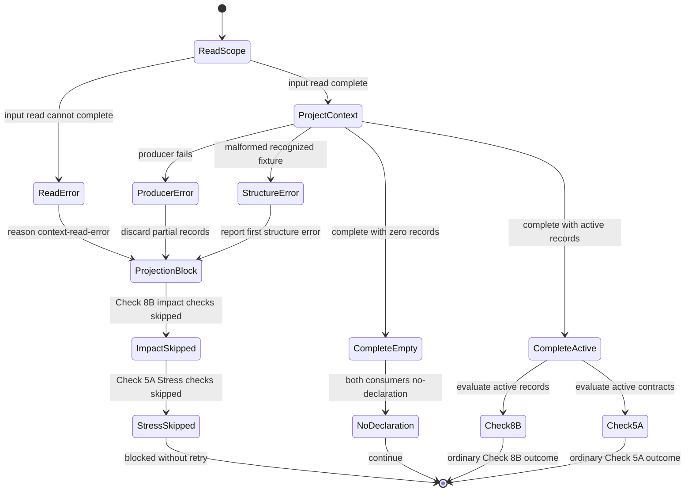
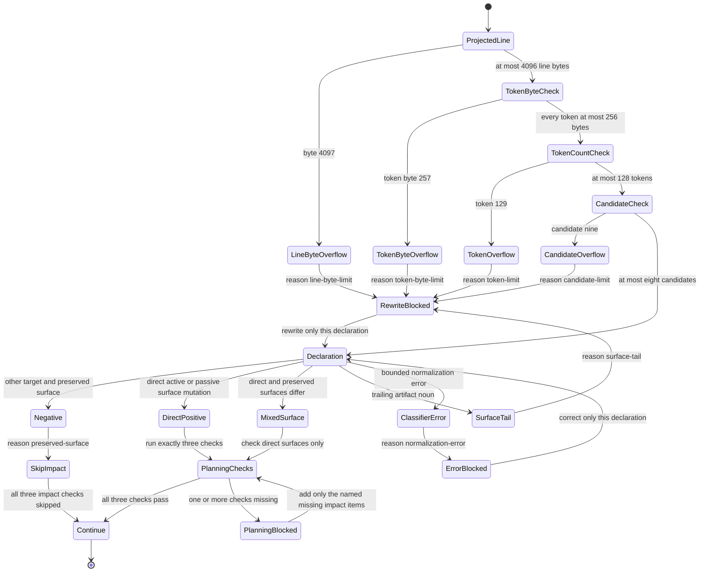
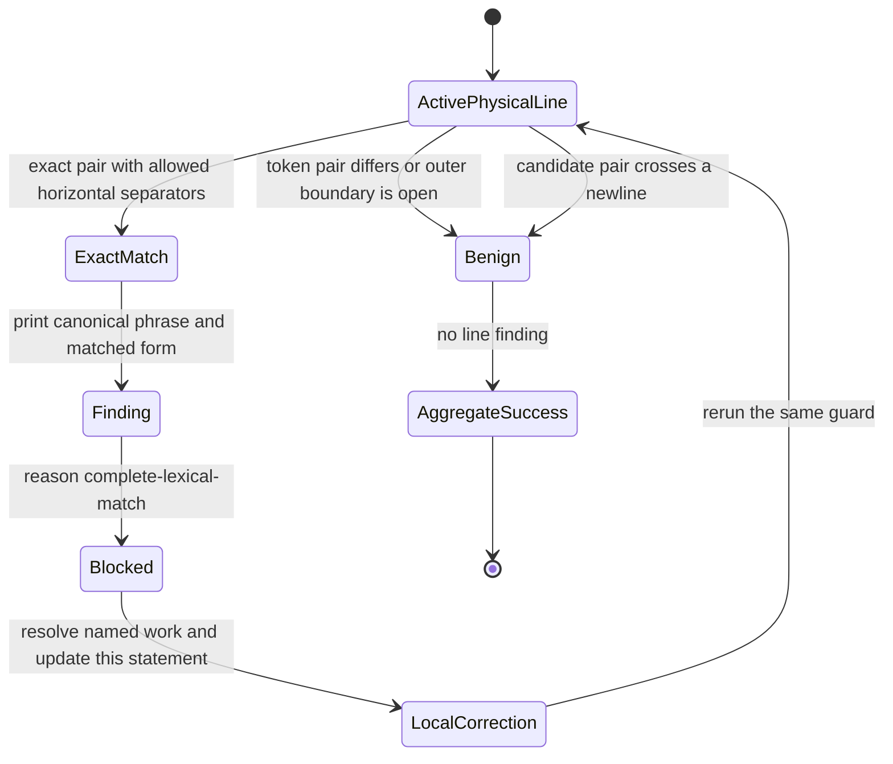

# Specification: BUG-032 Planning-Maturity Guard False Positives

## Purpose

Define the 26 active behavior contracts for BUG-032 after the post-implementation
security review. Preserve all 22 convergence-9 scenarios and add four security
behavior scenarios. Repair every exposed production-behavior defect without
weakening any protected positive or negative control.

Keep five artifact, test, generated-output, and routing corrections separate
from production behavior. Preserve G068 structural-strict matching. This bug
does not change G068 matcher policy or authorize same-ID rejection.

## Outcome Contract

- **Intent:** Make planning and release guards classify authorized contract
  facts. Do not infer behavior from fixture prose, partial receipt identity,
  transparent wrappers, contradictory metadata, or non-delivery terminality.
- **Success Signal:** All 26 active scenarios and their controls pass on one
  final byte epoch. The five Scope 4 corrections also pass their owning checks.
  Full framework validation and release checks pass before certification.
- **Hard Constraints:** Preserve the original 16 scenario IDs and use only the
  six authorized sparse additions and four security additions. Preserve every
  protected control, G068 structural-strict semantics, validate-owned
  certification, Bash 4+ support, and GNU/BSD portability. Bound context,
  line, token, and candidate work before semantic analysis. A physical line is
  limited to 4,096 bytes. One token is limited to 256 bytes. Do not start a
  normalizer process for each physical line.
- **Failure Condition:** The feature fails if any exposed behavior defect
  remains, any malformed context passes silently, or any protected control
  weakens. Artifact-only work must not become a behavior scenario. Rows 141
  and 145 must not become completion evidence. Stale scope completion must not
  appear as current truth.

## Operating Contract

This is an active `bugfix-fastlane` delivery packet, not a planning-only packet.
Scopes 1 through 3 are reopened and `In Progress` for convergence-9 behavior
repair. Scope 4 remains `In Progress`. Full framework validation, the release
check, terminal certification, and human acceptance remain unclaimed.

Validate-owned certification remains unchanged. Its per-scope projection may
still show the earlier completion epoch until `bubbles.validate` reconciles it.
That projection does not override this specification's active scope truth.

Earlier evidence remains historical unless this contract adjudicates it
explicitly. Tool-log row 141 is not admissible RED because it includes the
unauthorized G068 same-ID rejection assertion. Tool-log row 144 is accepted RED
for the authorized pre-repair A contract. Tool-log row 145 is a schema-v3 GREEN
attempt against post-implementation bytes, but it exited 1. Row 145 is
nonterminal and provides no completion evidence. This specification does not
infer its cause because the exact failure line has not been independently
recovered. C-GREEN independently verifies explicit v3 certification authority,
but Scope 3 remains nonterminal until design, planning, and test evidence agree.

### Single-Capability Justification

This work repairs existing guard-classification capabilities. It adds no
provider, adapter, strategy, screen, service, or reusable implementation
variant. Wrapper handling remains part of receipt identity, not a second
provider. A new capability foundation would duplicate existing guard contracts.

## Convergence-9 Contract Classification

### Production-Behavior Repair Map

| Harden finding | Active scenario | Reconciled behavior |
| --- | --- | --- |
| `BUG032-HARDEN9-C8B-PASSIVE-OBJECT-001` | SCN-032-013 | Passive grammar assigns removal to its actual object. A used consumer surface remains preserved. |
| `BUG032-HARDEN9-C8B-PASSIVE-TAIL-002` | SCN-032-015 | Active and passive artifact tails remain unresolved until ownership is explicit. |
| `BUG032-HARDEN9-C8B-PASSIVE-NEGATION-003` | SCN-032-014 | Owned `will not` negation preserves its surface. The `will be` control remains direct. |
| `BUG032-HARDEN9-C8B-CONTEXT-004` | SCN-032-020 | Check 8B evaluates active declarations and excludes fixture contexts. |
| `BUG032-HARDEN9-C5A-CONTEXT-005` | SCN-032-021 | Check 5A evaluates active contracts and excludes quoted fixtures. |
| `BUG032-HARDEN9-C5A-COVERAGE-PROXY-006` | SCN-032-022 | Performance promises require a canonical Stress row and faithful DoD item. |
| `BUG032-HARDEN9-C43-TARGET-OVERLAP-007` | SCN-032-006 | Receipt comparison uses every target for every command identity. |
| `BUG032-HARDEN9-C43-WRAPPER-IDENTITY-008` | SCN-032-007 | Transparent evidence wrappers preserve the underlying program identity. |
| `BUG032-HARDEN9-C43-STDOUTBYTES-009` | SCN-032-025 | A non-empty hash with zero-byte metadata fails closed. |
| `BUG032-HARDEN9-G101-CERTIFICATION-010` | SCN-032-026 | Explicit v3 certification controls delivery authority and mirror coherence. |
| `BUG032-HARDEN9-G040-BOUNDARIES-012` | SCN-032-028 | G040 matches complete prohibited phrases at lexical boundaries. |

### Scope 4 Verification Correction Map

These corrections verify artifacts or generated surfaces. They do not define
new production behavior scenarios.

| Harden finding | Scope 4 obligation | Required classification |
| --- | --- | --- |
| `BUG032-HARDEN9-EVIDENCE-ANCHORS-011` | Resolve checked claims to substantive owner evidence without rewriting history. | Evidence fidelity |
| `BUG032-HARDEN9-G068-DOD-013` | Repair the real SCN-032-014 DoD wording under current structural-strict matching. | Artifact fidelity |
| `BUG032-HARDEN9-RELEASE-MANIFEST-014` | Regenerate the release manifest after all tracked inputs settle. | Generated-output freshness |
| `BUG032-HARDEN9-TEST-PROSE-015` | Make test comments describe their adjacent assertions. | Test-comment truth |
| `BUG032-HARDEN9-REPORT-ROUTE-016` | Route only unresolved findings in the active report summary. | Report-routing truth |

### Scenario-ID Adjudication

| Planning IDs | Active disposition |
| --- | --- |
| SCN-032-001 through SCN-032-016 | Retain as the original active behavior contracts. |
| SCN-032-017 | Fold passive object ownership into SCN-032-013. |
| SCN-032-018 | Fold passive artifact tails into SCN-032-015. |
| SCN-032-019 | Fold passive `will not` ownership into SCN-032-014. |
| SCN-032-020, SCN-032-021, SCN-032-022 | Retain as genuine context and Stress-coverage behavior. |
| SCN-032-023 | Fold complete target sets into SCN-032-006. |
| SCN-032-024 | Fold transparent wrapper identity into SCN-032-007. |
| SCN-032-025, SCN-032-026, SCN-032-028 | Retain as genuine metadata, certification, and lexical-boundary behavior. |
| SCN-032-027, SCN-032-030, SCN-032-031, SCN-032-032 | Treat as Scope 4 verification obligations, not active behavior scenarios. |
| SCN-032-029 | Remove as unauthorized. Same-ID rejection conflicts with current G068 structural-strict semantics. |
| SCN-032-033 through SCN-032-036 | Add as security behavior contracts. These IDs have no prior verification-only or rejected meaning. |

## Post-Implementation Security Contract Classification

| Security finding | Active scenario | Required behavior |
| --- | --- | --- |
| `BUG032-SEC-001` | SCN-032-033 | A failed or incomplete context projection blocks both planning classifiers. Empty or partial output cannot become an ordinary exemption. |
| `BUG032-SEC-002` | SCN-032-034 | Fence identity and fixture-table structure are exact. Malformed context blocks instead of hiding active declarations. |
| `BUG032-SEC-003` | SCN-032-035 | G040 treats equivalent case and horizontal separator runs consistently for only the exact prohibited phrases. |
| `BUG032-SEC-004` | SCN-032-036 | Check 8B enforces line and token byte limits before costly accumulation while preserving token-count and candidate-count boundaries. |

### Preserved Prior Source-Review Map

| Finding | Grounded pre-refinement exposure | Active contract |
| --- | --- | --- |
| `BUG032-CR-01` | `_check8b_mutation_is_negated` receives one line-global `leading_no` value and also searches backward for `without`. Either condition can absorb a later direct mutation. | SCN-032-014 and FR-032-022 bind negation to its own phrase. |
| `BUG032-CR-02` | `_check8b_surface_from` accepts the first known surface noun without proving that the surface remains the mutation object's head. | SCN-032-015 and FR-032-023 require surface-phrase closure or conservative ambiguity. |
| `BUG032-CR-03` | `check8b_classify_line` normalizes and materializes the full line before it checks the 128-token limit. | SCN-032-016 and FR-032-024 make the token bound operational. |
| `BUG032-ENG-01` | `check8b_classify_line` starts two `tr` processes for each physical line before classification. | FR-032-027 and the non-functional requirements prohibit per-line process fan-out. |
| `BUG032-ENG-02` | The persistent Check 8B block covers only over-limit token and candidate inputs. It lacks the requested exact-limit twins, helper-error path, negation adversaries, and trailing-noun adversaries. | SCN-032-014 through SCN-032-016, FR-032-025, FR-032-026, and FR-032-028 define the complete persistent matrix. |

## Definitions

- **Consumer interface mutation:** an explicit rename, removal, move, or
  deprecation of a consumer-visible identity. Identities include routes, paths,
  endpoints, contracts, APIs, URLs, slugs, identifiers, symbols, links,
  breadcrumbs, navigation targets, and redirects.
- **Replacement semantics:** prose describing stale generated material,
  providers, implementations, lifecycle states, or conceptual successors without
  changing a consumer-visible interface identity.
- **Affirmative performance contract:** a declared latency, throughput, response
  time, p95, p99, SLA, or SLO target, budget, threshold, or guarantee.
- **Explicit opt-out:** wording that says SLA/SLO or observability evidence is
  absent, disabled, not applicable, unavailable, or opted out.
- **Deterministic validator sibling executions:** separate runs of one normalized
  validator over distinct targets or input closures. They have independent
  provenance, equal numeric exits, and known non-mixed evidence categories.
  Category labels may agree or differ. These siblings may emit identical
  non-empty stdout.
- **Delivery-capable terminal state:** a state whose resolved workflow contract
  represents shipped implementation rather than planning, documentation,
  validation-only review, or prototype-only output.
- **Negation scope:** the mutation or auxiliary phrase directly governed by
  `no`, `not`, `never`, or `without`. Negation never applies to every later
  mutation on the same physical line.
- **Completed consumer-surface phrase:** a consumer surface that remains the
  head of the mutation subject or object. An active surface phrase ends at a
  declaration boundary or before an explicit source, destination, or timing
  relationship. A passive surface phrase connects through an auxiliary to the
  mutation verb. An ordinary trailing artifact noun makes the relationship
  unresolved.
- **Examined token:** a token admitted to semantic relationship analysis. The
  classifier may detect the delimiter that starts token 129 only as an overflow
  sentinel. It must not normalize, retain, or semantically inspect that token or
  any later token.
- **Mutation candidate:** one supported mutation verb submitted to relationship
  analysis. Detecting candidate nine establishes overflow without evaluating
  that candidate or any later candidate.
- **Classifier error:** a non-classification result caused by invalid invocation
  or failed bounded normalization. It is distinct from ambiguous prose and can
  never exempt a declaration.
- **Active declaration:** normative scope prose that declares required behavior,
  implementation intent, or a measurable contract. Fenced scenarios, Examples
  rows, and Test Plan fixture or expected-result cells are not active
  declarations.
- **Canonical Stress coverage:** a Test Plan row whose category is Stress plus
  a faithful DoD item for the same affirmative performance contract. A generic
  occurrence of the word `stress` is not coverage.
- **Complete target set:** every target or input closure represented by every
  receipt under one command identity within a substantive hash group.
- **Transparent evidence wrapper:** a capture or supervision command that
  preserves the wrapped program's identity. The wrapper remains provenance but
  cannot replace the underlying program identity.
- **Contradictory stdout metadata:** a non-empty stdout hash paired with a zero
  byte count. The receipt remains in fail-closed analysis.
- **Explicit v3 certification authority:** a present `certification` object.
  Its status and certified phases control delivery evaluation. Legacy phase
  fields cannot override it.
- **Structural-strict G068 semantics:** G068 compares scenario and DoD structure
  for faithful coverage. It does not require a new same-ID rejection policy.
- **Lexical phrase boundary:** the complete start and end of a prohibited G040
  phrase. A matching prefix inside benign wording is not a violation.
- **Completed context projection:** a projection whose producer and input read
  both finish successfully after emitting zero or more complete records.
- **Fixture fence identity:** the complete marker character and delimiter
  length of a recognized fixture opener. Only the identical marker closes it.
- **Well-formed fixture table:** a table with a header, delimiter row, at least
  one data row, and one stable column count across all rows.
- **Horizontal separator run:** one or more ASCII spaces, horizontal tabs, or
  hyphens between two complete lexical tokens. A newline is never equivalent.
- **Byte-bound overflow:** the first byte beyond a declared line or token
  limit. That byte is an overflow sentinel and does not enter semantic work.

## Actors And Use Cases

| Actor | Goal | Permission boundary |
| --- | --- | --- |
| Scope author | Write truthful planning declarations that receive predictable guard outcomes. | May revise owned planning prose. Cannot weaken guard policy or certification. |
| Evidence reviewer | Distinguish independent deterministic executions from reused or contradictory receipts. | May inspect receipt diagnostics. Cannot relabel metadata or execution history. |
| Release reviewer | Determine whether a required feature represents coherent delivered implementation. | May run release reconciliation. Cannot override explicit certification authority. |

### UC-032-001 - Classify planning declarations

- **Actor:** Scope author
- **Preconditions:** A scope contains active declarations and may also contain
  scenario or Test Plan fixtures.
- **Main Flow:** The author runs the state-transition guard. The guard excludes
  fixture contexts, classifies each active declaration, and reports any exact
  planning obligation.
- **Alternative Flows:** Ambiguous ownership, finite overflow, and classifier
  errors block with local correction. Negative declarations skip impact checks.
- **Postconditions:** Only owned consumer mutations and affirmative performance
  contracts impose their respective planning requirements.

### UC-032-002 - Reconcile equal-output receipts

- **Actor:** Evidence reviewer
- **Preconditions:** Multiple receipts share a substantive stdout hash.
- **Main Flow:** Check 43 compares underlying programs, complete target sets,
  numeric exits, independent provenance, and category sanity.
- **Alternative Flows:** Overlapping targets, incompatible programs, missing
  independence, or contradictory byte metadata remain blocking.
- **Postconditions:** Only proven deterministic siblings avoid a clone finding.

### UC-032-003 - Reconcile required release delivery

- **Actor:** Release reviewer
- **Preconditions:** A release packet marks a bound feature as required.
- **Main Flow:** G101 resolves the workflow mode and certification authority,
  checks mirror coherence, and reports DELIVERED or NOT-DELIVERED.
- **Alternative Flows:** Legacy compatibility applies only when no explicit
  certification object exists.
- **Postconditions:** Planning, documentation, validation-only, prototype, and
  certification-conflict states cannot satisfy required delivery.

### UC-032-004 - Verify artifact truth separately

- **Actor:** Evidence reviewer
- **Preconditions:** The behavior repair has reached a stable planning epoch.
- **Main Flow:** Scope 4 checks evidence anchors, DoD fidelity, generated-output
  freshness, test-comment truth, and report routing under their owning tools.
- **Alternative Flows:** Any stale or unsupported artifact remains nonterminal.
- **Postconditions:** Artifact corrections do not inflate the behavior-scenario
  count or change G068 matcher policy.

### UC-032-005 - Resolve malformed or oversized planning input

- **Actor:** Scope author
- **Preconditions:** A scope may contain fixture structures, projection
  failures, separator variants, or oversized declarations.
- **Main Flow:** The author runs the existing guard. The guard validates context
  completion and finite input bounds before it classifies active declarations.
- **Alternative Flows:** Malformed context, read failure, and byte overflow
  block with a local diagnostic. Valid fixtures remain inactive.
- **Postconditions:** Neither planning classifier can convert an input failure
  into an ordinary no-contract or no-mutation result.

## Exposure Contract

| Capability | Surface class | Surface id | Status | Plan |
| --- | --- | --- | --- | --- |
| Active declaration and planning-coverage classification | cliCommand | `bash bubbles/scripts/state-transition-guard.sh <feature-dir>` | planned | BUG-032 Scope 1 convergence-9 repair |
| Receipt identity and contradiction classification | cliCommand | `bash bubbles/scripts/state-transition-guard.sh <feature-dir>` | planned | BUG-032 Scope 2 convergence-9 repair |
| Required delivery reconciliation | cliCommand | `bash bubbles/scripts/release-delivery-reconciliation-guard.sh --repo-root <dir>` | planned | BUG-032 Scope 3 convergence-9 repair |
| Artifact and generated-surface fidelity | internal | BUG-032 Scope 4 validation workflow | internal | Consumed by the BUG-032 validation and audit phases |

## User Scenarios

### SCN-032-001 - Stale generation path replacement is not an interface mutation

```gherkin
Scenario: A stale generated path is replaced without changing a consumer interface
  Given a scope says a stale generation path is replaced by current generated output
  And the scope does not rename, remove, move, or deprecate a consumer route, path, endpoint, contract, or identifier
  When Check 8B classifies the scope
  Then the scope is not required to add a Consumer Impact Sweep
```

### SCN-032-002 - Provider and lifecycle replacement is not an interface mutation

```gherkin
Scenario Outline: Replacement semantics remain outside consumer mutation classification
  Given a scope describes <replacement>
  And no consumer-visible interface identity changes
  When Check 8B classifies the scope
  Then the scope is not required to add a Consumer Impact Sweep

  Examples:
    | replacement |
    | a provider implementation being replaced |
    | a lifecycle state being replaced by its successor |
    | a generated artifact replacing a stale artifact path |
```

### SCN-032-003 - Actual interface rename or removal still triggers

```gherkin
Scenario Outline: A real consumer interface mutation requires impact planning
  Given a scope explicitly <mutation> a consumer-visible <surface>
  When Check 8B classifies the scope
  Then the scope requires a Consumer Impact Sweep
  And the scope requires the consumer-impact DoD item
  And the scope must enumerate affected consumer surfaces

  Examples:
    | mutation | surface |
    | renames | route |
    | removes | path |
    | renames | endpoint |
    | removes | contract |
    | renames | identifier |
```

### SCN-032-004 - Explicit no-SLO wording does not trigger stress coverage

```gherkin
Scenario: An opted-out observability sentence is not an SLA promise
  Given a scope says observability is opted out and no trace or SLO evidence is injected
  And the scope declares no latency, throughput, response-time, p95, p99, SLA, or SLO target
  When Check 5A classifies the scope
  Then the scope is not required to add stress coverage
```

### SCN-032-005 - Genuine performance promises still trigger stress coverage

```gherkin
Scenario Outline: An affirmative performance contract requires stress coverage
  Given a scope declares <promise>
  When Check 5A classifies the scope
  Then the scope requires explicit stress coverage

  Examples:
    | promise |
    | an SLO of 99.9 percent availability |
    | a p95 latency budget of 200 ms |
    | a throughput target of 1000 requests per second |
    | a p99 response-time threshold of 500 ms |
```

### SCN-032-006 - Complete independent validator target sets are sibling evidence

```gherkin
Scenario Outline: Complete target sets decide deterministic sibling independence
  Given receipts share one non-empty stdout hash and one normalized validator program
  And every command identity contributes its complete target or input-closure set
  And the complete target sets are <target relation>
  And execution provenance is independent and numeric exit status matches
  And every evidence category is known and non-mixed
  When Check 43 evaluates receipt identity
  Then the result is <result>

  Examples:
    | target relation | result |
    | disjoint | accept deterministic validator siblings |
    | overlapping between distinct command identities | report a receipt clone |
```

### SCN-032-007 - Incompatible normalized program identities still block

```gherkin
Scenario Outline: One substantive output hash appears under incompatible normalized program identities
  Given receipts for <first program> and <second program> share one non-empty stdout hash
  And their normalized program identities are incompatible
  And each receipt has a known non-mixed evidence category
  And either program may appear behind a transparent evidence-capture wrapper
  When Check 43 evaluates the underlying wrapped program identities
  Then it reports a receipt clone
  And the finding names the incompatible normalized program identities
  And category labels appear only as diagnostic context, not receipt identity
  And a common wrapper does not collapse the underlying program identities
  And the same wrapped validator over disjoint targets remains a sibling control

  Examples:
    | first program | second program |
    | cargo test | npm run lint |
    | npm run lint | npm run test |
```

### SCN-032-008 - Empty stdout remains exempt

```gherkin
Scenario: Different commands emit no stdout
  Given multiple receipts carry the SHA-256 digest of empty stdout
  When Check 43 evaluates receipt identity
  Then it does not report a receipt clone
  And the exemption does not depend on the optional stdoutBytes field
```

### SCN-032-009 - Planning maturity is not release delivery

```gherkin
Scenario: A validate-certified product-to-planning packet reaches specs_hardened
  Given a required release feature binds a spec in product-to-planning mode
  And the spec status and certification status are specs_hardened
  And validate appears in certified completed phases
  When G101 reconciles delivery=required
  Then the guard exits 1
  And the feature is reported NOT-DELIVERED
```

### SCN-032-010 - Validate-certified done delivery remains accepted

```gherkin
Scenario: A full-delivery packet is done and validate-certified
  Given a required release feature binds a full-delivery spec
  And its top-level and explicit certification statuses are done
  And validate appears in explicit certified completed phases
  When G101 reconciles delivery=required
  Then the guard exits 0
  And the feature is reported DELIVERED
```

### SCN-032-011 - Prototype output remains non-deliverable

```gherkin
Scenario: A validate-certified prototype reaches delivered_prototype
  Given a required release feature binds a prototype-tier spec
  And the spec status is delivered_prototype
  And validate appears in certified completed phases
  When G101 reconciles delivery=required
  Then the guard exits 1
  And the feature is reported NOT-DELIVERED
```

### SCN-032-012 - Delivery aliases are resolved through mode semantics

```gherkin
Scenario Outline: Terminal status meaning follows the resolved mode contract
  Given a required release feature has status <status>
  And its resolved workflow mode is <mode>
  And validate certification is present
  When G101 reconciles delivery=required
  Then the delivery result is <result>

  Examples:
    | status | mode | result |
    | validated | validate-only | NOT-DELIVERED |
    | docs_updated | docs-only | NOT-DELIVERED |
    | delivered_pending_activation | dark-launch-shipped | DELIVERED |
    | delivered_fast | rapid-tool-delivery | DELIVERED |
```

### SCN-032-013 - An unrelated object mutation is not an interface mutation

```gherkin
Scenario Outline: Another object mutation does not transfer to a used consumer surface
  Given a scope says <declaration>
  And the removal action applies to <other target> rather than the public API route
  And the public API route is used or explicitly preserved
  When Check 8B classifies the scope
  Then the scope is not required to add a Consumer Impact Sweep
  And a scope that directly removes the public API route still requires a Consumer Impact Sweep

  Examples:
    | declaration | other target |
    | "Remove stale cache entries before invoking the public API route without changing that route." | stale cache entries |
    | "The public API route is used while stale cache entries are removed." | stale cache entries |
```

### SCN-032-014 - Negation cannot suppress a later direct mutation

```gherkin
Scenario Outline: An unrelated negation does not exempt a direct route removal
  Given one physical scope line says <declaration>
  And <negated phrase> does not negate the route-removal relationship
  When Check 8B classifies the line
  Then route remains a direct mutation surface
  And the classification is direct-positive
  And Check 8B evaluates the Consumer Impact Sweep section, completion item, and affected-consumer inventory
  And "The public route will not be removed." remains negative with route preserved
  And "The public route will be removed." remains direct-positive

  Examples:
    | declaration | negated phrase |
    | No cache migration is required; remove the public route. | cache migration requirement |
    | No cache migration is required. The public route is removed. | cache migration requirement |
    | Without migration remove the public route. | migration auxiliary phrase |
    | The public route without migration is removed. | migration auxiliary phrase |
```

### SCN-032-015 - A trailing artifact noun is not a direct surface mutation

```gherkin
Scenario Outline: A trailing artifact noun prevents a guessed surface mutation
  Given a scope says <declaration>
  And <artifact> can be the mutation object instead of the preceding consumer surface
  When Check 8B classifies the declaration
  Then the classification is ambiguous with reason surface-tail
  And the guard blocks with a local rewrite that distinguishes the artifact from the consumer surface
  And the guard does not run Consumer Impact Sweep checks for a guessed surface mutation
  And <direct control> remains direct-positive
  And <clarified artifact declaration> is negative with its consumer surface preserved

  Examples:
    | declaration | artifact | direct control | clarified artifact declaration |
    | Remove the public API route example. | example | Remove the public API route. | Remove the route example. The public API route remains unchanged. |
    | Remove the endpoint test. | test | Remove the endpoint. | Remove the endpoint test. The public endpoint remains unchanged. |
    | Remove the contract fixture. | fixture | Remove the contract. | Remove the contract fixture. The public contract remains unchanged. |
    | Remove the link documentation. | documentation | Remove the link. | Remove the link documentation. The public link remains unchanged. |
    | The endpoint test is removed. | test | The endpoint is removed. | The endpoint test is removed. The public endpoint remains unchanged. |
    | The route example is removed. | example | The public route is removed. | The route example is removed. The public route remains unchanged. |
```

### SCN-032-016 - Finite limits and classifier errors fail closed

```gherkin
Scenario Outline: Exact limits proceed and the first overflow or helper error blocks
  Given Check 8B receives <condition>
  When the classifier and guard evaluate that condition
  Then the classifier reports <classification> with reason <reason>
  And the guard must <guard behavior>

  Examples:
    | condition | classification | reason | guard behavior |
    | exactly 126 neutral tokens followed by "remove route", for 128 tokens total | direct-positive | direct | evaluate all three Consumer Impact Sweep requirements |
    | the same declaration with one extra leading neutral token, for 129 tokens total | ambiguous | token-limit | block before Consumer Impact Sweep checks and request a bounded rewrite |
    | exactly eight valid direct mutation-and-surface candidate pairs | direct-positive | direct | evaluate all three Consumer Impact Sweep requirements |
    | the same candidate sequence with a ninth valid pair | ambiguous | candidate-limit | block before Consumer Impact Sweep checks and request fewer local declarations |
    | bounded normalization returns a nonzero helper result | error | normalization-error | block before Consumer Impact Sweep checks and identify a classifier failure |
```

### SCN-032-020 - Fixture prose is not an active interface declaration

```gherkin
Scenario Outline: Check 8B distinguishes fixtures from active declarations
  Given <context> contains "Remove the endpoint test."
  When Check 8B scans the complete scope artifact
  Then fixture text does not establish an active interface declaration
  And the identical sentence in an active declaration remains ambiguous with reason surface-tail

  Examples:
    | context |
    | a fenced Gherkin scenario |
    | an Examples table cell |
    | a Test Plan description or expected-result cell |
```

### SCN-032-021 - Quoted performance fixtures are not active contracts

```gherkin
Scenario Outline: Check 5A distinguishes fixtures from active performance contracts
  Given <context> contains "The p95 latency budget is 200 ms."
  When Check 5A scans the complete scope artifact
  Then fixture text does not establish an affirmative performance contract
  And the identical sentence in an active declaration remains affirmative

  Examples:
    | context |
    | a fenced Gherkin scenario |
    | an Examples table cell |
    | a Test Plan description or expected-result cell |
```

### SCN-032-022 - Stress coverage requires canonical planning structure

```gherkin
Scenario: Prose-only stress wording cannot satisfy performance coverage
  Given an active scope declares an affirmative p95 latency contract
  And Gherkin, prose, or test descriptions contain the word stress
  But the scope has no canonical Stress Test Plan row or faithful DoD item
  When Check 5A validates coverage
  Then coverage fails and names both missing structures
  And a canonical Stress row with its faithful DoD item remains an accepted control
```

### SCN-032-025 - Contradictory stdout metadata fails closed

```gherkin
Scenario: A non-empty stdout hash conflicts with zero-byte metadata
  Given a receipt carries a non-empty stdout hash and reports zero stdout bytes
  When Check 43 evaluates substantive output
  Then it reports contradictory metadata and retains the receipt in fail-closed analysis
  And the canonical empty hash with zero or absent byte metadata remains exempt
  And non-empty output with a positive byte count follows ordinary identity analysis
```

### SCN-032-026 - Explicit v3 certification is authoritative for delivery

```gherkin
Scenario Outline: Certification shape determines delivery authority
  Given a required full-delivery feature has <state shape>
  When G101 reconciles delivery=required
  Then the delivery result is <result>
  And the decision source is <authority>

  Examples:
    | state shape | result | authority |
    | coherent top-level and certification done with validate certified | DELIVERED | explicit v3 certification |
    | top-level done and certification in_progress | NOT-DELIVERED | explicit v3 certification mirror |
    | certification in_progress while legacy completedPhases contains validate | NOT-DELIVERED | explicit v3 certification object |
    | no certification object with legacy done and legacy validate phase | DELIVERED | documented legacy compatibility |
```

### SCN-032-028 - G040 matches complete prohibited phrases only

```gherkin
Scenario Outline: Complete lexical boundaries distinguish prohibited and benign wording
  Given an active report or scope line contains <text>
  When G040 evaluates incomplete-work language outside historical evidence
  Then the result is <result>

  Examples:
    | text | result |
    | A separate preservation clause stays negative. | allowed |
    | These are declared future workflow obligations. | allowed |
    | Move this work to a separate ticket. | blocked |
    | Implement this in a future scope. | blocked |
```

### SCN-032-033 - Context projection failures block both planning classifiers

```gherkin
Scenario Outline: Only a completed context projection can produce an ordinary classification
  Given the scope context projection encounters <condition>
  When Check 8B and Check 5A consume the projection
  Then both checks produce <outcome>
  And no failed or incomplete projection is treated as no mutation or no performance contract
  And partial records from a failed projection cannot establish or exempt an obligation
  And the first projection failure ends processing without an automatic retry

  Examples:
    | condition | outcome |
    | a readable scope that emits a complete empty projection | their ordinary no-declaration results |
    | a readable scope that emits complete active records and finishes successfully | their ordinary semantic results |
    | a producer failure before any record | a blocking classifier error with the scope and failure stage named |
    | a producer failure after a valid record prefix | a blocking classifier error that discards the partial projection |
    | an input-read failure before completion | a blocking classifier error with the read failure named |
```

### SCN-032-034 - Markdown context identity and fixture structure fail closed

```gherkin
Scenario Outline: Exact fixture structure decides exclusion from semantic classification
  Given a scope contains <context>
  When the shared context projection validates the complete scope
  Then the projection produces <result>
  And malformed structure blocks both Check 8B and Check 5A
  And valid fixture exclusion does not weaken an identical active declaration

  Examples:
    | context | result |
    | a recognized Gherkin fixture fence closed by the identical marker type and full delimiter length | fixture rows excluded |
    | a four-character fixture fence closed by a three-character marker | fence-identity error with opener and closing locations |
    | a backtick fixture fence closed by a tilde marker | fence-identity error with both marker types named |
    | a recognized fixture fence with no exact closing marker | unclosed-fence error with the opener location |
    | an Examples table with a header delimiter row and consistent data rows | fixture rows excluded |
    | an Examples table missing its delimiter row or carrying inconsistent columns | examples-table error with the first malformed row |
    | a Test Plan table with a header delimiter row and consistent data rows | fixture cells excluded and structural rows preserved |
    | a Test Plan table missing its delimiter row or carrying inconsistent columns | test-plan-table error with the first malformed row |
    | an ordinary text fence containing an active mutation declaration | the declaration remains active and enforceable |
```

### SCN-032-035 - G040 recognizes equivalent horizontal separators

```gherkin
Scenario Outline: Exact prohibited phrases remain blocking across equivalent separators and case
  Given an active scope or report line contains <text>
  When G040 evaluates that physical line outside historical evidence
  Then the result is <result>
  And a blocked result names the canonical prohibited phrase and original matched form
  And matching never crosses a newline or expands to a different second token

  Examples:
    | text | result |
    | Move this work to a separate ticket. | blocked |
    | Move this work to a Separate  Ticket. | blocked |
    | separate followed by one horizontal tab and ticket | blocked |
    | Move this work to a separate-ticket. | blocked |
    | Implement this in a FUTURE SCOPE. | blocked |
    | future followed by mixed spaces and horizontal tabs and scope | blocked |
    | Implement this in a future-scope. | blocked |
    | A separate preservation clause stays negative. | allowed |
    | These are future workflow obligations. | allowed |
    | The text says separately ticketed. | allowed |
    | The text says future scoped analysis. | allowed |
```

### SCN-032-036 - Line and token byte limits bound Check 8B work

```gherkin
Scenario Outline: Exact byte limits proceed and the first excess byte blocks before semantic accumulation
  Given Check 8B receives <condition>
  When it validates byte bounds before token and relationship analysis
  Then it produces <classification> with reason <reason>
  And it reports <boundary>
  And an overflow skips all three Consumer Impact Sweep checks

  Examples:
    | condition | classification | reason | boundary |
    | a direct declaration padded to exactly 4096 bytes with no token above 256 bytes | direct-positive | direct | line-bytes=4096/4096 |
    | the same declaration with byte 4097 | ambiguous | line-byte-limit | line-bytes=4097/4096:first-overflow |
    | a direct declaration with one neutral token of exactly 256 bytes | direct-positive | direct | token-bytes=256/256 |
    | the same declaration with token byte 257 | ambiguous | token-byte-limit | token-bytes=257/256:first-overflow |
    | one 100000-byte token | ambiguous | line-byte-limit | line-bytes=4097/4096:first-overflow |

  And the line-overflow decision inspects at most 4097 bytes
  And the token-overflow decision retains at most 256 token bytes and inspects byte 257 only as a sentinel
  And the existing 128 and 129 token outcomes remain unchanged
  And the existing eight and nine candidate outcomes remain unchanged
```

## Functional Requirements

- **FR-032-001:** Check 8B MUST classify only explicit consumer-interface
  rename, removal, move, or deprecation semantics as consumer-impact work.
- **FR-032-002:** `replace`, `replaced`, and generic `migration` wording MUST NOT
  independently establish a consumer-interface mutation.
- **FR-032-003:** Check 8B MUST retain positive coverage for actual route, path,
  endpoint, contract, and identifier rename/removal declarations.
- **FR-032-004:** Check 5A MUST distinguish an affirmative performance contract
  from an explicit no-SLA/no-SLO/opted-out posture.
- **FR-032-005:** A quantitative target, budget, threshold, or guarantee MUST
  take precedence over a broad negation suppression when both appear.
- **FR-032-006:** Check 5A MUST retain positive coverage for SLA, SLO, latency,
  throughput, p95, p99, and response-time declarations.
- **FR-032-007:** Check 43 MUST preserve the canonical empty-stdout digest
  exemption with zero or absent `stdoutBytes`. A non-empty hash with zero-byte
  metadata MUST NOT receive that exemption.
- **FR-032-008:** Check 43 MUST derive receipt identity from the underlying
  normalized program, including `run` or `exec` dispatch scripts and wrapped
  argv behind transparent evidence-capture commands. It MUST also use every
  target or input closure, numeric exit status, and execution provenance.
  Evidence category remains known non-mixed diagnostic metadata only.
- **FR-032-009:** Check 43 MUST accept one normalized program over distinct
  targets or input closures when numeric exit status matches. Execution
  provenance MUST be independent. Categories MUST be known and non-mixed.
  Category labels MAY agree or differ.
- **FR-032-010:** Check 43 MUST block a substantive hash shared by incompatible
  underlying program identities. It MUST compare complete target sets and block
  any overlap between distinct command identities. A category difference or a
  common transparent wrapper alone MUST NOT decide clone identity.
- **FR-032-011:** Missing or contradictory receipt metadata MUST NOT create an
  exemption. A non-empty hash with zero-byte metadata MUST be named and retained
  in fail-closed analysis. Unproven execution independence remains conservative.
- **FR-032-012:** G101 MUST resolve terminal status against the effective mode
  contract and explicit v3 certification. When a certification object exists,
  its status and certified phases are authoritative. A status-mirror conflict
  MUST be NOT-DELIVERED.
- **FR-032-013:** `specs_hardened`, `validated`, and `docs_updated` MUST NOT
  satisfy `delivery=required` under their current planning, validation-only, and
  docs-only mode classes.
- **FR-032-014:** Coherent `done` with explicit validate certification MUST
  remain accepted for a delivery-capable packet. An explicitly non-delivery
  mode claiming `done` MUST be rejected. Legacy phase compatibility MAY apply
  only when the certification object is absent.
- **FR-032-015:** `delivered_pending_activation` MUST remain accepted only when
  it is the terminal state of a resolved delivery-capable mode and validate
  certification is present.
- **FR-032-016:** `delivered_fast` MUST remain accepted only for its resolved
  rapid delivery mode and validate certification.
- **FR-032-017:** `delivered_prototype` MUST remain refused regardless of
  validate certification.
- **FR-032-018:** Every negative regression MUST have an adversarial positive
  twin that fails if the implementation disables or broadly exempts the guard.
- **FR-032-019:** Regression coverage MUST persist in
  `state-transition-guard-selftest.sh` and
  `release-delivery-reconciliation-guard-selftest.sh`.
- **FR-032-020:** Source comments, gate metadata, shared documentation, and
  adjacent test comments MUST describe the active contracts. Their correction
  remains Scope 4 verification work and MUST NOT create behavior scenarios.
- **FR-032-021:** Check 8B MUST require a bounded active or passive relationship
  that makes the consumer surface the subject or object of its own mutation. A
  surface used in another phrase MUST NOT inherit a passive mutation of another
  object. Direct rename, removal, move, and deprecation remain positive.
- **FR-032-022:** Negation MUST bind only to its mutation, noun, preservation,
  or auxiliary phrase. Unrelated `no` or `without` wording MUST NOT suppress a
  later direct mutation. Owned `will not be removed` remains negative, while
  `will be removed` remains direct-positive and runs all three impact checks.
- **FR-032-023:** A direct classification MUST require a completed active or
  passive consumer-surface phrase. A trailing artifact noun returns
  `ambiguous` with reason `surface-tail` until explicit wording establishes
  ownership. A clarified artifact mutation remains negative with its consumer
  surface preserved. Guessed impact checks remain skipped.
- **FR-032-024:** Check 8B MUST collect tokens through a bounded path before
  whole-line normalization, materialization, or semantic scanning. Exactly 128
  examined tokens MUST remain eligible for ordinary classification. Detecting
  token 129 MUST immediately return `ambiguous` with reason `token-limit`.
  Token 129 and all later tokens MUST NOT enter semantic relationship analysis.
- **FR-032-025:** Exactly eight mutation candidates MUST remain eligible for
  ordinary classification. Detecting candidate nine MUST immediately return
  `ambiguous` with reason `candidate-limit`. Candidate nine and all later
  candidates MUST NOT enter relationship analysis.
- **FR-032-026:** A classifier helper error MUST fail closed as `error` with a
  stable reason. The operator-visible diagnostic MUST identify the scope,
  classification, reason, and local correction. It MUST NOT run impact-planning
  checks or treat the failure as a negative exemption.
- **FR-032-027:** Check 8B normalization MUST NOT start external processes per
  physical line. It MUST use Bash 4+ in-process operations or one bounded
  per-scope normalization pass. Either approach MUST preserve GNU and BSD
  portability, deterministic classifications, and the operator-visible
  diagnostic contract.
- **FR-032-028:** Persistent regression coverage MUST include exact 128 and 129
  token twins plus exact eight and nine candidate twins. It MUST include
  guard-level `candidate-limit` and helper-error paths. It MUST cover leading
  and nearby negation plus every SCN-032-015 trailing-noun adversary. Each
  direct-positive and mixed-surface guard case MUST exercise all three impact
  checks. Each negative or ambiguous case MUST retain a direct-positive twin.
- **FR-032-029:** Check 8B and Check 5A MUST classify only active declarations.
  They MUST exclude fenced Gherkin, Examples rows, and Test Plan fixture or
  expected-result cells. Identical active declarations remain enforceable.
- **FR-032-030:** An affirmative performance contract MUST require a canonical
  Stress Test Plan row and a faithful DoD item. Generic prose or fixture text
  containing `stress` MUST NOT satisfy coverage.
- **FR-032-031:** G040 MUST match complete prohibited phrases at lexical
  boundaries outside historical evidence. Benign prefixes such as `separate
  preservation` and `future workflow` MUST remain allowed. Exact prohibited
  `separate ticket` and `future scope` phrases remain blocking.
- **FR-032-032:** Each context projection MUST expose whether its producer and
  input read completed. Zero emitted records count as success only after both
  completion signals succeed.
- **FR-032-033:** A projection producer failure, input-read failure, or partial
  projection MUST block both Check 8B and Check 5A as a classifier error. Both
  checks MUST discard partial semantic results. Neither check may report an
  ordinary exemption from failed input.
- **FR-032-034:** A recognized fixture fence MUST retain its complete opener
  marker type and delimiter length. Only an identical complete marker may close
  it. A mismatch or missing closure MUST fail closed.
- **FR-032-035:** Examples and Test Plan fixture tables MUST have a header,
  delimiter row, at least one data row, and consistent column counts. Malformed
  structures MUST block both planning classifiers. Valid Test Plan rows MUST
  remain available to structural coverage checks.
- **FR-032-036:** Only recognized fixture contexts may suppress semantic
  classification. An ordinary text fence MUST NOT hide an active planning
  declaration. Identical active prose outside a valid fixture remains
  enforceable.
- **FR-032-037:** G040 MUST match the exact token pairs `separate ticket` and
  `future scope` case-insensitively. One or more ASCII spaces, horizontal tabs,
  hyphens, or mixtures of those separators MUST be equivalent. Outer lexical
  boundaries MUST remain exact, and matching MUST NOT cross a newline.
- **FR-032-038:** Check 8B MUST admit at most 4,096 bytes from one physical line
  and at most 256 bytes from one token. It MUST decide line overflow after at
  most 4,097 inspected bytes. It MUST decide token overflow after at most 257
  inspected token bytes.
- **FR-032-039:** Line byte 4,097 MUST block with reason `line-byte-limit` and
  boundary `line-bytes=4097/4096:first-overflow`. Token byte 257 MUST block with
  reason `token-byte-limit` and boundary
  `token-bytes=257/256:first-overflow`. Excess bytes MUST NOT enter
  normalization, retention, candidate discovery, or relationship analysis.
- **FR-032-040:** The new byte limits MUST preserve the current exact 128 and
  129 token outcomes and the exact eight and nine candidate outcomes. A byte
  overflow takes precedence when it occurs first.
- **FR-032-041:** Security diagnostics MUST name the scope, consuming check,
  stable reason, applicable source location, and finite boundary. Error and
  overflow outcomes MUST block before guessed impact or Stress coverage checks.
- **FR-032-042:** These repairs MUST add no public command, flag, configuration
  key, receipt field, product-specific vocabulary, or persistent schema.

## G101 Delivery Decision Table

| State shape | Current mode meaning | Certification authority | Required result |
| --- | --- | --- | --- |
| `specs_hardened` | Planning-only terminal ceiling | Explicit or legacy validate evidence | Refuse as NOT-DELIVERED. |
| `validated` | Validation-only terminal ceiling | Explicit or legacy validate evidence | Refuse as NOT-DELIVERED. |
| `docs_updated` | Documentation terminal ceiling | Explicit or legacy validate evidence | Refuse as NOT-DELIVERED. |
| Coherent top-level and certification `done` | Full delivery terminal state | Explicit v3 certification with validate certified | Accept as DELIVERED. |
| Top-level `done`, certification `in_progress` | Full delivery mode with mirror divergence | Explicit v3 certification | Refuse as NOT-DELIVERED. |
| Certification `in_progress`, legacy phases contain validate | Explicit v3 state with stale legacy phase data | Explicit v3 certification | Refuse as NOT-DELIVERED. |
| Legacy `done` with validate and no certification object | Documented legacy compatibility | Legacy state only | Accept as DELIVERED. |
| `delivered_fast` | Rapid delivery terminal alias | Owning mode plus validate certification | Accept only under the resolved rapid-delivery mode. |
| `delivered_pending_activation` | Shipped implementation awaiting activation | Owning mode plus validate certification | Accept only under a resolved pending-activation mode. |
| `delivered_prototype` | Prototype assurance tier | Any certification shape | Refuse as NOT-DELIVERED. |

## Non-Functional Requirements

- The classifiers MUST parse and run with the source registry's Bash 4+
  runtime. Their userland commands MUST remain BSD-compatible on macOS and
  GNU-compatible on Linux/WSL.
- The implementation MUST not introduce an unbounded whole-repository or
  whole-line scan. Token collection and candidate evaluation must stop at their
  declared overflow sentinels.
- Context projection MUST expose producer and input-read completion to every
  consumer. It must stop on its first error and must not retry automatically.
- Check 8B semantic work MUST stop at 4,097 inspected line bytes or 257
  inspected token bytes. Bytes beyond either sentinel must not be retained.
- Context classification MUST remain bounded to recognized active-declaration
  regions. It must not parse the whole artifact as one semantic token stream.
- Fence and table validation MUST use complete structure. A malformed fixture
  must not suppress active prose or yield an ordinary classifier result.
- Check 8B MUST NOT start an external normalization process for each physical
  line. A per-scope normalization process, if selected, must remain bounded by
  the same token and candidate limits.
- Check 43 MUST compare complete target sets without projecting one
  representative receipt. Transparent wrapper parsing must remain deterministic.
- Classification and reason output MUST remain deterministic across supported
  macOS and Linux/WSL environments for identical declaration bytes.
- Operator-visible output MUST identify the scope, classification, mutation
  target, direct surfaces, preserved surfaces, reason, and required correction.
  Process strategy and normalization internals remain internal mechanism.
- Other classifier diagnostics MUST identify why a declaration was treated as
  positive, negative, independent, incompatible, or non-delivery.
- Existing downstream receipt schemas MUST remain readable.
- Contradictory metadata MUST fail closed without changing the receipt schema.
- The change MUST not require modifying downstream planning prose to preserve
  truthfulness.

## Out Of Scope

- A general natural-language parser for all framework policy prose.
- Retiring Consumer Impact Sweep, stress coverage, receipt clone detection, or
  release reconciliation.
- Replacing structured receipts with stdout similarity.
- Reclassifying planning, docs, validation-only, or prototype modes as delivery.
- Changing G068 structural-strict semantics or adding same-ID rejection.
- Treating evidence anchors, DoD repair, generated output, test comments, or
  report routing as production behavior scenarios.
- Editing design, scopes, scenario manifests, test plans, reports, state,
  certification, source, tests, or generated files during this reconciliation.
- Editing downstream Ozhiva artifacts.
- Deployment, host mutation, model selection, commit, or push actions.

## Acceptance Criteria

1. The active scenario headings contain exactly 26 unique IDs. They are
  SCN-032-001 through SCN-032-016 plus SCN-032-020, SCN-032-021,
  SCN-032-022, SCN-032-025, SCN-032-026, SCN-032-028, and SCN-032-033
  through SCN-032-036.
2. Passive object ownership, passive tails, and passive `will not` behavior are
  covered by SCN-032-013, SCN-032-015, and SCN-032-014 respectively.
3. Check 8B and Check 5A ignore only well-formed recognized fixture contexts.
  Identical active declarations remain enforceable. Malformed context blocks
  both checks.
4. Check 5A rejects prose-only stress coverage. It accepts a canonical Stress
  row only with a faithful DoD item.
5. Check 43 compares complete target sets and underlying wrapped programs. It
  blocks overlap and incompatibility while preserving disjoint siblings.
6. Check 43 fails closed on non-empty hashes with zero-byte metadata. The
  canonical empty hash remains exempt with zero or absent byte metadata.
7. G101 rejects both explicit v3 certification conflicts. It preserves coherent
  v3 delivery and documented no-certification legacy compatibility.
8. G040 allows benign lexical controls and blocks both exact prohibited phrases
  across case, spaces, horizontal tabs, and hyphen separators.
9. G068 retains current structural-strict behavior. No same-ID matcher policy
  change or new behavior requirement is introduced.
10. Evidence anchors, real DoD repair, release-manifest regeneration, test
   comments, and report routing pass as separate Scope 4 obligations.
11. Tool-log row 141 remains historical diagnostic evidence. It is never cited
   as accepted RED because it contains the unauthorized G068 assertion.
12. All earlier evidence remains intact and attributed to its original owner.
   No historical execution is relabeled as current proof.
13. Scopes 1, 2, 3, and 4 remain `In Progress` until their current obligations
   consolidate. Validate-owned certification remains unchanged meanwhile.
14. Focused checks, full framework validation, and the release check pass on one
   frozen final byte epoch before any terminal certification.
15. Tool-log row 144 remains accepted RED for its authorized pre-repair byte
  epoch. Row 145 remains a failed, nonterminal GREEN attempt until its exact
  failure is recovered and a later successful GREEN run exists.
16. Projection producer and input-read failures block both Check 8B and Check
  5A. Empty and partial failed projections never become ordinary exemptions.
17. Exact fixture fences and valid fixture tables remain inactive. Mismatched
  fences, malformed Examples tables, and malformed Test Plan tables fail
  closed. Ordinary text fences do not hide active declarations.
18. Check 8B admits exactly 4,096 line bytes and 256 token bytes. The first
  excess byte blocks with its stable reason and reported sentinel boundary.
  Existing token-count and candidate-count boundaries remain unchanged.

## Operator Diagnostic Outcomes

| Condition | Operator-visible classification and reason | Required outcome |
| --- | --- | --- |
| A consumer surface is used while another passive object is removed | `negative`, `preserved-surface` | Name the removed object and preserved surface. Skip all three impact checks. |
| Unrelated `no` or `without` phrase precedes an active or passive direct mutation | `direct-positive`, `direct` | Name the changed surface and evaluate all three impact-planning requirements. |
| Owned `will not be removed` negates a passive mutation | `negative`, `preserved-surface` | Name the preserved surface and skip all three impact checks. |
| An ordinary artifact noun follows an active or passive surface head | `ambiguous`, `surface-tail` | Name the unresolved phrase, block, and request explicit artifact-versus-surface wording. |
| Gherkin, Examples, or Test Plan fixture prose contains mutation wording | inactive fixture context | Emit no Check 8B mutation result. Keep an identical active declaration enforceable. |
| Token 129 is detected | `ambiguous`, `token-limit` | Block before relationship analysis continues and request a bounded local rewrite. |
| Mutation candidate nine is detected | `ambiguous`, `candidate-limit` | Block before candidate analysis continues and request fewer local declarations. |
| Bounded normalization fails | `error`, `normalization-error` | Identify a classifier failure and block without imposing guessed impact-planning requirements. |
| One surface is preserved while another changes directly | `mixed-surface`, `mixed` | Name both sets and evaluate all three checks for every directly changed surface only. |
| Fixture prose contains an affirmative performance example | inactive fixture context | Do not establish a performance contract. Keep the identical active declaration affirmative. |
| An affirmative contract lacks a canonical Stress row or faithful DoD | affirmative contract, structural coverage missing | Name each missing structure and block coverage completion. |
| Complete target sets overlap across distinct command identities | receipt clone, target overlap | Name the overlapping target and both command identities. |
| A transparent wrapper hides incompatible underlying programs | receipt clone, incompatible program | Name both underlying programs and retain the wrapper as provenance only. |
| A non-empty hash reports zero stdout bytes | contradictory stdout metadata | Keep the receipt in fail-closed analysis and name the contradiction. |
| Explicit certification conflicts with top-level status or legacy phases | NOT-DELIVERED, certification conflict | Name explicit v3 certification as authority and refuse delivery. |
| Benign text shares only a prefix with a prohibited G040 phrase | allowed, no complete lexical match | Continue without an incomplete-work finding. |
| An exact prohibited G040 phrase appears outside historical evidence | blocked, complete lexical match | Name the complete prohibited phrase and require current truthful wording. |
| Context projection producer or input read fails | `error`, `context-projection-error` or `context-read-error` | Name the scope, consuming check, and failure stage. Block both checks and discard partial records. |
| A fixture fence closes with a different marker type or delimiter length | `error`, `fence-identity-error` | Name opener and closing locations. Block both checks before semantic classification. |
| An Examples or Test Plan table lacks valid structure | `error`, `examples-table-error` or `test-plan-table-error` | Name the first malformed row. Block both checks without treating hidden cells as inactive. |
| An ordinary text fence contains active mutation or performance prose | active declaration | Apply the ordinary Check 8B or Check 5A contract. Do not grant a fixture exemption. |
| An exact G040 phrase uses mixed case, repeated spaces, tabs, or hyphens | blocked, complete lexical match | Name the canonical phrase and original matched form. Keep benign neighboring tokens allowed. |
| Physical line byte 4,097 is detected | `ambiguous`, `line-byte-limit` | Report `line-bytes=4097/4096:first-overflow`, skip all three impact checks, and request a shorter declaration. |
| Token byte 257 is detected within an admitted line | `ambiguous`, `token-byte-limit` | Report `token-bytes=257/256:first-overflow`, skip all three impact checks, and request a shorter token. |

These diagnostics expose decisions and remediation. They do not expose process
counts, implementation commands, temporary paths, or normalization strategy.

## UI Scenario Matrix

| Scenario | Actor | Entry Point | Steps | Expected Outcome | Screen(s) |
| --- | --- | --- | --- | --- | --- |
| SCN-032-001 through SCN-032-003, SCN-032-013 through SCN-032-015, SCN-032-020, SCN-032-033, SCN-032-034 | Scope author or reviewer | State-transition guard | Submit current scope text and read Check 8B classification. | Only complete active, owned consumer mutations trigger the three impact checks. Context failures block. | Check 8B terminal record |
| SCN-032-004, SCN-032-005, SCN-032-021, SCN-032-022, SCN-032-033, SCN-032-034 | Scope author or reviewer | State-transition guard | Submit scope text and inspect performance-contract and coverage findings. | Valid fixture text is ignored. Active promises require canonical Stress structure. Context failures block. | Check 5A terminal record |
| SCN-032-016, SCN-032-036 | Scope author or reviewer | State-transition guard | Submit exact-limit, overflow, or error input. | Exact limits proceed. First count, byte, or helper error blocks with a stable reason. | Check 8B boundary record |
| SCN-032-006 through SCN-032-008, SCN-032-025 | Evidence reviewer | State-transition guard | Reconcile equal-output receipt groups and inspect identity diagnostics. | Complete targets and underlying programs decide siblings or clones. Metadata contradictions fail closed. | Check 43 terminal record |
| SCN-032-009 through SCN-032-012, SCN-032-026 | Release reviewer | Release-delivery reconciliation guard | Reconcile required delivery against mode and certification authority. | Only coherent delivery-capable states report DELIVERED. | G101 terminal result |
| SCN-032-028, SCN-032-035 | Scope author or reviewer | State-transition guard | Scan active text outside historical evidence. | Exact prohibited phrases block across equivalent separators. Benign wording remains allowed. | G040 terminal finding |

### Terminal Surface Inventory

| Surface | Actor(s) | Status | Active scenarios served |
| --- | --- | --- | --- |
| Check 8B classification and boundary record | Scope author, reviewer | Existing - Modify | SCN-032-001, SCN-032-002, SCN-032-003, SCN-032-013, SCN-032-014, SCN-032-015, SCN-032-016, SCN-032-020, SCN-032-033, SCN-032-034, SCN-032-036 |
| Check 5A performance and coverage record | Scope author, reviewer | Existing - Modify | SCN-032-004, SCN-032-005, SCN-032-021, SCN-032-022, SCN-032-033, SCN-032-034 |
| Check 43 receipt-identity record | Evidence reviewer | Existing - Modify | SCN-032-006, SCN-032-007, SCN-032-008, SCN-032-025 |
| G101 delivery result | Release reviewer | Existing - Modify | SCN-032-009, SCN-032-010, SCN-032-011, SCN-032-012, SCN-032-026 |
| G040 incomplete-work finding | Scope author, reviewer | Existing - Modify | SCN-032-028, SCN-032-035 |

## UI Wireframes

### UI Primitives

| Primitive | Consumers | Composition rule |
| --- | --- | --- |
| Ordered terminal record | Context projection, Check 8B, Check 5A, G040 | Print one labeled field per line in each wireframe's documented order. |
| Source location | Every blocking record | Name the scope path and first applicable line. Add a column only when the check can identify it. |
| Closed status value | Every terminal record | Use only the values documented for that field. Never substitute an empty value or free-form synonym. |
| Dependent-check disposition | Context projection, Check 8B, Check 5A | Print `pending`, `run`, `pass`, `missing`, `skipped`, or `not-applicable` as the wireframe permits. |
| Local correction | Every blocking record | Name one local operator action. Never suggest a bypass, global limit change, unrelated edit, or hidden retry. |

The records compose in execution order. Context projection precedes Check 8B
and Check 5A. G040 keeps its existing guard order. A prior blocking record
cannot become a pass because a later independent check succeeds.

Narrow terminals indent continuation text beneath the field label. Wide
terminals keep one semantic field per line. Neither layout may truncate a
reason, boundary, source location, matched phrase, or correction.

Every state uses text. Color may supplement a value but cannot replace it.
Labels, values, order, and exit status remain stable for screen readers, log
capture, and non-interactive consumers.

### Screen Inventory

| Screen | Actor(s) | Status | Scenarios Served |
| --- | --- | --- | --- |
| Context projection status | Scope author, reviewer | New | SCN-032-033, SCN-032-034 |
| Check 8B terminal result | Scope author, reviewer | Existing - Modify | SCN-032-003, SCN-032-013, SCN-032-014, SCN-032-015, SCN-032-016, SCN-032-033, SCN-032-034, SCN-032-036 |
| Check 5A terminal result | Scope author, reviewer | Existing - Modify | SCN-032-033, SCN-032-034 |
| G040 terminal finding | Scope author, reviewer | Existing - Modify | SCN-032-035 |

### Screen: Check 8B Terminal Result

**Actor:** Scope author or reviewer | **Surface:** State-transition guard terminal output | **Status:** Modify

```text
┌────────────────────────────────────────────────────────────────────────────┐
│ check: Check 8B                                                           │
├────────────────────────────────────────────────────────────────────────────┤
│ scope: [scope label]                                                       │
│ source-location: [scope path:line[:column] | scope-start]                  │
│ classification: [negative | direct-positive | mixed-surface |             │
│                  ambiguous | error]                                       │
│ mutation-target: [named target | unresolved | unavailable]                │
│ direct-surfaces: [surfaces in declaration order | none]                   │
│ preserved-surfaces: [surfaces in declaration order | none]                │
│ unresolved-phrase: [bounded phrase | none]                                │
│ reason: [preserved-surface | direct | mixed | surface-tail | conflict |   │
│          unresolved-reference | unresolved | token-limit |                │
│          candidate-limit | line-byte-limit | token-byte-limit |           │
│          invalid-arguments | normalization-error]                          │
│ boundary: [not-applicable | tokens=128/128 |                              │
│            tokens=129/128:first-overflow | candidates=8/8 |               │
│            candidates=9/8:first-overflow | line-bytes=4096/4096 |         │
│            line-bytes=4097/4096:first-overflow |                          │
│            token-bytes=256/256 |                                          │
│            token-bytes=257/256:first-overflow]                            │
│ impact-checks: [run | skipped]                                            │
│ impact-sweep-section: [pass | missing | skipped]                          │
│ impact-completion-item: [pass | missing | skipped]                        │
│ impact-consumer-inventory: [pass | missing | skipped]                     │
│ result: [continue | blocked]                                              │
│ correction: [none | precise edit to this declaration]                    │
└────────────────────────────────────────────────────────────────────────────┘
```

**Interactions:**

- The operator runs the guard against the current scope.
- The guard emits one ordered record for each relevant declaration.
- A `negative` result skips impact checks and continues.
- A `direct-positive` or `mixed-surface` result runs exactly three impact checks.
- An `ambiguous` or `error` result blocks before any guessed impact check.
- The operator edits only the named local declaration when correction is required.
- The command never prompts for a choice or silently changes an artifact.

**Reading Order And Field Semantics:**

1. Print `scope`, `source-location`, and `classification` first.
2. Print the mutation target, surface lists, and unresolved phrase next.
3. Print one stable `reason`, followed by the applicable finite boundary.
4. Print `impact-checks` before the three fixed impact-check result fields.
5. Print `result` before the precise local `correction`.
6. Emit each field once. Use `none` or `skipped` instead of an empty value.
7. List surfaces in declaration order so identical input yields identical output.
8. Keep classification, reason, result, and check-state values machine-readable.

**States:**

| Classification | Target and surfaces | Impact-check behavior | Result and correction |
| --- | --- | --- | --- |
| `negative` | Name the other mutation target, no direct surfaces, and every preserved surface. | Set `impact-checks` and all three check fields to `skipped`. | Continue with reason `preserved-surface` and correction `none`. |
| `direct-positive` | Name the mutation target and every direct surface. | Set `impact-checks` to `run`. Each check is `pass` or `missing`. | Continue only when all three pass. Otherwise block and expose every missing field. |
| `mixed-surface` | Name every direct surface and every separately preserved surface. | Run all three checks for each direct surface. Do not apply them to preserved surfaces. | Continue only when all required results pass. Otherwise block and expose every missing field. |
| `ambiguous` | Use `unresolved` when the mutation target or surface relationship cannot be established. | Skip all three checks before any guessed impact decision. | Block with a reason-specific rewrite of only this declaration. |
| `error` | Use `unavailable` when bounded classification cannot produce a target. | Skip all three checks and never treat the error as a negative exemption. | Block with a reason-specific correction to only this declaration. |

**Responsive:**

- Narrow terminals indent continuation text beneath the original field label.
- Wide terminals still keep one semantic field per line.
- No terminal width may truncate a label, value, surface, or correction.
- Log capture preserves the same field order at every supported width.

**Accessibility:**

- Convey every state through text. Color may supplement but never replace a value.
- Keep the documented reading order for screen readers and captured logs.
- Use literal mutation and surface names rather than icons or spatial position.
- Spell `none`, `run`, `skipped`, `pass`, and `missing` consistently.
- Preserve deterministic labels and exit status for non-interactive tooling.

### Workflow Behavior Contract

The three impact checks are the Consumer Impact Sweep section, completion item,
and affected-consumer inventory. No other check belongs to this output group.

| Declaration behavior | Classification and reason | Target and surface output | Impact checks | Precise operator outcome |
| --- | --- | --- | --- | --- |
| Another active or passive object changes while a consumer surface is used or preserved | `negative`, `preserved-surface` | Name the other target. Set direct surfaces to `none` and name the preserved surface. | Skip all three. | Continue. No rewrite is required. |
| A supported mutation directly governs a consumer surface | `direct-positive`, `direct` | Name that target and direct surface. | Run exactly all three. | Continue when all pass. Otherwise expose each missing result. |
| An unrelated `no` clause precedes an active route removal | `direct-positive`, `direct` | Name the route as target and direct surface. Do not extend negation beyond its clause. | Run exactly all three. | Preserve the declaration and enforce impact planning. |
| An unrelated `without` phrase precedes or sits inside a passive route removal | `direct-positive`, `direct` | Name the route as target and direct surface. Do not treat the auxiliary phrase as global negation. | Run exactly all three. | Preserve the declaration and enforce impact planning. |
| `will not` directly governs a passive route removal | `negative`, `preserved-surface` | Name route as preserved and set direct surfaces to `none`. | Skip all three. | Continue because the surface remains unchanged. |
| One surface changes directly while another remains unchanged | `mixed-surface`, `mixed` | Name every direct surface and every separately preserved surface. | Run exactly all three for every direct surface only. | Continue only when every direct surface satisfies all three checks. |
| An artifact noun trails an active or passive surface head | `ambiguous`, `surface-tail` | Set the target to `unresolved`, direct surfaces to `none`, and name the unresolved phrase. | Skip all three before impact planning. | Rewrite only this declaration to distinguish the artifact from the surface. |
| Mutation wording occurs only inside a declared fixture context | no classification record | Do not derive a target or surface. | Skip all three. | Continue scanning active declarations. |
| A direct declaration contains exactly 128 examined tokens | `direct-positive`, `direct` | Name the direct target and surface. Report `tokens=128/128`. | Run exactly all three. | Apply ordinary direct-positive behavior. |
| The otherwise identical declaration reaches token 129 | `ambiguous`, `token-limit` | Set the target to `unresolved` and direct surfaces to `none`. Report `tokens=129/128:first-overflow`. | Skip all three before impact planning. | Split only this declaration before the overflow while preserving its meaning. |
| A declaration contains exactly eight valid mutation candidates | `direct-positive`, `direct` | Name all direct targets and surfaces in declaration order. Report `candidates=8/8`. | Run exactly all three. | Apply ordinary direct-positive behavior. |
| The otherwise identical declaration reaches candidate nine | `ambiguous`, `candidate-limit` | Set the target to `unresolved` and direct surfaces to `none`. Report `candidates=9/8:first-overflow`. | Skip all three before impact planning. | Split only this declaration so each declaration has at most eight candidates. |
| Bounded normalization returns an error | `error`, `normalization-error` | Set the target to `unavailable` and both surface lists to `none`. | Skip all three before impact planning. | Rewrite only this declaration as one bounded plain-text sentence. Preserve its meaning, then rerun. |

The SCN-032-013 active sentence is the first row. `Remove` governs `stale cache
entries`. `Before invoking` describes sequence and use, not a route mutation.
`Without changing that route` confirms the preserved interface identity. The
passive sentence assigns `removed` to stale cache entries while route remains a
used surface.

The SCN-032-013 direct-positive twin uses the second row. `Remove the public API
route` makes the route the mutation object. Nearby cache prose cannot suppress
the three impact checks.

SCN-032-014 uses the third, fourth, and fifth rows. A leading
no-cache-migration clause remains local. `The public route without migration is
removed.` remains direct-positive. `The public route will not be removed.` is
negative because `not` owns that passive mutation.

For active or passive artifact tails, the correction offers two local forms.
State the direct surface mutation without the artifact noun. Otherwise name the
artifact mutation and preserve the consumer surface in a separate clause. Apply
the same distinction to endpoint tests, route examples, contract fixtures, and
link documentation.

### Decision And Exception Rules

1. Classify one active declaration at a time.
2. Exclude fenced scenarios, Examples rows, and Test Plan fixture cells.
3. Require a bounded active or passive relationship for `direct-positive`.
4. Assign every passive mutation to its actual grammatical object.
5. Bind `no`, `not`, `never`, and `without` only to their owned phrase.
6. Keep a later unrelated active or passive direct mutation positive.
7. Treat owned `will not` as negative and its `will be` twin as direct.
8. Treat another mutation target plus a used or preserved surface as `negative`.
9. Treat active and passive artifact tails as `surface-tail` until clarified.
10. Admit exactly 128 tokens and exactly eight mutation candidates.
11. Treat token 129 and candidate nine as their respective first overflows.
12. Treat bounded normalization failure as `error`, never `negative`.
13. Run exactly three impact checks for `direct-positive` and `mixed-surface`.
14. Skip impact checks for `negative`, `ambiguous`, and `error`.
15. Block `ambiguous` and `error` before any guessed impact result.
16. Apply unchanged wording only to the surface it names.
17. Never apply impact checks to a separately preserved surface.
18. Restrict every classifier rewrite or correction to the failing declaration.
19. Never suggest changing unrelated declarations, source, configuration, or limits.
20. Request explicit local prose instead of guessing intent.

### Blocked Diagnostic Contract

A direct-positive or mixed-surface block occurs after all three impact checks.
It identifies the scope, mutation target, direct surfaces, and every missing
check. It also names separately preserved surfaces. It never suggests rewriting
a truthful direct mutation to evade planning.

An ambiguity block occurs before impact checks. It identifies `surface-tail`,
`token-limit`, `candidate-limit`, or another stable relationship reason. Every
impact field reads `skipped` rather than `pass` or `missing`.

A `surface-tail` correction offers two local forms. State the direct surface
mutation, or name the artifact target and affirm that the surface remains
unchanged.

A `token-limit` correction splits only the current declaration before token 129.
A `candidate-limit` correction splits only the current declaration before
candidate nine. Both corrections preserve the original meaning.

An error block identifies the classifier failure as `normalization-error`. It
keeps every impact field `skipped`. The correction rewrites only the current
declaration as one bounded plain-text sentence. The guard remains blocked if
the corrected declaration still cannot be classified.

An explicit unchanged statement is not a blanket exception. It cannot suppress
a direct mutation of the same surface or another consumer surface.

### Screen: Context Projection Status

**Actor:** Scope author or reviewer | **Surface:** State-transition guard terminal output | **Status:** New

```text
┌────────────────────────────────────────────────────────────────────────────┐
│ check: Context projection                                                 │
├────────────────────────────────────────────────────────────────────────────┤
│ scope: [scope label]                                                       │
│ source-location: [scope path:line[:column] | scope-start]                  │
│ consumers: Check 8B,Check 5A                                              │
│ projection-status: [complete | error]                                     │
│ producer-status: [complete | error]                                       │
│ input-read-status: [complete | error | not-reached]                       │
│ context-kind: [active | fenced-fixture | examples-fixture |              │
│                test-plan-structure | ordinary-text-fence | unavailable]   │
│ active-records: [count | discarded]                                       │
│ fixture-records: [count | discarded]                                      │
│ structural-records: [preserved | not-applicable | discarded]             │
│ reason: [none | context-projection-error | context-read-error |           │
│          fence-identity-error | unclosed-fence-error |                    │
│          examples-table-error | test-plan-table-error]                    │
│ boundary: [complete | stage=producer | stage=input-read |                 │
│            opener=[location],closer=[location] |                          │
│            row=[location],columns=[actual]/[expected]]                    │
│ check8b-disposition: [evaluate | no-declaration | error]                  │
│ check8b-impact-checks: [pending | not-applicable | skipped]               │
│ check5a-disposition: [evaluate | no-declaration | error]                  │
│ check5a-stress-checks: [pending | not-applicable | skipped]               │
│ result: [continue | blocked]                                              │
│ correction: [none | one local correction]                                 │
└────────────────────────────────────────────────────────────────────────────┘
```

**Interactions:**

- The guard prints this record before either planning classifier result.
- A completed projection sends only active records to semantic classification.
- A complete empty projection sets both dispositions to `no-declaration`.
- Any projection error sets both dispositions to `error` and blocks the guard.
- The guard discards every partial record after any projection error.
- The guard never retries, prompts, rewrites the scope, or continues semantic work.

**States:**

| Projection state | Required record | Dependent checks | Result |
| --- | --- | --- | --- |
| Complete with no records | Both completion fields read `complete`, counts read `0`, and reason reads `none`. | Both dispositions read `no-declaration`. Impact and Stress checks read `not-applicable`. | `continue` |
| Complete with active records | Both completion fields read `complete`. Counts are deterministic. | Both dispositions read `evaluate`. Dependent checks read `pending` until their owning records print. | `continue` |
| Producer failure before output | `projection-status` and `producer-status` read `error`. Reason reads `context-projection-error`. | Both dispositions read `error`. All dependent checks read `skipped`. | `blocked` |
| Producer failure after a valid prefix | The record matches the producer failure state. Both record counts read `discarded`. | No prefix may establish or exempt an obligation. | `blocked` |
| Input-read failure | `input-read-status` reads `error`. Reason reads `context-read-error`. | Both dispositions read `error`. All dependent checks read `skipped`. | `blocked` |
| Malformed recognized fixture | Reason names the first structure error in document order. | Both dispositions read `error`. All dependent checks read `skipped`. | `blocked` |

**Responsive:**

- Narrow terminals wrap values beneath their labels without reordering fields.
- Wrapped corrections preserve each placeholder and the original source location.

**Accessibility:**

- Print `complete`, `error`, `discarded`, and `skipped` as literal text.
- Do not rely on color, indentation, or punctuation to distinguish failure stages.
- Read both consumer dispositions before the final result.

### Screen: Check 5A Terminal Result

**Actor:** Scope author or reviewer | **Surface:** State-transition guard terminal output | **Status:** Modify

```text
┌────────────────────────────────────────────────────────────────────────────┐
│ check: Check 5A                                                           │
├────────────────────────────────────────────────────────────────────────────┤
│ scope: [scope label]                                                       │
│ source-location: [scope path:line[:column] | scope-start]                  │
│ projection-status: [complete | error]                                     │
│ classification: [non-affirmative | affirmative | error]                  │
│ contract: [bounded contract identity | none | unavailable]                │
│ reason: [none | explicit-opt-out | affirmative-contract |                │
│          stress-row-missing | stress-dod-missing |                        │
│          stress-row-and-dod-missing | projection error reason]            │
│ stress-test-plan-row: [pass | missing | skipped | not-applicable]         │
│ stress-dod-item: [pass | missing | skipped | not-applicable]              │
│ result: [continue | blocked]                                              │
│ correction: [none | one or two ordered local corrections]                │
└────────────────────────────────────────────────────────────────────────────┘
```

**Interactions:**

- Check 5A consumes only a completed context projection.
- Valid fixture cells never establish a performance contract.
- An identical active declaration follows ordinary performance classification.
- An affirmative contract checks the canonical Stress row before its DoD item.
- A projection error uses the shared projection record and emits no semantic duplicate.

**States:**

| Input state | Classification and reason | Coverage fields | Result |
| --- | --- | --- | --- |
| No active contract | `non-affirmative`, `none` | Both read `not-applicable`. | `continue` |
| Explicit opt-out without a quantitative promise | `non-affirmative`, `explicit-opt-out` | Both read `not-applicable`. | `continue` |
| Affirmative contract with both structures | `affirmative`, `affirmative-contract` | Both read `pass`. | `continue` |
| Affirmative contract with one missing structure | `affirmative`, the matching missing reason | Print `pass` and `missing` in fixed field order. | `blocked` |
| Affirmative contract with both structures missing | `affirmative`, `stress-row-and-dod-missing` | Both read `missing`. | `blocked` |
| Projection failure | The shared record sets Check 5A to `error`. | Both read `skipped` in the shared record. | `blocked` |

**Responsive:**

- Wrap long contract identities beneath `contract` without changing field order.
- Keep both coverage fields visible before `result` on every terminal width.

**Accessibility:**

- Name the missing Stress row and DoD item separately.
- Do not represent coverage with icons, color, or column position alone.
- Keep the contract identity readable as inert text.

### Screen: G040 Terminal Finding

**Actor:** Scope author or reviewer | **Surface:** State-transition guard terminal output | **Status:** Modify

```text
┌────────────────────────────────────────────────────────────────────────────┐
│ check: Check 18 / G040                                                    │
├────────────────────────────────────────────────────────────────────────────┤
│ scope: [scope label]                                                       │
│ source-location: [scope path:line[:column]]                               │
│ classification: blocked                                                   │
│ reason: complete-lexical-match                                            │
│ canonical-phrase: [separate ticket | future scope]                        │
│ matched-form: [original case and separators, with tab shown as \t]        │
│ boundary: outer=complete,newline-crossing=no                              │
│ result: blocked                                                           │
│ correction: [resolve the named work and update only this statement]       │
└────────────────────────────────────────────────────────────────────────────┘
```

**Interactions:**

- G040 evaluates one physical line outside historical evidence.
- Case does not change the canonical phrase identity.
- Spaces, horizontal tabs, hyphens, and their mixtures are equivalent separators.
- The match never crosses a newline or expands to a different second token.
- The operator resolves the named work before changing only the matched statement.

**States:**

| Input | Record behavior | Result |
| --- | --- | --- |
| Exact prohibited pair with an allowed separator | Print one finding with canonical and original forms. | `blocked` |
| Same pair with mixed case or repeated separators | Print the same reason and canonical phrase. Preserve the matched form. | `blocked` |
| Benign neighboring phrase | Print no line finding. Keep the existing aggregate G040 success visible. | `continue` |
| Tokens split by a newline | Treat them as separate physical lines. Print no joined finding. | Existing per-line outcome |

**Responsive:**

- Wrap `matched-form` beneath its label without normalizing its displayed case.
- Render each horizontal tab as `\t` so spacing remains perceivable.

**Accessibility:**

- Print both canonical and matched forms.
- State the no-newline boundary as text.
- Never rely on highlighting to identify the matched phrase.

### Closed Terminal Reason Vocabulary

No security path may emit a synonym, raw exception, or empty reason.

| Record | Closed reasons | Meaning |
| --- | --- | --- |
| Context projection | `none`, `context-projection-error`, `context-read-error`, `fence-identity-error`, `unclosed-fence-error`, `examples-table-error`, `test-plan-table-error` | `none` requires complete producer and input-read signals. Every other value blocks both consumers. |
| Check 8B | `none`, `preserved-surface`, `direct`, `mixed`, `surface-tail`, `conflict`, `unresolved-reference`, `unresolved`, `token-limit`, `candidate-limit`, `line-byte-limit`, `token-byte-limit`, `invalid-arguments`, `normalization-error` | Existing reasons remain unchanged. The two byte reasons extend the bounded ambiguity set. |
| Check 5A | `none`, `explicit-opt-out`, `affirmative-contract`, `stress-row-missing`, `stress-dod-missing`, `stress-row-and-dod-missing` | Projection errors use the exact shared projection reason instead of a Check 5A synonym. |
| G040 | `none`, `complete-lexical-match` | `none` appears only in aggregate success. A complete match produces one blocking finding. |

### Local Correction Templates

The formatter selects exactly one template per reason. Check 5A may print its
two missing-structure templates in the documented order.

| Reason | Exact correction template |
| --- | --- |
| `context-projection-error` | `Correct the projection failure for [scope] at [source-location]. Partial records were discarded. Rerun the same guard.` |
| `context-read-error` | `Restore complete read access to [scope]. Rerun the same guard.` |
| `fence-identity-error` | `Replace the closer at [closing-location] with [opener-marker]. It must match the opener at [opening-location].` |
| `unclosed-fence-error` | `Close the fence from [opening-location] with [opener-marker].` |
| `examples-table-error` | `Repair the Examples table at [row]. Add one header delimiter and use [expected-columns] columns.` |
| `test-plan-table-error` | `Repair the Test Plan table at [row]. Add one header delimiter and use [expected-columns] columns.` |
| `line-byte-limit` | `Shorten only the declaration at [source-location] to at most 4096 bytes. Preserve its meaning, then rerun.` |
| `token-byte-limit` | `Shorten only the token at [source-location] to at most 256 bytes. Preserve the declaration's meaning, then rerun.` |
| `stress-row-missing` | `Add the missing canonical Stress row for [contract].` |
| `stress-dod-missing` | `Add the missing faithful Stress DoD item for [contract].` |
| `complete-lexical-match` | `Resolve the work named by [canonical-phrase] at [source-location]. Replace only this statement with truthful current status.` |

Correction copy names the local artifact and location. It never prints a stack
trace, regex, parser state, process identifier, temporary path, command body,
or unbounded source excerpt. It never suggests changing a global limit,
disabling a gate, adding a bypass, or disguising prohibited wording.

### Error, Ambiguity, And Precedence Rules

1. Use `error` when the input read, projection, structure, or classifier cannot complete.
2. Use `ambiguous` only after valid input reaches a bounded Check 8B uncertainty.
3. Treat line and token byte overflow as ambiguity, not an internal error.
4. Report `context-read-error` when a complete input read cannot finish.
5. Prefer a specific structure reason over `context-projection-error`.
6. Select the first malformed structure in document order.
7. Discard every projected prefix after a projection or input-read error.
8. Stop both planning classifiers after any projection error.
9. Mark all three Check 8B impact checks `skipped` after that error.
10. Mark both Check 5A Stress checks `skipped` after that error.
11. Do not relabel an unrelated later guard check as skipped.
12. Do not let a later success erase the blocking record or nonzero result.
13. Evaluate the 4096-byte line bound before tokenization.
14. Evaluate the 256-byte token bound before token-count and candidate work.
15. Preserve token 129 and candidate nine as their existing later sentinels.
16. Let the first reached sentinel decide the reason and boundary.
17. Do not inspect beyond line byte 4097 or token byte 257.
18. Do not retry automatically after any error or overflow.

### Valid Control Rendering

| Control | Required visible outcome |
| --- | --- |
| Complete empty projection | Print `projection-status: complete`, both completion fields, zero counts, reason `none`, and both `no-declaration` dispositions. |
| Complete active projection | Print deterministic counts, reason `none`, and both `evaluate` dispositions before semantic records. |
| Exact recognized fence | Print a complete projection. Exclude fixture rows. Preserve an identical active declaration. |
| Valid Examples table | Exclude its fixture rows without suppressing later active prose. |
| Valid Test Plan table | Exclude semantic cells and preserve structural rows for coverage checks. |
| Ordinary text fence | Classify contained planning prose as active. Grant no fixture exemption. |
| Exactly 4096 line bytes | Continue ordinary Check 8B work and print `line-bytes=4096/4096`. |
| Exactly 256 token bytes | Continue ordinary Check 8B work and print `token-bytes=256/256`. |
| Existing 128-token and eight-candidate controls | Preserve their current classifications, reasons, boundaries, and impact behavior. |
| Benign G040 neighboring phrase | Emit no line finding. Keep the aggregate G040 success visible. |

### Public Surface Constraints

- Keep `state-transition-guard.sh <feature-dir>` as the operator entry point.
- Add no public command, flag, configuration key, schema, or exit code.
- Keep every scope path target-agnostic and relative when the guard can do so.
- Add no product, deployment target, host, account, or machine vocabulary.
- Keep the guard non-interactive and read-only.
- Preserve existing Check 8B, Check 5A, and G040 positive and negative controls.
- Emit no success fallback after malformed Markdown, partial projection, or overflow.

## User Flows

### Scenario-To-Flow Coverage

| Scenario | Entry | Decision points | Terminal outcome |
| --- | --- | --- | --- |
| SCN-032-033 | Scope read and context projection | Input completion, producer completion, partial records | Both classifiers evaluate complete input or both block as `error`. |
| SCN-032-034 | Recognized Markdown fixture | Fence identity, closure, delimiter row, column count | Valid fixtures remain inactive. The first malformed structure blocks both classifiers. |
| SCN-032-035 | One active G040 line | Exact token pair, case, horizontal separator, outer boundary | Exact phrases block with both forms. Benign neighboring phrases continue. |
| SCN-032-036 | One projected Check 8B line | Line bytes, token bytes, token count, candidate count | Exact limits continue. The first overflow blocks before later work. |

### User Flow: Context Projection And Dependent Checks



### User Flow: Check 8B Classification And Bounded Remediation



### User Flow: G040 Exact Phrase Correction



### Flow Invariants

1. A projection error reaches no semantic classifier branch.
2. A partial projection reaches no ordinary exemption branch.
3. Every blocking branch prints one reason, boundary, result, and correction.
4. Every skipped dependent check prints `skipped` instead of `pass` or `missing`.
5. A size overflow blocks only Check 8B dependent impact checks.
6. A projection error blocks both planning classifiers and their dependent checks.
7. Independent later checks cannot erase an earlier block.
8. Valid controls preserve their existing classifications and aggregate success output.
9. Every correction changes one local declaration or malformed structure.
10. Every rerun uses the unchanged public guard entry point.
