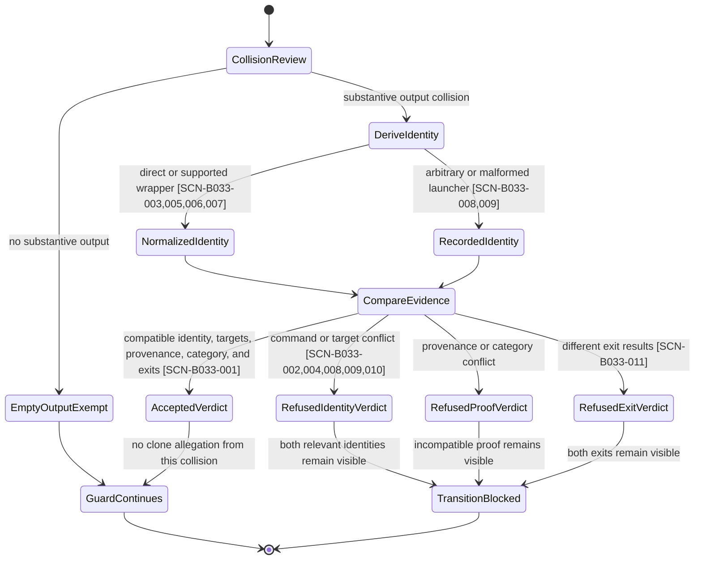
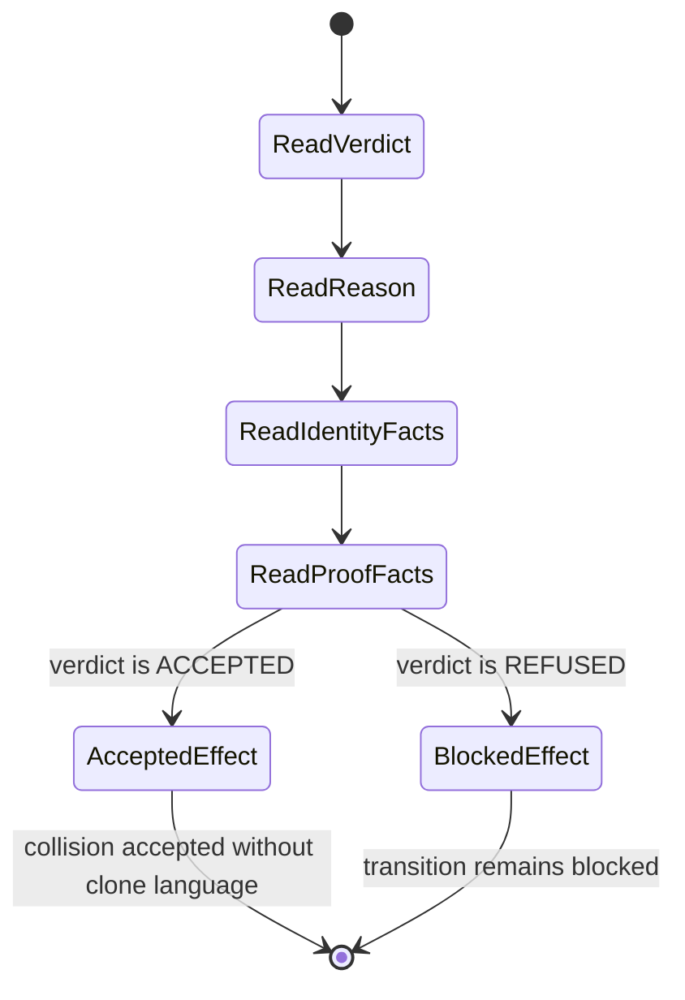

# Specification: BUG-033 Receipt Target Grouping And Wrapper Normalization

## Evidence Basis

The current repository sources below define one active behavior contract.

- [bug.md](bug.md) records the three facets, the facet-3 RED reproduction, and
  the required launcher bounds.
- [state-transition-guard.sh](../../bubbles/scripts/state-transition-guard.sh)
  contains Check 43. Its current command normalization covers facets 1 and 2,
  but it has no bounded-launcher normalization for facet 3.
- [scopes.md](scopes.md), [scenario-manifest.json](scenario-manifest.json),
  [report.md](report.md), and [uservalidation.md](uservalidation.md) preserve
  the historical facet-1 and facet-2 contract.
- [state.json](state.json) keeps the bug `in_progress` under the persisted
  `bugfix-fastlane` mode. Validate-owned certification remains unchanged.

The historical report is source material, not current-session certification.
This specification makes no claim that facet 3 is planned, implemented, tested,
or certified.

## Purpose

Define how Check 43 identifies the command that produced a receipt. Honest
re-runs and transparent launchers must not trigger a forgery allegation.
Genuinely incompatible evidence reuse must remain blocking.

## Outcome Contract

- **Intent:** Classify receipt collisions by the underlying evidence-producing
  command, target, provenance, category, and exit result.
- **Success Signal:** Persistent scenarios accept honest equivalent executions
  and refuse every incompatible or unproven collision defined below.
- **Hard Constraints:** Preserve per-receipt provenance, per-identity target
  distinctness, underlying command identity, exit-code compatibility, and the
  empty-stdout exemption. Normalize only exact supported wrapper grammar.
- **Failure Condition:** The behavior fails if it accuses an honest equivalent
  execution, hides a different command, or guesses through malformed grammar.
  It also fails if it ignores an exit mismatch or weakens an earlier
  adversarial bound.

## Operating Contract

Facets 1 and 2 are present in the current source but remain uncertified. Facet
3 is required by this specification and is absent from the current classifier.
The packet remains `in_progress`. This artifact does not promote any scope or
implementation claim.

## Current Capability Map

| Capability | Current state | Evidence anchor |
| --- | --- | --- |
| Group repeated targets once per command identity | Present, uncertified | Check 43 in [state-transition-guard.sh](../../bubbles/scripts/state-transition-guard.sh) and facet 1 in [bug.md](bug.md) |
| Normalize shell, `env`, and assignment wrappers recursively | Present, uncertified | `strip_wrappers` in [state-transition-guard.sh](../../bubbles/scripts/state-transition-guard.sh) and facet 2 in [bug.md](bug.md) |
| Normalize `timeout` and `gtimeout` launchers | Required, absent | Facet 3 and its RED reproduction in [bug.md](bug.md) |
| Normalize the exact portable alarm launcher | Required, absent | Facet 3 and its RED reproduction in [bug.md](bug.md) |
| Preserve arbitrary or malformed launcher identity | Required, absent | Facet-3 bounds in [bug.md](bug.md) |
| Preserve distinct underlying commands and exit results | Existing safety contract must remain active | `deterministic_siblings` in [state-transition-guard.sh](../../bubbles/scripts/state-transition-guard.sh) and the bounds in [bug.md](bug.md) |

## Domain Capability Model

### Single-Capability Justification

BUG-033 repairs receipt identity inside the existing Check 43 capability. It
adds no provider, adapter, plugin, screen, service, or reusable extension point.
A new capability foundation would add structure without separating real
variation.

### Domain Primitives

| Primitive | Purpose | Lifecycle |
| --- | --- | --- |
| Receipt | Records one evidence-producing execution | Recorded, grouped, classified |
| Substantive output collision | Groups non-empty output with one shared digest | Detected, accepted as siblings, or refused as a clone |
| Command spelling | Preserves the recorded invocation text | Recorded, normalized, retained for diagnostics |
| Underlying command identity | Names the evidence-producing program and subject | Derived, compared within a collision group |
| Transparent wrapper | Changes invocation context without changing the underlying command | Recognized and removed from identity, or retained unchanged |
| Bounded process launcher | Limits execution time while preserving the underlying command | Recognized by exact grammar, removed from identity, or retained unchanged |
| Target identity | Names the subject or input closure examined by one command identity | Derived and compared across identities |
| Provenance identity | Proves that one receipt came from an independent execution | Derived per receipt and compared across the group |
| Collision verdict | States whether reuse is compatible and independently evidenced | Accepted or refused |

### Relationships

- A receipt contributes one command spelling, exit result, target identity,
  provenance identity, category, and output digest.
- A substantive output collision contains two or more receipts with one digest.
- A recognized wrapper exposes one underlying command identity.
- A malformed or unsupported wrapper remains part of the command identity.
- Deterministic siblings require compatible commands and exits, distinct
  targets per command identity, and distinct provenance per receipt.

### Business Policies

- A forgery allegation requires incompatible or insufficiently proven evidence.
- Equivalent invocation syntax must not create a new evidence claim.
- Process-control syntax must not replace the identity of the command it runs.
- Normalization must fail closed when launcher grammar is unsupported or
  incomplete.
- Normalization must never execute recorded command text.

## Actors & Personas

| Actor | Description | Key goals | Permission boundary | Evidence anchor |
| --- | --- | --- | --- | --- |
| Transition requester | A person or workflow presenting receipts for a state transition | Receive an accurate verdict without a false forgery allegation | Cannot bypass Check 43 or alter certification | Check 43 verdict flow in [state-transition-guard.sh](../../bubbles/scripts/state-transition-guard.sh) |
| Evidence reviewer | A person or validation workflow interpreting a refusal | Distinguish honest re-runs from incompatible evidence reuse | May inspect diagnostics but cannot convert a refusal into acceptance | Clone diagnostic in [state-transition-guard.sh](../../bubbles/scripts/state-transition-guard.sh) |
| Framework consumer workflow | A downstream workflow using the installed guard | Receive stable classification across supported launcher spellings | Supplies recorded receipts but does not define normalization rules | Cross-repository impact in [bug.md](bug.md) |

## Exposure Contract

| Capability | Surface class | Surface id | Status | Plan |
| --- | --- | --- | --- | --- |
| Receipt collision verdict | cliCommand | `bash bubbles/scripts/state-transition-guard.sh <feature-dir>` | delivered | Existing Check 43 entry point |
| Target grouping per command identity | internal | Check 43 `deterministic_siblings` | internal | Called by the receipt collision verdict |
| Shell, environment, and assignment normalization | internal | Check 43 command normalization | internal | Called by the receipt collision verdict |

Facet 3 changes the existing internal command-normalization behavior. It has no
`delivered` or `planned` exposure claim. It remains an open requirement until
the owning specialists reconcile and execute the packet.

## Use Cases

### UC-B033-001: Accept independently evidenced deterministic re-runs

- **Actor:** Transition requester
- **Preconditions:** Multiple receipts share substantive output. They identify
  compatible commands and exits. Their targets and provenance satisfy the
  required distinctness rules.
- **Main Flow:**
  1. The requester presents the receipt set for transition review.
  2. Check 43 groups receipts by substantive output.
  3. Check 43 compares normalized command identity, target, provenance,
     category, and exit result.
  4. Check 43 accepts the group as deterministic siblings.
- **Alternative Flows:** Missing or repeated provenance causes refusal. Two
  identities that claim one target also cause refusal.
- **Postconditions:** The transition is not blocked by a clone allegation for
  this collision group.

### UC-B033-002: Normalize a supported transparent launcher

- **Actor:** Framework consumer workflow
- **Preconditions:** A receipt starts with a supported wrapper or bounded
  process launcher and contains a non-empty underlying command.
- **Main Flow:**
  1. The workflow records the complete command spelling.
  2. Check 43 recognizes the wrapper by its exact grammar.
  3. Check 43 removes only the recognized prefix from identity.
  4. Check 43 recursively normalizes supported wrappers around the underlying
     command.
  5. Check 43 classifies the collision by the underlying command.
- **Alternative Flows:** Unsupported, arbitrary, or incomplete grammar remains
  unchanged and visible to classification.
- **Postconditions:** Invocation syntax does not replace or hide the command
  that produced the receipt.

### UC-B033-003: Refuse incompatible receipt reuse

- **Actor:** Evidence reviewer
- **Preconditions:** Receipts share substantive output but differ in underlying
  command, target proof, execution provenance, category validity, or exit
  result.
- **Main Flow:**
  1. Check 43 compares the collision group after bounded normalization.
  2. Check 43 detects the incompatible or unproven dimension.
  3. Check 43 refuses the group as cloned evidence.
  4. The reviewer receives a diagnostic that preserves the relevant command
     identities.
- **Alternative Flows:** Empty output remains exempt because it carries no
  substantive evidence to clone.
- **Postconditions:** The incompatible collision cannot support the transition.

### UC-B033-004: Diagnose unsupported launcher grammar

- **Actor:** Evidence reviewer
- **Preconditions:** A receipt begins with a launcher-like command that does not
  match the supported grammar.
- **Main Flow:**
  1. Check 43 retains the launcher-like prefix.
  2. Check 43 performs no guessed unwrapping.
  3. The diagnostic shows the retained command identity when the collision is
     refused.
- **Alternative Flows:** Exact supported grammar follows UC-B033-002.
- **Postconditions:** The reviewer can distinguish unsupported syntax from a
  normalized underlying command.

## Business Scenarios

### SCN-B033-001: Repeated honest re-runs are not cloned evidence

```gherkin
Scenario: Repeated honest re-runs are not cloned evidence
  Given five receipts identify one validator over specs/alpha
  And four receipts identify the same validator over specs/beta
  And all nine receipts share one substantive output digest
  And every receipt carries distinct execution provenance
  When Check 43 classifies the collision
  Then the group is accepted as deterministic siblings
  And no evidence receipt clone is reported
```

### SCN-B033-002: Two identities over one target are still refused

```gherkin
Scenario: Two identities over one target are still refused
  Given one receipt identifies `npm run lint` over specs/alpha
  And one receipt identifies `npm run test` over specs/alpha
  And both receipts share one substantive output digest
  When Check 43 classifies the collision
  Then an evidence receipt clone is reported
```

### SCN-B033-003: Existing transparent wrappers resolve to one command

```gherkin
Scenario Outline: Existing transparent wrappers resolve to one command
  Given a receipt records <spelling>
  When Check 43 derives the underlying command family
  Then the command family is `node`

  Examples:
    | spelling |
    | `node scripts/check-page.mjs alpha` |
    | `env PAGE=alpha node scripts/check-page.mjs alpha` |
    | `zsh -c node scripts/check-page.mjs alpha` |
    | `PAGE=alpha node scripts/check-page.mjs alpha` |
    | `bash -c node scripts/check-page.mjs alpha` |
    | `sh -c node scripts/check-page.mjs alpha` |
```

### SCN-B033-004: Existing wrappers do not hide different programs

```gherkin
Scenario: Existing wrappers do not hide different programs
  Given one receipt records `zsh -c cargo test`
  And another receipt records `env CI=1 npm run lint`
  And both receipts share one substantive output digest
  When Check 43 classifies the collision
  Then an evidence receipt clone is reported
  And the diagnostic preserves the `cargo` and `npm` command families
```

### SCN-B033-005: Timeout launchers expose the underlying command

```gherkin
Scenario Outline: A supported timeout launcher does not change command identity
  Given one receipt records `artifact-lint.sh <target>`
  And another receipt records `<launcher> 120 artifact-lint.sh <target>`
  And both receipts have compatible exit results and independent provenance
  And both receipts share one substantive output digest
  When Check 43 classifies the collision
  Then both receipts identify `artifact-lint.sh <target>`
  And no clone is reported solely because of the launcher

  Examples:
    | launcher |
    | timeout |
    | gtimeout |
```

### SCN-B033-006: The exact portable alarm launcher exposes the underlying command

```gherkin
Scenario: The exact portable alarm launcher does not change command identity
  Given one receipt records `artifact-lint.sh <target>`
  And another receipt records `/usr/bin/perl -e 'alarm shift @ARGV; exec @ARGV' 120 artifact-lint.sh <target>`
  And both receipts have compatible exit results and independent provenance
  And both receipts share one substantive output digest
  When Check 43 classifies the collision
  Then both receipts identify `artifact-lint.sh <target>`
  And no clone is reported solely because of the launcher
```

### SCN-B033-007: Launcher removal composes with existing wrapper normalization

```gherkin
Scenario Outline: Supported wrappers normalize recursively after launcher removal
  Given a receipt records `<launcher> env PAGE=alpha zsh -c node scripts/check-page.mjs alpha`
  When Check 43 derives the underlying command family
  Then the command family is `node`
  And the command identity retains `scripts/check-page.mjs`

  Examples:
    | launcher |
    | timeout 120 |
    | gtimeout 120 |
    | /usr/bin/perl -e 'alarm shift @ARGV; exec @ARGV' 120 |
```

### SCN-B033-008: Arbitrary Perl programs remain part of command identity

```gherkin
Scenario: An arbitrary Perl program is not treated as the portable alarm launcher
  Given one receipt records `/usr/bin/perl -e 'print 1' 120 artifact-lint.sh <target>`
  And another receipt records `artifact-lint.sh <target>`
  And both receipts share one substantive output digest
  When Check 43 derives their command identities
  Then the arbitrary Perl program remains visible in its identity
  And the receipts do not become equivalent through launcher normalization
```

### SCN-B033-009: Malformed launcher grammar remains unchanged

```gherkin
Scenario Outline: Unsupported or incomplete launcher grammar fails closed
  Given a receipt records <malformed-spelling>
  When Check 43 derives its command identity
  Then the recorded launcher prefix remains part of the identity
  And Check 43 does not infer an underlying command

  Examples:
    | malformed-spelling |
    | `timeout` |
    | `timeout 120` |
    | `gtimeout 120` |
    | `timeout --preserve-status 120 artifact-lint.sh <target>` |
    | `/usr/bin/perl -e 'alarm shift @ARGV; exec @ARGV' 120` |
    | `/usr/bin/perl -e 'alarm shift @ARGV; print @ARGV' 120 artifact-lint.sh <target>` |
```

### SCN-B033-010: Launchers do not hide different underlying commands

```gherkin
Scenario Outline: Different underlying commands remain incompatible behind a launcher
  Given one receipt records `<launcher> artifact-lint.sh <target>`
  And another receipt records `<launcher> state-transition-guard.sh <target>`
  And both receipts share one substantive output digest
  When Check 43 classifies the collision
  Then an evidence receipt clone is reported
  And the diagnostic preserves both underlying command identities

  Examples:
    | launcher |
    | timeout 120 |
    | gtimeout 120 |
    | /usr/bin/perl -e 'alarm shift @ARGV; exec @ARGV' 120 |
```

### SCN-B033-011: Exit-result differences remain incompatible

```gherkin
Scenario: Launcher normalization does not erase an exit-result difference
  Given one receipt records `timeout 120 artifact-lint.sh specs/alpha` with exit result 0
  And another receipt records `gtimeout 120 artifact-lint.sh specs/beta` with exit result 1
  And both receipts share one substantive output digest
  And both receipts carry independent provenance
  When Check 43 classifies the collision
  Then the group is not accepted as deterministic siblings
  And an evidence receipt clone is reported
```

## Workflow Experience Requirements

- An accepted honest collision must not use forgery or clone language.
- A refused collision must identify the underlying commands after exact
  supported launcher normalization.
- A malformed or unsupported launcher must remain visible in the diagnostic.
- An exit-result mismatch must remain distinguishable from a command mismatch.
- The transition requester must receive one unambiguous accepted or refused
  result. No warning-only state may imply that a refusal was accepted.

These requirements are business input for `bubbles.ux`. That owner defines the
terminal user flow, message hierarchy, responsive behavior, and accessibility
contract without changing the classification rules above.

## UI Scenario Matrix

| Scenario | Actor | Entry point | Steps | Expected outcome | Surface |
| --- | --- | --- | --- | --- | --- |
| SCN-B033-001 | Transition requester | Transition command | Submit independently evidenced re-runs, receive classification | No false clone allegation | Check 43 terminal verdict |
| SCN-B033-005 and SCN-B033-006 | Framework consumer workflow | Receipt-producing command followed by transition review | Run through a supported launcher, submit receipts | Verdict reflects the underlying command | Check 43 terminal verdict |
| SCN-B033-008 and SCN-B033-009 | Evidence reviewer | Refused transition diagnostic | Inspect arbitrary or malformed launcher identity | Unsupported syntax remains visible | Check 43 clone diagnostic |
| SCN-B033-010 | Evidence reviewer | Refused transition diagnostic | Compare two underlying commands behind one launcher type | Both underlying identities are named | Check 43 clone diagnostic |
| SCN-B033-011 | Evidence reviewer | Refused transition diagnostic | Compare compatible programs with different exit results | Exit incompatibility remains blocking | Check 43 clone diagnostic |

## UI Wireframes

These wireframes specify the required terminal experience. They do not change
the facet-3 delivery or certification state recorded above.

### Screen Inventory

| Screen | Actor(s) | Status | Scenarios served |
| --- | --- | --- | --- |
| Check 43 terminal verdict | Transition requester, evidence reviewer, framework consumer workflow | Existing surface, reconciled message contract | SCN-B033-001 through SCN-B033-011 |

### Single-Screen Justification

BUG-033 changes one existing command-line verdict surface. Accepted and refused
results are mutually exclusive states of the same terminal output. Treating
them as separate screens would misstate the interaction and reading order.

### Terminal Message Contract

- The first semantic line MUST use `check=43 verdict=ACCEPTED` or
  `check=43 verdict=REFUSED`.
- `verdict` has exactly two values. A warning, concern, or notice is never a
  third verdict.
- The next line MUST carry a stable ASCII `reason=<code>` value.
- Accepted deterministic siblings use `reason=deterministic-siblings`.
- Refusals use the applicable stable reason code, including
  `command-identity-mismatch`, `target-conflict`, `provenance-conflict`,
  `category-invalid`, or `exit-result-mismatch`.
- Supported launchers show the normalized command and
  `identity_source=normalized-underlying-command`.
- Arbitrary Perl and malformed or unsupported timeout grammar show the recorded
  command and `identity_source=recorded-command` with
  `normalization=unchanged`.
- A command mismatch MUST label both values as `identity_a` and `identity_b`.
- An exit mismatch MUST label both command identities and both exit results.
- Every refusal MUST end with `effect=TRANSITION_BLOCKED`. Supplementary text
  cannot weaken that effect.
- Accepted output MUST NOT contain clone, forgery, warning, or refusal language.

### Screen: Check 43 Terminal Verdict

**Actor:** Transition requester and evidence reviewer  
**Route:** `bash bubbles/scripts/state-transition-guard.sh <feature-dir>`  
**Status:** Existing terminal surface, message contract modified

The boxes below show mutually exclusive output states. Box borders describe the
wireframe only. Emitted diagnostics remain plain text.

#### State: Accepted Deterministic Siblings

```text
┌──────────────────────────────────────────────────────────┐
│ check=43 verdict=ACCEPTED                                │
│ reason=deterministic-siblings                            │
│ identity=artifact-lint.sh <target>                       │
│ identity_source=normalized-underlying-command            │
│ launchers=direct,timeout,gtimeout,portable-perl-alarm    │
│ targets=distinct-per-command-identity                    │
│ provenance=distinct-per-receipt                          │
│ exit_results=compatible                                  │
│ effect=COLLISION_ACCEPTED                                │
└──────────────────────────────────────────────────────────┘
```

#### State: Refused Different Commands Behind The Same Launcher

```text
┌──────────────────────────────────────────────────────────┐
│ check=43 verdict=REFUSED                                 │
│ reason=command-identity-mismatch                         │
│ launcher_a=timeout                                       │
│ identity_a=artifact-lint.sh <target>                     │
│ launcher_b=timeout                                       │
│ identity_b=state-transition-guard.sh <target>            │
│ identity_source=normalized-underlying-command            │
│ effect=TRANSITION_BLOCKED                                │
└──────────────────────────────────────────────────────────┘
```

#### State: Refused Arbitrary Perl Identity

```text
┌──────────────────────────────────────────────┐
│ check=43 verdict=REFUSED                     │
│ reason=command-identity-mismatch             │
│ identity_a=/usr/bin/perl -e 'print 1' 120    │
│   artifact-lint.sh <target>                  │
│ identity_source_a=recorded-command           │
│ normalization_a=unchanged                    │
│ identity_b=artifact-lint.sh <target>         │
│ identity_source_b=underlying-command         │
│ effect=TRANSITION_BLOCKED                    │
└──────────────────────────────────────────────┘
```

#### State: Refused Exit-Result Mismatch

```text
┌──────────────────────────────────────────────┐
│ check=43 verdict=REFUSED                     │
│ reason=exit-result-mismatch                  │
│ identity_a=artifact-lint.sh specs/alpha      │
│ exit_a=0                                     │
│ identity_b=artifact-lint.sh specs/beta       │
│ exit_b=1                                     │
│ effect=TRANSITION_BLOCKED                    │
└──────────────────────────────────────────────┘
```

**Interactions:**

- Running the transition guard produces one final Check 43 verdict state.
- An accepted verdict lets the guard continue without a clone allegation from
  that collision group.
- A refused verdict blocks the transition and exposes the incompatible facts.
- Copying the output preserves every status, reason, identity, and effect token
  without depending on ANSI formatting.

**States:**

- No substantive collision: omit the Check 43 collision panel and preserve the
  existing empty-output exemption.
- Pending classification: do not emit an accepted, refused, warning, or
  success-like verdict before classification finishes.
- Accepted: show one normalized identity plus target, provenance, and exit
  compatibility. Do not show clone or forgery language.
- Refused command mismatch: show both underlying identities after exact
  supported launcher normalization.
- Refused unsupported grammar: retain the complete recorded launcher identity,
  mark normalization unchanged, and show the compared identity.
- Refused exit mismatch: show both identities and both exit results, then block
  the transition.
- Classification error: fail closed with `verdict=REFUSED` and
  `effect=TRANSITION_BLOCKED`. Do not downgrade the result to a warning.

**Responsive:**

- Wide terminals retain this vertical order. Padding may align values, but the
  output never uses side-by-side verdict columns.
- Terminals below 60 columns keep one field per line. Long identities wrap on
  token boundaries beneath their label with a two-space continuation prefix.
- Wrapped output never truncates an identity, replaces it with an ellipsis, or
  separates a verdict from its reason.
- Resizing changes wrapping only. It never changes field order or wording.

**Accessibility:**

- Screen readers encounter verdict, reason, identities, proof facts, and effect
  in that order.
- Every semantic state appears in printable plain text. Color and text styling
  may reinforce a state but never define it.
- The output remains understandable after ANSI escape sequences are removed.
- Each compared value has a unique label. Position and color never distinguish
  `identity_a` from `identity_b` or `exit_a` from `exit_b`.
- The first semantic line announces the final verdict once. Later lines add
  detail without contradicting it.

## User Flows

### User Flow: Classify A Receipt Collision



### User Flow: Read A Verdict In A Narrow Or Assistive Terminal



### Scenario-To-Flow Trace

| Scenarios | Screen state and flow |
| --- | --- |
| SCN-B033-001 | Accepted state through `NormalizedIdentity` and `AcceptedVerdict` |
| SCN-B033-002 and SCN-B033-004 | Refused identity state with both conflicting identities visible |
| SCN-B033-003, SCN-B033-005, SCN-B033-006, and SCN-B033-007 | Supported normalization path with the underlying identity visible |
| SCN-B033-008 and SCN-B033-009 | Recorded identity path with `normalization=unchanged` |
| SCN-B033-010 | Refused identity state naming both commands behind the launcher |
| SCN-B033-011 | Refused exit state naming both identities and both exit results |

## Functional Requirements

- **FR-B033-001:** Check 43 MUST measure target distinctness once per command
  identity, not once per receipt.
- **FR-B033-002:** Check 43 MUST measure provenance distinctness per receipt.
- **FR-B033-003:** Two command identities that claim one target MUST remain
  incompatible when they share substantive output.
- **FR-B033-004:** Shell command mode, `env`, and leading environment
  assignments MUST normalize recursively to the underlying command.
- **FR-B033-005:** Existing wrapper normalization MUST preserve the first token
  of the underlying command as its command family.
- **FR-B033-006:** Check 43 MUST recognize only the simple launcher grammar
  `timeout <duration> <underlying-command...>` and the equivalent `gtimeout`
  grammar.
- **FR-B033-007:** A timeout launcher MUST have one non-option duration operand
  and a non-empty underlying command before normalization removes it.
- **FR-B033-008:** Check 43 MUST recognize only the exact portable launcher
  `/usr/bin/perl -e 'alarm shift @ARGV; exec @ARGV' <seconds> <underlying-command...>`.
- **FR-B033-009:** The exact portable launcher MUST have a seconds operand and a
  non-empty underlying command before normalization removes it.
- **FR-B033-010:** After removing a recognized launcher, Check 43 MUST recurse
  through supported shell, `env`, and assignment wrappers.
- **FR-B033-011:** Arbitrary `perl -e` programs and near-matches to the portable
  launcher MUST remain unchanged.
- **FR-B033-012:** Missing duration, missing seconds, missing underlying command,
  unsupported launcher options, and unsupported grammar MUST remain unchanged.
- **FR-B033-013:** Different underlying programs MUST remain different command
  families and identities behind every recognized launcher.
- **FR-B033-014:** Exit-result compatibility MUST remain an independent
  deterministic-sibling condition after launcher normalization.
- **FR-B033-015:** Empty substantive output MUST retain its existing exemption.
- **FR-B033-016:** Missing or repeated execution provenance MUST not become
  acceptable because a wrapper normalized successfully.
- **FR-B033-017:** Diagnostics MUST preserve the normalized underlying identity
  for supported launchers and the recorded identity for unsupported launchers.
- **FR-B033-018:** Every acceptance scenario MUST have an adversarial regression
  that fails if normalization hides an incompatible command or proof gap.

## Non-Functional Requirements

- **NFR-B033-001 Determinism:** One recorded command spelling must always derive
  one command identity under the same contract.
- **NFR-B033-002 Fail-closed behavior:** Unsupported or ambiguous launcher
  grammar must never receive guessed normalization.
- **NFR-B033-003 Safety:** Classification must treat recorded commands as data.
  It must never execute them to discover identity.
- **NFR-B033-004 Portability:** Recorded `timeout`, `gtimeout`, and exact
  portable alarm launcher spellings must classify consistently across supported
  host environments.
- **NFR-B033-005 Compatibility:** Facet-3 behavior must preserve the facet-1,
  facet-2, BUG-007, and BUG-032 safety bounds recorded in [bug.md](bug.md).
- **NFR-B033-006 Diagnostic clarity:** A refusal must expose enough identity and
  compatibility detail for a reviewer to distinguish command, target,
  provenance, category, and exit-result causes.
- **NFR-B033-007 Bounded work:** Classification cost must remain bounded by the
  receipts and command tokens in the collision set.

## Acceptance Criteria

1. SCN-B033-001 through SCN-B033-011 have persistent executable coverage.
2. Direct, `timeout`, `gtimeout`, and exact portable alarm spellings of one
   command produce one underlying identity when their grammar is complete.
3. Existing shell, `env`, and assignment wrappers still normalize recursively.
4. Arbitrary Perl, malformed grammar, and unsupported launcher options remain
   unchanged.
5. Different underlying commands remain incompatible behind every supported
   launcher.
6. Exit-result differences, target conflicts, and provenance conflicts remain
   blocking.
7. The transition verdict and diagnostic satisfy the workflow experience
   requirements after `bubbles.ux` reconciles its owned sections.
8. Validate-owned certification remains `in_progress` until current-session
   execution proves the complete three-facet contract.

## Non-Goals

- Defining a general shell parser.
- Normalizing arbitrary process launchers or arbitrary Perl programs.
- Supporting timeout option permutations outside the exact grammar above.
- Changing the receipt schema, evidence category rules, or empty-output policy.
- Changing status, certification, or scope completion in this analyst phase.

## Competitive Analysis

None performed. BUG-033 governs an internal evidence-integrity classifier. The
active defect, source path, and adversarial safety bounds provide the relevant
decision inputs.

## Improvement Proposals

None added. The active requirement is complete repair of the three documented
facets without widening Check 43.
