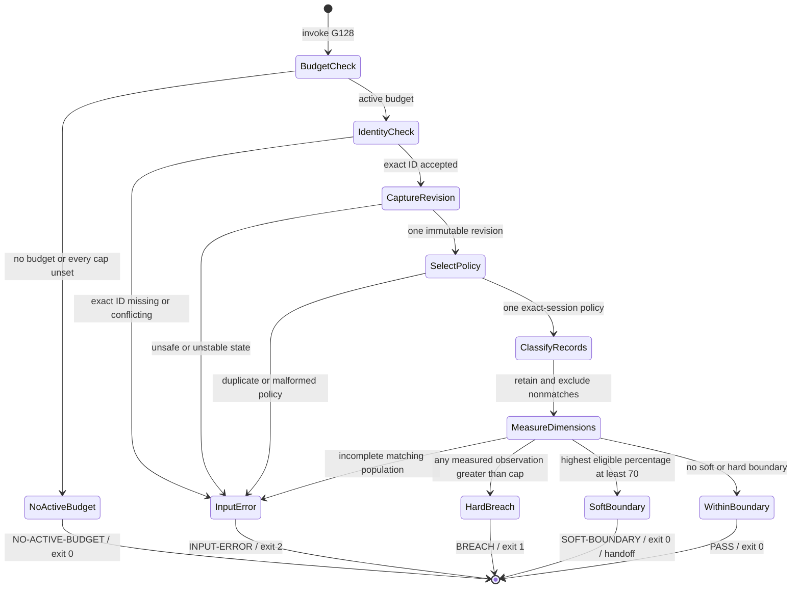
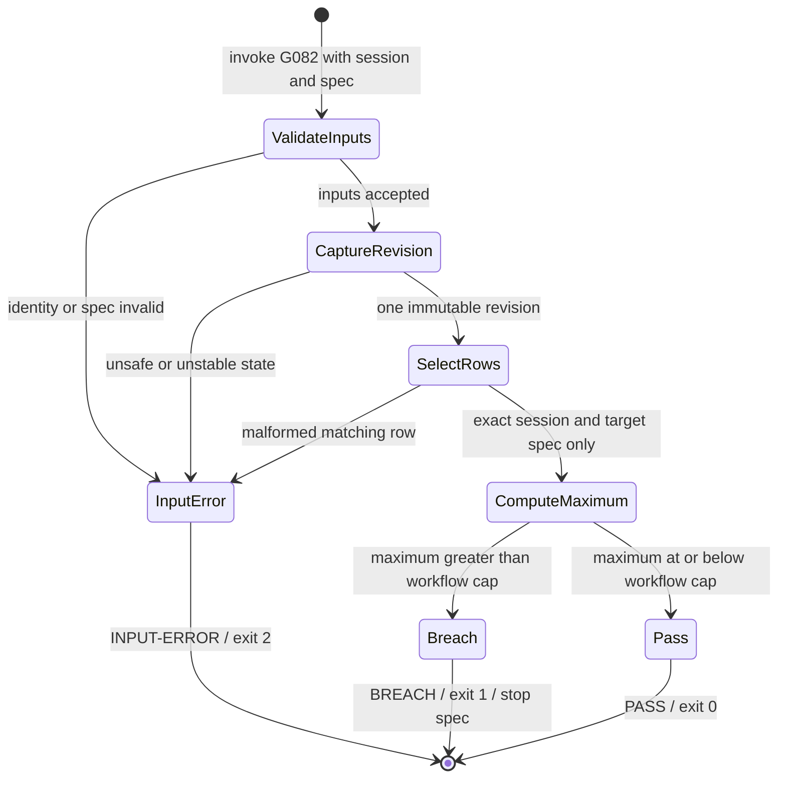
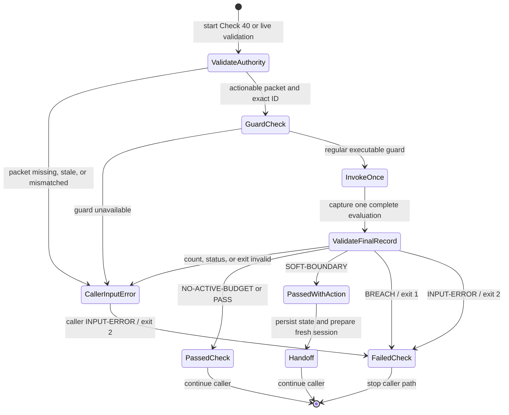
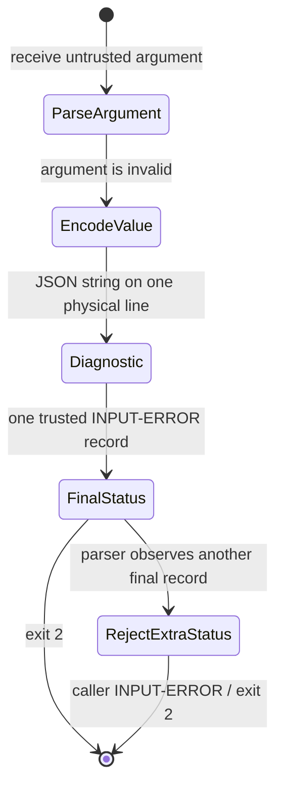
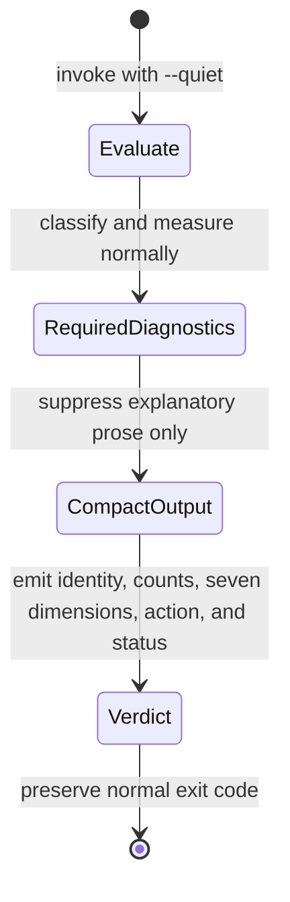

# BUG-037 Expected Behavior - Host-Session-Scoped G128 Measurement

## Outcome Contract

- **Intent:** Enforce G082 and G128 against one host session whose identity and
  budget come from validated actionable authority. Count only complete,
  immutable measurements attributed to that session.
- **Success Signal:** Historical, concurrent, malformed, mismatched, and
  unattributed inputs cannot alter another session's policy, totals, G082
  verdict, G128 boundary, or hard stop.
- **Hard Constraints:** Preserve all seven G128 cap names, configured values,
  null behavior, strict greater-than comparisons, the 70% soft boundary,
  retained history, and no-bypass enforcement. Keep `maxToolCalls`
  unmeasurable until an exact producer exists. Keep G082 spec-local and G128
  session-wide without conflating their calculations.
- **Failure Condition:** A guard trusts ambient identity, applies another
  session's budget, measures a partial population, observes torn state, or
  silently accepts malformed input. The feature also fails when a guard reports
  an unproven dimension as measured.

## Scope Boundary

BUG-037 keeps G128 as a post-activity session-wide gate and G082 as a
spec-local convergence gate. The repair covers authoritative session and budget
selection, immutable projection, producer attribution, exact usage integrity,
caller failure semantics, safe state locking, diagnostics, and concurrent
preservation.

The repair does not introduce pre-dispatch admission, reservations, permits,
goal budgets, session epochs, a host broker, provider-cost accounting, or new
retry policy. Those concepts belong to the unapproved IMP-055 proposal and are
not authorized by this defect.

Gate G085 remains unchanged. This packet stays under `bugs/` in the Bubbles
source repository and must not create a source-repository `specs/` directory.

### Single-Capability Justification

This is one correctness capability: authoritative session-cap enforcement over
the existing G082, G128, snapshot, and usage surfaces. It adds no provider,
adapter class, broker, or reusable admission foundation. G082 and G128 share
identity authority while retaining different calculations. A new foundation
would expand this defect into the unapproved IMP-055 proposal.

## Independent Root Finding Ledger

The independent review produced nine deduplicated root findings. Each root has
one expected-behavior disposition below. The prior F01 through F19 ledger
remains intact for provenance and maps into these roots without duplication.

| Root finding | Prior finding input | Expected-behavior disposition | Requirement owner |
| --- | --- | --- | --- |
| RF-B037-01 | F08 | Validate packet authority before any repository-local directory, lock, or state side effect. Reject unsafe lock targets without following or truncating them. | FR-B037-024 |
| RF-B037-02 | F01, F05, F06 | Bind Check 40 and framework validation to actionable packet authority. Enforce one closed child status and exit pair. Missing enforcement fails closed. | FR-B037-017, FR-B037-021, FR-B037-022 |
| RF-B037-03 | F02 | Select and preserve one budget for the exact host session. Concurrent sessions retain independent values and default-off posture. | FR-B037-018 |
| RF-B037-04 | F07, F09, F10, F13 | Evaluate one immutable session revision. Reject incomplete timestamps, unknown budget keys, and invalid present byte fields. | FR-B037-023, FR-B037-025, FR-B037-026, FR-B037-029 |
| RF-B037-05 | F03, F04 | Make exact usage discovery complete, contained, no-follow, stable, and lossless for valid path bytes. Traversal, read, or parse failure cannot become neutral or partial data. | FR-B037-019, FR-B037-020 |
| RF-B037-06 | F11 | Escape every rejected argument as one stable diagnostic value. Control bytes cannot alter line or status framing. | FR-B037-027 |
| RF-B037-07 | F12 | Bind G082 to the same active session authority while retaining its per-spec maximum. The active work boundary must admit its required source and tests. | FR-B037-028 |
| RF-B037-08 | F14, F15, F16, F17, F19 | Require truthful persistent and concurrency proof for exact mappings, both lock verdict pairs, packet-authority callers, G082, and interpreter identity. | FR-B037-030 through FR-B037-033 |
| RF-B037-09 | New independent freshness finding | Regenerate and recheck release metadata after the final managed source, test, contract, and expected-behavior changes. | FR-B037-013 |

F18 remains disproved as a product finding because its command supplied the
wrong input type. It is accounted as an excluded evidence record, not as a
tenth root. F19 remains an evidence-integrity input under RF-B037-08.

No root finding proves a separate capability. All nine belong to the same
authoritative session-cap repair. A sibling bug would split one required
security and correctness outcome across incompatible delivery boundaries.

## Prior Fine-Grained Finding Reconciliation

The prior review ledger is retained for one-to-one continuity. Current source
inspection reconfirmed its active behavior findings. Prior receipt dispositions
remain historical inputs and are not restated as fresh execution evidence.

| Finding | Recorded disposition | Source-backed reason or requirement |
| --- | --- | --- |
| F01 | In scope — FR-B037-017 | Check 40 and live framework validation forward ambient `BUBBLES_SESSION_ID` without validating it against actionable packet authority. |
| F02 | In scope — FR-B037-018 | G128 reads one top-level `sessionBudget`, and the goal-agent seeding contract names that shared location without a session key. |
| F03 | In scope — FR-B037-019 | The VS Code adapter converts exact-file read failures to neutral output and selects only objects carrying `promptTokens`, which permits malformed or mixed populations to disappear. |
| F04 | In scope — FR-B037-020 | Adapter enumeration suppresses traversal errors, transports paths by newline, counts pathnames, and later reopens the selected pathname without containment or object-stability proof. |
| F05 | In scope — FR-B037-021 | The live framework wrapper prints a pass for every child exit 0, even when the parsed status is empty or outside the closed success set. |
| F06 | In scope — FR-B037-022 | Check 40 reports a missing or non-executable blocking G128 guard as an advisory skip. |
| F07 | In scope — FR-B037-023 | G128 validates and rereads the shared session pathname through many separate `jq` processes while the producer can atomically replace that pathname. |
| F08 | In scope — FR-B037-024 | `state-snapshot.sh` derives the packet-controlled root and opens its repository-local lock before `mirror-session` validates the packet. The flock open can follow a planted symlink. |
| F09 | In scope — FR-B037-025 | The timestamp projection catches invalid matching timestamps as empty and can measure the remaining subset. |
| F10 | In scope — FR-B037-026 | G128 validates seven known cap values but never rejects additional `sessionBudget` keys. |
| F11 | In scope — FR-B037-027 | Unknown flags and positional arguments are interpolated raw into diagnostics. Control and newline bytes can therefore change output framing. |
| F12 | In scope — FR-B037-028 | The changed producer adds session-specific convergence rows, but G082 still selects only by spec path and takes the maximum across every retained session. |
| F13 | In scope — FR-B037-029 | Matching byte validation accepts present `null` values and later coerces them to zero, although the tool-call schema permits only integers when those properties are present. |
| F14 | In scope — FR-B037-030 | Several Bash 3 entry tests invoke changed production children through PATH-resolved `bash`. The outer interpreter alone does not prove the child's interpreter. |
| F15 | In scope — FR-B037-031 | The persistent test invokes the direct guard. It does not execute snapshot production, Check 40, live validation, same-key concurrency, or G082 while claiming all eight scenarios. |
| F16 | In scope — FR-B037-032 | The concurrent tool-log assertion builds a dictionary keyed by session ID. Duplicate rows collapse before cardinality is checked. |
| F17 | In scope — FR-B037-032 | Same-key concurrency checks counts and unique IDs, not every session-to-iteration pair. Independent verdicts run only after the primary lock path. |
| F18 | Disproved as a BUG-037 product finding | Receipt row 48 passed the bug directory to `scenario-compile-lint.sh`. That command requires a compiled scenario JSON file, so exit 1 records an invalid test invocation rather than a product defect. The receipt is retained and excluded from BUG-037 evidence. |
| F19 | In scope evidence correction — FR-B037-033 | Receipt row 50 is tagged `RED` but records exit 0 and no scenario binding. The receipt remains immutable and inadmissible as RED evidence. |

F01 through F17 and F19 map exactly once into RF-B037-01 through RF-B037-08.
F18 remains disproved. RF-B037-09 adds the current release-freshness defect.
Foreign-owned design, UX, scope, test-plan, and work-boundary text must follow
the active expected behavior before delivery can be certified.

## Actors

| Actor | Goal | Boundary |
| --- | --- | --- |
| Host-session-aware caller | Evaluate the current session without cross-session charges. | Supplies one validated actionable packet and forwards its host-issued opaque ID unchanged. Ambient identity grants no authority. |
| Repository-binding authority | Establish the repository and host session before local enforcement or state mutation. | Validation must complete before a repository-local lock, directory, or session file is opened. |
| State-snapshot producer | Preserve attributable turns and convergence progress. | Writes only after binding validation and uses a no-follow lock while preserving other sessions. |
| Tool-log producer | Preserve command-result receipts and byte counts. | A receipt is eligible only when its `sessionId` exactly matches the active ID. |
| Usage adapter | Return prompt-token usage for one proven host session. | Abstains only for honest absence or ambiguity. It fails closed on unsafe traversal, malformed exact input, and unstable file identity. |
| G128 guard | Compare exact-session measurements with existing caps. | Never invents a measurement or rewrites retained state. |
| G082 guard | Enforce per-spec convergence for the active host session. | Excludes every other session while keeping its per-spec calculation distinct from G128's session-wide sum. |
| Transition and validation callers | Surface G082 and G128 through blocking checks. | Validate authority, require installed guards, and enforce each guard's closed status and exit matrix. |

## Definitions

### Exact Active Session Input

The enforcement input is `--session-id <opaque-host-session-id>`. This is the
identity that records are compared against. A production blocking caller must
also validate an actionable packet and prove that its
`repositoryResolution.sessionId` equals this value. An ambient environment
variable or caller-selected fresh value cannot establish enforcement authority.

A direct unbound invocation may inspect a caller-asserted ID. It cannot count as
an authoritative G082 or G128 enforcement result. A blocking caller must supply
or consume binding proof through a contract that cannot be substituted by the
environment.

When any session-bound policy has a non-null cap, a missing, empty, duplicate,
or conflicting session ID is an input error. G128 exits 2 before selecting a
budget or calculating usage. It must not pass, breach, or aggregate repository
history.

G128 preserves default-off exit 0 when no session state or session-bound policy
exists. The same applies when every retained session policy has seven null
caps. A legacy unscoped policy cannot activate a session by itself.

G128 must not derive the ID from CWD, process ID, timestamps, repository state,
workspace order, a newest-record heuristic, or an ambient fallback.

### Session-Bound Budget

The active budget is the policy record exactly attributed to the validated host
session. Two concurrent sessions may use different configured values. One may
also be default-off while the other is bounded.

Writing, resolving, or evaluating one session's budget must not replace or
consume another session's budget. A legacy unscoped top-level budget remains
stored but cannot be assigned to a session by time, recency, repository, or
record proximity.

Budget selection yields zero or one policy for the exact active ID. Duplicate
matching policies, conflicting policies, and malformed attribution are input
errors. They cannot resolve by array order, object order, or last-write wins.

Each session policy uses the same seven cap names and existing configured
values. Missing known keys retain existing null semantics. Unknown keys are
invalid unless a recognized schema version defines them.

All current mode-specific values remain byte-equivalent. This includes every
declared `180`, `350`, `50000`, `250000`, `2`, `90`, and `250` value. Unset
dimensions remain `null`. This bug changes attribution, not policy strength.

Session-policy history is append-only. A correction appends an attributable
superseding record. It never rewrites another session's policy or legacy
unscoped data.

### Blocking Authority And Status Integrity

A blocking caller validates one actionable repository packet before invoking
G082 or G128. It forwards the packet's opaque session ID unchanged. It rejects
an absent packet, a non-actionable projection, stale authority, or an ID
mismatch before accepting a guard verdict.

Ambient `BUBBLES_SESSION_ID` may transport a validated value after binding. Its
presence alone never proves authority. A caller must not strengthen an ambient
value into a blocking identity.

Each guard invocation emits exactly one final status record. The caller rejects
missing, duplicate, contradictory, malformed, or unknown statuses. The caller
also rejects any status whose declared exit differs from the process exit.

| Child exit | Exact accepted final status | Caller result |
| ---: | --- | --- |
| 0 | One of `NO-ACTIVE-BUDGET`, `PASS`, or `SOFT-BOUNDARY`, with `exit=0` | Continue under that exact meaning. |
| 1 | Exactly one `BREACH`, with `exit=1` | Block as a measured cap breach. |
| 2 | Exactly one `INPUT-ERROR`, with `exit=2` | Block as invalid authority or input. |
| Any other value | None | Fail closed as invalid enforcement output. |

A missing, non-regular, or non-executable guard is unavailable enforcement.
Check 40 and framework validation must fail closed. Neither caller may report
an advisory skip or successful validation.

### Attributed Record

An attributed record carries the source's session field with a non-empty value
that exactly equals the active ID.

| Record | Exact attribution field |
| --- | --- |
| Turn snapshot | `hostSessionId` |
| Convergence metric | `hostSessionId` |
| Tool-log row | `sessionId` |
| Usage-adapter result | exact session identity proven by the adapter |

### Record Classification

| Classification | Condition | G128 treatment |
| --- | --- | --- |
| matching | The exact session field equals the active ID. | Eligible for that dimension. |
| mismatched | A non-empty session field differs from the active ID. | Retained and excluded. No owner is inferred. |
| unattributed | The exact session field is absent, null, or empty. | Retained and excluded. It never becomes active usage. |

### Measurement State

A dimension is `measured` only when its current producer supplies the exact
records needed for a numeric observation. Otherwise it is `unmeasurable` with a
reason. An unmeasurable dimension contributes no breach or soft-boundary
percentage. Exit 0 means no measurable dimension breached. It does not mean
every configured dimension was measured.

All measurements in one verdict must come from one immutable session-state
revision captured through a safe, no-follow read. The guard must not reopen a
replaceable pathname between validation and calculation. A matching population
must be complete for its dimension. Malformed matching records cause
`INPUT-ERROR`. They never disappear into a subset.

## Grounded Current Candidate Baseline

| Surface | Verified current candidate behavior | Consequence for this repair |
| --- | --- | --- |
| `state-snapshot.sh` records | Turns and convergence rows carry `hostSessionId`, and convergence uses session, spec, and agent as its key. | Preserve this attribution while moving every repository-local side effect after packet validation. |
| `state-snapshot.sh` lock | The packet-controlled repository path is opened before binding validation. The flock path uses a normal truncating open. | Validate first and reject symlink or non-regular lock targets before opening. |
| `session-cap-guard.sh` | Accepts explicit identity and filters records, but rereads the shared session pathname across validation, caps, and measurements. | Evaluate one safe immutable snapshot. |
| `sessionBudget` | G128 reads one top-level object. Goal-agent instructions name that same unkeyed location for session-start seeding. | Bind policy to the exact host session and preserve concurrent policy records. |
| Turn timestamps | Invalid matching values are dropped by `try ... catch empty`. | Reject an incomplete matching time population. |
| Tool-result bytes | Matching present-null byte properties are accepted and coerced to zero. | Distinguish absence from an invalid present value. |
| Repository `toolCallCount` scalar | No production writer proves exact host tool calls. | Retain the scalar but keep `maxToolCalls` unmeasurable. |
| VS Code usage adapter | Exact path selection exists, but traversal errors are suppressed. Newline path transport and later pathname reopening lack containment, no-follow, and stability proof. Parse failures become neutral output. | Preserve honest absence while making unsafe, partial, unstable, or malformed exact input an error. |
| Check 40 | It forwards ambient identity. It keeps the last parsed G128 status and skips a missing executable. | Bind identity to actionable authority. Require one valid status and fail closed on unavailable enforcement. |
| Live framework validation | It forwards ambient identity and reports every child exit 0 as a pass. It does not reject missing, duplicate, contradictory, or unknown final status. | Enforce the complete closed status and exit matrix. |
| G082 | It selects retained convergence rows by spec path only. The active state and planning boundary forbid changes to its required source. | Add exact active-session selection and admit its source without changing the per-spec maximum. |
| Persistent and concurrency tests | Coverage omits packet-authority callers and G082. Duplicate receipt rows can collapse by session key. Exact iteration mappings and both-lock verdict pairs are incomplete. | Require row-level deltas, exact mappings, both verdict pairs, and every claimed production path. |
| Release manifest | The bounded final-byte freshness check reports the release manifest as stale. | Regenerate after the last managed source, test, contract, and expected-behavior edit. |

## Measurement Contract

| Cap | Measured active-session observation | Unmeasurable condition |
| --- | --- | --- |
| `maxTotalConvergenceIterations` | Sum matching `convergenceLoops[].iterationCount` values. An exact zero record is measurable. | No matching attributed convergence record exists. |
| `maxWallClockMinutes` | Earliest-to-latest timestamp span across the complete matching turn population. One valid snapshot measures zero minutes. | No matching turn snapshot exists. Any malformed matching timestamp is `INPUT-ERROR`, not an unmeasurable subset. |
| `maxToolCalls` | None with current production sources. | Always unmeasurable in BUG-037. The unattributed scalar and tool-log row count are ineligible. |
| `maxSingleToolResultBytes` | Maximum `stdoutBytes + stderrBytes` among matching byte-bearing tool-log rows. An absent pair member contributes zero. | No matching byte-bearing row exists. A present null or non-integer member is `INPUT-ERROR`. |
| `maxCumulativeToolResultBytes` | Sum the same complete matching byte-bearing population. | No matching byte-bearing row exists. A present null or non-integer member is `INPUT-ERROR`. |
| `maxPromptTokensPerRequest` | Maximum prompt tokens from one stable adapter artifact proven exact for the active ID. | No exact artifact exists, or candidate identity is ambiguous. Malformed or mixed exact data is `INPUT-ERROR`. |
| `maxCumulativePromptTokens` | Prompt-token sum from the same complete, stable exact artifact. | No exact artifact exists, or candidate identity is ambiguous. Malformed or mixed exact data is `INPUT-ERROR`. |

Every cap remains independent. A missing measurement for one dimension must not
erase a valid measurement for another dimension.

Budget selection precedes measurement. The selected seven-value policy must be
attributed to the same authoritative session as every measured population.

## Non-UI Operator Contract

G082 and G128 are command-line control-plane surfaces. BUG-037 adds no web page,
screen, dialog, or interactive prompt.

The direct form is `session-cap-guard.sh --session-id <id> [--quiet]`. The
`--quiet` form still emits the final verdict and required measurement-state
diagnostics. A direct result becomes blocking enforcement only when its caller
proves the same validated actionable session authority.

| Exit | Meaning with BUG-037 |
| --- | --- |
| 0 | Default-off no-op, or no measurable active-session dimension exceeded its cap. |
| 1 | At least one measurable active-session observation is strictly greater than its cap. |
| 2 | Authority, identity, budget, session data, adapter input, guard availability, status output, or invocation is invalid for evaluation. |

Check 40 and live framework validation must preserve this distinction. They
must not report exit 2 as a cap breach or as a pass.

A blocking caller applies the complete matrix in Blocking Authority And Status
Integrity. Empty, duplicate, contradictory, malformed, unknown, or mismatched
status output fails closed. Unavailable enforcement also fails closed.

## Diagnostic Contract

Every active-budget evaluation must identify the exact active session and list
all seven dimensions. Each dimension reports its cap, `measured` or
`unmeasurable`, and its observation or reason.

The evaluation must identify that blocking authority was validated without
printing a control-file or packet path. A caller-asserted direct diagnostic must
not be represented as validated enforcement.

Diagnostics report matching, mismatched, and unattributed record counts for
each applicable source. They report `maxToolCalls` as
`unmeasurable:no-exact-producer` under this repair.

Soft-boundary selection uses only measured active-session dimensions. The 70%
threshold, continuation outcome, and hard stop remain unchanged. G128 keeps the
existing whole-number percentage calculation and fires the soft boundary when
that percentage is at least 70. A zero cap yields 100% only when observed usage
is greater than zero.

Diagnostics must not print host-private control-file paths, session-log paths,
or inferred ownership for excluded records.

Every user-controlled value uses stable one-line escaping. Raw control bytes,
newlines, tabs, terminal escapes, and delimiters must not alter record framing.

## Preservation And Concurrency Contract

- G128 remains read-only against session state and tool receipts.
- G128 parses one immutable safe snapshot of session state per verdict. A
  concurrent atomic replacement becomes visible only to a later invocation.
- The session-state capture rejects a symlink, non-regular target, containment
  failure, or identity change. It never combines bytes from two revisions.
- Session-specific budget records remain isolated and append-preserved. A
  writer cannot replace another session's values or default-off posture.
- `turnSnapshots[]` and `tool-calls.jsonl` remain append-preserving.
- Convergence keeps its latest-value update behavior. Its key becomes exact
  host session, spec, and agent, so one session cannot replace another's row.
- Existing convergence rows, including unattributed rows, remain stored.
- The legacy repository `toolCallCount` scalar remains stored and ineligible.
- Interleaved writers must preserve both sessions, including two sessions that
  use the same spec and agent.
- Concurrent receipt proof must assert the exact append delta and exactly one
  row for each expected session. A dictionary or set cannot hide duplicates.
- Same-key producer proof must assert every session-to-iteration mapping.
  Independent G128 verdicts must be checked after both flock and mkdir lock
  paths.
- No read or write may delete, truncate, reassign, or merge another session's
  history.

State-snapshot must validate its private packet against authoritative session
control before deriving or opening any repository-local path. Its lock must not
follow a symlink or accept a non-regular planted target.

G082 consumes the same authoritative session identity as G128. G082 selects the
active session and target spec, then applies its existing per-spec maximum.
G128 selects the active session across specs and agents, then applies its
existing session-wide sum. Neither calculation substitutes for the other.

The active delivery boundary must include the G082 guard and its focused tests.
A plan that forbids a required source cannot claim coverage of RF-B037-07.

## Exposure Contract

| Capability | Surface class | Surface ID | Status | Plan |
| --- | --- | --- | --- | --- |
| Exact-session G128 evaluation | cliCommand | `bash bubbles/scripts/session-cap-guard.sh --session-id <id> [--quiet]` | planned | BUG-037 |
| Exact-session G082 evaluation | cliCommand | `bash bubbles/scripts/convergence-cap-guard.sh <specDir> --session-id <id> [--quiet]` | planned | BUG-037 |
| Session-bound budget selection | internal | validated host-session budget projection | planned | BUG-037 |
| Transition enforcement | internal | Check 40 in `tail-convergence-gates.sh` | planned | BUG-037 |
| Live framework validation | internal | G128 live check in `framework-validate.sh` | planned | BUG-037 |
| Exact prompt-token projection | internal | usage adapter `session <id>` | planned | BUG-037 |
| Safe session-state persistence | internal | validated state-snapshot producer | planned | BUG-037 |
| Final release metadata freshness | internal | release-manifest freshness check | planned | BUG-037 |

## Use Cases

### UC-B037-001 - Evaluate One Active Session

- **Actor:** Host-session-aware caller.
- **Preconditions:** The exact session has a bound policy with at least one
  non-null cap. The caller has its host-issued session ID.
- **Main Flow:** The caller supplies the ID. G128 classifies retained records,
  calculates each measurable dimension, and applies existing thresholds.
- **Alternative Flow:** Any dimension without exact evidence is reported as
  unmeasurable while independent measured dimensions still evaluate.
- **Postcondition:** The verdict reflects only the active session and retained
  history is unchanged.

### UC-B037-002 - Reject An Unattributable Evaluation

- **Actor:** Transition or validation caller.
- **Preconditions:** At least one session-bound policy is active and no exact
  host ID is available.
- **Main Flow:** The caller invokes G128 without fabricating an identity. G128
  exits 2 and explains that exact identity is required.
- **Alternative Flow:** If every session-bound policy is all-null, G128
  preserves the default-off no-op. Legacy unscoped policy remains ineligible.
- **Postcondition:** No repository-wide total is reported as session usage.

### UC-B037-003 - Evaluate Concurrent Sessions Independently

- **Actor:** Two host-session-aware callers.
- **Preconditions:** Both sessions share one repository, may use the same spec
  and agent, and may carry different budgets.
- **Main Flow:** Producers retain each session's policy and records. Each caller
  evaluates with its own validated actionable identity.
- **Alternative Flow:** Legacy and auto-attributed records remain excluded.
- **Postcondition:** Each G082 and G128 verdict uses its own policy and records,
  and no update is lost.

### UC-B037-004 - Reject Unsafe Or Partial Measurement Input

- **Actor:** G128 guard and usage adapter.
- **Preconditions:** An exact matching population or exact usage artifact is
  present.
- **Main Flow:** The reader captures one stable input, validates the complete
  matching population, and calculates only after validation succeeds.
- **Alternative Flow:** Malformed, mixed, incomplete, unstable, or unsafe input
  returns `INPUT-ERROR` without a partial total.
- **Postcondition:** No subset is represented as complete session usage.

### UC-B037-005 - Enforce Through A Blocking Caller

- **Actor:** Transition or framework-validation caller.
- **Preconditions:** The caller has a validated actionable binding packet and
  the blocking guard is installed.
- **Main Flow:** The caller binds the packet session to the guard invocation and
  accepts only a closed status and exit pair.
- **Alternative Flow:** Missing enforcement, unbound identity, malformed status,
  or an unexpected exit blocks as `INPUT-ERROR`.
- **Postcondition:** An ambient value or empty child output cannot produce a
  pass.

### UC-B037-006 - Preserve Safe Concurrent State

- **Actor:** State-snapshot and tool-log producers.
- **Preconditions:** Multiple sessions write the same repository concurrently.
- **Main Flow:** Each producer validates authority, uses its safe lock or
  append path, and preserves exact session-to-record mappings.
- **Alternative Flow:** An invalid packet, planted lock target, traversal error,
  or lost mapping fails closed before repository state is changed.
- **Postcondition:** Every completed write remains attributable, unique, and
  append-preserved.

## User Scenarios

### Scenario 1 - Old session event history is excluded

```gherkin
Given host-old has convergence and elapsed time above both measurable event caps
And host-current has attributable event usage below both measurable event caps
And host-current has its own validated actionable identity and budget
When G082 evaluates host-current for the target spec
And G128 evaluates host-current across its specs and agents
Then both guards exclude host-old records
And G082 retains its per-spec maximum while G128 retains its session-wide sum
And every host-old record remains stored unchanged
```

### Scenario 2 - Current-session measurable caps still enforce both directions

```gherkin
Given only exact host-current policy and records are eligible
And the selected dimension has an exact numeric observation
When current usage equals or remains below its cap
Then G128 passes that dimension
When current usage exceeds the same cap
Then G128 refuses and names the current-session dimension
```

### Scenario 3 - Single-result bytes are isolated

```gherkin
Given host-old has an oversized tool result
And every host-current tool result is below maxSingleToolResultBytes
When G128 evaluates with --session-id host-current
Then the old oversized result does not cause a breach
When host-current records an oversized result
Then G128 refuses on singleToolResultBytes
```

### Scenario 4 - Cumulative bytes are isolated

```gherkin
Given old-session tool results exceed maxCumulativeToolResultBytes in total
And host-current results remain below that cumulative cap
When G128 evaluates with --session-id host-current
Then G128 passes the current cumulative total
When another host-current result pushes its total over the cap
Then G128 refuses on cumulativeToolResultBytes
```

### Scenario 5 - Concurrent sessions remain independent

```gherkin
Given host-a and host-b append interleaved policy and records in one repository
And both sessions use the same spec and agent
And the sessions use different budgets or default-off posture
And host-b exceeds one or more caps
And host-a remains within every measurable cap
When both sessions invoke G082 and G128 with their actionable packet authority
Then host-a passes using only host-a records
And host-b receives only host-b breaches
And each session retains its own budget
And every session maps to its exact convergence iteration and receipt row
And the verdict pair is identical after flock and mkdir lock paths
And neither producer loses or rewrites the other session's records
```

### Scenario 6 - Legacy unattributed records stay unmeasurable

```gherkin
Given at least one session cap is non-null
And the store contains legacy turn, convergence, scalar, or tool records without exact session attribution
And no current production source proves every host tool call for the active session
And one blocking caller has no actionable packet bound to its session ID
When that caller invokes G128 without validated session authority
Then G128 exits with input status 2
And it reports neither a pass nor a cap breach
And it does not aggregate repository-wide history
When a host-aware caller evaluates with --session-id host-current
Then those legacy records remain stored
And G128 reports them as unattributed and excluded
And G128 does not assign them to host-current
And maxToolCalls is unmeasurable with reason no-exact-producer
And tool-log receipt count is not substituted
When a caller receives empty, duplicate, unknown, contradictory, malformed, or mismatched status output
Then the caller fails closed
When a blocking guard is missing, non-regular, or non-executable
Then Check 40 and framework validation fail instead of skipping enforcement
```

### Scenario 7 - Prompt-token caps require exact session identity

```gherkin
Given the usage source contains requests from host-current and another session
When G128 passes host-current unchanged and the adapter proves one stable exact artifact
Then G128 measures only host-current prompt tokens
When the adapter offers zero matches, a prefix match, multiple matches, or unscoped identity
Then prompt-token dimensions are unmeasurable
And no token count is guessed
When enumeration, traversal, path transport, containment, no-follow, stability, read, parsing, or request validation fails
Then G128 reports INPUT-ERROR
And no valid-looking subset is measured
```

### Scenario 8 - Cap policy and append-only history do not change

```gherkin
Given a session budget records any combination of the seven existing caps
When session attribution is applied
Then every cap name, default, and configured numeric value remains byte-equivalent
And the guard still blocks only when observed usage is greater than the cap
And the 70 percent soft boundary uses only measured active-session dimensions
And unknown budget keys fail closed unless a recognized schema version defines them
And every verdict uses one immutable session-state revision
And invalid matching timestamps or present invalid byte values cannot disappear from the population
And untrusted argument diagnostics remain one escaped line
And no history record is deleted, truncated, or reassigned
And bypass-shaped flags remain rejected
And state snapshot validates packet authority before any repository-local side effect
And state snapshot never follows or truncates a planted lock target
And G082 excludes other sessions while retaining its per-spec maximum
And Bash 3 evidence proves every changed production child interpreter
And persistent coverage claims only scenarios whose producers, guards, callers, concurrency paths, and G082 behavior actually execute
And release metadata matches the final managed source, test, contract, and expected-behavior bytes
```

## Functional Requirements

- **FR-B037-001:** An active-budget G128 evaluation must consume exactly one
  non-empty `--session-id` value supplied by the host-aware caller.
- **FR-B037-002:** G128 must filter turn snapshots by exact `hostSessionId`.
- **FR-B037-003:** The convergence producer must record `hostSessionId` and key
  updates by session, spec, and agent.
- **FR-B037-004:** `maxToolCalls` must remain unmeasurable because current
  production source has no complete exact-session tool-call producer. The
  legacy scalar and tool-log row count must remain ineligible.
- **FR-B037-005:** G128 must filter tool-log byte rows by exact `sessionId`.
- **FR-B037-006:** G128 must request prompt-token usage for the exact active
  session. Zero, prefix-only, multiple, and unscoped matches must abstain.
- **FR-B037-007:** Unattributed and mismatched records must never affect active
  totals, boundary percentages, or breach decisions.
- **FR-B037-008:** G128 must report every configured dimension as measured or
  unmeasurable. Exit 0 must not imply that every dimension was measured.
- **FR-B037-009:** All seven cap names, values, null semantics, and greater-than
  comparisons must remain unchanged. Existing workflow cap declarations must
  remain byte-identical. The current percentage calculation and 70% soft
  comparison must remain.
- **FR-B037-010:** Turn snapshots and tool receipts must remain append-preserved.
  Convergence must preserve latest-value semantics within the expanded exact
  session, spec, and agent key.
- **FR-B037-011:** Check 40 and live framework validation must forward the same
  exact host-supplied ID. They must preserve exit 1 versus exit 2 diagnostics.
- **FR-B037-012:** Focused and persistent regressions must execute the real
  guard and real producer paths.
- **FR-B037-013:** Generated release metadata must be refreshed after the final
  managed source, test, contract, and expected-behavior changes. The final
  freshness check must run on the exact candidate used for certification.
- **FR-B037-014:** When any session-bound policy has a non-null cap, missing,
  empty, duplicate, conflicting, derived, or fallback identity must exit 2
  before budget selection or measurement. Default-off behavior must remain
  unchanged when every session policy is all-null or absent.
- **FR-B037-015:** Diagnostics must identify the active ID, dimension states,
  observations or reasons, and excluded record counts without host-private
  paths or inferred ownership.
- **FR-B037-016:** BUG-037 must not introduce any IMP-055 admission or session
  epoch capability, a new tool-call producer, a bypass, or a source `specs/`
  directory.
- **FR-B037-017:** Every blocking G082 or G128 caller must validate one
  actionable repository packet. The caller must bind the guard's session ID to
  that packet's `repositoryResolution.sessionId`. Ambient
  `BUBBLES_SESSION_ID`, a derived ID, or an unused caller-selected ID must not
  grant enforcement authority.
- **FR-B037-018:** Budget selection must be exact-session scoped. Concurrent
  sessions must preserve different values and independent default-off posture.
  A write or evaluation for one session must not replace, inherit, or consume
  another session's policy. Zero or one policy may match the exact ID.
  Duplicate, conflicting, or malformed matches must fail closed. Legacy
  unscoped budget data must remain stored and unattributed.
- **FR-B037-019:** Once one exact usage artifact is selected, malformed JSON or
  a mixed, incomplete, null, non-integer, or negative prompt-token population
  must produce `INPUT-ERROR`. The adapter must not return a neutral result or a
  valid-looking subset for invalid exact input.
- **FR-B037-020:** Exact usage enumeration must propagate traversal and read
  failures. Path transport must support every valid filename byte sequence.
  The selected object must be unique, contained by the configured root,
  no-follow, regular, and stable from selection through parsing. Partial
  enumeration or a changed object must produce `INPUT-ERROR`. Honest zero,
  prefix-only, multiple, or unscoped candidates remain unmeasurable.
- **FR-B037-021:** Check 40 and live framework validation must enforce a closed
  child status and exit matrix. Exit 0 accepts exactly one
  `NO-ACTIVE-BUDGET`, `PASS`, or `SOFT-BOUNDARY` record with `exit=0`. Exit 1
  accepts exactly one `BREACH` record with `exit=1`. Exit 2 accepts exactly one
  `INPUT-ERROR` record with `exit=2`. Every other combination fails closed.
- **FR-B037-022:** A missing, non-regular, or non-executable blocking G128 guard
  must fail Check 40 and live framework validation. It must never become an
  advisory skip or pass.
- **FR-B037-023:** G128 must capture one immutable, safely opened session-state
  revision. It must validate the budget and every record population from that
  same captured bytes. It must reject symlink, non-regular, containment, and
  identity failures. A concurrent replacement may affect only a later
  invocation, never the current verdict.
- **FR-B037-024:** `state-snapshot.sh` must validate its private binding packet
  against authoritative control before any repository-local directory, lock,
  or session file is opened or changed. Lock acquisition must reject symlinks,
  non-regular planted targets, and replacement races without truncating a
  target.
- **FR-B037-025:** Every matching turn that participates in wall-clock
  measurement must carry a valid timestamp. One invalid or missing matching
  timestamp must fail the evaluation as `INPUT-ERROR`. It must not be dropped
  while the remaining subset is measured. Invalid excluded turns remain
  excluded.
- **FR-B037-026:** The session-budget schema must accept only the seven existing
  cap keys plus an explicitly recognized schema-version field. Missing known
  keys retain null semantics. An unknown or misspelled key must produce
  `INPUT-ERROR` instead of silently disabling the intended cap.
- **FR-B037-027:** Every user-controlled value in diagnostics must use stable
  one-line escaping. Control bytes, newlines, tabs, escape sequences, and
  delimiters must not create a second record, hide the reason token, or alter
  the final status framing.
- **FR-B037-028:** G082 must consume the same validated active-session identity
  as G128 and exclude every other session's convergence rows. G082 must retain
  its target-spec maximum semantics. G128 must retain its active-session sum
  across specs and agents. Neither guard may consume or substitute the other's
  aggregation. The active work boundary must admit the G082 source and focused
  regression paths needed to deliver this requirement.
- **FR-B037-029:** For a matching byte-bearing receipt, an absent
  `stdoutBytes` or `stderrBytes` member may contribute zero only when its pair
  exists and is valid. A present null, non-integer, or negative member must
  produce `INPUT-ERROR`, consistent with the tool-call schema.
- **FR-B037-030:** Stock macOS Bash 3 portability evidence must prove the
  interpreter of every changed production child. An outer `/bin/bash` command
  is insufficient when the child is invoked through PATH-resolved `bash`.
  GNU/Linux execution must retain the same behavior and status contract.
- **FR-B037-031:** Persistent regression claims must match the production paths
  they execute. Collective coverage must exercise every producer, guard,
  blocking caller, authority rejection, lock rejection, immutable-read race,
  status rule, concurrency path, and G082. A direct-guard-only test may claim
  only its actual subset.
- **FR-B037-032:** Concurrent producer tests must assert the exact append delta
  and one receipt per expected session. They must assert every
  session-to-iteration mapping, each policy, and both verdict pairs under flock
  and mkdir locking. Sets, dictionaries, counts, or unique-ID totals cannot
  replace row-level proof.
- **FR-B037-033:** Evidence classification must follow the executed command and
  exit semantics. A tool expecting a compiled scenario JSON cannot validate a
  bug directory. A RED receipt must show a nonzero intended assertion failure
  with a stable test identity and negative control. Tags cannot convert exit 0
  into RED evidence.

## Acceptance Criteria

- Old-session usage above every cap cannot block an under-cap active session.
- An ambient or caller-selected session ID cannot authorize blocking
  enforcement without the matching actionable packet.
- Concurrent sessions retain independent seven-cap policies and default-off
  posture.
- Legacy unscoped policy remains stored but cannot activate or configure any
  host session.
- A measurable active-session dimension passes at its cap and fails one unit
  above it.
- Old-session maximum and cumulative byte totals do not affect current totals.
- Same-spec, same-agent concurrent writers preserve both session populations
  and exact session-to-iteration mappings. They yield independent verdicts
  after both lock strategies.
- Legacy unattributed and mismatched records remain visible and excluded.
- An active budget without an exact session ID exits 2 without a pass or breach.
- Prefix-only or ambiguous token identity remains unmeasurable.
- A malformed, mixed, unstable, unsafe, or unreadable exact usage artifact
  returns input error without a subset total.
- An exact usage traversal or transport failure returns input error even when
  another candidate could produce a valid-looking partial total.
- G128 uses one immutable session-state revision per verdict.
- One invalid matching timestamp invalidates the complete wall-clock
  measurement.
- Present null or non-integer byte members fail matching input instead of
  becoming zero.
- Unknown session-budget keys fail closed while all seven known names retain
  their existing values and null semantics.
- `maxToolCalls` reports `unmeasurable:no-exact-producer`. It never counts the
  legacy scalar or tool-log receipts.
- Every cap name, default, configured value, strict greater-than comparison,
  70% soft boundary, and no-bypass behavior remains unchanged.
- G082 excludes other sessions while retaining its spec-local maximum. G128
  retains its active-session-wide sum.
- The active work boundary admits the G082 source and focused regressions.
- A missing blocking guard, empty status, duplicate status, unknown status, or
  invalid status and exit pair blocks the caller.
- State snapshot creates no repository-local lock or state before binding
  validation and never follows a planted lock symlink.
- A planted flock target remains byte-identical after refusal.
- Unknown arguments remain one escaped diagnostic line.
- Bash 3 proof identifies every changed child interpreter.
- Persistent regressions collectively execute all producers, guards, callers,
  concurrency paths, and G082 behavior they claim.
- Concurrent proof checks exact append deltas, row cardinality, every
  session-to-iteration pair, and both verdict pairs under both lock strategies.
- Receipt row 48 remains excluded because its command supplied the wrong input
  type. Receipt row 50 remains excluded from RED evidence because it exited 0.
- Focused selftests, truthful persistent regressions, framework validation, and
  release readiness must prove the final candidate before certification.
- Release metadata is regenerated after the final managed source, test,
  contract, and expected-behavior edit. Its freshness check then passes on the
  unchanged certification candidate.

## UI Wireframes

BUG-037 has no rendered interface. These wireframes define the terminal
contract for direct G128, direct G082, Check 40, and live framework validation.

The contract applies to both cap guards and both blocking G128 callers. It adds
no IMP-055 admission, reservation, permit, broker, or epoch surface. The box
borders below show documentation groups only. Production records use plain
ASCII lines and never rely on borders, alignment, color, or cursor control.

### Screen Inventory

| Screen | Actor(s) | Status | Scenarios Served |
| --- | --- | --- | --- |
| Direct G128 result | Host-session-aware caller | Existing - Modify | SCN-B037-001 through SCN-B037-008 |
| Direct G082 result | Host-session-aware caller | Existing - Modify | SCN-B037-001, SCN-B037-005, SCN-B037-008 |
| Check 40 result | Transition caller | Existing - Modify | SCN-B037-001, SCN-B037-002, SCN-B037-006, SCN-B037-008 |
| Framework validation result | Validation caller | Existing - Modify | SCN-B037-001, SCN-B037-002, SCN-B037-006, SCN-B037-007, SCN-B037-008 |

### UI Primitives

| Primitive | Consumers | Contract |
| --- | --- | --- |
| Authority record | All four surfaces | Distinguish a caller-supplied diagnostic identity from validated actionable packet authority. |
| Immutable evaluation record | All four surfaces | Correlate one verdict with one captured session-state revision. Never combine revisions. |
| Session budget record | G128, Check 40, framework validation | Identify one selected policy for the exact session without changing any cap value. |
| Surface status record | All four surfaces | End each surface with one status and its exact exit meaning. |
| Measurement summary | G128, Check 40, framework validation | Report `measured=[n]/7` and `unmeasurable=[n]/7` for each active-budget evaluation. |
| Dimension row | G128, Check 40, framework validation | Name the cap, state, observation or reason, and percentage only when calculable. |
| Record summary | All four surfaces | Report matching, mismatched, unattributed, excluded, and eligible counts by source label. |
| Escaped value | All four surfaces | Encode each untrusted value as one JSON string literal on one physical line. |
| Action record | All four surfaces | Use one closed action token that follows from the final status. |

Composition rules:

1. Use exactly these surface statuses: `NO-ACTIVE-BUDGET`, `PASS`,
   `SOFT-BOUNDARY`, `BREACH`, and `INPUT-ERROR`.
2. Each surface emits exactly one final status record as its last semantic
   line. A wrapper and its child remain separate surfaces with distinct
   prefixes.
3. A wrapper captures one child invocation. It accepts exactly one child final
   record and one valid status and exit pair.
4. Use exactly these dimension states: `MEASURED` and `UNMEASURABLE`.
5. An active-budget G128 result lists all seven dimensions before its verdict.
6. `maxToolCalls` always reports `UNMEASURABLE` with
   `reason=no-exact-producer` in BUG-037.
7. `PASS` means no measured, capped dimension breached. It never means every
   dimension was measured.
8. A null cap renders as `cap=unset`. Measurement state remains independent
   from cap presence.
9. A percentage appears only for a measured dimension with a non-null cap.
10. Soft-boundary selection considers only measured dimensions with non-null
   caps.
11. G082 uses the same exact session authority and one immutable revision. It
    keeps its target-spec maximum and never consumes the G128 session budget.
12. Direct guards label authority as unvalidated and diagnostic-only. Check 40
    and live validation require validated actionable packet authority.
13. Record summaries use source labels. They never show a control-file,
   session-log, workspace, or repository path.
14. Mismatched and unattributed records remain `excluded`. Output never assigns
   an owner to either class.
15. Every untrusted argument and identifier stays inside one quoted JSON value.
    Literal control bytes never enter the output stream.
16. `--quiet` removes explanatory prose only. It retains authority, evaluation,
    required records, action, and the final status.
17. Production records contain no ANSI color, emoji, box drawing, cursor
    movement, or semantic indentation. Parsers use labels and tokens only.
18. Evaluation is read-only. Output never deletes, truncates, reassigns, or
    merges retained history.
19. No status or action authorizes a bypass. No output introduces an IMP-055
    capability.

### Status Language

| Status | Exit | Direct G128 | Direct G082 | Required action |
| --- | ---: | --- | --- | --- |
| `NO-ACTIVE-BUDGET` | 0 | No session policy is active. No measurement claim is made. | Not emitted. G082 has its separate workflow cap. | `none` |
| `PASS` | 0 | No measured active-session observation exceeds its cap. | The active-session target-spec maximum does not exceed its cap. | `continue` |
| `SOFT-BOUNDARY` | 0 | The highest eligible percentage is at least 70, with no breach. | Not emitted. G082 has no soft boundary. | `handoff` |
| `BREACH` | 1 | A measured active-session observation is strictly greater than its cap. | The active-session target-spec maximum is strictly greater than its cap. | `stop-session` for G128 or `stop-spec` for G082 |
| `INPUT-ERROR` | 2 | Exact evaluation cannot start or complete. | Exact session and target-spec evaluation cannot start or complete. | `correct-input` or `restore-enforcement` |

The soft boundary can report 100% because equality remains within the cap.
`BREACH` starts only when an observation is strictly greater than its cap.

| Observed exit | Accepted final status | Wrapper treatment |
| ---: | --- | --- |
| 0 | One `NO-ACTIVE-BUDGET`, `PASS`, or `SOFT-BOUNDARY` from G128. One `PASS` from G082. | Continue under the exact status and action. |
| 1 | One `BREACH` with `exit=1`. | Block under the guard's measured breach meaning. |
| 2 | One `INPUT-ERROR` with `exit=2`. | Block under invalid authority, input, or enforcement meaning. |
| Any other value | No accepted status. | Emit caller-owned `INPUT-ERROR`, exit 2, and block. |

An empty, duplicate, contradictory, malformed, unknown, or mismatched final
record is `INPUT-ERROR`. The caller must not recover a valid-looking status
from another line.

### Terminal Record And Accessibility Contract

- Emit one logical record on one physical line. Terminal soft wrapping does not
  insert a semantic newline.
- Begin every semantic line with its exact surface prefix: `G128`, `G082`,
  `Check40`, or `FrameworkValidation`.
- Encode untrusted values as JSON string literals with surrounding quotes.
  Encode newline, carriage return, tab, escape, backslash, quote, and delimiter
  bytes inside that value.
- Keep status, exit, reason, action, field names, and record prefixes in a
  closed trusted vocabulary.
- Reject additional final records. An escaped argument cannot create a second
  record or replace the final status.
- Emit plain ASCII production records. ANSI color, emoji, cursor control,
  alignment, and terminal width carry no information.
- Preserve the same fields, order, and meaning for screen readers, log files,
  narrow terminals, wide terminals, and `--quiet` output.
- Keep control-file, packet, session-log, workspace, and repository paths out
  of the records.

### Screen: Direct G128 Result

**Actor:** Host-session-aware caller | **Route:** `session-cap-guard.sh --session-id <id> [--quiet]` | **Status:** Modify

```text
┌─ G128 active-session evaluation ─────────────────────────────────────────────────────────────────────────────────────────────────────────────────────┐
│ G128 identity session="[escaped-id]" authority=not-validated enforcement=diagnostic-only                                                                            │
│ G128 evaluation revision="[opaque-revision]" immutable=true                                                                                                          │
│ G128 budget session="[escaped-id]" policyCount=1 capCount=7                                                                                                          │
│ G128 records source=turns matching=[n] mismatched=[n] unattributed=[n] excluded=[n] eligible=[n]                                                                       │
│ G128 records source=convergence matching=[n] mismatched=[n] unattributed=[n] excluded=[n] eligible=[n]                                                                 │
│ G128 records source=legacy-tool-call-scalar matching=0 mismatched=0 unattributed=[n] excluded=[n] eligible=0                                                           │
│ G128 records source=tool-results matching=[n] mismatched=[n] unattributed=[n] excluded=[n] eligible=[n]                                                                │
│ G128 records source=usage matching=[n] mismatched=[n] unattributed=[n] excluded=[n] eligible=[n]                                                                       │
│ G128 dimension name=maxTotalConvergenceIterations cap=[n|unset] state=[MEASURED|UNMEASURABLE] observed=[n|-] reason=[-|token] pct=[n|-]                                │
│ G128 dimension name=maxWallClockMinutes cap=[n|unset] state=[MEASURED|UNMEASURABLE] observed=[n|-] reason=[-|token] pct=[n|-]                                          │
│ G128 dimension name=maxToolCalls cap=[n|unset] state=UNMEASURABLE observed=- reason=no-exact-producer pct=-                                                           │
│ G128 dimension name=maxSingleToolResultBytes cap=[n|unset] state=[MEASURED|UNMEASURABLE] observed=[n|-] reason=[-|token] pct=[n|-]                                    │
│ G128 dimension name=maxCumulativeToolResultBytes cap=[n|unset] state=[MEASURED|UNMEASURABLE] observed=[n|-] reason=[-|token] pct=[n|-]                                │
│ G128 dimension name=maxPromptTokensPerRequest cap=[n|unset] state=[MEASURED|UNMEASURABLE] observed=[n|-] reason=[-|token] pct=[n|-]                                   │
│ G128 dimension name=maxCumulativePromptTokens cap=[n|unset] state=[MEASURED|UNMEASURABLE] observed=[n|-] reason=[-|token] pct=[n|-]                                   │
│ G128 summary measured=[n]/7 unmeasurable=[n]/7 excluded=[n]                                                                                                          │
│ G128 action=[none|continue|handoff|stop-session|correct-input]                                                                                                        │
│ G128 status=[NO-ACTIVE-BUDGET|PASS|SOFT-BOUNDARY|BREACH|INPUT-ERROR] session="[escaped-id]" exit=[0|1|2]                                                            │
└───────────────────────────────────────────────────────────────────────────────────────────────────────────────────────────────────────────────────────┘
```

**Interactions:**

- Caller supplies one exact host session ID. The guard evaluates only exact
  matches.
- The direct guard labels the identity as unvalidated. Its result is diagnostic
  until a blocking caller proves matching actionable packet authority.
- The guard captures one immutable state revision. It selects zero or one
  policy for the exact session before measuring any dimension.
- Caller adds `--quiet`. The guard keeps required diagnostic rows and removes
  explanatory prose.
- Caller receives `SOFT-BOUNDARY`. The caller persists state and prepares a
  fresh-session handoff.
- Caller receives `BREACH`. The caller stops this session without mutating
  retained history.

**States:**

- No active budget: omit measurement rows, emit `NO-ACTIVE-BUDGET`, and exit 0
  without a measurement claim.
- Missing active ID: emit
  `G128 status=INPUT-ERROR reason=missing-session-id exit=2` before measurement.
- Conflicting active ID: emit
  `G128 status=INPUT-ERROR reason=conflicting-session-id exit=2`.
- Duplicate or conflicting session policies: emit `INPUT-ERROR` before any
  dimension row.
- Unsafe, malformed, incomplete, or unstable matching input: emit
  `INPUT-ERROR` without a partial total.
- Unknown argument: emit one diagnostic with
  `argument="[escaped-json-value]"`, then emit one `INPUT-ERROR` final record.
- Zero measurable dimensions: emit `PASS` with `measured=0/7` and
  `unmeasurable=7/7`.
- Soft boundary: emit `SOFT-BOUNDARY` and name the highest eligible dimension.
- Hard breach: emit `BREACH` and list only measured breached dimensions.
- `maxToolCalls`: always emit `UNMEASURABLE` and
  `reason=no-exact-producer`. Never substitute the legacy scalar or receipt
  count.
- Loading state: emit no partial verdict and no spinner.
- Error state: emit `INPUT-ERROR` with one stable reason token and one action.

**Responsive:**

- Narrow terminal: allow visual soft wrapping without inserting semantic line
  breaks or changing field order.
- Wide terminal: render the same physical records. Do not add hidden detail.

**Accessibility:**

- Emit no ANSI color, emoji, cursor control, or semantic spacing.
- Keep the reading order as identity, records, dimensions, summary, action,
  and verdict.
- Use stable ASCII labels so screen readers and log parsers receive the same
  terms.
- Keep the command non-interactive and return keyboard control after the
  verdict.

### Screen: Direct G082 Result

**Actor:** Host-session-aware caller | **Route:** `convergence-cap-guard.sh <specDir> --session-id <id> [--quiet]` | **Status:** Modify

```text
┌─ G082 active-session target-spec evaluation ─────────────────────────────────────────────────────────────────────────────────────────────────────────┐
│ G082 identity session="[escaped-id]" spec="[escaped-spec-dir]" authority=not-validated enforcement=diagnostic-only                                                     │
│ G082 evaluation revision="[opaque-revision]" immutable=true                                                                                                          │
│ G082 scope aggregation=target-spec-maximum                                                                                                                             │
│ G082 records source=convergence matching=[n] mismatched=[n] unattributed=[n] excluded=[n] eligible=[n]                                                                 │
│ G082 dimension name=maxConvergenceIterations cap=[n] observed=[n]                                                                                                     │
│ G082 action=[continue|stop-spec|correct-input]                                                                                                                         │
│ G082 status=[PASS|BREACH|INPUT-ERROR] session="[escaped-id]" spec="[escaped-spec-dir]" exit=[0|1|2]                                                                 │
└───────────────────────────────────────────────────────────────────────────────────────────────────────────────────────────────────────────────────────┘
```

**Interactions:**

- Caller supplies one exact host session ID and one target spec directory.
- G082 captures one immutable revision and filters convergence rows by both
  values.
- G082 computes the active session's maximum for the target spec. It never sums
  across specs or consumes the G128 session policy.
- The direct result remains diagnostic until a blocking caller proves matching
  actionable packet authority.
- Caller adds `--quiet`. G082 retains identity, evaluation, record, dimension,
  action, and final status records.

**States:**

- No matching convergence row: emit `PASS` with `observed=0`.
- Matching value at or below the workflow cap: emit `PASS` and exit 0.
- Matching value above the workflow cap: emit `BREACH` and exit 1.
- Missing or conflicting session identity: emit `INPUT-ERROR` and exit 2.
- Malformed matching rows or unstable session state: emit `INPUT-ERROR` without
  a partial maximum.
- Unknown argument: emit one escaped diagnostic value and one final
  `INPUT-ERROR` record.
- `NO-ACTIVE-BUDGET` and `SOFT-BOUNDARY`: never emit these G128-only statuses.
- Loading state: emit no provisional pass.

**Responsive:**

- Narrow terminal: allow visual soft wrapping without changing physical lines
  or field order.
- Wide terminal: preserve identical records and status meaning.

**Accessibility:**

- Emit no ANSI color, emoji, cursor control, or semantic spacing.
- Keep the order as identity, evaluation, scope, records, dimension, action,
  and status.
- Escape both session and spec values so neither can inject another line.
- Keep the command non-interactive and return keyboard control after status.

### Screen: Check 40 Result

**Actor:** Transition caller | **Route:** state-transition guard Check 40 | **Status:** Modify

```text
┌─ Check 40: Session Cap Enforcement ────────────────────────────────────────────────────────────────────────────────────────────────────────────────────┐
│ Check40 authority=validated-actionable session="[escaped-id]" identityMatch=true guard=G128                                                                                 │
│ [one captured G128 evaluation with all required active-budget rows and one G128 final record]                                                                                │
│ Check40 action=[none|continue|handoff|stop-session|correct-input|restore-enforcement]                                                                                         │
│ Check40 status=[NO-ACTIVE-BUDGET|PASS|SOFT-BOUNDARY|BREACH|INPUT-ERROR] exit=[0|1|2] result=[CONTINUE|BLOCK] source=[guard|caller]                                            │
└───────────────────────────────────────────────────────────────────────────────────────────────────────────────────────────────────────────────────────┘
```

**Interactions:**

- Check 40 validates one actionable packet before guard discovery or
  invocation.
- Check 40 compares the packet session with its forwarded guard session. A
  mismatch blocks before evaluation.
- Check 40 invokes G128 once and captures the complete output as one immutable
  evaluation.
- Check 40 requires exactly one G128 final record and its matching process
  exit.
- Check 40 forwards all seven active-budget dimension rows without
  recomputation or omission.
- Check 40 preserves `SOFT-BOUNDARY` and the `handoff` action while allowing
  the transition check to continue.

**States:**

- `NO-ACTIVE-BUDGET`: emit `result=CONTINUE`, `action=none`, and no measurement
  claim.
- `PASS`: emit `result=CONTINUE`, `action=continue`, and the measured coverage.
- `SOFT-BOUNDARY`: emit `result=CONTINUE`, `action=handoff`, and the measured
  coverage.
- `BREACH`: emit `result=BLOCK`, `action=stop-session`, and exit 1.
- Guard `INPUT-ERROR`: emit `result=BLOCK`, preserve exit 2, and never call it a
  breach.
- Missing, non-regular, or non-executable G128: emit caller-owned
  `INPUT-ERROR`, `reason=guard-unavailable`, `action=restore-enforcement`, and
  exit 2.
- Missing, stale, non-actionable, or mismatched authority: do not invoke G128.
  Emit caller-owned `INPUT-ERROR` and exit 2.
- Empty, duplicate, contradictory, malformed, unknown, or mismatched child
  status: emit caller-owned `INPUT-ERROR` and exit 2.
- Unexpected child exit: disclose it as one escaped observed value. Emit
  caller-owned `INPUT-ERROR` and exit 2.
- Loading state: show no provisional continuation result.

**Responsive:**

- Narrow terminal: allow soft wrapping without changing physical records or
  the final status position.
- Wide terminal: keep the same fields, order, and one-line grammar.

**Accessibility:**

- Emit no ANSI color, emoji, cursor control, or semantic alignment.
- Keep all seven G128 dimension rows in the captured text stream.
- Keep `BREACH` and `INPUT-ERROR` distinct for assistive reading and log search.
- Parse only the exact `G128` final-record grammar. Treat no injected or
  decorative line as authoritative status.

### Screen: Framework Validation Result

**Actor:** Validation caller | **Route:** live G128 framework validation check | **Status:** Modify

```text
┌─ Framework validation: Session cap guard (live, G128) ─────────────────────────────────────────────────────────────────────────────────────────────────┐
│ FrameworkValidation authority=validated-actionable session="[escaped-id]" identityMatch=true guard=G128                                                                        │
│ [one captured G128 evaluation with all required active-budget rows and one G128 final record]                                                                                   │
│ FrameworkValidation action=[none|continue|handoff|stop-session|correct-input|restore-enforcement]                                                                                │
│ FrameworkValidation status=[NO-ACTIVE-BUDGET|PASS|SOFT-BOUNDARY|BREACH|INPUT-ERROR] exit=[0|1|2] result=[CONTINUE|BLOCK] source=[guard|caller]                                   │
└───────────────────────────────────────────────────────────────────────────────────────────────────────────────────────────────────────────────────────┘
```

**Interactions:**

- Framework validation validates one actionable packet before guard discovery
  or invocation.
- The check forwards the packet's exact session ID once and verifies the
  identity match.
- The check invokes G128 once and captures one immutable evaluation.
- The check requires one final G128 status and its exact exit pair.
- The check preserves every active-budget dimension, count, reason, and action
  without recomputation.
- Validation continues after `NO-ACTIVE-BUDGET`, `PASS`, or `SOFT-BOUNDARY`.
- Validation records a failure after `BREACH` or `INPUT-ERROR`.

**States:**

- `NO-ACTIVE-BUDGET`: emit `result=CONTINUE` and no measurement claim.
- `PASS`: emit `result=CONTINUE` and the measured coverage.
- `SOFT-BOUNDARY`: emit `result=CONTINUE` and preserve the `handoff` action.
- `BREACH`: emit `result=BLOCK`, preserve exit 1, and name measured breached
  dimensions.
- Guard `INPUT-ERROR`: emit `result=BLOCK`, preserve exit 2, and do not report a
  breach.
- Missing, non-regular, or non-executable G128: emit caller-owned
  `INPUT-ERROR`, `reason=guard-unavailable`, `action=restore-enforcement`, and
  exit 2.
- Missing, stale, non-actionable, or mismatched authority: do not invoke G128.
  Emit caller-owned `INPUT-ERROR` and exit 2.
- Invalid status count, vocabulary, or exit pair: emit caller-owned
  `INPUT-ERROR` and exit 2. Child exit 0 never implies a pass by itself.
- Loading state: emit no final marker until the single live invocation exits.

**Responsive:**

- Narrow terminal: allow soft wrapping without changing physical records or
  source order.
- Wide terminal: keep output text-equivalent to the narrow form.

**Accessibility:**

- Emit no ANSI color, emoji, cursor control, or semantic alignment.
- Keep all required diagnostics in the captured text stream.
- Use the same exact status tokens and exits as direct G128 and Check 40.
- Treat only the final `FrameworkValidation` record as this surface's result.

## User Flows

### User Flow: Direct G128 Immutable Evaluation



### User Flow: Direct G082 Exact-Session Evaluation



### User Flow: Check 40 And Framework Validation Authority



### User Flow: Escaped Input And Final Record



### User Flow: Quiet Output



### Operator Journey Matrix

| Journey | Expected result | Prohibited implication |
| --- | --- | --- |
| Direct G128 with exact ID | One immutable exact-session verdict with seven dimension states | Repository-wide history belongs to the active session |
| Direct G128 without ID under an active budget | `INPUT-ERROR`, exit 2, before measurement | Missing identity is a pass or breach |
| Direct G128 without an active budget | `NO-ACTIVE-BUDGET`, exit 0 | Any dimension was measured |
| Direct G082 with exact session and spec | One immutable per-spec maximum for that session | G082 consumed the G128 session budget or session-wide sum |
| Direct G082 with another session's row | Exclude that row and retain it unchanged | Another session contributes to the active maximum |
| Historical or concurrent records exist | Counts remain visible as mismatched or unattributed and excluded | Excluded records have an inferred owner |
| One dimension is unmeasurable | Other measured dimensions still evaluate | An unmeasurable dimension equals zero or passed |
| `maxToolCalls` has a non-null cap | `UNMEASURABLE`, `reason=no-exact-producer` | The scalar or receipt count is an exact measurement |
| Quiet invocation | Compact required diagnostics and one verdict | Quiet means silent or less truthful |
| Soft boundary | Exit 0 with handoff action and unchanged work status | The spec is blocked |
| Hard breach | Exit 1 with measured breached dimensions and stop action | Every configured dimension was measured |
| Invalid argument contains control bytes | One JSON-escaped value and one final `INPUT-ERROR` line | The argument created a status or diagnostic line |
| Blocking caller lacks actionable authority | Caller-owned `INPUT-ERROR`, exit 2, with no guard invocation | Ambient identity authorized enforcement |
| Blocking guard is unavailable | Caller-owned `INPUT-ERROR`, exit 2, and `restore-enforcement` | Missing enforcement is advisory or passed |
| Child emits zero or multiple final records | Caller-owned `INPUT-ERROR`, exit 2 | A last-line or last-status heuristic selected a pass |
| Check 40 receives exit 2 | Failed check labeled `INPUT-ERROR` | The active session exceeded a cap |
| Framework validation receives exit 2 | Failed live check labeled `INPUT-ERROR` | The G128 behavior test found a breach |
| Any terminal width or color setting | Identical semantic records and status | Color, alignment, or wrapping changed the result |
