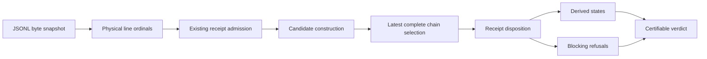

# Design: BUG-042 Same-Revision Receipt Supersession

## Design Brief

### Current State

`scenario-state-resolve.sh` reads scenario receipts from an append-only JSONL
log. It sorts admitted receipts by `ts` and emits refusals during that scan.

The resolver can derive `GREEN_TARGETED` from a later coherent chain while an
older same-revision receipt still blocks certification. The before-fix
discriminator is recorded in `report.md` at `E-B042-REPRO`.

### Target State

The resolver assigns each physical JSONL record a stable one-based append
ordinal. It selects the latest complete proof chain before classifying receipt
diagnostics.

Historical substituted-test, substituted-control, and exit-zero RED receipts
may become nonblocking superseded diagnostics. Later incomplete or invalid
candidates remain visible blockers beside the last valid chain.

### Patterns To Follow

- Keep scenario states derived through
  `bubbles/scripts/scenario-state-resolve.sh`.
- Keep the state and receipt-binding vocabulary in
  `bubbles/registry/scenario-states.yaml`.
- Keep receipt input compatible with schema versions 1 through 3 in
  `bubbles/schemas/tool-call.schema.json`.
- Preserve the focused fixture style in
  `bubbles/scripts/scenario-state-resolve-selftest.sh`.
- Preserve the `BUG-034` drift contract from commit `fc2e7ca` and its three
  persistent drift assertions.

### Patterns To Avoid

- Do not sort by timestamps, test names, JSON object order, or hash values.
- Do not remove, rewrite, or tombstone historical receipt rows.
- Do not exempt a refusal code globally because one historical instance is
  superseded.
- Do not let a receipt declare its own authoritative append position.
- Do not let one scenario or source revision supersede another identity.

### Resolved Decisions

- Physical JSONL line position is the append-order authority.
- Append ordinal and raw-row digest are resolver-derived metadata.
- The tool-call receipt schema does not change for this repair.
- The latest complete chain is selected by its terminal GREEN ordinal.
- Exact duplicate receipts remain distinct because their ordinals differ.
- A later matching GREEN is a newer complete candidate, not a conflict.
- A later partial or invalid candidate blocks without hiding the selected chain.
- Order ambiguity uses `SCS-APPEND-ORDER-CONFLICT` and fails closed.

### Open Questions

None. This design resolves all four questions from the discovery proposal.

## Purpose And Scope

This design changes same-revision receipt interpretation. It does not change
who records receipts, who certifies a scenario, or which states exist.

The production change belongs in `scenario-state-resolve.sh`. Persistent
behavioral coverage belongs in `scenario-state-resolve-selftest.sh`. The state
registry may gain only the two refusal codes defined below.

No network API, user interface, database, or deployment surface participates.
The only stored input is `.specify/runtime/tool-calls.jsonl`.

### Single-Implementation Justification

This is a repair inside the existing scenario-outcome derivation capability.
It adds no provider, adapter, channel, screen, or second resolver. A new
capability foundation would duplicate the current owner without enabling reuse.

## Grounded Root Cause

The current resolver loses append order after parsing. Its `sort_key` returns
only `entry.ts`.

The same pass emits `SCS-RED-NOT-FAILING`, `SCS-TEST-SUBSTITUTED`, and
`SCS-CONTROL-SUBSTITUTED` before authoritative chain selection. The final
`blocking_refusals` filter excludes only `SCS-REVISION-DRIFT`.

This shape makes each refusal irreversible within one invocation. A later
matching GREEN can derive `GREEN_TARGETED`, but it cannot change an older
refusal's blocking effect.

The cheap source check found the controlling lines at the current worktree's
`scenario-state-resolve.sh` lines 306, 307, 356, 401, 406, and 478. The focused
fixture confirms the behavioral difference in `report.md` at `E-B042-REPRO`.

## Architecture Overview

The resolver becomes a five-stage pipeline:

1. Snapshot and enumerate the JSONL ledger.
2. Admit receipts through the existing binding and revision checks.
3. Build complete and incomplete candidates per scenario and source revision.
4. Select one authoritative complete chain per group.
5. Classify every relevant row, then derive states and certifiability.

Selection never mutates diagnosis. Diagnosis never changes selection. This
separation removes the current irreversible side effect.



## Append-Only Ledger Semantics

### Snapshot Boundary

The resolver opens one regular JSONL file and records its initial byte length.
It reads exactly that prefix once. Bytes appended after the snapshot boundary
belong to the next invocation.

Replacement, truncation, or a short read invalidates the invocation as a
runtime error with exit 2. The resolver must not evaluate a moving prefix.

### Append Ordinal

The resolver enumerates physical records before JSON parsing. The first record
has ordinal 1, and each later newline-delimited record increments the ordinal.

Blank, malformed, non-object, and unbound records keep their physical position.
They retain the current admission behavior and do not become scenario evidence.

The resolver never reads an ordinal from receipt JSON. This prevents an
untrusted receipt from choosing its own precedence.

### Ledger Identity

Each parsed row receives this derived local identity:

```json
{
  "appendOrdinal": 17,
  "rowSha256": "<sha256-of-exact-record-bytes>"
}
```

`rowSha256` hashes the exact bytes between newline delimiters. It excludes the
delimiter and performs no JSON normalization.

The pair identifies one row within the supplied ledger snapshot. The digest is
an audit locator, not a signature or authenticity claim.

Two byte-identical rows have the same digest and different ordinals. They are
therefore distinct append events.

### Immutability Boundary

Supersession is a derived disposition. It never rewrites the source row,
changes its ordinal, deletes it, or appends a tombstone.

A later invocation may classify an earlier unresolved row as superseded after
a complete replacement chain is appended. The historical identity and reason
remain stable.

## Receipt And Candidate Data Model

### Existing Receipt Input

The existing top-level receipt and `scenarioBinding` shapes remain unchanged.
Schema versions 1 through 3 remain accepted according to
`tool-call.schema.json`.

No `appendOrdinal`, `rowSha256`, or `ledgerIdentity` field is added to the
receipt schema. `tool-log.sh` remains an append-only producer and needs no
counter, lock, sidecar, or schema migration for this repair.

### Group Key

Candidate selection partitions receipts by this exact scope key:

```text
(scenarioId, sourceRevision)
```

No disposition crosses either component. A chain in another scenario or
revision cannot select, supersede, or resolve a row in this group.

### Proof Identity

The RED and GREEN discriminator uses this exact identity:

```text
(testIdentity, negativeControl)
```

This preserves the current `same-scenario-same-control` registry contract.
The IMPLEMENT receipt must remain structurally valid and ordered between RED
and GREEN. It does not redefine the discriminator.

### Complete Base Chain

A complete base chain contains these rows in strict ordinal order:

```text
RED(exitCode != 0) < IMPLEMENT < GREEN(exitCode == 0)
```

RED and GREEN must share the group key and proof identity. IMPLEMENT must share
the group key and pass existing binding admission.

For each successful GREEN, select the latest matching failing RED that has an
IMPLEMENT receipt between them. Select the latest eligible IMPLEMENT between
that RED and GREEN.

This local choice prevents a candidate from borrowing a later phase across an
intervening campaign accidentally.

### Continuation States

Applicable LIVE, REGRESSION, and OBSERVED receipts may extend the selected base
chain only after its GREEN. They must follow registry rank and existing outcome
rules.

A new RED or IMPLEMENT after the selected GREEN opens a later campaign. Earlier
continuation receipts remain attached to the selected chain, but the new
campaign remains unresolved until it becomes complete.

### Chain Identity

The resolver derives `chainId` from the group key, proof identity, and selected
RED, IMPLEMENT, and GREEN ledger identities. The stable rendering is:

```text
sha256(<length-prefixed-fields-and-ledger-identities>)
```

The implementation must use length-prefixed UTF-8 fields. Delimiter joining is
not allowed because receipt text may contain the delimiter.

## Authoritative Selection

Build every complete base chain before emitting same-revision candidate
refusals. Select the chain with the greatest GREEN append ordinal.

Append ordinals are unique within a valid ledger snapshot. Timestamp equality
has no effect. A timestamp may remain in diagnostics as descriptive metadata.

The closed `selectionStatus` vocabulary is:

| Value | Meaning |
| --- | --- |
| `NO_COMPLETE_CHAIN` | No complete base chain exists for the group. |
| `SELECTED` | One latest complete chain controls derivation and no later conflict exists. |
| `SELECTED_WITH_UNRESOLVED` | A valid chain remains visible, but a later invalid or partial candidate blocks certification. |
| `ORDER_REFUSED` | The resolver detected a non-unique or contradictory append-order invariant. |

If two candidates ever claim the same greatest terminal ordinal, the resolver
must emit `SCS-APPEND-ORDER-CONFLICT`. It must not use timestamp, digest,
iteration order, or lexical identity as a tie breaker.

This invariant cannot occur from a correctly enumerated regular file. The
refusal protects internal adapters and later input forms from choosing silently.

## Receipt Disposition And Diagnostics

Every admitted row in the selected group receives one closed disposition:

| Disposition | Meaning | Blocks |
| --- | --- | --- |
| `SELECTED` | The row belongs to the authoritative chain or its accepted continuation. | No |
| `SUPERSEDED` | A later complete chain directly resolves this older candidate row. | No |
| `UNRESOLVED` | The row belongs to a current invalid, conflicting, or partial candidate. | Yes |
| `EXCLUDED` | Existing admission rules reject the row before candidate selection. | Existing rule |

`EXCLUDED` does not imply nonblocking. `SCS-REVISION-DRIFT` remains the sole
existing excluded nonblocking code under the `BUG-034` contract.

### Closed Supersedable Refusal Set

Only these historical diagnostic codes may change from blocking to superseded:

| Code | Required direct replacement proof |
| --- | --- |
| `SCS-TEST-SUBSTITUTED` | A later selected GREEN matches its selected RED test identity. |
| `SCS-CONTROL-SUBSTITUTED` | A later selected GREEN matches its selected RED negative control. |
| `SCS-RED-NOT-FAILING` | A later selected RED fails for the same proof identity. |
| `SCS-CHAIN-PARTIAL` | A later complete chain closes the same group's incomplete campaign. |

The row must share the selected chain's group key. The replacement row must
have a greater append ordinal.

All other existing refusal codes retain their current blocking semantics.
This includes missing binding, missing negative control, declared state,
cross-scenario substitution, GREEN without RED, and changed implementation refs.

### Later Invalid Candidate

An invalid candidate after the selected GREEN is `UNRESOLVED`. Its original
refusal code remains in `blocking_refusals`.

The selected chain remains in output and continues to explain derived states.
The unresolved diagnostic makes `certifiable` false and the process exits 1.

A still-later complete coherent chain may supersede only the four codes in the
closed set above. It cannot supersede an unrelated or structurally unbound row.

### Later Partial Candidate

A RED or IMPLEMENT after the selected GREEN starts a later campaign. If no
later matching complete base chain closes that campaign, emit
`SCS-CHAIN-PARTIAL`.

The diagnostic names the campaign's first ordinal and missing next phase. It is
`UNRESOLVED`, blocks certification, and does not remove the selected chain.

### Exact Duplicates

An exact duplicate matching GREEN has a new ordinal. It closes a newer complete
candidate using the latest eligible RED and IMPLEMENT.

The newer candidate becomes authoritative. The earlier chain becomes
superseded history. Equal row digests never create an order tie.

### Closed New Refusal Codes

| Code | Condition | Supersedable |
| --- | --- | --- |
| `SCS-CHAIN-PARTIAL` | A later same-group campaign remains incomplete after the last selected GREEN. | Yes, by a later complete same-group chain. |
| `SCS-APPEND-ORDER-CONFLICT` | Candidate ordinals are missing, duplicated, nonpositive, or nonmonotonic inside the resolver model. | No |

No skip, force, ignore, assume, or allow option changes either outcome.

### Text Vocabulary

Existing blocking diagnostics keep the `REFUSED <code>` prefix. Existing
`SCS-REVISION-DRIFT` text remains unchanged.

New nonblocking historical diagnostics use this exact prefix:

```text
SUPERSEDED <code> [<scenarioId>] receipt=<ordinal> supersededBy=<chainId>: <detail>
```

The resolver does not print `PASSED`, `IGNORED`, or `CLEARED` for a historical
row. Those words would hide its retained diagnostic status.

## JSON Output Contract

Existing top-level and per-scenario fields remain. The resolver adds fields only
when at least one same-revision scenario receipt participates in selection.

This conditional addition keeps the three drift-only `BUG-034` fixtures
byte-for-byte stable.

Each affected scenario adds:

```json
{
  "selectionStatus": "SELECTED_WITH_UNRESOLVED",
  "selectedChain": {
    "chainId": "sha256:<digest>",
    "scenarioId": "SCN-B042-005",
    "sourceRevision": "<revision>",
    "testIdentity": "<test>",
    "negativeControl": "<control>",
    "red": {"appendOrdinal": 1, "rowSha256": "<digest>"},
    "implement": {"appendOrdinal": 2, "rowSha256": "<digest>"},
    "green": {"appendOrdinal": 3, "rowSha256": "<digest>"}
  },
  "receiptDispositions": [
    {
      "ledgerIdentity": {"appendOrdinal": 4, "rowSha256": "<digest>"},
      "phase": "green",
      "disposition": "UNRESOLVED",
      "diagnosticCode": "SCS-TEST-SUBSTITUTED",
      "blocking": true,
      "supersededBy": null
    }
  ]
}
```

Each refusal caused by an admitted scenario receipt adds the same
`ledgerIdentity`, `disposition`, `blocking`, and `supersededBy` fields. Existing
`code`, `scenarioId`, and `detail` fields remain unchanged.

`blockingRefusalCount` counts only unresolved blocking diagnostics. Superseded
diagnostics stay present in `refusals` and `receiptDispositions` for audit.

## BUG-034 Compatibility Contract

Commit `fc2e7ca` defines three load-bearing revision-drift outcomes:

1. Drift is reported and excluded from derivation.
2. Drift alone has `blockingRefusalCount: 0` but cannot satisfy required state.
3. Another genuine refusal beside drift remains blocking.

BUG-042 preserves all three outputs and exit codes. It does not add drift to the
supersedable set, and it does not broaden the nonblocking filter by code alone.

The existing `--ignore-drift` rejection remains unchanged. Drift and
same-revision replacement remain separate mechanisms.

## Consumer Impact

The registry names `phase-coordinator.sh` and `state-transition-guard.sh` as
resolver consumers. A current-source search found no third production caller.

`phase-coordinator.sh` invokes JSON mode, validates the whole returned JSON, and
embeds it unchanged under `scenarioStates`. Additive selection fields therefore
require no parser change on an exit-zero result.

The coordinator converts any nonzero resolver invocation to `null`. It does not
expose `SELECTED_WITH_UNRESOLVED` details in its cursor output today. BUG-042
does not change that routing behavior.

`state-transition-guard.sh` invokes text mode with all required states and
`--certifiable`. It treats exit 0 as a pass, exit 2 as a resolver failure, and
every other exit as a certification refusal. It relays the resolver text on
failure and does not parse JSON fields.

Text output retains existing state lines and blocking `REFUSED` prefixes. It
gains `SUPERSEDED` lines only for the new historical disposition.

The focused resolver selftest is the owning behavior test. A transition-level
consumer case must prove both boundaries. A superseded row no longer causes a
false block, while an unresolved later row still causes exit 1.

## Security And Trust Boundaries

- Treat every receipt field as untrusted input until existing binding checks
  admit it.
- Derive ordinal authority from the ledger reader, never from receipt JSON.
- Use row digests only for diagnosis. Do not call them signatures.
- Keep source-revision validation before candidate construction.
- Keep scenario and revision groups isolated.
- Keep non-supersedable refusal codes blocking at every ordinal.
- Keep certification outside the resolver.
- Preserve all no-bypass argument rejections.
- Do not print receipt command bodies or environment values in new diagnostics.

The resolver does not make the JSONL file tamper-evident. Existing filesystem
and receipt provenance controls remain responsible for ledger authenticity.

## Configuration, Migration, And Rollout

This repair adds no configuration key, environment variable, command flag,
sidecar file, or receipt schema version.

Existing v1, v2, and v3 rows receive derived ordinals from their physical line
positions. Mixed-version logs therefore need no rewrite or backfill.

Roll out the selector and focused tests in one source change. Run the resolver
selftest before transition-level consumers. Then run the source framework's
normal validation and release checks through `bubbles/scripts/cli.sh`.

## Rollback

Code rollback restores the previous resolver without changing ledger bytes.
No data rollback or receipt migration exists.

`BUBBLES_SCENARIO_STATE_ROLLBACK=1` retains its current contract. State
advancement stops, receipt rows remain counted, and the resolver never grants
certification from the new selection metadata.

Rollback tests must retain the existing six-receipt count assertion. They must
also show that adding selection metadata never deletes a receipt.

## Observability And Failure Handling

The resolver emits deterministic metadata for each decision.

- It emits the ledger append ordinal.
- It emits the raw-row SHA-256.
- It emits the selected chain identity.
- It emits the receipt disposition.
- It emits the original diagnostic code.
- It emits the blocking status.
- It emits the superseding chain identity when one exists.

Runtime input failures exit 2. Semantic refusals and unsatisfied certifiable
requests exit 1. A clean resolved request exits 0.

The resolver must produce byte-identical JSON for an unchanged ledger snapshot,
manifest, registry, source revision, and argument set.

## Persistent Adversarial Test Matrix

Every row invokes the production resolver through
`scenario-state-resolve-selftest.sh`. Each fixture uses a real JSONL byte order
and asserts JSON fields plus process exit code.

| ID | Receipt sequence | Required result | Negative control |
| --- | --- | --- | --- |
| B042-T01 | failing RED A, IMPLEMENT, GREEN B, GREEN A | Select GREEN A. Mark `SCS-TEST-SUBSTITUTED` superseded. Exit 0 when required states hold. | Remove GREEN A. The substitution becomes unresolved and exit 1. |
| B042-T02 | failing RED control A, IMPLEMENT, GREEN control B, GREEN control A | Select control A. Mark `SCS-CONTROL-SUBSTITUTED` superseded. | Remove the final GREEN. The control substitution blocks. |
| B042-T03 | exit-zero RED A, failing RED A, IMPLEMENT, GREEN A | Select the failing RED. Mark the older `SCS-RED-NOT-FAILING` superseded. | Remove the failing RED. Exit 1 with the original code. |
| B042-T04 | T01 rows with equal timestamps | Produce the same selected ordinals and chain ID on two runs. | Restore timestamp sorting. The selected result changes or the assertion fails. |
| B042-T05 | valid A chain, then mismatched-test GREEN B | Keep A visible. Mark B unresolved. Exit 1. | Suppress later invalid rows. The blocking assertion fails. |
| B042-T06 | valid A chain, then mismatched-control GREEN B | Keep A visible. Mark B unresolved. Exit 1. | Exempt all control substitutions. The assertion fails. |
| B042-T07 | valid A chain, then exit-zero RED A | Keep A visible. Mark the RED unresolved. Exit 1. | Exempt all exit-zero RED rows. The assertion fails. |
| B042-T08 | valid A chain, then failing RED A | Keep A visible. Emit `SCS-CHAIN-PARTIAL`. Exit 1. | Treat the last valid chain as sufficient. The assertion fails. |
| B042-T09 | valid A chain, then failing RED A and IMPLEMENT | Keep A visible. Emit `SCS-CHAIN-PARTIAL` with missing GREEN. Exit 1. | Ignore partial later campaigns. The assertion fails. |
| B042-T10 | valid A chain, invalid B GREEN, then new complete A chain | Select the final A chain. Mark B superseded. Exit 0. | Stop at the first valid chain. The final chain assertion fails. |
| B042-T11 | duplicate matching GREEN rows | Select the greater ordinal. Preserve both identical digests with distinct ordinals. | Deduplicate by digest. Receipt count and ordinal assertions fail. |
| B042-T12 | scenario A blocker and complete scenario B chain | B cannot supersede A. A remains blocking. | Group by revision without scenario ID. The isolation assertion fails. |
| B042-T13 | revision A drift and complete revision B chain | Preserve all three `BUG-034` outcomes exactly. | Add drift to same-revision supersession. The byte comparison fails. |
| B042-T14 | RED A, IMPLEMENT, GREEN B with no matching RED B | No complete chain may combine A and B. Exit 1. | Match only scenario and revision. The false chain is selected. |
| B042-T15 | injected duplicate terminal ordinal with different row digests | Emit `SCS-APPEND-ORDER-CONFLICT`. Select no chain. Exit 1. | Break the tie by timestamp or digest. The refusal assertion fails. |
| B042-T16 | equivalent v1, v2, and v3 receipt envelopes | Derive identical ordinals and selection outcomes. | Require a persisted ordinal. Legacy fixtures fail. |
| B042-T17 | valid chain plus each rejected bypass-shaped flag | Keep every flag at usage exit 2. | Add any bypass branch. The existing no-bypass assertion fails. |
| B042-T18 | valid chain under scenario-state rollback | Stop advancement and preserve every receipt count and identity. | Drop receipts during rollback. The count assertion fails. |

### Scenario-To-Test Mapping

| Planned scenario | Matrix coverage | Assertion |
| --- | --- | --- |
| `SCN-B042-001` | B042-T01, T10 | Historical substituted-test rows lose veto power only after a later coherent chain. |
| `SCN-B042-002` | B042-T02, T06 | Historical control substitution is supersedable, while a later one blocks. |
| `SCN-B042-003` | B042-T03, T07 | A later failing RED repairs old exit-zero history without exempting a current bad RED. |
| `SCN-B042-004` | B042-T04, T11, T15 | Physical append order is deterministic, duplicates remain distinct, and true order conflicts refuse. |
| `SCN-B042-005` | B042-T05, T06, T07, T08, T09 | A prior chain stays visible beside every later invalid or partial candidate. |
| Compatibility | B042-T12, T13, T14, T16, T17, T18 | Identity, revision, schema, bypass, and rollback boundaries remain intact. |

### Test Integrity Requirements

Each supersession case needs a paired fixture without the correcting final row.
Each later-conflict case needs a mutation that incorrectly suppresses the row.

Tests must assert resolver-produced selection and disposition fields. They must
not assert only the fixture bytes they wrote.

The focused suite must compare repeated JSON output for determinism. The
transition consumer test must assert the final certification decision, not only
the resolver's intermediate text.

## Alternatives And Tradeoffs

| Alternative | Decision |
| --- | --- |
| Make all three historical codes globally nonblocking | Rejected. It would hide unresolved latest candidates. |
| Persist an ordinal in schema v4 | Rejected. It adds shared-writer locking and lets receipt data claim precedence. Physical line order already carries append authority. |
| Persist the row digest | Rejected. A digest inside its own row needs an exclusion rule and adds no authenticity. Derive it from raw bytes. |
| Delete or compact old receipts | Rejected. It violates append-only evidence history. |
| Choose the newest individual row | Rejected. One row cannot prove RED, implementation, and GREEN ordering. |
| Keep timestamp ordering with a lexical tie break | Rejected. Descriptive metadata cannot become evidence authority. |
| Clear derived states on any later problem | Rejected. It hides a valid chain instead of reporting valid history and current conflict together. |
| Extend the `BUG-034` code exemption | Rejected. Revision exclusion and same-revision candidate replacement have different predicates. |

## Complexity Tracking

| Decision | Simpler alternative | Why the alternative fails |
| --- | --- | --- |
| Snapshot, select, then diagnose | Remove earlier refusal objects after the current scan | Removal by code cannot distinguish an older conflict from a later one safely. |
| Derived ordinal plus row digest | Keep timestamps as the only ordering key | Equal and skewed timestamps cannot establish append precedence. |
| Preserve selected chain beside blockers | Return only the latest candidate | A partial or invalid latest candidate would erase valid audit history. |
| Closed supersedable code set | Mark every older refusal superseded | Missing binding and cross-scenario evidence cannot be repaired by a same-group chain. |
| Eighteen-case persistent matrix | Cover only the reproduced substituted-test case | The same algorithm controls control substitution, RED validity, ties, partial candidates, identity isolation, and rollback. |

## Open Questions And Risks

### Remaining Questions

None.

### Risks

1. A broad historical exemption could hide current invalid evidence. The closed
   four-code set and later-candidate matrix prevent that failure.
2. A selector could combine phases across proof identities. B042-T14 prevents
   that failure.
3. Additive JSON fields could surprise strict consumers. Consumer tests must
   parse named existing fields and tolerate additions.
4. A moving log could produce invocation-dependent ordinals. The byte-prefix
   snapshot makes concurrent appends visible only on the next invocation.
5. Raw-row digests could be misread as tamper proof. The output and docs must
   call them audit locators only.

## Implementation Boundary

The design author changes no source, test, registry, planning, report,
acceptance, release, or certification artifact in this phase.

The implementation owner may change only the resolver, its owning selftest,
and the scenario-state registry entries required by the two new refusal codes.
The planning owner must first reconcile the current five-scenario plan with the
full matrix and consumer checks in this design.
