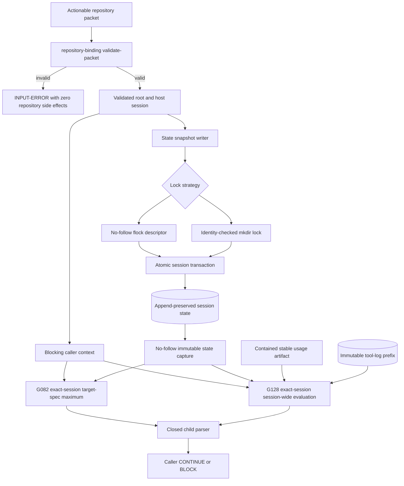
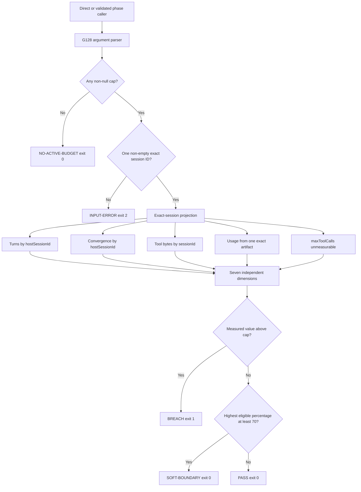

# BUG-054 Design - Authoritative Host-Session Cap Enforcement

## Design Brief

### Current State

The current candidate validates repository binding only after `state-snapshot.sh`
derives repository paths and opens its session lock. Its flock open can follow a
planted symlink and truncates an existing target.

`session-cap-guard.sh` reads one shared top-level `sessionBudget` and reopens the
mutable session pathname throughout one verdict. Its projections can drop
invalid timestamps, accept present null byte fields, and ignore unknown cap
keys.

The VS Code usage adapter suppresses traversal failures and transports paths by
newline. Check 40 and framework validation trust ambient identity and select the
last G128-looking status. G082 still combines retained sessions.

### Target State

One actionable repository packet establishes the repository and active host
session before any repository-local side effect. Session policy, state, usage,
G082, and G128 then use that exact identity.

Each G128 verdict evaluates one immutable state revision and one exact-session
budget head. Unsafe, unstable, incomplete, or malformed input produces one
closed `INPUT-ERROR` result instead of a partial measurement.

### Patterns to Follow

- Use `repository-binding.sh validate-packet` as the authority check.
- Preserve `repository-binding.sh mirror-session` inside the state transaction.
- Preserve same-directory atomic replacement for complete session documents.
- Preserve append-only turn snapshots and tool-log rows.
- Preserve the tool-call schema's integer byte constraints.
- Use `generate-release-manifest.sh` as the only release-manifest writer.

### Patterns to Avoid

- Do not derive repository or session authority from environment presence.
- Do not read policy from the legacy unscoped `sessionBudget` object.
- Do not reopen a replaceable pathname during one verdict.
- Do not select a child verdict with a last-match heuristic.
- Do not suppress traversal, read, stability, or parse failures.
- Do not use dictionaries or sets to prove receipt row multiplicity.
- Do not introduce IMP-055 admission, permit, broker, or epoch concepts.

### Resolved Decisions

- Add append-only, exact-session budget records beside legacy state.
- Select one validated budget head for the active session.
- Capture session state through a no-follow immutable-read helper.
- Open flock targets without following, creating, or truncating unsafe objects.
- Retain the mkdir lock strategy with identity-checked stale recovery.
- Require one closed child status and process-exit pair.
- Bind G082 and G128 to the same validated host session.
- Keep G082's target-spec maximum and G128's session-wide sum distinct.
- Parse one exact usage artifact through a stable open descriptor.
- Regenerate release metadata only after final managed bytes freeze.

### Brief Open Questions

None. The specification and RF-B054-01 through RF-B054-09 resolve the required
behavior.

## Purpose And Scope

BUG-054 repairs the existing post-activity G082 and G128 enforcement path. It
does not create pre-dispatch resource admission.

The design covers repository authority, session policy, state I/O, usage,
diagnostics, and caller parsing.

It also covers G082 selection, concurrency, portability, and release metadata.

The design preserves these invariants:

- The seven cap names remain unchanged.
- Existing numeric declarations remain unchanged.
- A missing known cap remains equivalent to `null`.
- A measured value breaches only when it is strictly greater than its cap.
- The soft boundary remains the existing whole-number calculation at 70 percent.
- `maxToolCalls` remains unmeasurable with `no-exact-producer`.
- Turn snapshots, policy history, and tool receipts remain append-only.
- Legacy unscoped state remains stored and never gains inferred ownership.
- G128 remains session-wide and read-only.
- G082 remains a per-spec maximum.
- No bypass flag exists.

## Grounded Current Source Baseline

This table records source behavior read during this design run. It does not
represent passing validation evidence.

| Surface | Current source behavior | Required design change |
| --- | --- | --- |
| `bubbles/scripts/state-snapshot.sh` | Copies the packet privately, then extracts `repositoryRoot`, creates `.specify/memory`, and opens a lock before `mirror-session` validates authority. | Validate the private packet first. Derive and open repository-local paths only after success. |
| `bubbles/scripts/state-snapshot.sh` | Opens the flock target with `exec 9>`, which follows symlinks and requests truncation. | Use a no-follow, non-truncating regular-file open and hold one stable descriptor. |
| `bubbles/scripts/state-snapshot.sh` | Writes attributed turns and keys convergence by session, spec, and agent. | Preserve those records while adding exact-session policy persistence under the same transaction. |
| `bubbles/scripts/session-cap-guard.sh` | Reads one top-level `sessionBudget` and repeatedly invokes `jq` against the live pathname. | Select one exact-session policy from one immutable captured revision. |
| `bubbles/scripts/session-cap-guard.sh` | Drops invalid matching timestamps through `try ... catch empty`. | Count and reject every invalid matching timestamp before calculating elapsed time. |
| `bubbles/scripts/session-cap-guard.sh` | Accepts extra budget keys and accepts present null byte fields. | Enforce a closed versioned budget schema and the tool-call integer contract. |
| `bubbles/scripts/session-cap-guard.sh` | Prints unknown arguments without one-line escaping. | Encode every untrusted value as one JSON string literal. |
| `bubbles/adapters/usage/vscode-copilot.sh` | Suppresses `find` failures, uses newline path transport, and reopens a selected pathname. | Traverse without following links, transport all filename bytes, and parse one stable descriptor. |
| `bubbles/scripts/convergence-cap-guard.sh` | Filters by spec path and computes one maximum across every retained session. | Add exact `hostSessionId` selection while preserving the target-spec maximum. |
| `bubbles/scripts/guards/tail-convergence-gates.sh` | Check 23 lacks session identity. Check 40 trusts ambient identity, retains the last G128 status, and skips an unavailable guard. | Validate one actionable packet, bind both guards to its session, parse one closed result, and fail closed. |
| `bubbles/scripts/framework-validate.sh` | The live G128 check trusts ambient identity and treats child exit zero as success without validating one final status. | Validate authority and enforce the same closed result matrix as Check 40. |
| `bubbles/scripts/tool-log.sh` | Appends `sessionId`, `stdoutBytes`, and `stderrBytes` to JSONL. | Keep the producer unchanged. Validate row multiplicity and byte shape in consumers and tests. |
| `bubbles/schemas/tool-call.schema.json` | Permits absent byte fields but requires non-negative integers when present. | Make G128 reject present null, non-integer, or negative matching byte members. |
| `bubbles/scripts/runtime-concurrency-selftest.sh` | Checks unique session IDs and row counts, then evaluates G128 only after the primary lock strategy. | Assert every mapping and both verdicts after both lock strategies. |
| `bubbles/scripts/tool-log-selftest.sh` | Builds a dictionary keyed by session ID before checking concurrent rows. | Compare exact row deltas and require one physical row per expected session. |
| `tests/regression/test_22_session_cap_enforcement.sh` | Exercises the direct G128 guard but not packet authority, G082, state production, or both lock strategies. | Restrict its claims or extend collective persistent coverage across those production paths. |
| `bubbles/scripts/generate-release-manifest.sh` | Computes managed and source-only checksums and offers a deterministic `--check` mode. | Run generation after final inputs freeze, then run `--check` on unchanged bytes. |

## Root Finding Reconciliation

| Root | Design disposition | Testable completion signal |
| --- | --- | --- |
| RF-B054-01 | Validate actionable authority before repository-local path derivation. Use safe flock and mkdir lock contracts. | Invalid authority creates no repository entry. Planted targets remain byte-identical. |
| RF-B054-02 | Give Check 40 and framework validation a validated packet context. Require one closed child status and exit pair. | Ambient-only identity, unavailable guards, and malformed child results block. |
| RF-B054-03 | Add exact-session append-only budget records with one active chain head. Preserve independent all-null policy. | Two sessions retain different values and independent default-off behavior. |
| RF-B054-04 | Capture one immutable session revision. Validate timestamps, budget keys, and present byte members completely. | A replacement affects only a later invocation. Invalid matching input never yields a subset total. |
| RF-B054-05 | Traverse usage roots completely without following links. Select and parse one stable exact object. | Traversal, transport, containment, read, stability, or parse failure returns `INPUT-ERROR`. |
| RF-B054-06 | JSON-quote every user-controlled diagnostic value. Keep trusted tokens closed. | Newline, tab, escape, quote, and delimiter inputs produce one physical diagnostic line. |
| RF-B054-07 | Add exact-session G082 filtering while retaining its target-spec maximum. | Another session cannot change G082. G128 still sums the active session across specs. |
| RF-B054-08 | Require persistent, concurrency, caller, lock, mapping, and interpreter proof that matches executed paths. | Each claimed path executes with row-level and interpreter assertions. |
| RF-B054-09 | Freeze managed inputs before generation and validation. | Manifest generation, freshness check, framework validation, and release check share one unchanged epoch. |

## Single-Implementation Justification

This repair extends one existing session-enforcement capability. It adds no
provider family, admission framework, broker, or policy engine.

A narrow internal safe-I/O helper prevents duplicated security logic. That
helper serves this repair only and does not create a plugin or adapter system.

## Architecture Overview



## Authority And Side-Effect Boundary

### Required Authority Inputs

Repository-sensitive writers and blocking callers consume this complete set:

- `sessionId`
- external `sessionControlFile`
- private `bindingPacketFile`
- optional paired `scenarioFile` and `nodeId`

The environment may transport these paths and values. Environment presence does
not establish authority.

`repository-binding.sh validate-packet` must confirm the packet before the
consumer accepts its root or session. The validated
`repositoryResolution.sessionId` must equal the forwarded guard session.

### State Snapshot Ordering

`state-snapshot.sh` follows this sequence:

1. Parse arguments and validate non-repository values.
2. Copy the packet into a mode-0600 private temporary file outside the repository.
3. Validate that private copy against the external control record.
4. Stop on any malformed, stale, non-actionable, mismatched, or scoped conflict.
5. Extract the root and exact session only from the validated private bytes.
6. Derive repository-local state and lock paths.
7. Validate the complete path chain without following a symlink.
8. Acquire one safe lock.
9. Revalidate through `mirror-session` while holding that lock.
10. Apply policy, turn, mirror, and convergence changes atomically.
11. Release the lock and remove every private temporary artifact.

A failure before step 8 leaves the repository entry set and state bytes
unchanged. A revalidation failure inside the lock may acquire and release the
lock, but it writes no state.

### Blocking Caller Ordering

Check 23, Check 40, and live framework validation validate one packet before
invoking a cap guard. They use the packet session directly and ignore a
conflicting ambient value.

The callers do not derive identity from CWD, PID, timestamps, repository state,
workspace order, record recency, or `cli.sh::CURRENT_SESSION_ID`.

## Safe Session State I/O

### Planned Internal Helper

Plan one internal helper at `bubbles/scripts/session-state-io.py`. This path is a
planned implementation surface, not an existing source claim.

The helper uses Python standard-library descriptor operations because portable
shell redirection cannot guarantee `O_NOFOLLOW`. Missing Python causes a loud
operational failure. It never selects an unsafe shell open.

The helper owns these primitives:

| Primitive | Input | Result |
| --- | --- | --- |
| Immutable capture | Validated root, repository-relative path, private destination | Exact bytes, byte count, SHA-256 revision, and stable file identity |
| Flock execution | Validated root, lock path, bounded wait, child transaction | One held no-follow descriptor for the complete child transaction |
| Mkdir execution | Validated root, lock directory, bounded wait, child transaction | One identity-checked directory claim for the complete child transaction |
| Stable artifact parse | Configured root and exact filename bytes | Parsed records from one no-follow regular descriptor |

The helper returns a closed status for captured, absent, unsafe, changed, I/O
failure, parse failure, or usage error. Callers map unsafe or changed input to
`INPUT-ERROR`.

### No-Follow Flock Contract

The flock strategy must:

1. Walk the validated parent path without following any symlink component.
2. Open the lock with `O_CREAT | O_RDWR | O_NOFOLLOW | O_CLOEXEC` and mode 0600.
3. Omit `O_TRUNC`.
4. Require the opened object to be a regular file.
5. Acquire an exclusive kernel lock within the existing bounded wait.
6. Compare descriptor identity with the directory entry after acquisition.
7. Reject replacement before the protected transaction starts.
8. Keep the descriptor open until the transaction completes.
9. Leave the persistent lock file in place after release.

A symlink, directory, device, FIFO, socket, or replaced entry is an error. The
helper never opens the target behind such an entry.

### Mkdir Lock Contract

The mkdir strategy must:

1. Create the lock directory atomically beneath the validated physical parent.
2. Reject a symlink or non-directory entry at the lock name.
3. Create the holder record without following and without replacing an entry.
4. Keep absent, live, stale, and changed identities distinct.
5. Recheck device, inode, and holder identity before a stale rename claim.
6. Refuse a changed instance and retry within the existing bounded wait.
7. Remove only the exact claimed stale directory.
8. Release only the instance owned by the current process.

The two strategies protect the same transaction boundary. Neither strategy may
proceed unlocked.

### Immutable Read Contract

G082 and G128 capture `bubbles.session.json` once per verdict. The capture
process must:

1. Resolve the path beneath the validated repository root.
2. Reject every symlink component and a symlink final entry.
3. Open the final entry once with `O_RDONLY | O_NOFOLLOW`.
4. Require a regular file.
5. Record device, inode, size, modification time, and change time.
6. Read until clean EOF without truncating the bytes.
7. Recheck the descriptor identity and metadata.
8. Reject a change observed during capture.
9. Write the exact bytes to a private mode-0600 snapshot.
10. Compute `sha256:<hex>` over those bytes.

All budget, turn, and convergence parsing uses the private snapshot. The guard
never reopens the repository pathname during that verdict.

A concurrent atomic replacement may affect the next invocation. It cannot
change the current private snapshot.

G128 applies the same immutable-prefix rule to `tool-calls.jsonl`. An absent log
makes the byte dimensions unmeasurable. A malformed captured line makes the
input invalid.

## Session Budget Data Model

### Additive State Shape

The repair adds `sessionBudgetHistory[]`. It preserves the legacy top-level
`sessionBudget` object byte-for-byte and never treats it as session policy.

```json
{
  "sessionBudget": {
    "maxToolCalls": 350
  },
  "sessionBudgetHistory": [
    {
      "recordSchemaVersion": 1,
      "hostSessionId": "vscode-opaque-id",
      "revision": 1,
      "supersedesRevision": null,
      "recordedAt": "2026-09-01T00:00:00Z",
      "budget": {
        "schemaVersion": 1,
        "maxTotalConvergenceIterations": 180,
        "maxWallClockMinutes": 180,
        "maxToolCalls": 350,
        "maxSingleToolResultBytes": 50000,
        "maxCumulativeToolResultBytes": 250000,
        "maxPromptTokensPerRequest": null,
        "maxCumulativePromptTokens": null
      }
    }
  ]
}
```

The example demonstrates shape only. Runtime values come from the existing
mode or operator policy. No design example creates a new default.

### Record Validation

A budget-history record is valid only when:

- `recordSchemaVersion` is the integer `1`.
- `hostSessionId` is a non-empty string.
- `revision` is a positive integer.
- `supersedesRevision` is null or a smaller positive integer.
- `recordedAt` is a valid UTC RFC3339 timestamp.
- `budget` is an object.
- `budget.schemaVersion` is the integer `1`.
- Every present cap is null or a non-negative integer.
- No unknown outer or budget key exists.

The closed `budget` key set contains `schemaVersion` plus the seven existing cap
names. A missing known cap reads as null. Writers emit all seven names so policy
snapshots remain explicit.

### Active Policy Selection

Budget selection runs before measurement:

1. Validate the complete budget-history array from the immutable state revision.
2. Classify records by exact `hostSessionId`.
3. Validate every matching record and its revision relation.
4. Require one linear revision chain for the active session.
5. Reject duplicate revisions, missing predecessors, cycles, and branches.
6. Select the unique chain head.
7. Treat an absent head or an all-null head as exact-session default-off.
8. Evaluate only a head with at least one non-null cap.

Records for another session remain retained and excluded. Malformed records for
the active session produce `INPUT-ERROR`.

A legacy unscoped `sessionBudget` never activates a host session. It cannot
satisfy unattended boundedness and cannot trigger identity requirements.

### Policy Writes And Corrections

`state-snapshot.sh` gains paired internal policy inputs:

- `--session-budget-json <object>`
- `--expected-session-budget-revision <non-negative-integer>`

Both arguments must appear together. The budget object contains only the
version and seven existing cap fields.

The first write expects revision zero and appends revision one. Repeating the
same write is idempotent. A different payload at revision zero is a conflict.

A correction names the current head revision. The writer appends one new record
whose `supersedesRevision` names that head. A stale expected revision fails
without changing state.

This compare-and-append rule prevents lock order from becoming policy. It also
prevents a last-writer-wins budget race.

The four orchestrator agent contracts must seed their exact session through this
writer. `autonomy-resolve.sh` must inspect only the same session head when it
checks unattended boundedness.

## Session And Receipt Record Validation

### Turn Snapshots

A turn is matching only when `hostSessionId` is a non-empty string equal to the
active ID. A non-string, absent, null, or empty value is unattributed.

Every matching turn must be an object with a valid RFC3339 `timestamp`. One
invalid or missing matching timestamp invalidates wall-clock measurement and the
complete G128 verdict.

Excluded turns remain excluded even when their timestamp is malformed. No
excluded value may affect active measurements.

One valid matching turn measures zero minutes. No matching turn makes wall-clock
usage unmeasurable.

### Convergence Rows

A matching G128 row requires the exact active session. G128 sums every valid
matching `iterationCount` across specs and agents.

A matching G082 row requires the exact active session and target spec. G082
selects the maximum valid `iterationCount` for that target spec.

A matching value must be a non-negative integer. One malformed matching row
produces `INPUT-ERROR` without a partial sum or maximum.

### Tool Receipts

A tool-log row is matching only when `sessionId` exactly equals the active ID.
Malformed JSON prevents safe classification and produces `INPUT-ERROR`.

A matching row is byte-bearing when either byte member exists. Each present
member must be a non-negative integer. A present null, string, fraction, or
negative value is invalid.

One absent pair member contributes zero only when the other member exists and is
valid. A row with neither member remains matching but byte-ineligible.

Maximum and cumulative byte values use the same complete matching byte-bearing
population.

### Tool Call Count

The legacy `toolCallCount` scalar remains stored and unattributed. Tool-log row
count also remains ineligible.

`maxToolCalls` always reports `UNMEASURABLE` with
`reason=no-exact-producer` under BUG-054.

## Exact Usage Artifact Contract

### Complete Traversal

The VS Code adapter must walk each configured root without following directory
or file symlinks. Any root or traversal failure returns nonzero.

The traversal uses byte-preserving directory APIs. It never transports a path
through newline-delimited shell text.

Candidate selection compares the filename bytes with the exact session ID plus
`.jsonl` or `.json`. The session ID never enters a glob or regular expression.

Zero exact candidates, prefix-only candidates, or multiple exact candidates
produce the neutral shape. Those states are honest ambiguity, not errors.

### Containment And Stability

For one exact candidate, the adapter must:

1. Prove that every walked directory remains beneath the configured root.
2. Open the candidate relative to its validated parent descriptor.
3. Use `O_RDONLY | O_NOFOLLOW`.
4. Require a regular file.
5. Record identity and metadata before reading.
6. Read one complete byte stream.
7. Recheck identity and metadata after reading.
8. Parse only the captured bytes.

A containment failure, symlink, replacement, short read, or read error produces
`INPUT-ERROR`. The adapter never returns a valid-looking subset.

### Complete Request Validation

For `.jsonl`, every non-empty physical record must parse as JSON. For `.json`,
the complete document must parse once.

A request-like object is any object carrying a host usage field from the
adapter's documented field set. Every such object must carry a non-negative
integer `promptTokens` value.

A selected artifact with no request-like object returns the neutral shape. A
mixed population containing null, missing, fractional, string, or negative
prompt tokens is invalid.

A measured `session` result uses a closed object shape.

The object contains:

- The requested `sessionId`.
- `identityMatch: "exact"`.
- `artifactCount: 1`.
- The request count.
- Cumulative prompt tokens.
- Maximum prompt tokens.
- Existing completion, credit, and model projections when valid.

G128 validates the identity proof and numeric token totals before measurement.

## Direct Guard Contracts

### G128

```text
bash bubbles/scripts/session-cap-guard.sh --session-id <id> [--quiet]
```

The direct guard accepts exactly one optional session argument. It requires that
argument when any session-bound policy record has a non-null cap.

No session state, no session policy history, no exact-session policy head, or an
all-null exact head returns `NO-ACTIVE-BUDGET` with exit zero.

A direct result labels authority as `not-validated` and enforcement as
`diagnostic-only`. A blocking caller supplies authority separately.

### G082

```text
bash bubbles/scripts/convergence-cap-guard.sh <specDir> --session-id <id> [--quiet]
```

G082 requires one exact session ID. It evaluates one immutable state revision
and the existing workflow convergence cap.

G082 emits only `PASS`, `BREACH`, or `INPUT-ERROR`. It never consumes the G128
session budget or emits a G128 soft boundary.

### Final Record Grammar

Each guard emits exactly one final semantic line. It uses fixed trusted fields
before any escaped untrusted value.

```text
G128 status=<NO-ACTIVE-BUDGET|PASS|SOFT-BOUNDARY|BREACH|INPUT-ERROR> exit=<0|1|2> session=<json-string>
G082 status=<PASS|BREACH|INPUT-ERROR> exit=<0|1|2> session=<json-string> spec=<json-string>
```

Every earlier line uses a different trusted record prefix. Untrusted values are
complete JSON string literals on one physical line.

## Blocking Caller Contract

### Validated Context Transport

The blocking scripts consume these environment transports:

- `BUBBLES_SESSION_ID`
- `BUBBLES_SESSION_CONTROL_FILE`
- `BUBBLES_BINDING_PACKET_FILE`
- optional paired `BUBBLES_BINDING_SCENARIO_FILE` and `BUBBLES_BINDING_NODE_ID`

The consumer validates the packet before guard invocation. It then stores the
validated session in a local readonly variable and passes that value explicitly.

A missing transport member, failed validation, non-actionable packet, stale
revision, root mismatch, session mismatch, or unpaired scenario input creates a
caller-owned `INPUT-ERROR`.

### Child Availability

A blocking guard must be a non-symlink regular executable file at its registered
path. Missing, non-regular, non-executable, or replaced enforcement fails closed.

Check 23, Check 40, and framework validation do not print an advisory skip for
unavailable enforcement.

### Closed Child Parser

Each caller captures one child invocation and its complete output. It counts
final records instead of retaining the last match.

The parser requires exactly one anchored final record. It rejects zero, two,
malformed, contradictory, unknown, or extra final records.

| Guard | Child process exit | Accepted status | Caller action |
| --- | ---: | --- | --- |
| G128 | 0 | `NO-ACTIVE-BUDGET`, `PASS`, or `SOFT-BOUNDARY` with `exit=0` | Continue with the exact meaning. |
| G128 | 1 | `BREACH` with `exit=1` | Block as a measured session breach. |
| G128 | 2 | `INPUT-ERROR` with `exit=2` | Block as invalid input or authority. |
| G082 | 0 | `PASS` with `exit=0` | Continue. |
| G082 | 1 | `BREACH` with `exit=1` | Block the target spec. |
| G082 | 2 | `INPUT-ERROR` with `exit=2` | Block as invalid input or authority. |
| Either | Any other value | None | Emit caller-owned `INPUT-ERROR`. |

The declared `exit` field must equal the process exit. The caller never changes
exit two into a breach and never accepts exit zero without a valid status.

### Caller Output

Check 40 and framework validation replay the complete child output. They append
one caller-owned final record with `source=guard` on a valid child result.

They use `source=caller` for authority, availability, parser, or unexpected-exit
failure. They preserve `BREACH` and `INPUT-ERROR` as different statuses.

## Diagnostic And Escaping Contract

Every user-controlled value is encoded by one shared JSON-string encoder. This
includes session IDs, spec paths, unknown arguments, adapter roots, filenames,
and unexpected observed text.

The encoder must escape newline, carriage return, tab, backslash, quote, escape,
control bytes, and delimiter characters. It must not strip or reinterpret valid
bytes.

Trusted record prefixes, field names, statuses, actions, reasons, and exits come
from closed literals. A user value cannot create a second record or hide the
final status.

An active G128 evaluation uses the following record order.

1. Authority and exact-session identity.
2. Immutable state revision.
3. Selected policy revision.
4. Record counts for each source.
5. All seven dimension rows.
6. Measured and unmeasurable totals.
7. One action.
8. One final G128 status.

`--quiet` removes explanatory prose only. It retains every required semantic
record.

Diagnostics never print packet, control-file, session-log, repository, or usage
artifact paths.

## Preservation And Concurrency

### State Preservation

The state transaction preserves every unrelated top-level field. It appends one
turn and updates only the exact convergence key.

A convergence write uses `(hostSessionId, specDir, agent)`. It preserves every
legacy and mismatched row.

A policy write appends one revision. It never rewrites an earlier revision or
another session's chain.

### Receipt Preservation

`tool-log.sh` remains unchanged. Concurrent tests record the log line count
before writers start and after every writer joins.

The final delta must equal the writer count. Exactly one physical row must match
each expected session. Extra, duplicate, or missing rows fail the test.

### Same-Key Concurrency

The concurrency harness uses at least two sessions with the same spec and agent.
It asserts every exact mapping:

```text
host-a -> expected iteration -> expected budget revision -> expected verdict
host-b -> expected iteration -> expected budget revision -> expected verdict
```

The harness runs the complete mapping and both G082 and G128 verdict pairs after
the flock strategy. It repeats the same proof after the mkdir strategy.

Counts, unique-ID totals, dictionaries, and sets may supplement this proof. They
cannot replace row-level assertions.

## Bash And Platform Proof

Every changed shell production child must report its actual interpreter to the
fixture. An outer `/bin/bash` process is insufficient proof.

The stock macOS path runs each changed entrypoint through `/bin/bash`. Child
shims record `BASH`, `BASH_VERSION`, and the invoked source path before executing
the real child.

The test must prove that every expected child record exists and identifies Bash
3.2 on the stock macOS run. A missing child record fails the test.

The Linux run executes the same scenarios under the repository's supported Bash
and GNU userland. Both platforms must preserve statuses, exits, state mappings,
and diagnostics.

The planned Python helper uses only standard Unix descriptor APIs available on
macOS and Linux. Its absence or unsupported flag is a loud failure.

## Configuration, Migration, And Rollout

### Configuration Preservation

`bubbles/workflows.yaml` keeps every existing cap declaration and numeric value.
Only attribution and measurability prose changes.

The known values `180`, `350`, `50000`, `250000`, `2`, `90`, and `250` remain
byte-equivalent wherever the current modes declare them. Existing nulls remain
null.

### Additive Migration

The migration adds `sessionBudgetHistory[]` without rewriting state. Legacy
`sessionBudget` remains readable historical data and becomes enforcement-inert.

No automatic process assigns a legacy policy to a host session. A new exact
session receives a new explicit revision from its validated caller.

Readers accept state without the new array as default-off. They reject malformed
new records for the requested session.

### Consumer Reconciliation

The plan must reconcile every current session-budget consumer.

Current source references include:

- `bubbles/scripts/session-cap-guard.sh`.
- `bubbles/scripts/autonomy-resolve.sh`.
- `agents/bubbles.goal.agent.md`.
- `agents/bubbles.workflow.agent.md`.
- `agents/bubbles.iterate.agent.md`.
- `agents/bubbles.sprint.agent.md`.
- Check 23 and Check 40 in `bubbles/scripts/guards/tail-convergence-gates.sh`.
- The live G128 check in `bubbles/scripts/framework-validate.sh`.

The plan must also admit G082 source, G082 tests, the safe-I/O helper, and their
consumer tests into the active work boundary.

### Release Sequence

1. Finish all managed source, test, contract, and expected-behavior edits.
2. Confirm that no required managed path remains outside the change boundary.
3. Run `generate-release-manifest.sh` in generation mode.
4. Freeze the resulting candidate bytes.
5. Run `generate-release-manifest.sh --check`.
6. Run focused tests against the same bytes.
7. Run full framework validation against the same bytes.
8. Run release check against the same bytes.
9. Restart at step 1 after any managed-byte change.

A manifest freshness pass from an earlier revision cannot certify later bytes.

## Failure Handling

| Failure | Guard or caller result | State effect |
| --- | --- | --- |
| Packet missing, stale, malformed, or non-actionable | Caller `INPUT-ERROR`, exit 2 | No guard invocation and no state write |
| Packet session differs from forwarded session | Caller `INPUT-ERROR`, exit 2 | No guard invocation and no state write |
| Unsafe flock or mkdir target | Writer operational failure | Existing target and session bytes unchanged |
| Session state absent | G128 `NO-ACTIVE-BUDGET`, exit 0 | None |
| Exact session has no policy head | G128 `NO-ACTIVE-BUDGET`, exit 0 | None |
| Exact policy head is all null | G128 `NO-ACTIVE-BUDGET`, exit 0 | None |
| Legacy unscoped policy only | G128 `NO-ACTIVE-BUDGET`, exit 0 | Legacy object retained |
| Policy chain duplicate, branch, cycle, or unknown key | G128 `INPUT-ERROR`, exit 2 | None |
| Session file changes during capture | `INPUT-ERROR`, exit 2 | None |
| Invalid matching timestamp | G128 `INPUT-ERROR`, exit 2 | None |
| Present invalid matching byte field | G128 `INPUT-ERROR`, exit 2 | None |
| No exact usage candidate | Token dimensions unmeasurable | None |
| Usage traversal, read, stability, or parse failure | G128 `INPUT-ERROR`, exit 2 | None |
| G128 measured value equals cap | No breach, possible soft boundary | None |
| G128 measured value exceeds cap | `BREACH`, exit 1 | None |
| G082 active-session maximum exceeds cap | `BREACH`, exit 1 | None |
| Child final record or exit is invalid | Caller `INPUT-ERROR`, exit 2 | None |
| Blocking guard is unavailable | Caller `INPUT-ERROR`, exit 2 | None |

## Testing And Validation Strategy

### Root-To-Proof Matrix

| Root | Required test surface | Required assertion |
| --- | --- | --- |
| RF-B054-01 | `state-snapshot-selftest.sh`, safe-I/O helper selftest | Invalid authority leaves zero repository entries. Flock and mkdir targets reject symlinks, non-regular files, and replacement races without byte changes. |
| RF-B054-02 | `state-transition-guard-selftest.sh`, `framework-validate-tier-selftest.sh` | Full packet validation precedes invocation. Every status-count, vocabulary, exit-pair, and guard-availability case uses the closed result. |
| RF-B054-03 | `state-snapshot-selftest.sh`, `session-cap-guard-selftest.sh`, `autonomy-resolve-selftest.sh` | Two sessions preserve different policy chains. One bounded session does not activate an all-null or absent sibling. |
| RF-B054-04 | `session-cap-guard-selftest.sh`, safe-I/O helper selftest | One state revision backs a verdict. Invalid matching timestamps, unknown budget keys, and present invalid byte members fail closed. |
| RF-B054-05 | `usage-adapter-contract-selftest.sh` | Newline filenames, symlinks, traversal failure, unreadable files, replacement, mixed tokens, and malformed JSON cannot produce neutral or partial measured data. |
| RF-B054-06 | direct-guard and caller selftests | Control-byte arguments remain one escaped line and cannot add a final status. |
| RF-B054-07 | `convergence-cap-guard-selftest.sh`, `state-transition-guard-selftest.sh` | G082 excludes another session and retains the target-spec maximum. G128 retains the session-wide sum. |
| RF-B054-08 | runtime concurrency, tool-log, persistent regression, platform matrix | Exact row deltas, every mapping, both lock verdict pairs, callers, G082, and actual child interpreters are proven. |
| RF-B054-09 | manifest check, framework validation, release check | All final commands run after generation on one unchanged candidate. |

### Technical Scenarios

#### Authority Before Side Effects

```gherkin
Given a packet is stale, non-actionable, malformed, or bound to another root
And the selected repository-local state directory does not exist
When state snapshot receives that packet
Then packet validation fails before the directory or lock name is created
And no repository-local byte changes
```

#### Safe Lock Refusal

```gherkin
Given a flock target is a symlink to a sentinel regular file
When an actionable state snapshot attempts to acquire its lock
Then the snapshot fails without opening the symlink target
And the sentinel bytes remain identical
And no session state is written
```

#### Exact Budget Isolation

```gherkin
Given host-a has a bounded policy head
And host-b has an all-null policy head
When both sessions evaluate the same retained state
Then host-a uses only its policy and records
And host-b receives NO-ACTIVE-BUDGET
And legacy unscoped policy remains stored and unused
```

#### Immutable Revision

```gherkin
Given the session pathname is atomically replaced during a G128 capture
When G128 completes one evaluation
Then every policy and event value comes from one captured SHA-256 revision
And the replacement can affect only the next invocation
```

#### Complete Usage Failure

```gherkin
Given one exact candidate exists beside a subtree that cannot be traversed
When the adapter enumerates the configured root
Then enumeration fails with INPUT-ERROR
And the exact candidate is not reported as a complete measured population
```

#### Closed Caller Parsing

```gherkin
Given a child emits two valid-looking final G128 records and exits zero
When Check 40 parses the child result
Then Check 40 emits caller-owned INPUT-ERROR
And it does not select either child record
```

#### G082 And G128 Separation

```gherkin
Given host-current has two rows for one spec and one row for another spec
And host-old has a larger row for the target spec
When G082 and G128 evaluate host-current
Then G082 returns the host-current target-spec maximum
And G128 returns the host-current sum across all specs and agents
And neither guard includes host-old
```

#### Row Multiplicity And Both Locks

```gherkin
Given two sessions use the same spec and agent
When concurrent producers complete through flock and then mkdir locking
Then each run adds exactly one receipt per session
And every session maps to its expected iteration and budget revision
And each run produces the expected G082 and G128 verdict pair
```

#### Final Metadata Epoch

```gherkin
Given all managed source, test, contract, and expected-behavior bytes are frozen
When the release manifest is generated and checked
And framework validation and release check run without another edit
Then every verdict belongs to the same final candidate
```

### Validation Order

Run narrow helper and parser tests first. Run state, budget, usage, caller, G082,
and concurrency tests next.

Run the persistent regression only after its assertions match the production
paths it executes. Run the final manifest and release sequence last.

No design check marks a DoD item or test complete. Execution agents must record
their own current-session evidence.

## Change Boundary For Planning

### Production And Contract Paths To Admit

- `bubbles/scripts/session-state-io.py` as a planned new internal helper
- `bubbles/scripts/state-snapshot.sh`
- `bubbles/scripts/session-cap-guard.sh`
- `bubbles/scripts/convergence-cap-guard.sh`
- `bubbles/scripts/autonomy-resolve.sh`
- `bubbles/adapters/usage/vscode-copilot.sh`
- `bubbles/scripts/guards/tail-convergence-gates.sh`
- `bubbles/scripts/framework-validate.sh`
- `bubbles/workflows.yaml`
- `bubbles/registry/gates.yaml`
- `agents/bubbles_shared/quality-gates.md`
- `skills/bubbles-quality-gates-catalog/SKILL.md`
- `agents/bubbles.goal.agent.md`
- `agents/bubbles.workflow.agent.md`
- `agents/bubbles.iterate.agent.md`
- `agents/bubbles.sprint.agent.md`
- `bubbles/release-manifest.json`

### Test Paths To Admit

- a planned safe-I/O helper selftest beside the helper
- `bubbles/scripts/state-snapshot-selftest.sh`
- `bubbles/scripts/session-cap-guard-selftest.sh`
- `bubbles/scripts/convergence-cap-guard-selftest.sh`
- `bubbles/scripts/autonomy-resolve-selftest.sh`
- `bubbles/scripts/usage-adapter-contract-selftest.sh`
- `bubbles/scripts/runtime-concurrency-selftest.sh`
- `bubbles/scripts/tool-log-selftest.sh`
- `bubbles/scripts/state-transition-guard-selftest.sh`
- `bubbles/scripts/framework-validate-tier-selftest.sh`
- `tests/regression/test_22_session_cap_enforcement.sh`

### Preserved Source Paths

- Keep `bubbles/scripts/tool-log.sh` unchanged.
- Keep all seven configured cap values and nulls unchanged.
- Keep G085 behavior unchanged.
- Keep downstream installed framework copies unchanged.

### Excluded Concepts

- Do not add pre-dispatch admission.
- Do not add reservations or permits.
- Do not add goal budgets.
- Do not add session epochs.
- Do not add host brokers.
- Do not add provider-cost accounting.
- Do not add a tool-call producer.
- Do not treat tool-log row count as tool-call usage.
- Do not change retry policy.
- Do not create a source-repository `specs/` directory.

## Alternatives And Tradeoffs

1. **Keep the top-level `sessionBudget`.** Rejected because concurrent sessions
   cannot retain independent policy or default-off posture.
2. **Convert legacy policy automatically.** Rejected because no historical fact
   proves which host session owns it.
3. **Use last-write-wins policy updates.** Rejected because lock order would
   choose policy and hide conflicting writers.
4. **Use shell prechecks before `exec 9>`.** Rejected because the open can still
   follow a replacement and requests truncation.
5. **Use one universal mkdir lock.** Rejected because the existing flock and
   mkdir strategy contract must remain proven on both paths.
6. **Duplicate safe-open logic in each guard.** Rejected because security fixes
   would drift across state, tool-log, and usage readers.
7. **Trust child exit zero.** Rejected because empty or unknown status output can
   otherwise appear successful.
8. **Count the last G128 line.** Rejected because duplicate or injected records
   can hide a contradictory result.
9. **Keep G082 unscoped.** Rejected because another session can still block the
   active spec after G128 becomes exact.
10. **Count tool-log rows as `maxToolCalls`.** Rejected because receipts do not
    prove every host tool invocation.
11. **Reuse earlier release evidence.** Rejected because a verdict proves only
    the bytes that produced it.
12. **Implement IMP-055 concepts.** Rejected because this bug repairs existing
    post-activity enforcement only.

## Complexity Tracking

| Added complexity | Simpler alternative | Why rejected |
| --- | --- | --- |
| Python descriptor helper for no-follow capture and locking | Shell `test -L` before normal redirection | The check and open are separate. A replacement can still be followed or truncated. |
| Append-only revision chain for session policy | One map entry per session | A map update erases prior policy and cannot prove correction history. |
| Exact child final-record parser | Last matching status line | Last-match selection hides duplicate, injected, or contradictory results. |
| Packet context on blocking callers | Ambient `BUBBLES_SESSION_ID` | Ambient presence cannot prove actionable host authority. |

## Risks And Mitigations

| Risk | Mitigation |
| --- | --- |
| New exact-session state leaves old policy unenforced. | Preserve legacy bytes, label them unscoped, and require explicit new session policy. |
| A budget correction races another correction. | Require the caller's expected head revision before append. |
| Safe-open helper absence disables enforcement. | Fail closed with an operational error. Never select an unsafe open. |
| Host usage schema changes. | Return neutral only when the exact stable artifact has no request-like usage records. Reject malformed usage records. |
| Packet transport leaks a private path. | Keep transport paths out of semantic diagnostics and evidence summaries. |
| G082 and G128 calculations converge accidentally. | Test one fixture whose per-spec maximum differs from its session-wide sum. |
| Concurrency tests hide duplicate rows. | Assert physical row deltas and each expected row separately. |
| Bash 3 proof covers only the parent. | Record interpreter identity inside every changed child. |
| Manifest evidence becomes stale after prose or test edits. | Restart the final release sequence after any managed-byte change. |

## Open Questions

None.

## Superseded Design Decisions

Everything below this heading is historical and non-authoritative. The active
design ends above.

### Legacy Design Brief

### Legacy Current State

`bubbles/scripts/session-cap-guard.sh` accepts no session identity. It sums
repository-wide session state and tool-log history.

`bubbles/scripts/state-snapshot.sh` already writes
`turnSnapshots[].hostSessionId`. Its convergence row omits that field and uses
only `specDir` plus `agent` as the update key.

`bubbles/scripts/tool-log.sh` already writes `sessionId` on every receipt. It
uses an `auto-*` process-derived value when the caller supplies no host ID.

### Legacy Target State

G128 evaluates one explicit host session. It excludes every mismatched or
unattributed record without deleting retained history.

The guard requires `--session-id` only after it finds at least one non-null cap.
A default-off invocation remains identity-free and returns a no-op result.

### Legacy Patterns to Follow

- Follow `session-liveness.sh` exact `hostSessionId` equality and unattributed
   record treatment.
- Keep `state-snapshot.sh` updates under its existing exclusive session-file
   lock and same-directory atomic renames.
- Keep usage adapters honest when one exact host artifact is unavailable.
- Keep the strict greater-than breach rule and whole-number soft boundary.

### Legacy Patterns to Avoid

- Do not use `cli.sh::derive_session_id()`. Its repository and process fallbacks
   are run tracking, not host-session authority.
- Do not use the current VS Code filename-prefix selector.
- Do not use `toolCallCount` or receipt count as `maxToolCalls` usage.
- Do not add reservations, admission, epochs, permits, or IMP-055 capability.

### Legacy Resolved Decisions

- Exact `--session-id` is the only G128 attribution input.
- New convergence rows carry `hostSessionId`.
- The convergence key becomes session plus spec plus agent.
- Tool-result bytes use exact `tool-calls.jsonl::sessionId` equality.
- `maxToolCalls` is always `UNMEASURABLE` in BUG-054.
- The VS Code adapter measures only one uniquely selected exact artifact.
- Check 40 and framework validation distinguish `BREACH` from `INPUT-ERROR`.
- Legacy state remains readable, retained, and ineligible.

### Legacy Open Questions

None. The current specification resolves the design choices needed by this
repair.

### Legacy Purpose And Scope

BUG-054 repairs attribution in the existing post-activity G128 reader. It does
not create a new budget system.

The repair covers exact identity input, read-time projection, convergence
identity, byte filtering, token filtering, caller forwarding, diagnostics, and
concurrent record preservation.

The repair keeps all seven cap names and all configured values. It keeps null
semantics, equality semantics, the 70 percent boundary, and no-bypass behavior.

### Legacy Single-Implementation Justification

This is a narrow repair inside the existing G128 and usage-adapter contracts.
It adds no provider class or reusable capability. A new foundation would expand
the work into the unapproved IMP-055 proposal.

### Legacy Verified Current Source And Disposition

| Surface | Verified current behavior | Design disposition |
| --- | --- | --- |
| `bubbles/scripts/session-cap-guard.sh` | Accepts only `--quiet`. Reads unfiltered convergence, turns, scalar tool count, tool-log bytes, and adapter totals. | Change. Add explicit identity and exact projections. |
| `bubbles/scripts/state-snapshot.sh` | Writes turn `hostSessionId`. Holds one lock across mirror, turn append, and convergence update. Convergence uses `(specDir, agent)`. | Change only the convergence row and key. Reuse the lock. |
| `bubbles/scripts/tool-log.sh` | Writes `sessionId`, bytes, and one append-only JSON row. Missing host identity becomes `auto-*`. | No production schema change. Exact matching belongs in G128. |
| `bubbles/adapters/usage/vscode-copilot.sh` | Accepts an optional prefix and aggregates every selected file. | Change. Require one exact ID and one exact artifact. |
| `bubbles/scripts/guards/tail-convergence-gates.sh` | Invokes G128 without identity. It discards output and collapses every nonzero result into a breach. | Change. Forward validated identity and preserve child status. |
| `bubbles/scripts/state-transition-guard.sh` | Sources Check 40. Its wrapper preserves ambient environment and sets only `BUBBLES_REPO_ROOT`. | No parent-script change. Keep the repair in the fragment. |
| `bubbles/scripts/framework-validate.sh` | Runs the G128 selftest and live guard. The live guard receives no identity. | Change only the live G128 wrapper. |
| `bubbles/scripts/cli.sh` | Inherits `BUBBLES_SESSION_ID`. `CURRENT_SESSION_ID` may come from repository state or the shell PID. | No change. Never forward derived `CURRENT_SESSION_ID`. |
| `bubbles/scripts/release-check.sh` | Calls framework validation and naturally inherits its environment. | No change. The framework caller owns forwarding. |
| `agents/bubbles.goal.agent.md` | Describes all configured G128 caps as enforced, including `maxToolCalls`. It does not invoke the guard. | Update wording only. Do not treat this file as a caller. |
| `bubbles/scripts/runtime-concurrency-selftest.sh` | Runs parallel bound snapshots against one shared session file. | Extend it for same-spec, same-agent, different-session keys. |

This disposition removes the speculative tool-call sample producer. It also
removes unnecessary changes to `tool-log.sh`, `cli.sh`, `release-check.sh`, and
the parent `state-transition-guard.sh`.

### Legacy Architecture Overview



### Legacy Evaluation Order

1. Parse flags and reject unknown, duplicate, or conflicting arguments.
2. Resolve and parse the existing session file.
3. Return `NO-ACTIVE-BUDGET` when no budget is active.
4. Validate every non-null cap as a non-negative integer.
5. Require one non-empty `--session-id` for the active budget.
6. Classify retained records by exact identity.
7. Measure each dimension independently.
8. Emit all dimension states and excluded-record counts.
9. Apply the existing hard and soft comparisons.

No caller duplicates the active-budget check. A caller without validated
identity omits `--session-id`. G128 then chooses the no-op or `INPUT-ERROR`.

### Legacy Identity Trust Boundary

The direct guard trusts only its explicit `--session-id` argument. It does not
read `BUBBLES_SESSION_ID` itself.

A phase caller may translate a non-empty `BUBBLES_SESSION_ID` into the argument
only after packet validation. It forwards the value unchanged.

The guard never derives identity from CWD, PID, timestamps, repository state,
workspace order, the binding mirror, or record recency.

### Legacy Root-Cause Analysis

### Legacy Investigation Summary

The session file now retains activity from multiple host sessions. Turn
snapshots already carry `hostSessionId`. Tool-log rows already carry
`sessionId`. Session liveness already filters turns by exact host-session ID.

G128 does not use those identities. It accepts no active-session argument and
reads each repository-level population without a session predicate.

The convergence producer has a second defect. It keys entries by only
`specDir` and `agent`, so two sessions using the same pair can replace each
other's count. The repository-level `toolCallCount` has no writer in current
source and cannot support exact attribution.

The token path has the same boundary error. G128 invokes the adapter without a
session ID. The VS Code adapter's optional filter performs prefix matching,
which cannot prove an exact identity when several files share a prefix.

### Legacy Root Cause

G128 preserved a single-session aggregation model after the shared telemetry
stores became multi-session and append-preserving. Producers adopted identity
inconsistently, and the consumer never made exact identity part of its input.

### Legacy Impact Analysis

- **Affected readers:** G128 direct execution, Check 40, and live framework validation.
- **Affected producers:** convergence rows and exact-session usage results.
- **Consumed unchanged:** attributed turn snapshots and tool-log receipts.
- **Absent producer:** no exact production source measures host tool-call count.
- **Affected data:** repository-local session history and tool-call receipts.
- **Affected users:** every downstream repository with a non-null session cap.
- **Primary risk:** false hard stops and false soft-boundary rollover advice.
- **Migration risk:** assigning legacy records would manufacture usage history.

### Legacy Fix Design

### Legacy Solution Approach

Use explicit host-session identity and read-time projection. Do not clear the
stores to simulate a fresh session.

1. Add optional `--session-id <opaque-id>` parsing to
   `session-cap-guard.sh`.
2. Resolve the default-off no-op before requiring identity.
3. Require exactly one non-empty ID for every active-budget evaluation.
4. Filter turn and convergence populations by exact active ID.
5. Add `hostSessionId` to new convergence entries.
6. Key convergence updates by session, spec, and agent.
7. Keep the legacy repository scalar readable and ineligible.
8. Report `maxToolCalls` as unmeasurable without inventing a producer.
9. Filter byte-bearing tool-log rows by exact `sessionId`.
10. Pass the active ID to the usage adapter.
11. Require one exact artifact and exact proof fields for token dimensions.
12. Update the two direct G128 callers to forward validated identity.
13. Preserve cap names, values, nulls, and strict comparisons.

### Legacy Session Projection

The guard must create one in-memory projection before calculating totals.

```text
explicit active host session
  -> matching turnSnapshots.hostSessionId
  -> matching convergenceLoops.hostSessionId
  -> maxToolCalls UNMEASURABLE:no-exact-producer
  -> matching tool-calls.jsonl sessionId
  -> exact usage-adapter session result
  -> seven independent measurements
  -> unchanged soft and hard cap decisions
```

The projection is read-only. It never rewrites retained history.

### Legacy Data Model And Migration

### Legacy Turn Snapshots

The existing shape remains unchanged.

```json
{
  "turnNumber": 1,
  "timestamp": "2026-09-01T00:00:00Z",
  "phase": "phase_3_execute",
  "agent": "bubbles.workflow",
  "hostSessionId": "vscode-opaque-id"
}
```

G128 classifies `hostSessionId` by exact string equality. Missing, null, empty,
or non-string fields are unattributed.

### Legacy Convergence Rows

New writes add one field to the existing row.

```json
{
  "hostSessionId": "vscode-opaque-id",
   "specDir": "bugs/BUG-054-session-cap-cross-session-attribution",
  "agent": "bubbles.design",
  "iterationCount": 2,
  "lastUpdated": "2026-09-01T00:00:00Z",
  "goalRef": null
}
```

The logical key is `(hostSessionId, specDir, agent)`. A write replaces only a
row with all three exact values.

A row without `hostSessionId` does not match the new key. The producer retains
that row and appends an attributed row.

### Legacy Tool Receipts

The `tool-calls.jsonl` schema does not change. G128 uses the existing
`sessionId`, `stdoutBytes`, and `stderrBytes` fields.

An `auto-*` value remains valid receipt provenance. It proves no host ownership
unless it exactly equals the requested host ID.

### Legacy Tool-Call Scalar

The repository-level `toolCallCount` scalar remains stored and readable. G128
classifies a present scalar as unattributed and excluded.

BUG-054 creates no scalar replacement, sample array, counter writer, or
receipt-count proxy. `maxToolCalls` is always unmeasurable with reason
`no-exact-producer`.

### Legacy Usage Adapter Result

A measured VS Code `session` result adds exact-identity proof to the existing
totals.

```json
{
  "sessionId": "vscode-opaque-id",
  "identityMatch": "exact",
  "artifactCount": 1,
  "requests": 2,
  "promptTokens": 675600,
  "completionTokens": 1600,
  "credits": 242.045,
  "maxPromptTokens": 513145,
  "models": ["m-1"]
}
```

The proof fields are additive. G128 accepts totals only when all three identity
assertions match the request.

The adapter returns the existing neutral map `{}` when it abstains. It never
returns a path or prefix-derived total.

### Legacy Migration Rule

There is no rewrite migration. Old turns, convergence rows, tool receipts, and
the scalar remain retained.

Exact accounting begins with attributed records. No migration assigns an owner
to historical data.

### Legacy CLI And Internal Contracts

### Legacy Direct Guard Invocation

```text
bash bubbles/scripts/session-cap-guard.sh [--session-id <opaque-id>] [--quiet]
```

`--session-id` may appear at most once. A second equal value is
`duplicate-session-id`. A second different value is `conflicting-session-id`.

An absent or empty value is legal only when no cap is active. Unknown and
bypass-shaped flags remain usage errors in every posture.

The guard accepts no positional spec path. G128 remains aggregate across all
specs and agents within the selected host session.

### Legacy Surface Status And Exit Contract

| Status | Exit | Meaning |
| --- | --- | --- |
| `NO-ACTIVE-BUDGET` | 0 | No session file, no budget object, or all seven caps are null. No measurement claim exists. |
| `PASS` | 0 | No measured active-session observation is above its non-null cap. |
| `SOFT-BOUNDARY` | 0 | No breach exists and the highest measured capped percentage is at least 70. |
| `BREACH` | 1 | At least one measured active-session observation is strictly above its cap. |
| `INPUT-ERROR` | 2 | Identity, active budget data, matching measurement data, adapter execution, or invocation is invalid. |

An unmeasurable dimension is not an input error. It contributes no breach and
no percentage.

### Legacy Record Classification

| Class | Rule | Treatment |
| --- | --- | --- |
| matching | The record field is a non-empty string exactly equal to the active ID. | Eligible for shape validation and measurement. |
| mismatched | The record field is a non-empty string different from the active ID. | Retained and excluded. |
| unattributed | The field is absent, null, empty, or not a string. | Retained and excluded. |

For each source, `excluded = mismatched + unattributed`. Matching records that
lack a dimension field remain matching but ineligible for that dimension.

A malformed matching numeric measurement causes `INPUT-ERROR`. A malformed
mismatched or unattributed measurement cannot affect active totals.

Malformed JSONL prevents safe classification and causes `INPUT-ERROR`. G128
must not convert malformed input into a measured zero or silent omission.

### Legacy Measurement Contract

| Dimension | Measured observation | Unmeasurable reason |
| --- | --- | --- |
| `maxTotalConvergenceIterations` | Sum matching non-negative integer `iterationCount` values. One exact zero row is measured. | `no-matching-convergence-record` |
| `maxWallClockMinutes` | Maximum minus minimum valid RFC3339 timestamp among matching turns, divided by 60. One valid turn measures zero. | `no-valid-matching-turn-timestamp` |
| `maxToolCalls` | No observation exists in BUG-054. | `no-exact-producer` |
| `maxSingleToolResultBytes` | Maximum `stdoutBytes + stderrBytes` among matching byte-bearing rows. A missing pair member contributes zero. | `no-matching-byte-record` |
| `maxCumulativeToolResultBytes` | Sum the same matching byte-bearing row totals. | `no-matching-byte-record` |
| `maxPromptTokensPerRequest` | `maxPromptTokens` from one exact, unique adapter result. | `no-exact-usage-result` |
| `maxCumulativePromptTokens` | `promptTokens` from the same exact, unique adapter result. | `no-exact-usage-result` |

An active-budget evaluation determines all seven states. This includes a
dimension whose cap is null. A null cap renders as `cap=unset` and has no
percentage.

### Legacy Soft And Hard Decisions

Hard decisions compare only measured observations with non-null caps. Equality
remains within the cap.

Soft percentages use the existing whole-number floor calculation. Only
measured dimensions with non-null caps enter the candidate set.

The existing Class C handoff recommendation remains the soft-boundary action.
The guard changes no spec status.

### Legacy Usage Adapter Exact-Identity Contract

The configured VS Code adapter applies one selector to `requests` and
`session`.

1. Require one non-empty requested session ID.
2. Enumerate host artifacts without using the ID as a glob.
3. Compare supported filename stems with quoted string equality.
4. Accept only `<id>.jsonl` or `<id>.json` as exact candidates.
5. Require exactly one exact candidate across configured roots.
6. Return the neutral shape for zero or multiple exact candidates.
7. Return the neutral shape when the request is unscoped.
8. Return the neutral shape for a prefix-only candidate.
9. Add proof fields only after one artifact provides usable tokens.

`requests` returns `[]` on abstention. `session` returns `{}` on abstention.
Both known verbs keep exit 0 for honest unmeasurability.

G128 treats adapter process failure, malformed JSON, or malformed measured
totals as `INPUT-ERROR`. A neutral result remains unmeasurable.

The `status` and `capabilities` verbs keep their global adapter-health roles.
They do not authorize G128 attribution.

### Legacy Caller Forwarding And Failure Semantics

| Caller | Identity source | Required behavior |
| --- | --- | --- |
| Direct guard | Explicit `--session-id` | Evaluate that value or return the identity-free no-op. |
| Check 40 fragment | Non-empty `BUBBLES_SESSION_ID` established from the validated packet | Translate it to `--session-id` unchanged. Omit the flag when absent. |
| Framework live check | The same validated `BUBBLES_SESSION_ID` seam | Translate it to `--session-id` unchanged. Omit the flag when absent. |
| Release check | Inherited environment through framework validation | Add no forwarding layer. |

Neither caller may use `cli.sh::CURRENT_SESSION_ID`. That value may be derived
from repository state or a process ID.

Each caller captures the direct output and child status without discarding a
stream. It replays the diagnostic before its own check line.

Child exit 1 maps only to `BREACH`. Child exit 2 maps only to `INPUT-ERROR`.
Neither state may be labeled as the other.

The enclosing aggregate may keep its established failure exit. Its output must
include the exact G128 child status and `exit=2` for missing active identity.

### Legacy Diagnostics And Observability

Every active-budget evaluation emits these ordered records:

```text
activeSession=<escaped-opaque-id>
records source=<label> matching=<n> mismatched=<n> unattributed=<n> excluded=<n> eligible=<n>
dimension=<cap-name> cap=<n|unset> state=<MEASURED|UNMEASURABLE> observed=<n|-> reason=<-|token> pct=<n|->
summary measured=<n>/7 unmeasurable=<n>/7 excluded=<n>
action=<continue|handoff|stop-session|correct-input>
G128 <NO-ACTIVE-BUDGET|PASS|SOFT-BOUNDARY|BREACH|INPUT-ERROR> ...
```

Source labels cover turns, convergence, the legacy scalar, tool results, and
usage. The byte source also reports its byte-bearing eligible count.

The active ID is escaped into one terminal line. Diagnostics never print a
session-file, control-file, usage-artifact, workspace, or repository path.

`--quiet` removes explanatory prose only. It retains identity, counts, all
seven dimensions, summary, action, status, and child exit meaning.

The design adds no metrics service, trace producer, or external telemetry. The
structured command output is the observable control-plane contract.

### Legacy Locking And Concurrency

### Legacy Session State Writes

`state-snapshot.sh` keeps its current lock domain. The lock starts before the
mirror write and ends after turn and convergence updates.

The convergence key expansion executes inside that critical section. No second
session lock or nested lock is introduced.

The flock path keeps its bounded wait. The stock macOS mkdir path keeps holder
identity, stale checks, bounded waiting, and release behavior.

### Legacy Session State Reads

G128 remains read-only. `state-snapshot.sh` commits complete documents with
same-directory atomic renames.

G128 reads one complete committed revision. It does not claim that an in-flight
writer has completed before its rename.

Callers evaluate after their own producer returns. Concurrency tests join all
producer processes before comparing final totals.

### Legacy Tool-Log Writes And Reads

`tool-log.sh` keeps one append-only JSON object per completed wrapper call. The
repair adds no repository counter and no read-modify-write path.

G128 may observe the complete prefix committed when it opens the log. A
malformed line fails closed instead of producing an undercounted pass.

Concurrent producer coverage must prove that each completed writer leaves one
valid row with its own `sessionId`.

### Legacy Same-Spec Same-Agent Writers

Two sessions may use the same `specDir` and `agent`. Their convergence writes
create two rows because `hostSessionId` differs.

A later write from one session replaces only that session's row. The other row
remains byte-equivalent.

### Legacy Portability

Changed shell paths must run on macOS Bash 3.2 and Linux Bash.

- Use indexed arrays only. Do not use associative arrays, namerefs, `mapfile`,
  `readarray`, `${var,,}`, or dynamic file descriptors.
- Use quoted string equality for session IDs.
- Never interpolate an ID into a regular expression or glob.
- Keep RFC3339 parsing in jq with `fromdateiso8601`.
- Use `mktemp` forms supported by BSD and GNU userlands.
- Reuse the existing lock. Add no raw GNU-only lock or date command.
- Keep deterministic ordering independent of locale.
- Exercise the no-flock mkdir path in the concurrency harness.

`framework-validate.sh` keeps its current Bash 4 requirement. The G128 guard,
producers, adapters, and focused tests remain Bash 3 compatible.

### Legacy Security And Privacy

- Treat the host session ID as opaque data. Quote it at every shell boundary.
- Never evaluate the ID as shell syntax, a glob, a regular expression, or a
  path fragment.
- Do not expose host-private paths in output, evidence, or result text.
- Do not infer ownership for legacy, mismatched, auto, or ambiguous records.
- Do not rewrite historical evidence to obtain a clean measurement.
- Keep every bypass-shaped flag rejected.

### Legacy Configuration, Compatibility, And Rollout

No new configuration key is introduced. Existing `sessionBudget` keys, mode
values, defaults, and nulls remain unchanged.

Only wording that promises unscoped aggregation or measurable tool calls may
change in `bubbles/workflows.yaml`. Its cap declarations and numeric values
remain byte-equivalent.

Update the G128 contract in `bubbles/registry/gates.yaml`,
`agents/bubbles_shared/quality-gates.md`, and
`skills/bubbles-quality-gates-catalog/SKILL.md`.

`agents/bubbles_shared/operating-baseline.md` needs no G128 change. Its turn
attribution rule already matches this design.

Regenerate `bubbles/release-manifest.json` after final source and contract
changes. Downstream copies update through the normal installer after release.

### Legacy Failure Modes

| Failure | Direct result | Caller treatment |
| --- | --- | --- |
| Active budget and no exact ID | `INPUT-ERROR`, exit 2, `missing-session-id` | Block as caller input failure, never breach. |
| Duplicate or conflicting ID | `INPUT-ERROR`, exit 2 | Correct invocation. |
| Invalid session JSON or cap | `INPUT-ERROR`, exit 2 | Correct state data. |
| Invalid matching convergence value | `INPUT-ERROR`, exit 2 | Correct producer data. |
| Malformed tool-log JSON | `INPUT-ERROR`, exit 2 | Restore log integrity. |
| Usage adapter absent or abstaining | Token dimensions `UNMEASURABLE` | Evaluate independent dimensions. |
| Configured adapter fails or emits invalid measured data | `INPUT-ERROR`, exit 2 | Correct adapter execution or schema. |
| One dimension lacks exact evidence | That dimension is `UNMEASURABLE` | Continue independent dimensions. |
| Measured value equals cap | No breach. Percentage may be 100. | Preserve soft-boundary behavior. |
| Measured value exceeds cap | `BREACH`, exit 1 | Stop this session only. |

### Legacy Testing And Validation Strategy

Every changed behavior needs a red fixture against the current guard and a
green assertion against the repaired path.

| Scenario | Type | Existing test surface | Required assertion |
| --- | --- | --- | --- |
| SCN-B054-001 | functional | `bubbles/scripts/session-cap-guard-selftest.sh` | Old over-cap turns and convergence do not charge the active ID. |
| SCN-B054-002 | functional | `bubbles/scripts/session-cap-guard-selftest.sh` | Equality passes and one unit above fails for each measurable dimension. |
| SCN-B054-003 | functional | `bubbles/scripts/session-cap-guard-selftest.sh` | Old oversized bytes are excluded and the active twin breaches. |
| SCN-B054-004 | functional | `bubbles/scripts/session-cap-guard-selftest.sh` | Old cumulative bytes are excluded and an active added row breaches. |
| SCN-B054-005 | integration | `bubbles/scripts/runtime-concurrency-selftest.sh` and `bubbles/scripts/state-snapshot-selftest.sh` | Same-spec, same-agent sessions retain two keys and independent totals. |
| SCN-B054-006 | functional | `bubbles/scripts/session-cap-guard-selftest.sh` | Legacy rows and scalar survive, remain excluded, and tool calls stay unmeasurable. |
| SCN-B054-007 | integration | `bubbles/scripts/usage-adapter-contract-selftest.sh` | Exact unique identity measures. Zero, prefix, ambiguous, and unscoped identity abstain. |
| SCN-B054-008 | regression | `tests/regression/test_22_session_cap_enforcement.sh` | Cap names, nulls, equality, soft boundary, history, and bypass refusal remain intact. |

### Legacy Focused Adversarial Cases

- No session file, no budget, and all-null budgets require no identity.
- An active budget with missing, empty, duplicate, or conflicting identity
  returns exit 2 before measurement.
- A zero convergence row is measured. No matching row is not zero.
- One valid turn measures zero elapsed minutes.
- Invalid timestamps cannot create an elapsed value.
- A large legacy scalar and many receipts never measure `maxToolCalls`.
- Auto-attributed rows remain mismatched unless exact equality holds.
- Matching byte rows measure. Excluded rows only raise excluded counts.
- Prefix-only and duplicate exact usage artifacts return neutral results.
- Quiet output retains every mandatory diagnostic field.
- Diagnostics contain no fixture root or host-artifact path.
- Parallel same-spec, same-agent sessions survive flock and mkdir locking.

### Legacy Caller Tests

`bubbles/scripts/state-transition-guard-selftest.sh` needs focused Check 40
cases for exact pass, breach, and missing-identity input error.

`bubbles/scripts/framework-validate-tier-selftest.sh` needs a focused live G128
forwarding fixture. It must print child `exit=2` without calling it a breach.

These current test files and `runtime-concurrency-selftest.sh` are absent from
the initial work boundary. The goal-agent wording path is also absent.
`bubbles.plan` must reconcile the approved path set before execution.

### Legacy Final Validation

Run focused selftests first. Then run the persistent regression, full framework
validation, and release check through the canonical source CLI.

Regenerate the release manifest before the final validation epoch. Do not reuse
a verdict from an earlier tree.

### Legacy Change Boundary

### Legacy Production Source To Change

- `bubbles/scripts/session-cap-guard.sh`
- `bubbles/scripts/state-snapshot.sh`
- `bubbles/adapters/usage/vscode-copilot.sh`
- `bubbles/scripts/guards/tail-convergence-gates.sh`
- `bubbles/scripts/framework-validate.sh`

### Legacy Existing Tests To Change

- `bubbles/scripts/session-cap-guard-selftest.sh`
- `bubbles/scripts/state-snapshot-selftest.sh`
- `bubbles/scripts/runtime-concurrency-selftest.sh`
- `bubbles/scripts/tool-log-selftest.sh`
- `bubbles/scripts/usage-adapter-contract-selftest.sh`
- `bubbles/scripts/state-transition-guard-selftest.sh`
- `bubbles/scripts/framework-validate-tier-selftest.sh`
- `tests/regression/test_22_session_cap_enforcement.sh`

### Legacy Contract Text To Change

- Update G128 wording in `bubbles/workflows.yaml`.
- Update the G128 record in `bubbles/registry/gates.yaml`.
- Update the G128 summary in `agents/bubbles_shared/quality-gates.md`.
- Update the G128 summary in `skills/bubbles-quality-gates-catalog/SKILL.md`.
- Correct the `maxToolCalls` claim in `agents/bubbles.goal.agent.md`.

### Legacy Generated Artifact

- `bubbles/release-manifest.json`

### Legacy Verified Unchanged Surfaces

- Keep `bubbles/scripts/tool-log.sh` unchanged.
- Keep `bubbles/scripts/state-transition-guard.sh` unchanged.
- Keep `bubbles/scripts/cli.sh` unchanged.
- Keep `bubbles/scripts/release-check.sh` unchanged.
- Keep G082 and `bubbles/scripts/convergence-cap-guard.sh` unchanged.
- Keep every workflow cap name and numeric value unchanged.
- Keep downstream installed framework copies unchanged.

### Legacy Excluded Work

BUG-054 adds no admission check, permit, reservation, session epoch, goal
budget, host broker, provider accounting, retry, or tool-call count producer.

It does not alter product state, G082 semantics, repository binding authority,
or the source repository's no-`specs/` rule.

### Legacy Alternatives And Tradeoffs

1. **Create session-attributed tool-call samples.** Rejected because no exact
   production producer exists. Inventing one would fabricate measurement.
2. **Count tool-log receipts.** Rejected because receipts do not cover every
   host tool invocation.
3. **Use the legacy scalar.** Rejected because it has no session identity.
4. **Always require identity.** Rejected because this breaks the default-off
   no-op contract.
5. **Read ambient identity in G128.** Rejected because the guard cannot prove
   its provenance.
6. **Use filename-prefix token filtering.** Rejected because prefix selection
   can be absent or ambiguous.
7. **Assign legacy rows by time or recency.** Rejected because neither signal
   establishes ownership.
8. **Delete or truncate old records.** Rejected because retained history is an
   audit and resume contract.
9. **Add a shared lock library.** Rejected because existing session locking and
   append contracts cover this repair.
10. **Implement IMP-055 admission.** Rejected because this defect repairs a
    post-activity reader only.

### Legacy Complexity Tracking

None — simplest viable approach used.

### Legacy Risks And Open Questions

| Risk | Mitigation |
| --- | --- |
| An operator mistakes unmeasurable tool calls for a passed cap. | Emit `UNMEASURABLE reason=no-exact-producer` on every active evaluation. |
| An ambiguous host artifact leaks cross-session tokens. | Require one exact filename and exact proof. Otherwise abstain. |
| A caller forwards a derived CLI run ID. | Permit only the validated `BUBBLES_SESSION_ID` seam. |
| Legacy volume dominates diagnostics. | Report excluded counts without assigning ownership or printing paths. |
| A concurrent completed write is lost. | Reuse the session lock and append-only tool rows. |

Open questions: none.

### Legacy Superseded Design Decisions

The earlier design proposed session-attributed tool-call samples and a new
producer. That proposal is superseded. Current source has no exact producer, so
`maxToolCalls` remains unmeasurable.

The earlier design allowed an ambient identity seam inside G128. That proposal
is superseded. G128 accepts only explicit `--session-id`.

The earlier design listed a possible `tool-log.sh` production change. That
proposal is superseded because receipts already carry `sessionId`. G128 owns
exact byte filtering.
