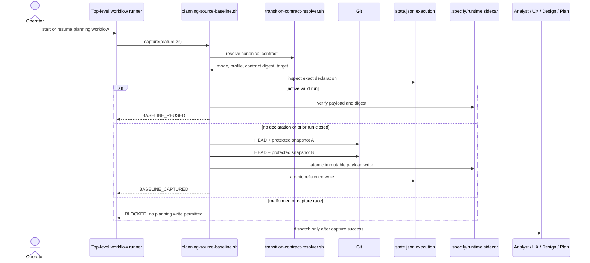
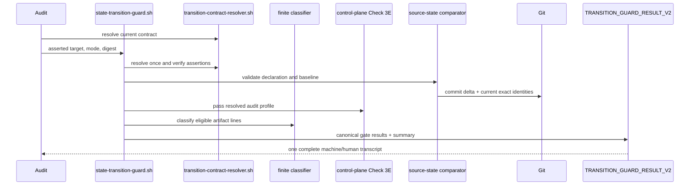
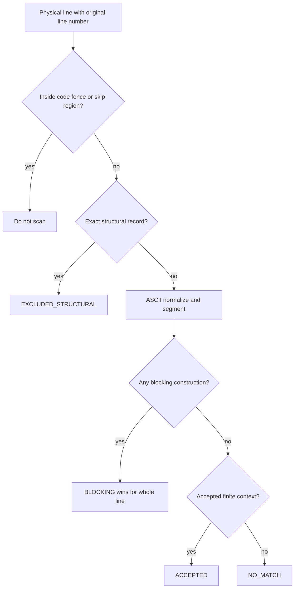

# Bug Fix Design: BUG-023 Planning Transition Applicability And Baseline

## Design Brief

### Current State

`bubbles/scripts/state-transition-guard.sh` resolves one registry-backed
`transition-contract/v1` before checks run. Check 3E then ignores its audit
profile, Check 18 treats bare `follow-up` as deferral, and Check 3B sees only
current Git path names. The advisory `state-snapshot.sh` turn journal has no
Git identity or fail-closed capture contract, while the ordered transition
result is consumed by audit, its contract lint, and regressions.

### Target State

Planning-maturity transitions explicitly record G060 runtime RED-to-GREEN
evidence as `NOT_APPLICABLE`; delivery keeps its existing policy and ordering
path. G040 uses a finite ASCII statement classifier with blocking precedence.
G073 uses a framework-authored, SHA-256-bound sidecar under `.specify/runtime/`
plus `state.json.execution.planningSourceBaseline`; only exact unchanged
index/worktree/relation identities are audited as pre-existing. No declaration
retains legacy whole-worktree lockout.

### Patterns To Follow

- Resolve profile and target once through
   `bubbles/scripts/transition-contract-resolver.sh`; callers assert, never
   select, the result.
- Reuse `bubbles/scripts/trust-metadata.sh` for portable SHA-256 and UTC time.
- Keep shared gate logic under `bubbles/scripts/guards/`, runtime data under the
   installed gitignored `.specify/runtime/`, and result validation in
   `audit-result-contract-lint.sh`.

### Patterns To Avoid

- No mode/repository exceptions, broad G040 exemptions, general NLP, caller
   path lists, patterns, `deliverableFiles[]`, or recapture bypasses.
- Do not extend advisory `state-snapshot.sh` or fork MCP logic; MCP wraps the
   same authoritative bash twin.

### Resolved Decisions

- Check 3E branches on `transition_audit_profile` before policy/evidence reads;
   G040 uses the finite token windows below.
- `planning-source-baseline.sh` owns lifecycle and `g073-source-state.sh` owns
   shared identity semantics; the sidecar and state reference carry one digest.
- Rename remains an explicit old/new relation. Fresh guard output is V2 with
   canonical gate JSON; historical V1 transcripts remain history only.

### Open Questions

None. The intake questions are resolved by the contracts below.

## Purpose And Scope

This design repairs the three decision paths named by BR-023-001 through
BR-023-016. It changes planning-transition applicability, phrase
classification, and causal source attribution only. It does not certify this
bug, implement code, alter QuantitativeFinance, or create delivery evidence.

The feature has no HTTP API, database table, or graphical UI. Its external
contracts are shell invocation, runtime JSON, `state.json.execution` metadata,
the line-oriented transition result, and the terminal views specified in
`spec.md`.

## Root Cause Analysis

### G060: Applicability Context Is Resolved Then Ignored

`state-transition-guard.sh` resolves `transition_audit_profile` before any
gate executes. For `planning-maturity-v1`, it already marks Checks 4, 5, 8,
and 11 non-applicable. It then sources `guards/control-plane-checks.sh`, whose
Check 3E starts with `resolve_effective_policy` and evaluates scenario-first
evidence without consulting the profile. The missing branch is therefore at
the Check 3E entry boundary, not in mode resolution and not in
`detect_red_green_ordering`.

### G040: Line-Wide Exclusion Follows Line-Wide Token Matching

Check 18 pipes stripped lines through one broad `grep -iE` expression and then
through one broad negative expression. Bare `follow-up`, `follow up`, and
`followup` are positive alternatives. A safe noun therefore matches before
the guard has represented whether the token is a label, noun modifier, active
surface description, or work disposition. Conversely, a line-wide negative
match can hide unrelated blocking prose on the same line. The missing unit is
a bounded statement classifier with structural exclusion separated from
phrase meaning.

### G073: Current State Cannot Prove Causality

Check 3B enumerates staged and unstaged names at transition time. It does not
record start HEAD, index object identity, raw worktree content identity,
rename/delete relations, file kind, or executable mode. A current path name is
therefore insufficient to decide whether the active planning run introduced
the state. The last-commit branch is warning-only and also has no run-start
boundary. Exact attribution requires an authoritative pre-mutation capture and
an exact later comparison.

### Falsifiable Design Hypothesis

If otherwise identical hermetic repositories vary only audit profile, phrase
context, or the timing/identity of protected dirt, only G060, G040, or G073
respectively should change. A focused production-path regression that observes
cross-gate drift falsifies this design and blocks implementation acceptance.

## Capability Foundation

BUG-023 extends the existing target-aware transition audit rather than
creating a generic plugin system.

### Foundation Contracts

| Contract | Responsibility | Consumers |
| --- | --- | --- |
| Resolved transition contract | Supplies registry-owned mode, profile, target, required gates, and contract digest exactly once. | Guard, baseline capture, audit |
| Gate result recorder | Produces one honest applicability/result model and a canonical digest without changing gate pass/fail semantics. | Guard result V2, audit result lint |
| Finite statement classifier | Maps one structurally eligible physical line to blocking, accepted, or no-match using closed token rules. | G040 Check 18 |
| Protected source-state model | Enumerates the versioned G073 path universe and builds exact HEAD/index/worktree/relation identities. | Baseline capture and G073 comparison |
| Baseline lifecycle | Creates one run identity before planning writes, reuses it on resume, and closes it without recapture. | Top-level workflow runner, optional MCP wrapper, guard |

### Foundation-Owned Behavior

- Registry output, not a caller value, decides profile applicability.
- Exact canonical JSON (`jq -cS`) is the digest input for every runtime
   payload and machine gate-result collection.
- Paths are Git-produced observations, never caller observations.
- Any malformed declaration is different from an absent legacy declaration.
- Human detail is bounded to 20 rows per gate; machine detail is complete.
- Invalid baseline provenance prevents every audited exclusion.
- Delivery checks and non-planning G073 behavior retain their existing policy
   branches unless this design explicitly names a serialization change.

### Extension Points

There is no provider extension API. The only narrow composition points are:

1. a sourced classifier function called by Check 18;
2. a sourced source-state function called by capture and comparison;
3. an MCP catalog descriptor that invokes the same baseline bash twin;
4. a V2 result parser branch in current result consumers.

## Concrete Implementations

### G060 Profile Applicability

Check 3E receives the already-resolved `transition_audit_profile` from its
parent shell scope.

1. When it is `planning-maturity-v1`, append
   `Check-3E-G060-red-green-evidence` to
   `transition_not_applicable_checks`, record one
    G060 detail with `status=NOT_APPLICABLE`,
    `applicability=NOT_APPLICABLE`, and
    `reasonCode=PROFILE_PLANNING_MATURITY`, print the fixed human block, and
    leave Check 3E. Do not resolve TDD policy, read exemption fields, scan scope
    or report files, invoke `detect_red_green_ordering`, apply grandfathering,
    or add G060 to passed/failed gate arrays.
2. When it is `delivery-completion-v1`, execute the existing Check 3E decision
    tree. The code is wrapped, not rewritten. Required-gate membership,
    scenario-first forcing, eligible exemption modes/reasons, grandfathering,
    and RED-before-GREEN pass/fail behavior remain unchanged.
3. Any other profile has already failed the resolver. A defensive unexpected
    value records contract failure; it never defaults to planning.

When the unchanged delivery path reaches runtime evidence ordering, V2
serialization distinguishes only the closed outcomes defined by the spec:

| Existing branch | Applicability | Status | V2 reason code |
| --- | --- | --- | --- |
| Ordered RED before GREEN | `APPLICABLE` | `PASS` | `RED_GREEN_ORDER_VALID` |
| No required evidence | `APPLICABLE` | `BLOCKED` | `RED_GREEN_EVIDENCE_MISSING` |
| GREEN is observed before RED and no valid ordered file exists | `APPLICABLE` | `BLOCKED` | `GREEN_PRECEDES_RED` |

Existing eligible exemptions, invalid exemptions, grandfathering, and
non-scenario-first policy branches retain their current gate attribution,
messages, and pass/fail behavior. BUG-023 does not assign them new reason
tokens or reinterpret them as RED-to-GREEN evidence.

`guard-lib.sh` may add a read-only sequence classifier returning
`ORDER_VALID`, `GREEN_PRECEDES_RED`, or `MISSING`; the existing
`detect_red_green_ordering` remains a boolean wrapper so every existing caller
keeps its behavior.

### G040 Contextual Classifier

The sourced `guards/g040-deferral-classifier.sh` exposes one function:

```text
g040_classify_statement <raw-physical-line>
outputs globals:
   G040_SCAN_DISPOSITION=CLASSIFIED|NO_MATCH|EXCLUDED_STRUCTURAL
   G040_PHRASE_DISPOSITION=BLOCKING|ACCEPTED|NONE
   G040_REASON_CODE=<closed token>
```

The guard preserves original artifact path and positive line number. The
classifier never receives a profile and cannot disable G040.

#### Structural Pre-Scan

The existing code-fence and paired `bubbles:g040-skip` regions are removed by
an `awk` stream that emits `NR`, a tab, and the untouched physical line. An
eligible line is split into bounded segments on `.`, `?`, `!`, `;`, and
Markdown table-cell `|` boundaries. A colon remains part of a segment so field
labels can be recognized. A blocking segment anywhere on one physical line
makes that line blocking.

Before phrase classification, only these exact structural forms produce
`EXCLUDED_STRUCTURAL/CANONICAL_STRUCTURAL_EXCLUSION`:

- canonical `followUpOwner`, `followUpAction`, `followUpTarget`, or
   `followUps` JSON/YAML field records where the key occupies the complete
   field-key position;
- the complete headings `Follow-Up Narrative` and `Follow-Up Section`;
- a complete existing lockdown/awaiting tag record recognized by the current
   closed tag inventory;
- the complete negative assertions `no deferred items`, `no deferred work`,
   `no deferrals`, `without deferred work`, `zero deferred items`,
   `zero deferrals`, `no issues deferred`, and
   `no issues deferred or skipped`.

An occurrence of one of those strings inside ordinary prose is not a
structural exclusion. Thus a schema key cannot shield a second blocking
statement on the same physical line.

#### Normalization

- Set `LC_ALL=C`.
- Fold ASCII `A-Z` to `a-z`; do not Unicode-fold or stem.
- Remove only Markdown edge markers (`#`, list marker, blockquote marker,
   emphasis/backtick edge, table edge) and terminal punctuation.
- Treat `follow-up`, `follow up`, and `followup` as the single comparison token
   `followup`.
- Convert other punctuation to a single token separator; collapse repeated
   separators.
- Preserve the raw line for SHA-256 only. Matching uses normalized tokens;
   output never contains raw text.

#### Blocking Phrase Families

Blocking evaluation precedes every accepted context.

| Reason code | Deterministic token rule |
| --- | --- |
| `WORK_DISPOSITION` | A finite work-disposition verb is bound to a work object or schedule target: `defer`, `postpone`, `skip`, or `punt` precedes within six tokens an optional determiner/pronoun plus `work`, `item`, `task`, `requirement`, `implementation`, `fix`, `change`, `issue`, or `scope`; the corresponding participle follows one of those nouns within eight tokens; the verb/participle is followed within six tokens by `to` or `until` plus `phase`, `sprint`, `iteration`, `cycle`, `release`, `ticket`, `issue`, or `pr`; or the exact construction is `skip for now` or `skipped for now`. |
| `FUTURE_WORK_OR_SCOPE` | Adjacent tokens `future work`, `future scope`, or `future iteration`. |
| `NEXT_SPRINT_OR_ITERATION` | Adjacent tokens `next sprint` or `next iteration`, optionally preceded by `the`. |
| `FIX_OR_ADDRESS_IN_FOLLOW_UP` | `fix` or `address` is followed within eight tokens by `in`, and `in` is followed within six tokens by `followup`. Articles and modifiers consume the same six-token window; no modifier vocabulary is guessed. |
| `FIX_OR_ADDRESS_LATER` | `fix` or `address` is followed within eight tokens by `later`. |
| `EXISTING_TRUE_DEFERRAL` | Exact finite constructions: `out of scope`, `not in scope`, `beyond scope`, `revisit later`; `separate` followed by an optional article (`a`, `an`, or `the`) and then `ticket`, `issue`, or `pr`; `tracked separately`; `handled separately`; `not implemented yet`; `not yet implemented`; token `placeholder`; or adjacent `temporary workaround`. |

Token windows do not cross a segment boundary. Case, comma/parenthesis
separators, and terminal punctuation do not change classification. A longer
distance is `NO_MATCH`; the classifier does not infer intent.

#### Accepted Phrase Families

These rules run only when no blocking rule matched the physical line:

| Reason code | Deterministic token rule |
| --- | --- |
| `TITLE_OR_DOMAIN_LABEL` | A complete normalized segment equals `authorized outcome followup`. |
| `NOUN_COMPOUND` | Adjacent tokens equal `followup projection`. |
| `STRUCTURED_LABEL` | A complete heading, table cell, or field label normalizes to `followup`. |
| `PRESENT_SURFACE` | After an optional leading `the`, subject tokens equal `active mvp surface` or `current planning surface`; the immediately following verb is one of `includes`, `implements`, `contains`, `defines`, `provides`, `delivers`, or `supports`; and within twelve following tokens the object is `authorized outcome followup` or `followup projection`. |

Any line matching neither table is `NO_MATCH/NONE/NO_CONTRACT_MATCH` and does
not block. This is intentional finite classification, not a broad exemption
for other uses of `followup`.

Each accepted or blocking row records artifact path, original line number,
reason code, and `sha256` of the raw physical line without its line terminator.
The current behavior that echoes up to five matching source lines is removed;
content remains withheld.

### G073 Baseline Lifecycle

#### Direct Operation

The canonical bash twin is:

```text
bash bubbles/scripts/planning-source-baseline.sh capture <feature-dir>
bash bubbles/scripts/planning-source-baseline.sh close <feature-dir> --outcome completed|aborted
```

No other flags are accepted. In particular there is no run-id, repository,
HEAD, observed-path, include/exclude, recapture, skip, force, or ignore input.
`capture` resolves the repository, normalized feature identity, workflow mode,
audit profile, transition contract digest, and HEAD itself. It is valid only
for `planning-maturity-v1` with G073 required.

The MCP catalog adds `capture_planning_source_baseline` with the same action,
feature directory, and closed close-outcome enum. `bubbles/mcp/server.py`
continues to dispatch the catalog entry to the bash twin; no baseline logic is
implemented in Python.

#### Capture Ordering And Atomicity

1. Acquire a feature-keyed lock with atomic `mkdir` under
    `.specify/runtime/planning-source-baselines/locks/`. A held lock blocks;
    stock macOS has no required `flock`.
2. Resolve the transition contract and require the planning profile/G073
    tuple.
3. If `execution.planningSourceBaseline` is absent, create a new framework run
    ID. If it is a valid `ACTIVE` reference, validate and reuse it. If it is
    malformed, fail. If it is valid and closed, archive the reference metadata
    to `planningSourceBaselineHistory` and begin a new run.
4. Resolve and record `HEAD^{commit}` before observation.
5. Build the complete protected-dirt snapshot twice. Require byte-identical
    canonical payloads and unchanged HEAD. A moving repository blocks capture;
    no partial or empty baseline is written.
6. Write the sidecar to a same-directory temporary file and rename atomically.
7. Atomically add the exact reference to `state.json.execution`. The sidecar
    observation precedes this first tracked planning-run mutation.
8. Emit one `PLANNING_SOURCE_BASELINE_RESULT_V1` result. Planning owners may
    write only after `BASELINE_CAPTURED` or `BASELINE_REUSED` succeeds.

`capture` is resume-safe: an active valid reference is always reused. It never
recaptures. `close` first validates the active reference and then marks it
`CLOSED_COMPLETED` or `CLOSED_ABORTED` with a close time. A subsequent capture
creates a different run ID. Closing a run does not edit or delete its sidecar.

Every lifecycle call emits one ordered metadata-only result:

```text
BEGIN PLANNING_SOURCE_BASELINE_RESULT_V1
schemaVersion: planning-source-baseline-result/v1
status: BASELINE_CAPTURED|BASELINE_REUSED|BASELINE_CLOSED|BLOCKED
reasonCode: BASELINE_CAPTURED|BASELINE_REUSED|BASELINE_CLOSED_COMPLETED|BASELINE_CLOSED_ABORTED|<closed G073 invalid-baseline reason>
runId: psb-<64-lowercase-hex>|NONE
featureDir: <normalized-path>|NONE
workflowMode: <resolved-mode>|NONE
auditProfile: planning-maturity-v1|NONE
repositoryId: sha256:<64-lowercase-hex>|NONE
startHead: <full-object-id>|NONE
transitionContractDigest: sha256:<64-lowercase-hex>|NONE
payloadDigest: sha256:<64-lowercase-hex>|NONE
protectedEntryCount: <non-negative-integer>
exitStatus: 0|1|2
END PLANNING_SOURCE_BASELINE_RESULT_V1
```

Capture/reuse/close success is exit 0. Repository or provenance refusal is
exit 1. Usage, dependency, or unresolved transition-contract failure is exit
2. No field prints file contents, absolute paths, or caller observations.

#### Run And Repository Identity

- `runId` is `psb-` plus SHA-256 of a canonical tuple containing repository
   ID, feature identity, mode, profile, start HEAD, capture time, PID, and a
   `mktemp` nonce. A collision with any existing sidecar blocks.
- `repositoryId` is `sha256:` over the physical repository root and physical
   Git common-dir path, separated by labeled field delimiters. Only the digest
   is persisted or printed. This distinguishes linked worktrees while avoiding
   absolute-path disclosure.
- `startHead` is the full lowercase object ID returned by
   `git rev-parse --verify HEAD^{commit}` and must resolve throughout the run.
- `featureDir` is the exact repository-relative path derived from physical
   containment, never the caller spelling.
- `transitionContractDigest` is the resolver's existing registry projection
   digest. `targetRevision` is recorded as capture metadata but is not an
   equality binding because owned planning artifacts legitimately change it.

#### State Reference Schema

The helper writes this field only after successful capture. Templates do not
contain an empty object.

```json
{
   "execution": {
      "planningSourceBaseline": {
         "schemaVersion": "planning-source-baseline-ref/v1",
         "lifecycle": "ACTIVE",
         "runId": "psb-<64-lowercase-hex>",
         "artifactRef": ".specify/runtime/planning-source-baselines/<64-lowercase-hex>.json",
         "payloadDigest": "sha256:<64-lowercase-hex>",
         "capturedAt": "<RFC3339-UTC>",
         "featureDir": "<normalized-repository-relative-feature-path>",
         "workflowMode": "<resolved-mode>",
         "auditProfile": "planning-maturity-v1",
         "repositoryId": "sha256:<64-lowercase-hex>",
         "startHead": "<full-git-object-id>",
         "transitionContractDigest": "sha256:<64-lowercase-hex>"
      },
      "planningSourceBaselineHistory": []
   }
}
```

An absent `planningSourceBaseline` key means legacy. `null`, `{}`, an empty
string, an unsupported lifecycle, or any partial object means declared but
invalid. History is append-only metadata and is never used as the active
baseline.

#### Runtime Payload Schema

The sidecar is `planning-source-baseline/v1`:

```json
{
   "schemaVersion": "planning-source-baseline/v1",
   "payload": {
      "runId": "psb-<64-lowercase-hex>",
      "capturedAt": "<RFC3339-UTC>",
      "featureDir": "<normalized-path>",
      "workflowMode": "<resolved-mode>",
      "auditProfile": "planning-maturity-v1",
      "repositoryId": "sha256:<64-lowercase-hex>",
      "startHead": "<full-git-object-id>",
      "transitionContractDigest": "sha256:<64-lowercase-hex>",
      "captureTargetRevision": "sha256:<64-lowercase-hex>",
      "protectedUniverse": {
         "schemaVersion": "g073-protected-path-universe/v1",
         "classifierDigest": "sha256:<64-lowercase-hex>"
      },
      "entries": []
   },
   "payloadDigest": "sha256:<64-lowercase-hex>"
}
```

`payloadDigest` is SHA-256 of `jq -cS '.payload'` with no trailing newline.
The reference and sidecar carry the same digest. Entries are sorted by
bytewise (`LC_ALL=C`) canonical identity key before hashing.

#### Protected Path Universe

`g073-protected-path-universe/v1` centralizes the existing literal suffix and
allowed-path expressions byte-for-byte; this bug does not broaden or tighten
the protected universe:

```text
source_code_pattern='\.(go|rs|py|ts|tsx|js|jsx|sql|proto|yaml|yml|toml|json|css|scss|html)$'
allowed_path_pattern='^(specs/|docs/|\.github/|\.specify/|CHANGELOG|README|LICENSE|VERSION)'
```

The classifier digest covers the exact ordered constants. Capture and compare
must use the same digest. A rename is protected when either endpoint is in the
protected universe; moving into or out of an allowed root cannot hide it.

For a declared baseline, `deliverableFiles[]` is not source-attribution proof
and is never applied to baseline entries. Legacy packets continue through the
existing Check 3B path, including its existing compatibility behavior.
Non-planning restrictive modes retain their current G073 behavior.

#### Path Normalization

- Use `git status --porcelain=v2 -z --untracked-files=all` with rename
   detection enabled and consume NUL-delimited records.
- Derive repository-relative paths from Git records. Do not call `realpath` on
   a path that may be deleted or a symlink.
- Reject empty/absolute paths, leading `./`, `.` or `..` segments, repeated
   separators, NUL/control bytes, invalid UTF-8, backslashes, glob/regex
   metacharacters, and paths longer than 4096 bytes.
- Preserve case and UTF-8 bytes exactly. Do not case-fold or Unicode-normalize.
   Sort with `LC_ALL=C`.
- Use `--` before every path passed back to Git. Never evaluate a path as shell
   syntax.
- Exact duplicate entry keys or duplicate rename endpoint relations invalidate
   the payload.

The identity engine uses these exact read-only Git primitives, with `--`
separating revisions from paths:

```text
git -C <repo> status --porcelain=v2 -z --untracked-files=all --renames --
git -C <repo> diff --raw -z --no-abbrev --find-renames <startHead>..<currentHead> --
git -C <repo> ls-tree -rz --full-tree <startHead> --
git -C <repo> ls-files --stage -z --
git -C <repo> cat-file blob <object-id>
```

Rejecting an unusual but legal Git path is fail-closed; it never makes that
path trusted.

#### Entry And Identity Schema

Each entry has these fields:

```json
{
   "entryKey": "sha256:<canonical-state-key>",
   "stateClass": "STAGED_ONLY|UNSTAGED_ONLY|MIXED_STAGED_UNSTAGED|UNTRACKED|RENAME|DELETE",
   "path": "<exact-current-or-deleted-path>",
   "indexStatus": ".|A|M|D|R|T|U",
   "worktreeStatus": ".|A|M|D|R|T|U|?",
   "head": "<identity-object>",
   "index": "<identity-object>",
   "worktree": "<worktree-identity-object>",
   "worktreeMatchesIndex": false,
   "relation": null
}
```

An identity object is:

```json
{
   "presence": "PRESENT|ABSENT",
   "kind": "REGULAR|SYMLINK|GITLINK|ABSENT",
   "mode": "100644|100755|120000|160000|ABSENT",
   "gitObjectId": "<full-object-id>|ABSENT",
   "contentDigest": "sha256:<64-lowercase-hex>|ABSENT"
}
```

`worktreeMatchesIndex` is a JSON boolean: it is `true` exactly when the complete
worktree identity equals the index identity, and `false` otherwise.

For a worktree regular file or symlink, `gitObjectId` is calculated with
`git hash-object --no-filters -- <path>` without writing the object. For a
`GITLINK`, it is the exact submodule commit identity. Regular-file SHA-256 is
over raw bytes. Symlink SHA-256 is over link-target bytes without following
the link; the target itself is never stored or printed. Index and HEAD content
SHA-256 are derived from `git cat-file`, not from the worktree. Git semantic
mode captures executable-bit changes. Sockets, FIFOs, devices, conflicts,
unsupported porcelain statuses, and non-gitlink directories invalidate
capture.

For `RENAME`, `relation` is:

```json
{
   "kind": "RENAME",
   "layer": "INDEX|WORKTREE|BOTH",
   "oldPath": "<exact-path>",
   "newPath": "<exact-path>",
   "similarity": "R<digits>",
   "oldEndpoint": "<head/index/worktree identities>",
   "newEndpoint": "<head/index/worktree identities>"
}
```

For `DELETE`, relation records `layer`, `deletedPath`, explicit index/worktree
absence booleans, and every surviving HEAD/index/worktree identity. Rename and
delete relations are first-class; they are not synthesized as independent
path entries.

State-class obligations are exact:

| State class | Equality obligation |
| --- | --- |
| `STAGED_ONLY` | Index status/object/content/kind/mode and worktree identity plus `worktreeMatchesIndex` |
| `UNSTAGED_ONLY` | HEAD and index identities plus worktree status/content/kind/mode |
| `MIXED_STAGED_UNSTAGED` | Independent full index and worktree identities |
| `UNTRACKED` | Path/status/content/kind/mode plus index `ABSENT` |
| `RENAME` | Old/new paths, layer, similarity, both endpoints, and all surviving identities |
| `DELETE` | Deleted path, layer, explicit absence, and all surviving identities |

#### Transition Comparison

G073 validates in this order:

1. Distinguish absent legacy declaration from declared provenance.
2. Validate reference schema and lifecycle.
3. Resolve `artifactRef` under the physical repository's
    `.specify/runtime/planning-source-baselines/` directory without following a
    caller path.
4. Validate payload JSON, schema, required fields, types, closed enums,
    duplicates, paths, payload digest, reference/payload equality, and all
    spec/mode/profile/repository/run/start-HEAD/contract bindings.
5. Verify start HEAD resolves and is an ancestor of current HEAD. Divergence or
    rewrite blocks.
6. Enumerate every protected committed path/relation in
    `startHead..currentHead`; each is `PATH_COMMITTED_AFTER_START_HEAD` even if
    the current worktree is clean or content later returns to its old bytes.
7. Build the current dirty snapshot with the same classifier and identity
    engine.
8. Compare canonical entry sets. Every equal baseline entry emits an
    `AUDITED_PREEXISTING` row. Baseline-only entries emit
    `PATH_BECAME_CLEAN`; current-only entries emit
    `PATH_APPEARED_AFTER_CAPTURE`; field differences emit one row per changed
    identity reason.
9. Repeat HEAD/status capture before emitting success. Instability maps to the
    existing binding/identity-invalid refusal and applies zero exclusions.

No comparison mutates Git, state, the sidecar, or a protected path.

### Variation Axes

| Axis | Closed variants | Foundation-owned behavior |
| --- | --- | --- |
| Audit profile | planning-maturity, delivery-completion | Applicability and result honesty |
| Phrase disposition | structural exclusion, blocking, accepted, no-match | Precedence and finite token windows |
| Baseline declaration | absent legacy, active valid, active invalid, closed | Lifecycle and fail-closed routing |
| Git state | staged, unstaged, mixed, untracked, rename, delete | Exact identity schema and comparison |
| Evidence location | inline transition details, runtime baseline sidecar | Canonical digest and disclosure limits |
| Invocation surface | direct bash, MCP catalog wrapper | Same bash twin and output contract |

## Architecture And Data Flow

### Workflow-Start And Resume Sequence



### Transition Validation Sequence



### G040 Decision Flow



## Transition Result Contract

Fresh guard output becomes `transition-guard-result/v2`. The outer summary
keeps all V1 meanings and adds a canonical complete gate collection:

```text
BEGIN TRANSITION_GUARD_RESULT_V2
schemaVersion: transition-guard-result/v2
workflowMode: <mode>
auditProfile: <profile>
targetStatus: <status>
contractDigest: sha256:<digest>
targetRevision: sha256:<digest>
applicableCheckClasses: [tokens]
notApplicableChecks: [tokens]
passedGateIds: [gate-ids]
failedGateIds: [gate-ids]
failedChecks: [check-ids]
gateResultsSchema: transition-gate-results/v1
gateResultsDigest: sha256:<digest>
gateResults: <one-line jq -cS JSON array>
blockingCode: <code-or-none>
failureCount: <integer>
exitStatus: 0|1|2
verdict: PASS|FAIL|BLOCKED
END TRANSITION_GUARD_RESULT_V2
```

The gate array contains exactly one summary object for each evaluated G040,
G060, and G073 gate plus its complete `details` array. Each summary and detail
uses the field vocabulary from `spec.md`: `gateId`, `status`, `applicability`,
`scanDisposition`, `phraseDisposition`, `outcome`, `observed`, `required`,
`reasonCode`, `remediationCode`, `actionability`, `evidenceIdentity`,
`detailCount`, `emittedDetailCount`, `omittedDetailCount`,
`completeEvidenceDigest`, and `completeEvidenceRef`.

`details` are sorted by repository-relative path bytes, numeric line, reason
code, and state class. `gateResultsDigest` covers the complete canonical array.
Human output emits at most 20 detail rows per gate, but `gateResults` contains
all rows. `completeEvidenceRef` is the framework-owned content-addressed token
`transition-gate-results:sha256:<gateResultsDigest>#<gate-id>`; it is not a
filesystem path or caller value.

The outer compatibility invariants are:

- planning G060 appears in `notApplicableChecks` and its gate object, never in
   `passedGateIds`;
- delivery G060 never appears in `notApplicableChecks`;
- a failed G073 remains `failedGateIds=[...,G073,...]` and maps outer
   `blockingCode` to `SOURCE_EDIT_LOCKOUT` for planning;
- audited pre-existing G073 rows are `PASS/NON_ACTIONABLE` and do not create a
   warning or failure;
- invalid baseline provenance has `exclusionsApplied=0`;
- G040 findings disclose path, line, and digest, not statement text;
- no result field contains file bytes, diff hunks, symlink targets, absolute
   paths, environment values, or commit subjects.

`bubbles.audit` and `audit-result-contract-lint.sh` require V2 for every fresh
attempt after this repair. Existing V1 text remains historical evidence but
cannot authorize a new current audit attempt; rerunning the current guard
produces V2.

## Failure And Recovery Table

| Condition | Gate/result | Reason code | Recovery owner/action |
| --- | --- | --- | --- |
| Planning profile reaches G060 | G060 `NOT_APPLICABLE` | `PROFILE_PLANNING_MATURITY` | None; keep visible |
| Delivery evidence absent | G060 `BLOCKED` | `RED_GREEN_EVIDENCE_MISSING` | Delivery owner produces ordered evidence |
| Delivery GREEN precedes RED | G060 `BLOCKED` | `GREEN_PRECEDES_RED` | Delivery owner restores RED-before-GREEN sequence |
| G040 blocking construction | G040 `BLOCKED` | Closed blocking token | Route exact line identity to artifact owner |
| Baseline key absent | G073 legacy | `BASELINE_ABSENT_LEGACY` or `LEGACY_DIRT_UNPROVEN` | Existing whole-worktree semantics |
| Ref/payload unreadable or malformed | G073 `INVALID_BASELINE` | `BASELINE_PAYLOAD_UNREADABLE` or `BASELINE_PAYLOAD_MALFORMED` | Restore exact framework payload or terminate run |
| Unsupported/missing schema field | G073 `INVALID_BASELINE` | `BASELINE_SCHEMA_UNSUPPORTED` or `BASELINE_REQUIRED_FIELD_MISSING` | Restore exact payload; no repair in place |
| Unsafe/duplicate path or unsupported state/type | G073 `INVALID_BASELINE` | Corresponding closed `BASELINE_*` reason | Terminate run; resolve repository state before a new run |
| Digest missing/invalid/mismatch | G073 `INVALID_BASELINE` | `BASELINE_DIGEST_MISSING_OR_INVALID` or `BASELINE_DIGEST_MISMATCH` | Restore exact sidecar/reference |
| Declared sidecar missing | G073 `INVALID_BASELINE` | `BASELINE_SIDECAR_MISSING` | Restore exact sidecar or terminate run |
| Binding differs | G073 `INVALID_BASELINE` | Exact spec/mode/profile/repository/run/HEAD/contract mismatch code | Stop; never reuse baseline |
| Start HEAD cannot resolve or history diverged | G073 `INVALID_BASELINE` | `BASELINE_START_HEAD_UNRESOLVED` or start-HEAD mismatch | Terminate run; establish a new run before its first write |
| Baseline entry remains exact | G073 `AUDITED_PREEXISTING` | `PATH_AUDITED_EQUAL` | None; preserve path |
| New/current-only path | G073 `NEW_OR_CHANGED` | `PATH_APPEARED_AFTER_CAPTURE` | Route to responsible path owner |
| Baseline path becomes clean | G073 `NEW_OR_CHANGED` | `PATH_BECAME_CLEAN` | Route to owner; do not recapture |
| Index/worktree/content/type/mode differs | G073 `NEW_OR_CHANGED` | Exact changed-identity code | Route exact path and identity class |
| Rename/delete relation differs | G073 `NEW_OR_CHANGED` | Relation-specific code | Route both endpoint identities to owner |
| Protected commit after start HEAD | G073 `NEW_OR_CHANGED` | `PATH_COMMITTED_AFTER_START_HEAD` | Route commit/path owner; baseline cannot bless commit |
| Repository changes during capture/compare | G073 `INVALID_BASELINE` | Existing binding or entry-identity-invalid code | Stop and retry only after repository is stable |

Recovery never instructs the planning operator to stash, reset, discard,
commit, ignore, or absorb unrelated work.

## Threat Model

### Protected Against

- accidental attribution of unchanged pre-run staged, unstaged, mixed,
   untracked, renamed, or deleted protected work;
- post-capture content, mode, kind, status, relation, cleaning, staging, or
   commit changes;
- stale sidecars, cross-spec/run/repository/mode/profile/HEAD/contract replay;
- truncated, malformed, duplicated, path-traversing, or digest-mismatched
   provenance;
- caller-supplied path observations and wildcard exclusions;
- symlink-following disclosure and terminal output of protected contents;
- recapture on resume and concurrent mutation during capture.

### Trust Boundary

The digest is an integrity and binding control, not a signature. This design
does not defend against an actor who can simultaneously rewrite framework
scripts, Git refs/object storage, `state.json`, the runtime sidecar, and every
audit transcript. Such an actor already controls the local framework trust
root. Framework installation provenance and repository access controls remain
the authenticity boundary.

### Disclosure

Only normalized repository-relative paths, state classes, line numbers,
object IDs, counts, and SHA-256 digests reach results. Raw statements,
contents, diffs, absolute paths, symlink targets, remote URLs, environment
values, and secret material do not.

## Cross-Platform Shell Constraints

- All new shell runs under stock macOS Bash 3.2 and supported Linux Bash.
- Use guarded array expansion (`${array[@]+"${array[@]}"}`) at zero-reachable
   sites; do not use associative arrays, `mapfile`, `readarray`, or Bash 4
   features.
- Use NUL-delimited Git output and Bash 3.2-compatible `read -r -d ''` loops.
- Use `LC_ALL=C` for bytewise sorting and token classes.
- Reuse `bubbles_sha256_file`, `bubbles_sha256_stdin`, and
   `bubbles_current_timestamp` from `trust-metadata.sh`.
- Use same-directory `mktemp` plus atomic `mv`; no GNU `mktemp --suffix`.
- Use `mkdir` locks, not `flock`.
- Do not use raw `sed -i`, GNU-only `date -d`, `stat -c`, `readlink -f`,
   `grep -P`, three-argument `awk match`, or unguarded `timeout`.
- `readlink` without `-f` is allowed only to hash a symlink target; newline or
   control-bearing targets fail closed.
- Every shell variable and Git path is quoted and passed after `--`.

## Consumer Impact

| Consumer | Required adaptation |
| --- | --- |
| `bubbles.audit` | Require one V2 guard block, persist the complete transcript, project G060 N/A honestly, and preserve G073 audited/invalid detail. |
| `audit-result-contract-lint.sh` | Validate V2 ordered fields, canonical `gateResults`, digest, profile invariants, G060 applicability, and G073/sourceEditLockout coherence. |
| `state-transition-guard-selftest.sh` | Update result parser from V1 to V2 and add focused gate-detail assertions. |
| `tests/regression/test_23_planning_audit_contract.sh` | Parse V2 and require G060 N/A plus gate-result digest while preserving BUG-009 assertions. |
| `done-spec-audit.sh` and CLI `guard` | No invocation change; they receive V2 output from the same guard path. |
| Top-level planning runner | Invoke baseline capture before the first analyst/UX/design/plan write and close only on completed or explicitly terminated run. |
| MCP server | Auto-load one new tool descriptor; execute the bash twin verbatim. |
| Installer/upgrade | Copy new top-level scripts, guard fragments, MCP descriptor, and docs through existing managed-directory logic; regenerate release manifest/checksums. |

## Migration And Schema Compatibility

1. `transition-contract/v1` remains unchanged. Baseline provenance is runtime
    evidence referenced from state, not a mode-selection input.
2. State version remains 3. `execution.planningSourceBaseline` and history are
    additive execution metadata; no `certification.*` field changes.
3. Existing packets with no baseline key are legacy and run current
    whole-worktree Check 3B behavior.
4. A key that exists but is null, empty, partial, unsupported, missing its
    sidecar, or digest-invalid is new-contract invalid provenance and blocks.
5. No installer migration inserts an empty baseline field into existing or new
    states. Capture is the only creator.
6. Fresh guard results use V2. Existing V1 report text remains immutable
    history, but a new audit attempt must rerun the guard and consume V2.
7. Existing `audit-run/v1` state records remain structurally valid; the current
    attempt's evidence reference must point to a V2 transcript after upgrade.
8. `.specify/runtime/.gitignore` already ignores all runtime children, so no
    repository-specific ignore mutation is required.
9. `install.sh` already copies top-level scripts, guard fragments, MCP catalog
    files, and runtime bootstrap assets. No custom downstream installer branch
    is designed. `release-manifest.json` and install-provenance assertions must
    include every new/changed managed file before release.
10. Downstream copies change only via the supported upgrade path. A canonical
      pass is not downstream certification.

## Rollback Strategy

Rollback is one coherent canonical revision, not selective field deletion:

1. Revert the G060 profile branch, G040 classifier integration, G073 helper
    integration, V2 result producer/consumers, tests, and docs together.
2. Restore `transition-guard-result/v1` producer and consumer bytes together.
3. Leave runtime sidecars ignored and inert. Old framework bytes do not read
    `execution.planningSourceBaseline`; removing runtime files is not required
    for source rollback.
4. Do not rewrite historical audit transcripts or baseline history.
5. Before any later reintroduction, begin a new planning run; never reuse a
    baseline captured by incompatible helper bytes.

A partial rollback is forbidden because V2 producer/consumer drift or a guard
without its capture helper fails closed in inconsistent ways.

## Change Boundary And Ownership

### Production And Contract Files Likely Touched

| File | Intended change | Owner |
| --- | --- | --- |
| `bubbles/scripts/guards/control-plane-checks.sh` | Profile entry branch and G060 detail recording | `bubbles.implement` |
| `bubbles/scripts/guard-lib.sh` | Non-breaking RED/GREEN sequence classification wrapper, if needed for reason precision | `bubbles.implement` |
| `bubbles/scripts/guards/g040-deferral-classifier.sh` (new) | Finite classifier only | `bubbles.implement` |
| `bubbles/scripts/guards/g073-source-state.sh` (new) | Protected-universe, path, identity, schema, and compare foundation | `bubbles.implement` |
| `bubbles/scripts/planning-source-baseline.sh` (new) | Authoritative capture/resume/close bash twin | `bubbles.implement` |
| `bubbles/scripts/state-transition-guard.sh` | G073 integration, Check 18 integration, gate-result V2 producer | `bubbles.implement` |
| `bubbles/scripts/audit-result-contract-lint.sh` | V2 consumer and cross-field invariants | `bubbles.implement` |
| `bubbles/mcp/tools/capture_planning_source_baseline.json` (new) | Catalog wrapper for bash twin | `bubbles.implement` |
| `bubbles/capability-ledger.yaml` | Register authoritative planning-source baseline capture and its direct/MCP surfaces | framework capability owner |
| `agents/bubbles.workflow.agent.md` | Mandatory capture/close orchestration boundary | framework agent/documentation owner |
| `agents/bubbles.audit.agent.md` | V2 current-result contract | framework agent/documentation owner |
| `agents/bubbles_shared/operating-baseline.md` | Authoritative baseline lifecycle versus advisory turn snapshot | `bubbles.docs` |
| `agents/bubbles_shared/state-gates.md` | G040/G060/G073 current semantics | `bubbles.docs` |
| `agents/bubbles_shared/scope-workflow.md` | Finalize requires bound baseline result for planning maturity | `bubbles.docs` |
| `docs/guides/CONTROL_PLANE_SCHEMAS.md` | State reference, sidecar, and V2 result schemas | `bubbles.docs` |

### Test And Release Files Likely Touched

| File | Intended coverage | Owner |
| --- | --- | --- |
| `bubbles/scripts/state-transition-guard-selftest.sh` | Existing consumer plus focused G040/G060/G073 fixtures | `bubbles.test` |
| `bubbles/scripts/planning-source-baseline-selftest.sh` (new) | Capture atomicity, lifecycle, schema, identities, invalid provenance | `bubbles.test` |
| `bubbles/scripts/audit-result-contract-lint-selftest.sh` | V2 positive/mutation matrix | `bubbles.test` |
| `bubbles/scripts/mcp-server-selftest.sh` | Tool catalog and real bash-twin dispatch | `bubbles.test` |
| `bubbles/scripts/install-provenance-selftest.sh` | Canonical-to-installed parity for the helper, fragments, and MCP descriptor | `bubbles.test` |
| `tests/regression/test_23_planning_audit_contract.sh` | Existing audit consumer compatibility | `bubbles.test` |
| `tests/regression/test_30_planning_transition_applicability_and_baseline.sh` (new) | Persistent production-path coverage for all 17 scenarios | `bubbles.test` |
| `bubbles/scripts/framework-validate.sh` | Wire the new helper selftest and persistent regression | `bubbles.implement` |
| `CHANGELOG.md` | Release-facing behavior and migration note | `bubbles.docs` |
| `docs/generated/competitive-capabilities.md` | Regenerated capability-ledger projection | `bubbles.docs` |
| `bubbles/release-manifest.json` | Regenerated managed/source-only checksums | release owner |

`install.sh`, `state-snapshot.sh`, state templates, mode registries, gate
registries, application source, downstream managed copies, and
QuantitativeFinance are excluded unless implementation proves an explicit
contract mismatch. No broad state-transition refactor, path-universe expansion,
or unrelated cleanup belongs in this repair.

## Testing And Validation Strategy

All behavioral checks execute the real production guard/helper in disposable
Git repositories. Direct helper unit checks may supplement but never replace
the production-path regression. Tests must use one source tree and vary one
dimension at a time.

### Scenario Verification Matrix

| Scenario | Test setup/action | Required assertion |
| --- | --- | --- |
| SCN-BUG-023-001 | Planning contract, no runtime evidence | Exactly one G060 N/A object; no G060 pass/fail; guard not failed by G060 |
| SCN-BUG-023-002 | `full-delivery`, scenario-first, evidence absent | G060 failed with missing reason and delivery blocking code |
| SCN-BUG-023-003 | `bugfix-fastlane`, GREEN before RED | G060 failed with ordering reason; no planning applicability |
| SCN-BUG-023-004 | Exact Authorized Outcome label plus case/punctuation variants | Zero findings; accepted label detail |
| SCN-BUG-023-005 | Exact follow-up projection plus variants | Zero findings; noun-compound detail |
| SCN-BUG-023-006 | Heading/table/field `Follow-Up` plus variants | Zero findings; structured-label detail |
| SCN-BUG-023-007 | Both exact present-surface sentences plus variants | Zero findings; present-surface detail |
| SCN-BUG-023-008 | Four work-disposition examples plus variants | Every exact line blocks with work-disposition reason |
| SCN-BUG-023-009 | Future work/scope and next sprint/iteration examples | Every exact line blocks with finite scheduling reason |
| SCN-BUG-023-010 | Four fix/address follow-up/later examples | Every exact line blocks with expected window reason |
| SCN-BUG-023-011 | Accepted label and blocker on one physical line | Blocking precedence; one exact line digest |
| SCN-BUG-023-012 | Capture in stable repo before any owner write | Bound payload/ref created once; caller observations impossible; capture result complete |
| SCN-BUG-023-013 | Six separate pre-run Git state fixtures | Six audited rows, exact state classes, zero silent omissions, no path mutation |
| SCN-BUG-023-014 | Eight separate post-capture mutation fixtures | Every mutation blocks with exact path and identity reason |
| SCN-BUG-023-015 | Eight invalid provenance families with field mutants | Validation blocks before exclusions; exact reason code; zero repair |
| SCN-BUG-023-016 | Active run resumed after protected mutation | Same run/digest reused; changed path blocks; sidecar bytes unchanged |
| SCN-BUG-023-017 | No declaration, protected dirt present | Legacy path and existing whole-worktree lockout; no baseline synthesis |

### Additional Contract Checks

- Delivery matrix: `full-delivery` and `bugfix-fastlane`, each with missing,
   GREEN-before-RED, and ordered controls.
- G040 matrix: exact, uppercase, lowercase, terminal punctuation, parentheses,
   table cell, heading, same-line blocker/accepted collision, and window+1
   no-match boundaries.
- G073 identity matrix: spaces in safe paths, executable bit, symlink target,
   file-to-symlink, tracked-to-delete, index-only, worktree-only, mixed,
   untracked, index rename, worktree rename, committed-after-start, divergent
   HEAD, duplicate path, unsafe path, unsupported type, payload/reference
   mutation, capture race, and compare race.
- Consumer mutations: missing/reordered V2 field, noncanonical gate JSON,
   incorrect digest, planning G060 marked pass, delivery G060 marked N/A,
   audited row marked actionable, failed G073 with wrong blocking code.
- Portability: identical focused matrix under `/bin/bash` 3.2 on macOS and a
   supported Linux Bash environment.
- Containment canary: pre-existing Check 3B deliverable compatibility outside
   declared planning-baseline flow remains unchanged.
- Release boundary: canonical validation, release-manifest freshness,
   install-provenance parity, and a downstream post-upgrade run are separate
   evidence claims.

This design defines required checks only. It makes no claim that any test has
run or passed.

## Alternatives And Tradeoffs

| Alternative | Decision |
| --- | --- |
| Disable G060 by mode name | Rejected; profile is the registry-owned applicability contract. |
| Mark planning G060 as pass | Rejected; pass would claim evidence that was not evaluated. |
| Remove bare `follow-up` and add no classifier | Rejected; true work-disposition constructions still need finite blocking behavior and diagnostics. |
| General NLP or grammar parser | Rejected; nondeterministic, hard to port, and broader than the stated contract. |
| Allowlist safe lines or paths in state | Rejected; caller-authored mutable exemptions are attribution bypasses. |
| Extend `state-snapshot.sh` | Rejected; its advisory failure semantics and turn scope cannot establish provenance. |
| Store baseline inline in state | Rejected; large path identities churn a tracked planning artifact and complicate concurrent work. |
| Sidecar with no state reference | Rejected; a missing sidecar would be indistinguishable from a legacy packet. |
| Collapse rename into delete/add | Rejected; endpoint and layer identity would be lost. |
| Hash only Git status text | Rejected; unchanged status can hide changed content, kind, or mode. |
| Compare only current worktree | Rejected; committed protected changes and cleaned captured dirt would escape attribution. |
| Add baseline data to transition contract digest | Rejected; registry contract identity and per-run evidence have different lifecycles. |
| Preserve result V1 and print extra prose | Rejected; consumers need machine-verifiable applicability and exclusion detail. |

## Complexity Tracking

| Decision | Simpler alternative | Why the complexity is required |
| --- | --- | --- |
| Sidecar plus exact state reference | Current dirty-path scan | Only a pre-mutation, bound identity can prove causality. |
| Independent HEAD/index/worktree/relation identities | One status fingerprint | Mixed, rename, delete, type, mode, and cleaned states otherwise collapse. |
| Dedicated capture helper plus shared source-state library | Add more inline Check 3B shell | Capture and compare must use one identity implementation without turning the high-fan-out guard into a lifecycle writer. |
| Finite token windows | One positive and negative regex | Blocking precedence and safe noun contexts require local structure while remaining deterministic. |
| Result V2 with canonical gate JSON | Human-only diagnostics | Audit consumers must distinguish N/A, audited exclusion, invalid provenance, and changed dirt mechanically. |
| Double observation at capture/compare | One Git read | A concurrent writer could otherwise produce a mixed, falsely trusted snapshot. |

## Superseded Design Decisions

The intake draft's preferred shape is superseded by this design. In
particular, baseline reference location, result fields, rename representation,
helper boundaries, lifecycle, and portable hashing/path behavior are no longer
open. This appendix is non-authoritative history; all active contracts appear
above.
