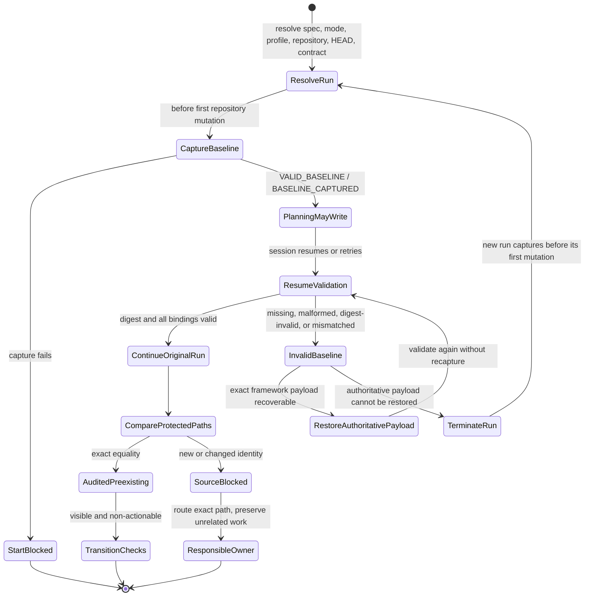
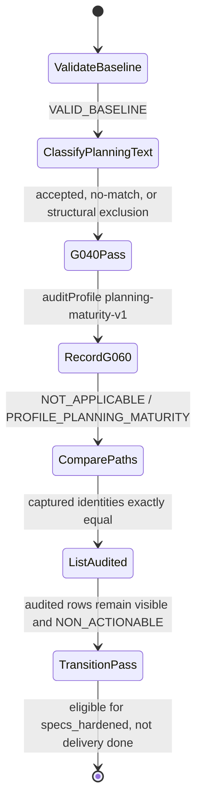
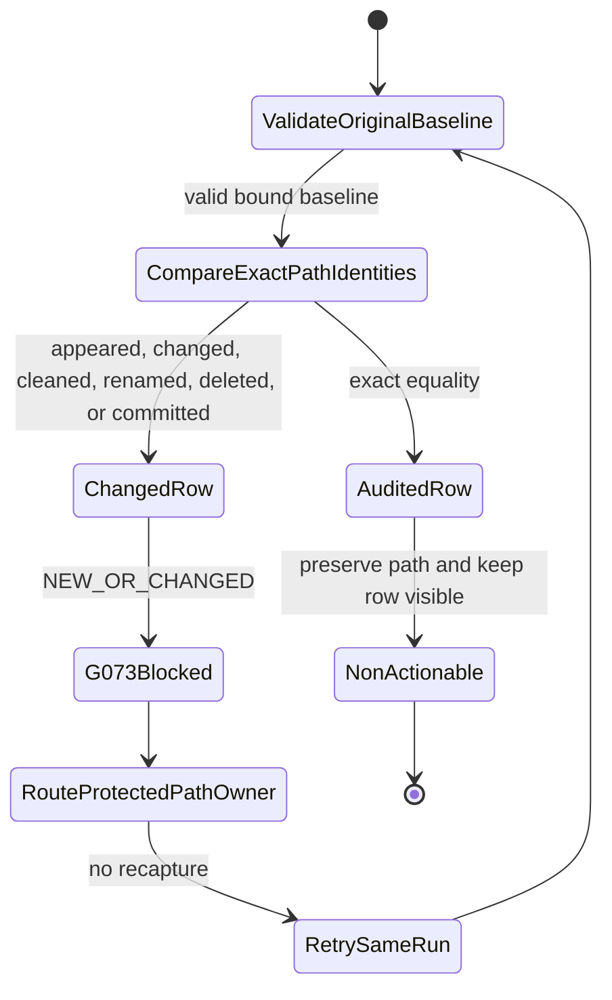
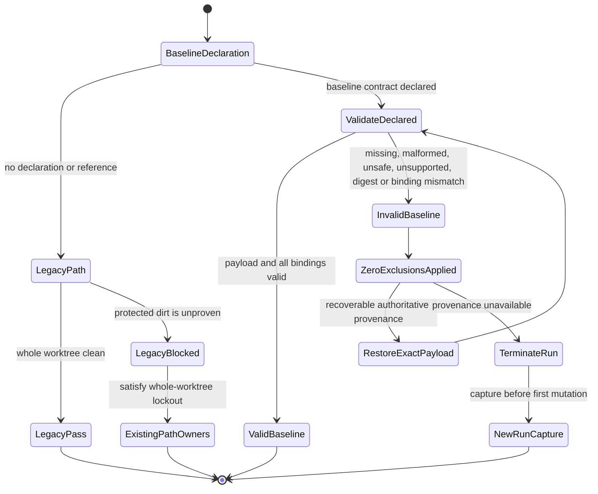
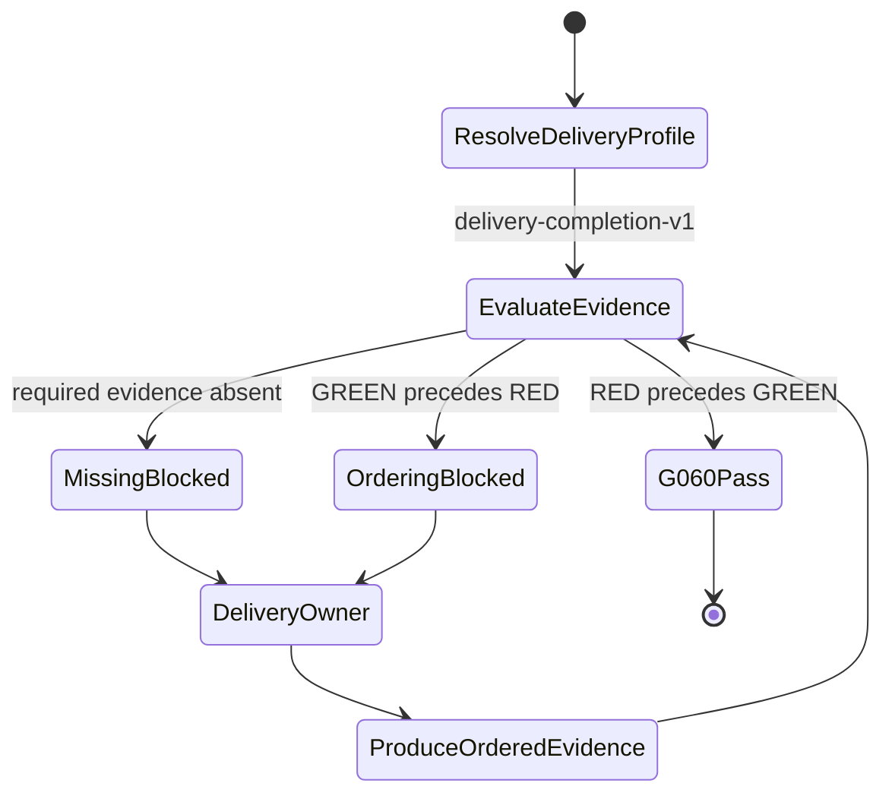

# Expected Behavior: BUG-023 Planning Transition Applicability And Baseline

## Problem Contract

A `product-to-planning` transition to `specs_hardened` must judge planning
maturity, not delivery execution. It must record runtime evidence checks that
do not apply, distinguish a finite set of active planning uses of
"follow-up" from actual postponement, and attribute protected source/config
dirt to the planning run only when that dirt is new or has changed since an
authoritative workflow-start capture.

This packet defines acceptance behavior only. It does not claim that source,
tests, release bytes, downstream installation, or QuantitativeFinance Spec 097
have been delivered or certified.

## Current Decision-Path Evidence

| Defect | Canonical evidence | Current observable gap |
| --- | --- | --- |
| G060 applicability | `bubbles/scripts/guards/control-plane-checks.sh`, Check 3E | Effective TDD policy is evaluated without first treating the resolved `planning-maturity-v1` audit profile as inapplicable to runtime RED-to-GREEN evidence. |
| G040 classification | `bubbles/scripts/state-transition-guard.sh`, Check 18 | The blocking expression contains bare `follow-up`, `follow up`, and `followup` alternatives, so noun labels and present-surface prose can be classified as postponed work. |
| G073 attribution | `bubbles/scripts/state-transition-guard.sh`, Check 3B | Staged and unstaged path names are inspected only at transition time; no workflow-start identity exists to prove unchanged pre-existing dirt. |
| Existing lifecycle snapshot | `bubbles/scripts/state-snapshot.sh` | Turn metadata is recorded, but repository identity, start HEAD, index state, worktree state, and protected-path content identity are not. |

## Actors

| Actor | Goal | Authority and boundary |
| --- | --- | --- |
| Planning operator | Run `product-to-planning` and receive an actionable `specs_hardened` verdict without disturbing unrelated work. | Selects the workflow target; cannot author baseline entries, hashes, exemptions, or ignored paths. |
| Authoritative framework runtime | Bind the run to its resolved spec, mode, repository, and start HEAD, then capture protected dirt before planning writes begin. | The active top-level runner invokes the framework-owned capture surface. An MCP server may expose that surface and the direct framework twin must behave identically; neither accepts caller-authored observations as truth. |
| Planning specialists | Reconcile analyst, UX, design, and planning artifacts. | May change only their owned planning surfaces and cannot recapture or amend the run-start baseline. |
| Delivery owner | Complete a delivery-profile workflow with real scenario-first evidence. | Remains subject to blocking G060 RED-to-GREEN ordering and receives no planning-profile exemption. |
| Concurrent contributor | Keep independently owned source/config dirt intact in the shared worktree. | Is never asked to stash, reset, commit, discard, or transfer ownership of that dirt. |
| Transition validator | Produce the structured applicability, language, and source-attribution verdict. | Verifies framework-produced provenance; cannot repair, synthesize, or silently replace invalid provenance. |
| Release owner | Propagate validated canonical framework bytes through the supported release path. | Cannot treat canonical evidence as downstream certification; a fresh downstream run is required. |

## User And Operator Experience

- A clean planning packet receives one deterministic planning-maturity result.
- G060 appears in the structured result as `NOT_APPLICABLE` with the resolved
  planning profile as its reason; it is neither omitted nor reported as pass.
- A source lockout diagnostic identifies the exact protected path and whether
  it is new, changed since capture, malformed, missing, digest-invalid,
  binding-mismatched, or legacy-unproven.
- An unchanged pre-run path is listed as an audited exclusion, including its
  captured state class, rather than disappearing from the result.
- No operator is asked to discard, stash, reclassify, or absorb another
  workflow's dirty work.
- No interface offers an ignore, skip, force, glob, or arbitrary path-list
  bypass.

## Use Cases

### UC-023-001 Certify Planning Maturity

- **Actor:** Planning operator.
- **Preconditions:** The top-level runtime has resolved the feature,
  `product-to-planning`, target `specs_hardened`, repository identity, and
  start HEAD; authoritative baseline capture succeeds before planning writes.
- **Main Flow:** The planning owners update only owned artifacts; the validator
  reports G060 as `NOT_APPLICABLE`, evaluates G040 against the exact language
  contract, verifies G073 attribution, and returns one structured verdict.
- **Alternative Flows:** Invalid provenance or post-start protected dirt blocks
  the transition with the exact reason; it is never converted to an empty
  baseline or warning.
- **Postconditions:** The packet is eligible for `specs_hardened` only when all
  applicable planning gates pass. No delivery completion is implied.

### UC-023-002 Preserve Delivery Evidence Enforcement

- **Actor:** Delivery owner.
- **Preconditions:** The resolved audit profile is `delivery-completion-v1` and
  scenario-first TDD is active.
- **Main Flow:** Ordered RED-before-GREEN evidence is evaluated under the
  existing delivery contract.
- **Alternative Flows:** Missing RED/GREEN evidence or GREEN preceding RED
  produces a blocking G060 result.
- **Postconditions:** Planning applicability has changed no delivery verdict,
  exemption rule, evidence order, or diagnostic attribution.

### UC-023-003 Preserve Concurrent Worktree Dirt

- **Actor:** Planning operator and concurrent contributor.
- **Preconditions:** A protected source/config path is dirty when the
  authoritative framework capture occurs.
- **Main Flow:** If every captured identity remains exact at transition time,
  the validator reports an audited pre-existing exclusion without mutating the
  path.
- **Alternative Flows:** A new path or any status, identity, type, mode,
  content, rename, or deletion change is attributed to the active run and
  blocks G073.
- **Postconditions:** Foreign dirt remains byte-for-byte and state-for-state
  untouched; the baseline grants no continuing trust after the bound run.

## Requirements

### BR-023-001 Profile-Bound G060 Applicability

For a `product-to-planning` transition to `specs_hardened` whose resolved audit
profile is `planning-maturity-v1`, G060 runtime scenario-first RED-to-GREEN
evidence must be emitted as an explicit `NOT_APPLICABLE` check result. The
result must name the resolved profile as the reason. It must not be omitted,
counted as pass, implemented as a per-packet exemption, or inferred from a
repository/product name.

### BR-023-002 Delivery G060 Remains Blocking

Every workflow resolving to `delivery-completion-v1`, including
`full-delivery` and `bugfix-fastlane`, must retain the existing G060 contract.
With scenario-first TDD active, missing RED/GREEN evidence and GREEN-before-RED
ordering each remain blocking. Valid ordered evidence remains governed by the
existing delivery path. Planning applicability must not alter delivery
exemption eligibility, grandfathering, diagnostics, or gate attribution.

### BR-023-003 Deterministic G040 Classification

G040 must use a bounded, deterministic statement classifier rather than a
general natural-language parser. Classification must follow this precedence:

1. A recognized blocking construction wins, even when the same statement also
   contains an accepted label or noun.
2. Otherwise, an exact accepted label, noun compound, or present-surface
   construction is non-blocking.
3. Existing structural exclusions for canonical schema/result fields remain
   intact.
4. Text that matches neither an accepted context nor a blocking construction
   is not reinterpreted by probabilistic or semantic inference.

Case and surrounding punctuation may be normalized, but words must not be
stemmed or semantically guessed beyond the finite contract below.

### BR-023-004 Exact G040 Safe Cases

G040 must return zero findings for each of these contexts when no blocking
construction occurs in the same statement:

- title or domain label: `Authorized Outcome Follow-Up`;
- domain noun compound: `follow-up projection`;
- heading, table label, or field label: `Follow-Up`;
- present-surface statement: `The active MVP surface includes the Authorized Outcome Follow-Up.`;
- present-surface statement: `The current planning surface implements the follow-up projection.`;
- schema keys and structured result fields already covered by the canonical
  exclusion contract.

These are narrow lexical/context exceptions, not a profile-wide G040 disable.

### BR-023-005 Exact G040 Blocked Cases

G040 must continue to block actual work disposition, including all of these
constructions and their case/punctuation variants:

- imperative or declarative use of `defer`, `postpone`, `skip`, or `punt` to
  leave required work incomplete;
- `future work` and `future scope`;
- assignment to the `next sprint` or `next iteration`;
- `fix ... in follow-up`, `address ... in follow-up`, `fix ... later`, and
  `address ... later`, including an intervening article or modifier;
- the existing true-deferral classes for out/not-in/beyond scope, later
  revisit, separate ticket/issue/PR, separately tracked/handled work, not-yet
  implemented work, placeholders, and temporary workarounds.

An accepted noun or label cannot shield a blocking construction. For example,
`Fix this later in the Authorized Outcome Follow-Up` remains blocking.

### BR-023-006 Framework Authority And Capture Timing

Only the authoritative framework runtime may produce the run-start baseline.
The active top-level runner must invoke the canonical framework capture
operation after resolving the exact spec, mode, audit profile, repository, and
start HEAD, but before the first analyst/UX/design/plan write or any other
repository mutation for that run. The MCP-exposed operation and its direct
framework twin must derive observations from the repository and produce the
same contract; callers may not submit observed paths, status codes, object
identities, or digests.

A resumed run must reuse its valid bound baseline. If the framework declares a
new run, it must capture before that run's first mutation. Resume or retry must
never recapture after a change and thereby bless that change as pre-existing.
Capture failure blocks provenance establishment; it does not produce an empty
baseline.

### BR-023-007 Baseline Binding And Envelope Integrity

The immutable baseline envelope must contain a schema version, framework run
identifier, normalized feature/spec identity, resolved workflow mode and audit
profile, framework-resolved repository identity, run-start HEAD, resolved
transition-contract identity, capture time, complete protected-dirt entries,
and a cryptographic digest over the canonical envelope payload. If the payload
is stored outside `state.json`, state must carry an exact reference plus the
same digest. If stored inline, the digest remains mandatory.

At transition time the validator must recompute the payload digest and match
every binding against the authoritative run record. A baseline from another
spec, mode, profile, repository, run, start HEAD, or transition contract is
not reusable. Allowed planning-artifact commits may advance current HEAD, but
they do not change the recorded start HEAD; any protected source/config delta
introduced after that start HEAD remains subject to G073.

### BR-023-008 Exact Protected-Path Identity

The framework must capture every dirty path in the existing G073 protected
source/config universe. Each path is normalized as one exact repository-
relative path; absolute paths, traversal, directory prefixes, globs, regular
expressions, and caller-provided include/exclude lists are invalid.

Each entry must preserve the independently comparable identities below:

| State class | Required identity |
| --- | --- |
| Staged-only | Exact index status, object/content identity, file type and mode, plus worktree equality to the index. |
| Unstaged-only | Exact HEAD/index identity plus worktree status, content digest, file type and mode. |
| Mixed staged and unstaged | Both index and worktree identities separately; neither may be collapsed into one fingerprint. |
| Untracked | Exact path, untracked status, content digest, file type and mode, and explicit absence from the index. |
| Rename | Exact old/new path pair, the layer where the rename is observed, and the identity/status of both endpoints. |
| Delete | Exact deleted path, the layer where deletion is observed, an explicit absence marker, and the surviving HEAD/index/worktree identity where applicable. |

Symlink/file transitions, executable-mode changes, and clean/dirty status
transitions are identity changes even when visible file content is unchanged.

### BR-023-009 Audited Exclusion Requires Exact Equality

A currently dirty protected source/config path may be excluded from planning-
run attribution only when a valid bound baseline contains that exact path and
every applicable staged, unstaged, untracked, rename, delete, type, mode, and
content identity remains equal. The structured result must list the path as
audited pre-existing work with its state class. The validator must not silently
drop it or mutate it.

### BR-023-010 New, Mutated, Cleaned, Or Committed Source Blocks

G073 must block a protected source/config path that is absent from the
baseline, becomes dirty after capture, becomes clean after being captured
dirty, changes any identity field, changes rename/delete relation, or appears
in a protected source/config commit after the recorded start HEAD. Pre-run
dirt receives no trust beyond exact equality during the bound run.

### BR-023-011 Fail-Closed Baseline Semantics

The validator must block and identify each of these conditions: unreadable or
malformed payload; unsupported schema; missing required field; duplicate or
unsafe path; unsupported status/type; missing or invalid per-entry identity;
missing/invalid envelope digest; digest mismatch; missing declared sidecar;
spec/mode/profile/repository/run/start-HEAD/transition-contract binding
mismatch; unresolved start HEAD; or a current protected path with no exact
entry. It must not repair, recapture, downgrade, or reinterpret any of these as
legacy behavior.

### BR-023-012 Legacy No-Baseline Behavior

A packet with no baseline declaration or reference at all retains the existing
whole-worktree G073 lockout. Existing dirt is not presumed pre-existing. Once a
packet declares the new baseline contract, an empty reference, missing payload,
or incomplete envelope is invalid provenance rather than a legacy packet.

### BR-023-013 Actionable Structured Diagnostics

The transition result must distinguish `NOT_APPLICABLE` G060, G040 line-level
deferral findings, audited G073 exclusions, new/mutated G073 dirt, malformed or
missing provenance, binding mismatch, digest mismatch, and legacy-unproven
dirt. Diagnostics must identify the exact artifact line or repository-relative
path and state class without exposing file contents. No diagnostic may instruct
the operator to alter unrelated work as remediation.

### BR-023-014 Cross-Platform Shell

All shell changes and fixtures must run under stock macOS Bash 3.2 and supported
Linux Bash without GNU-only `sed`, `date`, `stat`, `readlink`, `mktemp`, array,
or timeout assumptions. Existing `guard-lib.sh` helpers must be reused where
they own the needed capability.

### BR-023-015 No Delivery Relaxation Or Bypass

The repair must not add a skip, force, ignore, allow-once, wildcard, arbitrary
baseline path, mutable allowlist, recapture-after-change, or delivery-evidence
exemption surface. For `product-to-planning` to `specs_hardened`, exact
framework-captured baseline equality is the only pre-existing protected-dirt
attribution exception. Invalid provenance is blocking, not a warning.

### BR-023-016 Canonical Propagation Only

The fix lands and validates in the canonical Bubbles repository. Downstream
managed copies change only through the supported release/upgrade path. A fresh
downstream guard run is required after propagation; upstream success does not
certify QuantitativeFinance Spec 097.

### Single-Capability Justification

BUG-023 repairs three existing gate decision paths and introduces no provider,
adapter, screen, variant, or shared product capability. A new capability
foundation would add an abstraction that does not reduce the contract's
complexity; the correct unit is the existing target-aware transition audit.

## Acceptance Scenarios

```gherkin
Feature: Planning transition audits apply only attributable checks and edits

  Scenario: SCN-BUG-023-001 planning maturity records G060 as not applicable
    Given a product-to-planning packet targeting specs_hardened
    And the resolved profile is planning-maturity-v1
    And no runtime RED-to-GREEN evidence exists
    When the target-aware transition guard runs
    Then G060 is reported as NOT_APPLICABLE with the resolved profile reason
    And the packet is not failed for missing runtime execution evidence

  Scenario: SCN-BUG-023-002 delivery blocks absent RED-to-GREEN evidence
    Given a full-delivery packet resolving to delivery-completion-v1
    And scenario-first TDD is active
    And required runtime RED-to-GREEN evidence is absent
    When the target-aware transition guard runs
    Then G060 blocks the transition

  Scenario: SCN-BUG-023-003 delivery blocks out-of-order evidence
    Given a bugfix-fastlane packet resolving to delivery-completion-v1
    And GREEN evidence appears before RED evidence
    When the target-aware transition guard runs
    Then G060 blocks the transition for invalid ordering

  Scenario: SCN-BUG-023-004 title-like domain label is accepted
    Given a scanned label equal to "Authorized Outcome Follow-Up"
    When G040 classifies the statement
    Then the label produces zero deferral findings

  Scenario: SCN-BUG-023-005 follow-up projection is a domain noun
    Given a scanned noun phrase equal to "follow-up projection"
    When G040 classifies the statement
    Then the noun phrase produces zero deferral findings

  Scenario: SCN-BUG-023-006 Follow-Up is an accepted structured label
    Given a heading, table label, or field label equal to "Follow-Up"
    When G040 classifies the statement
    Then the label produces zero deferral findings

  Scenario: SCN-BUG-023-007 active present-surface statement is accepted
    Given a statement equal to "The active MVP surface includes the Authorized Outcome Follow-Up."
    When G040 classifies the statement
    Then the statement produces zero deferral findings

  Scenario Outline: SCN-BUG-023-008 work-disposition verbs remain blocking
    Given a scanned statement equal to <statement>
    When G040 classifies the statement
    Then G040 reports that exact statement and blocks the transition
    Examples:
      | statement                   |
      | "Defer this work."         |
      | "Postpone this work."      |
      | "Skip this work."          |
      | "Punt this work."          |

  Scenario Outline: SCN-BUG-023-009 future scheduling remains blocking
    Given a scanned statement equal to <statement>
    When G040 classifies the statement
    Then G040 reports that exact statement and blocks the transition
    Examples:
      | statement                             |
      | "This is future work."               |
      | "This is future scope."              |
      | "Move this to the next sprint."      |
      | "Move this to the next iteration."   |

  Scenario Outline: SCN-BUG-023-010 fix or address later remains blocking
    Given a scanned statement equal to <statement>
    When G040 classifies the statement
    Then G040 reports that exact statement and blocks the transition
    Examples:
      | statement                                  |
      | "Fix this in a follow-up."                |
      | "Address this in a later follow-up."      |
      | "Fix this later."                         |
      | "Address this later."                     |

  Scenario: SCN-BUG-023-011 blocking intent overrides an accepted label
    Given a statement equal to "Fix this later in the Authorized Outcome Follow-Up."
    When G040 classifies the statement
    Then G040 reports the statement and blocks the transition

  Scenario: SCN-BUG-023-012 authoritative capture precedes planning writes
    Given the framework has resolved the spec, mode, repository, and start HEAD
    And no planning owner has mutated the repository for this run
    When the authoritative framework runtime captures the baseline
    Then the immutable envelope is bound to that run and capture time
    And callers cannot supply or amend observed path identities

  Scenario Outline: SCN-BUG-023-013 unchanged pre-run dirt is audited and excluded
    Given a valid bound baseline contains an exact protected path in <state_class> state
    When every captured identity for that path remains equal
    Then G073 lists the path as audited pre-existing work
    And G073 does not attribute that path to the planning run
    Examples:
      | state_class                 |
      | staged-only                |
      | unstaged-only              |
      | mixed staged and unstaged  |
      | untracked                  |
      | rename                     |
      | delete                     |

  Scenario Outline: SCN-BUG-023-014 new or mutated protected dirt blocks
    Given a valid bound baseline exists
    And a protected path has <change>
    When G073 compares run-start and transition identities
    Then G073 reports the exact path and blocks the transition
    Examples:
      | change                                      |
      | appeared after capture                      |
      | changed index identity                      |
      | changed worktree content digest             |
      | changed file type or executable mode        |
      | changed from dirty to clean                 |
      | changed rename endpoints                    |
      | changed deletion state                      |
      | entered a protected commit after start HEAD |

  Scenario Outline: SCN-BUG-023-015 invalid baseline provenance blocks
    Given the packet declares a baseline contract with <invalidity>
    When G073 validates the baseline before using any exclusion
    Then G073 identifies the provenance error and blocks the transition
    Examples:
      | invalidity                                  |
      | malformed payload                           |
      | missing declared payload                    |
      | duplicate or unsafe path                    |
      | missing required entry identity             |
      | digest mismatch                             |
      | spec or mode binding mismatch               |
      | repository or run binding mismatch          |
      | start HEAD or transition binding mismatch   |

  Scenario: SCN-BUG-023-016 retry cannot bless post-start dirt
    Given a valid baseline was captured for the active framework run
    And a protected path changes after that capture
    When the same run resumes or retries
    Then the original baseline remains authoritative
    And the changed path blocks G073

  Scenario: SCN-BUG-023-017 legacy packet retains whole-worktree lockout
    Given a legacy planning packet declares no baseline field or reference
    And a protected source or config path is dirty
    When G073 validates source attribution
    Then the dirt remains unproven and blocks under existing semantics
```

## Measurable Acceptance Criteria

| ID | Required measurement |
| --- | --- |
| MAC-023-001 | The planning fixture emits exactly one G060 `NOT_APPLICABLE` result and zero G060 failures for absent runtime evidence. |
| MAC-023-002 | The delivery matrix blocks 4/4 absent-or-out-of-order combinations: `full-delivery` and `bugfix-fastlane`, each with absent evidence and GREEN-before-RED evidence. Ordered controls retain their existing delivery verdict. |
| MAC-023-003 | Every safe row in BR-023-004, tested as written plus uppercase and terminal-punctuation variants, produces zero G040 findings. |
| MAC-023-004 | Every blocked row in BR-023-005 and SCN-BUG-023-008 through SCN-BUG-023-011, tested as written plus uppercase and terminal-punctuation variants, produces at least one exact-line G040 finding and a blocking verdict. |
| MAC-023-005 | All 6 unchanged baseline state classes in SCN-BUG-023-013 are reported as audited exclusions; zero are silently omitted. |
| MAC-023-006 | All 8 mutation classes in SCN-BUG-023-014 block, and every diagnostic names the exact path and changed identity class. |
| MAC-023-007 | All 8 invalid-provenance classes in SCN-BUG-023-015 block before any exclusion is applied. |
| MAC-023-008 | A declared-new-contract missing payload blocks, while a legacy packet with no declaration follows the unchanged whole-worktree lockout in 100% of fixtures. |
| MAC-023-009 | The focused fixture set produces the same pass/block/not-applicable classification under stock macOS Bash 3.2 and supported Linux Bash. |
| MAC-023-010 | Canonical validation and supported propagation are recorded as separate evidence boundaries; a downstream success claim requires a fresh downstream guard run. |

## Outcome Contract

- **Intent:** Allow a source-locked planning run to reach an honest
  `specs_hardened` verdict based only on applicable planning evidence, while
  preserving every delivery and source-edit safeguard.
- **Success Signal:** MAC-023-001 through MAC-023-010 all pass on the same
  scenario contract: planning records G060 as `NOT_APPLICABLE`; all enumerated
  safe G040 contexts produce zero findings; every enumerated true deferral
  blocks; exactly unchanged authoritative pre-run dirt is audited and excluded;
  every new, mutated, malformed, missing, replayed, or legacy-unproven state
  receives its specified blocking treatment.
- **Hard Constraints:** No general NLP parser; no G040 profile-wide disable;
  no weakening of delivery G060; no caller-authored baseline observations; no
  recapture-after-change; no path patterns or mutable ignore lists; no
  skip/force/allow-once bypass; no mutation of concurrent work; macOS Bash 3.2
  and supported Linux compatibility; canonical-first supported propagation;
  no upstream evidence treated as downstream certification.
- **Failure Condition:** The outcome fails if any planning fixture still
  demands runtime RED-to-GREEN evidence, any safe phrase is blocked, any true
  deferral passes, any delivery evidence defect stops blocking, any provenance
  defect or protected mutation is excluded, any unchanged pre-run state is
  silently omitted, any bypass exists, either supported platform disagrees, or
  canonical results are represented as downstream delivery proof.

## Non-Functional Requirements

- **Determinism:** Identical resolved profile, statement text, repository state,
  and bound baseline produce identical classifications and diagnostics.
- **Auditability:** Applicability and exclusions remain visible in structured
  output; absence from a failure list is not accepted as proof.
- **Integrity:** Baseline observations are framework-derived, digest-verified,
  run-bound, and immutable after capture.
- **Portability:** The complete focused fixture matrix behaves identically on
  supported macOS and Linux environments without GNU-only assumptions.
- **Compatibility:** Legacy no-baseline packets retain current lockout behavior,
  while declared new-contract provenance fails closed when incomplete.

## Release Train

Target train: `framework-next`. No feature flag is introduced.

## Non-Goals

- Certifying or editing QuantitativeFinance Spec 097.
- Automatically stashing, resetting, committing, or reclassifying dirty files.
- Permitting source edits in planning-only workflows.
- Replacing Git status semantics for delivery workflows.
- Broad natural-language interpretation of all planning prose.
- Adding a user-controlled ignore list.
- Updating `design.md`, `scopes.md`, `report.md`, `state.json`, source, tests,
  docs, or downstream managed framework copies during this analyst run.

## UI Wireframes

This feature has no graphical application surface. Its user experience is the
plain-terminal contract emitted by authoritative workflow-start capture and by
the state-transition guard. The wireframes below specify information order,
vocabulary, interaction, recovery, and disclosure boundaries; they do not
prescribe an implementation language or storage location.

### Screen Inventory

| Screen | Actor(s) | Status | Scenarios Served |
| --- | --- | --- | --- |
| Workflow-Start Baseline Capture | Planning operator, authoritative framework runtime | New terminal state | SCN-BUG-023-012 |
| Resumed-Session Baseline Validation | Planning operator, authoritative framework runtime | New terminal state | SCN-BUG-023-013, SCN-BUG-023-014, SCN-BUG-023-015, SCN-BUG-023-016 |
| Planning Transition Success | Planning operator, transition validator | Modify existing transition result | SCN-BUG-023-001, SCN-BUG-023-004, SCN-BUG-023-005, SCN-BUG-023-006, SCN-BUG-023-007, SCN-BUG-023-013 |
| Genuine Deferral Block | Planning operator, planning artifact owner, transition validator | Modify existing G040 result | SCN-BUG-023-008, SCN-BUG-023-009, SCN-BUG-023-010, SCN-BUG-023-011 |
| New Or Changed Source Block | Planning operator, protected-path owner, transition validator | Modify existing G073 result | SCN-BUG-023-014, SCN-BUG-023-016 |
| Invalid Baseline Refusal | Planning operator, authoritative framework runtime, transition validator | New G073 refusal state | SCN-BUG-023-015, SCN-BUG-023-016 |
| Legacy No-Baseline Lockout | Planning operator, transition validator | Preserve existing G073 behavior with explicit classification | SCN-BUG-023-017 |
| Delivery G060 Block | Delivery owner, transition validator | Preserve existing delivery result | SCN-BUG-023-002, SCN-BUG-023-003 |

### UI Primitives

| Primitive | Purpose | Consuming Screens |
| --- | --- | --- |
| Transition Summary | Gives one global `PASS` or `BLOCKED` verdict and the bound mode, profile, target, contract, and run identity. | All transition screens |
| Gate Result Block | Emits one gate status followed by `observed`, `required`, `reason`, `remediation`, `actionability`, and `evidenceIdentity` in fixed order. | All screens |
| Baseline Binding Block | Shows framework-derived run, repository, start-HEAD, transition-contract, and baseline digest identities without showing captured file contents. | Workflow-start, resume, invalid baseline, planning success |
| Phrase Finding Row | Identifies a repository-relative artifact and positive line number plus a statement digest; it never echoes statement text. | Planning success, genuine deferral block |
| Protected-Path Row | Identifies an exact repository-relative path, state class, path outcome, and identity digests; it never shows file bytes or a diff. | Planning success, resumed session, source block, invalid baseline, legacy lockout |
| Audited Pre-Existing Row | Makes unchanged captured dirt visible as `AUDITED_PREEXISTING`, `PASS`, and `NON_ACTIONABLE`; it has no selection or edit affordance. | Planning success, resumed session |
| Recovery Block | Gives one bounded owner-directed action; it never offers a bypass, recapture-in-place, stash, reset, discard, commit, arbitrary path list, or mutable exclusion. | Every blocking screen |
| Overflow Summary | Caps human detail rows while preserving complete result identity through counts, a framework-owned evidence reference, and a digest. | Any screen with more than 20 detail rows for one gate |

**Composition rules:**

1. The global summary appears first. Gate blocks follow in ascending gate-id
   order (`G040`, `G060`, `G073`), and detail rows sort by repository-relative
   path using bytewise order, then numeric line number, then reason code.
2. Every gate block emits all six human fields in this exact order:
   `observed`, `required`, `reason`, `remediation`, `actionability`,
   `evidenceIdentity`. A non-applicable value is the literal `NONE`; a field is
   never omitted and blank values are invalid.
3. Status and reason tokens are uppercase ASCII. Human explanations are plain
   sentences. Color, emoji, animation, cursor movement, and fun-mode text may
   decorate neither the semantic block nor its ordering.
4. The human console emits at most 20 detail rows per gate. When more exist,
   it emits the first 20 in the stable order and one overflow row containing
   `detailCount`, `emittedDetailCount`, `omittedDetailCount`,
   `completeEvidenceDigest`, and a framework-owned `completeEvidenceRef`.
   The reference is produced by the runtime and cannot be supplied by a
   caller. The complete machine result remains authoritative.
5. Every semantic line is independently understandable in monochrome output.
   Wrapping occurs only after a field separator, with continuation text
   indented two spaces. No semantic token is truncated.
6. Baseline and audited-pre-existing rows are read-only evidence. They have no
   checkbox, toggle, prompt, edit command, path-pattern field, or conversion
   into an exclusion list.

### Closed Status Vocabulary

#### Global And Shared Fields

| Field | Closed values | Rule |
| --- | --- | --- |
| `verdict` | `PASS`, `BLOCKED` | One value for the complete transition. Warnings do not create a third verdict. |
| `status` | `PASS`, `BLOCKED`, `NOT_APPLICABLE` | Per-gate status. `NOT_APPLICABLE` is a recorded result, never a synonym for pass. |
| `actionability` | `ACTION_REQUIRED`, `NON_ACTIONABLE` | Audited evidence and successful checks are non-actionable; every blocking result is actionable. |
| `remediationCode` | `NONE`, `ROUTE_ARTIFACT_OWNER`, `ROUTE_PROTECTED_PATH_OWNER`, `RESTORE_FRAMEWORK_PROVENANCE`, `START_NEW_FRAMEWORK_RUN`, `PRODUCE_ORDERED_DELIVERY_EVIDENCE`, `RESOLVE_LEGACY_WORKTREE_LOCKOUT` | Each code maps one-to-one to the exact recovery text below. No caller-defined value is accepted. |

#### G060 Applicability

| `applicability` | `status` | `reasonCode` | Meaning |
| --- | --- | --- | --- |
| `NOT_APPLICABLE` | `NOT_APPLICABLE` | `PROFILE_PLANNING_MATURITY` | The resolved `planning-maturity-v1` profile records delivery runtime evidence as inapplicable. |
| `APPLICABLE` | `PASS` | `RED_GREEN_ORDER_VALID` | Delivery evidence exists and RED precedes GREEN under the existing contract. |
| `APPLICABLE` | `BLOCKED` | `RED_GREEN_EVIDENCE_MISSING` | Required delivery evidence is absent. |
| `APPLICABLE` | `BLOCKED` | `GREEN_PRECEDES_RED` | GREEN evidence precedes RED evidence. |

No other `applicability` and `status` pairing is valid. In particular,
`NOT_APPLICABLE` cannot be serialized as `PASS`, and a delivery profile cannot
emit `NOT_APPLICABLE` for G060.

#### G040 Phrase Classification

G040 separates scan control from phrase meaning so excluded schema fields and
unmatched text are not mislabeled as accepted phrases.

| `scanDisposition` | `phraseDisposition` | `status` | Valid `reasonCode` values |
| --- | --- | --- | --- |
| `CLASSIFIED` | `ACCEPTED` | `PASS` | `TITLE_OR_DOMAIN_LABEL`, `NOUN_COMPOUND`, `STRUCTURED_LABEL`, `PRESENT_SURFACE` |
| `CLASSIFIED` | `BLOCKING` | `BLOCKED` | `WORK_DISPOSITION`, `FUTURE_WORK_OR_SCOPE`, `NEXT_SPRINT_OR_ITERATION`, `FIX_OR_ADDRESS_IN_FOLLOW_UP`, `FIX_OR_ADDRESS_LATER`, `EXISTING_TRUE_DEFERRAL` |
| `NO_MATCH` | `NONE` | `PASS` | `NO_CONTRACT_MATCH` |
| `EXCLUDED_STRUCTURAL` | `NONE` | `PASS` | `CANONICAL_STRUCTURAL_EXCLUSION` |

A blocking construction always wins when accepted and blocking forms occur in
the same statement. Case and terminal punctuation do not change the reason
code. The terminal identifies the artifact, line, and statement digest, but
never prints the statement content.

#### G073 Baseline And Path Outcomes

The closed `outcome` set is:

- `LEGACY_NO_BASELINE`
- `VALID_BASELINE`
- `AUDITED_PREEXISTING`
- `NEW_OR_CHANGED`
- `INVALID_BASELINE`

| `outcome` | Allowed `status` | `actionability` | Rule |
| --- | --- | --- | --- |
| `LEGACY_NO_BASELINE` | `PASS` or `BLOCKED` | `NON_ACTIONABLE` when clean; otherwise `ACTION_REQUIRED` | A packet with no baseline declaration uses whole-worktree semantics. Dirty protected paths remain unproven and block. |
| `VALID_BASELINE` | `PASS` | `NON_ACTIONABLE` | Envelope digest and every binding validate before path comparison. |
| `AUDITED_PREEXISTING` | `PASS` | `NON_ACTIONABLE` | One captured path and every applicable identity remain exactly equal. The row stays visible. |
| `NEW_OR_CHANGED` | `BLOCKED` | `ACTION_REQUIRED` | A protected path appeared, changed, became clean, was renamed/deleted differently, or entered a protected commit after capture. |
| `INVALID_BASELINE` | `BLOCKED` | `ACTION_REQUIRED` | Declared provenance is missing, malformed, digest-invalid, unsupported, incomplete, unsafe, or binding-mismatched. No path exclusion is evaluated. |

The closed G073 `reasonCode` inventory is:

| Outcome | `reasonCode` values |
| --- | --- |
| `LEGACY_NO_BASELINE` | `BASELINE_ABSENT_LEGACY`, `LEGACY_DIRT_UNPROVEN` |
| `VALID_BASELINE` | `BASELINE_CAPTURED`, `BASELINE_REUSED`, `BASELINE_BINDINGS_VALID` |
| `AUDITED_PREEXISTING` | `PATH_AUDITED_EQUAL` |
| `NEW_OR_CHANGED` | `PATH_APPEARED_AFTER_CAPTURE`, `PATH_INDEX_IDENTITY_CHANGED`, `PATH_WORKTREE_IDENTITY_CHANGED`, `PATH_CONTENT_DIGEST_CHANGED`, `PATH_TYPE_CHANGED`, `PATH_MODE_CHANGED`, `PATH_BECAME_CLEAN`, `PATH_RENAME_ENDPOINT_CHANGED`, `PATH_DELETION_STATE_CHANGED`, `PATH_COMMITTED_AFTER_START_HEAD` |
| `INVALID_BASELINE` | `BASELINE_PAYLOAD_UNREADABLE`, `BASELINE_PAYLOAD_MALFORMED`, `BASELINE_SCHEMA_UNSUPPORTED`, `BASELINE_REQUIRED_FIELD_MISSING`, `BASELINE_PATH_DUPLICATE`, `BASELINE_PATH_UNSAFE`, `BASELINE_STATUS_UNSUPPORTED`, `BASELINE_TYPE_UNSUPPORTED`, `BASELINE_ENTRY_IDENTITY_INVALID`, `BASELINE_DIGEST_MISSING_OR_INVALID`, `BASELINE_DIGEST_MISMATCH`, `BASELINE_SIDECAR_MISSING`, `BASELINE_SPEC_BINDING_MISMATCH`, `BASELINE_MODE_BINDING_MISMATCH`, `BASELINE_PROFILE_BINDING_MISMATCH`, `BASELINE_REPOSITORY_BINDING_MISMATCH`, `BASELINE_RUN_BINDING_MISMATCH`, `BASELINE_START_HEAD_BINDING_MISMATCH`, `BASELINE_TRANSITION_BINDING_MISMATCH`, `BASELINE_START_HEAD_UNRESOLVED` |

Captured state classes use only `STAGED_ONLY`, `UNSTAGED_ONLY`,
`MIXED_STAGED_UNSTAGED`, `UNTRACKED`, `RENAME`, and `DELETE`. Unsupported or
missing state classes produce `INVALID_BASELINE`; they are never normalized to
the nearest known class.

### Machine-Readable Result Fields

The existing transition summary remains the outer result. Detailed gate
results add the following fields in the exact order shown. Serialization may
be line-oriented, but names, values, order, and null behavior are part of the
operator contract.

```text
gateId: G040|G060|G073
status: PASS|BLOCKED|NOT_APPLICABLE
applicability: APPLICABLE|NOT_APPLICABLE|NONE
scanDisposition: CLASSIFIED|NO_MATCH|EXCLUDED_STRUCTURAL|NONE
phraseDisposition: ACCEPTED|BLOCKING|NONE
outcome: LEGACY_NO_BASELINE|VALID_BASELINE|AUDITED_PREEXISTING|NEW_OR_CHANGED|INVALID_BASELINE|NONE
observed: <bounded metadata-only sentence>
required: <bounded contract sentence>
reasonCode: <closed gate-specific token>
remediationCode: <closed shared token>
actionability: ACTION_REQUIRED|NON_ACTIONABLE
evidenceIdentity:
  specId: <normalized feature/spec identity>
  runId: <framework run identifier or NONE>
  repositoryId: <framework-resolved repository identity or NONE>
  startHead: <full object id or NONE>
  transitionContractDigest: sha256:<64 lowercase hex>
  baselineDigest: sha256:<64 lowercase hex>|NONE
  auditProfile: planning-maturity-v1|delivery-completion-v1
  evidenceSequenceDigest: sha256:<64 lowercase hex>|NONE
  artifactPath: <repository-relative path>|NONE
  lineNumber: <positive integer>|NONE
  statementDigest: sha256:<64 lowercase hex>|NONE
  protectedPath: <repository-relative path>|NONE
  stateClass: STAGED_ONLY|UNSTAGED_ONLY|MIXED_STAGED_UNSTAGED|UNTRACKED|RENAME|DELETE|NONE
  indexIdentityDigest: sha256:<64 lowercase hex>|ABSENT|NONE
  worktreeIdentityDigest: sha256:<64 lowercase hex>|ABSENT|NONE
  relationIdentityDigest: sha256:<64 lowercase hex>|ABSENT|NONE
detailCount: <non-negative integer>
emittedDetailCount: <integer from 0 through 20>
omittedDetailCount: <detailCount minus emittedDetailCount>
completeEvidenceDigest: sha256:<64 lowercase hex>
completeEvidenceRef: <framework-owned opaque reference>|NONE
```

`observed` may contain only profile names, status tokens, reason tokens,
counts, line numbers, repository-relative paths, state classes, object ids,
and cryptographic digests. It must not contain file text, diff hunks, captured
bytes, symlink targets, commit subjects, environment values, or secret-bearing
material. `completeEvidenceRef` points only to framework-produced metadata with
the same disclosure limits.

### Exact Remediation Text

| `remediationCode` | Exact human-facing `remediation` value |
| --- | --- |
| `NONE` | `No operator action. Keep this result visible in the transition record.` |
| `ROUTE_ARTIFACT_OWNER` | `Route the identified artifact line to its owning planning agent; complete the required work or correct the classification input, then rerun this transition.` |
| `ROUTE_PROTECTED_PATH_OWNER` | `Route the identified protected path to the run or owner that changed it; preserve unrelated work and retry only after that owner resolves the attributable change.` |
| `RESTORE_FRAMEWORK_PROVENANCE` | `Stop this run and restore the exact framework-produced baseline payload and binding; do not recapture or amend observations.` |
| `START_NEW_FRAMEWORK_RUN` | `Terminate this run and start a new framework run only after the runtime can capture a baseline before that run's first repository mutation.` |
| `PRODUCE_ORDERED_DELIVERY_EVIDENCE` | `Return to the delivery owner, produce scenario-first RED then GREEN evidence under the existing delivery contract, and rerun this transition.` |
| `RESOLVE_LEGACY_WORKTREE_LOCKOUT` | `Route each protected dirty path to its existing owner and rerun the legacy transition only after whole-worktree lockout conditions are satisfied.` |

No remediation text tells the planning operator to stash, reset, discard,
commit, reclassify, or absorb unrelated work. There is no remediation code for
ignoring a path, changing a digest, editing captured observations, or
recapturing the active run.

### Exact Gate Message Templates

Placeholders in angle brackets are runtime values. Literal labels, ordering,
punctuation, and status tokens are fixed.

**G060 planning applicability:**

```text
[G060] NOT_APPLICABLE
observed: auditProfile=planning-maturity-v1; runtimeEvidence=not-evaluated
required: planning-maturity-v1 records delivery RED-to-GREEN evidence as not applicable
reason: PROFILE_PLANNING_MATURITY
remediation: No operator action. Keep this result visible in the transition record.
actionability: NON_ACTIONABLE
evidenceIdentity: specId=<spec>; runId=<run>; transitionContractDigest=sha256:<digest>; auditProfile=planning-maturity-v1
```

**G060 delivery block:**

```text
[G060] BLOCKED
observed: auditProfile=delivery-completion-v1; runtimeEvidence=<missing|green-before-red>
required: scenario-first evidence records RED before GREEN
reason: <RED_GREEN_EVIDENCE_MISSING|GREEN_PRECEDES_RED>
remediation: Return to the delivery owner, produce scenario-first RED then GREEN evidence under the existing delivery contract, and rerun this transition.
actionability: ACTION_REQUIRED
evidenceIdentity: specId=<spec>; runId=<run>; transitionContractDigest=sha256:<digest>; auditProfile=delivery-completion-v1; evidenceSequenceDigest=<sha256:digest|NONE>
```

**G040 accepted phrase:**

```text
[G040] PASS
observed: artifactPath=<path>; lineNumber=<line>; phraseDisposition=ACCEPTED; content=withheld
required: no blocking construction occurs in the classified statement
reason: <TITLE_OR_DOMAIN_LABEL|NOUN_COMPOUND|STRUCTURED_LABEL|PRESENT_SURFACE>
remediation: No operator action. Keep this result visible in the transition record.
actionability: NON_ACTIONABLE
evidenceIdentity: artifactPath=<path>; lineNumber=<line>; statementDigest=sha256:<digest>
```

**G040 blocking phrase:**

```text
[G040] BLOCKED
observed: artifactPath=<path>; lineNumber=<line>; phraseDisposition=BLOCKING; content=withheld
required: required planning work has no blocking work-disposition construction
reason: <closed G040 blocking reasonCode>
remediation: Route the identified artifact line to its owning planning agent; complete the required work or correct the classification input, then rerun this transition.
actionability: ACTION_REQUIRED
evidenceIdentity: artifactPath=<path>; lineNumber=<line>; statementDigest=sha256:<digest>
```

**G073 workflow-start capture:**

```text
[G073] VALID_BASELINE
observed: capture=complete; protectedEntryCount=<count>; captureTiming=before-first-mutation
required: framework-derived baseline is complete, digest-valid, and bound to the resolved run
reason: BASELINE_CAPTURED
remediation: No operator action. Keep this result visible in the transition record.
actionability: NON_ACTIONABLE
evidenceIdentity: specId=<spec>; runId=<run>; repositoryId=<repository>; startHead=<object-id>; transitionContractDigest=sha256:<digest>; baselineDigest=sha256:<digest>
```

**G073 resumed-session validation:**

```text
[G073] VALID_BASELINE
observed: resume=validated; baselineUse=reused; protectedEntryCount=<count>
required: resumed sessions reuse the exact baseline bound before the run's first mutation
reason: BASELINE_REUSED
remediation: No operator action. Keep this result visible in the transition record.
actionability: NON_ACTIONABLE
evidenceIdentity: specId=<spec>; runId=<run>; repositoryId=<repository>; startHead=<object-id>; transitionContractDigest=sha256:<digest>; baselineDigest=sha256:<digest>
```

**G073 audited pre-existing path:**

```text
[G073] AUDITED_PREEXISTING
observed: protectedPath=<path>; stateClass=<state-class>; equality=exact
required: every captured index, worktree, type, mode, content, rename, and deletion identity remains equal
reason: PATH_AUDITED_EQUAL
remediation: No operator action. Keep this result visible in the transition record.
actionability: NON_ACTIONABLE
evidenceIdentity: baselineDigest=sha256:<digest>; protectedPath=<path>; stateClass=<state-class>; indexIdentityDigest=<identity>; worktreeIdentityDigest=<identity>; relationIdentityDigest=<identity>
```

**G073 new or changed path:**

```text
[G073] NEW_OR_CHANGED
observed: protectedPath=<path>; stateClass=<state-class>; changedIdentity=<identity-class>
required: protected paths remain absent or exactly equal to their run-start captured identities
reason: <closed G073 NEW_OR_CHANGED reasonCode>
remediation: Route the identified protected path to the run or owner that changed it; preserve unrelated work and retry only after that owner resolves the attributable change.
actionability: ACTION_REQUIRED
evidenceIdentity: baselineDigest=sha256:<digest>; protectedPath=<path>; stateClass=<state-class>; indexIdentityDigest=<identity>; worktreeIdentityDigest=<identity>; relationIdentityDigest=<identity>
```

**G073 invalid baseline:**

```text
[G073] INVALID_BASELINE
observed: provenanceValidation=failed; invalidField=<field-or-binding>; exclusionsApplied=0
required: declared baseline provenance is readable, complete, digest-valid, and exactly bound to this run
reason: <closed G073 INVALID_BASELINE reasonCode>
remediation: Stop this run and restore the exact framework-produced baseline payload and binding; do not recapture or amend observations.
actionability: ACTION_REQUIRED
evidenceIdentity: specId=<spec|NONE>; runId=<run|NONE>; repositoryId=<repository|NONE>; startHead=<object-id|NONE>; transitionContractDigest=<sha256:digest|NONE>; baselineDigest=<sha256:digest|NONE>
```

**G073 legacy no-baseline result:**

```text
[G073] LEGACY_NO_BASELINE
observed: baselineDeclaration=absent; protectedDirtyPathCount=<count>
required: legacy packets satisfy whole-worktree source lockout because no run-start attribution exists
reason: <BASELINE_ABSENT_LEGACY|LEGACY_DIRT_UNPROVEN>
remediation: <No operator action. Keep this result visible in the transition record.|Route each protected dirty path to its existing owner and rerun the legacy transition only after whole-worktree lockout conditions are satisfied.>
actionability: <NON_ACTIONABLE|ACTION_REQUIRED>
evidenceIdentity: specId=<spec>; runId=NONE; repositoryId=<repository>; startHead=NONE; transitionContractDigest=sha256:<digest>; baselineDigest=NONE
```

### Operator Recovery Rules

1. **Workflow-start capture failure:** the runtime emits `BLOCKED` before any
   planning write. The operator resolves the reported repository, binding, or
   capture-readability cause and starts a new framework run. An empty baseline
   is never created.
2. **Valid resume:** the runtime verifies the original digest and all bindings,
   emits `BASELINE_REUSED`, and continues with the original capture. Resume and
   retry expose no recapture action.
3. **Missing declared payload:** the run stops with `INVALID_BASELINE` and
   `BASELINE_SIDECAR_MISSING` or `BASELINE_REQUIRED_FIELD_MISSING`. Recovery is
   to restore the exact framework-produced payload at its bound reference. If
   it cannot be restored, the run is terminated; a new run may begin only with
   a new capture before that run's first mutation.
4. **Malformed, digest-invalid, or binding-mismatched payload:** the run stops
   before path exclusions. The operator restores the authoritative payload or
   terminates the run. Editing a field, digest, path, or binding in place is
   never offered.
5. **New or changed protected path:** the transition stops and names the exact
   path and identity class. The path is routed to the run or owner responsible
   for the change. Unrelated audited paths remain untouched and non-actionable.
6. **Legacy packet:** no baseline controls appear. Existing whole-worktree
   lockout remains authoritative. Moving to the baseline lifecycle requires a
   new framework run captured before any write, never an upgrade-in-place that
   blesses current dirt.

### Screen: Workflow-Start Baseline Capture

**Actor:** Planning operator | **Route:** framework workflow start to
authoritative baseline capture | **Status:** New

```text
┌──────────────────────────────────────────────────────────────────────┐
│ WORKFLOW START                                           PASS         │
├──────────────────────────────────────────────────────────────────────┤
│ spec              [normalized spec identity]                         │
│ mode              [product-to-planning]                              │
│ auditProfile      [planning-maturity-v1]                             │
│ repository        [framework-resolved repository identity]           │
│ startHead         [full object id]                                   │
│ contract          [sha256:transition-contract-digest]                │
├──────────────────────────────────────────────────────────────────────┤
│ [G073] VALID_BASELINE                                                 │
│ observed          capture=complete; protectedEntryCount=[count]      │
│ required          framework-derived, complete, bound baseline        │
│ reason            BASELINE_CAPTURED                                  │
│ remediation       No operator action. Keep this result visible in   │
│                   the transition record.                             │
│ actionability     NON_ACTIONABLE                                     │
│ evidenceIdentity  run=[run]; baseline=sha256:[digest]                │
├──────────────────────────────────────────────────────────────────────┤
│ Planning writes may begin for this bound run.                        │
└──────────────────────────────────────────────────────────────────────┘
```

**Interactions:**

- Starting the resolved workflow triggers capture automatically; there is no
  confirm, path picker, or editable observation step.
- Global `PASS` with `BASELINE_CAPTURED` permits the first planning write for
  this run; `BLOCKED` ends the
  start attempt before repository mutation.

**States:**

- Initial state: no success is inferred from silence; absence of the complete
  capture result is a failed workflow start.
- Progress state: one stable `Workflow-start baseline capture is in progress.`
  line may appear outside the structured result; no spinner or cursor animation
  is required.
- Error state: the same layout shows `BLOCKED`, the closed reason code, and
  `START_NEW_FRAMEWORK_RUN`; no empty baseline is shown.

**Responsive:**

- Narrow terminals: each label remains on its own line and values wrap with a
  two-space continuation indent.
- Wide terminals: labels remain left-aligned; fields do not form extra columns
  whose reading order changes.

**Accessibility:**

- `PASS`, `BASELINE_CAPTURED`, and `BLOCKED` are literal text, never color-only
  states.
- Screen readers receive the summary before digests and detail rows; repeated
  labels remain unchanged across success and failure.

### Screen: Resumed-Session Baseline Validation

**Actor:** Planning operator | **Route:** framework resume or retry before
specialist continuation | **Status:** New

```text
┌──────────────────────────────────────────────────────────────────────┐
│ WORKFLOW RESUME                                          PASS        │
├──────────────────────────────────────────────────────────────────────┤
│ originalRun       [framework run id]                                 │
│ originalStartHead [full object id]                                   │
│ baseline          [sha256:baseline-digest]                           │
│ bindingChecks     spec mode profile repository run head contract     │
├──────────────────────────────────────────────────────────────────────┤
│ [G073] VALID_BASELINE                                                 │
│ observed          resume=validated; baselineUse=reused               │
│ required          reuse original pre-mutation baseline               │
│ reason            BASELINE_REUSED                                    │
│ remediation       No operator action. Keep this result visible in   │
│                   the transition record.                             │
│ actionability     NON_ACTIONABLE                                     │
│ evidenceIdentity  run=[run]; baseline=sha256:[digest]                │
├──────────────────────────────────────────────────────────────────────┤
│ AUDITED PRE-EXISTING  [count]                                        │
│ [path]  [state-class]  PASS  NON_ACTIONABLE                          │
│ detailRows        [rows 1 through min(count,20), stable order]       │
│ overflow          [counts, complete evidence digest and reference]   │
├──────────────────────────────────────────────────────────────────────┤
│ Original baseline remains authoritative. No recapture action exists. │
└──────────────────────────────────────────────────────────────────────┘
```

**Interactions:**

- Resume validates the original envelope before any specialist continues.
- Selecting, changing, or dismissing an audited row is impossible; the rows
  are evidence, not controls.

**States:**

- Empty state: no baseline reference on a declared-new-contract packet is
  `INVALID_BASELINE`, not an empty list.
- Progress state: binding names appear in fixed order as they are validated.
- Error state: the screen changes to Invalid Baseline Refusal and applies zero
  exclusions.

**Responsive:**

- Narrow terminals: one path record expands to labeled lines; paths wrap but
  are never truncated.
- Wide terminals: path, state class, status, and actionability remain in that
  order.

**Accessibility:**

- `PASS`, `BASELINE_REUSED`, and `NON_ACTIONABLE` are explicit words.
- Digest-heavy content follows the human summary so assistive technology does
  not announce hashes before the outcome.

### Screen: Planning Transition Success

**Actor:** Planning operator | **Route:** transition guard to
`specs_hardened` | **Status:** Modify

```text
┌──────────────────────────────────────────────────────────────────────┐
│ TRANSITION TO specs_hardened                           PASS          │
├──────────────────────────────────────────────────────────────────────┤
│ workflowMode      product-to-planning                               │
│ auditProfile      planning-maturity-v1                              │
│ contract          sha256:[transition-contract-digest]               │
│ run               [framework run id]                                │
├──────────────────────────────────────────────────────────────────────┤
│ [G040] PASS                                                          │
│ observed          phraseFindings=0; classifier=deterministic         │
│ required          no blocking work-disposition construction          │
│ reason            [accepted-reason summary or NO_CONTRACT_MATCH]    │
│ remediation       No operator action. Keep this result visible in   │
│                   the transition record.                             │
│ actionability     NON_ACTIONABLE                                     │
│ evidenceIdentity  findings=sha256:[digest]                           │
├──────────────────────────────────────────────────────────────────────┤
│ [G060] NOT_APPLICABLE                                                │
│ observed          runtimeEvidence=not-evaluated                      │
│ required          planning profile records delivery evidence as     │
│                   NOT_APPLICABLE                                     │
│ reason            PROFILE_PLANNING_MATURITY                          │
│ remediation       No operator action. Keep this result visible in   │
│                   the transition record.                             │
│ actionability     NON_ACTIONABLE                                     │
│ evidenceIdentity  contract=sha256:[digest]; profile=[profile]        │
├──────────────────────────────────────────────────────────────────────┤
│ [G073] VALID_BASELINE                                      PASS      │
│ observed          bindingChecks=valid; newOrChangedCount=0           │
│ required          exact run binding and protected-path equality      │
│ reason            BASELINE_BINDINGS_VALID                            │
│ remediation       No operator action. Keep this result visible in   │
│                   the transition record.                             │
│ actionability     NON_ACTIONABLE                                     │
│ evidenceIdentity  run=[run]; baseline=sha256:[digest]                │
│                                                                      │
│ AUDITED PRE-EXISTING  [count]                                        │
│ [path]  [state-class]  AUDITED_PREEXISTING  NON_ACTIONABLE           │
├──────────────────────────────────────────────────────────────────────┤
│ Result: planning maturity is eligible for specs_hardened.            │
│ Delivery completion is not asserted.                                │
└──────────────────────────────────────────────────────────────────────┘
```

**Interactions:**

- Running the guard performs all applicable checks without prompting.
- The operator may proceed only from the global `PASS`; individual accepted
  phrases or audited rows are not actionable controls.

**States:**

- Empty state: every required gate block still appears; no gate is represented
  by omission.
- Progress state: gate banners may appear in ascending id order.
- Error state: any blocking gate changes the global verdict to `BLOCKED` and
  uses the corresponding refusal screen.

**Responsive:**

- Narrow terminals: gate blocks stack exactly as shown and preserve order.
- Wide terminals: no dashboard-like columns are added; stable line-oriented
  output remains copyable and diffable.

**Accessibility:**

- The explicit sentence `Delivery completion is not asserted.` prevents a
  screen-reader or monochrome user from inferring delivery success.
- Status, reason, and actionability are repeated within each gate block.

### Screen: Genuine Deferral Block

**Actor:** Planning operator | **Route:** G040 phrase classification during
transition guard | **Status:** Modify

```text
┌──────────────────────────────────────────────────────────────────────┐
│ TRANSITION TO specs_hardened                           BLOCKED       │
├──────────────────────────────────────────────────────────────────────┤
│ [G040] BLOCKED                                                       │
│ observed          artifactPath=[path]; lineNumber=[line]             │
│                   phraseDisposition=BLOCKING; content=withheld       │
│ required          no blocking work-disposition construction          │
│ reason            [closed G040 blocking reasonCode]                  │
│ remediation       Route the identified artifact line to its owning  │
│                   planning agent; complete the required work or      │
│                   correct the classification input, then rerun this │
│                   transition.                                       │
│ actionability     ACTION_REQUIRED                                    │
│ evidenceIdentity  line=[line]; statement=sha256:[digest]             │
├──────────────────────────────────────────────────────────────────────┤
│ Blocking constructions take precedence over accepted labels.        │
│ File contents are not printed.                                      │
└──────────────────────────────────────────────────────────────────────┘
```

**Interactions:**

- The operator routes the line identity to the artifact owner; the console
  does not open or rewrite the artifact.
- Rerunning the transition reclassifies current text with the same finite
  contract; there is no acceptance override.

**States:**

- Empty state: zero findings produces the G040 success block, not this screen.
- Progress state: classifier work has no animated state; bounded finding rows
  appear after classification completes.
- Error state: multiple findings sort by path and line and use the overflow
  summary after row 20.

**Responsive:**

- Narrow terminals: remediation wraps after the field separator; path and line
  remain intact.
- Wide terminals: no source excerpt column is introduced.

**Accessibility:**

- `BLOCKED` and `ACTION_REQUIRED` convey meaning without red styling.
- Content withholding is explicitly announced rather than represented by a
  blank field.

### Screen: New Or Changed Source Block

**Actor:** Planning operator | **Route:** G073 run-start comparison during
transition guard | **Status:** Modify

```text
┌──────────────────────────────────────────────────────────────────────┐
│ TRANSITION TO specs_hardened                           BLOCKED       │
├──────────────────────────────────────────────────────────────────────┤
│ [G073] NEW_OR_CHANGED                                               │
│ observed          protectedPath=[repository-relative path]           │
│                   stateClass=[state]; changedIdentity=[class]        │
│ required          path absent or exactly equal to run-start identity │
│ reason            [closed NEW_OR_CHANGED reasonCode]                 │
│ remediation       Route the identified protected path to the run or │
│                   owner that changed it; preserve unrelated work and│
│                   retry only after that owner resolves the           │
│                   attributable change.                              │
│ actionability     ACTION_REQUIRED                                    │
│ evidenceIdentity  baseline=sha256:[digest]                           │
│                   index=[identity]; worktree=[identity]              │
│                   relation=[identity]                                │
├──────────────────────────────────────────────────────────────────────┤
│ AUDITED PRE-EXISTING  [count]                                        │
│ [other path]  [state-class]  PASS  NON_ACTIONABLE                    │
├──────────────────────────────────────────────────────────────────────┤
│ No recapture, path exclusion, or mutation of unrelated work.        │
└──────────────────────────────────────────────────────────────────────┘
```

**Interactions:**

- The exact protected path is routed to its responsible run or owner.
- Audited rows cannot be selected as part of recovery and remain untouched.

**States:**

- Empty state: no new or changed path yields `VALID_BASELINE` with count zero.
- Progress state: comparison order follows sorted protected paths.
- Error state: every changed identity class receives a separate deterministic
  row unless the complete result uses the bounded overflow reference.

**Responsive:**

- Narrow terminals: identity values move to continuation lines; the path is
  never ellipsized.
- Wide terminals: audited and blocking rows remain visually separated by
  headings, not color.

**Accessibility:**

- The affected path, state class, changed identity, and required owner action
  are textual.
- `NON_ACTIONABLE` prevents audited foreign dirt from sounding like another
  task in sequential screen-reader output.

### Screen: Invalid Baseline Refusal

**Actor:** Planning operator | **Route:** workflow resume or G073 provenance
validation | **Status:** New

```text
┌──────────────────────────────────────────────────────────────────────┐
│ BASELINE VALIDATION                                    BLOCKED       │
├──────────────────────────────────────────────────────────────────────┤
│ [G073] INVALID_BASELINE                                               │
│ observed          provenanceValidation=failed                        │
│                   invalidField=[field-or-binding]                    │
│                   exclusionsApplied=0                                │
│ required          readable, complete, digest-valid, bound baseline   │
│ reason            [closed INVALID_BASELINE reasonCode]               │
│ remediation       Stop this run and restore the exact framework-    │
│                   produced baseline payload and binding; do not      │
│                   recapture or amend observations.                   │
│ actionability     ACTION_REQUIRED                                    │
│ evidenceIdentity  run=[run|NONE]; baseline=[sha256:digest|NONE]      │
├──────────────────────────────────────────────────────────────────────┤
│ Path exclusions were not evaluated. Repository contents are hidden. │
│ If authoritative provenance cannot be restored: terminate this run, │
│ then start a new run with capture before its first mutation.         │
└──────────────────────────────────────────────────────────────────────┘
```

**Interactions:**

- The operator may restore only the exact framework-produced payload and
  binding, then resume the same run for validation.
- If restoration is impossible, the operator terminates the run and starts a
  separately identified run; the current run exposes no recapture action.

**States:**

- Missing state: `BASELINE_SIDECAR_MISSING` or
  `BASELINE_REQUIRED_FIELD_MISSING`.
- Malformed state: `BASELINE_PAYLOAD_MALFORMED`, unsupported schema/status/type,
  unsafe path, duplicate path, or invalid entry identity.
- Mismatch state: digest or any spec/mode/profile/repository/run/start-HEAD/
  transition-contract binding mismatch.

**Responsive:**

- Narrow terminals: the invalid field and each identity remain on separate
  labeled lines.
- Wide terminals: content previews and diff columns remain absent.

**Accessibility:**

- The output states that zero exclusions were applied, so failure does not
  resemble a partial success.
- Recovery is expressed as ordered text and does not depend on a visual branch
  or interactive prompt.

### Screen: Legacy No-Baseline Lockout

**Actor:** Planning operator | **Route:** G073 legacy packet validation |
**Status:** Preserve with explicit result

```text
┌──────────────────────────────────────────────────────────────────────┐
│ TRANSITION TO specs_hardened                           BLOCKED       │
├──────────────────────────────────────────────────────────────────────┤
│ [G073] LEGACY_NO_BASELINE                                             │
│ observed          baselineDeclaration=absent                         │
│                   protectedDirtyPathCount=[count]                    │
│ required          legacy whole-worktree source lockout satisfied     │
│ reason            LEGACY_DIRT_UNPROVEN                               │
│ remediation       Route each protected dirty path to its existing   │
│                   owner and rerun the legacy transition only after  │
│                   whole-worktree lockout conditions are satisfied.  │
│ actionability     ACTION_REQUIRED                                    │
│ evidenceIdentity  run=NONE; startHead=NONE; baseline=NONE            │
├──────────────────────────────────────────────────────────────────────┤
│ Existing dirt is not presumed pre-existing.                         │
│ Baseline controls are unavailable for this legacy packet.           │
└──────────────────────────────────────────────────────────────────────┘
```

**Interactions:**

- The operator routes each exact path to its existing owner; the planning run
  does not claim or alter it.
- Adopting baseline behavior requires a new framework run captured before its
  first write.

**States:**

- Clean state: `LEGACY_NO_BASELINE` may pair with `PASS` and
  `BASELINE_ABSENT_LEGACY`; absence remains visible.
- Dirty state: `BLOCKED` with `LEGACY_DIRT_UNPROVEN`.
- Error state: a declared-but-empty baseline is not legacy; it uses Invalid
  Baseline Refusal.

**Responsive:**

- Narrow terminals: each exact path is emitted as one wrapped detail record.
- Wide terminals: the absence tokens remain explicit and aligned.

**Accessibility:**

- `NONE` is spoken as a value instead of relying on an empty visual cell.
- The distinction between legacy absence and invalid declared provenance is
  stated in words.

### Screen: Delivery G060 Block

**Actor:** Delivery owner | **Route:** delivery-completion transition guard |
**Status:** Preserve

```text
┌──────────────────────────────────────────────────────────────────────┐
│ DELIVERY TRANSITION                                    BLOCKED       │
├──────────────────────────────────────────────────────────────────────┤
│ workflowMode      [full-delivery|bugfix-fastlane]                    │
│ auditProfile      delivery-completion-v1                             │
├──────────────────────────────────────────────────────────────────────┤
│ [G060] BLOCKED                                                       │
│ observed          runtimeEvidence=[missing|green-before-red]         │
│ required          scenario-first RED before GREEN                    │
│ reason            [RED_GREEN_EVIDENCE_MISSING|GREEN_PRECEDES_RED]   │
│ remediation       Return to the delivery owner, produce scenario-   │
│                   first RED then GREEN evidence under the existing  │
│                   delivery contract, and rerun this transition.     │
│ actionability     ACTION_REQUIRED                                    │
│ evidenceIdentity  sequence=[sha256:digest|NONE]                      │
├──────────────────────────────────────────────────────────────────────┤
│ Planning-profile applicability does not alter this result.          │
└──────────────────────────────────────────────────────────────────────┘
```

**Interactions:**

- The delivery owner produces real ordered evidence and reruns the transition.
- There is no control for selecting the planning profile or converting the
  failure to not applicable.

**States:**

- Missing state: no required runtime evidence produces
  `RED_GREEN_EVIDENCE_MISSING`.
- Ordering state: GREEN before RED produces `GREEN_PRECEDES_RED`.
- Success state: valid order produces G060 `PASS` under the same delivery
  profile.

**Responsive:**

- Narrow terminals: the evidence state and reason remain separate lines.
- Wide terminals: mode options are values, not selectable controls.

**Accessibility:**

- The sequence defect is described textually and does not depend on a red/green
  color convention.
- The terms RED and GREEN are accompanied by the explicit ordering statement
  `RED before GREEN`.

## User Flows

### User Flow: Workflow Start, Resume, And Recovery

**Scenarios:** SCN-BUG-023-012, SCN-BUG-023-013,
SCN-BUG-023-014, SCN-BUG-023-015, SCN-BUG-023-016,
SCN-BUG-023-017



### User Flow: Planning Transition Success

**Scenarios:** SCN-BUG-023-001, SCN-BUG-023-004,
SCN-BUG-023-005, SCN-BUG-023-006, SCN-BUG-023-007,
SCN-BUG-023-013



### User Flow: Genuine Deferral Block

**Scenarios:** SCN-BUG-023-008, SCN-BUG-023-009,
SCN-BUG-023-010, SCN-BUG-023-011

```mermaid
stateDiagram-v2
    [*] --> ScanStatement
    ScanStatement --> AcceptedPhrase: finite accepted construction only
    ScanStatement --> BlockingPhrase: blocking construction present
    AcceptedPhrase --> G040Pass
    BlockingPhrase --> G040Blocked: blocking precedence wins
    G040Blocked --> EmitIdentity: path, line, reason, statement digest; content withheld
    EmitIdentity --> RouteArtifactOwner
    RouteArtifactOwner --> RerunTransition: work completed or input corrected
    RerunTransition --> ScanStatement
    G040Pass --> [*]
```



### User Flow: New Or Changed Source Mutation Block

**Scenarios:** SCN-BUG-023-014, SCN-BUG-023-016



### User Flow: Invalid Or Legacy Baseline

**Scenarios:** SCN-BUG-023-015, SCN-BUG-023-016,
SCN-BUG-023-017



### User Flow: Delivery G060 Block

**Scenarios:** SCN-BUG-023-002, SCN-BUG-023-003



### Scenario-To-UX Coverage

| Scenario | Screen | Flow | Observable UX Contract |
| --- | --- | --- | --- |
| SCN-BUG-023-001 | Planning Transition Success | Planning Transition Success | G060 is visible as `NOT_APPLICABLE` with `PROFILE_PLANNING_MATURITY`. |
| SCN-BUG-023-002 | Delivery G060 Block | Delivery G060 Block | Missing delivery evidence is `BLOCKED` with `RED_GREEN_EVIDENCE_MISSING`. |
| SCN-BUG-023-003 | Delivery G060 Block | Delivery G060 Block | Invalid ordering is `BLOCKED` with `GREEN_PRECEDES_RED`. |
| SCN-BUG-023-004 | Planning Transition Success | Planning Transition Success | Title/domain label is `ACCEPTED` with `TITLE_OR_DOMAIN_LABEL`. |
| SCN-BUG-023-005 | Planning Transition Success | Planning Transition Success | Domain noun is `ACCEPTED` with `NOUN_COMPOUND`. |
| SCN-BUG-023-006 | Planning Transition Success | Planning Transition Success | Heading/table/field label is `ACCEPTED` with `STRUCTURED_LABEL`. |
| SCN-BUG-023-007 | Planning Transition Success | Planning Transition Success | Active-surface prose is `ACCEPTED` with `PRESENT_SURFACE`. |
| SCN-BUG-023-008 | Genuine Deferral Block | Genuine Deferral Block | Work-disposition verbs are `BLOCKING` with `WORK_DISPOSITION`. |
| SCN-BUG-023-009 | Genuine Deferral Block | Genuine Deferral Block | Future and next-cycle scheduling use the matching closed blocking reason. |
| SCN-BUG-023-010 | Genuine Deferral Block | Genuine Deferral Block | Fix/address later constructions use `FIX_OR_ADDRESS_IN_FOLLOW_UP` or `FIX_OR_ADDRESS_LATER`. |
| SCN-BUG-023-011 | Genuine Deferral Block | Genuine Deferral Block | Blocking precedence wins even when an accepted label is present. |
| SCN-BUG-023-012 | Workflow-Start Baseline Capture | Workflow Start, Resume, And Recovery | Capture completes before mutation and callers receive no editable observation surface. |
| SCN-BUG-023-013 | Resumed-Session Baseline Validation, Planning Transition Success | Workflow Start, Resume, And Recovery; Planning Transition Success | All six exact state classes remain visible as `AUDITED_PREEXISTING` and `NON_ACTIONABLE`. |
| SCN-BUG-023-014 | New Or Changed Source Block | New Or Changed Source Mutation Block | Every enumerated identity change names the exact path and blocks as `NEW_OR_CHANGED`. |
| SCN-BUG-023-015 | Invalid Baseline Refusal | Invalid Or Legacy Baseline | Every provenance invalidity blocks before exclusions and emits its closed reason code. |
| SCN-BUG-023-016 | Resumed-Session Baseline Validation, New Or Changed Source Block, Invalid Baseline Refusal | Workflow Start, Resume, And Recovery; New Or Changed Source Mutation Block; Invalid Or Legacy Baseline | Retry reuses the original baseline; post-start dirt cannot be recaptured into trust. |
| SCN-BUG-023-017 | Legacy No-Baseline Lockout | Invalid Or Legacy Baseline | No declaration emits `LEGACY_NO_BASELINE`; protected dirt remains unproven and blocking. |
