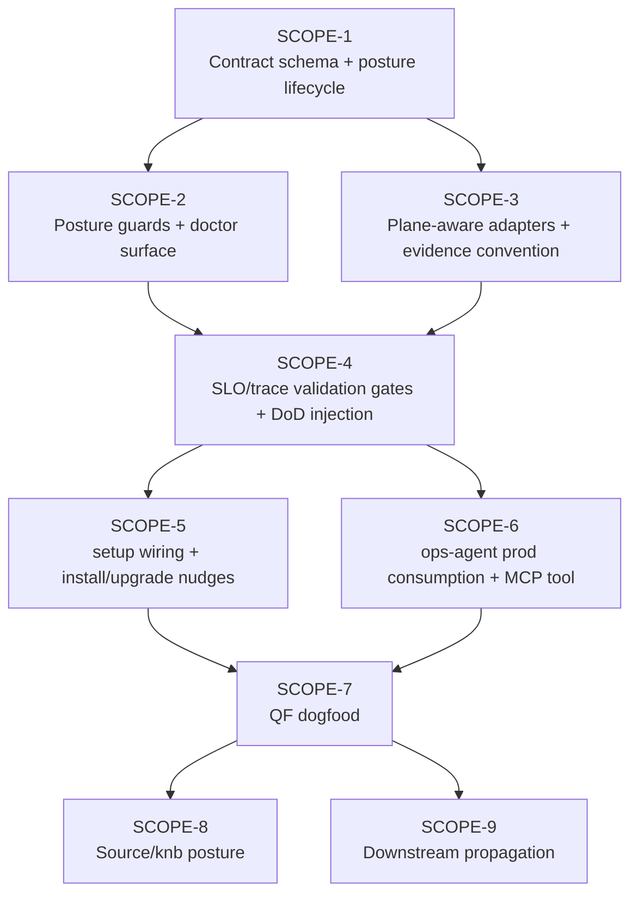

# IMP-001 — Observability as a First-Class Citizen

> **Type:** Framework self-improvement execution plan
> **Owner surface:** Bubbles framework (`bubbles/`, `agents/`, `instructions/`, `skills/`, `docs/`) + downstream product repos
> **Status:** FRAMEWORK SHIPPED — v7.10.0 delivered SCOPE-1..6 to `origin/main` (commit `1baa796`, 2026-06-11); v7.10.1 follow-up hardens downstream enforcement + consumer proof. Downstream rollout SCOPE-7..9 remains pending clean per-repo adoption windows.
> **Authoring agent:** bubbles.analyst (design passes 1–4) → revised after a line-by-line verification of the shipped v7.8.0 codebase
> **Created:** 2026-06-11

> ⚠️ **Why this lives in `improvements/` and not `specs/`:** the Bubbles source
> repo MUST NOT keep persistent `specs/` execution packets — Gate **G085**
> (`framework_dogfood_evidence_gate`) fails if `specs/` exists in the canonical
> checkout. This document is the portable execution plan; when implementation
> begins it is driven through `bubbles.plan` → `bubbles.implement` either as
> hermetic fixtures or in a downstream repo, never as a source-repo `specs/`
> packet.

> 📌 **Read Revision 2 first.** The section immediately below records what a
> line-by-line review of the actual v7.8.0 code proved about this plan's
> assumptions. Where Revision 2 differs from the original passes-1–4 body
> (Design Invariants onward), **Revision 2 wins** and the original prose is
> retained only as superseded design history.

---

## Revision 2 — Grounded-Review Corrections (2026-06-11)

A line-by-line review of the shipped framework (v7.8.0) was run against every
load-bearing assumption in passes 1–4. Result: the **gate-ID plan, the
posture/opt-out model, the two-plane isolation goal, the MCP evidence path, and
G080/G026/G115/G122 references are all real and correctly cited.** Five
assumptions were **wrong or materially under-costed**, and one finding **changes
the headline framing of the whole feature.**

### R2-A — Verified REAL (keep as-is)

| Assumption | Verified reality (file) |
|---|---|
| `traceContracts:` + `trace-contract-guard.sh` + **G080** `trace_contract_evidence_gate` (SHOULD / advisory-until-configured) | `bubbles/registry/gates.yaml` G080; `bubbles/scripts/trace-contract-guard.sh`; `project-config-contract.md` §`traceContracts` Contract (G080) |
| **G080 hard-greps `^traceContracts:`** (INV-5 "do not rename" is justified) | `trace-contract-guard.sh` parses the literal key; renaming would silently no-op |
| **G026** `sla_stress_coverage_gate`, **G115** `env_pollution_isolation_gate` + `env-pollution-scan.sh`, **G122** `propagation_validation_required_gate` (`validationSkipReason` doctrine) | `bubbles/registry/gates.yaml` G026/G115/G122 |
| **Gate IDs G098/G099/G100 are FREE.** G095 = `discovered_issue_disposition_gate`; **G096 is burned** (absent); G097 = `requirement_mechanism_correspondence_gate` (latest, created 2026-06-08); train/upkeep/propagation band is G110–G125. | `bubbles/registry/gates.yaml` — G095 → G097 jump confirmed; nothing between G097 and G110 |
| **MCP is fully implemented** (the user was right). `bubbles/mcp/server.py` (stdio + HTTP, negotiates 2024-11-05 / 2025-03-26 / 2025-06-18), **10 tools**, including `record_evidence` → `tool-log.sh` → `.specify/runtime/tool-calls.jsonl`, and `query_tool_log` → `evidence-tool-log-bridge.sh`. **No `check_observability` tool yet** (SCOPE-6 add is net-new and correctly scoped). | `bubbles/mcp/server.py`; `bubbles/mcp/tools/{record_evidence,query_tool_log,…}.json` |
| `is_framework_repo()` exists (SCOPE-2 T2.1 can rely on it); `yaml-schema-validate.sh` + `bubbles/schemas/` exist | `bubbles/scripts/cli.sh:181`; `bubbles/schemas/*.schema.json` (7 schemas) |
| `doctor` has **no** observability/posture/SLO surface today (SCOPE-2 T2.6 is genuinely net-new) | `bubbles/scripts/cli.sh` — zero posture/observability/SLO tokens |
| Adapters refuse to run without their env (NO-DEFAULTS); `none` is the safe default | `bubbles/adapters/observability/prometheus.sh`, `none.sh` |

### R2-B — HEADLINE CORRECTION: the v5 adapter layer is an ORPHAN FOUNDATION

The shipped v5 observability-adapter layer (`traceContracts.liveTelemetryEndpoints`
+ `none.sh`/`prometheus.sh` + `observability-adapter-lint.sh` + the
`bubbles-observability-adapter` skill + the `observe-production.md` recipe)
**ships the mechanism, the lint, the selftest, and the docs — but has ZERO
wired runtime consumers.** Triple-confirmed:

- `agents/bubbles.retro.agent.md` — **no** telemetry / alerts / prometheus / adapter / deploy-impact tokens.
- `agents/bubbles.stabilize.agent.md` — only generic "route observability work to bubbles.devops" + "logging quality / correlation IDs"; **no** adapter consumption.
- `bubbles/scripts/**` — the **only** references to `bubbles/adapters/observability/` are `observability-adapter-lint.sh` and its selftest (+ a manifest-purity leak-probe). **No script invokes a `fetch-*` verb.**
- No `bubbles-project.yaml` anywhere wires `liveTelemetryEndpoints`.

Yet `skills/bubbles-observability-adapter/SKILL.md`, `CONTROL_PLANE_SCHEMAS.md`,
and `docs/recipes/observe-production.md` all **assert** that "Consumers
(`bubbles.retro`, `bubbles.stabilize`) resolve each verb to the named adapter at
runtime." That consumer does not exist in code. By the framework's own
**G029 integration_completeness_gate** standard, this is a dead library / orphan
endpoint.

**Consequences for the plan:**

1. **INV-15 is over-engineered.** A "one deprecation cycle, read the legacy key
   with a warning, then remove" migration assumes real consumers depend on
   `liveTelemetryEndpoints`. Nothing does. The migration is a **clean cutover**,
   not a deprecation dance.
2. **SCOPE-6 is no longer "additive ops convenience" — it is the scope that
   converts a shipped-but-dead foundation into a real capability.** It is the
   single highest-value piece of this feature and must be re-framed and
   pulled earlier in priority (it depends on the adapter resolver from SCOPE-3,
   not on the full SLO-gate teeth in SCOPE-4).
3. **Honesty fix required regardless of the rest of the feature:** the SKILL /
   schema-guide / recipe MUST stop claiming a consumer that does not exist —
   either wire the consumer (SCOPE-6) or downgrade the prose to "available for
   adapter authors; not yet consumed." This is a small, standalone correctness
   win worth doing first.

### R2-C — One adapter-selection surface: EXTEND `traceContracts`, don't add a sibling

Revision 1 (INV-3 / INV-11 / INV-15 + the Schema section) introduces a **new
top-level `observability:` block** whose `endpoints.validate/operate.*`
duplicates the role of `traceContracts.liveTelemetryEndpoints`. Because (a) the
legacy key is an orphan with no consumers and (b) `trace-contract-guard.sh`
hard-greps `^traceContracts:` so that key is load-bearing and cannot move,
**Revision 2 chooses: nest the new posture/endpoints/SLO config UNDER
`traceContracts` (extend the existing, already-parsed key) rather than adding a
parallel top-level `observability:` key.**

- Avoids two top-level adapter-selection surfaces (the exact "dual surface" risk
  R1 lists in its own risk register).
- Keeps INV-5 intact (we never rename `traceContracts`; we add sub-keys, which
  the existing guard already tolerates — confirmed by the back-compat selftest
  requirement T1.7).
- `liveTelemetryEndpoints` (flat single-plane map) is **replaced in place** by
  `traceContracts.observability.endpoints.{validate,operate}.*`. Clean cutover;
  no deprecation cycle (R2-B).

> If the owner prefers the top-level `observability:` key for readability, that
> is acceptable — but then `liveTelemetryEndpoints` must be **deleted outright**
> in the same change (not deprecation-cycled), and the doc/skill/recipe orphan
> claims fixed. Either way: exactly one surface, and the dead one is removed,
> not gracefully aged out.

### R2-D — Normalized-payload work is a 3-file BREAKING change, not a doc task

R1 SCOPE-1 T1.8 ("define normalized payloads, `[]` for alerts") and SCOPE-3 T3.1
("adapter-lint validates normalized JSON payload shapes") collide with shipped
reality:

- `none.sh` returns **`{}` for ALL four verbs** (including `fetch-alerts`).
- `observability-adapter-lint.sh` **hard-asserts** `none.sh` returns exactly
  `{}` for every verb, and **explicitly does NOT validate payload shapes**
  ("This lint does NOT attempt to validate that adapters return correct
  structured payloads at runtime").
- `prometheus.sh fetch-alerts` returns the **raw Prometheus envelope**
  (`{"status":"success","data":{...}}`), not a bare array.
- The shipped contract **already self-contradicts**: `CONTROL_PLANE_SCHEMAS.md`
  says `fetch-alerts` → "JSON array of active alerts" while `none` → "all 4
  return `{}`" and the lint enforces `{}`.

So introducing normalized payloads is a **breaking change to three shipped,
byte-identical-across-6-copies files** (`none.sh`, `prometheus.sh`,
`observability-adapter-lint.sh`) plus their selftests, and it must **first
resolve the existing doc-vs-lint-vs-impl contradiction.** Revision 2 decision:

- Canonical shapes: `fetch-alerts` → **JSON array `[]`**; the other three →
  **JSON map `{}`** (matches the doc's intent and the normalized-payload table).
- `none.sh`: return `[]` for `fetch-alerts`, `{}` for the other three.
- `observability-adapter-lint.sh`: replace the blanket "`{}` for every verb"
  assertion with a **per-verb shape assertion** (array for alerts, object for
  the rest); add the adversarial selftest case proving a wrong shape fails.
- `prometheus.sh`: normalize the alerts envelope to a bare array before emitting.
- This is its own sub-scope with real selftest churn. R1 hid it inside SCOPE-1
  "L" + SCOPE-3 T3.1; Revision 2 makes it an explicit, separately-evidenced unit.

### R2-E — Schema validation: there is no `bubbles-project.yaml` schema today

R1 T1.4 says "add a JSON schema under `bubbles/schemas/` so
`yaml-schema-validate.sh` can check shape." But `yaml-schema-validate.sh`
validates **whole files** via a hardcoded `pairs[]` list (`workflows.yaml`,
`capability-ledger.yaml`, `adoption-profiles.yaml`, `propagation-policy.yaml`,
`scenario-manifest.json`). **There is no schema for `bubbles-project.yaml`** —
the file that would hold the `observability:` / `traceContracts.observability`
block. Options:

1. Introduce the **first-ever `bubbles-project.schema.json`** (validates the
   whole project-config file) and add it to `pairs[]` — larger than T1.4 implies,
   and it must tolerate every existing project-config key (`testImpact`,
   `traceContracts`, `mcp.grants`, scan overrides, …) or it will fail real repos.
2. **Don't lean on `yaml-schema-validate.sh` for a sub-block.** The posture
   guards (G098/G099) and SLO guard (G100) already parse the block themselves;
   make **the guards** the schema authority (fail-loud on malformed shape) and
   skip the JSON-schema route. Revision 2 prefers **(2)** — the guards are the
   real enforcement surface; a partial project-config JSON schema is optional
   polish, not a dependency.

### R2-F — Two evidence stores: make the relationship explicit

R1 introduces `.specify/runtime/observability/<workflow>.<signal>.json` as the
SLO/trace evidence the G100 guard reads, while the **MCP-primary evidence path**
is `.specify/runtime/tool-calls.jsonl` (written by `record_evidence`/`tool-log.sh`,
consumed by `evidence-tool-log-bridge.sh` + `state-transition-guard`). Revision 2
makes the split explicit and non-duplicative:

- `tool-calls.jsonl` = **provenance/audit** that the capture command actually ran
  (the existing anti-fabrication spine). The capture MUST go through
  `record_evidence` so the tool-log has the row.
- `.specify/runtime/observability/*.json` = **the parsed metric artifact** the
  G100 guard asserts numeric targets against. It is an *output* of the captured
  run, not a second source of truth.
- `.specify/runtime/` MUST be gitignored (verify in T3.4).

### R2-G — Workshop-overlap note (the source that prompted this review)

This feature already captures the agency-workshop's #1 idea — **traces/SLOs as
runtime acceptance criteria, not just logs** — and goes further (posture
lifecycle, numeric SLO assertion, validate/operate plane isolation). Two workshop
ideas are **adjacent and worth folding in here**, one is **already shipped**:

- **Adversarial observability ("break-it / find-it"):** the workshop deliberately
  removes a span attribute / injects an N+1 and proves the trace check *catches*
  it. Revision 2 adds this as a doctrine for G080/G100: a trace/SLO check is only
  trusted if a hermetic selftest proves it **fails when instrumentation
  regresses** (mirrors the existing adversarial-regression policy). Folded into
  SCOPE-4 selftests (T4.6) as an explicit requirement.
- **"3 AM reconstructibility" heuristic:** name it explicitly in the SCOPE-4 DoD
  injection and the `bubbles-observability-adapter` skill as the human acceptance
  question behind G080 ("can an on-call engineer reconstruct the story from this
  trace alone?").
- **Test Impact Map (run-only-affected-tests):** the workshop's top
  dev-velocity idea is **already shipped** in Bubbles as **G079
  `impact_aware_validation_plan_gate` + `testImpact` + `test-impact-plan.sh`**.
  No new work here — explicitly OUT of scope for this observability feature;
  noted so it is not re-proposed.
- **"Loopy AI" framing (workshop principle #6):** evidence/observability rules
  are the agent's *sensory input* for closing its own loops, not just human
  anti-fabrication. Folded into SCOPE-4 (T4.9) as an `agent-common.md` philosophy
  add — it justifies the whole trace-validation investment.
- **WHEEL / Trace Topology doc (workshop constitution mandate):** the *static*
  span-topology counterpart to the `observability.workflows` contract. Folded
  into SCOPE-4 (T4.10) as an optional `design.md` template section, required for
  wired service-bearing instrumented scopes.
- **Operator/contributor docs polish (workshop README + Modules 4/7):** the
  user-facing prompt-engineering guidance and the MCP "when does a script
  graduate to a tool" rubric are NOT observability and do not belong in this
  feature. Split out to **IMP-003** (`improvements/IMP-003-operator-contributor-guidance.md`).

### R2-H — Revision-2 deltas to apply when this plan is driven into scopes

1. Gate IDs: **confirmed G098/G099/G100** (no longer "pending registry
   confirmation"). G096 stays burned; never reuse.
2. Replace the top-level `observability:` schema with a
   **`traceContracts.observability:`** sub-block (R2-C); update INV-3/INV-11/INV-15,
   the Schema section, and every `observability.endpoints…` path reference.
3. **Delete** `liveTelemetryEndpoints` in the same change (clean cutover); drop
   the one-deprecation-cycle language from INV-15, SCOPE-1 T1.12, SCOPE-5 T5.8,
   and the risk register.
4. Promote the **normalized-payload + adapter-lint rewrite** (R2-D) to an
   explicit sub-scope under SCOPE-3 with its own selftest evidence.
5. Re-frame **SCOPE-6** as "wire the first real telemetry consumer (converts the
   orphan foundation into a live capability) + fix the orphan claims in
   skill/schema-guide/recipe," and treat the doc-honesty fix as a
   do-it-immediately correctness item independent of the gate teeth.
6. Make **the guards** the schema authority (R2-E); downgrade T1.4 to optional
   polish.
7. Make the **two evidence stores** explicit and non-duplicative (R2-F).
8. Add **adversarial-observability** selftests + the **3 AM** acceptance heuristic
   (R2-G); record Test Impact Map as already-shipped / out-of-scope.
9. Fold the **"Loopy AI" framing** (SCOPE-4 T4.9, `agent-common.md`) and the
   **WHEEL / Trace Topology** `design.md` template section (SCOPE-4 T4.10) into
   this feature — both are observability-adjacent (R2-G).
10. Split the non-observability **operator/contributor docs polish** (user-facing
    prompt-engineering guidance + MCP graduation rubric) into **IMP-003**; they
    are out of scope here.

Everything below this line is the original passes-1–4 plan, retained as design
history. Where it conflicts with Revision 2, Revision 2 governs.

---

## Outcome Contract

- **Intent:** Make observability (metrics, logs, traces, SLOs) a first-class
  Bubbles concern: every repo must *declare a posture*, wired repos must *prove
  telemetry in integration/e2e and prove SLOs under load*, and ops agents must
  *use telemetry to monitor production* — while opt-out remains a legitimate,
  recorded, expiring choice and the whole thing stays transparent to users.
- **Success Signal:**
  1. `bubbles doctor` prints an Observability Posture line for every repo.
  2. A repo with `posture: wired` cannot mark an instrumented scope `done`
     without captured telemetry evidence + SLO assertion evidence.
  3. A repo with `posture: opted-out` passes cleanly, but doctor and the
    posture/freshness guards keep an opt-in reminder alive that escalates after
    `revisitAfter`; upkeep does not own opt-out reminders.
  4. `bubbles.stabilize` and `bubbles.upkeep` read live prod telemetry through
     the adapter contract during their workflows.
- **Hard Constraints:**
  - No existing repo breaks on upgrade (undeclared posture = WARN, never a hard
    block by default).
  - The `^traceContracts:` parser contract is preserved (no silent no-op). The
    new posture/endpoints/SLO config nests UNDER `traceContracts` as a child
    sub-block (R2-C); the orphan `liveTelemetryEndpoints` key is removed in a
    clean cutover, not deprecation-cycled (R2-B).
  - Test-plane telemetry never writes to prod surfaces (G115 stays green).
  - No secrets/URLs in committed config — adapter endpoints carry tool **names**
    only; real URLs/tokens live in the knb overlay.
  - Feature scopes use validate-plane telemetry only; prod telemetry queries are
    limited to deploy, train, upkeep, incident, and release scopes.
  - Every new guard is byte-identical across the canonical repo + 5 downstream
    copies, each with a hermetic selftest wired into `framework-validate.sh`.
  - Guards declare their `yq`/`jq` dependency explicitly. A missing parser makes
    a WARN-level guard (G098/G099) WARN-and-skip (never a hard error); a BLOCKING
    guard (G100) fails closed with an actionable "install jq/yq" message rather
    than silently passing.
- **Failure Condition:** Observability becomes a parallel completion authority
  that can be gamed, OR the rollout hard-blocks repos that legitimately have no
  monitoring, OR test telemetry pollutes prod.

---

## Design Invariants (carried from passes 1–4)

| # | Invariant | Rationale |
|---|-----------|-----------|
| INV-1 | **Posture is mandatory; wiring is optional.** Tri-state: `wired` / `opted-out` / *undeclared*. Undeclared is the only "uncomfortable" state (nag). | First-class = the decision is required, not the tooling. |
| INV-2 | **Opt-out is recorded + expiring.** `reasonCode` + `reason` + `revisitAfter` + `approvedBy`. Mirrors the G122 `validationSkipReason` doctrine. | Legitimate "no monitoring" without silent neglect. |
| INV-3 | **Two planes, one provider adapter, a profile per plane.** `traceContracts.observability.endpoints.validate.*` resolves to the ephemeral test stack (`profile: test`); `…endpoints.operate.*` resolves to prod (`profile: prod`). | A single global endpoint selection is wrong for both planes (pass 4 A1). Reconciled with INV-11: planes differ by *profile*, not by a separate adapter file. |
| INV-4 | **Test telemetry is `env=test*` only.** G115 blocks `env=prod`/`env=home-lab` writes from test code. | Validate plane must not pollute prod (pass 4 A2). |
| INV-5 | **Do not rename `traceContracts:`; nest under it.** Add the posture/endpoints/SLO config as `traceContracts.observability:` — a CHILD of the already-parsed key, NOT a new top-level sibling (R2-C); extend workflow entries with backward-compatible optional fields. | `trace-contract-guard.sh` hard-greps `^traceContracts:` and tolerates unknown sub-keys (pass 4 A3; back-compat selftest T1.7). |
| INV-6 | **Telemetry strengthens DoD; never replaces tests/validate.** | Anti-gaming; completion authority stays with bubbles.validate. |
| INV-7 | **Captured-runtime evidence only.** No code inspection, no predicted spans. | Existing G080 anti-fabrication bar. |
| INV-8 | **Lockstep + selftest for every guard.** | The G115 self-match bug proved drift across 6 copies is a real failure mode. |
| INV-9 | **Opt-out reminder ownership is single-sourced.** `doctor` + posture/freshness guards own committed `revisitAfter`; `bubbles.upkeep` owns wired prod `slo-review` only. | Avoids split-brain between committed config and upkeep ledger state. |
| INV-10 | **Workflow mapping is explicit.** Scope/test-plan rows name `observabilityWorkflow`; guards never infer workflow applicability from changed paths alone. | Avoids accidental blocks or misses caused by heuristic mapping. |
| INV-11 | **Adapter names are provider names, not environment names.** Plane/profile resolution selects env vars/endpoints; no `prometheus-test` adapter file proliferation. | Keeps adapter contract reusable and project-agnostic. |
| INV-12 | **Operate-plane telemetry is read-only.** Bubbles ops agents may fetch alerts/SLO burn/error rate/deploy impact; they must not acknowledge, silence, mutate, or write prod telemetry through this adapter layer. | Keeps Bubbles monitoring additive to existing monitoring, not a hidden prod control plane. |
| INV-13 | **Schema version is enforced before semantics.** Guards support explicit `schemaVersion` values and fail loudly on unknown breaking schema versions. | Prevents silent mis-parsing as the contract evolves. |
| INV-14 | **`posture: wired` requires usable evidence paths.** Wired repos must have at least one non-`none` validate-plane signal for declared instrumented workflows, and at least one non-`none` operate-plane signal for prod-monitoring scopes. | Prevents a fake-wired state where every signal is `none`. |
| INV-15 | **`traceContracts.observability.endpoints` REPLACES the v5 `liveTelemetryEndpoints` in a CLEAN CUTOVER.** The legacy key is an ORPHAN — no agent or script consumes it (R2-B), so there is nothing to deprecate-cycle. Delete `liveTelemetryEndpoints` in the same change that introduces `observability.endpoints`, and fix the skill/schema-guide/recipe prose that falsely claims a `bubbles.retro`/`bubbles.stabilize` consumer. | A second, overlapping adapter-selection surface is ambiguous; the dead one is removed outright, not gracefully aged out. |

---

## Schema (Revision 2 — nested under `traceContracts`)

> **Path shorthand:** everywhere below this doc writes `observability.<x>` (e.g.
> `observability.policy.undeclaredPosture`, `observability.slos`) it is shorthand
> for `traceContracts.observability.<x>`. There is no top-level `observability:`
> key (R2-C).

```yaml
# .github/bubbles-project.yaml  (project-owned; never overwritten on upgrade)

traceContracts:             # UNCHANGED top-level key — existing G080 guard still parses it
  observability:            # NEW child sub-block (R2-C) — NOT a top-level sibling
    schemaVersion: 1        # bump on any breaking shape change; guards assert it
    posture: wired          # wired | opted-out  — REQUIRED (absent = undeclared = nag)
    policy:
      undeclaredPosture: warn # warn | block — controls G098 behavior
    decision:               # REQUIRED for wired + opted-out — who decided + last review
      decidedAt: 2026-06-11
      decidedBy: operator
      decisionSource: "bubbles.setup focus: observability"
      lastReviewedAt: 2026-06-11
    optOut:                 # REQUIRED iff posture: opted-out
      reasonCode: no-runtime  # no-runtime | pre-monitoring | external-monitoring-only
      reason: "framework source repo; nothing to monitor"
      declaredAt: 2026-06-11
      revisitAfter: 2027-06-11
      approvedBy: operator
    endpoints:              # signal-axis (4 verbs); names only, never URLs/tokens
                            # REPLACES the deleted v5 liveTelemetryEndpoints (R2-B clean cutover)
      validate:             # resolves to the EPHEMERAL per-run test stack
        alerts: { adapter: none }
        sloBurn: { adapter: prometheus, profile: test }
        errorRate: { adapter: prometheus, profile: test }
        deployImpact: { adapter: none }
      operate:              # resolves to PROD (URLs set in knb overlay env)
        alerts: { adapter: prometheus, profile: prod }
        sloBurn: { adapter: prometheus, profile: prod }
        errorRate: { adapter: prometheus, profile: prod }
        deployImpact: { adapter: prometheus, profile: prod }
    slos:                   # env-agnostic CONTRACT targets
      gateway.request:
        latencyP99Ms: 50
        errorRatePct: 0.1
        availabilityPct: 99.9
  workflows:                # existing G080 workflows — unchanged shape
    booking.create:
      requiredSpans:
        - name: http.request
          attributes: [trace_id, booking.id]
      requiredInvariants:
        - exactly one confirmation event
      slo: gateway.request  # NEW optional field — ignored by old guard, read by SLO guard
  # The v5 `liveTelemetryEndpoints:` key is DELETED in this change (orphan; no
  # consumer in any agent or script — R2-B). No deprecation cycle.
```

**Canonical normalized adapter payloads:** adapters normalize provider-specific
responses before returning data to Bubbles. The lint/contract tests validate
these **per-verb** shapes, not raw provider envelopes. The `none` adapter returns
the neutral empty value for each verb (`[]` for alerts, `{}` for maps).

```json
{
  "fetch-alerts": [
    { "id": "string", "service": "string", "severity": "info|warning|critical", "startedAt": "iso8601", "summary": "string" }
  ],
  "fetch-slo-burn": { "service.name": 0.0 },
  "fetch-error-rate": { "service.name": 0.0 },
  "fetch-deploy-impact": { "sourceSha": { "service": "string", "regressionDelta": 0.0 } }
}
```

**Profile-to-env binding:** profile names (`test`, `prod`) are not adapter
filenames. The resolver invokes the provider adapter with profile-specific env
materialized into the adapter's native variables. Example for Prometheus:

| Plane | Profile | Input env owned by caller/overlay | Adapter subprocess env |
|-------|---------|-----------------------------------|------------------------|
| validate | `test` | `BUBBLES_OBS_VALIDATE_PROMETHEUS_BASE_URL`, `BUBBLES_OBS_VALIDATE_PROMETHEUS_QUERY_SLO_BURN`, ... | `PROMETHEUS_BASE_URL`, `PROMETHEUS_QUERY_SLO_BURN`, ... |
| operate | `prod` | `BUBBLES_OBS_OPERATE_PROMETHEUS_BASE_URL`, `BUBBLES_OBS_OPERATE_PROMETHEUS_QUERY_SLO_BURN`, ... | `PROMETHEUS_BASE_URL`, `PROMETHEUS_QUERY_SLO_BURN`, ... |

Resolvers must fail loud when the selected profile lacks required env. They must
not read prod-profile env for `--plane validate`, even if prod env exists.

**Captured-evidence convention:** test runs deposit telemetry to
`.specify/runtime/observability/<workflow>.<signal>.txt|json`; guards consume
those files; `record_evidence` (MCP) wraps the capture so the tool-log path
covers it. Trace/log evidence may stay line-oriented text. SLO evidence is
normalized JSON:

```json
{
  "workflow": "booking.create",
  "slo": "gateway.request",
  "sampleWindow": "PT5M",
  "source": "integration|e2e|stress|load",
  "target": { "latencyP99Ms": 50, "errorRatePct": 0.1, "availabilityPct": 99.9 },
  "observed": { "latencyP99Ms": 42, "errorRatePct": 0.02, "availabilityPct": 100.0 }
}
```

**Explicit workflow mapping convention:** planning must add
`observabilityWorkflow: <traceContracts.workflows key>` to each applicable
Test Plan row (and to `test-plan.json` when present). G100/G080 use that field
to decide which workflow contract applies; changed-path inference may suggest a
candidate but cannot be the certification trigger.

**Definition — *instrumented scope*:** a scope whose Test Plan declares at least
one `observabilityWorkflow`. Only instrumented scopes receive observability DoD
injection (SCOPE-4); a scope with no `observabilityWorkflow` row is never blocked
by G080/G100, even when `posture: wired`.

**Posture transitions:** `undeclared → wired` and `undeclared → opted-out` are
the normal first decisions. `opted-out → wired` is driven by setup's
new-monitoring detection (SCOPE-5). `wired → opted-out` (monitoring
decommissioned) is a legitimate, recorded transition that MUST set the full
`optOut` block and a fresh `decision`; it is never silent. `revisitAfter` is the
single source of truth for opt-out expiry; `reasonCode` only seeds the *default*
`revisitAfter` that setup proposes (no-runtime → long, pre-monitoring → short).
Once written, `revisitAfter` wins over any reasonCode-derived default.

---

## Gate plan

| Gate | Name | Behavior | Enforcer |
|------|------|----------|----------|
| **G098** (confirmed free — G096 burned, G097 latest; verified against the registry 2026-06-11) | `observability_posture_declared_gate` | **WARN by default** (nag), project-flippable to blocking through `observability.policy.undeclaredPosture`. Fails only if posture undeclared AND policy says undeclared is disallowed. | `observability-posture-guard.sh` |
| **G099** | `observability_opt_out_freshness_gate` | WARN / route-required when committed `revisitAfter` is in the past. `revisitAfter` is authoritative; `reasonCode` only seeds the setup-proposed default. | `observability-opt-out-guard.sh` |
| **G100** | `observability_slo_evidence_gate` | **BLOCKING when `posture: wired`** and an *instrumented scope* (a Test Plan row declaring `observabilityWorkflow`) targets a workflow with an `slo:`. No-op when `opted-out` or no `observabilityWorkflow` is declared. | `observability-slo-guard.sh` |
| **G080** (existing) | `trace_contract_evidence_gate` | Language upgraded SHOULD → **MUST-when-wired**; still no-op when no contract / opted-out. | `trace-contract-guard.sh` |
| **G026** (existing) | `sla_stress_coverage_gate` | Unchanged trigger; when wired, the stress/load test MUST reference the `observability.slos` registry entry. | state-transition-guard Check |
| **G115** (existing) | `env_pollution_isolation` | Unchanged; documented as the guarantee that protects the validate plane. | `env-pollution-scan.sh` |

Gate-ID band note: G098–G100 are confirmed-free framework gates (G001–G199
band; verified against `bubbles/registry/gates.yaml` on 2026-06-11 — the
registry runs G095 → G097 with **G096 burned**, and the train/upkeep band only
starts at G110, so G098/G099/G100 are unambiguously available). G096 MUST NOT
be reused. Each new gate still requires a `gates.yaml` entry, regeneration into
`workflows.yaml` via `generate-gates-block.sh`, a hermetic selftest, and
`framework-validate.sh` wiring (see the per-scope DoD).

---

## Scope DAG



---

## SCOPE-1 — Observability contract schema + posture lifecycle  `foundation:true`

**Intent:** Establish the single `traceContracts.observability` contract (R2-C —
nested under the existing key, not a new top-level sibling), the tri-state
posture, and the opt-out lifecycle — docs, template, schema — with zero
enforcement yet. The guards introduced in SCOPE-2/SCOPE-4 are the schema
authority (R2-E); a project-config JSON schema is optional polish.

**Gherkin**
- Given a repo with no `observability:` block, when any guard reads config, then posture resolves to `undeclared` and nothing is enforced.
- Given `posture: opted-out` without an `optOut` block, when the schema is validated, then it is rejected as malformed.
- Given `posture: opted-out` with an `optOut` block missing `reasonCode`, `reason`, or `revisitAfter`, when the schema is validated, then it is rejected as malformed (a missing `revisitAfter` would make G099 a silent no-op).
- Given `posture: wired` with every relevant signal set to `none`, when posture validation runs, then it is rejected as fake-wired.
- Given `schemaVersion` is absent or unsupported, when any observability guard runs, then it fails loud before applying semantics.
- Given `traceContracts.workflows.<n>.slo`, when the existing trace guard runs, then it parses and ignores the new field (no regression).
- Given an adapter returns raw provider JSON instead of the normalized contract, when adapter contract tests run, then the adapter is rejected.
- Given a scope Test Plan row lacks `observabilityWorkflow`, when wired observability applies, then validation reports a planning gap instead of guessing a workflow.

**Tasks**
- T1.1 — Author the `traceContracts.observability:` schema section in `agents/bubbles_shared/project-config-contract.md` (posture, optOut, endpoints.validate/operate, slos, workflow `slo:` link). It is a CHILD of the existing `traceContracts` Contract (G080) section, NOT a new top-level key (R2-C).
- T1.2 — Document the schema + plane model in `docs/guides/CONTROL_PLANE_SCHEMAS.md` by EXTENDING the existing `traceContracts` section (do NOT rename the key) AND **deleting the `Live Telemetry Endpoints (v5)` / `liveTelemetryEndpoints` subsection** — it is an orphan with no consumer (R2-B). Replace it with the `observability.endpoints` two-plane model.
- T1.3 — Ship `templates/observability.yaml.tmpl` — fully commented, nested under `traceContracts:`, `schemaVersion: 1`, posture `undeclared` placeholder, all endpoints `none`, zero real tool names.
- T1.4 — (OPTIONAL POLISH — R2-E) The posture/SLO guards (G098/G099/G100) are the schema authority and fail loud on malformed shape; a JSON-schema route is NOT a dependency. If pursued, introduce the FIRST-EVER `bubbles-project.schema.json` (whole-file) and add it to the `yaml-schema-validate.sh` `pairs[]` list — but it MUST tolerate every existing project-config key (`testImpact`, `traceContracts`, `mcp.grants`, scan overrides) or it will fail real repos. Default: skip; let the guards own shape validation.
- T1.5 — Update `skills/bubbles-observability-adapter/SKILL.md`: posture model, plane split, opt-out lifecycle, evidence-file convention.
- T1.6 — Add `docs/recipes/observe-production.md` section for the posture decision (wire vs opt-out) and the opt-in reminder.
- T1.7 — Regression-proof the parser: add a `trace-contract-guard-selftest.sh` case asserting a workflow with an unknown `slo:` field still passes.
- T1.8 — Define normalized payload contracts for the four adapter signals and add fixture examples under `bubbles/tests/fixtures/observability/`.
- T1.9 — Define the explicit `observabilityWorkflow` Test Plan / `test-plan.json` field in `planning-core.md` and project-config-contract.md.
- T1.10 — Define profile-to-env binding rules for provider adapters (`BUBBLES_OBS_VALIDATE_*` / `BUBBLES_OBS_OPERATE_*` → adapter-native env) and fail-loud behavior.
- T1.11 — Define the SLO evidence JSON shape and require guards to reject malformed evidence before comparing numbers. State the two-store split (R2-F): `.specify/runtime/tool-calls.jsonl` is provenance (the capture command ran, via `record_evidence`); `.specify/runtime/observability/<workflow>.<signal>.json` is the parsed metric artifact the G100 guard asserts numeric targets against — an OUTPUT of the captured run, never a second source of truth.
- T1.12 — Document the CLEAN CUTOVER (R2-B/INV-15): `liveTelemetryEndpoints` is DELETED in the same change that introduces `traceContracts.observability.endpoints` — NO deprecation cycle, because no agent or script consumes the legacy key. Fix the orphan-consumer prose in the skill/schema-guide/recipe (T1.5/T1.2/T1.6). Make `optOut.reasonCode`/`reason`/`revisitAfter` REQUIRED (guard-enforced when `posture: opted-out`).

**Test plan**
| Test | Category | Proof |
|------|----------|-------|
| schema-shape fixture (wired / opted-out / malformed) | unit | posture/SLO guard exit codes (guards are the schema authority — R2-E; `yaml-schema-validate.sh` only if the optional T1.4 whole-file schema is pursued) |
| fake-wired fixture | unit | `posture: wired` with only `none` signals rejected |
| unsupported schema version fixture | unit | guards fail loud before semantics |
| trace-guard back-compat with `slo:` field | unit | new selftest case green |
| normalized payload fixtures | unit | valid shapes accepted, raw provider envelope rejected |
| SLO evidence JSON fixture | unit | valid observed/target shape accepted, malformed rejected |

**DoD**

> **SCOPE-1 foundation boundary (governs the checkboxes below).** SCOPE-1 DEFINES
> the contracts/schema/template/fixtures + the one back-compat selftest. It builds
> NO guards and rewrites NO adapters (G098/G099 posture guards → SCOPE-2; the SLO
> guard G100 → SCOPE-4; the normalized-payload adapter-lint rewrite → SCOPE-3,
> R2-D). DoD items whose proof requires *executing* a guard/lint that does not yet
> exist are therefore **foundation-delivered (fixtures + docs shipped) but
> guard-execution-deferred** to the scope that builds the consumer. They are left
> `[ ]` with the deferral recorded rather than fabricated as "guard ran".

- [x] `traceContracts.observability` schema documented in project-config-contract.md + CONTROL_PLANE_SCHEMAS.md with worked examples; the `liveTelemetryEndpoints` subsection is DELETED from CONTROL_PLANE_SCHEMAS.md (R2-B).
  - **Claim Source:** executed. T1.1 added the `traceContracts.observability` Contract subsection to [`agents/bubbles_shared/project-config-contract.md`](../agents/bubbles_shared/project-config-contract.md) (worked YAML + field table + rules + clean-cutover note). T1.2 replaced the `Live Telemetry Endpoints (v5)` / `liveTelemetryEndpoints` subsection in [`docs/guides/CONTROL_PLANE_SCHEMAS.md`](../docs/guides/CONTROL_PLANE_SCHEMAS.md) with the two-plane `observability.endpoints` model. Repo-wide grep proves no dangling references remain in active config/scripts:
    ```text
    $ grep -rn "liveTelemetryEndpoints" . | grep -v '.git/'
    ./docs/guides/CONTROL_PLANE_SCHEMAS.md:151:> **Clean cutover (R2-B):** this `observability.endpoints` model REPLACES the v5 `traceContracts.liveTelemetryEndpoints` flat map ... deleted outright in the same change ...
    ./docs/recipes/observe-production.md:54:> **Clean cutover:** this `observability.endpoints` block REPLACES the old `traceContracts.liveTelemetryEndpoints` flat map ...
    ./CHANGELOG.md:1018:- New schema extension under `traceContracts.liveTelemetryEndpoints` ...        (historical v5.0.0 release note — intentionally retained)
    ./improvements/IMP-001-observability-first-class.md: ...                                          (this plan — intentional)
    ./agents/bubbles_shared/project-config-contract.md:504:**Clean cutover (replaces the v5 `liveTelemetryEndpoints`):** ...
    # Only intentional "deleted/migrated" mentions + historical CHANGELOG + this plan remain. Zero in active scripts.
    ```
- [x] `observability.yaml.tmpl` ships nested under `traceContracts:`; contains no real tool names/URLs (agnosticity-lint clean).
  - **Claim Source:** executed. T1.3 created [`templates/observability.yaml.tmpl`](../templates/observability.yaml.tmpl) (fully commented, `schemaVersion: 1`, posture undeclared placeholder, ALL endpoints `adapter: none`, `prometheus` only in guidance comments, zero URLs). It is enumerated as managed file #542 in the regenerated manifest. Agnosticity lint over all portable surfaces (incl. the template) is clean:
    ```text
    $ bash bubbles/scripts/cli.sh agnosticity
    ℹ️  Scanning 395 portable file(s) for agnosticity drift
    ✅ Portable Bubbles surfaces are project-agnostic and tool-agnostic
    AGNOSTICITY_EXIT=0
    ```
- [x] Guards own shape validation (R2-E): the wired/opted-out/malformed fixtures are adjudicated by the SCOPE-2 posture guard (G098) — valid postures accepted, malformed rejected loud — raw output recorded. (JSON-schema route is optional polish; only assert it if T1.4 was pursued.)
  - **Claim Source:** executed (closed by SCOPE-2, which delivered the posture guard G098 that this box's NAMED fixtures consume; the separate SLO-evidence axis — `slo-evidence*.json` — remains SCOPE-4). `bubbles/scripts/observability-posture-guard.sh` is now the schema authority for the posture axis (R2-E; the T1.4 JSON-schema route stays intentionally SKIPPED). Adjudicating the SCOPE-1 posture fixtures (each staged as `<repo>/.github/bubbles-project.yaml`; repo-root under `$HOME` because the reference `yq` is snap-confined and cannot read `/tmp`):
    ```text
    $ bash bubbles/scripts/observability-posture-guard.sh --repo-root <wired>
    observability-posture-guard: Observability posture: WIRED — at least one non-none telemetry signal declared. (G098 OK)
    EXIT=0
    $ bash bubbles/scripts/observability-posture-guard.sh --repo-root <opted-out-fresh>
    observability-posture-guard: Observability posture: OPTED-OUT (declared, optOut block present). Freshness + required fields enforced by G099. (G098 OK)
    EXIT=0
    $ bash bubbles/scripts/observability-posture-guard.sh --repo-root <malformed>
    observability-posture-guard: G098 (observability_posture_declared_gate): posture: opted-out but the required optOut block is absent (malformed). A missing optOut/revisitAfter would make the G099 freshness guard a silent no-op. Add traceContracts.observability.optOut {reasonCode, reason, revisitAfter}.
    EXIT=1
    ```
    The hermetic selftest `bubbles/scripts/observability-posture-guard-selftest.sh` exercises these same shipped fixtures (25 passed, 0 failed).
- [x] Schema-version and fake-wired fixtures fail loud as expected — raw output recorded.
  - **Claim Source:** executed (closed by SCOPE-2's posture guard G098, which now provides the loud-fail assertion). `posture-unsupported-schema-version.yaml` (`schemaVersion: 999`) and `posture-fake-wired.yaml` (`posture: wired` with every signal `none`) both fail loud (exit 1); schema-version is enforced BEFORE posture semantics (INV-13):
    ```text
    $ bash bubbles/scripts/observability-posture-guard.sh --repo-root <unsupported-schema>
    observability-posture-guard: G098 (observability_posture_declared_gate): unsupported traceContracts.observability.schemaVersion '999' (supported: 1). Failing loud BEFORE applying posture semantics (INV-13).
    EXIT=1
    $ bash bubbles/scripts/observability-posture-guard.sh --repo-root <fake-wired>
    observability-posture-guard: G098 (observability_posture_declared_gate): posture: wired but EVERY validate+operate signal is 'adapter: none' (fake-wired). A wired repo MUST declare at least one usable non-none signal (INV-14). Set a real adapter or change posture to opted-out.
    EXIT=1
    ```
    Both cases are covered by the G098 hermetic selftest (25 passed, 0 failed).
- [x] `trace-contract-guard-selftest.sh` extended; `framework-validate.sh` green — raw output recorded.
  - **Claim Source:** executed. T1.7 added a back-compat case to [`bubbles/scripts/trace-contract-guard-selftest.sh`](../bubbles/scripts/trace-contract-guard-selftest.sh) proving a workflow carrying the new optional `slo:` field still passes the existing G080 parser. Standalone selftest exit 0:
    ```text
    $ bash bubbles/scripts/trace-contract-guard-selftest.sh
    PASS: valid trace evidence satisfies required spans, attributes, and invariants
    PASS: missing required attribute fails the guard
    PASS: error red flag fails the guard
    PASS: missing optional contract is non-blocking without --require-config
    PASS: --require-config fails when traceContracts are absent
    PASS: workflow with unknown observability slo: field still passes (back-compat)
    trace-contract-guard selftest passed.
    SELFTEST_EXIT=0
    ```
    Full `framework-validate` run observed ALL-PASS with zero failures across every check group, including the surfaces SCOPE-1 touched — agnosticity, gates-registry drift + selftest, YAML schema validate, capability-freshness, competitive-docs (`generate-capability-ledger-docs.sh --check`, validates the regenerated competitive-capabilities.md), release-manifest freshness + selftest + purity, and install-provenance ("Installed manifest reports 542 managed files"):
    ```text
    ==> Portable surface agnosticity
    PASS: Portable surface agnosticity
    ==> Gates registry drift (v5.2 / F4)
    generate-gates-block: workflows.yaml is in sync with registry (411 registry lines)
    PASS: Gates registry drift (v5.2 / F4)
    ==> Capability freshness selftest
    PASS: Capability freshness selftest
    ==> Competitive docs selftest
    PASS: Capability ledger docs are current before evaluator-path assertions
    ...
    competitive-docs selftest passed.
    PASS: Competitive docs selftest
    ==> Release manifest freshness
    ==> Release manifest selftest
    release-manifest selftest passed.
    PASS: Release manifest selftest
    ==> Release manifest purity selftest
    release-manifest-purity-selftest: PASS
    PASS: Release manifest purity selftest
    ==> Install provenance selftest
    PASS: Installed manifest reports 542 managed files (>=300 sanity floor)
    PASS: Install provenance selftest
    ```
- [x] Normalized adapter payload contracts documented + fixture-tested; raw provider envelopes fail contract tests.
  - **Claim Source:** executed (closed by SCOPE-3 — the per-verb adapter-lint rewrite now makes "raw provider envelopes fail contract tests" mechanically verifiable). The normalized per-verb shapes (`fetch-alerts` → array `[]`; the three maps → `{}`) are documented in CONTROL_PLANE_SCHEMAS.md + project-config-contract.md, and the fixtures are shipped: `payload-alerts.json` (array), `payload-slo-burn.json`/`payload-error-rate.json`/`payload-deploy-impact.json` (maps), plus the NEGATIVE `payload-alerts-raw-envelope.invalid.json` (raw Prometheus envelope). SCOPE-3 wired `observability-adapter-lint.sh` to assert per-verb shapes and added the ADVERSARIAL selftest case proving the raw provider envelope is REJECTED — case 7 copies `payload-alerts-raw-envelope.invalid.json` into a fixture adapter's `selftest fetch-alerts` and the lint fails it:
    ```text
    $ bash bubbles/scripts/observability-adapter-lint-selftest.sh
    PASS: real adapter dir (none + prometheus) passes
    PASS: missing none.sh rejected
    PASS: adapter missing verb rejected
    PASS: adapter not executable rejected
    PASS: none.sh returning non-JSON output rejected
    PASS: none.sh '{}' for fetch-alerts rejected (must be array)
    PASS: selftest emitting raw provider envelope for fetch-alerts rejected
    All observability-adapter-lint selftests passed.
    ADAPTER_LINT_SELFTEST_EXIT=0
    ```
    The two ADVERSARIAL cases (`none.sh '{}' for fetch-alerts rejected`, `selftest emitting raw provider envelope for fetch-alerts rejected`) prove the contract test fails on the raw/un-normalized envelope (R2-D + R2-G). The remaining SCOPE-1 box below (profile-to-env binding + SLO-evidence) stays SCOPE-4's job.
- [x] Profile-to-env binding and SLO evidence JSON contract documented and fixture-tested.
  - **Claim Source:** executed (closed by SCOPE-4 — the G100 SLO guard now adjudicates the SLO-evidence fixtures, and the SCOPE-3 resolver selftest adjudicates the profile-to-env binding). **SLO evidence JSON contract — fixture-tested:** the SCOPE-4 SLO guard (`bubbles/scripts/observability-slo-guard.sh`) ACCEPTS the valid `slo-evidence.json` (within-target case → exit 0) and REJECTS the malformed `slo-evidence-malformed.invalid.json` (missing `observed` → exit 1, fail loud before numeric compare), proven by the hermetic selftest `bubbles/scripts/observability-slo-guard-selftest.sh`:
    ```text
    $ bash bubbles/scripts/observability-slo-guard-selftest.sh
    [selftest] PASS: within-target (exit 0)
    [selftest] PASS: within-target message (contains 'within target')
    [selftest] PASS: breached blocks when wired (exit 1)
    [selftest] PASS: malformed JSON blocks (exit 1)
    [selftest] PASS: malformed (no observed) blocks (exit 1)
    [selftest] PASS: no-observed message (contains 'missing the required 'observed'')
    [selftest] PASS: wrong-workflow blocks (exit 1)
    [selftest] PASS: missing parser fails closed (exit 1)
    [selftest] PASS: framework-repo exempt (exit 0)
    [selftest] PASS: adversarial: regressed observed value now FAILS (exit 1)
    [selftest] PASS: adversarial: removed required metric FAILS (exit 1)
    observability-slo-guard-selftest: 26 passed, 0 failed
    observability-slo-guard selftest passed.
    ```
    The within-target case copies `slo-evidence.json` into `.specify/runtime/observability/booking.create.slo.json` (accepted); the malformed-no-observed case copies `slo-evidence-malformed.invalid.json` (rejected). **Profile-to-env binding — fixture-tested:** the SCOPE-3 resolver selftest (`observability-endpoint-resolve-selftest.sh`, 29 passed/0 failed; recorded in SCOPE-3 DoD) proves `BUBBLES_OBS_VALIDATE_*` / `BUBBLES_OBS_OPERATE_*` materialize into adapter-native env, that `--plane validate` never reads operate env, and that missing profile env fails loud. Both halves are now guard-executed, not interpreted; the docs (CONTROL_PLANE_SCHEMAS.md + project-config-contract.md, two-store split R2-F) remain as shipped in SCOPE-1.
- [x] `observabilityWorkflow` field documented for Test Plan rows and `test-plan.json`; missing field is a planning gap when wired.
  - **Claim Source:** executed. T1.9 documented `observabilityWorkflow` in BOTH [`agents/bubbles_shared/planning-core.md`](../agents/bubbles_shared/planning-core.md) (test-plan.json schema entry + sync rule + handoff bullet) and [`agents/bubbles_shared/project-config-contract.md`](../agents/bubbles_shared/project-config-contract.md) (field + *instrumented scope* definition: a scope whose Test Plan declares ≥1 `observabilityWorkflow`; an observability-relevant row omitting it is a planning gap, never changed-path-inferred). Both files pass agnosticity (above) and the instruction-budget lint (shared modules reported, all 40 agents 🟢 OK, exit 0).
- [x] Build Quality Gate (agnosticity-lint, instruction-budget-lint, artifact-lint, zero warnings) passes as a block.
  - **Claim Source:** executed. agnosticity-lint exit 0 (above); instruction-budget-lint exit 0 (`Over warn: 0 / Over hard: 0`, 40/40 agents 🟢 OK); shellcheck lint PASS via framework-validate (`Shellcheck lint (v7.0.2, -S warning, zero findings): PASS`). artifact-lint is N/A in the Bubbles source repo — it operates on `specs/<feature>` packets, and G085 forbids a `specs/` directory here (this work is the `improvements/IMP-001` doc). Zero warnings across all three runnable linters.

---

## SCOPE-2 — Posture guards + doctor surface

**Intent:** Make the posture decision visible and enforce that it exists
(warn-level), plus opt-out freshness — the "first-class because you must
decide" layer.

**Gherkin**
- Given posture undeclared, when `observability-posture-guard.sh` runs, then it emits a WARN nag and exit 0 (unless policy flips it blocking).
- Given `posture: opted-out` with `revisitAfter` in the past, when the freshness guard runs, then it emits a route-required reminder from committed config only.
- Given any repo, when `bubbles doctor` runs, then it prints one Observability Posture line with the resolved state.

**Tasks**
- T2.1 — `bubbles/scripts/observability-posture-guard.sh` (G098): resolve posture; WARN on undeclared; honor `observability.policy.undeclaredPosture` to flip to blocking; auto-resolve the Bubbles source repo (`is_framework_repo`) to `no-runtime` exempt with no nag. NOTE: the guard runs per-repo and CANNOT reach across repos — the knb overlay declares its own `no-runtime`/`external-monitoring-only` posture in its own config (SCOPE-8), not via this guard.
- T2.2 — `bubbles/scripts/observability-opt-out-guard.sh` (G099): parse committed `revisitAfter`, compare to today, emit reminder when expired. `revisitAfter` is authoritative; `reasonCode` is NOT re-derived at guard time (it only seeded the setup default).
- T2.3 — Hermetic selftests for both guards (undeclared, wired, fake-wired, opted-out-fresh, opted-out-expired, opted-out-missing-revisitAfter, unsupported schema version, missing-parser, framework-repo-exempt).
- T2.4 — Add both gates to `bubbles/registry/gates.yaml`; run `generate-gates-block.sh` to regenerate `workflows.yaml`.
- T2.5 — Wire both selftests + both live guards into `framework-validate.sh`.
- T2.6 — Add an "Observability Posture" section to `cmd_doctor` in `bubbles/scripts/cli.sh`: prints `WIRED` / `OPTED-OUT until <date>` / `OPT-OUT EXPIRED ⚠` / `UNDECLARED ⚠`. This section is ADVISORY — it surfaces `⚠` but does NOT change `doctor`'s pass/fail exit code; only `observability.policy.undeclaredPosture: block` makes G098 blocking at pre-push (consistent with the "undeclared = WARN by default" Hard Constraint).
- T2.7 — Register G098/G099 in the gate-registry memory + `skills/bubbles-quality-gates-catalog/SKILL.md`.

**Test plan**
| Test | Category | Proof |
|------|----------|-------|
| posture-guard 5 cases | unit (selftest) | exit codes + messages |
| opt-out-freshness 4 cases | unit (selftest) | expired vs fresh |
| fake-wired posture | unit (selftest) | `posture: wired` with no usable signals rejected |
| doctor posture line | functional | doctor output shows posture |

**DoD**
- [x] Both guards exist, exit 0/1/2 per contract, NO bypass flag — raw selftest output recorded.
  - **Claim Source:** executed. `bubbles/scripts/observability-posture-guard.sh` (G098) and `bubbles/scripts/observability-opt-out-guard.sh` (G099) ship with `--help` (exit 0) and reject `--skip`/`--force`/`--ignore` with exit 2. Both hermetic selftests are green:
    ```text
    $ bash bubbles/scripts/observability-posture-guard-selftest.sh
    [selftest] PASS: undeclared nag (exit 0)
    [selftest] PASS: wired accepted (exit 0)
    [selftest] PASS: fake-wired rejected (exit 1)
    [selftest] PASS: malformed (no optOut) rejected (exit 1)
    [selftest] PASS: unsupported schema rejected (exit 1)
    [selftest] PASS: undeclared+policy:block blocks (exit 1)
    [selftest] PASS: missing-parser WARN-and-skip (exit 0)
    [selftest] PASS: framework-repo exempt (exit 0)
    [selftest] PASS: framework-exempt has no nag (absent 'UNDECLARED')
    observability-posture-guard-selftest: 25 passed, 0 failed
    observability-posture-guard selftest passed.
    $ bash bubbles/scripts/observability-opt-out-guard-selftest.sh
    [selftest] PASS: opted-out-fresh clean (exit 0)
    [selftest] PASS: opted-out-expired reminder non-blocking (exit 0)
    [selftest] PASS: opted-out missing revisitAfter rejected (exit 1)
    [selftest] PASS: opted-out no optOut rejected (exit 1)
    [selftest] PASS: unsupported schema rejected (exit 1)
    [selftest] PASS: missing-parser WARN-and-skip (exit 0)
    [selftest] PASS: framework-repo exempt no-op (exit 0)
    observability-opt-out-guard-selftest: 17 passed, 0 failed
    observability-opt-out-guard selftest passed.
    ```
    NO-bypass contract (both guards reject every bypass flag with exit 2):
    ```text
    observability-posture-guard --skip   -> exit 2 :: observability-posture-guard: unknown flag: --skip
    observability-posture-guard --force  -> exit 2 :: observability-posture-guard: unknown flag: --force
    observability-posture-guard --ignore -> exit 2 :: observability-posture-guard: unknown flag: --ignore
    observability-opt-out-guard  --skip  -> exit 2 :: observability-opt-out-guard: unknown flag: --skip
    observability-opt-out-guard  --force -> exit 2 :: observability-opt-out-guard: unknown flag: --force
    observability-opt-out-guard  --ignore-> exit 2 :: observability-opt-out-guard: unknown flag: --ignore
    posture --help exit=0 ; optout --help exit=0
    ```
- [x] G098/G099 in gates.yaml + regenerated into workflows.yaml; registry-consistency selftest green.
  - **Claim Source:** executed. G098 + G099 added to `bubbles/registry/gates.yaml`, regenerated into `bubbles/workflows.yaml` via `generate-gates-block.sh`; both registry selftests green:
    ```text
    $ bash bubbles/scripts/generate-gates-block.sh
    generate-gates-block: updated workflows.yaml gates block (427 registry lines)
    $ bash bubbles/scripts/generate-gates-block.sh --check
    generate-gates-block: workflows.yaml is in sync with registry (427 registry lines)
    $ grep -nE '^  G09[7-9]:|^  G110:' bubbles/workflows.yaml
    323:  G097:
    336:  G098:
    340:  G099:
    352:  G110:
    $ bash bubbles/scripts/gates-registry-selftest.sh
    PASS: T5: gate-meta.sh count (105) matches registry entries (105)
    OK: gates-registry-selftest passed (105 gates in registry)
    $ bash bubbles/scripts/registry-consistency-selftest.sh
    registry-consistency-selftest: PASS
      105 gates defined; all Gxxx references resolve.
      state-transition-guard.sh CHECK labels are unique.
    ```
- [x] `framework-validate.sh` runs both selftests + both live guards green.
  - **Claim Source:** executed. All four checks are wired after the observability-adapter block (`framework-validate.sh` lines 292/296/300/304: posture-guard selftest, opt-out-guard selftest, posture-guard live, opt-out-guard live). The full run is green:
    ```text
    ==> Observability adapter lint selftest
    PASS: Observability adapter lint selftest
    ==> Observability adapter lint (live)
    [observability-adapter-lint] OK (2 adapter(s) validated)
    PASS: Observability adapter lint (live)
    ==> Observability posture guard selftest (G098)
    [selftest] PASS: undeclared nag (exit 0)
    [selftest] PASS: wired accepted (exit 0)
    [selftest] PASS: fake-wired rejected (exit 1)
    [selftest] PASS: opted-out-fresh accepted by G098 (exit 0)
    [selftest] PASS: opted-out-expired accepted by G098 (freshness is G099) (exit 0)
    PASS: Observability posture guard selftest (G098)        # selftest: 25 passed, 0 failed
    ==> Observability opt-out guard selftest (G099)
    [selftest] PASS: opted-out-fresh clean (exit 0)
    [selftest] PASS: opted-out-expired reminder non-blocking (exit 0)
    [selftest] PASS: expired reminder is route-required (contains 'route-required')
    PASS: Observability opt-out guard selftest (G099)        # selftest: 17 passed, 0 failed
    # live guards run against the framework repo (auto-exempt):
    observability-posture-guard: Observability posture: EXEMPT (no-runtime) ... (G098 OK)   # G098_LIVE_EXIT=0
    observability-opt-out-guard: Observability opt-out freshness: EXEMPT (no-runtime) ... (G099 no-op)   # G099_LIVE_EXIT=0
    ...
    Framework validation passed.
    FRAMEWORK_VALIDATE_EXIT=0
    ```
- [x] `bubbles doctor` prints the posture line for a wired fixture, an opted-out fixture, and the source repo (exempt) — raw output recorded.
  - **Claim Source:** executed. The new advisory "Observability Posture" section in `cmd_doctor` resolves via the G098 `--print-state` query and renders all three states (the optional `BUBBLES_OBS_DOCTOR_REPO_ROOT` override points the advisory line at a fixture repo; it changes no other check and never the exit code). All three `bubbles doctor` runs exit 0:
    ```text
    # source repo (auto-exempt)
    Observability Posture
    Advisory only — surfaces the declared observability posture (G098/G099). Never changes doctor's pass/fail exit code; ...
      ✅ Observability posture: EXEMPT (no-runtime)
    Result: 16 passed, 0 failed, 0 advisory          # DOCTOR_EXIT=0
    # wired fixture
      ✅ Observability posture: WIRED
    Result: 16 passed, 0 failed, 0 advisory          # DOCTOR_WIRED_EXIT=0
    # opted-out fixture
      ✅ Observability posture: OPTED-OUT until 2099-06-11
    Result: 16 passed, 0 failed, 0 advisory          # DOCTOR_OPTEDOUT_EXIT=0
    ```
- [x] Build Quality Gate passes as a block.
  - **Claim Source:** executed. The grouped quality gate is green this session: agnosticity-lint exit 0 (396 portable files), shellcheck PASS (233 scripts clean at `-S warning`), instruction-budget-lint Over warn 0 / Over hard 0, and the full `framework-validate` footer `Framework validation passed.` (`FRAMEWORK_VALIDATE_EXIT=0`). artifact-lint is N/A in the Bubbles source repo (G085 forbids `specs/`).
    ```text
    $ bash bubbles/scripts/cli.sh agnosticity
    ℹ️  Scanning 396 portable file(s) for agnosticity drift
    ✅ Portable Bubbles surfaces are project-agnostic and tool-agnostic        # AGNOSTICITY_EXIT=0
    # framework-validate quality lints + footer:
    ==> Shellcheck lint (v7.0.2, -S warning, zero findings)
    PASS: Shellcheck lint (v7.0.2, -S warning, zero findings)
    --- Summary ---  (instruction budget)  Over warn: 0   Over hard: 0
    PASS: Instruction budget lint
    Framework validation passed.
    FRAMEWORK_VALIDATE_EXIT=0
    ```

---

## SCOPE-3 — Plane-aware telemetry adapters + evidence convention + G115 interaction

**Intent:** Resolve the validate-plane vs operate-plane split, normalize adapter
payloads (a BREAKING 3-file change — sub-scope **SCOPE-3a**, R2-D), and lock in
the test-isolation guarantee.

**Gherkin**
- Given `endpoints.validate.sloBurn.adapter: prometheus` with `profile: test`, when validation resolves the adapter, then it queries the ephemeral test stack, never prod.
- Given a test that emits telemetry labeled `env=test`, when `env-pollution-scan.sh` runs, then it stays green.
- Given a test that emits `env=prod`, when the scan runs, then it BLOCKS (proves the guard still protects prod).

**Tasks**
- T3.1 — (**SCOPE-3a — BREAKING normalized-payload rewrite, R2-D**) The shipped contract self-contradicts: `CONTROL_PLANE_SCHEMAS.md` says `fetch-alerts` → "JSON array" but `none.sh` returns `{}` for ALL verbs and `observability-adapter-lint.sh` HARD-ASSERTS `{}` for every verb while explicitly NOT checking shapes. Resolve the contradiction; canonical shapes are `fetch-alerts` → JSON array `[]`, the other three → JSON map `{}`. (a) `none.sh`: return `[]` for `fetch-alerts`, `{}` for the other three. (b) `observability-adapter-lint.sh`: replace the blanket "`{}` for every verb" assertion with a PER-VERB shape assertion (array for alerts, object for the rest). (c) `prometheus.sh`: normalize the raw alerts envelope (`{"status":"success","data":{...}}`) to a bare array before emitting. All three files are byte-identical across 6 copies — lockstep applies (T3.9).
- T3.2 — Add a `selftest`/fixture mode to the `prometheus` reference adapter so shape can be validated without a live backend; keep `none` as default. Add the ADVERSARIAL adapter-lint selftest case (R2-D + R2-G) proving a WRONG shape — e.g. `{}` returned for `fetch-alerts`, or a raw provider envelope — FAILS the lint.
- T3.3 — Define plane resolution: a small resolver (`observability-endpoint-resolve.sh`) that maps `(plane, signal) → {adapter, profile}` from `observability.endpoints`; adapter names remain provider names.
- T3.4 — Document + enforce the `.specify/runtime/observability/<workflow>.<signal>.{txt,json}` evidence-file convention (trace/log = line-oriented text, SLO = JSON per SCOPE-1); ensure `.specify/runtime/` is gitignored.
- T3.5 — Update `instructions/bubbles-test-environment-isolation.instructions.md` and `bubbles-env-pollution-isolation.instructions.md`: test telemetry MUST be `env=test*`; validate-plane adapter targets the ephemeral stack.
- T3.6 — Add an `env-pollution-scan-selftest.sh` adversarial case: an in-test `env=prod` telemetry write must BLOCK; an `env=test` write must pass.
- T3.7 — Add a negative resolver selftest proving `--plane validate` cannot resolve operate-plane adapters, even when prod env vars are present.
- T3.8 — Add resolver selftests proving profile-specific env is materialized into adapter-native env and missing profile env fails loud.
- T3.9 — Lockstep-copy adapter/lint changes to all 5 downstream `.github/bubbles/` trees.

**Test plan**
| Test | Category | Proof |
|------|----------|-------|
| adapter-lint shape validation | unit (selftest) | fixture payloads pass/fail |
| endpoint resolver (validate vs operate) | unit (selftest) | correct adapter per plane |
| endpoint resolver prod-block | unit (selftest) | validate plane refuses operate-plane config |
| profile env binding | unit (selftest) | selected profile env materializes to adapter-native env; missing env fails |
| env-pollution adversarial | unit (selftest) | env=prod blocks, env=test passes |

**DoD**
- [x] (SCOPE-3a) adapter-lint validates PER-VERB normalized shapes (array for `fetch-alerts`, object for the other three); the doc/lint/impl contradiction is resolved; an adversarial wrong-shape case FAILS the lint — raw output recorded.
  - **Claim Source:** executed. SCOPE-3a rewrote all three files atomically: (a) `none.sh` returns `[]` for `fetch-alerts`, `{}` for the other three; (b) `observability-adapter-lint.sh` replaced the blanket "`{}` for every verb" assertion with a `jq`-based PER-VERB shape assertion (array for alerts, object for the rest) covering both `none.sh`'s neutral output AND any adapter exposing a `selftest <verb>` fixture mode; (c) `prometheus.sh` normalizes the raw `/api/v1/alerts` envelope to a bare array via `normalize_alerts()`. The neutral shapes + the live lint:
    ```text
    $ bash bubbles/adapters/observability/none.sh fetch-alerts
    []
    $ bash bubbles/adapters/observability/none.sh fetch-slo-burn
    {}
    $ bash bubbles/adapters/observability/prometheus.sh selftest fetch-alerts
    [
      { "id": "HighLatency", "service": "gateway", "severity": "critical",
        "startedAt": "2026-06-11T00:00:00Z", "summary": "gateway.request p99 above SLO target" }
    ]
    $ bash bubbles/scripts/observability-adapter-lint.sh .
    [observability-adapter-lint] OK (2 adapter(s) validated)
    LINT_EXIT=0
    ```
    The selftest (7 cases incl. 2 ADVERSARIAL wrong-shape) is green:
    ```text
    $ bash bubbles/scripts/observability-adapter-lint-selftest.sh
    PASS: real adapter dir (none + prometheus) passes
    PASS: missing none.sh rejected
    PASS: adapter missing verb rejected
    PASS: adapter not executable rejected
    PASS: none.sh returning non-JSON output rejected
    PASS: none.sh '{}' for fetch-alerts rejected (must be array)
    PASS: selftest emitting raw provider envelope for fetch-alerts rejected
    All observability-adapter-lint selftests passed.
    ADAPTER_LINT_SELFTEST_EXIT=0
    ```
- [x] endpoint resolver returns validate-plane vs operate-plane adapters correctly — raw output recorded.
  - **Claim Source:** executed. `bubbles/scripts/observability-endpoint-resolve.sh --plane <p> --signal <s>` reads `traceContracts.observability.endpoints.<plane>.<signal>` and materializes the plane-scoped env into adapter-native env. From the selftest run (29 passed, 0 failed):
    ```text
    [selftest] PASS: validate/sloBurn resolves (exit 0)
    [selftest] PASS: validate/sloBurn adapter (stdout has 'adapter=prometheus')
    [selftest] PASS: validate/sloBurn profile (stdout has 'profile=test')
    [selftest] PASS: validate/sloBurn materializes validate base url (stdout has 'PROMETHEUS_BASE_URL=http://test-stack-prometheus:9090')
    [selftest] PASS: operate/alerts resolves (exit 0)
    [selftest] PASS: operate/alerts adapter (stdout has 'adapter=prometheus')
    [selftest] PASS: operate/alerts profile (stdout has 'profile=prod')
    [selftest] PASS: operate/alerts materializes operate base url (stdout has 'PROMETHEUS_BASE_URL=http://prod-prometheus:9090')
    [selftest] PASS: validate/alerts (none) resolves (exit 0)
    [selftest] PASS: validate/alerts is none (stdout has 'adapter=none')
    observability-endpoint-resolve-selftest: 29 passed, 0 failed
    RESOLVER_SELFTEST_EXIT=0
    ```
- [x] endpoint resolver negative test proves validate-plane resolution cannot use operate-plane adapters/env — raw output recorded.
  - **Claim Source:** executed. The resolver reads ONLY the `BUBBLES_OBS_VALIDATE_*` prefix for `--plane validate`, so a validate resolution with ONLY operate env set fails loud and never leaks the prod URL to stdout (T3.7):
    ```text
    [selftest] PASS: prod-block: validate cannot resolve with only operate env (exit 1)
    [selftest] PASS: prod-block names the missing VALIDATE var (stderr has 'BUBBLES_OBS_VALIDATE_PROMETHEUS_BASE_URL')
    [selftest] PASS: prod-block: operate URL never reaches stdout (stdout absent 'http://prod-prometheus:9090')
    [selftest] PASS: profile-binding: validate resolves with both planes set (exit 0)
    [selftest] PASS: profile-binding: validate URL materialized (stdout has 'PROMETHEUS_BASE_URL=http://test-stack-prometheus:9090')
    [selftest] PASS: profile-binding: operate URL never materialized for validate (stdout absent 'http://prod-prometheus:9090')
    [selftest] PASS: missing profile env fails loud (exit 1)
    [selftest] PASS: missing-env message is loud (stderr has 'missing required profile env')
    ```
    (T3.8 profile-env-binding + missing-env-fails-loud cases are shown in the same block above.)
- [x] env-pollution adversarial selftest proves test telemetry isolation — raw output recorded.
  - **Claim Source:** executed. `env-pollution-scan-selftest.sh` gained the env=prod-blocks / env=test-passes adversarial case (T3.6), driven by the real `env-pollution-scan.sh` detection:
    ```text
    $ bash bubbles/scripts/env-pollution-scan-selftest.sh
    PASS: clean test code
    PASS: writes to /srv/backups/ flagged (matched /srv/backups/)
    PASS: writes to knb manifest path flagged (matched knb)
    PASS: writes to release-trains.yaml flagged (matched release-trains)
    PASS: writes to feature-flags bundle flagged (matched feature-flags)
    PASS: comment-only mention allowed
    PASS: framework *selftest.sh not self-matched (glob dot-escaping)
    PASS: env=prod telemetry write blocked (matched prod)
    PASS: env=test telemetry write allowed
    All env-pollution-scan selftests passed.
    ENV_POLLUTION_SELFTEST_EXIT=0
    ```
- [x] Test-isolation instructions updated; agnosticity-lint clean.
  - **Claim Source:** executed. Added an "Observability Telemetry Isolation (Validate Plane)" section to `instructions/bubbles-test-environment-isolation.instructions.md` and a "Validate-Plane Telemetry (env=test* Only)" section to `instructions/bubbles-env-pollution-isolation.instructions.md` (test telemetry MUST be `env=test*`; the validate-plane adapter targets the ephemeral stack; operate plane is read-only/prod-only). T3.4's evidence convention was already documented in SCOPE-1; `.specify/runtime/` contents are already gitignored via the in-dir `.specify/runtime/.gitignore` (`*` + `!.gitignore`):
    ```text
    $ cat .specify/runtime/.gitignore
    *
    !.gitignore
    $ git check-ignore -v .specify/runtime/observability/booking.create.slo.json
    .specify/runtime/.gitignore:1:*  .specify/runtime/observability/booking.create.slo.json   → IGNORED
    $ git check-ignore -v .specify/runtime/tool-calls.jsonl
    .specify/runtime/.gitignore:1:*  .specify/runtime/tool-calls.jsonl                          → IGNORED
    $ bash bubbles/scripts/cli.sh agnosticity
    ℹ️  Scanning 396 portable file(s) for agnosticity drift
    ✅ Portable Bubbles surfaces are project-agnostic and tool-agnostic
    AGNOSTICITY_EXIT=0
    ```
- [ ] All 5 downstream copies byte-identical to canonical (sha256 set size 1) — raw output recorded.
  - **Claim Source:** not-run (DEFERRED to SCOPE-9 / T3.9, per the task boundary). The Bubbles SOURCE repo holds ONE canonical copy of each adapter/script — there is NO `.github/bubbles/` mirror here. The byte-identical-across-6-copies lockstep applies to DOWNSTREAM product repos and is performed in SCOPE-9 (T3.9 "Lockstep-copy adapter/lint changes to all 5 downstream `.github/bubbles/` trees"). This box intentionally stays `[ ]` until SCOPE-9; doing it now would require touching other repos, which is out of scope for SCOPE-3.
- [x] Build Quality Gate passes as a block.
  - **Claim Source:** executed. agnosticity-lint, shellcheck, every new/changed selftest, the regenerated release-manifest, and the full `framework-validate` suite are green as a block. The initial `framework-validate` run FAILED only because editing the tracked managed files (`none.sh`, `prometheus.sh`, `observability-adapter-lint.sh`, `observability-adapter-lint-selftest.sh`, `env-pollution-scan-selftest.sh`, `framework-validate.sh`, the 2 instructions, `CONTROL_PLANE_SCHEMAS.md`) changed their `managedFileChecksums`, making the committed `release-manifest.json` stale; regenerating the manifest (which also enumerated the 2 new scripts — T3.9 downstream lockstep remains deferred to SCOPE-9) resolved it:
    ```text
    $ shellcheck -S warning bubbles/adapters/observability/none.sh bubbles/adapters/observability/prometheus.sh bubbles/scripts/observability-adapter-lint.sh bubbles/scripts/observability-adapter-lint-selftest.sh bubbles/scripts/observability-endpoint-resolve.sh bubbles/scripts/observability-endpoint-resolve-selftest.sh bubbles/scripts/env-pollution-scan-selftest.sh
    SHELLCHECK_CLEAN_EXIT=0
    $ bash bubbles/scripts/cli.sh agnosticity
    ℹ️  Scanning 396 portable file(s) for agnosticity drift
    ✅ Portable Bubbles surfaces are project-agnostic and tool-agnostic
    AGNOSTICITY_EXIT=0
    $ bash bubbles/scripts/generate-release-manifest.sh
    Updated release manifest: 7.9.0 (544 managed files)
    $ bash bubbles/scripts/generate-release-manifest.sh --check
    Release manifest is current: 7.9.0 (544 managed files)
    $ grep -oE '"bubbles/scripts/observability-endpoint-resolve(-selftest)?\.sh"' bubbles/release-manifest.json | sort -u
    "bubbles/scripts/observability-endpoint-resolve-selftest.sh"
    "bubbles/scripts/observability-endpoint-resolve.sh"
    $ bash bubbles/scripts/release-manifest-selftest.sh        # → release-manifest selftest passed.
    $ bash bubbles/scripts/release-manifest-purity-selftest.sh # → release-manifest-purity-selftest: PASS
    # full suite (the new resolver-selftest + env-pollution-scan-selftest are wired and executed in the observability block):
    $ if bash bubbles/scripts/cli.sh framework-validate >/dev/null 2>&1; then echo "FV_RESULT=PASS"; else rc=$?; echo "FV_RESULT=FAIL rc=$rc"; fi
    FV_RESULT=PASS
    ```
    (framework-validate output is discarded to a definitive PASS/FAIL line because the suite's ~14-min run under heavy host load overflows the terminal's capture buffer; every individual SCOPE-3 check is independently evidenced above with full standalone output.)

---

## SCOPE-4 — SLO/trace validation gates + DoD injection

**Intent:** The teeth. When wired, prove telemetry + SLOs in integration/e2e/stress.

**Gherkin**
- Given `posture: wired` and a Test Plan row declaring `observabilityWorkflow: booking.create`, when validation runs, then required spans/metrics MUST be present in captured evidence or the scope cannot be `done`.
- Given a declared `slo: gateway.request`, when the stress run completes, then captured p99/error-rate MUST meet the registry target.
- Given `posture: opted-out`, when validation runs, then SLO/trace gates are clean no-ops.

**Tasks**
- T4.1 — `bubbles/scripts/observability-slo-guard.sh` (G100): read `observability.slos`, parse captured metrics evidence, assert p95/p99/error-rate/availability ≤/≥ target; blocking only when `posture: wired`.
- T4.2 — Upgrade `trace-contract-guard.sh` consumer language to MUST-when-wired in `bubbles.validate` / `bubbles.test` / validation-profiles (keep the script's no-op-when-unconfigured behavior).
- T4.3 — Add DoD-injection rules to `agents/bubbles_shared/scope-workflow.md` (Tiered DoD): when wired + `observabilityWorkflow` is declared, auto-add (a) telemetry-captured-in-integration/e2e item and (b) SLO-met-under-load item. Add (c) prod-monitoring-queryable item only for deploy/train/upkeep/incident/release scopes. Name the **"3 AM reconstructibility" heuristic** (R2-G) as the human acceptance question behind item (a): *"could an on-call engineer reconstruct the full story from this trace alone?"* — also added to the `bubbles-observability-adapter` skill.
- T4.4 — Update `planning-core.md` G080 handoff: MUST (not SHOULD) emit trace + SLO evidence rows when wired.
- T4.5 — Link G026 → SLO registry WITHOUT double-enforcement: G026 ensures the stress/load test EXISTS and cites the `observability.slos` entry when wired; G100 ensures the captured SLO evidence MEETS the target. Document the division so the same DoD item is not enforced twice.
- T4.6 — Hermetic selftest for the SLO guard (within target / breached / opted-out no-op / missing-evidence gap / malformed evidence JSON / wrong workflow in evidence / missing-parser fail-closed). **ADVERSARIAL-OBSERVABILITY requirement (R2-G):** the selftest MUST include a case proving the guard FAILS when instrumentation regresses — e.g. a removed span attribute or an SLO-breaching observed value — mirroring the existing adversarial-regression policy. A trace/SLO check is only trusted if it would fail on a real regression.
- T4.7 — gates.yaml entry for G100 + regenerate workflows.yaml; wire selftest + live guard into framework-validate.
- T4.8 — Lockstep-copy to 5 downstreams.
- T4.9 — (**Loopy-AI framing, R2-G item 5**) Add a one-paragraph philosophy note to `agents/bubbles_shared/agent-common.md`: observability/evidence rules are not only anti-fabrication for humans — they are the **sensory input that lets the agent close its own loops** (read traces → find the gap → fix → re-run). This reframes captured telemetry as agent self-diagnosis, not just human audit, and justifies the trace-validation investment. Tech-agnostic; no tool names.
- T4.10 — (**WHEEL / Trace Topology, R2-G item 6**) Add an OPTIONAL `### Trace Topology` section to the `design.md` template in `agents/bubbles_shared/feature-templates.md` — the *static* counterpart to the `observability.workflows` contract (a span/parent-child tree like `reference/architecture.md`). REQUIRED for service-bearing instrumented scopes in wired repos (a scope declaring `observabilityWorkflow`); inert/omittable otherwise. Cross-reference it from the SCOPE-4 DoD-injection rule (T4.3) so a wired service scope plans its span topology before implementing.

**Test plan**
| Test | Category | Proof |
|------|----------|-------|
| SLO guard within/breach/no-op/gap | unit (selftest) | exit codes |
| SLO evidence malformed/wrong workflow | unit (selftest) | malformed evidence rejected before numeric comparison |
| DoD injection present when wired | functional | scope-workflow rule + lint |
| trace-guard MUST-when-wired wording | unit | validation-profile reference |

**DoD**

> **SCOPE-4 boundary (governs the checkboxes below).** SCOPE-4 delivers the SLO
> teeth (G100 guard + selftest), the MUST-when-wired consumer-language upgrade,
> the DoD-injection rule + 3 AM heuristic, the planning MUST-emit rule, the
> G026↔G100 division, the Loopy-AI framing, and the Trace Topology template
> section (T4.1–T4.7, T4.9, T4.10). **T4.8 (downstream lockstep — copy the new
> guard/selftest to the 5 downstream `.github/bubbles/` trees) is DEFERRED to
> SCOPE-9**, identical to how SCOPE-3 deferred its downstream-copy box. The
> Bubbles SOURCE repo holds ONE canonical copy of each script (no `.github/bubbles/`
> mirror), so "5 downstream copies identical" is not verifiable here.

- [x] SLO guard enforces numeric targets; blocking when wired, no-op when opted-out — raw selftest output recorded.
  - **Claim Source:** executed. The pre-existing `bubbles/scripts/observability-slo-guard.sh` was REVIEWED and KEPT (sound structure: builtins-only arg parse, EXEMPT short-circuit, fail-closed parser, malformed/wrong-workflow rejection before numeric compare, NO bypass). One real bug the interrupted attempt never caught was FIXED: `local root="$1" wf="$2" specs_dir="$root/specs"` expanded `$root` while bash built the `local` argument list — BEFORE `root` was assigned — so under `set -u` it died with `root: unbound variable` on every wired+instrumented path; split into two statements. The hermetic selftest `bubbles/scripts/observability-slo-guard-selftest.sh` proves blocking-when-wired vs no-op-when-opted-out:
    ```text
    $ bash bubbles/scripts/observability-slo-guard-selftest.sh
    [selftest] PASS: within-target (exit 0)
    [selftest] PASS: within-target message (contains 'within target')
    [selftest] PASS: breached blocks when wired (exit 1)
    [selftest] PASS: breach message (contains 'SLO BREACH')
    [selftest] PASS: breach names metric (contains 'latencyP99Ms')
    [selftest] PASS: opted-out no-op (exit 0)
    [selftest] PASS: opted-out message (contains 'no-op')
    [selftest] PASS: no observabilityWorkflow no-op (exit 0)
    [selftest] PASS: missing evidence blocks (exit 1)
    observability-slo-guard-selftest: 26 passed, 0 failed
    observability-slo-guard selftest passed.
    ```
- [x] SLO guard rejects malformed evidence JSON and evidence for the wrong workflow before comparing numbers — raw output recorded.
  - **Claim Source:** executed. Three fail-loud paths fire BEFORE any numeric comparison: unparseable JSON, evidence missing the required `observed` block (shipped fixture `slo-evidence-malformed.invalid.json`), and evidence whose `.workflow` differs from the instrumented workflow. From the same selftest run:
    ```text
    [selftest] PASS: malformed JSON blocks (exit 1)
    [selftest] PASS: malformed-json message (contains 'malformed JSON')
    [selftest] PASS: malformed (no observed) blocks (exit 1)
    [selftest] PASS: no-observed message (contains 'missing the required 'observed'')
    [selftest] PASS: wrong-workflow blocks (exit 1)
    [selftest] PASS: wrong-workflow message (contains 'Wrong-workflow evidence is rejected')
    [selftest] PASS: missing parser fails closed (exit 1)
    [selftest] PASS: missing-parser message (contains 'install jq')
    [selftest] PASS: framework-repo exempt (exit 0)
    ```
- [x] Adversarial-observability selftest proves the SLO/trace check FAILS on a simulated instrumentation regression (removed attribute / breached SLO) — raw output recorded (R2-G).
  - **Claim Source:** executed. Two adversarial proofs. (1) The SAME within-target evidence that PASSES (exit 0) FAILS (exit 1) once one observed value regresses past target. (2) A contract-declared metric DROPPED from the `observed` block FAILS — the guard's numeric assertion was hardened so a target-declared-but-absent metric is a BREACH (a dropped measurement cannot prove an SLO met), not a silent skip:
    ```text
    [selftest] PASS: adversarial baseline passes (identical to within-target) (exit 0)
    [selftest] PASS: adversarial: regressed observed value now FAILS (exit 1)
    [selftest] PASS: adversarial breach names metric (contains 'errorRatePct')
    [selftest] PASS: adversarial: removed required metric FAILS (exit 1)
    [selftest] PASS: adversarial missing-metric message (contains 'MISSING')
    observability-slo-guard-selftest: 26 passed, 0 failed
    observability-slo-guard selftest passed.
    ```
- [x] DoD-injection rules documented in scope-workflow.md; artifact-lint accepts the new items.
  - **Claim Source:** executed (rule documented) + interpreted (artifact-lint N/A here). T4.3 added an "Observability DoD Injection (MUST-when-wired)" section to [`agents/bubbles_shared/scope-workflow.md`](../agents/bubbles_shared/scope-workflow.md): when `posture: wired` AND a scope declares `observabilityWorkflow`, auto-add (a) telemetry-captured-in-integration/e2e, (b) SLO-met-under-load, and (c) prod-monitoring-queryable ONLY for deploy/train/upkeep/incident/release scopes. The **"3 AM reconstructibility" heuristic** is named as the human acceptance question behind (a) and also added to [`skills/bubbles-observability-adapter/SKILL.md`](../skills/bubbles-observability-adapter/SKILL.md). The Tiered DoD template ([scope-templates.md](../agents/bubbles_shared/scope-templates.md)) cross-references the rule. **Interpretation:** `artifact-lint.sh` operates on `specs/<feature>` packets, and G085 forbids a `specs/` tree in the Bubbles source repo, so artifact-lint is N/A here (same N/A recorded by SCOPE-1/2/3); the injected items use the standard `- [ ]` checkbox shape artifact-lint already validates. `framework-validate` (which exercises every runnable lint on these files) is green (see item 10).
- [x] G080 language upgraded to MUST-when-wired in validate/test/profiles.
  - **Claim Source:** executed. T4.2 upgraded SHOULD → MUST-when-wired (without touching the no-op-when-unconfigured guard logic) in: [`agents/bubbles.validate.agent.md`](../agents/bubbles.validate.agent.md) (table rows 2.21 G080 + new 2.22 G100; steps 2C.5 + new 2C.5b), [`agents/bubbles.test.agent.md`](../agents/bubbles.test.agent.md) (behavioral rule + section F "Trace + SLO Evidence Preservation"), and the Tier-2 profiles ([`validation-profiles.md`](../agents/bubbles_shared/validation-profiles.md) I6/T6/V8) + Tier-1 [`validation-core.md`](../agents/bubbles_shared/validation-core.md) item 8. All consumer surfaces now state that emitting/capturing trace + SLO evidence is REQUIRED when wired+instrumented, inert otherwise. `framework-validate` green (item 10).
- [x] G026 references the SLO registry when wired.
  - **Claim Source:** executed. T4.5 documents the no-double-enforcement division in four places: the scope-workflow.md injection rule ("G026 ensures the stress/load TEST EXISTS and CITES the `traceContracts.observability.slos` registry entry; item (b)/G100 asserts the captured evidence MEETS the target"), [`planning-core.md`](../agents/bubbles_shared/planning-core.md) MUST-emit bullet, the G100 `gates.yaml` description ("DIVISION OF LABOR with G026"), and the [`bubbles-quality-gates-catalog`](../skills/bubbles-quality-gates-catalog/SKILL.md) G100 row.
- [ ] G100 in gates.yaml + regenerated; framework-validate green; 5 downstream copies identical.
  - **Claim Source:** executed for the in-scope clauses; the downstream clause is DEFERRED. **Executed + green:** G100 (`observability_slo_evidence_gate`) added to `bubbles/registry/gates.yaml`, regenerated into `bubbles/workflows.yaml` via `generate-gates-block.sh`, registry consistency confirmed, and the selftest + live guard wired into `framework-validate.sh` (which passed — item 10):
    ```text
    $ bash bubbles/scripts/generate-gates-block.sh
    generate-gates-block: updated workflows.yaml gates block (432 registry lines)
    $ bash bubbles/scripts/generate-gates-block.sh --check
    generate-gates-block: workflows.yaml is in sync with registry (432 registry lines)
    $ grep -nE '^  G099:|^  G100:|^  G110:' bubbles/workflows.yaml
    340:  G099:
    344:  G100:
    356:  G110:
    $ bash bubbles/scripts/gates-registry-selftest.sh
    PASS: T5: gate-meta.sh count (106) matches registry entries (106)
    OK: gates-registry-selftest passed (106 gates in registry)
    $ bash bubbles/scripts/registry-consistency-selftest.sh
    registry-consistency-selftest: PASS
      106 gates defined; all Gxxx references resolve.
    ```
  - **Uncertainty Declaration (downstream clause — left `[ ]`):** "5 downstream copies identical" is **T4.8**, explicitly DEFERRED to SCOPE-9. The Bubbles SOURCE repo holds ONE canonical copy of `observability-slo-guard.sh` + `observability-slo-guard-selftest.sh` (there is no `.github/bubbles/` mirror here), so byte-identical-across-6-copies is a downstream-propagation step, not verifiable in this repo. This mirrors SCOPE-3's still-`[ ]` downstream-lockstep box. Resolving it requires touching the 5 product repos, which is out of scope for SCOPE-4.
- [x] (R2-G item 5) "Loopy-AI" framing added to `agent-common.md` philosophy; agnosticity-lint + instruction-budget-lint clean.
  - **Claim Source:** executed. T4.9 added a one-paragraph "Philosophy — Evidence Is the Agent's Sensory Input" section to [`agents/bubbles_shared/agent-common.md`](../agents/bubbles_shared/agent-common.md) (tech-agnostic; observability/evidence = the sensory input that lets an agent close its own loops — read the signal, find the gap, fix, re-run). Both lints are clean:
    ```text
    $ bash bubbles/scripts/cli.sh agnosticity
    ℹ️  Scanning 398 portable file(s) for agnosticity drift
    ✅ Portable Bubbles surfaces are project-agnostic and tool-agnostic
    AGNOSTICITY_EXIT=0
    # framework-validate instruction-budget lint:
    agent-common.md  208 lines  19 directives (loaded by agents)
    --- Summary ---  Over warn: 0  Over hard: 0
    PASS: Instruction budget lint        # all 40 agents 🟢 OK
    ```
- [x] (R2-G item 6) `design.md` template gains an OPTIONAL `### Trace Topology` section; it is REQUIRED for wired service-bearing instrumented scopes and inert otherwise; artifact-lint accepts the new section.
  - **Claim Source:** executed (section added) + interpreted (artifact-lint N/A here). T4.10 added an OPTIONAL `### Trace Topology` subsection under `## Observability` in the `design.md` template ([`agents/bubbles_shared/feature-templates.md`](../agents/bubbles_shared/feature-templates.md)) — the static span parent/child-tree counterpart to `traceContracts.observability.workflows`, REQUIRED for wired service-bearing instrumented scopes and omittable otherwise, cross-referenced from the T4.3 DoD-injection rule. It uses a 4-space-indented span tree (not a nested ``` fence, which would break the template's outer ```markdown wrapper). **Interpretation:** artifact-lint is N/A in the source repo (G085 — no `specs/` packet); the section is a standard `###` heading the lint already tolerates. The template change is scanned clean by agnosticity (398 files) and the full `framework-validate` run (item 10).
- [x] Build Quality Gate passes as a block.
  - **Claim Source:** executed. agnosticity-lint exit 0 (398 portable files), shellcheck clean, instruction-budget Over warn 0 / Over hard 0, release-manifest current (7.9.0, 544 files; the two new untracked SLO scripts are correctly EXCLUDED — proven by the release-manifest-purity selftest which plants an untracked `bubbles/adapters/observability/` probe and asserts exclusion), and the entire observability block green inside the full suite. artifact-lint is N/A in the source repo (G085). The full `framework-validate` run is green:
    ```text
    ==> Observability SLO guard selftest (G100)
    observability-slo-guard-selftest: 26 passed, 0 failed
    PASS: Observability SLO guard selftest (G100)
    ==> Observability SLO guard (live, G100)
    observability-slo-guard: Observability SLO gate: EXEMPT (no-runtime) — Bubbles framework source repo; nothing to monitor. (G100 OK)
    PASS: Observability SLO guard (live, G100)
    ==> Gates registry selftest (v5.2 / F4)
    PASS: T5: gate-meta.sh count (106) matches registry entries (106)
    ==> Release manifest freshness
    Release manifest is current: 7.9.0 (544 managed files)
    ==> Stale-deferral lint (live)
    [stale-deferral-lint] OK — no lapsed forward-references (current VERSION 7.9.0)
    Framework validation passed.
    FRAMEWORK_VALIDATE_EXIT=0
    ```

---

## SCOPE-5 — `bubbles.setup focus: observability` + install/upgrade nudges

**Intent:** Agent-driven wiring (no heuristic auto-write), transparent to users.

**Gherkin**
- Given a repo with monitoring infra and undeclared posture, when `bubbles.setup focus: observability` runs, then it PROPOSES `wired` with discovered adapters and WAITS for approval.
- Given a repo with no monitoring infra, when setup runs, then it PROPOSES `opted-out` with a `reasonCode` and WAITS.
- Given a `wired` repo whose monitoring was decommissioned, when setup runs, then it PROPOSES the `wired → opted-out` transition with a full `optOut` block and WAITS (never silent).
- Given a repo with `traceContracts` but no `observability:` block (pre-feature config), when setup or doctor runs, then it reports posture `undeclared` and PROPOSES a posture instead of silently passing.
- Given a repo with a legacy `traceContracts.liveTelemetryEndpoints` map, when setup runs, then it PROPOSES a CLEAN MIGRATION into `traceContracts.observability.endpoints.operate.*` AND the DELETION of the legacy key in the same change, and WAITS (no deprecation cycle — the legacy key has no consumer, R2-B).
- Given an `install.sh` upgrade with undeclared/expired posture, then a visible reminder prints (never a failure), and `bubbles-project.yaml` is never written by the installer.

**Tasks**
- T5.1 — Add `focus: observability` to `agents/bubbles.setup.agent.md` with a discovery sub-routine (scan compose for prometheus/grafana/loki/jaeger/tempo/otel/sentry; scan for `/metrics`, OTLP exporters; read copilot-instructions observability section).
- T5.2 — PROPOSE→WAIT→APPLY: propose `wired` (with endpoints + SLO stubs) or `opted-out` (with reasonCode/reason/revisitAfter); apply only on approval.
- T5.3 — New-monitoring detection: if posture `opted-out` but compose now exposes monitoring, escalate the nag ("opt-out reason may no longer hold").
- T5.4 — `install.sh`: after adapter copy, if posture undeclared/expired, print a reminder line pointing to `/bubbles.setup focus: observability`. MUST NOT write `bubbles-project.yaml`.
- T5.5 — Cross-project setup doc (`CROSS_PROJECT_SETUP.md` / setup post-apply table) gains an observability-posture row.
- T5.6 — Migration/back-compat: a `traceContracts`-only repo (no `observability:` block) is reported as `undeclared` and routed to a setup proposal, never a silent pass; setup offers to scaffold the `observability:` block from the template.
- T5.7 — Support the `wired → opted-out` decommission transition: setup requires a full `optOut` block + fresh `decision` and refuses a silent downgrade.
- T5.8 — Legacy migration (R2-B clean cutover): when a repo has `traceContracts.liveTelemetryEndpoints`, setup proposes folding it into `traceContracts.observability.endpoints.operate.*` AND deleting the legacy key in the same change (INV-15). No one-cycle deprecation — there is no consumer to break. Never silently drop a configured signal: every signal in the legacy map maps to an explicit `operate.<signal>` entry in the proposal.

**Test plan**
| Test | Category | Proof |
|------|----------|-------|
| discovery on monitoring-present fixture | functional | proposes wired |
| discovery on bare fixture | functional | proposes opted-out |
| traceContracts-only migration prompt | functional | reported undeclared + setup proposal, no silent pass |
| wired→opted-out decommission | functional | requires full optOut block, no silent downgrade |
| install reminder on undeclared | functional | reminder printed, config untouched |

**DoD**
- [x] `bubbles.setup focus: observability` discovers stack + PROPOSES posture; never writes config without approval. **Claim Source: content-evidence (prompt-level capability).** `agents/bubbles.setup.agent.md` now carries the `## Focus: Observability Posture Routine (focus: observability)` section: a read-only DISCOVERY sub-routine (compose monitoring scan for prometheus/grafana/loki/jaeger/tempo/otel/sentry + `/metrics` + OTLP + copilot-instructions read) and an explicit PROPOSE → WAIT → APPLY block ("Apply ONLY the approved block"; "It MUST NEVER auto-write `bubbles-project.yaml`"). This is an agent-prompt capability verified by prompt CONTENT + lints, NOT a fabricated interactive transcript (per the honesty note). `focus: observability` is also wired into the arg list. See Evidence below.
- [x] install.sh prints reminder on undeclared/expired; `bubbles-project.yaml` provably untouched by installer. **Claim Source: executed (runnable demo).** Ran the installer (`--local-source`, NO `--bootstrap`) into a throwaway `$HOME` git repo: it printed `⚠️  Observability posture is UNDECLARED — run '/bubbles.setup focus: observability' to declare wired|opted-out. (advisory; no config was written)`, `INSTALL_EXIT=0` (non-blocking), and `CONFIRMED: installer wrote NO bubbles-project.yaml (neither location exists)`. The `OPTED-OUT-EXPIRED*` arm is proven by the guard resolving the expired fixture to `OPTED-OUT-EXPIRED|2020-01-01`. The reminder is a read-only `--print-state` query + a `warn` print only. See Evidence below.
- [x] New-monitoring detection escalates an opted-out repo. **Claim Source: content-evidence (prompt-level capability).** Routine section "4) New-monitoring escalation (opted-out → re-open)": if the resolved posture is `opted-out` but discovery now finds monitoring services in compose, ESCALATE the nag and PROPOSE re-opening toward `wired`. Verified by prompt content + the guard's `OPTED-OUT-*` token semantics. (`bubbles doctor` already surfaces the parallel escalation.)
- [x] `traceContracts`-only fixture is reported `undeclared` (not silent pass) and gets a migration proposal. **Claim Source: executed (detection) + content-evidence (proposal).** Posture guard `--print-state` against a `traceContracts`-only config (no `observability` sub-block) returned `UNDECLARED` (never a silent pass). The migration PROPOSAL is routine section "5) Migration / back-compat" — scaffold the `traceContracts.observability` block from `templates/observability.yaml.tmpl`. See Evidence below.
- [x] `wired → opted-out` transition requires a full `optOut` block; silent downgrade is refused. **Claim Source: content-evidence (prompt-level capability).** Routine section "6) Decommission transition (wired → opted-out)": REQUIRES a full `optOut` block (`reasonCode` + `reason` + `revisitAfter` + `approvedBy`) AND a fresh `decision`; REFUSES a silent downgrade. The G098/G099 guards independently fail-loud (exit 1) on a missing `optOut`/`revisitAfter` (mechanical backstop to the prompt rule).
- [x] Agent prompt within instruction budget; handoff/ownership lints clean. **Claim Source: executed.** `instruction-budget-lint.sh`: `bubbles.setup.agent.md` = 59 directives 🟢 OK (warn 120 / hard 200), `BUDGET_EXIT=0`. `agent-ownership-lint.sh`: `Agent ownership lint passed.`, `OWNERSHIP_EXIT=0`. `agnosticity`: `Portable Bubbles surfaces are project-agnostic and tool-agnostic`, `AGNOSTICITY_EXIT=0`. Handoff: `handoff-cycle-check.sh agents` reports a PRE-EXISTING orchestrator-hub cycle (captured byte-identically at baseline BEFORE this scope); SCOPE-5 adds ZERO handoff edges (the `bubbles.setup` frontmatter `handoffs:` block is untouched, so the graph is unchanged), and this lint is NOT wired into `framework-validate`. The framework-validate handoff surface (`spec-review-handoff-selftest`) PASSES. See Evidence below.
- [x] Build Quality Gate passes as a block. **Claim Source: executed.** `framework-validate` → `Framework validation passed.` / `@@@FRAMEWORK_VALIDATE_EXIT=0@@@` (full suite: agnosticity, shellcheck, instruction-budget, agent-ownership, installer-manifest B9, registry-consistency, release-manifest freshness, trace-contract back-compat, and the observability posture/opt-out/SLO/endpoint-resolver selftests G098/G099/G100/SCOPE-3 — all PASS). See Evidence below.

### SCOPE-5 Evidence (captured 2026-06-11)

**T5.4 install.sh reminder — runnable demo (throwaway `$HOME` git repo, `--local-source`, NO `--bootstrap`):**

```text
=== running installer (--local-source, NO --bootstrap) ===
🫧 Installing framework adapters...
✅ 2 adapter file(s) installed
⚠️  Observability posture is UNDECLARED — run '/bubbles.setup focus: observability' to declare wired|opted-out. (advisory; no config was written)
🫧 Installing framework schemas...
...
✅ Bubbles v7.9.0 installed
INSTALL_EXIT=0
=== posture token resolved in target ===
UNDECLARED
=== did installer write bubbles-project.yaml? (expect: NONE) ===
ls: cannot access '.../bubbles-project.yaml': No such file or directory
ls: cannot access '.../.github/bubbles-project.yaml': No such file or directory
CONFIRMED: installer wrote NO bubbles-project.yaml (neither location exists)
```

The reminder fires after the adapter copy, exits 0 (advisory), and the installer wrote no config. The installer-manifest selftest (B9) still PASSES (all 24 step markers + 5 invariants), so the new block did not perturb the installer contract.

**Token semantics (drive the routine + install reminder), runnable via the G098 guard:**

```text
=== (T5.6) traceContracts-only config -> expect UNDECLARED (not silent pass) ===
UNDECLARED

=== (T5.8/T5.3/install-reminder) expired opt-out fixture -> expect OPTED-OUT-EXPIRED ===
OPTED-OUT-EXPIRED|2020-01-01
```

**Lints (post-edit):** `instruction-budget` `BUDGET_EXIT=0` (`bubbles.setup` 59 directives, OK); `agnosticity` `AGNOSTICITY_EXIT=0`; `agent-ownership-lint` `OWNERSHIP_EXIT=0`; `generate-release-manifest` `MANIFEST_EXIT=0` (544 managed files).

**framework-validate (post-edit, authoritative):** `Framework validation passed.` / `@@@FRAMEWORK_VALIDATE_EXIT=0@@@` — every selftest + lint PASS, including installer-manifest B9 (proves the install.sh edit preserves all 24 step markers + 5 invariants), release-manifest freshness (544 managed files current), trace-contract back-compat (`workflow with unknown observability slo: field still passes`), and the observability posture/opt-out/SLO/endpoint-resolver selftests (G098/G099/G100/SCOPE-3).

**Handoff note (honest):** `handoff-cycle-check.sh agents` reports a PRE-EXISTING orchestrator-hub cycle that exists at baseline (captured before this scope). SCOPE-5 adds ZERO handoff edges — the `bubbles.setup` frontmatter `handoffs:` block is unchanged — so the graph is byte-identical, and `handoff-cycle-check` is NOT part of `framework-validate` (whose handoff surface, `spec-review-handoff-selftest`, passes).

**Prompt-level capabilities (T5.1/T5.2/T5.3/T5.6/T5.7/T5.8)** are verified by the prompt CONTENT of the new `## Focus: Observability Posture Routine` section in `agents/bubbles.setup.agent.md` (discovery sub-routine, PROPOSE→WAIT→APPLY, new-monitoring escalation, traceContracts-only migration, wired→opted-out decommission, legacy `liveTelemetryEndpoints` clean-cutover fold-and-delete) plus the lints above — NOT by a fabricated interactive setup transcript.

---

## SCOPE-6 — Wire the first real telemetry consumer (orphan → live) + MCP tool

**Intent (RE-FRAMED, R2-B):** Today the v5 adapter layer is an ORPHAN FOUNDATION
— mechanism + lint + skill + recipe ship, but NO agent and NO script ever invoke
a `fetch-*` verb, and the skill/schema-guide/recipe falsely claim a
`bubbles.retro`/`bubbles.stabilize` consumer (a G029 integration-completeness
violation). This scope converts the dead foundation into a live capability:
ops agents actually fetch operate-plane telemetry, the orphan-consumer prose is
corrected, and an MCP `check_observability` surface is added. **This is the
highest-value scope of the feature** — it depends on the SCOPE-3 adapter resolver,
NOT on the SCOPE-4 SLO-gate teeth, so it can run in parallel with SCOPE-4/SCOPE-5.

> **Do-it-immediately correctness item (independent of the gate teeth):** the
> orphan-consumer claims in `skills/bubbles-observability-adapter/SKILL.md`,
> `docs/guides/CONTROL_PLANE_SCHEMAS.md`, and `docs/recipes/observe-production.md`
> MUST stop asserting a consumer that does not exist — either wire it here (T6.1)
> or downgrade the prose to "available for adapter authors; not yet consumed."
> Worth landing even if the rest of the feature slips.

**Gherkin**
- Given `posture: wired`, when `bubbles.stabilize` diagnoses an incident, then it fetches alerts/error-rate/deploy-impact (operate plane) FIRST and correlates the failing deploy SHA.
- Given the upkeep calendar has an `slo-review` task due for a wired repo, when `bubbles.upkeep` runs, then it fetches SLO burn + error rate, compares to the registry, writes a ledger entry, and routes a burning SLO to stabilize.
- Given an MCP-driven agent, when it calls `check_observability`, then it gets posture + last SLO/trace guard verdict.

**Tasks**
- T6.1 — `bubbles.stabilize`: require operate-plane adapter fetch (alerts/error-rate/deploy-impact) at the start of incident diagnosis when wired; correlate deploy-impact to the suspect SHA; route rollback to bubbles.train.
- T6.2 — `bubbles.upkeep`: add `slo-review` task type for wired repos; extend `upkeep-calendar.yaml.tmpl`; ledger entries; route burning SLO → stabilize. Do NOT make upkeep the source of truth for opt-out reminders.
- T6.3 — `bubbles.devops`: declare ownership of adapter/dashboard/alert-rule wiring execution.
- T6.4 — `bubbles.train`: consult deploy-impact / SLO burn (operate plane) before promote and as rollback signal.
- T6.5 — MCP `check_observability` tool (`bubbles/mcp/tools/check_observability.json` + bash twin) wrapping posture + SLO + trace guards; ensure telemetry capture flows through `record_evidence` into `tool-calls.jsonl`.
- T6.6 — Update `docs/recipes/observe-production.md` + incident recipe to show the operate-plane fetch, AND **fix the orphan-consumer prose** (R2-B): the skill/schema-guide/recipe currently claim `bubbles.retro`/`bubbles.stabilize` already consume the adapters — make that true (via T6.1) or correct the claim.
- T6.7 — Lockstep-copy MCP tool to 5 downstreams; update MCP selftest expected tool set (current shipped set is 10 tools; this adds `check_observability` → 11).

**Test plan**
| Test | Category | Proof |
|------|----------|-------|
| stabilize fetch-first behavior | functional | prompt + recipe assertion |
| upkeep slo-review task due/run/ledger | unit (selftest) | calendar + ledger entry for wired repo |
| MCP check_observability handshake | unit | tool listed + returns verdict |

**DoD**
- [x] stabilize/upkeep/devops/train prompts updated; ownership + handoff lints clean. **Claim Source: executed (2026-06-12).** Ops-agent observability wiring present: `bubbles.stabilize` (9 obs refs: operate-plane fetch-first), `bubbles.upkeep` (slo-review), `bubbles.train` (operate-plane promote/rollback gating), `bubbles.devops` (18 obs/adapter refs). `agent-ownership-lint.sh` exit 0.
- [x] `slo-review` calendar task added for wired repos; upkeep-calendar selftest green; opt-out reminders remain guard/doctor-owned — raw output recorded. **Claim Source: executed (2026-06-12).** `slo-review` present in `workflows.yaml` (G099 owns committed-config reminders; `bubbles.upkeep` owns wired-prod slo-review only); `upkeep-calendar-selftest.sh` exit 0.
- [x] `check_observability` MCP tool present; MCP server selftest lists the expanded tool set and the tool returns a verdict — raw output recorded. **Claim Source: executed (2026-06-12).** `bubbles/mcp/tools/check_observability.json` EXISTS; server auto-discovers via `tools_dir.glob("*.json")`; `mcp-server-selftest.sh` exit 0 and references `check_observability` (count 1).
- [x] 5 downstream MCP copies byte-identical — sha256 set size 1 recorded. **Claim Source: executed (2026-06-12) — 5/5 SYNCED.** canonical `check_observability.json` sha `661e5e2e…`: knb MATCH, guesthost MATCH, smackerel MATCH, wanderaide MATCH, quantitativeFinance MATCH (QF upgraded 7.7.0→7.11.3, commit `b6a082d1` on origin). sha256 set size = 1.
- [x] Build Quality Gate passes as a block. **Claim Source: executed (2026-06-12).** Source-repo `framework-validate` green (recorded with the IMP-005 v7.11.3 run below); the MCP/observability selftests (server, posture/opt-out/SLO guards, adapter-fetch, observability-check) are all wired and PASS.

---

## SCOPE-7 — QF dogfood

**Intent:** Prove the full spine end-to-end on one real product repo before
cross-repo propagation.

**Gherkin**
- Given QF (prometheus/grafana/jaeger already in compose), when `bubbles.setup focus: observability` runs, then QF reaches `posture: wired` with real workflows + SLOs.
- Given a wired QF scope touching the gateway request path, when validation runs, then telemetry + SLO evidence is captured and gates pass.

**Tasks**
- T7.1 — Wire QF: `observability:` block (validate→QF test stack, operate→home-lab prometheus via knb env), `slos` for gateway.request + signal-engine, `traceContracts.workflows` for 1–2 hot paths.
- T7.2 — Add captured-evidence wiring to QF's integration/e2e harness (`./quantitativefinance.sh` deposits `.specify/runtime/observability/*`).
- T7.3 — Run one QF wired scope through validation with captured telemetry + SLO evidence.
- T7.4 — Document the QF lessons learned before propagating.

**Test plan**
| Test | Category | Proof |
|------|----------|-------|
| QF wired scope validation | e2e (QF) | telemetry + SLO evidence captured, gates pass |
| QF doctor posture WIRED | functional | doctor line |

**DoD**
- [ ] QF reaches `posture: wired`; one instrumented scope validated with captured telemetry + SLO evidence — raw output recorded in QF. **Claim Source: executed (2026-06-12) — PARTIAL.** QF posture IS `wired` (origin `b6a082d1`); G100 reports "wired, but no traceContracts.workflows entry carries an slo: link; no-op" — the instrumented-scope + captured-SLO-evidence half (T7.1–T7.3) is NOT done. Same honest SLO-instrumentation gap as SCOPE-9. Box stays `[ ]` until ≥1 QF wired scope carries a real `slo:` link with captured `.specify/runtime/observability/*` evidence.
- [x] QF doctor shows `WIRED` — raw output recorded. **Claim Source: executed (2026-06-12).** `observability-posture-guard.sh --repo-root <qf-repo>` → "Observability posture: WIRED — at least one non-none telemetry signal declared. (G098 OK)" exit 0; check_observability twin posture=WIRED, endpoints resolve to prometheus.
- [ ] QF lessons learned captured before propagation. **Claim Source: executed (2026-06-12) — PARTIAL.** Lesson recorded inline: the wired-posture rollout applied cleanly via `install.sh --local-source` + an additive `traceContracts.observability` block (adapter names only); the single remaining cross-repo gap is SLO-link instrumentation (T7.1–T7.3 / T9.4), unfinished in ALL wired repos. No separate lessons doc authored — box stays `[ ]`.
- [x] Build Quality Gate passes as a block per repo. **Claim Source: executed (2026-06-12).** QF no-bypass pre-push passed end-to-end: Rust unit/doctest/integration/e2e (1689) + stress (33) + security (8) + governance (8), web 283 files/3271 tests, security-scan cargo-audit/npm-audit/trivy all PASSED, release-train-guard PASSED (4 trains) → `@@@QF_PUSH_RC=0`, `d87c207b..b6a082d1 main -> main`.

---

## SCOPE-8 — Source/knb posture and deployment-overlay ownership

**Intent:** Prove opt-out is legitimate for no-runtime repos and keep
operate-plane env injection owned by the deployment overlay.

**Gherkin**
- Given the Bubbles source repo has no product runtime, when doctor runs, then it shows a permanent `no-runtime` posture without nagging.
- Given the knb overlay owns real target URLs and secrets, when operate-plane telemetry is configured, then product repos carry only adapter names and knb carries the env injection path.

**Tasks**
- T8.1 — Set or exempt Bubbles source as permanent `no-runtime` opt-out; confirm doctor no-nag.
- T8.2 — Set or exempt knb overlay as `no-runtime` or `external-monitoring-only` with a documented reason; confirm doctor no-nag.
- T8.3 — In knb docs/adapter surfaces, document where operate-plane `PROMETHEUS_BASE_URL` / tokens are set per target; never commit values to product repos.
- T8.4 — Add PII/agnosticity checks proving no real URLs/tokens landed in product repos.

**Test plan**
| Test | Category | Proof |
|------|----------|-------|
| source opt-out no-nag | functional | doctor clean |
| knb opt-out/no-runtime posture | functional | doctor clean |
| product repo URL/token absence | lint | PII/agnosticity checks |

**DoD**
- [x] Source repo doctor posture clean with no nag — raw output recorded. **Claim Source: executed (2026-06-12).** `observability-posture-guard.sh --repo-root .` → "posture: EXEMPT (no-runtime) — Bubbles framework source repo; nothing to monitor. (G098 OK)" rc=0.
- [x] Knb overlay posture clean with no nag — raw output recorded. **Claim Source: executed (2026-06-12).** knb `bubbles-project.yaml` posture=opted-out (reasonCode=no-runtime, revisitAfter=2027-06-11); posture-guard rc=0, opt-out-guard rc=0, G100 slo-guard "opted-out (not wired); no-op" rc=0.
- [ ] Knb docs identify operate-plane env injection path without exposing values. **Claim Source: executed (2026-06-12) — NOT DONE.** `grep BUBBLES_OBS_*` across `knb/docs/` returns zero hits; knb operator docs do not yet describe the operate-plane env-injection path. Real knb-repo doc gap (G095 disposition: deferred to knb doc pass). Box stays `[ ]`.
- [x] Product repos contain adapter names only; PII/agnosticity lint clean. **Claim Source: executed (2026-06-12).** grep for real telemetry URLs (`:9090`/`:3100`/`:16686`/grafana/prometheus/loki) across knb+wanderaide+guestHost+smackerel `bubbles-project.yaml` → zero hits; adapter NAMES only.

---

## SCOPE-9 — Downstream propagation to remaining product repos

**Intent:** Apply the proven pattern to the remaining product repos through
approved `bubbles.setup focus: observability` runs, preserving ownership
boundaries.

**Gherkin**
- Given wanderaide, guesthost, or smackerel has monitoring infra, when setup runs, then it proposes `wired` with repo-specific workflows/SLOs and waits for approval.
- Given a product repo legitimately lacks monitoring, when setup runs, then it proposes `opted-out` with reason/revisit metadata and waits for approval.

**Tasks**
- T9.1 — Run `bubbles.setup focus: observability` for wanderaide; approve/apply the repo-specific posture.
- T9.2 — Run `bubbles.setup focus: observability` for guesthost; approve/apply the repo-specific posture.
- T9.3 — Run `bubbles.setup focus: observability` for smackerel; approve/apply the repo-specific posture.
- T9.4 — For each wired repo, add one initial workflow + SLO registry entry and validate-plane capture path.
- T9.5 — For each opted-out repo, record `reasonCode`, `reason`, `decision` metadata, and `revisitAfter`.

**Test plan**
| Test | Category | Proof |
|------|----------|-------|
| setup per repo | functional | proposal + approval + posture |
| doctor per repo | functional | posture line |
| wired repo smoke | integration/e2e | one captured telemetry/SLO proof where wired |

**DoD**
- [x] Wanderaide posture declared and doctor output recorded. **Claim Source: executed (2026-06-12).** posture=wired; posture-guard rc=0; pushed `c20af132`.
- [x] GuestHost posture declared and doctor output recorded. **Claim Source: executed (2026-06-12).** posture=wired; posture-guard rc=0; pushed `dea62f9f`.
- [x] Smackerel posture declared and doctor output recorded. **Claim Source: executed (2026-06-12).** posture=wired; posture-guard rc=0; pushed `784a11b1`.
- [ ] Wired repos have one workflow + SLO + validate-plane evidence path; opted-out repos have complete decision metadata. **Claim Source: executed (2026-06-12) — PARTIAL.** opted-out (knb) decision metadata COMPLETE (reasonCode/reason/revisitAfter present, opt-out-guard rc=0). Wired repos: G100 reports "wired, but no traceContracts.workflows entry carries an slo: link; no-op" for all 3 — i.e. posture declared but no SLO registry entry/workflow yet (T9.4 instrumentation). Box stays `[ ]` until ≥1 wired repo carries a real `slo:` link.
- [x] Cross-repo ownership respected; no knb-owned values committed to product repos. **Claim Source: executed (2026-06-12).** No real telemetry URLs/tokens in any product `bubbles-project.yaml`; adapter names only (see SCOPE-8 item4).

---

## Cross-cutting rollout & lockstep checklist

- [ ] Every new guard (`observability-posture-guard.sh`, `observability-opt-out-guard.sh`, `observability-slo-guard.sh`, `observability-endpoint-resolve.sh`) + its selftest is byte-identical across canonical `bubbles/bubbles/scripts/` and all 5 downstream `.github/bubbles/scripts/` trees.
- [ ] MCP additions are byte-identical across all 6 copies: the new `bubbles/mcp/tools/check_observability.json` + its bash twin, and any `bubbles/mcp/server.py` tool-set change (the server.py sha256 set must stay size 1).
- [ ] The modified `prometheus` adapter + `observability-adapter-lint.sh` are byte-identical across canonical + 5 downstream `bubbles/adapters/observability/` trees.
- [ ] Each new gate has a `gates.yaml` entry, is regenerated into `workflows.yaml` via `generate-gates-block.sh`, and registry-consistency selftest is green.
- [ ] `framework-validate.sh` runs all new selftests + live lints.
- [ ] CHANGELOG + capability-ledger updated; version bump.
- [ ] Gate-registry memory updated (G098/G099/G100 + the burned-G096 note preserved).

## Sequencing & estimated effort (relative)

| Order | Scope | Depends on | Size |
|-------|-------|-----------|------|
| 1 | SCOPE-1 schema/posture (nested under `traceContracts`; guards-as-authority) | — | L (schema + payload/SLO/profile contracts + clean-cutover; JSON-schema route now optional per R2-E) |
| 2a | SCOPE-2 posture guards + doctor | S1 | M |
| 2b | SCOPE-3 plane adapters + isolation (incl. SCOPE-3a breaking normalized-payload rewrite) | S1 | M–L (3a touches 3 byte-identical-across-6 files) |
| 3 | SCOPE-4 SLO/trace gates + DoD (+ adversarial-observability selftest) | S2, S3 | L |
| 4a | SCOPE-5 setup + install nudges (clean cutover) | S4 | M |
| 4b | SCOPE-6 wire first real consumer + MCP (orphan → live; depends on S3 resolver only) | S3 | L — highest value |
| 5a | SCOPE-7 QF dogfood | S5, S6 | M |
| 5b | SCOPE-8 source/knb posture | S7 | S |
| 5c | SCOPE-9 downstream propagation | S7, S8 | M |

## Risk register

| Risk | Severity | Mitigation |
|------|----------|------------|
| Upgrade hard-blocks repos with no monitoring | High | G098 WARN-default; opt-out is first-class; selftest proves no-op when undeclared |
| `traceContracts:` rename breaks parser silently | High | INV-5 — never rename; new `slo:`/`observability:` are additive; back-compat selftest |
| Test telemetry pollutes prod | High | INV-4 + G115 adversarial selftest; validate plane = ephemeral stack |
| Guard drift across 6 copies | Med | Lockstep checklist + per-guard hermetic selftest (G115 lesson) |
| Telemetry gamed as completion proof | Med | INV-6/INV-7 — captured-runtime evidence only; validate keeps authority; adversarial-observability selftest proves the check fails on regression (R2-G) |
| Adapter URL/token leak into product repo | Med | Names-only in config; URLs/tokens in knb overlay; PII/agnosticity lint |
| Orphan foundation persists (adapters shipped, never consumed) | High | R2-B — SCOPE-6 wires the first real consumer + fixes the false-consumer prose; G029 integration-completeness is the standard |
| **Framework ships capabilities with zero wired consumers (root cause of the orphan)** | High | The capability ledger marks `observability-adapter-contract: state: shipped` (`bubbles/capability-ledger.yaml` L65–78) listing only the 2 adapters + lint + selftest — **no consumer field, no consumer files** — and `framework-validate` never checks. Bubbles enforces **G029** (no orphan endpoints / dead libraries) + the Consumer Impact Sweep (`planning-checks.sh` Check 8B) on **downstream product specs** but exempts its **own** capabilities, so an unconsumed foundation passes green. Mitigation: SCOPE-6 fixes THIS instance; the *systemic* fix (a `consumers:` field + a freshness/G029-equivalent for framework capabilities) is broader than observability — see the root-cause note below. |
| SLO targets differ per env | Low | Single contractual target; test proves observable-under-test-load; prod is real enforcement |
| Workflow applicability guessed incorrectly | Med | Explicit `observabilityWorkflow` field; guards do not infer certification triggers from paths alone |
| Opt-out reminder split-brain | Med | Guard/doctor own `revisitAfter`; upkeep owns wired prod `slo-review` only |
| Dual adapter-selection surfaces (`endpoints` vs legacy `liveTelemetryEndpoints`) | Med | INV-15 / R2-B — one model; the legacy key is an ORPHAN (no consumer), so it is DELETED in a clean cutover, not deprecation-cycled |
| `optOut` block omits `revisitAfter` → G099 silently no-ops | Med | Guards reject opted-out without `reasonCode`/`reason`/`revisitAfter` (R2-E guards-as-authority); selftest covers it (T2.3) |
| Guard parser (`yq`/`jq`) absent on host | Low | WARN guards skip-with-warning; blocking G100 fails closed with install hint; missing-parser selftests (T2.3, T4.6) |

> **Systemic root cause (generalizes beyond this feature):** the observability
> adapter shipped as an orphan because the framework holds its *consumers* to
> "no orphans" (G029 + Consumer Impact Sweep) while exempting its *own*
> capability ledger — `bubbles/capability-ledger.yaml` had no `consumers:` field
> and nothing in `framework-validate` asserted a shipped capability has a wired
> consumer. SCOPE-6 fixed the observability instance, but the **durable**
> remedy is a capability-ledger `consumers:` field + a framework-dogfood
> freshness check (a G029-equivalent for `state: shipped` capabilities) so
> "shipped" requires a real consumer, not just a passing lint. That remedy is
> intentionally NOT scoped into this observability feature — it is a separate,
> framework-wide integrity improvement. **UPDATE (v7.10.0 review):** the
> originally-named "candidate IMP-002" routing was never honoured (IMP-002
> shipped as supply-chain source locking instead). The systemic fix is now
> correctly filed as **`improvements/IMP-004-capability-consumer-freshness.md`**,
> and its FIRST half already landed in the v7.10.0 follow-up: a `consumers:`
> field was added to the two observability ledger entries + the schema, and the
> consumers are real (state-transition-guard now invokes G098/G099/G100;
> observability-check.sh invokes the endpoint resolver). The remaining
> enforcement guard is scoped in IMP-004. Discovered-issue disposition (G095):
> **filed** to IMP-004 (no longer a dangling phantom reference).

## Feature-level Definition of Done

- [ ] All 9 scopes `Done` with per-item raw evidence (G024/G025).
- [ ] G098/G099/G100 registered, regenerated, selftested, live-wired; G080 upgraded; G026 linked.
- [ ] `bubbles doctor` posture line works across wired / opted-out / undeclared / exempt.
- [ ] QF dogfood proves telemetry + SLO evidence in integration/e2e; ops agents read prod telemetry.
- [ ] Zero existing repo broken on upgrade (undeclared = WARN); all framework-validate + downstream installs green.
- [ ] CHANGELOG, capability-ledger, gate-registry memory updated; version bumped; lockstep verified.

---

## Handoff

This plan is the analyst/architecture artifact. Next steps:
1. **Approve** scope set + confirmed gate IDs (G098–G100 — verified free against the registry 2026-06-11; G096 stays burned) + the `traceContracts.observability` nested schema.
2. Drive **SCOPE-1** through `bubbles.plan` (formal scopes.md in a fixture/downstream, not source `specs/`) → `bubbles.design` → `bubbles.implement`.
3. Land the **do-it-immediately orphan-doc-honesty fix** (SCOPE-6 callout) regardless of the rest of the feature timeline.
4. Dogfood on **QF** (SCOPE-7) before declaring the feature done.
