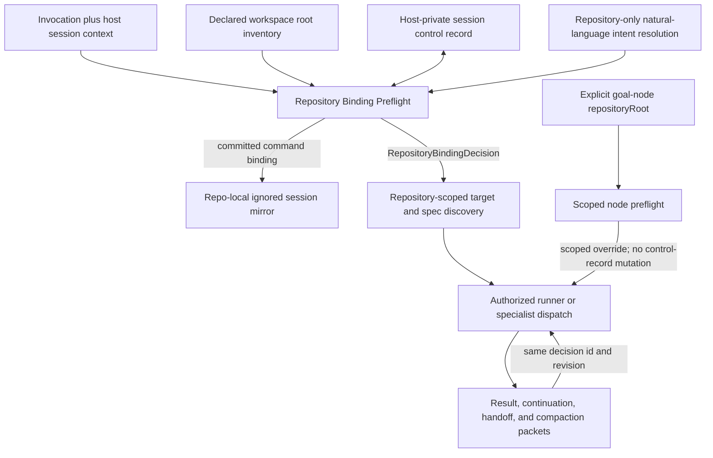

# IMP-103 - Durable Work-Repository Boundary

**Status:** S1-S4 IMPLEMENTATION AND THE S2/S3 CORRECTIVES ARE COMMITTED AT REPLAY SHAS `7405944`, `76b290e`, `f8f1a52`, `8e329a3`, `15c7e2b`, AND `0ce00e8`; S5 MANAGED SOURCE DOCS ARE COMMITTED AT `bc984e6`; S5 REMAINS BLOCKED BY REQUIRED S4H HOST-CONTEXT AND S5A CAPABILITY-AUDIT CORRECTIVES; FULL VALIDATION, GENERATED/INSTALLER/RELEASE CLOSURE, AND PUSH VERIFICATION REMAIN UNCLAIMED - direct repository-owner approval recorded 2026-07-21
**Surface:** framework-health (G125), workflow mode `full-delivery` - approved requirements/design packet plus committed repository-binding foundation, propagation, classification/discovery, front-door, continuation, goal-node, G129 registration, S2/S3 correctives, and S5 managed source docs; host-context activation, capability consumer/provenance enforcement, generated/installer/release closure, and full validation remain incomplete
**Motivation:** before S1-S4, a targetless Bubbles mode in a multi-root workspace could discover work relative to ambient process context even after the session had already resolved and completed work in another repository
**Verified gaps addressed:** SRA1 missing first-class work-repository identity in inputs and envelopes; SRA2 missing durable same-session work-boundary semantics; SRA3 contradictory targetless-mode classification and repository-unscoped auto-discovery; SRA4 unsafe ambient/fallback authority and provenance loss across dispatch, handoff, and compaction
**Implementation status:** S1 is committed at `7405944`, S2 at `76b290e`, S3 at `f8f1a52`, and S4 at `8e329a3`; the expanded S2 corrective is committed at `15c7e2b`, the S3 migrator corrective at `0ce00e8`, and the S5 managed source docs at `bc984e6`. The supplied focused execution and certification facts remain status context only: this packet does not convert them into item-level DoD evidence or check any box. Audit packet `RW-IMP-103-S5-CAP-001` requires a host-context activation corrective before S5 and a capability-ledger enforcement corrective before any generation, installer, release, or push work.
**Validation accounting:** The focused S1-S4 execution, corrective commits, S4 certification, and S5 managed-doc commit are recorded as durable status only. The S4H host-context red/green matrix and independent certification, S5A capability adversaries and portability checks, S5 `--suite=all` aggregate, full `framework-validate`, `release-check`, generated-artifact freshness, final release-manifest reconciliation, release-owner decision, and resulting push have not been verified by this packet and remain unclaimed.

## Packet Identity History

`IMP-103` is the canonical identity. The tracked deletion of `improvements/IMP-022-session-repository-affinity.md` and addition of this file are one canonical rename because `IMP-022` belongs to another delivered capability. The S1 commit at `7405944` was initially mislabeled `IMP-022` in its commit subject; no history rewrite is required, and S1-S4 are interpreted as IMP-103 delivery commits.

## Change Boundary

This packet remains the G085 source-repository authority for business behavior, operator UX, acceptance scenarios, technical design, scope boundaries, corrective prerequisites, and release ordering. S1-S4, the S2/S3 correctives, and S5 managed source docs live at the replay SHAs above. Before any remaining S5 work, only the S4H host-context corrective family named below may change for IMP-103. After S4H is committed and independently certified, S5A may change exactly the capability ledger plus its three named selftests. Only after S5A is independently certified may S5B generation, installer, validation, release, and push work begin. `docs/governance-index.md` is unrelated IMP-020 work and remains outside the IMP-103 boundary.

This invocation changes only this canonical IMP-103 planning packet under `improvements/`. It does not mutate source, tests, docs, generated files, release metadata, downstream repositories, or execution evidence.

The capability resolves which repository a command targets. It does not expand what an agent may modify after resolution. Existing framework-source ownership, downstream installed-file immutability, artifact ownership, release-train ownership, deployment ownership, and command-specific authorization remain fully in force.

## Audit Packet Amendment - RW-IMP-103-S5-CAP-001

This amendment accounts for the complete audit finding set without accepting the current dirty worktree as implementation or evidence.

| Finding | Planning resolution | Blocking consequence |
|---|---|---|
| `S5-AUD-001` | Add S5A with a mechanically derived consumer inventory: `workflowModeGrants.agents`, every phase-owning agent, and the closed explicit shared/runtime consumer set. Require truthful `state: partial`, `releaseIntroduced: unreleased`, and complete evidence provenance. | Capability generation, installer work, release work, and shipped-state claims remain blocked until the exact inventory is independently certified. |
| `S5-AUD-002` | Make `capability-ledger-selftest.sh` enforce the complete `durable-work-repository-boundary` contract and exercise adversarial fixture mutations for capability omission, wrong state, wrong release, each required evidence omission, and each required consumer omission. | A pattern-only or count-only green cannot certify S5A. |
| `S5-AUD-003` | Require Bash 3.2-compatible enumeration with no raw `mapfile`/`readarray`, a final LF in all three changed selftests, direct `bash -n`, ShellCheck, shfmt, and the macOS portability guard. | Any portability, formatting, or final-newline failure blocks S5A. |
| `S5-AUD-004` | Add S4H for the VS Code host-session adapter, expected-revision handoff, control-path identity, packet propagation, focused regressions, and validation wiring. The current dirty overlay is only candidate input; unrelated dirty docs/generated/installer/release changes are not absorbed. | S5 remains blocked until S4H is isolated, committed, and independently certified. |

### Host-Context Necessity Decision

The host-context bridge is required by the existing contract; it is not a new feature expansion. FR-003, FR-004, FR-005, FR-019, and FR-025 plus SCN-005, SCN-016, and SCN-019 require a stable interactive-session identity and an external private control path before repository selection. The committed resolver accepts those values but cannot safely derive them. Deriving either from CWD, prompt source, host `repository` metadata, a process ID, or repository-local state would weaken the feature by reintroducing ambient authority or cross-session inheritance.

The narrowly accepted host contract uses the host-provided per-chat session-log path as identity input only and never reads its contents. Declared workspace folders are canonicalized into an order-independent candidate inventory only. Neither signal selects a repository. Explicit `repositoryRoot`, a concrete target, or a uniquely resolved natural-language repository target still supplies repository intent; the durable boundary or sole-eligible rule remains the only targetless authority. Missing or unresolved host context fails closed.

### Dirty-Overlay Disposition

No current dirty file is accepted because code exists. Before S4H certification, its owner must isolate the S4H paths listed below from all other work. Candidate capability changes remain reserved for S5A. `CHANGELOG.md`, `README.md`, `bubbles/installer/installer.yaml`, `bubbles/scripts/generate-installer.sh`, `bubbles/scripts/generate-installer-selftest.sh`, `bubbles/workflows.yaml`, `docs/CHEATSHEET.md`, `docs/generated/competitive-capabilities.md`, `docs/generated/interop-migration-matrix.md`, `docs/guides/AI_ENVIRONMENT.md`, and all other generated/release surfaces must be restored to `bc984e6` or preserved on a separate salvage branch before S4H begins. `docs/governance-index.md` must likewise be restored or moved to its IMP-020-owned branch. This planning invocation performs none of those moves.

## Evidence Basis

### Operator-Provided Incident Evidence

The repository owner supplied the following incident narrative. It is accepted here as operator-provided evidence; this requirements revision does not claim to have replayed the session or independently counted its file events.

- Chat/session `80331f88-4cab-4248-964c-2837994bb35b` was created with chat CWD `<chat-cwd-repository-root>`.
- Its first request explicitly asked to pick up Smackerel work. Turns 0-16 operated on Smackerel through absolute paths and reported 13 completed Smackerel rounds.
- Turn 17 contained an explicit `mode:` invocation but no repository or spec target.
- Turn 17 initialized QuantitativeFinance spec discovery and produced 45 QuantitativeFinance file events and zero Smackerel file events.
- Host metadata was internally inconsistent: `repository` reportedly named EmailAnalyzer, chat CWD named QuantitativeFinance, and prior successfully resolved work was Smackerel. Generic host repository metadata therefore cannot be work-target authority.

### Pre-Implementation Canonical Source Contradiction

The bullets below record the baseline contradiction that S1-S4 were designed to remove. They are historical problem evidence, not a description of current source behavior.

- `agents/bubbles_shared/workflow-delegation-core.md` classifies input as `STRUCTURED` only when literal `mode:` is present **with concrete spec targets**.
- `agents/bubbles.workflow.agent.md` Phase 0 normally stops when no specs resolve, but explicitly exempts `stochastic-quality-sweep` and `iterate`, allowing them to auto-discover all folders under an unqualified `specs/` path.
- `bubbles/workflows/modes.yaml` declares `stochastic-quality-sweep.constraints.autoDiscoverAllSpecs: true` and describes the default pool as all specs under `specs/`; `iterate` carries the same unqualified auto-discovery posture.
- The workflow prompt's literal hard-gate and Phase 0 language also imply that `mode:` alone can pass into execution. That conflicts with the delegation core's `mode:` plus concrete-target definition.
- `bubbles.super` `RESOLUTION-ENVELOPE`, `bubbles.iterate` `WORK-ENVELOPE`, workflow `CONTINUATION-ENVELOPE`, agent `RESULT-ENVELOPE`, and goal-scenario repo/node contracts do not share one mandatory canonical `repositoryRoot` plus work-boundary provenance contract.
- At that baseline, `bubbles/scripts/state-snapshot.sh` persisted turn/phase/scope/mode/agent information but did not provide the authoritative same-session work-repository binding required by this packet. Repository-root discovery used to locate a state file was not equivalent to selecting the work repository.

## Problem

- **SRA1 - repository identity is absent from the routing contract:** structured input and the resolution, work, result, continuation, specialist-dispatch, and scenario contracts can identify modes or specs without carrying the canonical work repository that gives those paths meaning.
- **SRA2 - successfully resolved work does not establish a durable boundary:** the session cannot distinguish a repository deliberately selected by a successful command from one merely touched by a tool, open editor, prompt source, or process CWD.
- **SRA3 - targetless mode behavior contradicts input classification:** `mode:` alone is not `STRUCTURED` under the delegation core, yet auto-discover modes can proceed without a target and scan an ambient `specs/` directory before any work repository is authoritatively bound.
- **SRA4 - ambient disagreement can become a wrong-repository action:** multi-root declaration order, prompt source root, chat CWD, host `repository` metadata, active editor, tool CWD, recent file access, or filesystem scan order can influence work selection even though none expresses operator intent. Handoff or compaction can also erase prior repository context.

## Outcome Contract

**Intent:** Every Bubbles command resolves an authoritative work repository before repository-local discovery or dispatch. A successful targeted command establishes a durable same-session work boundary; later targetless commands continue inside that boundary. An explicit valid repository switch replaces it. Multi-root targetless work without either authority refuses instead of choosing from ambient context.

**Success Signal:** In the incident topology, a targetless stochastic sweep continues in Smackerel when the same session carries the Smackerel work boundary, regardless of a QuantitativeFinance chat CWD or EmailAnalyzer host metadata. If that durable boundary is absent and those ambient signals disagree, the command refuses and requests `repositoryRoot`; it never starts QuantitativeFinance discovery. Single-root users retain targetless operation, and every dispatch/handoff reports the selected repository and binding provenance.

**Hard Constraints:**

1. `repositoryRoot` (or a semantically equivalent explicit canonical work-repository target) is a first-class structured input. Agent/prompt source root, chat CWD, host `repository` metadata, active editor, terminal CWD, tool CWD, recent files, search results, and incidental tool access are never work-target authority.
2. Every repository-sensitive command completes repository-binding preflight before reading repository-local state, expanding relative spec paths, scanning `specs/`, selecting work, invoking a repository-owned command, or dispatching a specialist.
3. A **durable work boundary** is the authoritative same-session binding. It is established only after a command successfully resolves targeted work to exactly one eligible canonical repository.
4. Targeted work that may establish or switch the boundary includes an explicit valid `repositoryRoot`, a concrete spec/bug/ops path uniquely resolved to a repository, or a natural-language request successfully resolved to targeted work in a repository, such as "pick up next Smackerel work."
5. Incidental reads, searches, editor focus, tool calls, or absolute-path file access do not establish or switch the work boundary unless they are part of a successfully resolved targeted command.
6. Repository authority is exactly: **valid explicit repository/target intent > one valid durable work boundary > sole eligible repository in a true single-repository workspace**. There is no multi-root declaration-order or first-root fallback.
7. An untargeted follow-up with one valid durable work boundary continues in that repository. Ambient disagreement is diagnostic only and cannot override the boundary.
8. In a multi-root workspace, a targetless mode may execute only after preflight resolves either an explicit valid `repositoryRoot` or one valid durable work boundary. Auto-discover modes are not exceptions.
9. If no durable boundary exists and candidate ambient signals disagree, the command refuses and asks for `repositoryRoot`. It must not rank, vote, or choose among prompt source root, recent-work inference, chat CWD, host metadata, editor state, or tool state.
10. If durable work-boundary records for the same session resolve to different canonical repositories, the command refuses. Timestamp, file order, recent activity, CWD, and host metadata cannot break the tie.
11. A valid explicit repository switch replaces the durable work boundary before dispatch. A failed switch leaves the prior valid boundary unchanged. A later phase failure does not silently roll back a successfully resolved switch.
12. `mode:` alone is not `STRUCTURED`. It is observably a targetless-mode request whose repository-binding preflight must succeed before mode-specific target rules are evaluated. The implementation may model this as a separate `TARGETLESS_MODE` class or an equivalent mandatory preflight state, but it must not preserve the current contradiction.
13. Repository binding does not waive mode-specific target requirements. After preflight, a mode that still requires concrete specs may refuse for missing specs; an auto-discover mode may derive its pool only from the resolved repository.
14. `autoDiscoverAllSpecs` is scoped exclusively to `<resolved repositoryRoot>/specs`. It must never execute before repository resolution or resolve `specs/` relative to prompt source, chat CWD, process CWD, tool CWD, or active editor.
15. Repository and work-boundary provenance must survive agent changes, specialist dispatch, result aggregation, continuation, recap, handoff, interruption/resume, and context compaction within the same session.
16. Per-node targets in an explicit cross-repository scenario remain scoped overrides. Each node carries its own canonical repository root and provenance; node scheduling order does not mutate the top-level durable work boundary unless the top-level command explicitly switches it.
17. Selecting a downstream repository does not authorize edits to framework-managed installed files there. Framework changes remain upstream-first in the canonical Bubbles source repository.
18. A distinct new interactive session does not inherit an old boundary solely because repository-local session files remain on disk.

**Failure Condition:** The feature fails if any repository-sensitive action begins before preflight; if `mode:` alone is treated as structured target authority; if auto-discovery scans an ambient `specs/`; if a valid work boundary can be overridden by CWD/editor/host metadata; if a multi-root workspace silently picks its first root; if conflicting boundary records are resolved by recency; if handoff or compaction drops repository provenance; or if repository selection weakens an existing ownership boundary.

## Domain Capability Model

### Capability

**Durable Work-Repository Boundary** binds repository-sensitive work in one interactive Bubbles session to one canonical repository while permitting deliberate switches and explicit per-node overrides for cross-repository scenarios.

### Domain Primitives

| Primitive | Purpose | Lifecycle |
|---|---|---|
| Interactive Session | Boundary within which successfully resolved work can be continued safely | Created -> unbound or bound -> ended |
| Explicit Repository Target | Operator-supplied `repositoryRoot` or equivalent unique canonical work-repository target | Supplied -> resolved or refused |
| Targeted Work Reference | Concrete spec/bug/ops path or natural-language target that resolves to one repository | Proposed -> resolved or refused |
| Canonical Repository Identity | Stable identity for one eligible workspace repository independent of alias and path spelling | Discovered -> eligible; may become stale or ineligible |
| Durable Work Boundary | Authoritative same-session binding plus provenance of the successful targeted resolution that established it | Unbound -> established -> continued or switched; conflict/staleness causes refusal |
| Targetless Mode Request | A mode invocation with no concrete work target | Received -> repository preflight -> mode-specific resolution or refusal |
| Ambient Repository Signal | Prompt source, chat CWD, host metadata, editor/tool/process state, recent access, or scan order | Observed only; never authoritative |
| Scoped Repository Override | Explicit repository target attached to one cross-repository scenario node | Resolved for node -> consumed -> discarded without changing the top-level boundary |
| Repository Resolution Decision | Observable preflight result naming selected canonical root, authority, provenance, and boundary transition | Pending -> resolved or refused |

### Relationships

- An Interactive Session has at most one effective Durable Work Boundary at a time.
- A successful Explicit Repository Target or Targeted Work Reference resolves to exactly one Canonical Repository Identity and establishes, confirms, or switches the boundary.
- A Targetless Mode Request consumes an explicit repository target, the valid boundary, or the sole eligible root in a true single-repository workspace before any mode-specific discovery.
- Ambient Repository Signals may be reported as diagnostics but cannot establish, switch, repair, or override a boundary.
- A Scoped Repository Override selects the repository for exactly one scenario node and has no authority over the top-level boundary.
- Every repository-sensitive command and specialist consumes one Repository Resolution Decision before repository-local side effects.

### Business Policies

- Successful targeted resolution creates authority; incidental access does not.
- Explicit operator intent can deliberately switch a valid inherited boundary.
- One valid durable boundary outranks every ambient disagreement.
- Conflicting durable records are a safety failure, not an inference opportunity.
- Targetless multi-root execution requires prior or explicit binding; only a sole eligible repository is safe to auto-bind.
- Canonical identity deduplicates aliases and path spellings; ambiguous aliases refuse.
- Repository provenance is part of the work packet and cannot be omitted to save context.
- Cross-repository routing is explicit per node and never last-node-wins.

## Actors And Goals

| Actor | Goal | Permission Boundary |
|---|---|---|
| Workspace operator | Select a repository once, continue with short targetless commands, and switch deliberately | Only successfully resolved targeted intent or explicit `repositoryRoot` can establish/switch the boundary |
| Bubbles repository preflight | Resolve one authoritative repository before local discovery or dispatch | Must refuse targetless multi-root ambiguity and conflicting/stale boundary records |
| Natural-language resolver/work picker | Convert requests such as "pick up next Smackerel work" into targeted work | Must return canonical repository root and boundary provenance, not just mode/spec text |
| Workflow runner | Execute one resolved mode and its target pool in the bound repository | Cannot treat `mode:` alone or relative `specs/` as repository authority |
| Cross-repository goal orchestrator | Route explicit scenario nodes to their declared repositories | Node overrides are scoped and cannot mutate the top-level boundary by completion order |
| Specialist agent | Perform owned work in the already resolved repository | Cannot infer a different target from CWD, open files, prompt source, or tool output |
| Recap/handoff/compaction surface | Preserve continuation context across agents and context reduction | Cannot omit canonical repository and boundary provenance from a live continuation |

## Input And Envelope Contract

Exact serialization belongs to design, but the following semantic fields are mandatory wherever repository-sensitive work is described:

- canonical `repositoryRoot` for the selected work repository;
- a safe display alias or repository identifier;
- resolution authority (`explicit-repository-root`, `concrete-target`, `resolved-natural-language`, `durable-work-boundary`, `single-eligible-repository`, or `scoped-scenario-node`);
- boundary transition (`established`, `continued`, `confirmed`, `switched`, `scoped-override`, or `unchanged-on-refusal`);
- provenance sufficient to identify the same-session targeted resolution or boundary record being consumed;
- conflicting ambient signals as optional diagnostics only, never as authority.

These semantics apply to:

1. structured workflow inputs and targetless-mode repository preflight;
2. `RESOLUTION-ENVELOPE` from natural-language resolution;
3. `WORK-ENVELOPE` from work selection;
4. every specialist dispatch payload;
5. every specialist and orchestrator `RESULT-ENVELOPE`;
6. `CONTINUATION-ENVELOPE`, recap, status, and handoff packets;
7. compacted envelope/history records used for same-session resume;
8. goal/sprint scenario repo declarations, node dispatches, and per-repo sub-results;
9. repository-sensitive `FRAMEWORK-ENVELOPE` operations, when an operation acts on a selected repository.

For a cross-repository scenario, each declared repo and each node must resolve to a canonical `repositoryRoot`; a symbolic `primaryRepo`, `supportingRepos`, or node `repo` id without its canonical root is not enough to execute.

## Use Cases

### UC-001 - Establish A Boundary From Targeted Work

- **Actor:** Workspace operator
- **Preconditions:** An explicit `repositoryRoot`, concrete target path, or natural-language request uniquely resolves targeted work to one eligible repository.
- **Main Flow:** Preflight reports the canonical repository and provenance, establishes or confirms the durable work boundary, then dispatches the command.
- **Alternative Flow:** Missing, stale, ineligible, or ambiguous resolution refuses without changing an existing valid boundary.
- **Postconditions:** Later targetless commands can continue in the selected repository.

### UC-002 - Continue A Targetless Follow-Up

- **Actor:** Workflow runner
- **Preconditions:** The current session has one valid durable work boundary.
- **Main Flow:** Preflight selects and reports that boundary before any repository-local discovery; ambient disagreement is reported only as diagnostic context.
- **Alternative Flow:** A stale or conflicting boundary refuses before any candidate repository is touched.
- **Postconditions:** The boundary remains unchanged.

### UC-003 - Run A Targetless Mode In A Multi-Root Workspace

- **Actor:** Workspace operator
- **Preconditions:** The invocation has `mode:` but no concrete spec target.
- **Main Flow:** The request is classified as targetless rather than `STRUCTURED`; preflight requires an explicit valid `repositoryRoot` or one valid durable work boundary, then applies the mode's own target/discovery rules.
- **Alternative Flow:** Without either authority, preflight refuses and asks for `repositoryRoot`; declaration order is not used.
- **Postconditions:** No repository-local action occurs until binding succeeds.

### UC-004 - Preserve Single-Root Compatibility

- **Actor:** Workspace operator
- **Preconditions:** Exactly one eligible canonical repository exists and no boundary has yet been established.
- **Main Flow:** Preflight selects the sole repository, reports `single-eligible-repository` provenance, and establishes the boundary before continuing.
- **Alternative Flow:** Zero eligible repositories refuses.
- **Postconditions:** Existing targetless single-root workflows remain usable without a new required argument.

### UC-005 - Switch Repositories Explicitly

- **Actor:** Workspace operator
- **Preconditions:** The session is bound to repository A and targeted intent uniquely resolves repository B.
- **Main Flow:** Preflight reports the switch, commits B as the durable boundary before dispatch, and carries B through every downstream envelope.
- **Alternative Flow:** Failed B resolution preserves A.
- **Postconditions:** Later targetless commands continue in B.

### UC-006 - Scope Auto-Discovery

- **Actor:** Workflow runner or work picker
- **Preconditions:** Repository preflight has resolved one canonical root and the selected mode permits `autoDiscoverAllSpecs`.
- **Main Flow:** The candidate pool is derived only from `<resolved repositoryRoot>/specs` and every selected item retains repository provenance.
- **Alternative Flow:** Missing or empty repository-local `specs` follows the mode's explicit no-work/refusal contract; the runner never scans another root.
- **Postconditions:** Auto-discovery cannot cross repositories implicitly.

### UC-007 - Execute An Intentional Cross-Repository Scenario

- **Actor:** Goal or sprint orchestrator
- **Preconditions:** Each scenario repository and node carries an explicit canonical repository root.
- **Main Flow:** Nodes receive scoped repository provenance, execute under that repository's policies, and return per-repo results carrying the same root.
- **Alternative Flow:** Missing, ambiguous, or unreachable node root blocks that node rather than inheriting the top-level boundary or CWD.
- **Postconditions:** The pre-scenario top-level boundary remains the default unless the top-level command explicitly switched it.

## Repository Resolution Requirements

- **FR-001 - First-class repository input:** All repository-sensitive structured inputs must accept `repositoryRoot` or a semantically equivalent explicit work-repository target.
- **FR-002 - Preflight ordering:** Repository binding must complete before state lookup, relative path expansion, work discovery, spec enumeration, specialist dispatch, or repository-owned commands.
- **FR-003 - Durable establishment:** A successful targeted command must durably record canonical repository identity and establishment provenance for the current session.
- **FR-004 - Natural-language establishment:** A successfully resolved request such as "pick up next Smackerel work" must establish the same boundary as a concrete path or explicit root.
- **FR-005 - Incidental-access exclusion:** Reads, searches, tools, editors, prompt location, and CWD changes must never establish or switch the boundary by themselves.
- **FR-006 - Untargeted continuation:** One valid durable boundary must control targetless follow-ups regardless of ambient disagreement.
- **FR-007 - Targetless-mode classification:** `mode:` without concrete targets must not be classified as `STRUCTURED`; it must enter mandatory repository-binding preflight.
- **FR-008 - Mode-specific targets preserved:** Successful repository binding must not invent concrete specs for modes that require them.
- **FR-009 - Multi-root refusal:** A targetless multi-root command with neither explicit `repositoryRoot` nor a valid boundary must refuse and request `repositoryRoot`.
- **FR-010 - Single-root compatibility:** A targetless command may auto-bind only when exactly one eligible canonical repository exists.
- **FR-011 - No workspace-first fallback:** Stable declaration order, alphabetical order, filesystem order, recent activity, and CWD are forbidden tie-breakers among multiple eligible repositories.
- **FR-012 - Scoped auto-discovery:** `autoDiscoverAllSpecs` must enumerate only `<resolved repositoryRoot>/specs` after preflight.
- **FR-013 - Boundary conflict refusal:** Distinct canonical roots in same-session durable records must refuse without recency-based reconciliation.
- **FR-014 - Stale boundary refusal:** A missing, removed, ineligible, or non-canonicalizable bound repository must refuse without falling back.
- **FR-015 - Canonical identity:** Alias and path spellings that resolve to one canonical root are one repository; alias collisions across roots refuse.
- **FR-016 - Switch atomicity:** Failed targeted resolution leaves the prior boundary unchanged; successful resolution switches before dispatch and remains switched after later phase failure.
- **FR-017 - Dispatch provenance:** Every specialist dispatch must include canonical repository root, resolution authority, boundary transition, and boundary provenance.
- **FR-018 - Result provenance:** Every specialist/orchestrator result and per-repo scenario sub-result must echo the repository and boundary provenance it consumed.
- **FR-019 - Continuation durability:** Continuation, recap, status, handoff, interruption/resume, and compaction records must preserve repository and boundary provenance without relying on chat memory.
- **FR-020 - Work-selection provenance:** `RESOLUTION-ENVELOPE` and `WORK-ENVELOPE` must bind any relative target to their canonical repository root before consumers act.
- **FR-021 - Scenario provenance:** Scenario repo declarations and node dispatches must carry canonical roots; symbolic repo ids alone cannot authorize execution.
- **FR-022 - Scoped node semantics:** Scenario-node repository overrides cannot mutate the top-level boundary unless a separate top-level explicit switch succeeds.
- **FR-023 - Visible resolution:** Before work begins, operators must see selected repository, resolution authority, boundary transition, and any non-authoritative conflicting diagnostics.
- **FR-024 - Fail-loud envelope:** Refusal must report stable reason, observed authoritative state, safe candidate details when applicable, required `repositoryRoot` remediation, `boundary unchanged`, non-success outcome, and zero repository-local side effects.
- **FR-025 - Session isolation:** A new session cannot inherit an old work boundary solely from leftover repository-local files.
- **FR-026 - Ownership preservation:** Repository resolution must compose with all existing artifact, framework, deployment, release, and command authorization boundaries.

## Operator Workflow UX

This is a non-visual control-plane workflow. Its UX is the ordered, readable, and machine-stable preflight output shown before repository-local discovery or dispatch. The operator must be able to answer four questions from the first status block: **which repository**, **why it is authoritative**, **what happened to session affinity**, and **what may run next**.

The workflow never presents prompt source, chat/process/terminal/tool CWD, host `repository` metadata, active editor, recent files, search results, workspace order, or scan order as selection authority. Those signals may appear only under diagnostics with an explicit `diagnostic-only` label. Status text such as `selected from CWD`, `prompt repository selected`, `active editor selected`, `host repository selected`, or `recent repository selected` is forbidden.

### Operator Output Primitives

These primitives are shared by workflow bootstrap, work selection, specialist dispatch, continuation, handoff, compaction/resume, and cross-repository goal nodes. Downstream surfaces compose them rather than inventing command-specific repository wording.

| Primitive | Purpose | Composition rule |
|---|---|---|
| Preflight summary | One concise line names result, repository alias, local canonical root when safe, source, and affinity transition | Always appears before repository-local work; successful selection uses only the source vocabulary below |
| Discovery scope | Names the exact repository-local pool an auto-discover mode may inspect | Appears only after successful preflight and must name `<resolved repositoryRoot>/specs` |
| Diagnostic signals | Explains ambient disagreement without granting it authority | Every item is labeled `diagnostic-only`; diagnostics never determine ordering or selection |
| Affinity transition | Distinguishes `established`, `continued`, `confirmed`, `switched`, `scoped-override`, and `unchanged` | Echoed by dispatch/result/continuation surfaces; a scoped override never rewrites top-level affinity |
| Refusal summary | Gives the stable reason code and safety outcome in one line | Followed by the structured refusal envelope; always says `affinity unchanged` and `zero repo-local side effects` |
| Remediation block | Shows the smallest operator input that can resolve a refusal | Uses `repositoryRoot: <canonical-repository-root>`; never recommends changing CWD, editor focus, prompt location, or workspace order |

### Stable Source Vocabulary

Every successful preflight status uses exactly one of these operator-facing `source` values:

| Source | Visible meaning |
|---|---|
| `explicit-repositoryRoot` | The operator supplied a valid canonical `repositoryRoot` for this top-level command |
| `concrete-target` | A concrete spec/bug/ops target, or a natural-language work request after it uniquely resolved to concrete targeted work, selected this repository |
| `session-work-boundary` | One valid durable boundary from successful targeted work earlier in this same interactive session selected the repository |
| `sole-eligible-repo` | Exactly one eligible canonical repository exists, so the single-repository compatibility path established the boundary |
| `goal-node` | An explicit canonical repository root on one cross-repository goal/scenario node selected that node's scoped repository |

The richer semantic provenance required by the Input And Envelope Contract remains available to downstream automation. This display vocabulary is a stable operator projection: for example, a uniquely resolved natural-language target is shown as `source=concrete-target` with optional `targetKind=natural-language`, never as ambient recent-work inference.

### Concise Preflight Output

The first line is deliberately compact and field-stable. Local interactive output may show the full canonical path in `root`; examples use placeholders so this public packet does not duplicate operator-local paths.

| Situation | Required first visible line | Required follow-through |
|---|---|---|
| Boundary established from targeted work | `REPOSITORY PREFLIGHT BOUND repository=<alias> root=<canonical-root> source=concrete-target affinity=established` | Dispatch may begin only after this line |
| Boundary established from explicit root | `REPOSITORY PREFLIGHT BOUND repository=<alias> root=<canonical-root> source=explicit-repositoryRoot affinity=established` | Dispatch may begin only after this line |
| Boundary continued for an untargeted command | `REPOSITORY PREFLIGHT BOUND repository=<alias> root=<canonical-root> source=session-work-boundary affinity=continued` | Ambient disagreements may follow as diagnostics; they cannot override the result |
| Explicit switch to another repository | `REPOSITORY PREFLIGHT SWITCHED repository=<new-alias> root=<new-root> previous=<old-alias> source=explicit-repositoryRoot affinity=switched` | The new affinity is effective before dispatch and survives a later phase failure |
| Explicit same-root confirmation | `REPOSITORY PREFLIGHT CONFIRMED repository=<alias> root=<canonical-root> source=explicit-repositoryRoot affinity=confirmed` | No false switch wording and no duplicate boundary establishment |
| Concrete-target same-root confirmation | `REPOSITORY PREFLIGHT CONFIRMED repository=<alias> root=<canonical-root> source=concrete-target affinity=confirmed` | The status preserves the authority that actually confirmed the root |
| Sole-repository compatibility fallback | `REPOSITORY PREFLIGHT BOUND repository=<alias> root=<canonical-root> source=sole-eligible-repo affinity=established compatibility=single-repository` | Valid only when exactly one eligible canonical repository exists |
| Scoped cross-repository node override | `REPOSITORY PREFLIGHT SCOPED repository=<node-alias> root=<node-root> source=goal-node transition=scoped-override affinity=unchanged scope=<node-id>` | A second line states `top-level affinity unchanged`; node completion order cannot change it |
| Refusal | `REPOSITORY PREFLIGHT REFUSED reason=<REASON_CODE> affinity=unchanged repoLocalSideEffects=zero` | The structured refusal envelope follows; no discovery, state lookup, relative expansion, dispatch, or repository-owned command has begun |

When an auto-discover mode proceeds, the next repository-sensitive line is:

```text
DISCOVERY SCOPE mode=<mode> root=<resolved repositoryRoot>/specs
```

It must not say only `root=specs/`, and it must not appear before a successful preflight line.

### Targetless-Mode Journey And Classification

An invocation containing `mode:` with no concrete repository/spec/bug/ops target is **not `STRUCTURED`**. It enters the observable `TARGETLESS_MODE` journey (or an implementation-equivalent state with identical ordering):

1. Classify the input as targetless before Phase 0 repository-local resolution.
2. Run repository-binding preflight without reading repository-local state, expanding relative targets, scanning `specs/`, selecting work, invoking a repository command, or dispatching a specialist.
3. Resolve authority in order: valid explicit `repositoryRoot`; otherwise one valid `session-work-boundary`; otherwise `sole-eligible-repo` only when exactly one eligible canonical repository exists.
4. Emit the successful preflight summary, including source and affinity transition.
5. Apply the selected mode's own target rules. Repository binding does not invent a concrete target for modes that require one.
6. If `autoDiscoverAllSpecs` is permitted, emit `DISCOVERY SCOPE mode=<mode> root=<resolved repositoryRoot>/specs`, then and only then enumerate that directory.
7. If no valid authority exists, emit the refusal summary and envelope. Do not inspect any candidate repository to decide which one the operator probably meant.

### Interaction State Table

| Input state | Trusted boundary state | Eligible repository state | Preflight result | Visible source | Affinity after preflight | Repository-local next action |
|---|---|---|---|---|---|---|
| Targeted work uniquely resolves to A; no prior boundary | Absent | A eligible | `BOUND` | `concrete-target` | Established at A | Target-specific mode processing may begin in A |
| Targetless `mode:`; one valid A boundary | Valid A | Any ambient disagreement | `BOUND` | `session-work-boundary` | Continued at A | Mode target rules, then A-scoped discovery if allowed |
| Targetless `mode:`; no boundary | Absent | Exactly one eligible A | `BOUND` | `sole-eligible-repo` | Established at A | Mode target rules, then A-scoped discovery if allowed |
| Targetless `mode:`; no boundary | Absent | Multiple eligible roots | `REFUSED` | None; no selection occurred | Unchanged (unbound) | None |
| Any repository-sensitive command | Conflicting, stale, or malformed | Any | `REFUSED` | None; no selection occurred | Unchanged | None |
| Explicit A while already bound to A | Valid A | A eligible | `CONFIRMED` | `explicit-repositoryRoot` | Confirmed at A | Requested work may begin in A |
| Explicit B while bound to A | Valid A | B uniquely eligible | `SWITCHED` | `explicit-repositoryRoot` | Switched to B | Requested work may begin in B |
| Explicit B while bound to A | Valid A | B unresolved/ineligible | `REFUSED` | None; no selection occurred | Unchanged at A | None |
| Goal node explicitly names B while top-level boundary is A | Valid A | Node B uniquely eligible | `SCOPED` | `goal-node` | Top-level unchanged at A | This node only may begin in B |

### Incident Flow: Session `80331f88-4cab-4248-964c-2837994bb35b`

```text
┌──────────────────────────────────────────────────────────────────────┐
│ 1. Receive mode: stochastic-quality-sweep with no repo/spec target   │
└──────────────────────────────────────────────────────────────────────┘
▼ classify
┌──────────────────────────────────────────────────────────────────────┐
│ 2. Classify TARGETLESS_MODE (not STRUCTURED)                         │
│    Repository-local discovery remains prohibited                    │
└──────────────────────────────────────────────────────────────────────┘
▼ run repository preflight
┌──────────────────────────────────────────────────────────────────────┐
│ 3. Branch on trusted boundary state                                 │
├─ VALID same-session Smackerel work boundary                         │
│  PREFLIGHT BOUND source=session-work-boundary affinity=continued    │
│  Diagnostics only: chat CWD=QF; host metadata=EmailAnalyzer         │
│  DISCOVERY SCOPE root=<smackerel-root>/specs                        │
│  No QuantitativeFinance discovery or file work begins               │
├─ NO valid boundary and multiple eligible repositories               │
│  PREFLIGHT REFUSED reason=TARGETLESS_MULTI_ROOT_UNBOUND             │
│  affinity unchanged; zero repo-local side effects                   │
└──────────────────────────────────────────────────────────────────────┘
```

The two branches are mutually exclusive. The diagnostic QF/EmailAnalyzer signals are displayed only to explain why they were ignored; they never become candidates for a selection algorithm.

### Safe Explicit-Switch Flow

```text
┌──────────────────────────────────────────────────────────────────────┐
│ 1. Current affinity=A; request supplies repositoryRoot=<B-root>      │
└──────────────────────────────────────────────────────────────────────┘
▼ validate the explicit target without repository-local side effects
┌──────────────────────────────────────────────────────────────────────┐
│ 2. Branch on explicit B resolution                                  │
├─ B resolves uniquely and is eligible                                │
│  PREFLIGHT SWITCHED repository=B previous=A                         │
│  source=explicit-repositoryRoot affinity=switched                   │
│  B is durable before dispatch; a later phase failure does not       │
│  revert affinity to A                                                │
├─ B is missing, ineligible, or ambiguous                             │
│  PREFLIGHT REFUSED affinity unchanged at A                          │
│  zero repo-local side effects; remediation uses repositoryRoot      │
└──────────────────────────────────────────────────────────────────────┘
```

### Structured Refusal Envelope

Every repository-binding refusal emits the same semantic fields in the same order. This is the UX contract, not a choice of JSON, YAML, shell, database, or transport representation.

```text
REPOSITORY-REFUSAL
outcome: refused
reasonCode: <STABLE_REASON_CODE>
observedSignals[].kind: <signal-kind>
observedSignals[].repository: <safe-alias-or-local-canonical-root>
observedSignals[].authority: diagnostic-only | explicit-invalid | boundary-record
trustedBoundaryState.status: absent | valid | stale | conflicting | malformed
trustedBoundaryState.repository: <safe-alias-or-local-canonical-root-or-none>
requiredInput.field: repositoryRoot
requiredInput.requirement: one eligible canonical repository root
remediation.input.repositoryRoot: <canonical-repository-root>
affinity: unchanged
repoLocalSideEffects: zero
```

Field semantics are stable:

- `reasonCode` is a closed, automation-safe identifier; explanatory prose may change without changing the code.
- `observedSignals` accounts for relevant explicit, boundary, and ambient observations. Ambient entries are always `diagnostic-only`; omission is preferable to exposing an unsafe path in a public projection.
- `trustedBoundaryState` reports what authoritative same-session state existed before the attempt. For a failed switch from A to B, it reports valid A and `affinity: unchanged`.
- `requiredInput` names `repositoryRoot`; no refusal asks the operator to `cd`, focus an editor, reopen a prompt, reorder roots, or rely on recent work.
- `remediation` provides a directly reusable `repositoryRoot: <canonical-repository-root>` input shape. It may include the original mode/target for context but cannot mutate or execute it.
- `affinity: unchanged` means the refused attempt neither established nor switched the durable boundary. If the prior state was unbound, it remains unbound.
- `repoLocalSideEffects: zero` means no repository-local state lookup, relative target expansion, `specs/` scan, work selection, specialist dispatch, repository-owned command, or repository mutation occurred.

The stable reason codes are:

| Reason code | Meaning | Required remediation emphasis |
|---|---|---|
| `EXPLICIT_REPOSITORY_ROOT_NOT_FOUND` | Supplied root cannot be resolved | Supply an existing canonical `repositoryRoot` |
| `EXPLICIT_REPOSITORY_ROOT_INELIGIBLE` | Supplied root exists but is not eligible for the command | Supply an eligible canonical `repositoryRoot` |
| `TARGET_ALIAS_AMBIGUOUS` | A supplied alias or targeted reference maps to more than one canonical root | Supply canonical `repositoryRoot` instead of the alias |
| `TARGETLESS_MULTI_ROOT_UNBOUND` | Targetless request has no valid boundary and more than one eligible repository exists | Add `repositoryRoot` to the invocation |
| `BOUNDARY_STALE` | The bound canonical repository is missing or no longer eligible | Supply `repositoryRoot` to repair/replace affinity explicitly |
| `BOUNDARY_CONFLICT` | Same-session durable records identify distinct canonical roots | Supply `repositoryRoot` as explicit repair intent; do not select by recency |
| `BOUNDARY_MALFORMED` | Durable boundary state lacks required identity/provenance | Supply `repositoryRoot`; preserve malformed-state diagnostics for repair |
| `NO_ELIGIBLE_REPOSITORY` | No workspace repository can accept the requested command | Supply an eligible workspace/repository, then provide its `repositoryRoot` |
| `GOAL_NODE_REPOSITORY_UNRESOLVED` | A cross-repository node lacks one unique eligible canonical root | Add/fix that node's canonical `repositoryRoot`; top-level affinity remains unchanged |

### Terminal Readability, Accessibility, And Path Visibility

- Output uses plain text and stable labels; color, icon, box drawing, cursor position, or terminal hyperlinks are never the only carrier of state.
- The concise summary remains one logical line. Expanded diagnostics and refusal fields use one field per line and preserve field order for screen readers, narrow terminals, logs, and automation.
- Long local canonical paths may wrap but are never silently truncated in local operator output. The alias appears before the path so the decision remains scannable on narrow terminals.
- Local interactive control-plane output and local session diagnostics may show canonical paths because they help the operator disambiguate roots.
- Public/generated release artifacts, examples, telemetry intended for external aggregation, and downstream documentation must not receive operator-local canonical paths merely because affinity exists. Their projection uses a safe alias/repository identifier or an explicit redaction marker when the path has no product purpose.
- Handoff and compaction preserve canonical repository identity for authorized same-session consumers, but presentation layers apply the same local-versus-public visibility rule.

### Design Handoff Boundaries

No UX question remains unresolved: the operator-visible states, source vocabulary, ordering, refusal meanings, path-visibility posture, and remediation shape above are authoritative. The technical design below resolves the following implementation decisions without changing that UX contract:

- canonical repository identity and eligibility resolution across Linux/WSL and macOS;
- durable same-session state location, versioning, conflict detection, recovery, and distinct-session isolation;
- exact serialization/version migration for preflight, refusal, result, continuation, compaction, and goal-node envelopes;
- enforcement that keeps local canonical paths out of public/generated projections while preserving them for authorized local continuation.

The selected storage, resolver, reconciliation, and enforcement architecture is part of this packet's active technical truth. Scope decomposition and implementation ordering remain owned by `bubbles.plan`.

## Technical Design

The following sections are the active implementation architecture for the approved requirements and Operator Workflow UX above. They replace no requirement or UX state; they define the single mechanism that must realize them.

## Design Brief

### Pre-Implementation Current State (Historical Baseline)

Before S1-S4, repository-sensitive routing was distributed across prompt prose. `workflow-delegation-core.md` required `mode:` plus concrete targets for `STRUCTURED`, while `bubbles.workflow.agent.md` admitted `mode:` alone and let `stochastic-quality-sweep` and `iterate` discover an unqualified `specs/` pool. `bubbles.super`, `bubbles.iterate`, state snapshots, compaction, and goal scenarios each carried only part of the context required to keep work in one repository.

At that baseline, `.specify/memory/bubbles.session.json` was repository-local and found only after `BUBBLES_REPO_ROOT` or `$PWD` selected a repository. It could remain a useful ignored runtime mirror, but it could not answer which repository should be opened first in a multi-root session.

### Target State

One shared Repository Binding Preflight resolves and commits a canonical work repository before any repository-local state read, relative target expansion, `specs/` discovery, work selection, repository command, or specialist dispatch. Every front door consumes the resulting binding decision; no agent reimplements repository inference.

The authoritative durable record lives in host-private, session-scoped control-plane storage outside every candidate repository. Invocation and envelope fields carry the committed decision through one execution chain, while the selected repository's ignored session file receives a post-selection mirror for existing snapshot, cap, compaction, and trajectory consumers.

### Patterns To Follow

- `agents/bubbles_shared/workflow-delegation-core.md`: one owner per routing concern; the new preflight becomes the sole repository-selection owner.
- `bubbles/agent-capabilities.yaml::workflowModeGrants`: derive the direct-runner consumer inventory instead of maintaining a second handwritten runner list.
- `bubbles/scripts/state-snapshot.sh`: additive state evolution and same-directory atomic replacement, but only after repository binding.
- `agents/bubbles_shared/scenario-compile.md`: explicit per-repository execution and per-repo certification; extend each repo and node with canonical binding data.
- `bubbles/scripts/*-selftest.sh` plus `framework-validate.sh`: hermetic behavior checks and a live source-conformance check.

### Patterns To Avoid

- The pre-implementation `bubbles.workflow.agent.md` `mode:`-only hard gate and unqualified `specs/` exception; it contradicted the shared classifier and permitted preflight bypass.
- The pre-implementation `bubbles.super.agent.md` and `bubbles.iterate.agent.md` practice of receiving or scanning an all-repository `specs/` listing before repository selection.
- The pre-implementation `state-snapshot.sh` and `cli.sh` fallback from missing explicit root/session identity to repository-local state or process identity; those were downstream state consumers, not work-target authorities.
- Prompt-only repository inference duplicated across agents; prose cannot provide atomic transitions, conflict detection, or a mechanically guarded discovery boundary.

### Resolved Decisions

- Use one shared shell reference implementation plus one shared prompt contract; every front door calls it and consumes its decision.
- Make a host-supplied session control record the durable authority; do not derive its identity or location from a repository.
- Carry `repositoryRoot` and binding provenance in all actionable local packets; redact the root in committed or public projections.
- Treat invocation-carried bindings as chain-of-dispatch authority only when they exactly match the current session control record.
- Keep `.specify/memory/bubbles.session.json` as an ignored post-selection mirror, never as a preflight source.
- Canonicalize with physical directory traversal and Git top-level resolution; do not use GNU-only `readlink -f`, case folding, or workspace order.
- Make repository-scoped discovery consume a successful binding decision so `autoDiscoverAllSpecs` cannot operate independently.
- Keep `goal-node` bindings scoped to the node and prohibit them from mutating command-level affinity.

### Open Questions

None. The requirements and operator UX determine the remaining technical choices.

## Pre-Implementation Current Truth

This table records the source baseline used to design S1-S4. It is retained for traceability and does not override the implemented-state summary at the top of this packet.

| Surface | Current source truth | Design consequence |
|---|---|---|
| Input classification | `agents/bubbles_shared/workflow-delegation-core.md` defines `STRUCTURED` as literal `mode:` plus concrete spec targets. | Preserve that definition and add an explicit `TARGETLESS_MODE` class for `mode:` without targets. |
| Workflow bootstrap | `agents/bubbles.workflow.agent.md` says `mode:` alone passes its first hard gate, prefers `STRUCTURED` on ambiguity, resolves targets under `specs/`, and exempts sweep/iterate from the no-target stop. | Move repository preflight ahead of Phase 0 and delete the contradictory fallback/exception wording from the active classifier. |
| Mode registry | `bubbles/workflows/modes.yaml` sets `autoDiscoverAllSpecs: true` for `stochastic-quality-sweep` and `iterate` and describes the pool as `specs/`. | Retain the boolean capability but require a committed binding and define its only legal root as `repositoryRoot/specs`. |
| Natural-language resolution | `agents/bubbles.super.agent.md` currently scans `specs/` while producing `RESOLUTION-ENVELOPE`; scenario fields use symbolic `primaryRepo`/`supportingRepos`. | Split repository-intent resolution from repository-local work resolution and require canonical roots before any spec scan. |
| Work selection | `agents/bubbles.iterate.agent.md` can receive `Available specs: {specs/ listing}` and its `WORK-ENVELOPE` omits repository identity. | The picker receives one bound repository and returns the same binding in its work packet. |
| Session state | `bubbles/scripts/state-snapshot.sh` finds `.specify/memory/bubbles.session.json` from `BUBBLES_REPO_ROOT` or by walking upward from `$PWD`; no session-state schema owns repository affinity. | State snapshots become downstream consumers of an already committed binding; an external session record is required for initial selection. |
| Session identity | `bubbles/scripts/cli.sh::derive_session_id` accepts `BUBBLES_SESSION_ID`, then reads the selected repo's session file, then falls back to `shell-$$`. | Repository binding requires an opaque host/session identifier before repo selection; repo-local and PID fallbacks cannot establish affinity. |
| Compaction | `bubbles/scripts/context-compactor.sh` preserves routing/evidence fields but not repository root, decision revision, or binding provenance. | Binding fields become non-droppable compaction fields. |
| Result contract | `bubbles/schemas/result-envelope.schema.json` permits extra fields but defines no repository contract or conditional requirement for repository-sensitive results. | Add schema-defined binding fields and validate them for actionable repository-sensitive packets. |
| Goal scenarios | `agents/bubbles_shared/scenario-compile.md` requires each node to name a symbolic repo from `repos[]`, but neither level carries a canonical root. | Add canonical roots to repo declarations and binding decisions to node dispatch/results; symbolic IDs remain display/routing aliases only. |
| Runner inventory | `bubbles/agent-capabilities.yaml::workflowModeGrants.agents` is the canonical direct-authorized-runner set. | Generate or validate preflight consumers from this registry instead of maintaining a separate runner list. |
| Local privacy | `.specify/memory/.gitignore` already excludes `bubbles.session.json`. | A full local mirror may include canonical root data, while committed/public projections must redact it. |

## Architecture Overview

The smallest robust architecture is one capability with a single decision point, not a repository heuristic in every agent. The reference implementation is a source/downstream-portable shell entry point named `repository-binding.sh`; the prompt contract explains when to call it and how to consume its output. A conformance guard verifies that every repository-sensitive front door uses the capability before discovery or dispatch.



Only preflight may select a command-level repository. Target resolution, mode processing, work selection, workflow phase execution, and specialist ownership checks remain separate consumers. This keeps repository identity orthogonal to workflow semantics and avoids turning preflight into another orchestrator.

## Capability Foundation

### Foundation Contract

| Contract | Responsibility | Consumers |
|---|---|---|
| `SessionContext` | Supplies an opaque host/session ID and a host-private control-record location before repository selection. | Every top-level Bubbles front door. |
| `EligibleRepositorySet` | Canonicalizes and deduplicates declared workspace roots without selecting one by order. | Preflight, single-root compatibility, alias validation. |
| `RepositoryIntent` | Represents explicit root, exact target, repository-only natural-language resolution, inherited binding, or scoped node root without reading repo-local work state. | Workflow classifier, `bubbles.super`, goal/sprint scenario compiler. |
| `RepositoryBindingControl` | Stores the one committed command-level boundary for one host session using revisioned atomic replacement. | Preflight only; agents never edit it directly. |
| `RepositoryBindingDecision` | Immutable result naming canonical root, alias, authority, transition, session, revision, decision ID, scope, and target kind. | Discovery helpers, dispatchers, envelopes, local mirrors. |
| `RepositoryScopedDiscovery` | Enumerates or resolves targets only beneath the decision's root and refuses absent/stale decisions. | Workflow Phase 0, stochastic sweep, iterate, status/recap, work picker. |
| `RepositoryBindingProjection` | Emits either an actionable local packet with the canonical root or a non-actionable redacted public projection. | Result/continuation/handoff/compaction/docs surfaces. |

### Extension Points

- **Host session adapter:** provides `sessionId`, `sessionControlFile`, and declared workspace roots. VS Code, another IDE, and a terminal wrapper can supply these differently; core selection semantics do not vary.
- **Repository eligibility predicate:** recognizes the canonical Bubbles source checkout or a valid installed downstream checkout using framework markers only. Command-specific authorization still runs after selection.
- **Repository-intent resolver:** `bubbles.super` may resolve a named repository from the bounded candidate descriptor list, but it cannot inspect any candidate's `specs/` or state until preflight commits the root.
- **Projection policy:** local runtime packets retain the root; committed/public/generated surfaces use the redacted projection and are non-actionable.

### Foundation-Owned Behavior

- Authority order is explicit valid repository/target intent, then one valid same-session boundary, then one sole eligible canonical repository.
- Ambient host metadata is accepted only as diagnostic data and never enters the candidate-ranking function.
- Exactly one command-level boundary may be committed per session revision.
- Every actionable child packet must match the current session ID, canonical root, decision ID, and control revision.
- All repository-local reads and dispatch APIs require a successful decision object.
- Ownership, risk, phase, release, and deployment gates run after binding and are never weakened by it.

## Concrete Implementations

### Shared Preflight Reference Implementation

`bubbles/scripts/repository-binding.sh` is the single executable owner with four subcommands:

| Subcommand | Behavior |
|---|---|
| `preflight` | Canonicalize candidates, reconcile current-session authority, resolve one root, atomically establish/confirm/switch the command boundary, and emit the UX line plus decision JSON. |
| `validate-packet` | Require exact session/root/decision/revision equality before a child consumes an invocation-carried binding. |
| `discover-specs` | Require a valid decision, emit `DISCOVERY SCOPE`, and enumerate only `<repositoryRoot>/specs`. |
| `mirror-session` | After selection, additively mirror the decision into the selected repo's ignored `.specify/memory/bubbles.session.json`. |

The script does not infer workflow modes, choose work, read `state.json`, inspect spec contents, or dispatch agents. Source and installed layouts resolve the script location the same way existing framework scripts distinguish `bubbles/scripts/` from `.github/bubbles/scripts/`; that implementation location has no authority over the work root.

### Shared Prompt Contract

`agents/bubbles_shared/repository-binding-preflight.md` becomes the sole prose contract. `agent-common.md`, `workflow-delegation-core.md`, and the repository-sensitive front doors link to it rather than restating authority order or candidate heuristics. Specialists receive a binding packet and validate it; they never select another repository from their own prompt source or tool context.

### Host-Private Session Control Adapter

The top-level host adapter supplies two required values before repository-sensitive work:

- `sessionId`: an opaque identifier unique to the interactive host session;
- `sessionControlFile`: a private writable path outside every eligible repository.

The framework does not derive either value from host `repository` metadata, chat CWD, process ID, prompt location, or a repo-local file. The control file's parent is created with private permissions, the writer uses `umask 077`, and the path itself is not copied into envelopes. A host that cannot supply stable session context may still show help or framework-global information, but repository-sensitive work fails loud before dispatch.

### Invocation And Envelope Adapter

Structured input accepts first-class `repositoryRoot`. After preflight, every repository-sensitive `RESOLUTION-ENVELOPE`, `WORK-ENVELOPE`, specialist dispatch, `RESULT-ENVELOPE`, `CONTINUATION-ENVELOPE`, `FRAMEWORK-ENVELOPE`, recap, status, handoff, and compacted record carries the same repository fields defined below. This is propagation of one decision, not a new inference opportunity.

### Repository-Local Mirror Adapter

After command-level preflight commits, `mirror-session` writes `repositoryBindingMirror` into the selected repository's ignored `.specify/memory/bubbles.session.json`. `state-snapshot.sh`, context compaction, convergence/session caps, trajectory inspection, and runtime leases consume that mirror only after their caller supplies the selected root.

The mirror is not authority. A missing or older same-root mirror is repaired from the control record. A mirror from another session is ignored and replaced for the current session. A same-session mirror naming another canonical root is reported as drift and cannot override the control record; actionable child packets still must reconcile against the control record.

### Cross-Repository Goal-Node Adapter

Each `repos[]` entry in a compiled goal scenario adds canonical `repositoryRoot`; each node dispatch receives a `scopeKind: goal-node` decision whose `scopeId` is the node ID and whose authority is `scoped-scenario-node`. The node decision validates eligibility and packet provenance but does not write the command-level control record or the top-level repository mirror. Node results echo the scoped decision, and scheduler completion order has no affinity effect.

### Mechanical Conformance Adapter

The repository-binding conformance guard and hermetic selftest are implemented. G129 registration is committed with S3 at `f8f1a52`, and the S4 consumer activation is committed at `8e329a3`. S5 must still reconcile and verify the generated top-level gate block and `framework-validate.sh` wiring, then execute full validation; their presence in an unverified worktree is not release evidence. The guard derives direct runners from `workflowModeGrants`, adds the explicit repo-scanning utility inventory, and verifies:

- each consumer references the shared preflight contract;
- no consumer performs repository-local discovery before the preflight anchor;
- targetless classification is present and `mode:` alone is not described as `STRUCTURED`;
- `autoDiscoverAllSpecs` modes declare repository-preflight-required semantics and use `resolvedRepositoryRoot/specs`;
- resolution, work, dispatch, result, continuation, compaction, and scenario contracts preserve binding fields;
- no public/generated projection is actionable with a local canonical path.

The guard has a hermetic selftest with one passing fixture and adversarial prompt/registry fixtures for each prohibited bypass. This is required because prompt-only enforcement cannot prove ordering.

### Variation Axes

| Axis | Variants | Foundation invariant |
|---|---|---|
| Host integration | VS Code session storage, another IDE session store, explicit terminal wrapper | Supplies opaque session identity and an external private control file; no repo-derived fallback. |
| Resolution authority | Explicit root, concrete target, resolved natural language, durable boundary, sole eligible repo, goal node | Closed authority vocabulary and deterministic precedence. |
| Binding scope | Command-level durable boundary, child dispatch propagation, goal-node scoped override | Only command-level successful targeted resolution mutates affinity. |
| Repository form | Source checkout, installed downstream checkout, Git worktree, symlink alias | Physical Git top-level is identity; worktrees stay distinct and symlink aliases deduplicate. |
| Packet projection | Local actionable, local diagnostic, public/committed redacted | Canonical path is available only to authorized local consumers. |
| Operation | Targeted work, targetless mode, continuation, auto-discovery, cross-repo scenario | Every repository-sensitive path consumes preflight before local state or dispatch. |

## Repository Identity And Eligible-Root Resolution

### Canonical Identity

The canonical repository identity is the physical Git worktree top-level path in the active execution environment. It is session-local and intentionally not a cross-machine project identifier.

Resolution is portable across Linux, WSL, and macOS:

1. Require an existing explicit candidate directory or an existing target whose parent can be examined.
2. Enter the directory with `cd -P -- <dir>` and obtain its physical path with `pwd -P`; do not use `readlink -f` or `realpath`.
3. Run `git -C <physical-dir> rev-parse --show-toplevel` and physicalize that returned directory with the same `cd -P`/`pwd -P` sequence.
4. Verify target containment by walking parent directories to equality with the canonical root, not by unsafe string-prefix comparison.
5. Preserve path case and bytes as returned by the host filesystem. Do not lowercase, rewrite `/var` to `/private/var`, translate WSL paths to Windows drive syntax, or normalize by repository name.
6. Deduplicate candidate entries by exact canonical root. Multiple aliases or symlink spellings for one root become one eligible identity with an alias set.

Separate Git worktrees remain separate canonical repositories because their physical worktree top-levels and mutable branch states differ, even when they share a Git common directory. This avoids silently moving work between branches. A symlink to the same worktree is the same identity.

### Candidate And Eligibility Rules

- Candidate inventory comes only from host-declared workspace folders, an explicit `repositoryRoot`, an explicit absolute target's ancestor, or a canonical root returned by the repository-only natural-language resolver.
- Candidate inventory is not selection authority. Workspace declaration order, alphabetical order, and scan order are discarded after canonicalization.
- Sole-root compatibility counts the deduplicated eligible set after filtering; arbitrary sibling directories are never scanned.
- A root is foundation-eligible when it is a Git top-level and carries either the canonical source markers (`VERSION`, `install.sh`, `bubbles/scripts/cli.sh`, and source agents) or valid installed-framework markers (`.github/bubbles/release-manifest.json` and installed agents). No spec or session content is read for this check.
- Command-specific eligibility and ownership run after root selection. For example, selecting a downstream root does not make a framework-source edit eligible there.
- An alias may select work only when it maps to exactly one canonical root. Alias collision emits `TARGET_ALIAS_AMBIGUOUS`; no case-fold or recent-use tie-break is allowed.
- A bound root missing from the current eligible set emits `BOUNDARY_STALE`; preflight does not fall through to another root.

### Exact Target Resolution Before Repository Reads

An absolute concrete target resolves through its Git ancestor. A repository-qualified target resolves its unique alias first. An unqualified relative target is probed only by exact path join against each declared eligible root; preflight may test existence of that exact path but cannot enumerate directories or read target contents. Zero matches refuse; multiple matches refuse. Only after one root is committed may the workflow read the target or expand broader repository-local state.

For natural-language input, `bubbles.super` receives only raw operator text and candidate descriptors (`alias`, canonical root, eligibility), never cross-repository spec listings. It may return a canonical root only when repository intent is unique. The operator-facing source is `concrete-target` with `targetKind: natural-language`. After that root is committed, normal intent/spec resolution may inspect only the selected repository.

## State Placement, Identity, And Reconciliation

### Storage Evaluation

| Option | Strength | Failure if used alone | Decision |
|---|---|---|---|
| Workspace/session control-plane record outside repositories | Discoverable before selecting a repo; naturally session-scoped; one atomic authority | Requires a host adapter to supply session ID and private path | **Authoritative durable boundary.** |
| Invocation-carried binding | Keeps dispatch, handoff, continuation, and compaction explicit | A later top-level invocation or distinct session could replay stale context | **Required propagation and child-validation record; not standalone top-level durability.** |
| Repo-local `.specify/memory/bubbles.session.json` | Integrates with existing snapshot, cap, lease, trajectory, and compaction consumers; already ignored | Cannot be found safely before selecting a repo; old files outlive chat sessions | **Post-selection mirror only.** |

### Authority Rules

1. `sessionId` is supplied by the active host session and must exactly match the control record and any actionable packet.
2. The host-private control record is the sole durable command-level authority.
3. A child invocation-carried binding is accepted only when `sessionId`, `repositoryRoot`, `decisionId`, and `controlRevision` exactly equal the current control record. A stale revision does not become valid merely because the root is unchanged.
4. A top-level explicit valid root may repair stale or conflicting current-session packet/control state. The repair is itself a new committed revision and records the prior condition; recency never selects the repair root.
5. A repo-local mirror cannot establish, switch, repair, or override affinity. It is read only after control-plane selection.
6. A distinct session ID never reads an old mirror as authority and never scans session records for a convenient prior root.

### Control Record Model

| Field | Type and constraints | Meaning |
|---|---|---|
| `schemaVersion` | integer, initially `1` | Versioned control-record contract. |
| `sessionId` | non-empty opaque string | Host/session identity; equality is required, semantics are not inferred. |
| `revision` | integer `>= 1`, monotonically increasing for every successful command-level preflight | Compare-and-swap generation and unique decision sequence. |
| `currentBinding.repositoryRoot` | canonical absolute path | Current durable work boundary; local-private only. |
| `currentBinding.repositoryAlias` | non-empty display string | Safe local display alias; never authority. |
| `currentBinding.establishedDecisionId` | non-empty string | Decision that first established or most recently switched the root. |
| `currentBinding.establishedAuthority` | closed semantic authority enum | Why the current root became authoritative. |
| `currentBinding.establishedAt` | RFC3339 UTC string | Audit timestamp for establishment/switch. |
| `currentBinding.lastDecisionId` | non-empty string | Most recent establish/confirm/switch decision. |
| `transitionHistory[]` | append-only decision summaries | Revision, decision ID, from/to roots and aliases, authority, transition, target kind, and timestamp. |

Every successful command-level `established`, `continued`, `confirmed`, or `switched` decision increments `revision` and appends one transition summary, even when the canonical root does not change. This keeps `decisionId = rb:<sessionId>:<revision>` unique and lets children reject packets from an earlier top-level turn. Refused attempts and scoped goal-node overrides do not increment `revision` or append a command transition. A refusal envelope is the audit record, with `affinity: unchanged`, so failed explicit resolution cannot partially mutate durable state.

### Binding Decision And Packet Model

Every actionable repository-sensitive input or envelope carries these fields:

| Field | Type and constraints | Meaning |
|---|---|---|
| `repositoryRoot` | canonical absolute path, or literal `<redacted-local-root>` only for non-actionable public projection | First-class work repository. |
| `repositoryAlias` | non-empty safe display identifier | Human-readable repository label. |
| `repositoryResolution.sessionId` | opaque string | Session to which this decision belongs. |
| `repositoryResolution.decisionId` | `rb:<sessionId>:<revision>`; goal nodes append `:node:<nodeId>` | Stable decision provenance without generating another identity source. |
| `repositoryResolution.controlRevision` | integer `>= 1` | Exact durable revision consumed by the packet. |
| `repositoryResolution.authority` | `explicit-repository-root`, `concrete-target`, `resolved-natural-language`, `durable-work-boundary`, `single-eligible-repository`, or `scoped-scenario-node` | Machine-level authority. |
| `repositoryResolution.transition` | `established`, `continued`, `confirmed`, `switched`, `scoped-override`, or `unchanged-on-refusal` | Boundary effect. |
| `repositoryResolution.scopeKind` | `command` or `goal-node` | Whether the decision may represent command affinity or one node override. |
| `repositoryResolution.scopeId` | null for command; required node ID for goal node | Prevents scoped packets from escaping their node. |
| `repositoryResolution.targetKind` | `repository-root`, `absolute-target`, `relative-target`, `natural-language`, `inherited-boundary`, `sole-eligible-repository`, or `goal-node` | Resolution provenance without storing raw prompt text. |
| `repositoryResolution.pathVisibility` | `local` or `redacted` | Whether the packet can authorize local work. |
| `repositoryResolution.actionable` | boolean | Must be `true` with `pathVisibility: local` before discovery or dispatch. |

The richer authority maps to the stable operator source vocabulary already defined in UX. In particular, `resolved-natural-language` projects as `source=concrete-target`, `durable-work-boundary` as `source=session-work-boundary`, and `scoped-scenario-node` as `source=goal-node`.

### Repo-Local Mirror Model

`repositoryBindingMirror` in `.specify/memory/bubbles.session.json` contains the full local binding decision plus `mirroredControlRevision` and `mirroredAt`. Existing unrelated fields and append-only arrays are preserved. State snapshot and compaction writes use the same selected root and reject calls without a current decision. Because the file is ignored, its local root is not committed; public evidence may cite the decision ID and alias but not copy the path.

## Preflight Sequence And Side-Effect Boundary

The mandatory sequence for every repository-sensitive top-level command is:

1. **Syntactic parse only.** Identify literal `mode:`, explicit `repositoryRoot`, concrete target tokens, continuation packets, and goal-node context without reading any repository.
2. **Classify.** `mode:` plus concrete targets is `STRUCTURED`; `mode:` without concrete targets is `TARGETLESS_MODE`; existing continuation/vague/framework classes remain, but none authorizes repo-local work.
3. **Load host session context.** Require one `sessionId`, one external `sessionControlFile`, and the declared workspace-root inventory.
4. **Canonicalize candidates.** Resolve physical Git roots and framework eligibility using metadata/marker reads only; do not inspect `.specify/memory`, `specs/`, workflow state, or product files.
5. **Read and reconcile authority.** Validate the control record and any invocation-carried packet for this session. Ambient diagnostics are recorded separately and never passed into selection logic.
6. **Resolve one root.** Apply explicit targeted intent, current durable boundary, or sole eligible root in that order. Scoped goal-node resolution uses its explicit root but skips command-boundary mutation.
7. **Commit command decision.** For establish/continue/confirm/switch, acquire the session lock, reread the revision, and atomically replace the control record. Refusal performs no control mutation.
8. **Emit preflight status and decision.** The operator sees the required first line before any local action.
9. **Mirror selected state.** Update the selected repo's ignored session file. Mirror drift is observable but cannot undo or override the committed boundary.
10. **Apply mode/command rules.** Resolve spec state, expand relative targets, read work state, or call `discover-specs` only through the committed decision.
11. **Dispatch.** Every child receives the same actionable binding packet and validates it before work.

Permitted pre-commit reads are limited to host-provided candidate metadata, filesystem existence/type, physical path resolution, Git top-level metadata, framework installation markers, the host-private control record, and exact target existence probes. Repository-local session/spec contents and any mutation are outside the preflight read boundary.

## Atomicity And Concurrency

- The control writer uses a sibling lock directory acquired with one portable `mkdir`; it does not depend on `flock`, GNU `timeout`, or platform-specific file locking. Lock contention fails loud rather than selecting from stale state.
- Under the lock, preflight rereads `revision` and recomputes the transition. A revision change invalidates the prior decision; no last-writer-wins merge is allowed.
- The replacement file is created in the control file's directory with private permissions, validated against the binding schema, then renamed over the prior record. Same-directory rename is the commit point.
- A failed explicit target resolution occurs before the lock/commit and leaves the previous revision/root unchanged.
- Every successful command-level establish/continue/confirm/switch commits before dispatch. Any later mirror, command, test, phase, or specialist failure leaves that committed root in force.
- A scoped goal-node decision performs no control write. It validates against the node's explicit root and current session, and its packet cannot be consumed outside its `scopeId`.
- No automatic stale-lock deletion, timestamp tie-break, or control-record recovery root is allowed. Explicit operator intent is required to repair malformed/conflicting authority.

## Classification And Discovery Semantics

### Reconciled Classification

| Input | Classification | Repository action | Mode action after binding |
|---|---|---|---|
| `mode:` plus concrete spec/bug/ops target | `STRUCTURED` | Target uniquely resolves/commits root. | Resolve and execute the named mode against the target. |
| `mode:` plus `repositoryRoot`, no concrete target | `TARGETLESS_MODE` | Explicit root establishes/confirms/switches. | Modes requiring targets refuse; auto-discover modes may discover inside the root. |
| `mode:` only | `TARGETLESS_MODE` | Continue valid boundary, auto-bind sole eligible root, or refuse multi-root ambiguity. | Apply mode target rules only after successful binding. |
| Concrete targets without `mode:` | `VAGUE` | Exact target establishes/confirms/switches root first. | `bubbles.super` resolves mode inside that root. |
| Natural language naming targeted repo/work | `VAGUE` | Repository-only resolution must return one canonical root and commit it. | Full intent/work resolution then runs only in that root. |
| Continuation packet | `CONTINUATION` | Packet must match current control revision/root. | Preserve its active mode/target. |

The existing workflow fallback that prefers `STRUCTURED` on ambiguity is removed. Syntax determines `STRUCTURED`; ambiguity never upgrades a targetless request into target authority.

### `autoDiscoverAllSpecs`

`autoDiscoverAllSpecs: true` remains a registry capability, not a root-selection permission. Its effective contract becomes:

```text
repositoryPreflightRequired: true
discoveryScope: resolvedRepositoryRoot/specs
```

The registry does not carry or compute a filesystem path. The runner passes its actionable decision to `repository-binding.sh discover-specs`, which validates the decision against the current control revision, emits the UX `DISCOVERY SCOPE` line, and then enumerates only that root. Missing/empty `specs` follows the mode's ordinary no-work behavior; it cannot trigger another-root scan.

`workflow-execution-loops.md` stochastic Step 0, iterate discovery, workflow Phase 0, super resolution, status/recap scans, and any work picker must use this same helper or an equivalent typed consumer that requires `RepositoryBindingDecision`. Raw unqualified `find specs`, `glob specs/*`, or workspace-wide spec enumeration is a conformance failure.

## Envelope And Handoff Propagation

### Required Consumers

| Packet or state surface | Required repository behavior |
|---|---|
| Structured invocation | Accept `repositoryRoot`; carry host session context separately from user work parameters. |
| `RESOLUTION-ENVELOPE` | Bind every relative `specTargets` entry to the root and include the decision metadata. |
| `WORK-ENVELOPE` | Include the binding consumed during priority selection; `spec` is repository-relative only under that root. |
| Specialist dispatch | Include actionable local binding; specialist validates before reads/edits/tests. |
| `RESULT-ENVELOPE` | Echo the consumed root/decision unchanged; route packets cannot silently substitute a root. |
| `CONTINUATION-ENVELOPE` | Preserve root, decision ID, revision, authority, and transition; a stale continuation refuses on resume. |
| Recap/status/handoff | Read state only after preflight and emit local actionable continuation or redacted non-actionable output. |
| Compacted history | Preserve all repository fields as non-droppable data alongside `rawPointer`, blockers, owners, and evidence refs. |
| `FRAMEWORK-ENVELOPE` | Include binding only when the operation acts on a selected repository; global help remains repository-neutral. |
| Goal/sprint scenario | Each `repos[]` entry has canonical root; each node dispatch/result has scoped decision metadata. |

`result-envelope.schema.json` remains the canonical result schema and references the reusable repository-binding definitions. Continuation/resolution/work Markdown shapes are updated in their owning shared modules and validated by the conformance guard until dedicated envelope schemas exist; the binding object itself has one schema.

### Handoff And Compaction Rule

Handoff and compaction may redact evidence prose but cannot redact an actionable same-session binding stored in host-private/runtime state. `context-compactor.sh` adds `repositoryRoot`, `repositoryAlias`, `sessionId`, `decisionId`, `controlRevision`, `authority`, `transition`, `scopeKind`, and `scopeId` to its non-droppable extraction set. A public copy of a handoff packet replaces only `repositoryRoot` with `<redacted-local-root>`, sets `pathVisibility: redacted` and `actionable: false`, and therefore cannot resume work without a fresh preflight.

## Cross-Repository Scenario Semantics

- `repos[]` entries contain `id`, `role`, and canonical `repositoryRoot`. Duplicate canonical roots with different symbolic IDs are rejected unless they are explicit aliases of the same repo entry.
- The top-level command has one command binding independent of the scenario DAG. Compiling or executing nodes never applies last-node-wins semantics.
- A node's `goal-node` preflight uses the node's declared root, emits `SCOPED`, and validates that the node root is eligible for that node's command.
- Missing/ambiguous node roots emit `GOAL_NODE_REPOSITORY_UNRESOLVED`; the node cannot inherit the command boundary, CWD, or another node's root.
- Node dispatch/result and scenario ledger rows carry scoped decision IDs. Per-repo validation remains in that repo and aggregate scenario state does not certify across repositories.
- After every node outcome, the command-level control record must still have the same revision/root it had before the node. A mismatch blocks further scenario execution.

## Security, Privacy, And Path Projection

- Canonical roots are local-sensitive control data. They may appear in host-private control files, ignored repo session mirrors, `.specify/runtime` packets, local preflight output, and authorized same-session dispatches.
- Canonical roots are forbidden in committed specs/reports, generated docs, capability tables, release manifests, changelogs, telemetry exported outside the local session, and downstream public examples. Those surfaces use `repositoryAlias` or `<redacted-local-root>` and are non-actionable.
- Raw prompt text is not stored as binding provenance. `targetKind`, a safe repo-relative target reference when available, decision ID, and authority are sufficient.
- The control-file path is never included in envelopes. The file uses private permissions and must reside outside all eligible repositories.
- Host repository metadata, CWDs, active editor, tool state, search results, and recent files may be emitted only in local diagnostics with `authority: diagnostic-only`.
- Existing framework-write, artifact-ownership, action-risk, release, deployment, and secret policies run after binding and retain their original refusal semantics.

## Failure Handling And Observability

Repository-resolution failures use the closed UX reason-code set already defined. Internal control-store I/O or lock failures are ordinary `blocked` results, not invitations to fall back to repo-local or ambient selection. They occur before dispatch and report that the prior committed affinity, if any, remains unchanged.

Every preflight emits one machine-readable decision/refusal to local runtime telemetry with path visibility applied by the sink. Required fields are session ID, decision ID, revision, alias, authority, transition, result, request class, diagnostic signal kinds, and duration. External/aggregate telemetry omits canonical roots.

Mirror drift is reported after successful preflight with control revision and alias. It cannot change the selected root. If downstream state tooling requires the mirror and repair fails, that command blocks after the boundary commit; the boundary is not rolled back.

## Consumer Impact And Change Boundary

### Foundation And Enforcement Surfaces

| Surface | Planned impact |
|---|---|
| `agents/bubbles_shared/repository-binding-preflight.md` | New authoritative prompt contract. |
| `bubbles/scripts/repository-binding.sh` | New resolver/control/discovery/mirror reference implementation. |
| `bubbles/schemas/repository-binding.schema.json` | Shared control-record and packet definitions. |
| Repository-binding conformance guard and selftests | Hermetic matrix, source-consumer ordering, and no-bypass enforcement; wired into framework validation. |
| `bubbles/registry/gates.yaml` and generated gate block | G129 is registered in the canonical registry; S5 must regenerate and verify the top-level gate block from that source. |

### Routing, Prompt, And Envelope Consumers

| Surface | Planned impact |
|---|---|
| `agents/bubbles_shared/workflow-delegation-core.md` | Add `TARGETLESS_MODE`; require preflight before resolver/work dispatch. |
| `agents/bubbles_shared/workflow-input-bootstrap.md`, `workflow-execution-loops.md`, `workflow-phase-engine.md`, `operating-baseline.md`, `agent-common.md` | Require the shared decision at every repo-local boundary; remove unqualified discovery language. |
| `agents/bubbles.workflow.agent.md` | Insert preflight before Phase 0; remove mode-only structured ambiguity and ambient `specs/` exception. |
| `agents/bubbles.super.agent.md` | Two-stage repository-only then bound work resolution; enrich resolution/framework envelopes. |
| `agents/bubbles.iterate.agent.md` | Bound discovery and enriched `WORK-ENVELOPE`; no global spec listing. |
| `agents/bubbles.goal.agent.md`, `agents/bubbles.sprint.agent.md`, `agents/bubbles_shared/scenario-compile.md` | Canonical repo declarations, scoped node decisions, command-boundary invariance. |
| `agents/bubbles.recap.agent.md`, `bubbles.status.agent.md`, `bubbles.handoff.agent.md` | Preflight before state scans; enriched continuation/handoff packets. |
| Direct runners derived from `bubbles/agent-capabilities.yaml::workflowModeGrants` | Reference and call shared preflight when top-level; validate inherited packets when dispatched. |
| Repository-sensitive direct specialists/utilities | Validate an inherited decision or run top-level preflight; never infer from their prompt/tool root. |
| `bubbles/schemas/result-envelope.schema.json`, result-envelope skill, result validator/selftest | Define and validate repository fields for actionable results. |

### State, Registry, And Discovery Consumers

| Surface | Planned impact |
|---|---|
| `bubbles/scripts/state-snapshot.sh` and selftest | Require supplied session/binding context, mirror decision metadata, preserve unrelated fields. |
| `bubbles/scripts/context-compactor.sh` and selftest | Preserve binding fields as non-droppable. |
| Session cap, convergence, lease, trajectory, latency, and retro readers | Continue reading selected repo mirror only after preflight; key current-session reads by `sessionId`. |
| `bubbles/workflows/modes.yaml` | Preserve `autoDiscoverAllSpecs` but define preflight-required, resolved-root semantics for sweep/iterate. |
| `bubbles/scripts/workflow-delegation-selftest.sh`, continuation, top-level-runtime, scenario lint/selftests | Add classification, propagation, and scoped-node assertions. |

### Documentation, Generated, Release, And Distribution Consumers

| Surface | Planned impact |
|---|---|
| `docs/guides/CONTROL_PLANE_DESIGN.md`, `CONTROL_PLANE_SCHEMAS.md`, `WORKFLOW_MODES.md` | Publish authority, schemas, classification, and discovery ordering without local paths. |
| Operator recipes for workflow, resume/handoff, iterate/sweep, and cross-repo scenarios | Show `repositoryRoot`, refusal remediation, and scoped node behavior. |
| `bubbles/capability-ledger.yaml` | Add the repository-binding capability and complete consumer list. |
| Generated workflow block, cheatsheets, framework stats, competitive capability docs | Regenerate from canonical sources only after implementation. |
| `bubbles/release-manifest.json`, `CHANGELOG.md`, `VERSION` | Update only in release closure after behavior and validation exist. |
| `install.sh`/installer inventory | Vendor the shared module, script, schema, guard, and docs through the normal manifest path. |
| Downstream installed copies | No direct edits. Upgrade only from a validated canonical Bubbles release. |

This invocation's change boundary remains exactly this IMP file. No source, prompt, schema, script, test, generated, release, index, or downstream installed file is changed.

## Migration And Rollout Design

1. **Foundation stage:** add schema, shared prompt contract, resolver/control implementation, and hermetic behavior tests without enabling repository-sensitive consumers.
2. **Propagation stage:** add repository fields to result/resolution/work/continuation/scenario contracts, compaction, and repo-local mirror writers/readers. Old additive fields remain readable; absent binding is treated as unbound, never inferred.
3. **Atomic enforcement stage:** update classifier, all front doors, registry semantics, and scoped discovery in one release candidate. Preflight-required execution and root-scoped `autoDiscoverAllSpecs` must land together; no publishable intermediate state may retain ambient discovery.
4. **Conformance stage:** enable the blocking consumer guard, run the hermetic matrix, framework validation, release check, and generated-artifact freshness checks.
5. **Documentation/release stage:** update managed docs/capability ledger, regenerate derived artifacts in canonical order, update release metadata, and publish the canonical release.
6. **Downstream stage:** downstream repositories receive the capability only through normal Bubbles upgrade/install. Existing local session mirrors are not copied across repositories.

Existing sessions have no external control record. On first upgraded invocation, a target or explicit root establishes one; a true single-root workspace may establish one through sole-root compatibility; a targetless multi-root invocation refuses. Existing repo-local `bubbles.session.json` content is preserved but cannot establish affinity.

Schema evolution is additive and versioned. Readers accept the immediately preceding mirror shape for non-binding telemetry, but actionable repository work requires the current binding schema and exact revision. No migration rewrites committed artifacts or old public evidence.

## Rollback Design

- Framework rollback is a release-level code rollback; there is no runtime bypass flag and no per-command switch that re-enables ambient selection.
- Host-private control records and repo-local mirror fields are additive runtime data. Older framework versions ignore them; rollback does not delete or rewrite them.
- Re-upgrade validates the stored `schemaVersion` and session ID before reuse. Unsupported records require explicit `repositoryRoot` repair rather than fallback.
- A rollback after a successfully committed repository switch does not rewrite session affinity. The control record remains an accurate record of the operator's last successful targeted resolution.
- Because reverting to the old release restores the original safety defect, emergency rollback must be accompanied by an operator instruction to supply concrete repository/spec targets for every command until the fixed release is restored.

## Testing And Validation Strategy

The behavior suite is hermetic: it creates temporary Git repositories with framework eligibility markers, synthetic spec trees, host-private control paths, unique session IDs, symlink aliases, and instrumented discovery/dispatch stubs. Product names remain only in this incident packet; executable fixtures use role aliases (`prior-work-repo`, `chat-cwd-repo`, `host-metadata-repo`) while preserving the exact three-way disagreement.

| Regression | Setup and action | Required assertion |
|---|---|---|
| Exact incident topology | Boundary established by prior targeted work in the Smackerel-role repo; chat-CWD diagnostic maps to the QF-role repo; host-repository diagnostic maps to the EmailAnalyzer-role repo; invoke targetless stochastic sweep. | Decision continues prior-work root; only its `specs` pool is listed; both other signals are `diagnostic-only`. |
| No-boundary refusal | Same three eligible roots and diagnostics, no control binding, no explicit root. | `TARGETLESS_MULTI_ROOT_UNBOUND`; zero state/spec discovery and zero dispatch calls. |
| Single-root compatibility | One eligible physical root plus no boundary. | `sole-eligible-repo`, affinity established, discovery confined to that root. |
| Explicit switch | Bound A, explicit valid B, then force the downstream command stub to fail. | B commits before dispatch and remains current after command failure. |
| Failed explicit switch | Bound A, explicit missing/ineligible/ambiguous B. | Refusal, revision unchanged, A remains current. |
| Same-root aliases and symlinks | Workspace inventory contains physical A and two symlink spellings. | One eligible canonical identity; explicit alias confirmation is not a switch. |
| Distinct worktrees | Two worktrees share Git common dir. | They remain distinct eligible roots; targetless unbound request refuses. |
| Stale binding | Control root was removed or loses eligibility. | `BOUNDARY_STALE`; no sole-root fallback or repo-local reads. |
| Conflicting authoritative records | Current control decision and invocation-carried same-session decision name different roots/revisions. | `BOUNDARY_CONFLICT`; no recency/order winner; explicit root is required for repair. |
| Distinct session isolation | Old repo mirror/control record exists for session A; invoke session B unbound in multi-root. | Session B does not inherit A and refuses. |
| Handoff/compaction propagation | Produce result, continuation, handoff, and compacted records from one decision. | Root/alias/session/decision/revision/authority/transition survive local round trip; public projection is redacted and non-actionable. |
| No action before preflight | Instrument state read, exact target expansion, `specs` enumeration, work pick, repository command, and dispatch entry points. | Each refuses without a decision; event log contains no repository-local event before `PREFLIGHT_COMMITTED`. |
| `mode:` classification | Invoke mode only, mode plus root, and mode plus concrete target. | First two are `TARGETLESS_MODE`; only mode plus concrete target is `STRUCTURED`; mode-specific target rules run after binding. |
| Root-scoped auto-discovery | Put distinct sentinel specs in A and B, bind B, run sweep and iterate discovery. | Candidate output contains only B sentinels and emits the exact B discovery scope. |
| Goal-node override | Command boundary A; run explicit nodes in B and C in both scheduler orders. | Node decisions are scoped; control revision/root remains A after every node. |
| Unresolved goal node | Node symbolic ID exists but canonical root is missing/ambiguous. | `GOAL_NODE_REPOSITORY_UNRESOLVED`; node does not inherit A. |
| Ownership preservation | Bind a downstream-role repo and request a canonical framework-source mutation. | Existing upstream-first route/refusal still fires after binding. |
| Path privacy | Seed a distinctive local root and generate public docs/release projections. | Local runtime packet contains root; committed/generated scan contains no distinctive path; redacted packet is non-actionable. |
| Atomic concurrent switch | Two writers observe one revision and attempt different switches. | At most one commits; the other detects revision change and refuses/retries only with fresh explicit intent. |

Validation layers:

- **Behavior selftest:** `repository-binding-selftest.sh` exercises canonicalization, authority, atomic transition, state reconciliation, discovery, and the matrix above with real production functions.
- **Conformance guard selftest:** adversarial source fixtures prove missing anchors, mode-only structured wording, unqualified discovery, dropped envelope fields, and mutable goal-node affinity are rejected.
- **Persistent regression:** a source-repo regression test invokes the real resolver and guard from a staged fixture, including the exact incident-role topology and before-preflight tripwires.
- **Schema tests:** validate clean control, decision, local packet, redacted packet, malformed, stale, conflicting, and goal-node records.
- **Portability:** the same hermetic suite runs under Linux/WSL and macOS; its path logic uses `cd -P`, `pwd -P`, portable `git -C`, portable `mktemp` templates, `mkdir` locking, and no GNU-only path utility.
- **Framework closure:** `bash bubbles/scripts/cli.sh framework-validate`, `bash bubbles/scripts/cli.sh release-check`, generated-artifact checks, release-manifest freshness, and downstream install fixture validation must pass before shipping claims.

Every SCN-001 through SCN-020 maps to at least one row above. `bubbles.plan` must retain that one-to-one traceability and add the exact test locations/commands without weakening the scenarios into prompt-text presence checks.

## Alternatives Considered

| Alternative | Rejected because |
|---|---|
| Repo-local session file as sole authority | Selecting the file already requires selecting a repository; old files also outlive the host session. |
| Invocation/envelope only | It propagates well within one call chain but cannot safely recover a later targetless top-level turn without relying on chat memory. |
| Host `repository`, chat CWD, prompt source, active editor, or recent files | The incident proves they disagree, and none expresses successful targeted operator intent. |
| Per-agent repository inference | It duplicates authority logic, cannot provide one atomic state transition, and will drift across front doors. |
| Prompt contract without executable resolver/guard | It cannot mechanically prevent preflight bypass or unqualified discovery. |
| One global user-level last-repository file | It leaks affinity across distinct sessions and unrelated workspaces. |
| Git remote URL or repository name as canonical identity | Remotes may be absent, mutable, private, or shared by worktrees; names and case can collide. |
| Git common directory as canonical identity | It would collapse distinct worktrees with different branches and mutable state. |
| Timestamp/recency conflict resolution | It converts corruption or concurrent intent into a silent repository switch. |

## Complexity Tracking

| Added complexity | Simpler alternative | Why the simpler alternative is rejected |
|---|---|---|
| External host/session control record plus repo-local mirror | Store affinity only in `.specify/memory/bubbles.session.json` | The repo-local file cannot be found before repository selection; the mirror is retained only for existing consumers. |
| Revisioned invocation binding in every packet | Carry only `repositoryRoot` | Root alone cannot detect stale handoff, post-switch child dispatch, conflicting records, or scoped-node escape. |
| Executable preflight plus conformance guard | Prompt prose only | The defect is an ordering failure caused by contradictory prose; mechanical consumption and discovery gating are required. |

No provider/plugin framework, daemon, database, network service, or new third-party dependency is introduced. The design adds only the state and enforcement necessary to make one shared repository decision durable and testable.

## Open Questions

None. `bubbles.plan` may choose scope boundaries and exact regression filenames, but it must not reopen the authority, storage, canonicalization, atomicity, classification, propagation, privacy, or scoped-node decisions above.

## Acceptance Scenarios

### SCN-001 - Incident 80331f88 Targetless Sweep Honors Smackerel Boundary

Given chat/session `80331f88-4cab-4248-964c-2837994bb35b` has chat CWD `<chat-cwd-repository-root>`
And its first request successfully resolved "pick up Smackerel work" to the canonical Smackerel repository
And turns 0-16 used that durable Smackerel work boundary and reported 13 completed Smackerel rounds
And host `repository` metadata reports EmailAnalyzer
When turn 17 invokes `mode: stochastic-quality-sweep` without a repository or spec target
Then the request is classified as a targetless mode rather than `STRUCTURED`
And repository preflight selects Smackerel from the durable work boundary
And the default sweep pool is derived only from `<Smackerel repositoryRoot>/specs`
And QuantitativeFinance CWD and EmailAnalyzer host metadata are diagnostics only
And no QuantitativeFinance spec discovery or file work begins

### SCN-002 - Incident Signals Without A Durable Boundary Refuse

Given the same chat CWD, prior-work narrative, prompt source, and host repository signals disagree
And no valid same-session durable work boundary can be recovered
And no explicit `repositoryRoot` is supplied
When the operator invokes targetless `mode: stochastic-quality-sweep`
Then repository preflight refuses before spec discovery
And asks the operator for `repositoryRoot`
And does not choose QuantitativeFinance, EmailAnalyzer, Smackerel, the prompt source repository, or a first workspace root
And performs zero repository-local side effects

### SCN-003 - Targetless Mode Is Not Structured Input

Given a request contains literal `mode:` but no concrete target
When input classification runs
Then it is treated as `TARGETLESS_MODE` or an observably equivalent preflight state
And it cannot enter Phase 0 repository-local resolution until repository binding succeeds

### SCN-004 - Mode Plus Concrete Spec Path Establishes Boundary

Given no durable boundary exists
And a structured request contains `mode: full-delivery` plus a concrete spec path uniquely inside repository A
When repository preflight resolves the path
Then A becomes the durable work boundary before the spec is read or dispatched
And every downstream envelope carries A's canonical root and provenance

### SCN-005 - Natural-Language Target Establishes Boundary

Given no durable boundary exists in a multi-root workspace
When the operator asks to "pick up next Smackerel work"
And natural-language resolution uniquely resolves targeted work in Smackerel
Then Smackerel becomes the durable work boundary
And a later targetless command continues in Smackerel

### SCN-006 - Incidental Access Does Not Establish Boundary

Given the session has no durable work boundary
And an agent reads files or runs a tool through an absolute path in repository A
When a later targetless mode runs in a multi-root workspace
Then the incidental access is not treated as repository authority
And the command refuses unless `repositoryRoot` or another valid boundary source is present

### SCN-007 - Valid Boundary Outranks Ambient Disagreement

Given the session has one valid durable boundary to repository A
And prompt source root, chat CWD, host metadata, active editor, and tool CWD point to other repositories
When an untargeted follow-up runs
Then repository A remains selected
And the disagreements are diagnostic only
And the boundary remains A

### SCN-008 - Conflicting Durable Boundary Records Refuse

Given same-session durable records resolve to distinct canonical repositories A and B
When any repository-sensitive command runs without an explicit repair target
Then preflight refuses
And does not choose by timestamp, declaration order, CWD, recent work, host metadata, or scan order
And no repository-local work begins

### SCN-009 - True Single-Root Compatibility

Given exactly one eligible canonical repository A exists
And the new session has no durable work boundary
When the operator invokes a targetless mode
Then preflight selects A as the sole eligible repository
And reports `single-eligible-repository` provenance
And establishes A as the durable work boundary

### SCN-010 - Multi-Root Has No First-Root Fallback

Given repositories A, B, and C are eligible in a stable workspace declaration order
And no valid durable boundary or explicit repository target exists
When a targetless command runs
Then preflight refuses and requests `repositoryRoot`
And does not select A merely because A is declared first

### SCN-011 - Explicit RepositoryRoot Enables Targetless Auto-Discovery

Given a multi-root workspace has no durable boundary
When the operator invokes targetless `mode: stochastic-quality-sweep` with a valid explicit `repositoryRoot` for repository B
Then B becomes the durable work boundary before discovery
And the sweep pool contains only folders under `<B>/specs`

### SCN-012 - Explicit Multi-Root Switch Persists

Given the session boundary points to repository A
When a later command supplies a valid explicit `repositoryRoot` or concrete target in repository B
Then preflight reports a switch from A to B
And commits B before dispatch
And later targetless commands continue in B

### SCN-013 - Failed Switch Preserves Prior Boundary

Given the session boundary points to repository A
When an explicit target for repository B is missing, ineligible, or ambiguous
Then preflight refuses before repository-local work
And the durable work boundary remains A

### SCN-014 - Auto-Discovery Is Repository-Scoped

Given repository B is resolved before a targetless `stochastic-quality-sweep` or `iterate` run
When `autoDiscoverAllSpecs` builds its candidate pool
Then it scans only `<B>/specs`
And never scans `specs/` relative to prompt source, chat CWD, process CWD, tool CWD, or active editor

### SCN-015 - Specialist Dispatch And Result Preserve Provenance

Given repository A is selected from a durable work boundary
When an orchestrator dispatches a specialist and receives its result
Then both dispatch and result identify A's canonical root, resolution authority, boundary transition, and provenance
And the specialist cannot substitute a different repository from its own CWD

### SCN-016 - Handoff And Compaction Preserve Boundary

Given a same-session workflow in repository A crosses an agent handoff or context-compaction threshold
When continuation resumes
Then the continuation and compacted records still identify A and the boundary provenance
And targetless execution resumes in A without ambient inference

### SCN-017 - Cross-Repository Nodes Remain Scoped

Given the top-level durable boundary points to repository A
And an intentional scenario declares canonical roots for nodes in B and C
When those nodes execute in any scheduler order
Then each dispatch/result stays in its declared repository
And neither node mutates the top-level A boundary
And a later targetless command still resolves to A

### SCN-018 - Unresolved Scenario Node Does Not Inherit Boundary

Given a scenario node declares repository B but lacks a uniquely resolved canonical root
When the orchestrator reaches the node
Then the node refuses
And does not inherit the top-level boundary, prompt root, or CWD

### SCN-019 - Distinct Session Does Not Inherit Old Boundary

Given a prior session was bound to repository A
And a distinct new session begins in a multi-root workspace without explicit repository intent
When a targetless mode runs
Then old repository-local state does not bind the new session to A
And the command refuses for `repositoryRoot` unless exactly one eligible repository exists

### SCN-020 - Repository Selection Preserves Ownership Boundaries

Given the durable work boundary points to a downstream repository
When a command requests a framework-source change reserved for the canonical Bubbles repository
Then repository resolution does not authorize the downstream edit
And the existing upstream-first refusal or route remains in force

## Non-Functional Requirements

- **Determinism:** Identical explicit input and valid durable boundary must produce the same canonical repository independent of editor, prompt, process, host metadata, and tool activity.
- **Durability:** A completed work-boundary record and its provenance must survive agent handoff and same-session interruption without relying on conversational memory.
- **Atomicity:** Repository resolution and boundary transitions are all-or-nothing; partial, stale, or conflicting records cannot be treated as success.
- **Safety:** Any unresolved multi-root identity or invalid established boundary must fail before repository-local discovery or side effects.
- **Observability:** Operators and downstream agents can see which repository was selected, why, what boundary transition occurred, and which ambient signals were ignored.
- **Context resilience:** Compaction may summarize narrative but cannot drop canonical repository root or boundary provenance from live work.
- **Portability:** Canonicalization and sole-repository detection must have equivalent observable behavior on supported Linux/WSL and macOS hosts.
- **Compatibility:** Existing single-root targetless workflows remain usable; multi-root repository switches remain explicit and durable.
- **Privacy:** Local canonical paths may appear in local control-plane status and session state, but must not be projected into public/generated release artifacts merely to implement the boundary.

## Change Magnitude Decision

**Sizable.** This is a cross-cutting command-bootstrap and routing capability. It changes input classification, repository preflight, durable session semantics, auto-discovery scope, specialist dispatch, continuation/result envelopes, compaction, and cross-repository scenario execution. It requires capability-foundation treatment before command-specific overlays. Operator UX and technical storage/canonicalization design are resolved in this packet; executable scope decomposition remains with `bubbles.plan`.

## Migration / Rollout Requirements

- An existing session with no durable work boundary may auto-bind only when the workspace has exactly one eligible canonical repository.
- An existing multi-root session with no valid boundary must refuse targetless work and request `repositoryRoot`; this intentionally removes the unsafe declaration-order fallback.
- Existing targeted commands that uniquely resolve a concrete spec/bug/ops path or natural-language work item must establish the boundary without requiring a redundant `repositoryRoot` argument.
- Existing explicit cross-repository scenarios must add canonical roots and provenance to repo declarations, node dispatches, and per-repo results before they can execute.
- The state/envelope shape must evolve additively or through an explicit versioned migration that preserves unrelated session fields and append-only history.
- Auto-discover modes must adopt repository preflight and root-scoped discovery atomically so no intermediate release can scan an ambient `specs/` directory.
- Downstream installed framework files are updated only through the normal canonical release and upgrade path after implementation and release validation.

## Risks And Mitigations

- **R1 - old fallback behavior appears convenient:** retain convenience only for a sole eligible repository; require explicit binding in multi-root because a deterministic wrong repository is still wrong.
- **R2 - chat history is mistaken for durable state:** require a successful-resolution record and envelope provenance; narrative recent-work inference alone remains non-authoritative.
- **R3 - boundary state is mistaken for repository-local file location:** define work selection separately from where a snapshot is stored or where an agent prompt originates.
- **R4 - targetless mode bypasses structured-target rules:** classify it separately or enforce equivalent preflight before Phase 0 and before mode-specific auto-discovery.
- **R5 - aliases drift or collide:** persist canonical identity, use aliases only for display/input, and require a unique canonical target when aliases collide.
- **R6 - handoff/compaction erases the binding:** make repository/boundary provenance mandatory non-droppable fields in dispatch, result, continuation, and compacted records.
- **R7 - cross-repository scheduling changes the default:** keep node overrides scoped and preserve the top-level boundary independently of node completion order.
- **R8 - selected repository becomes an authorization bypass:** run existing ownership and command-risk gates after repository resolution and retain an explicit downstream framework-edit refusal scenario.
- **R9 - local canonical paths leak into published artifacts:** keep boundary state in the local session control plane and forbid unnecessary projection into generated/public artifacts.

## Acceptance Criteria (when implemented)

- All SCN-001 through SCN-020 behaviors have durable regression coverage at the appropriate classification, repository-preflight, work-selection, auto-discovery, session, dispatch/envelope, compaction, and scenario boundaries.
- `mode:` alone cannot be treated as `STRUCTURED`, and no targetless mode reaches repository-local discovery before binding preflight succeeds.
- Explicit `repositoryRoot`, concrete target resolution, and natural-language targeted work can establish or switch the same canonical durable boundary.
- One valid durable boundary controls untargeted follow-ups and cannot be overridden by ambient disagreement.
- Multi-root targetless work without explicit root or durable boundary refuses; declaration-order and workspace-first fallback behavior are absent.
- Single-root targetless operation remains compatible by auto-binding the sole eligible repository.
- `autoDiscoverAllSpecs` enumerates only `<resolved repositoryRoot>/specs` for every mode that uses it.
- Repository/work-boundary provenance is present in resolution, work, specialist dispatch, result, continuation, handoff/recap/status, compaction, and scenario/per-repo envelopes.
- Cross-repository node targets remain scoped and cannot change the top-level boundary in any scheduler order.
- Existing upstream/downstream ownership boundaries continue to reject unauthorized framework edits after resolution.
- Focused regressions, canonical framework validation, and release readiness must execute successfully with current-session evidence before any shipped or implemented claim is made.

## Requirements Closure

No unresolved business, UX, or technical-design requirement remains in this packet. Canonical identity, durable storage authority, reconciliation, envelope propagation, operator presentation, migration, rollback, and validation are one active truth above. Planning may decompose that truth but may not replace it with ambient or per-agent inference.

## Executable Implementation Plan (G085 Source-Repository Pattern)

This section is the `bubbles.plan`-owned execution inventory for IMP-103. It intentionally stays inside this improvement packet: the canonical Bubbles source repository must not gain a persistent `specs/` directory. Status summaries record the supplied replay commits, focused-suite execution, and S4 certification facts; every DoD item remains unchecked because this invocation performs no implementation or scope-test execution.

### Execution Outline

#### Phase Order

1. **S1 - Repository Binding Foundation:** implement the shared schema, canonical resolver/control-store owner, prompt contract, CLI-focused selftest entry point, and hermetic foundation suite.
2. **S2 - Session Mirror And Provenance:** integrate the committed decision with the ignored repository-local session mirror, snapshot/compaction consumers, and reusable packet validation without granting the mirror authority.
3. **S3 - Classification And Scoped Discovery:** make `TARGETLESS_MODE` explicit, harden stochastic/iterate discovery behind a committed decision, and land the incident regression plus conformance enforcement fixtures.
4. **S4 - Front Doors, Envelopes, And Goal Nodes:** propagate one validated decision through every repository-sensitive front door, dispatch/result/continuation surface, and scoped cross-repository node.
5. **S4H - VS Code Host-Context Activation Corrective:** supply stable per-chat host context without repository authority, bind packets to the external control path, propagate that identity through explicit packet consumers, and certify the bridge before S5.
6. **S5A - Capability Inventory And Enforcement Corrective:** make the capability ledger and its three selftests enforce the complete mechanically derived consumer/provenance contract with Bash 3.2-compatible tests.
7. **S5B - Generated, Installer, Validation, And Release Closure:** only after S4H and S5A certification, reconcile generated and installer surfaces, then run full framework/release validation and obtain the release-owner decision.

The dependency order remains authoritative: S1 is tagged `foundation:true`; every later scope is an overlay on that foundation. S1-S4 and the S2/S3 correctives are committed at the replay SHAs above; S5 managed source docs are committed at `bc984e6`. S3 and S4 form one committed publishability boundary with G129 registered, but the host/session adapter required to activate that boundary in VS Code remains uncertified. Formal packet DoD remains unchecked because this status reconciliation does not attach item-level evidence. S4H must commit and certify before S5A; S5A must commit and certify before any S5B generation, installer, release, or push work.

#### New Types And Signatures

- `SessionContext { sessionId, sessionControlFile, workspaceRoots[] }`
- `RepositoryBindingControl { schemaVersion, sessionId, revision, currentBinding, transitionHistory[] }`
- `RepositoryBindingDecision { repositoryRoot, repositoryAlias, repositoryResolution { sessionId, decisionId, controlRevision, authority, transition, scopeKind, scopeId, targetKind, pathVisibility, actionable } }`
- `RepositoryBindingRefusal { outcome, reasonCode, observedSignals[], trustedBoundaryState, requiredInput, remediation, affinity, repoLocalSideEffects }`
- `HostRepositoryContext { schemaVersion, hostAdapter, sessionId, sessionControlFile, sessionLogIdentity, expectedControlRevision, workspaceRoots[] }`
- `repositoryResolution.controlPathDigest: sha256:<canonical-external-control-path-digest>` binds actionable packets to the host-selected external control location without propagating that private path.
- `repository-binding.sh preflight | validate-packet | discover-specs | mirror-session`
- `repository-binding-host-context.sh --session-log <host-session-log-path> --workspace-root <declared-root>...`
- `bubbles/scripts/cli.sh repository-binding-selftest --suite=<foundation|state-propagation|classification-discovery|front-doors-goal-nodes|shared-infrastructure-canary|conformance|all>`
- Structured repository-sensitive inputs add `repositoryRoot`; actionable local envelopes carry the full decision; public projections use `<redacted-local-root>`, `pathVisibility: redacted`, and `actionable: false`.

#### Validation Checkpoints

- **After S1:** the foundation suite proves authority ordering, canonical identity, atomic transitions, conflict/stale refusal, single-root compatibility, and distinct-session isolation in temporary Git repositories.
- **After S2:** the state-propagation suite and independent shared-infrastructure canary prove additive mirror behavior, exact packet revision validation, non-droppable compaction fields, and preservation of unrelated session state.
- **After S3:** the classification-discovery suite reproduces the 80331f88 incident topology red-to-green and proves zero repository-local events before preflight; the conformance selftest rejects ambient or unqualified discovery fixtures.
- **After S4:** front-door and goal-node suites prove end-to-end propagation, local/public projection rules, scoped node invariance, and downstream ownership refusal.
- **After S4H:** the isolated host-context, resolver, packet, scenario, conformance, shell-portability, and framework-wiring checks prove that one chat keeps one private external control identity while workspace order, CWD, and generic host metadata remain non-authoritative. Independent audit certification is required before S5A.
- **After S5A:** fixture-driven capability adversaries prove omission of the capability, wrong state/release, missing required evidence, or removal of any mechanically required consumer fails; all three changed selftests pass Bash 3.2 portability and formatting checks. Independent audit certification is required before S5B.
- **After S5B only:** run the complete focused suite, agnosticity checks, `framework-validate`, and `release-check` after generated, installer, manifest, and release-decision surfaces are current.

### Scope Dependency Graph

| Scope | Name | Tags | Depends On | Primary owners | Status |
|---|---|---|---|---|---|
| S1 | Repository Binding Foundation | `foundation:true`, `runtime-behavior` | None | `bubbles.implement`, `bubbles.test` | Committed at `7405944`; focused suite executed; packet DoD remains unchecked |
| S2 | Session Mirror And Provenance | `runtime-behavior`, `shared-infrastructure` | S1 | `bubbles.implement`, `bubbles.test` | Committed at `76b290e`; expanded corrective committed at `15c7e2b`; packet DoD remains unchecked |
| S3 | Classification And Scoped Discovery | `runtime-behavior`, `regression` | S1, S2 | `bubbles.implement`, `bubbles.test` | Committed at `f8f1a52` with G129 registered; migrator corrective committed at `0ce00e8`; packet DoD remains unchecked |
| S4 | Front Doors, Envelopes, And Goal Nodes | `runtime-behavior`, `propagation` | S1, S2, S3 | `bubbles.implement`, `bubbles.test` | Committed at `8e329a3`; focused suite executed and independently certified; packet DoD remains unchecked |
| S4H | VS Code Host-Context Activation Corrective | `runtime-behavior`, `shared-infrastructure`, `corrective` | S1, S2, S3, S4 and committed S2/S3 correctives | `bubbles.implement`, `bubbles.test`, then `bubbles.audit` | Required; current dirty overlay is candidate-only; no commit or certification exists |
| S5A | Capability Inventory And Enforcement Corrective | `contract-only`, `corrective` | S4H committed and independently certified | Capability owner, `bubbles.test`, then `bubbles.audit` | Required by `RW-IMP-103-S5-CAP-001`; no generated/release files authorized |
| S5B | Generated, Installer, Validation, And Release Closure | `release` | S5A committed and independently certified | `bubbles.devops`, `bubbles.docs`, `bubbles.releases` | Blocked; aggregate/framework/generated/installer/release/push closure remains unverified |

### Artifact Ownership And Routing

| Artifact family | Write owner | Planning rule |
|---|---|---|
| This IMP's scope definitions, dependencies, Test Plans, and DoD text | `bubbles.plan` | Execution agents may only update status/checkmarks and attach their own evidence; plan changes route back to `bubbles.plan`. |
| Resolver, schemas, CLI integration, shared runtime modules, agent/prompt behavior, validators, and conformance guard | `bubbles.implement` | Implement only the active scope and preserve the exact requirements/design in this packet. |
| Hermetic selftests, persistent regressions, adversarial fixtures, and canary assertions | `bubbles.test` | Tests must execute production scripts/contracts and may not replace internal behavior with mocks. |
| S4H host adapter, external-control identity, packet propagation, and focused validation wiring | `bubbles.implement`, `bubbles.test` | Change only the exact S4H files and semantics below; the current dirty implementation is not presumptively valid. |
| S5A capability ledger and three selftests | Capability owner, `bubbles.test`, `bubbles.audit` | Change exactly four files; mechanically derive the complete consumer set and prove all adversarial omissions fail before any generated artifact changes. |
| G129 generated-block and remaining `framework-validate` reconciliation | `bubbles.devops` | Preserve committed registry authority; regenerate the top-level block only in S5B after S4H/S5A certification. |
| Managed guides, recipes, operator docs, and capability prose | `bubbles.docs` | Claims must describe implemented behavior and use redacted example roots. |
| Capability status/provenance review | Capability owner plus `bubbles.audit` | A capability cannot be marked shipped from this packet or docs alone. |
| Derived docs/checksums and release manifest | Generator owner plus `bubbles.releases` | Regenerate after source and managed docs are final; never hand-edit generated output. |
| `VERSION`, `CHANGELOG.md`, and release notes | `bubbles.releases` | Touch only when the current source-repo release convention requires a versioned release closure for IMP-103; otherwise record the no-bump decision and leave them unchanged. |
| Downstream installed framework copies | No direct writer | Updated only from a validated canonical release through the normal install/upgrade path. |

### Strict Change Boundary

**Allowed only when the owning scope or named corrective is active:** the exact source, prompt, schema, test, managed-doc, generator, and release families named in that scope's Files And Owners table.

**Closed corrective baseline:** the S2 and S3 corrective families are committed at `15c7e2b` and `0ce00e8`. S4H and S5A must compose with those commits and may not reopen their file boundaries except where a path is explicitly re-authorized below.

**S4H exact file boundary:** `bubbles/scripts/repository-binding-host-context.sh`, `bubbles/scripts/repository-binding-host-context-selftest.sh`, `agents/bubbles_shared/repository-binding-preflight.md`, `instructions/bubbles-agents.instructions.md`, `bubbles/schemas/repository-binding.schema.json`, `bubbles/scripts/repository-binding.sh`, `bubbles/scripts/repository-binding-selftest.sh`, `agents/bubbles.goal.agent.md`, `agents/bubbles.handoff.agent.md`, `agents/bubbles.iterate.agent.md`, `agents/bubbles.recap.agent.md`, `agents/bubbles.sprint.agent.md`, `agents/bubbles.status.agent.md`, `agents/bubbles.super.agent.md`, `agents/bubbles.workflow.agent.md`, `agents/bubbles_shared/agent-common.md`, `agents/bubbles_shared/operating-baseline.md`, `agents/bubbles_shared/scenario-compile.md`, `agents/bubbles_shared/workflow-input-bootstrap.md`, `agents/bubbles_shared/workflow-phase-engine.md`, `skills/bubbles-result-envelope/SKILL.md`, `bubbles/scripts/repository-binding-conformance-guard.sh`, `bubbles/scripts/repository-binding-conformance-guard-selftest.sh`, `bubbles/scripts/scenario-compile-lint.sh`, `bubbles/scripts/scenario-compile-lint-selftest.sh`, and `bubbles/scripts/framework-validate.sh`. Within `repository-binding.sh`, only host-context validation, caller-observed revision handling, external control path identity/privacy, and exact packet/goal-node propagation are authorized. S4H is additionally authorized to land the two protections whose **tests** were committed under **S2** (commit `15c7e2b`, `fix(IMP-103/S2): harden binding packet snapshots`) but whose **implementations are not committed and are RED against committed `repository-binding.sh`**: `repository-binding-selftest.sh` case `RB-CONTROL-CHARACTER-REFUSAL` (L4428) and case `RB-DISCOVERY-SPECS-SYMLINK-ESCAPE` (L2505). Behavior red-baseline against committed HEAD: the `foundation` suite exits nonzero with `casesRed` including `RB-CONTROL-CHARACTER-REFUSAL` (casesRun=38 casesPass=30 casesRed=8; assertionsFail=41), and committed `discover_specs` (L1332) has no specs-root/child symlink-escape guard. These are folded into S4H under the two named findings `S4H-F-CONTROL-CHARS` and `S4H-F-DISCOVERY-SYMLINK` (see the Amendment above) so the committed S2 tests go green; they extend `repository-binding.sh` and its existing `path_has_symlink_component()` helper (L177) only. What S2 already committed and green — the `path_has_symlink_component()` helper (L177) and the control-file / session-mirror symlink refusals (`--session-control-file` L934, `SESSION_MIRROR_SYMLINK` L1371/L1377) — MUST be preserved unchanged. The exclusion remains for any OTHER net-new generic resolver hardening beyond these two named findings and the authorized host-context work; only such other hardening requires a separately owned finding and is not silently absorbed into S4H.

**S5A exact file boundary:** `bubbles/capability-ledger.yaml`, `bubbles/scripts/capability-ledger-selftest.sh`, `bubbles/scripts/capability-freshness-selftest.sh`, and `bubbles/scripts/competitive-docs-selftest.sh`. No generated docs, README/CHEATSHEET, installer files, workflow projections, release manifest, changelog, version, release note, or framework source/agent/runtime file is authorized in S5A.

Downstream repositories, product runtime/config, real session state, operator secrets, unrelated concurrency behavior, IMP-102, and every file outside the active corrective's exact list remain excluded. `docs/governance-index.md` belongs to IMP-020 and is explicitly excluded. `improvements/INDEX.md` remains unchanged because the canonical IMP identity and owner-approved summary do not require an index rewrite.

Every scope must classify its actual changed paths against this boundary before completion. Collateral edits are removed or the plan returns to `bubbles.plan`; they are not silently absorbed.

### Shared Infrastructure Impact Sweep

IMP-103 changes protected bootstrap/session/handoff machinery. The following contracts require explicit blast-radius evidence before broad validation:

| Protected surface | Downstream contract at risk | Independent canary assertion | Restore path |
|---|---|---|---|
| `bubbles/scripts/cli.sh` top-level bootstrap | Existing commands, help, and repository-neutral operations still dispatch without repository-local discovery | Existing CLI smoke cases plus the new command's argument/refusal cases execute through the real CLI | Revert only the named command dispatch/help additions; the resolver remains directly unreachable rather than falling back. |
| Host-private control record and locking | One session/revision/root is atomic; failed writes and competing switches cannot partially replace it | A separate test process supplies independently constructed records and races two real writers; at most one commit is accepted | Revert the active scope commit; preserve private records as inert additive data and require explicit `repositoryRoot` on re-entry. |
| `state-snapshot.sh` and ignored session mirror | Existing fields/append-only arrays survive; mirror remains post-selection and non-authoritative | Seed unrelated snapshot fields independently, mirror a decision, reread through the real snapshot consumer, and compare preserved structure | Revert mirror read/write integration; do not delete or rewrite existing ignored state. Older readers ignore additive fields. |
| `context-compactor.sh`, continuation, recap, and handoff | Binding fields survive same-session reduction; validation and root extraction consume one immutable private packet snapshot; selected-repository session mutation cannot traverse symlinked `.specify`, `memory`, or session-file components; redacted copies cannot resume | Feed an independently authored actionable packet through the real compactor and validator, dynamically mutate or replace the caller packet after capture, and exercise symlinked `.specify`, `memory`, and session-file components while asserting exact local round trip, refusal before outside-tree mutation, and non-actionable public projection | Revert the consumer overlay while retaining the schema; repository-sensitive resume stays blocked rather than inferring context. |
| Workflow classifier and auto-discovery | Existing targeted modes retain target rules; targetless sweep/iterate cannot scan ambient `specs/` | Run targeted, targetless-bound, targetless-unbound, and sole-root cases with preflight/discovery event tripwires | If S3/S4 must be backed out, disable targetless auto-discovery and require explicit repository plus target; never restore ambient discovery. |
| Dispatch/result/goal-node propagation | Direct runners validate inherited decisions; node order never mutates top-level affinity | Derive runners from `workflowModeGrants`, exercise one top-level runner and both goal-node orders, and compare the control revision after each node | Revert only the affected overlay; any unported repository-sensitive consumer fails closed before local work. |

The canary is `bash bubbles/scripts/cli.sh repository-binding-selftest --suite=shared-infrastructure-canary`. It runs before each broader S2-S4 suite and again in S5. It must use temporary repositories and independently authored expected records so the modified writers do not validate their own output.

### Hermetic Test And Evidence Contract

- Every repository fixture is created beneath a unique temporary directory, initialized as a real Git worktree, and populated only with minimal source/downstream eligibility markers and synthetic spec sentinels.
- Every suite receives a unique opaque session ID plus a temporary control-file path outside all fixture repositories. It overrides `HOME`/runtime locations as needed and removes the complete fixture tree on success or failure.
- Executable fixtures use role aliases `prior-work-repo` (Smackerel), `chat-cwd-repo` (QuantitativeFinance), and `host-metadata-repo` (EmailAnalyzer). The regression title and assertions retain session `80331f88-4cab-4248-964c-2837994bb35b` and the exact expected Smackerel/no-ambient-selection behavior.
- Instrumented discovery/dispatch probes record events only inside the temporary fixture. Tests assert the absence of state reads, target expansion, `specs` scans, repository commands, and dispatch before `PREFLIGHT_COMMITTED`.
- No suite reads or writes a real downstream repository's state, manifest, metrics, backups, or release-train config. No test may depend on workspace declaration order, process CWD, active editor, host `repository`, or existing user session files.
- A DoD checkbox may be checked only after its exact command is executed in the current implementation session. Evidence records `Phase`, exact `Command`, actual `Exit Code`, `Claim Source`, and sufficient raw output in the workflow transcript or release evidence surface. Planning creates no pass evidence.
- When one focused suite command covers multiple Test Plan rows, each DoD item must cite its own named-case output window. Copying one undifferentiated evidence block across rows does not satisfy per-item evidence or Test Plan/DoD parity.

### Red-To-Green Contract

1. `bubbles.test` first lands the incident/classification assertions against the pre-change behavior and captures a nonzero run showing that mode-only classification or ambient discovery violates the expected contract. A missing resolver alone is not sufficient red proof; the failing assertion must identify the wrong classification, wrong root, preflight-order breach, or unqualified discovery.
2. `bubbles.implement` changes production behavior without weakening those assertions.
3. `bubbles.test` reruns the identical case names and inputs. Green requires the Smackerel-role boundary branch to enumerate only its sentinel, the unbound conflicting-signals branch to return `TARGETLESS_MULTI_ROOT_UNBOUND`, and both branches to contain zero QuantitativeFinance-role discovery events.
4. The red and green evidence references remain paired. A test rewritten after the red run must repeat the red proof against the original behavior before it can protect the change.

### Acceptance-Scenario Regression Map

| Scenario | Owning scope | Persistent regression case | Regression signal if behavior returns |
|---|---|---|---|
| SCN-001 | S3 | `RB-INCIDENT-80331F88-BOUNDARY` | Any selected root or discovery sentinel other than `prior-work-repo` fails; `chat-cwd-repo` must never be selected. |
| SCN-002 | S3 | `RB-INCIDENT-80331F88-UNBOUND-REFUSAL` | Missing refusal, any chosen root, or any repository-local event fails. |
| SCN-003 | S3 | `RB-CLASS-MODE-ONLY-TARGETLESS` | `mode:` without a concrete target classified as `STRUCTURED` fails. |
| SCN-004 | S4 | `RB-FRONTDOOR-CONCRETE-TARGET-ESTABLISHES` | Target content read or dispatch before boundary commit fails. |
| SCN-005 | S4 | `RB-SUPER-NATURAL-LANGUAGE-ESTABLISHES` | Cross-repository spec scan or missing committed root/provenance fails. |
| SCN-006 | S1 | `RB-AUTH-INCIDENTAL-ACCESS-EXCLUDED` | File/tool access changes authority or prevents multi-root refusal fails. |
| SCN-007 | S1 | `RB-AUTH-BOUNDARY-OUTRANKS-AMBIENT` | Any diagnostic signal overrides the valid boundary fails. |
| SCN-008 | S1 | `RB-AUTH-CONFLICT-REFUSES` | Timestamp/order/CWD winner or repo-local event fails. |
| SCN-009 | S1 | `RB-AUTH-SOLE-ELIGIBLE-COMPATIBILITY` | One eligible canonical root does not establish with sole-root provenance fails. |
| SCN-010 | S1 | `RB-AUTH-NO-FIRST-ROOT-FALLBACK` | The first declared root is selected from a multi-root unbound set fails. |
| SCN-011 | S3 | `RB-DISCOVERY-EXPLICIT-ROOT` | Explicit B fails to commit before discovery or any A sentinel appears. |
| SCN-012 | S1 | `RB-TRANSITION-VALID-SWITCH-PERSISTS` | B is not committed before a forced downstream failure or later reverts to A. |
| SCN-013 | S1 | `RB-TRANSITION-FAILED-SWITCH-PRESERVES` | Revision/root changes after missing, ineligible, or ambiguous B fails. |
| SCN-014 | S3 | `RB-DISCOVERY-SWEEP-ITERATE-ROOT-SCOPED` | Raw/unqualified `specs/` or another root's sentinel appears. |
| SCN-015 | S4 | `RB-PROPAGATION-DISPATCH-RESULT-ECHO` | Child substitutes root/decision/revision or omits provenance. |
| SCN-016 | S2 | `RB-PROPAGATION-HANDOFF-COMPACTION` | Any non-droppable binding field is lost or a redacted packet remains actionable. |
| SCN-017 | S4 | `RB-GOAL-NODES-SCOPED-BOTH-ORDERS` | B/C node order changes top-level A root or revision. |
| SCN-018 | S4 | `RB-GOAL-NODE-UNRESOLVED-REFUSES` | Node inherits top-level/CWD/prompt root instead of refusing. |
| SCN-019 | S2 | `RB-SESSION-ISOLATION-NO-MIRROR-INHERITANCE` | Session B accepts session A control/mirror authority. |
| SCN-020 | S4 | `RB-OWNERSHIP-DOWNSTREAM-SOURCE-EDIT-REFUSAL` | Binding a downstream root bypasses upstream-first ownership. |

The persistent source-repo regression entry point is `tests/regression/test_repository_binding.sh`; it invokes the real resolver and conformance guard against staged temporary fixtures rather than duplicating resolver logic.

## S1 - Repository Binding Foundation

**Status:** Implementation committed at `7405944`; focused suite executed; formal packet DoD evidence remains unchecked
**Tags:** `foundation:true`, `runtime-behavior`
**Depends On:** None

### Gherkin And Adversarial Scenarios

**S1-G1 - Authority never comes from ambient state (SCN-006, SCN-007, SCN-009, SCN-010)**

Given canonical eligible roots and optional ambient diagnostics are supplied separately
When repository preflight resolves an unbound or already-bound command
Then it uses only explicit target intent, one valid boundary, or one sole eligible root
And it never ranks CWD, host metadata, editor/tool state, or workspace order.

**S1-G2 - Boundary transition is atomic (SCN-008, SCN-012, SCN-013)**

Given a session is bound to repository A
When valid B, invalid B, and conflicting same-session packets are attempted
Then valid B commits before dispatch
And invalid B or conflicting authority refuses without changing A
And a downstream failure after a successful switch does not roll B back.

**S1-G3 - Canonical identity and session isolation are deterministic (SCN-009, SCN-019)**

Given physical roots, symlink aliases, distinct worktrees, and records from two session IDs
When candidates and packets are validated
Then aliases of one worktree deduplicate, distinct worktrees remain distinct, and one session cannot consume another session's authority.

### Files And Owners

| Files | Owner | Responsibility |
|---|---|---|
| `bubbles/scripts/repository-binding.sh` (new) | `bubbles.implement` | canonicalization, eligibility, control record, locking, preflight, packet validation, discovery gate, mirror entry point |
| `bubbles/schemas/repository-binding.schema.json` (new) | `bubbles.implement` | control, decision, refusal, actionable, redacted, and scoped-node definitions |
| `agents/bubbles_shared/repository-binding-preflight.md` (new) | `bubbles.implement` | single shared prompt contract; no duplicated authority heuristics |
| `bubbles/scripts/cli.sh` | `bubbles.implement` | expose the named focused selftest command and forward `--suite` unchanged |
| `bubbles/scripts/repository-binding-selftest.sh` (new) | `bubbles.test` | hermetic production-function matrix and suite selection |
| `tests/regression/test_repository_binding.sh` (new) | `bubbles.test` | persistent S1 regression wrapper that delegates to the real CLI and foundation suite |

### Implementation Plan

1. Land the failing foundation/incident assertions and stable case IDs before production behavior.
2. Implement portable physical Git-root canonicalization, candidate deduplication, marker-only eligibility, exact-target containment, and closed authority/transition enums.
3. Implement private control-record validation, `mkdir` locking, revision compare-and-swap, same-directory atomic replacement, refusal-without-mutation, and exact child packet validation.
4. Implement local actionable and public redacted projections plus the stable operator preflight/refusal output.
5. Add the shared prompt contract and the focused CLI command; do not modify existing repository-sensitive consumers in this scope.

### Test Plan

| ID | Type / Category | Scenario coverage | File and expected case | Command | Live system |
|---|---|---|---|---|---|
| T1.1 | Unit / `unit` | S1-G1, S1-G3 | `repository-binding-selftest.sh`: `RB-CANONICAL-IDENTITY`, `RB-AUTH-*`, `RB-SESSION-*`, schema positives/negatives | `bash bubbles/scripts/cli.sh repository-binding-selftest --suite=foundation` | No; real functions in hermetic Git fixtures |
| T1.2 | Integration / `integration` | S1-G2 | Same suite: atomic establish/continue/confirm/switch, failed switch, conflict, stale root, concurrent writers | `bash bubbles/scripts/cli.sh repository-binding-selftest --suite=foundation` | Yes; real script/control files in isolated runtime |
| T1.3 | E2E control plane / `e2e-api` | SCN-006 through SCN-010, SCN-012, SCN-013, SCN-019 | `tests/regression/test_repository_binding.sh`: foundation subset through the real CLI | `bash bubbles/scripts/cli.sh repository-binding-selftest --suite=foundation` | Yes; real CLI and resolver, no internal mocks |

### Rollback / Restore

S1 has no enabled repository-sensitive consumers. Revert the S1 source/test/CLI additions as one unit; leave any temporary or private control records untouched as inert local data. A rollback must not add a CWD/workspace fallback. Existing commands remain on their pre-feature behavior only until S3/S4 activation, and no release may claim IMP-103.

### Definition Of Done

- [ ] Foundation contracts and all four production subcommands implement the packet's canonical identity, authority, atomicity, privacy, and refusal semantics without ambient fallback.
- [ ] **Test T1.1:** unit/schema/canonicalization cases pass with current-session raw evidence.
- [ ] **Test T1.2:** atomic control-record integration cases pass, including competing switches and failure-after-commit.
- [ ] **Test T1.3:** the persistent foundation regression executes the real CLI/resolver and passes without reading or writing real downstream state.
- [ ] The S1 changed-path report contains only the listed file families and no existing command behavior was altered beyond adding the focused selftest entry point.
- [ ] Build Quality Gate: shell portability, syntax/lint, no bypass/default/fallback behavior, no skipped cases, and focused command help/argument errors are clean; evidence uses actual execution rather than inspection.

## S2 - Session Mirror And Provenance Propagation

**Status:** Implementation committed at `76b290e`; expanded S2 corrective committed at `15c7e2b`; supplied focused execution remains status context and formal packet DoD evidence remains unchecked
**Tags:** `runtime-behavior`, `shared-infrastructure`
**Depends On:** S1

### Gherkin And Adversarial Scenarios

**S2-G1 - Mirror is additive and never authoritative (SCN-019)**

Given preflight has committed a decision in host-private control state
When the selected repository's ignored session snapshot is mirrored, missing, older, or from another session
Then unrelated snapshot fields and append-only arrays are preserved
And only the current control decision repairs the mirror
And the mirror never selects or switches a repository.

**S2-G2 - Actionable packets require an exact current decision (SCN-015, SCN-016)**

Given a result, continuation, handoff, or compacted packet carries repository provenance
When a consumer validates it against current session control state
Then exact session/root/decision/revision equality is required
And each shell consumer validates one immutable private packet capture and extracts `repositoryRoot` from those same bytes
And stale or substituted packets refuse before repository-local reads.

**S2-G3 - Public projection cannot resume work (SCN-016)**

Given a local actionable packet contains a canonical root
When it is projected into committed or public output
Then the root becomes `<redacted-local-root>`, visibility becomes redacted, and actionable becomes false
And validation refuses that projection as execution authority.

**S2-G4 - Compactor session mutation remains inside the selected repository (SCN-016)**

Given the selected repository contains a symlink at its `.specify`, `memory`, or session-file path component
When compaction attempts to update the repository-local session mirror
Then the compactor refuses before following that component
And no file outside the selected canonical repository is created, replaced, or mutated.

### Corrective Files And Owners

| Files | Owner | Responsibility |
|---|---|---|
| `bubbles/scripts/state-snapshot.sh` | `bubbles.implement` | corrective TOCTOU contract: capture one private immutable packet copy, validate/mirror that copy, and derive the snapshot root only from the same validated bytes; never re-read caller-mutable packet authority |
| `bubbles/scripts/state-snapshot-selftest.sh` | `bubbles.test` | adversarially mutate or replace the caller packet after capture and prove snapshot destination/decision remain bound to the validated copy; retain additive-field and fail-loud cases |
| `bubbles/scripts/context-compactor.sh` | `bubbles.implement` | capture one private immutable packet copy, validate and extract `repositoryRoot` from the same bytes, preserve non-droppable binding fields and redacted projection behavior, and refuse symlinked `.specify`, `memory`, or session-file components before selected-repository session mutation |
| `bubbles/scripts/result-envelope-validate.sh` | `bubbles.implement` | capture one private immutable packet copy and use only those bytes for binding validation and `repositoryRoot` extraction while retaining exact packet/revision and redacted non-actionability behavior |
| `bubbles/scripts/repository-binding-selftest.sh` | `bubbles.test` | state-propagation and independent canary suites plus dynamic adversarial packet mutation/replacement and compactor symlink-component regressions that execute production behavior rather than source-string proxies |
| `bubbles/scripts/result-envelope-validate-selftest.sh` | `bubbles.test` | remove only the unused `run_validator` helper that triggers SC2317 and preserve every existing case and assertion |

### Implementation Plan

1. Complete the snapshot corrective by capturing one private immutable packet copy before validation, then use those exact validated bytes for mirror and repository-root selection so a caller-side packet swap cannot create a validation/use race.
2. In `context-compactor.sh` and `result-envelope-validate.sh`, capture the caller-owned binding packet exactly once into a private immutable file, validate that file, and extract `repositoryRoot` only from that same capture; do not validate one path and reread substitutable caller bytes.
3. In `context-compactor.sh`, verify the selected repository's `.specify`, `memory`, and session-file path components without following symlinks and refuse before any outside-tree mutation.
4. Extend `repository-binding-selftest.sh` with dynamic production-path adversaries that replace or mutate the caller packet after private capture and that test symlinked `.specify`, `memory`, and session-file components; source-string-only assertions cannot satisfy these regressions.
5. Remove only the unused `run_validator` helper from `result-envelope-validate-selftest.sh`, retaining all existing test cases, assertions, and behavior.
6. Retain the already-committed additive repository binding fields in local session and result contracts; preserve immediately preceding non-binding mirror data only for telemetry without reopening schema files in this corrective.
7. Require callers to supply the selected root and validated decision before snapshot, compaction, or actionable result operations.
8. Mirror after control commit, preserve unrelated fields, detect same-session drift, and make repair one-way from control to mirror.
9. Preserve every required binding field through compaction and enforce local/actionable versus public/redacted projections.
10. Run the shared-infrastructure canary, T2.4-T2.7 exact corrective checks, and the affected state-propagation suite before S5; compare seeded unrelated fields independently of writer output.

### Test Plan

| ID | Type / Category | Scenario coverage | File and expected case | Command | Live system |
|---|---|---|---|---|---|
| T2.1 | Integration / `integration` | S2-G1, SCN-019 | `repository-binding-selftest.sh`: mirror absent/old/other-session/drift/preserve-unrelated matrix | `bash bubbles/scripts/cli.sh repository-binding-selftest --suite=state-propagation` | Yes; real snapshot and mirror files in temporary repos |
| T2.2 | E2E control plane / `e2e-api` | S2-G2, S2-G3, SCN-015, SCN-016 | Real result validator and compactor round trip; stale/substituted/redacted negatives | `bash bubbles/scripts/cli.sh repository-binding-selftest --suite=state-propagation` | Yes; real production consumers, no internal mocks |
| T2.3 | Canary / `functional` | Shared Infrastructure Impact Sweep | Independent snapshot/compactor/result consumer contract checks, including legacy unrelated fields | `bash bubbles/scripts/cli.sh repository-binding-selftest --suite=shared-infrastructure-canary` | No external system; real shared infrastructure in hermetic fixtures |
| T2.4 | Corrective regression / `functional` | S2-G1, S2-G2 | `state-snapshot-selftest.sh`: caller-owned packet mutation/replacement after private capture cannot change the validated root or snapshot destination | `bash bubbles/scripts/state-snapshot-selftest.sh` | No external system; real snapshot/binding scripts in a temporary repository |
| T2.5 | Corrective regression / `functional` | S2-G2, SCN-015, SCN-016 | `repository-binding-selftest.sh`: `RB-PROPAGATION-PACKET-SNAPSHOT-SINGLE-READ` dynamically mutates/replaces caller-owned packet bytes after capture and proves both `context-compactor.sh` and `result-envelope-validate.sh` validate and extract the root from one private snapshot; source-string-only proxies do not count | `bash bubbles/scripts/cli.sh repository-binding-selftest --suite=state-propagation` | No external system; real production consumers and mutable caller packet in hermetic fixtures |
| T2.6 | Corrective security regression / `functional` | S2-G4, SCN-016 | `repository-binding-selftest.sh`: `RB-PROPAGATION-COMPACTOR-MIRROR-SYMLINK-REFUSAL` exercises symlinked `.specify`, `memory`, and session-file components and proves refusal with zero outside-selected-repository mutation | `bash bubbles/scripts/cli.sh repository-binding-selftest --suite=state-propagation` | No external system; real compactor and filesystem components in hermetic fixtures |
| T2.7 | Focused shell lint / `functional` | S2 corrective hygiene | `result-envelope-validate-selftest.sh`: existing behavior suite remains unchanged after deleting only unused `run_validator`; focused ShellCheck reports zero SC2317 findings | `shellcheck -x bubbles/scripts/result-envelope-validate-selftest.sh`; `bash bubbles/scripts/result-envelope-validate-selftest.sh` | No; focused static lint plus existing real selftest behavior |

### Rollback / Restore

Revert S2's additive readers/writers and schema references together. Do not delete host-private controls or ignored mirror fields; older code must ignore them. If propagation cannot be trusted, repository-sensitive continuation/result consumption remains blocked and requires a fresh explicit preflight rather than ambient reconstruction.

### Definition Of Done

- [ ] Snapshot, mirror, result, and compaction consumers accept only a current committed decision and preserve unrelated state additively.
- [ ] **Test T2.1:** mirror and distinct-session cases pass with current-session raw evidence.
- [ ] **Test T2.2:** local actionable round trips and stale/substituted/redacted packet refusals pass.
- [ ] **Test T2.3:** the independent shared-infrastructure canary passes before broad propagation checks and proves preserved bootstrap/session contracts.
- [ ] **Test T2.4:** the snapshot TOCTOU adversary passes and proves validation and use consume one byte-identical private packet copy.
- [ ] **Test T2.5:** the dynamic packet-snapshot adversary passes for both compactor and result validator, proving validation and `repositoryRoot` extraction consume one byte-identical private capture rather than a source-string proxy.
- [ ] **Test T2.6:** the compactor symlink adversary passes for `.specify`, `memory`, and session-file components and proves zero mutation outside the selected repository.
- [ ] **Test T2.7:** focused ShellCheck is clean and the unchanged result-envelope validator selftest behavior remains green after removal of only the unused helper.
- [ ] Rollback rehearsal on a temporary fixture proves older readers ignore additive fields and no cleanup rewrites prior session history.
- [ ] The S2 corrective changed-path report contains only `bubbles/scripts/state-snapshot.sh`, `bubbles/scripts/state-snapshot-selftest.sh`, `bubbles/scripts/context-compactor.sh`, `bubbles/scripts/result-envelope-validate.sh`, `bubbles/scripts/repository-binding-selftest.sh`, and `bubbles/scripts/result-envelope-validate-selftest.sh`; no unrelated concurrency, release, docs, generated, IMP-102, or other file family changes are present.
- [ ] Build Quality Gate: focused suites are warning-free, no evidence field is silently defaulted, and zero real downstream state is read or written.

## S3 - Workflow Classification And Repository-Scoped Discovery

**Status:** Implementation and G129 registration committed at `f8f1a52`; mode migrator/selftest corrective committed at `0ce00e8`; supplied focused execution remains status context and formal packet DoD evidence remains unchecked
**Tags:** `runtime-behavior`, `regression`
**Depends On:** S1, S2

### Gherkin And Adversarial Scenarios

**S3-G1 - Incident 80331f88 continues Smackerel or refuses (SCN-001, SCN-002)**

Given chat CWD identifies QuantitativeFinance, the valid prior boundary identifies Smackerel, and host repository metadata identifies EmailAnalyzer
When targetless `stochastic-quality-sweep` is classified and preflight runs
Then a valid boundary selects only Smackerel and scopes discovery to its `specs`
But without that boundary the request refuses with `TARGETLESS_MULTI_ROOT_UNBOUND`
And neither branch begins QuantitativeFinance ambient discovery.

**S3-G2 - Mode-only input is targetless before mode rules (SCN-003, SCN-011)**

Given `mode:` has no concrete spec/bug/ops target, with or without explicit `repositoryRoot`
When classification runs
Then the class is `TARGETLESS_MODE`
And repository binding completes before the mode either discovers within an explicit root or refuses for a still-required concrete target.

**S3-G3 - Sweep and iterate discovery are decision-scoped (SCN-014)**

Given distinct sentinel specs exist under eligible repositories A and B and B is bound
When stochastic sweep and iterate construct candidate pools
Then both use `discover-specs` with B's current actionable decision
And only B sentinels appear after the exact `DISCOVERY SCOPE` line.

### Files And Owners

| Files | Owner | Responsibility |
|---|---|---|
| `agents/bubbles_shared/workflow-delegation-core.md`, `workflow-input-bootstrap.md`, `workflow-execution-loops.md`, `workflow-phase-engine.md`, `operating-baseline.md` | `bubbles.implement` | explicit targetless class, mandatory preflight ordering, no raw repository scans |
| `bubbles/workflows/modes.yaml` | `bubbles.implement` | preflight-required semantics for sweep/iterate and resolved-root discovery contract |
| `bubbles/scripts/repository-binding-conformance-guard.sh`, `repository-binding-conformance-guard-selftest.sh` (new) | `bubbles.implement`, `bubbles.test` | source ordering/consumer/field/no-ambient enforcement and adversarial fixtures |
| `bubbles/registry/gates.yaml` | `bubbles.devops` | G129 registration committed at `f8f1a52`; preserve the registry as source of truth and do not handwrite a duplicate generated block |
| `bubbles/scripts/workflow-delegation-selftest.sh`, `repository-binding-selftest.sh` | `bubbles.test` | mode classification and scoped discovery regressions |
| `tests/regression/test_repository_binding.sh` (new) | `bubbles.test` | persistent incident and preflight-order regression through production code |
| `bubbles/scripts/migrate-modes-v5-to-v6.sh` | `bubbles.implement` | required S3 consumer correction: migrate executable legacy mode references while preserving every `DISCOVERY SCOPE` evidence line byte-for-byte |
| `bubbles/scripts/migrate-modes-v5-to-v6-selftest.sh` | `bubbles.test` | adversarial migration fixture with a legacy mode token inside `DISCOVERY SCOPE` and migratable tokens beside it; assert exact evidence-line byte identity and adjacent migration |

### Consumer Impact Sweep

The classifier value and discovery root are contract changes. Search and reconcile workflow hard gates, Phase 0 wording, delegation/bootstrap modules, mode registry descriptions, stochastic/iterate loops, work-picker inputs, status/recap scans, migration tooling, tests, schemas, examples, and generated mode text. Reject stale claims that `mode:` alone is `STRUCTURED`, raw `specs/` is an executable root, auto-discovery can choose a repository, workspace/CWD order is a tie-breaker, or a mode migration may rewrite `DISCOVERY SCOPE` evidence.

### Implementation Plan

1. Run the exact incident and mode-only cases against the pre-change implementation and retain nonzero red evidence tied to named assertions.
2. Introduce syntax-only `TARGETLESS_MODE`; keep mode-specific target requirements after repository preflight.
3. Route sweep/iterate discovery through `discover-specs`; remove all preflight exceptions and unqualified executable `specs/` semantics.
4. Implement the conformance guard and adversarial source fixtures, but enable its blocking live-consumer check only when S4 ports every required front door.
5. Re-run the same incident inputs green: boundary -> Smackerel-role only; no boundary -> refusal; QuantitativeFinance-role discovery count -> zero in both branches.
6. Correct the v5-to-v6 mode migrator so executable legacy references still migrate while any `DISCOVERY SCOPE` line remains byte-identical; prove the distinction with an adversarial selftest fixture.

### Test Plan

| ID | Type / Category | Scenario coverage | File and expected case | Command | Live system |
|---|---|---|---|---|---|
| T3.1 | Unit / `unit` | S3-G2, SCN-003 | `workflow-delegation-selftest.sh`: mode-only, mode+root, mode+concrete-target table | `bash bubbles/scripts/cli.sh repository-binding-selftest --suite=classification-discovery` | No; real classifier with hermetic inputs |
| T3.2 | E2E control plane / `e2e-api` | S3-G1, SCN-001, SCN-002 | `RB-INCIDENT-80331F88-BOUNDARY` and `RB-INCIDENT-80331F88-UNBOUND-REFUSAL` through real preflight/discovery | `bash bubbles/scripts/cli.sh repository-binding-selftest --suite=classification-discovery` | Yes; production resolver/classifier/discovery in temporary repos |
| T3.3 | Integration regression / `integration` | S3-G3, SCN-011, SCN-014 | Sweep and iterate sentinel pools plus preflight event-order tripwires | `bash bubbles/scripts/cli.sh repository-binding-selftest --suite=classification-discovery` | Yes; real mode/discovery paths, instrumented side effects |
| T3.4 | Conformance / `functional` | Consumer Impact Sweep | Passing source fixture plus mode-only-structured, raw-specs, missing-anchor, and dropped-field negatives | `bash bubbles/scripts/cli.sh repository-binding-selftest --suite=conformance` | No; hermetic source fixtures |
| T3.5 | Migration consumer regression / `functional` | S3-G3, SCN-014 | `migrate-modes-v5-to-v6-selftest.sh`: adversarial `DISCOVERY SCOPE` line is byte-identical while adjacent executable legacy mode references migrate | `bash bubbles/scripts/migrate-modes-v5-to-v6-selftest.sh` | No; hermetic migration fixture |

### Rollback / Restore

S3 is not independently publishable without S4. If S3/S4 must be reverted, retain the S1/S2 foundation and fail closed by disabling targetless auto-discovery and requiring explicit repository plus concrete target. Never restore ambient `specs/` resolution or first-root fallback. Any G129 registry rollback must be atomic with its committed S3/S4 consumer boundary; generated projections must then be regenerated from the reverted registry.

### Definition Of Done

- [ ] `TARGETLESS_MODE` and post-binding mode-target semantics replace every contradictory active classifier/discovery path named in the Consumer Impact Sweep.
- [ ] **Test T3.1:** classification table passes and proves only mode plus concrete target is `STRUCTURED`.
- [ ] **Test T3.2:** paired red/green incident cases pass with Smackerel-role selection or no-boundary refusal and zero QuantitativeFinance-role discovery.
- [ ] **Test T3.3:** stochastic and iterate discovery enumerate only the resolved root after `PREFLIGHT_COMMITTED`.
- [ ] **Test T3.4:** conformance adversarial fixtures fail for every prohibited bypass while the clean fixture passes.
- [ ] **Test T3.5:** the migrator adversary preserves the complete `DISCOVERY SCOPE` line byte-for-byte while migrating adjacent executable legacy mode references.
- [ ] Consumer Impact Sweep evidence reports zero stale executable mode-only-structured, unqualified discovery, workspace-first, or ambient-authority references outside historical/design discussion.
- [ ] The S3 changed-path report contains only the listed classifier/mode/guard/test families.
- [ ] Build Quality Gate: focused tests, shell portability, registry schema validation, and red-to-green evidence are clean; no full `framework-validate` or `release-check` is claimed in this scope.

## S4 - Front-Door, Envelope, And Goal-Node Propagation Overlays

**Status:** Implementation committed at `8e329a3`; focused suite executed and independently certified; formal packet DoD evidence remains unchecked
**Tags:** `runtime-behavior`, `propagation`
**Depends On:** S1, S2, S3

### Gherkin And Adversarial Scenarios

**S4-G1 - Targeted front doors establish and propagate one decision (SCN-004, SCN-005, SCN-015)**

Given a concrete target or uniquely resolved natural-language request selects repository A
When workflow/super/iterate and an owned specialist execute
Then A commits before repository-local resolution or dispatch
And every resolution, work, dispatch, and result packet echoes the exact current decision
And a specialist cannot substitute its own CWD or prompt root.

**S4-G2 - Continuation and public projections preserve safety (SCN-016)**

Given a local workflow crosses recap, status, handoff, interruption, or compaction
When it resumes in the same session
Then all binding provenance survives and validates against current control state
And any committed/public copy is redacted, non-actionable, and cannot resume work.

**S4-G3 - Goal nodes are scoped and ownership still applies (SCN-017, SCN-018, SCN-020)**

Given top-level affinity is A and explicit nodes target B and C
When nodes run in either scheduler order or one node lacks a canonical root
Then resolved nodes stay scoped, unresolved nodes refuse, and top-level A never changes
And selecting a downstream root still cannot authorize canonical framework-source edits.

### Files And Owners

| Files | Owner | Responsibility |
|---|---|---|
| `agents/bubbles.workflow.agent.md`, `bubbles.super.agent.md`, `bubbles.iterate.agent.md` | `bubbles.implement` | top-level preflight, two-stage natural-language resolution, bound work selection |
| `agents/bubbles.goal.agent.md`, `bubbles.sprint.agent.md`, `agents/bubbles_shared/scenario-compile.md` | `bubbles.implement` | canonical repo declarations, scoped decisions, top-level invariance |
| `agents/bubbles.recap.agent.md`, `bubbles.status.agent.md`, `bubbles.handoff.agent.md` | `bubbles.implement` | preflight before state scans and actionable continuation validation |
| `agents/bubbles_shared/agent-common.md`, result/continuation/work/resolution contract modules, `skills/bubbles-result-envelope/SKILL.md` | `bubbles.implement` | one reusable binding object across dispatch/result/handoff surfaces |
| Repository-sensitive direct runners derived from `bubbles/agent-capabilities.yaml::workflowModeGrants` | `bubbles.implement` | top-level preflight or inherited-packet validation without a second runner list |
| `bubbles/scripts/repository-binding-conformance-guard.sh` and focused agent/scenario/result selftests | `bubbles.implement`, `bubbles.test` | enable blocking consumer inventory and propagation/scoped-node cases |

### Consumer Impact Sweep

Inventory every first-party producer and consumer of `RESOLUTION-ENVELOPE`, `WORK-ENVELOPE`, specialist dispatch, `RESULT-ENVELOPE`, `CONTINUATION-ENVELOPE`, `FRAMEWORK-ENVELOPE`, recap/status/handoff, compacted history, scenario `repos[]`, node dispatch/results, and direct runner entry. Search agent prompts, shared modules, schemas, validators, skills, recipes, generated prompt/mode sources, and tests for packets that omit binding fields or infer repository from CWD/prompt/tool context.

### Implementation Plan

1. Port top-level workflow/super/iterate front doors and validate inherited packets before any repository-local read.
2. Port result, continuation, recap/status/handoff, and direct-runner consumers using the reusable schema; reject stale revisions and root substitution.
3. Add canonical roots to scenario repos and scoped node decisions/results; assert control revision/root after every node outcome.
4. Preserve ownership checks after binding and retain upstream-first refusal for downstream-selected framework edits.
5. Enable the blocking conformance guard only after its registry-derived consumer inventory is complete; no handwritten runner allowlist.

### Test Plan

| ID | Type / Category | Scenario coverage | File and expected case | Command | Live system |
|---|---|---|---|---|---|
| T4.1 | Integration / `integration` | S4-G1, SCN-004, SCN-005, SCN-015 | Concrete and natural-language front doors through dispatch/result with root-substitution negatives | `bash bubbles/scripts/cli.sh repository-binding-selftest --suite=front-doors-goal-nodes` | Yes; real front-door contracts and validators |
| T4.2 | E2E control plane / `e2e-api` | S4-G2, SCN-016 | Workflow -> specialist -> result -> continuation -> compaction -> resume round trip plus public projection refusal | `bash bubbles/scripts/cli.sh repository-binding-selftest --suite=front-doors-goal-nodes` | Yes; real production packet consumers in hermetic runtime |
| T4.3 | Integration / `integration` | S4-G3, SCN-017, SCN-018 | Goal nodes B/C in both orders; unresolved node; exact top-level revision invariant | `bash bubbles/scripts/cli.sh repository-binding-selftest --suite=front-doors-goal-nodes` | Yes; real scenario compiler/dispatch contracts |
| T4.4 | Regression / `functional` | SCN-020 and Consumer Impact Sweep | Downstream-root framework edit refusal plus registry-derived direct-runner conformance | `bash bubbles/scripts/cli.sh repository-binding-selftest --suite=conformance` | No external system; real ownership and source contracts |
| T4.5 | Canary / `functional` | Shared Infrastructure Impact Sweep | Existing CLI/session/result/scenario consumers retain non-repository behavior | `bash bubbles/scripts/cli.sh repository-binding-selftest --suite=shared-infrastructure-canary` | No external system; independent hermetic canary |

### Rollback / Restore

Revert each front-door overlay only with its packet producers/consumers and conformance inventory in agreement. Any unported or reverted repository-sensitive front door must fail closed before local state; it cannot fall back to CWD or raw `specs/`. Goal-node rollback removes scoped execution capability for unresolved nodes while preserving top-level affinity. Existing control/mirror history remains additive and untouched.

### Definition Of Done

- [ ] Every registry-derived repository-sensitive front door consumes the shared decision before local discovery/dispatch and carries exact provenance through its complete packet chain.
- [ ] **Test T4.1:** targeted and natural-language front-door propagation cases pass, including stale/root-substitution negatives.
- [ ] **Test T4.2:** local continuation/compaction resume and public non-actionability pass end to end.
- [ ] **Test T4.3:** goal-node order, unresolved-node refusal, and top-level invariance pass.
- [ ] **Test T4.4:** downstream ownership refusal and registry-derived consumer conformance pass.
- [ ] **Test T4.5:** the independent shared-infrastructure canary remains green after all overlays.
- [ ] Consumer Impact Sweep evidence accounts for every packet/front-door consumer and reports zero ambient inference or missing required binding fields.
- [ ] The S4 changed-path report contains only the listed front-door/shared-contract/test families.
- [ ] Build Quality Gate: focused suites and the enabled conformance guard are clean with zero skipped consumers; S3+S4 form one release candidate and no full release claim is made yet.

## S4H - VS Code Host-Context Activation Corrective

**Status:** Not started; required by `S5-AUD-004`; the current dirty overlay is candidate input only and S5 remains blocked
**Scope-Kind:** `runtime-behavior`
**Tags:** `shared-infrastructure`, `corrective`, `host-adapter`
**Depends On:** S1, S2, S3, S4, committed S2 corrective `15c7e2b`, and committed S3 corrective `0ce00e8`

### Amendment - Authorized Repository-Binding Hardening

This amendment folds two adversarially-driven, fail-closed repairs into S4H under two named findings, both proven by cases already committed in the canonical clean selftest `bubbles/scripts/repository-binding-selftest.sh` (currently RED against the committed `bubbles/scripts/repository-binding.sh`):

- **`S4H-F-CONTROL-CHARS`** - `preflight` must refuse (nonzero) before emitting any line-oriented output and without writing the control file whenever the repository root, the derived repository alias, or any diagnostic value (for example `--diagnostic-chat-cwd`) contains a C0 control character (newline `\n`, carriage return `\r`, tab `\t`, ESC `\033`, or `\001`); the raw control value must never be reflected in output. Proven by the committed case `RB-CONTROL-CHARACTER-REFUSAL` in the `foundation` suite.
- **`S4H-F-DISCOVERY-SYMLINK`** - `discover-specs` must refuse (nonzero) when `<validated repositoryRoot>/specs` is itself a symlink, emitting no escaped spec entry; and when `specs/` is a real directory but a child spec directory is a symlink whose physical target escapes the canonical repository root, it must either fail closed (nonzero) or exclude that escaped child while still emitting the contained sibling, and must never emit the escaped child path. Proven by the committed case `RB-DISCOVERY-SPECS-SYMLINK-ESCAPE` in the `classification-discovery` suite.

**Necessity:** Both repairs live entirely inside the single owner file `bubbles/scripts/repository-binding.sh` (plus its existing internal `path_has_symlink_component` helper) and extend the same fail-closed posture S4H already governs (control-path substitution refusal, symlink refusal, provenance integrity). Splitting them into a separate improvement would fragment one file's fail-closed contract across two owners and leave the canonical committed selftest permanently red on `--suite=foundation` and `--suite=classification-discovery`. They are therefore correctly folded into S4H under this amendment.

**Authorized owner surface:** `bubbles/scripts/repository-binding.sh` and its existing helpers only. No new file is created for either repair.

### Gherkin And Adversarial Scenarios

**S4H-G1 - Host context is stable inventory, never repository authority (FR-003, FR-005, FR-025; SCN-006, SCN-019)**

Given one VS Code chat supplies a resolved host session-log path and declared workspace roots A and B
When the host adapter runs from different CWDs and with the workspace roots in different orders
Then it emits the same opaque session ID and external private control path for that chat
And it emits one canonical order-independent workspace inventory
And it never selects A or B from CWD, root order, prompt source, active editor, or generic host repository metadata
And a different chat path emits a distinct session ID and control path.

**S4H-G2 - Natural-language intent establishes the boundary through host context (FR-004, FR-006, FR-019; SCN-005, SCN-007, SCN-016)**

Given the host adapter has emitted valid unbound session context for a multi-root workspace
And repository-only natural-language resolution uniquely resolves targeted work to repository B
When preflight receives B as `resolved-natural-language` intent and the adapter's caller-observed revision
Then B commits before any repository-local work and the decision records the external control-path digest without exposing the control path
And after the host adapter refreshes its observed revision, a targetless follow-up continues B
And changing CWD or diagnostic host metadata cannot alter the selected repository.

**S4H-G3 - Control substitution, stale observations, and dropped provenance fail closed (FR-013, FR-016, FR-017, FR-018; SCN-008, SCN-015, SCN-017)**

Given a current private external control record and an actionable command or goal-node packet
When the control path is repository-local, symlinked, substituted, wrong-mode, or owned by another user
Or the caller-observed revision is stale
Or `controlPathDigest` is missing, malformed, or does not match the canonical external control path
Then preflight or packet validation refuses before repository-local reads, discovery, dispatch, or control mutation
And the prior affinity remains unchanged
And every clean front-door, continuation, compaction, result, and scoped-node packet preserves the exact digest unchanged.

**S4H-G4 - C0 control characters in root, alias, or diagnostics fail closed before any output (finding S4H-F-CONTROL-CHARS; FR-013, FR-016, FR-018)**

Given a `preflight` invocation whose repository root, derived repository alias, or a diagnostic value such as `--diagnostic-chat-cwd` carries a C0 control character (newline, carriage return, tab, ESC, or `\001`)
When preflight processes the request
Then it refuses with a nonzero result before emitting any line-oriented output
And it writes no control file
And it never reflects the raw control value in its output
And the committed case `RB-CONTROL-CHARACTER-REFUSAL` in the `foundation` suite enforces this behavior.

**S4H-G5 - Symlinked specs root and escaped child specs fail closed in discovery (finding S4H-F-DISCOVERY-SYMLINK; FR-013, FR-017)**

Given a bound canonical repository whose `specs` path is a symlink, or whose real `specs/` directory contains a child spec directory symlinked to a physical target outside the canonical repository root
When `discover-specs` runs
Then a symlinked `specs` root refuses with a nonzero result and emits no escaped spec entry
And an escaped child spec either fails closed or is excluded while the contained sibling spec is still emitted
And the escaped child path is never emitted
And the committed case `RB-DISCOVERY-SPECS-SYMLINK-ESCAPE` in the `classification-discovery` suite enforces this behavior.

### Files And Owners

| Files | Owner | Responsibility |
|---|---|---|
| `bubbles/scripts/repository-binding-host-context.sh` | `bubbles.implement` | Derive stable opaque host-session identity, private external control location, caller-observed revision, and canonical order-independent workspace inventory without selecting a repository or reading session-log contents. |
| `bubbles/scripts/repository-binding-host-context-selftest.sh` | `bubbles.test` | Exercise same-chat stability, distinct-chat isolation, CWD/root-order independence, private path checks, unresolved template refusal, and real preflight continuation. |
| `agents/bubbles_shared/repository-binding-preflight.md`, `instructions/bubbles-agents.instructions.md` | `bubbles.implement` | Define and auto-load the host adapter contract, exact resolved VS Code template input, revision refresh behavior, and fail-closed posture. |
| `bubbles/schemas/repository-binding.schema.json`, `bubbles/scripts/repository-binding.sh` | `bubbles.implement` | Bind control records and actionable packets to canonical external control identity, validate private path/revision equality, and preserve existing authority ordering. |
| `agents/bubbles.goal.agent.md`, `agents/bubbles.handoff.agent.md`, `agents/bubbles.iterate.agent.md`, `agents/bubbles.recap.agent.md`, `agents/bubbles.sprint.agent.md`, `agents/bubbles.status.agent.md`, `agents/bubbles.super.agent.md`, `agents/bubbles.workflow.agent.md` | `bubbles.implement` | Add `controlPathDigest` only where these committed S4 front doors enumerate the packet shape; do not reopen their routing semantics. |
| `agents/bubbles_shared/agent-common.md`, `agents/bubbles_shared/operating-baseline.md`, `agents/bubbles_shared/scenario-compile.md`, `agents/bubbles_shared/workflow-input-bootstrap.md`, `agents/bubbles_shared/workflow-phase-engine.md`, `skills/bubbles-result-envelope/SKILL.md` | `bubbles.implement` | Preserve one closed packet field set across shared runtime, compaction, result, and scenario contracts. |
| `bubbles/scripts/repository-binding-selftest.sh`, `bubbles/scripts/repository-binding-conformance-guard.sh`, `bubbles/scripts/repository-binding-conformance-guard-selftest.sh`, `bubbles/scripts/scenario-compile-lint.sh`, `bubbles/scripts/scenario-compile-lint-selftest.sh` | `bubbles.test`, `bubbles.implement` | Add production-path adversaries for path substitution, stale revisions, dropped digest, host-context ordering, and scoped-node propagation. |
| `bubbles/scripts/framework-validate.sh` | `bubbles.devops` | Wire the host-context selftest, existing aggregate suite, and live G129 guard exactly once; do not generate or release artifacts in S4H. |

The committed S4 phase-owner agents continue consuming the shared `agent-common.md` packet contract and are not reopened merely to duplicate one field list. Their complete inventory is enforced in S5A.

### Change Boundary

Only the exact S4H file list in the Strict Change Boundary is allowed. Changes inside `repository-binding.sh` are limited to host-context validation, caller-observed revision comparison, external control path identity/privacy, and exact packet/goal-node propagation. In addition, S4H lands the control-character and `discover-specs` symlink-escape implementations whose S2-committed tests (`RB-CONTROL-CHARACTER-REFUSAL` L4428, `RB-DISCOVERY-SPECS-SYMLINK-ESCAPE` L2505) are RED against committed `repository-binding.sh` (foundation suite exits nonzero; committed `discover_specs` L1332 has no symlink-escape guard), under findings `S4H-F-CONTROL-CHARS` and `S4H-F-DISCOVERY-SYMLINK` (see the Amendment above). The committed-and-green S2 `path_has_symlink_component()` helper (L177) and the control-file / session-mirror refusals (L934, L1371/L1377) are preserved unchanged. Only OTHER net-new generic resolver hardening — beyond these two named findings and the authorized host-context work — requires a separately owned finding and plan amendment. Capability, docs, generated, installer, workflow projection, release, `docs/governance-index.md`, and IMP-102 changes are excluded.

### Implementation Plan

1. Isolate the exact S4H candidate paths from every other dirty path without committing or regenerating later S5 surfaces.
2. Capture red evidence against an isolated `bc984e6` baseline: the host adapter entry point is absent and clean packets cannot prove the external control identity; the red assertion must identify missing host-session activation or missing path-bound provenance rather than mere file absence.
3. Implement the adapter so the host session-log path contributes opaque identity only, its contents are never read, and workspace roots are canonicalized/deduplicated without selection by order.
4. Pass the adapter's `expectedControlRevision` verbatim into preflight and bind the control record plus all actionable packets to a digest of the canonical external control path; do not propagate the private path.
5. Update only explicit packet-shape consumers, schema validators, scenario lint, and conformance fixtures needed for the new closed field; phase-owner agents continue through the shared contract.
6. Add stale-revision, control-path substitution, repository-local path, symlink, ownership/mode, missing/wrong digest, unresolved host-template, CWD disagreement, root-order, natural-language establishment, targetless continuation, and scoped-node adversaries.
7. Run the identical named cases green, then run shell portability/format checks and the focused framework wiring checks.
8. Route the isolated commit and raw red/green evidence to `bubbles.audit`. S5A remains blocked until audit independently certifies the exact changed-path set and behavior.

### Red-To-Green Requirement

Red and green use the same named cases and inputs. The red run executes from an isolated clean `bc984e6` worktree or equivalent immutable fixture, not from the current dirty overlay. Green must prove both branches: a uniquely resolved natural-language B target establishes and later continues B, while unbound targetless multi-root input still refuses. Any test rewritten after red must repeat red against the same baseline. Source-string checks alone do not satisfy behavior evidence.

### Test Plan

| ID | Type / Category | Scenario coverage | File and expected case | Command | Live system |
|---|---|---|---|---|---|
| T4H.1 | Functional / `functional` | S4H-G1 | `repository-binding-host-context-selftest.sh`: `RB-HOST-SAME-CHAT-STABLE`, `RB-HOST-DISTINCT-CHAT-ISOLATED`, `RB-HOST-INVENTORY-ORDER-INDEPENDENT`, `RB-HOST-UNRESOLVED-TEMPLATE-REFUSES` | `bash bubbles/scripts/repository-binding-host-context-selftest.sh` | No external system; real adapter and temporary Git roots |
| T4H.2 | Integration / `integration` | S4H-G2, S4H-G3 | `repository-binding-selftest.sh`: control-path identity, stale revision, natural-language establish, targetless continue, private path/mode/symlink/refusal matrix | `bash bubbles/scripts/cli.sh repository-binding-selftest --suite=foundation`; `bash bubbles/scripts/cli.sh repository-binding-selftest --suite=state-propagation` | Yes; real resolver/control/packet consumers in private temporary runtime |
| T4H.3 | E2E control plane / `e2e-api` | S4H-G2, S4H-G3, SCN-005, SCN-015, SCN-016, SCN-017 | Exact digest propagation through workflow/super/iterate/result/continuation and both goal-node orders; dropped/substituted digest refuses | `bash bubbles/scripts/cli.sh repository-binding-selftest --suite=front-doors-goal-nodes` | Yes; real front-door and scenario contracts in hermetic repositories |
| T4H.4 | Conformance / `functional` | S4H-G3 | Clean source fixture plus missing-digest, dropped-consumer, host-adapter omission, and scoped-node negatives; scenario schema fixture requires the digest | `bash bubbles/scripts/cli.sh repository-binding-selftest --suite=conformance`; `bash bubbles/scripts/scenario-compile-lint-selftest.sh` | No; real guards against hermetic source/scenario fixtures |
| T4H.5 | Portability and format / `functional` | All S4H shell surfaces | Direct parser, ShellCheck, shfmt, and macOS portability checks over every changed S4H shell script; no raw `mapfile`/`readarray`, GNU-only path canonicalization, or missing final LF | `bash -n <all-changed-S4H-shell-files>`; `shellcheck -x <all-changed-S4H-shell-files>`; `shfmt -d -i 2 -ci -bn <all-changed-S4H-shell-files>`; `bash bubbles/scripts/macos-portability-guard.sh <all-changed-S4H-shell-files>` | No; direct static/portable shell validation |
| T4H.6 | Integration / `integration` | S4H-G4 (finding S4H-F-CONTROL-CHARS) | `repository-binding-selftest.sh`: `RB-CONTROL-CHARACTER-REFUSAL` - C0 controls in root, derived alias, and diagnostics refuse before line-oriented output and write no control file | `bash bubbles/scripts/cli.sh repository-binding-selftest --suite=foundation` | Yes; real resolver/preflight in private temporary runtime |
| T4H.7 | Integration / `integration` | S4H-G5 (finding S4H-F-DISCOVERY-SYMLINK) | `repository-binding-selftest.sh`: `RB-DISCOVERY-SPECS-SYMLINK-ESCAPE` - symlinked `specs` root refuses; escaped child spec fails closed or is excluded; escaped child path never emitted | `bash bubbles/scripts/cli.sh repository-binding-selftest --suite=classification-discovery` | Yes; real resolver/discovery in private temporary runtime |

`<all-changed-S4H-shell-files>` expands exactly to the changed `.sh` paths in the S4H file boundary; it cannot include generated, installer, release, S5A, IMP-102, or unrelated dirty scripts.

### Rollback / Restore

Revert S4H as one atomic corrective, including adapter, path-bound schema/runtime fields, explicit packet consumers, focused tests, and framework wiring. Leave host-private controls and ignored repository mirrors untouched as inert additive state. Repository-sensitive VS Code work then remains blocked for lack of valid host context; rollback must never restore CWD, process ID, repository-local state, workspace order, or host repository metadata as authority. Generated and release surfaces remain at the prior committed baseline because S4H does not touch them.

### Rollback Rehearsal Evidence

This rehearsal was executed against a temporary, isolated fixture representing the fully rolled-back S4H state and then torn down; the real working tree and committed history were never mutated.

**Rolled-back state (pre-S4H ref):** `6e2b570` — the commit immediately before S4H `a4999ad` (`git rev-parse a4999ad^` = `6e2b570`). Checked out via a throwaway detached worktree, this is S4H reverted as one atomic corrective: the host adapter `bubbles/scripts/repository-binding-host-context.sh` is absent there, and `bubbles/scripts/repository-binding.sh` is the pre-S4H resolver — so no valid host context can be established and repository-sensitive VS Code work stays blocked, exactly as the Rollback / Restore contract requires.

**Commands (exact):**

```bash
# 1. Rolled-back fixture (S4H reverted): detached worktree at the pre-S4H ref.
#    In it the host adapter is ABSENT and the resolver is the pre-S4H version:
#      ls .../repository-binding-host-context.sh -> "No such file or directory" (CONFIRMED absent)
git worktree add --detach /tmp/s4h-rollback-rehearsal 6e2b570

# 2. Two eligible downstream-shaped git-repo workspace roots + an owner-private (0700) control dir.
for r in rootA rootB; do
  mkdir -p /tmp/s4h-rehearsal-fixtures/$r/.github/agents /tmp/s4h-rehearsal-fixtures/$r/.github/bubbles
  touch /tmp/s4h-rehearsal-fixtures/$r/.github/bubbles/release-manifest.json
  git -C /tmp/s4h-rehearsal-fixtures/$r init -q
done
mkdir -p /tmp/s4h-rehearsal-fixtures/controls && chmod 700 /tmp/s4h-rehearsal-fixtures/controls
#    plus two INERT additive-state files left on disk, untouched by the refused op:
#      controls/prior-session-control.json  (host-private control, DIFFERENT session)
#      controls/ignored-repo-mirror.json    (ignored repository mirror)

# 3. Rolled-back preflight: TARGETLESS multi-root with ambient signals DELIBERATELY present,
#    diagnostic host metadata pointed at a DIFFERENT root than the chat CWD, control file ABSENT.
bash /tmp/s4h-rollback-rehearsal/bubbles/scripts/repository-binding.sh preflight \
  --session-id S4H-ROLLBACK-REHEARSAL \
  --session-control-file /tmp/s4h-rehearsal-fixtures/controls/control-absent.json \
  --request-class TARGETLESS_MODE \
  --workspace-root /tmp/s4h-rehearsal-fixtures/rootA \
  --workspace-root /tmp/s4h-rehearsal-fixtures/rootB \
  --diagnostic-chat-cwd /tmp/s4h-rehearsal-fixtures/rootA \
  --diagnostic-host-repository /tmp/s4h-rehearsal-fixtures/rootB \
  --diagnostic-active-editor /tmp/s4h-rehearsal-fixtures/rootB

# 5. Teardown (fixture removed; real tree/HEAD unchanged; pre-existing baseline worktree untouched).
git worktree remove --force /tmp/s4h-rollback-rehearsal && git worktree prune
rm -rf /tmp/s4h-rehearsal-fixtures
```

**Raw fail-closed refusal (rolled-back resolver, `PREFLIGHT_EXIT=1`) — ambient signals present but never authority, no repository selected from CWD / root order / host metadata:**

```text
REPOSITORY PREFLIGHT REFUSED reason=TARGETLESS_MULTI_ROOT_UNBOUND affinity=unchanged repoLocalSideEffects=zero
REPOSITORY-REFUSAL
outcome: refused
reasonCode: TARGETLESS_MULTI_ROOT_UNBOUND
observedSignals:
observedSignals[].kind: chat-cwd
observedSignals[].repository: /tmp/s4h-rehearsal-fixtures/rootA
observedSignals[].authority: diagnostic-only
observedSignals[].kind: host-repository
observedSignals[].repository: /tmp/s4h-rehearsal-fixtures/rootB
observedSignals[].authority: diagnostic-only
observedSignals[].kind: active-editor
observedSignals[].repository: /tmp/s4h-rehearsal-fixtures/rootB
observedSignals[].authority: diagnostic-only
trustedBoundaryState.status: absent
trustedBoundaryState.repository: none
requiredInput.field: repositoryRoot
requiredInput.requirement: one eligible canonical repository root
remediation.input.repositoryRoot: <canonical-repository-root>
affinity: unchanged
repoLocalSideEffects: zero
PREFLIGHT_EXIT=1
```

**Raw inert-controls / zero-side-effect proof (before == after the refused op):**

```text
=== [PRE] control-absent path absent? ===
ABSENT (expected): /tmp/s4h-rehearsal-fixtures/controls/control-absent.json
=== [PRE] sha256 of inert additive-state files ===
aad3e516e1c44a46908dc5e3f7101a24840c5d1249940d4d47816f727771d4e5  controls/prior-session-control.json
4d15f510dc358ec3059d3b1c5131c9737869038f3c0cda184dfb9ee9bb19543e  controls/ignored-repo-mirror.json
=== [POST] control-absent path still absent? (refusal wrote no external control record) ===
ABSENT (expected)
=== [POST] sha256 of inert additive-state files (byte-identical => inert, not mutated) ===
aad3e516e1c44a46908dc5e3f7101a24840c5d1249940d4d47816f727771d4e5  controls/prior-session-control.json
4d15f510dc358ec3059d3b1c5131c9737869038f3c0cda184dfb9ee9bb19543e  controls/ignored-repo-mirror.json
=== [POST] controls dir listing (only the 2 inert files; NO control-absent.json) ===
-rw-r--r-- ... ignored-repo-mirror.json
-rw-r--r-- ... prior-session-control.json
```

**Teardown / real-tree integrity:** the temporary worktree and fixture were removed (`git worktree remove --force` + `git worktree prune` + `rm -rf`); the pre-existing `/tmp/bubbles-s4h-baseline` worktree was not touched; the real repository stayed at HEAD `a4999ad` with exactly the 15 dirty S5A/S5B files, and this packet-only evidence commit is the sole addition.

**Conclusion (DoD #11):** in the fully rolled-back S4H state the resolver fails closed with `TARGETLESS_MULTI_ROOT_UNBOUND` (`affinity=unchanged`, `repoLocalSideEffects=zero`, nonzero exit), treats every ambient CWD / root-order / host-repository / active-editor signal as `diagnostic-only` (never authority — no ambient fallback), selects no repository (`trustedBoundaryState.repository: none`), writes no external control record (the control path stays absent), and leaves the pre-existing host-private control and ignored repository mirror byte-identical and inert. The rolled-back state therefore fails closed with zero repo-local side effects and inert private controls/mirrors, satisfying DoD #11.

### Definition Of Done

- [x] The host adapter supplies stable same-chat identity, a private external control location, caller-observed revision, and order-independent workspace inventory without reading session-log contents or selecting a repository. Evidence: `repository-binding-host-context-selftest.sh` — 11 passed, 0 failed (same-chat id across CWD/root order; external control path, parent mode 0700; caller-observed control revision; canonical order-independent workspace inventory; no session-log read; no repository selection).
- [x] **Test T4H.1:** host-context functional cases pass with current-session raw evidence. Evidence: `repository-binding-host-context-selftest.sh` → 11 passed, 0 failed (exit 0).
- [x] **Test T4H.2:** resolver/control integration cases pass, including natural-language establishment, targetless continuation, stale revision, and control-path substitution refusals. Evidence: `foundation` casesRun=38 casesPass=38 casesRed=0 (RB-CONTROL-*/RB-TRANSITION-* establishment/continuation) + `state-propagation` casesRun=4 casesPass=4 casesRed=0 (+ canary 13/13/0); redCases=none.
- [x] **Test T4H.3:** front-door, continuation, result, compaction, and both goal-node-order E2E cases preserve the exact control-path digest and reject dropped/substituted provenance. Evidence: `front-doors-goal-nodes` casesRun=17 casesPass=17 casesRed=0, redCases=none.
- [x] **Test T4H.4:** conformance and scenario adversaries reject every host-adapter or digest omission while clean fixtures pass. Evidence: `conformance` casesRun=31 casesPass=31 casesRed=0 (+ 2/2/0) + `scenario-compile-lint-selftest.sh` 24/24 PASS; redCases=none.
- [x] **Test T4H.5:** direct Bash syntax, ShellCheck, shfmt, and macOS portability checks pass for the exact changed shell files with Bash 3.2-compatible constructs and final LF bytes. CERTIFIED (final pass, HEAD `d8c3776`): `bash -n` OK (8/8); ShellCheck clean at the repo-enforced gate (`shellcheck-lint.sh`, -S warning, exit 0 — 358 tracked scripts clean; raw `shellcheck -x` shows only info SC1091/SC2012, the same class present on committed baselines); `macos-portability-guard.sh` PASS (13/13 classes; Bash-3.2, no `mapfile`/`readarray`); final LF bytes 8/8 — every changed S4H shell file ends `0a` at HEAD `d8c3776`, where the 6 previously-missing files (`framework-validate.sh`, `repository-binding-conformance-guard-selftest.sh`, `repository-binding-conformance-guard.sh`, `repository-binding-host-context-selftest.sh`, `repository-binding-host-context.sh`, `repository-binding.sh`) each received a byte-identical trailing-LF append (numstat 1/1, only `\ No newline at end of file` removed, content unchanged) and `scenario-compile-lint*.sh` already ended LF. shfmt-spacing is non-enforced (framework-validate runs no shfmt, no `.editorconfig`, no tracked script references shfmt, `shfmt -i2 -ci -bn` flags committed baselines cli.sh / guard-lib.sh / repository-binding-selftest.sh alike). The former `S4H-F-FINAL-LF` blocker is RESOLVED and the "final LF bytes" clause now passes.
- [x] **Test T4H.6 (finding S4H-F-CONTROL-CHARS):** the `foundation` suite runs green including `RB-CONTROL-CHARACTER-REFUSAL`, with paired red-to-green evidence from an isolated clean baseline proving `preflight` refuses before any line-oriented output and writes no control file for control-bearing repository root, derived alias, and diagnostic values, and never reflects the raw control value. Evidence: GREEN `foundation` casesRun=38 casesPass=38 casesRed=0, `RB-CONTROL-CHARACTER-REFUSAL` CASE PASS (refuses `CONTROL_CHARACTER_INPUT`, exit 2; never reflected raw; writes no control). RED paired baseline `a4999ad^`=`6e2b570` AND `bc984e6`: casesRun=38 casesPass=30 casesRed=8, `RB-CONTROL-CHARACTER-REFUSAL` CASE RED newFailures=13 (impl absent, case present).
- [x] **Test T4H.7 (finding S4H-F-DISCOVERY-SYMLINK):** the `classification-discovery` suite runs green including `RB-DISCOVERY-SPECS-SYMLINK-ESCAPE`, with paired red-to-green evidence from an isolated clean baseline proving a symlinked `specs` root refuses and an escaped child spec fails closed or is excluded while never emitting the escaped child path. Evidence: GREEN `classification-discovery` casesRun=10 casesPass=10 casesRed=0, `RB-DISCOVERY-SPECS-SYMLINK-ESCAPE` CASE PASS (symlinked specs root refuses; escaped child excluded and never emitted). RED baseline `a4999ad^`: casesRun=10 casesPass=9 casesRed=1, redCases=`RB-DISCOVERY-SPECS-SYMLINK-ESCAPE` (CASE RED newFailures=3).
- [x] Paired red/green evidence uses identical named inputs and demonstrates behavior failure at `bc984e6`, not only missing-file detection. Evidence: identical `foundation` suite + case-ids at baseline and HEAD; at the DoD-named `bc984e6` the case_id is present (count=2) while `repository-binding-host-context.sh` impl is ABSENT → genuine behavior failure casesRun=38 casesPass=30 casesRed=8, `RB-CONTROL-CHARACTER-REFUSAL` CASE RED newFailures=13 (runs, not missing-file); identical tally at impl-parent `a4999ad^`=`6e2b570`; GREEN at HEAD 38/38/0.
- [x] Changed-path evidence contains only the exact S4H files; capability, generated, installer, release, IMP-102, governance-index, and unrelated resolver changes are absent. Evidence: `git diff-tree --no-commit-id --name-only -r a4999ad` = EXACTLY 25 S4H files, ZERO forbidden paths (capability-*/CHANGELOG/README/installer/generate-installer*/workflows.yaml/CHEATSHEET/docs/generated/*/AI_ENVIRONMENT/governance-index/IMP-103); the 15 dirty S5A/S5B files are uncommitted and absent from `a4999ad`.
- [x] Rollback rehearsal in a temporary fixture leaves private controls/mirrors inert and fails closed without ambient fallback. Evidence: S4H `### Rollback Rehearsal Evidence` above (pre-S4H ref `6e2b570`; rolled-back `preflight` refuses `TARGETLESS_MULTI_ROOT_UNBOUND`, `affinity=unchanged`, `repoLocalSideEffects=zero`, ambient signals `diagnostic-only`; control-absent path stays absent and both inert control/mirror files are sha256-unchanged).
- [x] `bubbles.audit` independently certifies the committed S4H behavior, evidence, and changed-path boundary before S5A begins. CERTIFIED (final pass): full S4H certification now issued. This pass re-ran the behavioral surface post-LF-fix — host-context selftest 11 passed/0 failed; `foundation` casesRun=38 casesPass=38 casesRed=0 (assertions 249/0); `classification-discovery` casesRun=10 casesPass=10 casesRed=0 (assertions 76/0) — and independently confirmed T4H.5 fully green (`d8c3776`, final-LF 8/8). Combined with the prior-pass certification of host-adapter identity, T4H.1-T4H.4, T4H.6, T4H.7, paired-red evidence and changed-path, all 13 S4H DoD items are certified. Changed-path boundary intact: `a4999ad` = exactly 25 S4H files with zero forbidden paths; `d8c3776` = the 6 S4H shell files LF-only; `dcb68dd` = IMP-103 packet-DoD only — zero S5A/S5B/governance/generated code bleed.
- [x] Build Quality Gate: focused host/resolver/propagation/conformance checks are warning-free, no skipped cases or bypasses exist, and no full S5/generated/release/push claim is made. CERTIFIED: focused selftests are warning-free with casesRun==casesPass everywhere (host-context 11/0; foundation 38/38/0 assertions 249/0; classification-discovery 10/10/0 assertions 76/0 — zero skipped cases), the repo-enforced ShellCheck gate is exit 0 (358 scripts clean at -S warning) and `macos-portability-guard.sh` PASS, no `--skip`/`--force`/`--no-verify` used, and no S5/generated/release/push claim is made (the 15 dirty S5A/S5B/governance files are untouched; S5 remains blocked). Warning-free at all enforced gates.

## S5A - Capability Inventory And Enforcement Corrective

**Status:** Not started; required by `S5-AUD-001`, `S5-AUD-002`, and `S5-AUD-003`; blocked until S4H is committed and independently certified
**Scope-Kind:** `contract-only`
**Tags:** `capability`, `corrective`, `portability`
**Depends On:** S4H committed and independently certified

### Gherkin And Adversarial Scenarios

**S5A-G1 - Consumer inventory is mechanically complete (S5-AUD-001)**

Given `bubbles/agent-capabilities.yaml` declares direct workflow runners and phase owners
And this packet declares the closed explicit front-door/shared/runtime consumer set
When the capability-ledger validator computes the required consumer union
Then `durable-work-repository-boundary.consumers` contains every required path exactly once
And no required path is supplied only by a handwritten duplicate runner list
And removing any one required consumer makes validation fail.

**S5A-G2 - Unreleased capability state and evidence remain truthful (S5-AUD-001, S5-AUD-002)**

Given full framework validation, generated freshness, release checks, and publication remain unverified
When the capability entry is validated
Then its state is exactly `partial` and `releaseIntroduced` is exactly `unreleased`
And its owner, docs, G129 provenance, host adapter, schema, resolver, behavior selftests, conformance guard, and persistent regression evidence are present
And omitting the capability, changing state/release, or removing any required evidence reference makes validation fail.

**S5A-G3 - Capability selftests cannot false-green or depend on modern Bash (S5-AUD-002, S5-AUD-003)**

Given clean and adversarial temporary capability fixtures
When the three capability selftests execute under the supported shell contract
Then the clean fixture passes and every omission/mutation fixture fails for its named reason
And generated count expectations are computed from fixture source rather than accepted by an arbitrary numeric regex
And enumeration is Bash 3.2-compatible with no raw `mapfile` or `readarray`
And every changed selftest ends with LF and passes syntax, ShellCheck, shfmt, and macOS portability checks.

### Required Consumer Derivation

The validator computes a sorted set union and compares it with the ledger entry. Duplicates, omissions, stale paths, and non-file consumer values fail.

1. **Direct runners:** derive agent names from `bubbles/agent-capabilities.yaml::workflowModeGrants.agents` and map each name to `agents/<agent>.agent.md`. At the current registry revision this yields workflow, goal, sprint, iterate, bug, releases, train, upkeep, propagate, stabilize, retro, and journey.
2. **Phase owners:** derive every `agents.*` entry whose `ownsPhases` array is non-empty, map it to `agents/<agent>.agent.md`, and union it with the direct runners. The audit-required phase-owner delta is exactly: `bubbles.analyst`, `bubbles.ux`, `bubbles.design`, `bubbles.plan`, `bubbles.grill`, `bubbles.implement`, `bubbles.test`, `bubbles.docs`, `bubbles.chaos`, `bubbles.validate`, `bubbles.audit`, `bubbles.regression`, `bubbles.harden`, `bubbles.gaps`, `bubbles.devops`, `bubbles.security`, `bubbles.redteam`, and `bubbles.simplify`.
3. **Explicit front-door/shared/runtime consumers:** union the following closed paths because they are not all derivable from mode grants or phase ownership:
	- `agents/bubbles.super.agent.md`, `agents/bubbles.handoff.agent.md`, `agents/bubbles.recap.agent.md`, `agents/bubbles.status.agent.md`
	- `agents/bubbles_shared/agent-common.md`, `agents/bubbles_shared/operating-baseline.md`, `agents/bubbles_shared/repository-binding-preflight.md`, `agents/bubbles_shared/workflow-delegation-core.md`, `agents/bubbles_shared/workflow-execution-loops.md`, `agents/bubbles_shared/workflow-input-bootstrap.md`, `agents/bubbles_shared/workflow-phase-engine.md`, `agents/bubbles_shared/scenario-compile.md`
	- `skills/bubbles-result-envelope/SKILL.md`, `instructions/bubbles-agents.instructions.md`
	- `bubbles/agent-capabilities.yaml`, `bubbles/workflows/modes.yaml`, `bubbles/schemas/result-envelope.schema.json`, `bubbles/scripts/cli.sh`
	- `bubbles/scripts/repository-binding-host-context.sh`, `bubbles/scripts/state-snapshot.sh`, `bubbles/scripts/context-compactor.sh`, `bubbles/scripts/result-envelope-validate.sh`, `bubbles/scripts/scenario-compile-lint.sh`, `bubbles/scripts/migrate-modes-v5-to-v6.sh`, `bubbles/scripts/framework-validate.sh`
	- `bubbles/registry/gates.yaml` as the canonical G129 registry/provenance source.

The ledger may not replace the derived set with a manually maintained agent subset. When `agent-capabilities.yaml` changes, the expected agent paths change mechanically. Changes to the explicit set require a packet amendment identifying the new consumer contract.

### Required Capability State And Evidence

The `durable-work-repository-boundary` entry must enforce:

- `state: partial` and `releaseIntroduced: unreleased` until S5B release closure is actually executed and certified;
- `ownerSurface: bubbles/scripts/repository-binding.sh`;
- evidence for `bubbles/scripts/repository-binding.sh`, `bubbles/scripts/repository-binding-host-context.sh`, `bubbles/schemas/repository-binding.schema.json`, `agents/bubbles_shared/repository-binding-preflight.md`, `bubbles/scripts/repository-binding-selftest.sh`, `bubbles/scripts/repository-binding-host-context-selftest.sh`, `bubbles/scripts/repository-binding-conformance-guard.sh`, `bubbles/scripts/repository-binding-conformance-guard-selftest.sh`, `tests/regression/test_repository_binding.sh`, and `bubbles/registry/gates.yaml`;
- docs references to this canonical packet and the committed managed control-plane/operator docs, without claiming generated freshness or release.

### Files And Owners

| Files | Owner | Responsibility |
|---|---|---|
| `bubbles/capability-ledger.yaml` | Capability owner | Add the truthful partial/unreleased capability entry with complete mechanically required consumers, docs, and evidence provenance. |
| `bubbles/scripts/capability-ledger-selftest.sh` | `bubbles.test` | Compute the required set and run clean plus per-capability/state/release/evidence/consumer adversarial fixtures; no pattern-only success. |
| `bubbles/scripts/capability-freshness-selftest.sh` | `bubbles.test` | Derive exact fixture counts from canonical fixture input, prove stale generated summaries fail, and retain hermetic source-to-generated checks. |
| `bubbles/scripts/competitive-docs-selftest.sh` | `bubbles.test` | Require exact ledger-derived counts and cross-surface agreement in a temporary generated fixture; an arbitrary numeric regex cannot pass. |

### Change Boundary

Exactly the four files above are writable in S5A. Generated docs, README, CHEATSHEET, installer inventory/generator, `bubbles/workflows.yaml`, framework runtime/agents/schemas, release manifest, `VERSION`, `CHANGELOG.md`, release notes, `docs/governance-index.md`, IMP-102, and downstream files are excluded. S5A tests generate only temporary fixture outputs and must not mutate canonical generated files.

### Implementation Plan

1. Isolate the four S5A candidate files from S4H and every later S5B dirty path.
2. Add fixture mutations that currently expose the false green: capability removed, state not `partial`, release not `unreleased`, each required evidence ref removed in turn, and each derived/explicit consumer removed in turn. Capture red where the existing validator incorrectly returns success.
3. Implement one Bash 3.2-compatible consumer derivation: parse `workflowModeGrants.agents`, parse non-empty `ownsPhases`, map names to agent paths, union the closed explicit set, sort deterministically, and compare to the ledger consumers without `mapfile`/`readarray`.
4. Enforce the exact state, release, owner, docs, evidence, and consumer contracts for `durable-work-repository-boundary`; reject missing capability, duplicate/stale consumers, and non-file paths.
5. Make freshness and competitive-doc assertions compute exact expected counts from temporary fixture source. Do not loosen fixed numbers into arbitrary-number regexes.
6. Preserve a final LF in all three selftests and fix shfmt spacing without reformatting unrelated code.
7. Run the identical adversarial cases green, direct shell checks, and fixture-only generation checks.
8. Route the isolated four-file commit and raw red/green/portability evidence to `bubbles.audit`. S5B remains blocked until independent certification.

### Red-To-Green Requirement

Each adversarial case is named and first proves the current validator false-greens by returning success when its fixture violates the contract. Green reruns the same fixture mutation and expects nonzero plus the matching diagnostic. The consumer-omission driver iterates every member of the mechanically computed union; sampling one runner and one shared file is insufficient. The evidence-omission driver likewise iterates every required evidence reference. Tests must use temporary fixtures and cannot modify generated or release files in the canonical worktree.

### Test Plan

| ID | Type / Category | Scenario coverage | File and expected case | Command | Live system |
|---|---|---|---|---|---|
| T5A.1 | Contract / `functional` | S5A-G1, S5A-G2 | `capability-ledger-selftest.sh`: clean capability; `CAP-RB-MISSING`, `CAP-RB-STATE`, `CAP-RB-RELEASE`, per-evidence `CAP-RB-EVIDENCE-<id>`, and per-consumer `CAP-RB-CONSUMER-<id>` adversaries | `bash bubbles/scripts/capability-ledger-selftest.sh` | No; canonical parser against temporary ledger/registry fixtures |
| T5A.2 | Freshness / `functional` | S5A-G2, S5A-G3 | `capability-freshness-selftest.sh`: exact source-derived counts, stale summary failure, regenerated temporary fixture success | `bash bubbles/scripts/capability-freshness-selftest.sh` | No; temporary generated fixture only |
| T5A.3 | Cross-surface contract / `functional` | S5A-G3 | `competitive-docs-selftest.sh`: exact ledger-derived README/generated/matrix count agreement; arbitrary digit-only summaries and mismatched counts fail | `bash bubbles/scripts/competitive-docs-selftest.sh` | No; temporary generated fixture only |
| T5A.4 | Portability and format / `functional` | S5A-G3 | All three changed selftests: Bash 3.2 enumeration, final LF, direct syntax/lint/format/portability checks | `bash -n bubbles/scripts/capability-ledger-selftest.sh bubbles/scripts/capability-freshness-selftest.sh bubbles/scripts/competitive-docs-selftest.sh`; `shellcheck -x bubbles/scripts/capability-ledger-selftest.sh bubbles/scripts/capability-freshness-selftest.sh bubbles/scripts/competitive-docs-selftest.sh`; `shfmt -d -i 2 -ci -bn bubbles/scripts/capability-ledger-selftest.sh bubbles/scripts/capability-freshness-selftest.sh bubbles/scripts/competitive-docs-selftest.sh`; `bash bubbles/scripts/macos-portability-guard.sh bubbles/scripts/capability-ledger-selftest.sh bubbles/scripts/capability-freshness-selftest.sh bubbles/scripts/competitive-docs-selftest.sh` | No; direct static/portable shell validation |

### Rollback / Restore

Revert the four S5A files as one corrective. Do not regenerate or rewrite any generated, installer, manifest, or release file. The capability remains absent from the ledger and S5B remains blocked; committed S1-S4/S4H behavior remains intact and unadvertised by the capability ledger until the corrective is repaired.

### Definition Of Done

- [ ] The capability entry is exactly `partial`/`unreleased`, carries the required owner/docs/evidence, and its consumer list equals the mechanically derived union.
- [ ] **Test T5A.1:** clean and every capability/state/release/evidence/consumer adversarial case produce the required pass/fail result with current-session raw evidence.
- [ ] **Test T5A.2:** fixture-derived freshness counts pass and stale generated summaries fail without touching canonical generated files.
- [ ] **Test T5A.3:** exact competitive cross-surface counts pass and arbitrary/mismatched numeric summaries fail.
- [ ] **Test T5A.4:** all three selftests have final LF bytes, use no raw `mapfile`/`readarray`, and pass direct Bash syntax, ShellCheck, shfmt, and macOS portability checks.
- [ ] Paired red/green evidence uses identical named fixture mutations and proves the prior validator's false green before the correction.
- [ ] Changed-path evidence contains exactly the ledger plus three selftests and no generated, installer, release, runtime, IMP-102, or governance-index path.
- [ ] Rollback rehearsal restores the four-file baseline and leaves every canonical generated/release file byte-identical.
- [ ] `bubbles.audit` independently certifies the committed S5A inventory, adversarial coverage, portability, and exact changed-path boundary before S5B begins.
- [ ] Build Quality Gate: the four-file corrective is warning-free, fixture-only, deterministic, and makes no generated freshness, full validation, release, or push claim.

## S5B - Generated Artifacts, Installer, Validation, And Release Closure

**Status:** Blocked until S4H and S5A are committed and independently certified; managed source docs are committed at `bc984e6`, while existing dirty generated/installer/release content is unverified
**Tags:** `release`
**Depends On:** S5A committed and independently certified
**Entry Gate:** S4H and S5A audit packets must account for their complete finding sets with exact changed-path evidence; no generated or release file may be present in either corrective commit.

### Gherkin And Adversarial Scenarios

**S5-G1 - Operators see one truthful repository contract (SCN-001 through SCN-020)**

Given all executable behavior and focused regressions are green
When managed docs, recipes, capability state, and generated surfaces are reconciled
Then they describe the same authority order, targetless classification, scoped discovery, packet provenance, refusal remediation, privacy, and ownership boundaries
And examples contain no operator-local canonical path.

**S5-G2 - Release evidence is generated after source truth (SCN-001 through SCN-020)**

Given source, tests, and managed docs are final
When derived artifacts and release metadata are reconciled in canonical order
Then the release manifest/checksums describe the final files
And release validation exercises the complete persistent regression set
And no implementation claim relies on this planning packet alone.

### Files And Owners

| Files | Owner | Responsibility |
|---|---|---|
| `docs/guides/CONTROL_PLANE_DESIGN.md`, `CONTROL_PLANE_SCHEMAS.md`, `WORKFLOW_MODES.md`, relevant workflow/handoff/iterate/goal recipes | `bubbles.docs` | operator contract, examples, remediation, and path-redaction guidance |
| `agents/bubbles_shared/quality-gates.md`, `skills/bubbles-quality-gates-catalog/SKILL.md` | `bubbles.docs`, catalog owner | G129 quality-gate narrative and catalog entry derived from the registered gate; no shipped claim before release closure |
| `bubbles/scripts/framework-validate.sh` | `bubbles.devops` | wire focused behavior/conformance selftests and live source guard after tests exist |
| `bubbles/installer/installer.yaml`, `bubbles/scripts/generate-installer.sh`, `bubbles/scripts/generate-installer-selftest.sh` | `bubbles.devops`, `bubbles.test` | declare exact IMP-103 distribution coverage and prove missing/non-covering installer artifacts fail loud |
| `bubbles/workflows.yaml` generated top-level G129 gate block | Registry/generator owner plus `bubbles.devops` | regenerate from `bubbles/registry/gates.yaml`; inspect the generated block and never hand-edit it as a second source |
| `docs/generated/competitive-capabilities.md`, `docs/generated/interop-migration-matrix.md`, `README.md`, `docs/CHEATSHEET.md` | Generator owner plus `bubbles.docs` | regenerate capability and quality-gate projections after canonical sources freeze |
| `docs/generated/framework-stats.json`, `docs/generated/framework-stats.md`, `docs/its-not-rocket-appliances.html` | Generator owner plus `bubbles.docs` | final framework statistics and HTML outputs generated after the gate/capability inventory is final |
| `bubbles/release-manifest.json` | `bubbles.releases` | regenerate last among file-inventory artifacts after all included files are final |
| `VERSION`, `CHANGELOG.md`, release notes | `bubbles.releases` | record the release owner's explicit bump/no-bump and publish/no-publish decision; update only when required by the current release convention |

The S5A ledger and three capability selftests are certified read-only inputs in S5B. S5B reruns them after generation but does not amend them. Any defect in those four files returns to S5A and invalidates all later generated/release evidence.

### Implementation Plan

1. Verify S4H and S5A are separate committed correctives with independent audit certification and no generated, installer, release, IMP-102, or governance-index paths.
2. Reconcile the already committed managed docs, recipes, `quality-gates.md`, and quality-gates catalog against certified S4H/S5A behavior. Any required source-doc amendment precedes generation and routes to `bubbles.docs`.
3. Consume the S5A capability ledger and selftests read-only. Rerun them after final generation; a defect returns to S5A rather than being repaired inside S5B.
4. Reconcile the live conformance guard and aggregate wiring in `framework-validate` only after the focused S4H and S5A checks are independently green.
5. Reconcile installer inventory, generator, and adversarial generator selftest so every certified IMP-103 distribution artifact, including the host adapter and its selftest, is structurally covered.
6. After source and managed docs stop changing, run canonical generators in dependency order, including the top-level G129 block, capability projections, README/CHEATSHEET counts, final stats, and HTML; inspect generated diffs rather than hand-editing them.
7. Regenerate `bubbles/release-manifest.json` only after all source/docs/generated/installer files are final.
8. `bubbles.releases` records the explicit release-owner decision: update `VERSION`, `CHANGELOG.md`, and release notes consistently for a versioned release, or leave them untouched with a recorded no-bump/no-publish decision.
9. Run the focused all-suite, agnosticity, full framework validation, and release readiness in that order. Any failure returns to its owning scope and invalidates later release evidence and push readiness.

### Test Plan

| ID | Type / Category | Scenario coverage | File and expected case | Command | Live system |
|---|---|---|---|---|---|
| T5B.1 | Full focused regression / `e2e-api` | SCN-001 through SCN-020 | All named `RB-*` cases, host-context bridge, shared-infrastructure canary, and conformance adversaries | `bash bubbles/scripts/cli.sh repository-binding-selftest --suite=all`; `bash bubbles/scripts/repository-binding-host-context-selftest.sh` | Yes; complete hermetic source control plane |
| T5B.2 | Agnosticity / `functional` | Privacy, portability, ownership | Source remains project-agnostic; no local path/product fixture leakage beyond historical packet text | `bash bubbles/scripts/cli.sh agnosticity` | No |
| T5B.3 | Framework validation / `framework` | All behavior and consumer wiring | Canonical full framework suite with repository-binding host/selftests/guard wired | `bash bubbles/scripts/cli.sh framework-validate` | No external product runtime; canonical source validation |
| T5B.4 | Release readiness / `release` | Generated, installer, manifest, release convention | Canonical release checks after all regeneration and release metadata decisions | `bash bubbles/scripts/cli.sh release-check` | No external product runtime; canonical release validation |
| T5B.5 | Capability/generated-doc contracts / `functional` | Certified capability state and generated projection truth | Read-only S5A ledger/selftests validate exact generated counts and the final IMP-103 consumer inventory | `bash bubbles/scripts/capability-ledger-selftest.sh`; `bash bubbles/scripts/capability-freshness-selftest.sh`; `bash bubbles/scripts/competitive-docs-selftest.sh` | No; canonical source/generated contracts |
| T5B.6 | Installer distribution / `functional` | Exact IMP-103 install payload | Installer generator selftest rejects missing source artifacts and non-covering install-step mappings | `bash bubbles/scripts/generate-installer-selftest.sh` | No; hermetic installer fixtures |

### Rollback / Restore

Release rollback uses the normal version/artifact pointer path and preserves host-private controls, ignored mirrors, and evidence history. Reverting the shipped behavior must not re-enable ambient selection: operators must provide explicit repository and concrete targets until the fixed release is restored. Generated artifacts are restored only by regenerating from the reverted canonical sources. Downstream copies remain on their prior validated release until normal upgrade is run.

### Definition Of Done

- [ ] Managed docs, recipes, capability state, installer inventory, schemas, agents, scripts, and generated surfaces describe one implemented repository-binding contract with safe path projection.
- [ ] **Test T5B.1:** every SCN-001 through SCN-020 named regression, the host bridge, canary, and conformance adversaries pass together.
- [ ] **Test T5B.2:** agnosticity passes and committed/generated surfaces contain no actionable operator-local root.
- [ ] **Test T5B.3:** full `framework-validate` passes with current-session raw evidence after generated reconciliation.
- [ ] **Test T5B.4:** `release-check` passes with current-session raw evidence after the final release-manifest and release-convention decision.
- [ ] **Test T5B.5:** the read-only S5A capability-ledger, freshness, and competitive generated-doc selftests pass against generated counts and the final consumer inventory.
- [ ] **Test T5B.6:** installer generator/selftest proves every required IMP-103 artifact exists and is covered by its declared install step.
- [ ] The generated top-level G129 block, README/CHEATSHEET gate counts, capability projections, final stats JSON/Markdown, and final HTML are regenerated from canonical sources and inspected together.
- [ ] Release-manifest regeneration is demonstrably later than the final source/docs change; generated files were not hand-edited.
- [ ] The release owner records the bump/no-bump and publish/no-publish decision; any `VERSION`/`CHANGELOG.md`/release-note changes match that decision and the current release convention.
- [ ] Final changed-path classification shows no downstream repository edits, no real session-state writes, and no files outside S1-S5's declared families.
- [ ] Build Quality Gate: all focused/full checks are warning-free, generated freshness is clean, every finding is accounted for, and implementation/release claims cite executed evidence rather than packet prose.

## Delivery Status Verdict

**S1-S4, THE S2/S3 CORRECTIVES, AND S5 MANAGED SOURCE DOCS ARE COMMITTED AT THE REPLAY SHAS RECORDED ABOVE; S4H HOST-CONTEXT ACTIVATION AND S5A CAPABILITY ENFORCEMENT REMAIN REQUIRED; S5B AND RELEASE CLOSURE ARE BLOCKED AND UNVERIFIED.** G129 is registered in committed S3, the S4 front-door/packet/goal-node boundary is committed, and managed source docs are committed at `bc984e6`. This packet does not import external runs as checkbox evidence, so every DoD item remains unchecked. The current dirty host, capability, generated, installer, and release overlay is not execution evidence and is not one permissible commit. S4H must be isolated, committed, and independently certified; S5A must then be isolated to exactly four files, committed, and independently certified. Only then may S5B generate artifacts, reconcile installer/release state, run the aggregate/full checks, obtain a release-owner decision, or prepare a push. None of those later outcomes is claimed here.

## Next Required Owner

`bubbles.implement` is the next required owner for S4H, limited to the exact host adapter, preflight/schema/runtime, explicit packet consumer, guard/scenario, and framework-wiring paths named in that scope. `bubbles.test` owns T4H.1-T4H.5 and the paired baseline/green evidence; `bubbles.audit` must independently certify the isolated S4H commit. The capability owner and `bubbles.test` then own S5A's exact four-file correction and T5A.1-T5A.4; `bubbles.audit` must independently certify its complete finding set. Only after both certifications may S5B route to `bubbles.docs`, `bubbles.devops`, and finally `bubbles.releases`. No full-validation, generated/installer/release, push, or downstream-propagation claim is authorized before that sequence closes.
