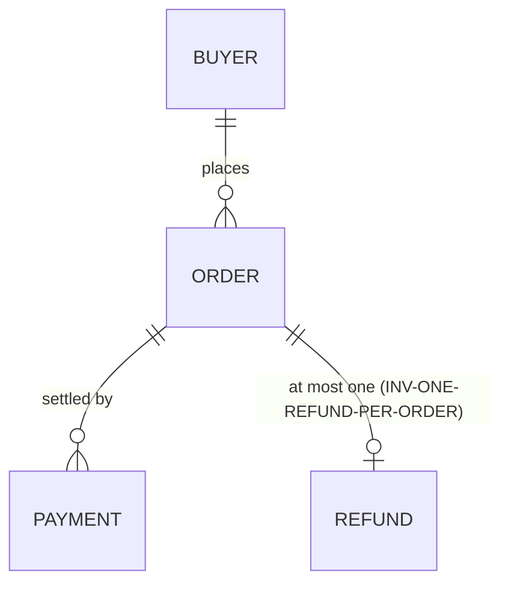
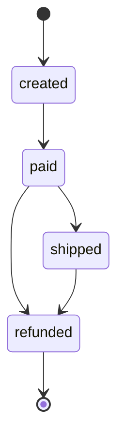

# IMP-106 — Product-Domain Ontology & Business-Invariant Anchoring

**Status:** PROPOSED (not yet applied) — awaiting owner review
**Surface:** framework-health (G125) — human-reviewed; NO auto-mutation of `bubbles/*`, `agents/*`, or `bubbles/workflows.yaml` until approved
**Author:** analyst review pass (bubbles.analyst → framework-health proposal), driven from a live source audit
**Motivation:** An operator review request to consider integrating two externally-argued concepts into Bubbles' design/implementation/validation phases — (1) **ontologies / domain models** (entities, relationships, rules, state machines) as a symbolic guardrail that keeps a probabilistic implementation honest to the business model (Frank Coyle, Berkeley — *"constraint model at the ledger; errors English can't catch"*), and (2) **provenance / lineage** (tracing how an artifact was derived, surviving mutation — Zep/Graphiti). Both were **checked against Bubbles rather than adopted as slogans.**
**Verified gaps addressed:** `DOM-INVARIANT`, `DOM-SST`, `DOM-LINEAGE`, `DOM-DOC` (legend at the end of this file).

**Relationship to IMP-105:** This is the **object-level sibling** to [IMP-105](IMP-105-delivery-strategy-assurance-and-context-efficiency.md) SCOPE-7 (`ONT-UNIFY`). IMP-105 applied the same Coyle talk to the **framework's own governance ontology** (Intent → DeliveryStrategy → WorkflowMode → Phase → Gate → Artifact → Owner → Assurance) — the *meta* level. IMP-106 applies it to the **downstream product's business domain** (Order → Refund → Payment → Buyer → Booking → Trade → …) — the *object* level that IMP-105 explicitly does **not** touch. The two are complementary and non-overlapping; do not conflate them.

---

## Executive summary

Bubbles is already a strong neuro-symbolic system: deterministic gates wrapping probabilistic agents, and the gate registry itself is being unified as a typed model (IMP-105 SCOPE-7). The Coyle talk *validates* that architecture at the meta level. **The un-covered surface is the downstream product's own domain.** There, Bubbles carries the right vocabulary — "Business Invariants (Survive Model Upgrades)", "Hard Constraints", a "Data Model" design section, a "Domain Capability Model" — but at the product level these are **prose that an LLM reads**, and business-rule conformance is enforced by **agent judgment**, not by a reasoner:

- `bubbles.audit` verifies *"All business rules implemented ✅/❌"* — a checkbox.
- `bubbles.gaps` is asked to *"List business rules and state transitions"* — analysis, not a persisted model.
- G044 regression scans specs for *"contradictory business rules"* — an LLM reading prose.

Meanwhile, Bubbles **already proved the exact mechanical pattern the talk argues for**, but scoped narrowly to security: **Gate G097** (`requirement-mechanism-guard.sh`) closes *"the shape-not-semantics hole that lets a requirement naming a concrete mechanism (PKCE, OAuth2, CSRF, HMAC, mTLS) ship green even when the implementation never implements that mechanism."* Its design — *a requirement names a thing → grep the code for it → warn-and-require-justification → grandfathered by `createdAt`* — is precisely "typed contract at the door, constraint model at the ledger" done the Bubbles way. **IMP-106 generalizes G097's proven pattern from security mechanisms to domain invariants** (enumerations, state machines, disjoint roles, functional/cardinality constraints), makes the domain model a threaded project-level source of truth, and adds lightweight lineage edges — **all additive, advisory-until-configured, and without RDF / OWL / a graph database** (matching IMP-105's own taste and both talks' explicit cost warnings).

Nothing here lowers the universal quality floor in `agents/bubbles_shared/critical-requirements.md`. Every scope ships **inert** on a repo that does not opt in (exactly like `traceContracts`), and every mechanical check reuses an existing pattern (G097 correspondence, `trace-contract-guard.sh` advisory-until-configured shape, the extensible `scenario-manifest.json` schema, the capability-foundation phase threading).

### Two axes, not one (do not conflate)

The word "invariant" already appears in Bubbles in a **different, complementary** sense. Keep them distinct:

| Axis | Where it lives today | What it checks | When |
|------|----------------------|----------------|------|
| **Runtime/telemetry invariant** (`traceContracts.workflows.<w>.requiredInvariants`, Gate G080) | `.github/bubbles-project.yaml` | A prose invariant string is present in **captured trace/log evidence** (e.g. *"booking emitted exactly one confirmation event"*) | validation, against emitted telemetry |
| **Static domain invariant** (`domainModel.invariants`, proposed Gate G130) | `.github/bubbles-project.yaml` (new sibling block) | A structural business rule (enum / state machine / disjointness / cardinality) named in requirements is **backed by an enforcing mechanism + a would-fail-if-violated test** in the code | certification, against code + tests |

A product benefits from both. G080 proves the workflow *did the right thing at runtime*; G130 proves the code *cannot do the wrong thing by construction* (the "second refund on one order" / "payout to a support-rep not the buyer" / "status ∈ {paid, shipped, refunded}" class Coyle names). Neither substitutes for the other.

### Three facets, three homes (ratified storage architecture)

The domain "ontology" is **not one artifact** — it is three facets with different natures, owners, and load patterns. Storing all three in one place is the anti-pattern (a YAML humans must read, or a prose doc a guard must parse). Each facet has **one authoritative home**; everything else references it by stable id.

| Facet | What it holds | Authoritative home | Owner | Load pattern |
|-------|---------------|--------------------|-------|--------------|
| **A — Checkable model** | entities, enums, state machines, invariants + `enforcedBy`/`provedBy` | `.github/bubbles-project.yaml` `domainModel:` **inline by default**; `domainModel: { $ref: config/domain-model.yaml }` once it outgrows ~a screenful (matches the existing `config/<project>.yaml` SST pattern) | `bubbles.validate` (guard-consumed) | on demand, by the phase that needs it (G130/G131) |
| **B — Narrative** | glossary, entity graph/diagram, *why* rules exist, relationships | new managed doc `docs/DomainModel.md` (registered in `docs-registry.yaml`, `required: false`) — SCOPE-4 | `bubbles.docs` | on demand (human reference) |
| **C — Ratified safety invariants** | the short "never double-charge / PII encrypted" list | `.specify/memory/constitution.md` → Business Invariants (**unchanged**) | human / owner | Tier-1 always-loaded (kept short) |

Ratified decisions behind this table:

- **Separate, not embedded (Q1/Q3).** The model is project-level and stable, referenced constantly — so it lives OUTSIDE any churning per-feature `design.md`. "Referenced constantly" is achieved by **stable ids + a stable location loaded on demand**, NOT by co-location or always-loading (which would bloat Tier-1 context — the exact cost IMP-105 SCOPE-5 fights).
- **Distinct from architecture (Q2).** `docs/Architecture.md` (the existing managed project-design doc) answers *how the system is built* (components, data flow/movement); `docs/DomainModel.md` answers *what the business is* (entities, legal states, rules). Different questions, different change cadence — kept separate and cross-linked; the ontology is **not** folded into Architecture.md (option B2 rejected).
- **Per-feature `design.md → ## Data Model` becomes a VIEW** that references the project model and declares only its deltas; new entities/invariants are promoted up (SCOPE-2).
- **Evolution:** small edits flow through the config + managed-doc path (auto-reconciled on closeout by the `docs-registry.yaml` policy). A *substantial* model change is tracked as a normal delivery packet (e.g. a `specs/_ops`-style cross-cutting packet) so it carries a `state.json`/evidence trail — but the standing model itself is **never** a spec.

---

## Problem (verified against source)

Each bullet was re-checked against a real file.

- **`DOM-INVARIANT` — product business-invariants are prose; conformance is agent-judgment, not mechanical.** `agents/bubbles_shared/feature-templates.md` defines the Outcome Contract's **Hard Constraints** as *"Business invariants that must hold regardless of implementation approach — these survive model upgrades"*, and `templates/constitution.md.tmpl` carries a **Business Invariants (Survive Model Upgrades)** checklist (*"Bookings must never result in double-charges", "PII encrypted at rest"*). Both are free text. The only mechanical requirement→code correspondence check that exists — **Gate G097** (`requirement-mechanism-guard.sh`) — is deliberately scoped to *named security mechanisms* (its examples are PKCE/OAuth2/CSRF/HMAC/mTLS). There is **no** equivalent check that a declared domain invariant (an enumeration, a state machine, a disjoint-roles rule, a one-per-parent cardinality) is enforced anywhere. G028 (implementation-reality-scan) proves *a real call is made*, not that it *obeys the rule*; traceability-guard proves *a test exists*, not that it *asserts the invariant*. Net: the "errors English can't catch" class is exactly the class Bubbles currently catches only with an LLM reading prose.
- **`DOM-SST` — the domain model is re-derived per feature; there is no threaded project-level domain source of truth.** `agents/bubbles_shared/feature-templates.md` gives each feature a local `design.md → ## Data Model` (*"Entities, relationships, migrations, and lifecycle constraints"*), redrawn per feature. The cross-phase **Domain Capability Model** (`agents/bubbles_shared/capability-foundation.md`: Analyst→`spec.md`, Design→`design.md`, UX→`spec.md`, Plan→`scopes.md`) *does* thread a domain model across phases — but (a) it is **trigger-gated** by the proportionality clause (only when a 2nd provider/adapter/variant appears), (b) it is **per-feature**, not product-wide, and (c) its guard (`capability-foundation-guard.sh`, AN5) checks the section **exists**, not that the implementation conforms. So the user's ask — *"have all business domain defined and kept in place for planning, design, implementation and validation"* — has a scaffold but no always-available, product-level, single source of truth. G044 regression looking for *"contradictory business rules"* has **no model to diff against**; it greps prose across specs.
- **`DOM-LINEAGE` — requirement/invariant → scenario → test → code lineage is point-to-point gate checks, not a mutation-surviving structure.** `bubbles/scripts/traceability-guard.sh` maps scenario ↔ Test Plan ↔ DoD ↔ report (with declared/inferred/ambiguous **edge-confidence tags**), G029 checks integration completeness, G035 checks the vertical slice. `bubbles/schemas/scenario-manifest.schema.json` even carries a **`lockdown` lifecycle (`unlocked/locked/invalidated/replaced` + `replacedBy`)** — the Zep "lineage survives invalidation" idea, but only for *scenarios*. There is **no edge from a business invariant to the scenarios/tests/code that enforce it**, so when a domain rule changes there is nothing that flags the dependent scopes/tests for re-verification. (`post-cert-spec-edit-guard.sh` and `bubbles.spec-review` detect drift on *spec text*, but neither is keyed to a domain-invariant change.)

---

## Proposal

Every scope is **additive**, **default-preserving**, and **advisory-until-configured** (a repo with no `domainModel:` block is a clean no-op — identical to `traceContracts`). None removes a gate or lowers the quality floor. Scopes are independently landable and ordered by leverage.

### SCOPE-2 — Promote the domain model to a threaded project-level SST (`DOM-SST`, proposed Gate **G131**, advisory)

- Treat the `domainModel:` block (delivered by Gate G130) as the **single product-level source of truth** for entities, relationships, and invariants, and thread it across phases by **generalizing the existing capability-foundation layer-ownership table** (`agents/bubbles_shared/capability-foundation.md`) from its trigger-gated multi-provider scope to an always-available product-domain surface:
  - **Analyst** references the shared model instead of re-deriving it; new domain concepts are *proposed* into it.
  - **Design** `## Data Model` **extends** the shared model (new entities/invariants are **promoted up**, not siloed in one feature).
  - **Plan** maps each `SCN-*` scenario to the domain concept(s) it touches (see SCOPE-3).
  - **Validate** runs G130 against the shared model.
  - **Docs** publish the narrative counterpart to `docs/DomainModel.md` (Facet B, SCOPE-4); the constitution's ratified Business Invariants (Facet C) remain the top-level safety list that Facet-A invariants refine by `INV-*` id.
- Add a **lightweight consistency lint** `bubbles/scripts/domain-model-consistency.sh` (proposed Gate **G131**, advisory-until-configured): a feature's `## Data Model` entities either reference the shared `domainModel:` or the lint nudges to promote them; a declared invariant referenced by an Outcome-Contract Hard Constraint must exist in the shared model. **Feed G044 a real model:** the regression conflict sweep gains a structured target ("does this spec's declared transition contradict the shared state machine?") instead of grepping prose.
- **Why:** this is the operator's literal ask — *"the business domain defined and kept in place for planning, design, implementation and validation"* — realized as a promotion of machinery Bubbles already has, not a new parallel system. **Quality:** unchanged floor; adds cross-feature domain coherence that is currently only an LLM judgment.

### SCOPE-3 — Business-domain lineage as typed edges in existing artifacts (`DOM-LINEAGE`, no new gate — reuse)

- **Do NOT build a graph database.** Extend the artifacts that already carry lineage:
  - Add an optional **`invariantRefs: ["INV-..."]`** field to each scenario in `scenario-manifest.json` (the schema is already `additionalProperties: true`), linking each `SCN-*` to the domain invariant(s) it exercises. This makes both directions answerable by lint — *"which test proves invariant X"* and *"which requirement justifies this scope"* — with no new store.
  - Reuse the existing **edge-confidence tags** (declared/inferred/ambiguous) in `traceability-guard.sh` for these new edges.
  - Extend `post-cert-spec-edit-guard.sh` / `bubbles.spec-review` so that **editing an invariant's `rule` text flags every scenario/scope with a matching `invariantRefs` for re-verification** — realizing Zep's "a source changed → dependent facts must be re-examined" on the artifacts Bubbles already owns, and reusing the scenario-manifest `lockdown → replaced` lifecycle that already exists for scenario supersession.
- **Why:** delivers the useful half of the provenance talk (bidirectional traceability + mutation survival) at the cost of a schema field and a lint extension, not a Graphiti-scale build. **Quality:** strengthens provenance; anti-fabrication unchanged.

### SCOPE-4 — Register the narrative domain doc as an optional managed doc (`DOM-DOC`, no new gate — docs-registry)

- Register a new managed doc **`docs/DomainModel.md`** in `bubbles/docs-registry.yaml` with `owner: bubbles.docs`, **`required: false`** (first-class **only** when a project configures `domainModel:` — advisory-until-configured, consistent with the rest of IMP-106), `publishSources: [feature, ops]`, and `requiredSections`: **Domain Glossary · Entity Graph · Lifecycles And State Machines · Business Rules And Invariants · Authoritative References**. Cross-link it from `docs/Architecture.md` (an Authoritative-References pointer) so the *how-it's-built* doc points at the *what-the-business-is* doc without duplicating it.
- This is **Facet B**: the human-readable source of truth. The `docs-registry.yaml` policy (`publishManagedDocsOnCloseout`, `removeObsoleteContent`, `mergeDuplicateContentIntoManagedDocs`, `unmanagedDocsRequireExplicitTarget`) then keeps it current, deduplicated, and obsolete-content-free on every closeout — which is precisely why it must be a *registered* managed doc, not a stray `docs/*.md`.
- The **Business Rules And Invariants** section references the Facet-A `domainModel.invariants` by `INV-*` id and the Facet-C constitution invariants by name; it **never re-encodes** the machine-checkable rules (narrative + pointer only — no duplication, so the two cannot drift into contradiction).
- **Why:** gives humans one durable, discoverable, auto-maintained place to read the domain, distinct from per-feature specs and from Architecture.md. **Quality:** additive; `required: false` keeps it inert for non-opted-in repos.

---

## Migration / rollout

- **Order:** SCOPE-4 (docs-registry entry — pure config, no code) → SCOPE-3 (small schema + lint extension) → SCOPE-2 (threading + consistency lint). Each is independently landable.
- **Posture:** every scope ships **inert**. A repo with no `domainModel:` block gets a clean no-op from G131 and no new scenario-manifest fields — identical to how `trace-contract-guard.sh` (G080) is a no-op until `traceContracts` is configured. Blocking enforcement is grandfathered by `state.json.createdAt` (G097's proven cutoff mechanism), so only newly-created specs on opted-in repos are ever blocked.
- All framework edits are authored **upstream-first** (canonical `bubbles/` source) and reach downstream repos only via `install.sh` / upgrade. This proposal mutates **no** framework file; it is a G125 proposal-first document.

## Risks & mitigations

- **R1** A `domainModel:` block becomes bureaucratic overhead on projects that don't need it. → It is 100% opt-in and proportional; the framework ships it inert. Recommend it in docs only for domains with real structural invariants (payments, bookings, trading, healthcare), never mandate it.
- **R2** The domain model drifts from the code over time (a stale ontology — the expert-systems failure Coyle warns about). → G130 keys the check to `enforcedBy`/`provedBy` **pointers into real code/tests**, so a drifted invariant with a dead pointer fails loudly rather than lying; SCOPE-3's re-verification flag catches rule edits.
- **R3** Scope creep toward RDF/OWL/graph-DB. → Explicit non-goal (below). The entire design is declarative YAML + a bash guard + a JSON-schema field; both source talks and IMP-105 warn that the heavyweight path does not scale.
- **R4** Duplicating Gherkin in the domain model. → The `domainModel:` block is **only** for static structural constraints (enum/state-machine/disjointness/cardinality) that scenarios can't mechanically encode; the lint should nudge against invariants that merely restate a scenario.
- **R5** A new managed doc (`docs/DomainModel.md`, SCOPE-4) adds a governance surface. → It is registered **`required: false`** — not required and not published until a repo configures `domainModel:`, so non-opted-in repos see nothing. The narrative references the machine model by `INV-*` id and never re-encodes rules, so narrative and config cannot drift into contradiction.

## Acceptance criteria (when implemented)

- **SCOPE-2:** a feature introducing a new entity is nudged to promote it into the shared `domainModel:`; a spec declaring a transition that contradicts the shared state machine is surfaced by the consistency lint / G044.
- **SCOPE-3:** a scenario carries `invariantRefs`; a lint answers both lineage directions; editing an invariant's `rule` flags its linked scenarios for re-verification; `scenario-manifest.schema.json` validates the new field.
- **SCOPE-4:** `docs/DomainModel.md` is a registered managed doc with the five required sections; it is `required: false` (a repo with no `domainModel:` is unaffected); `docs/Architecture.md` carries an Authoritative-References cross-link; the narrative references `INV-*` ids without re-encoding rules.

## Files to touch (on approval)

- **SCOPE-2:** `agents/bubbles_shared/capability-foundation.md` (generalize the layer-ownership threading to the product-domain SST), `agents/bubbles_shared/feature-templates.md` (`## Data Model` references the shared model), new `bubbles/scripts/domain-model-consistency.sh` (proposed **G131**, advisory), `agents/bubbles_shared/e2e-regression.md` (feed G044 the model) — owners: `bubbles.plan` + `bubbles.design` + framework.
- **SCOPE-3:** `bubbles/schemas/scenario-manifest.schema.json` (add optional `invariantRefs`), `bubbles/scripts/traceability-guard.sh` (edge-confidence tags for invariant edges), `bubbles/scripts/post-cert-spec-edit-guard.sh` (re-verification flag on invariant edit), `agents/bubbles.spec-review.agent.md` — owners: `bubbles.plan` + framework guard + `bubbles.spec-review`.
- **SCOPE-4:** `bubbles/docs-registry.yaml` (register `docs/DomainModel.md`, `required: false`, the five required sections), an optional `docs/DomainModel.md` starter scaffold, and an Authoritative-References cross-link in `docs/Architecture.md` — owner: `bubbles.docs`.

---

## Non-goals (explicit — do NOT do these)

- Do **NOT** introduce RDF, OWL, a triple store, or a graph database. The design is declarative YAML + a bash guard + one JSON-schema field. (Coyle: expert systems "couldn't scale"; Zep: "provenance is expensive"; IMP-105 SCOPE-7: "OWL-style constraints WITHOUT RDF or a graph DB".)
- Do **NOT** make `domainModel:` mandatory or always-on. It is opt-in and proportional, or it worsens the framework's known context/heaviness cost (IMP-105 SCOPE-5).
- Do **NOT** make Bubbles a runtime business-rule engine. It proves the product's **own** enforcement (types/DB constraints/tests) exists and is pinned to the declared rule; it never evaluates "is this a valid refund" itself.
- Do **NOT** duplicate Gherkin scenarios in the domain model — only the static structural constraints scenarios cannot mechanically express.
- Do **NOT** fold the domain ontology into `docs/Architecture.md` (option B2, rejected): architecture is *how it's built* (components, data flow); the ontology is *what the business is* (entities, legal states, rules) — different owner and change cadence. Keep them separate and cross-linked.
- Do **NOT** make the standing domain model a spec under `specs/`. The model is a living reference (Facet-A config + Facet-B managed doc); only a *substantial change* to it is tracked as a delivery packet.
- Do **NOT** re-open IMP-105 SCOPE-7 (`ONT-UNIFY`). That is the framework-governance ontology (meta level); this is the product-domain ontology (object level). Keep them separate.
- Do **NOT** weaken any existing gate (G020/G021 anti-fabrication, G025 per-DoD evidence, G097 mechanism correspondence, G080 trace contracts). This is strictly additive.

---

## Data sources analyzed (G125)

- **Templates / shared:** `agents/bubbles_shared/feature-templates.md` (Outcome Contract, `## Data Model`, design template), `templates/constitution.md.tmpl` (Business Invariants / Model Compensations), `agents/bubbles_shared/capability-foundation.md` (layer-ownership threading), `agents/bubbles_shared/project-config-contract.md` (`traceContracts` config shape + project-owned surfaces), `skills/bubbles-capability-foundation-design/SKILL.md`, `bubbles/docs-registry.yaml` (managed-docs registry + closeout policy + `specs/_ops`/`_bugs` classification roots), `agents/bubbles_shared/managed-docs.md` (cross-cutting roots).
- **Guards / schema (read):** `bubbles/scripts/requirement-mechanism-guard.sh` (**G097** — the reused correspondence pattern), `bubbles/scripts/traceability-guard.sh` (edge-confidence tags), `bubbles/scripts/trace-contract-guard.sh` (G080 advisory-until-configured shape), `bubbles/scripts/capability-foundation-guard.sh` (AN5 existence check), `bubbles/schemas/scenario-manifest.schema.json` (`additionalProperties: true`, `lockdown` lifecycle).
- **Agents:** `agents/bubbles.audit.agent.md` (*"All business rules implemented ✅/❌"*), `agents/bubbles.gaps.agent.md` (*"List business rules and state transitions"*), `agents/bubbles.regression.agent.md` + `agents/bubbles_shared/e2e-regression.md` (G044 *"contradictory business rules"*).
- **Registry / docs:** `bubbles/registry/gates.yaml` (highest existing gate **G129**; G130/G131 free), `docs/guides/FRAMEWORK_CONCEPTS.md` §18.4–18.5 (evidence-provenance taxonomy; model-compensation vs business-invariant classification), [IMP-105](IMP-105-delivery-strategy-assurance-and-context-efficiency.md) (`ONT-UNIFY` meta-level, cited Coyle talk).
- **External inputs (validated, not adopted as slogans):** Coyle (agents + ontologies + neuro-symbolic guardrails); Zep/Graphiti (provenance/lineage as graph, surviving mutation).

## Verification posture / honesty disclosure

Findings are grounded in files actually opened in-session. `requirement-mechanism-guard.sh` was read end-to-end and confirmed to be **G097** with the exact warn-and-justify + `createdAt`-grandfather design Gate G130 reuses. The highest registered gate was verified as **G129**, so G130/G131 are free. This proposal did **not** read every one of the ~200 scripts or all gate descriptions; it read the load-bearing correspondence/traceability/config surfaces end-to-end. No `bubbles/*`, `agents/*`, or `bubbles/workflows.yaml` file is mutated by this proposal (G125 proposal-first). Confidence: `DOM-INVARIANT` HIGH (direct G097 precedent + prose-surface confirmation), `DOM-SST` HIGH (capability-foundation threading + per-feature Data Model confirmed), `DOM-LINEAGE` MEDIUM (schema extension is straightforward; the re-verification flag is design-level and effort-dependent); `DOM-DOC` HIGH (the docs-registry managed-doc pattern is proven and directly reused).

## Legend (gap codes)

| Code | Name |
|------|------|
| `DOM-INVARIANT` | Product business-invariants are prose; conformance is agent-judgment. G097 checks named *security mechanisms* → code, but no check exists for named *domain invariants* (enum / state-machine / disjointness / cardinality) → an enforcing mechanism or adversarial test. |
| `DOM-SST` | The domain model is re-derived per feature (`design.md → ## Data Model`); the cross-phase Domain Capability Model is trigger-gated + existence-checked only; no always-available, product-level domain source of truth is threaded through plan/design/implement/validate, so G044 has no model to diff against. |
| `DOM-LINEAGE` | Requirement/invariant → scenario → test → code lineage is point-to-point gate checks; `scenario-manifest.json` has a `lockdown/replaced` lifecycle for scenarios but no invariant edges, so a business-rule change does not flag dependent scopes/tests for re-verification. |
| `DOM-DOC` | The domain model's human-readable narrative (glossary, entity graph, rule rationale) has no durable home; it is redrawn per feature in `design.md → ## Data Model`. No managed, auto-maintained project-level domain doc exists — `docs/Architecture.md` covers system shape (how it's built), not the business model (what it is). |

---

## Appendix A — `docs/DomainModel.md` starter scaffold (SCOPE-4)

Concrete five-section scaffold for the **Facet-B** managed doc. On approval, this lifts into `templates/DomainModel.md.tmpl` (alongside `templates/constitution.md.tmpl`) and the section names register in `docs-registry.yaml` per SCOPE-4. It is **embedded here, not created as a framework file**, to keep IMP-106 proposal-first — it mutates no `templates/*` until approved.

Its discipline mirrors the ratified storage architecture: **narrative + pointers only.** The enforceable rule lives in **Facet-A** config (`domainModel:`, Gate G130); the ratified safety list lives in **Facet-C** (`constitution.md` → Business Invariants). This doc never re-encodes either — so the three homes cannot drift into contradiction. Diagrams are the human view; on any conflict, the config wins.

````markdown
# {{PROJECT_NAME}} — Domain Model

> **Facet B** (human-readable narrative) of the product domain model.
> Managed doc — owner: `bubbles.docs`; kept current on closeout by the docs-registry policy.
> **Authoritative sources this doc points at (never copies):**
> - Formal, machine-checkable rules → `.github/bubbles-project.yaml` `domainModel:` (Facet A, Gate G130)
> - Ratified top-level safety invariants → `.specify/memory/constitution.md` → Business Invariants (Facet C)
>
> This doc holds the *why* and the *shape*; the config holds the *enforceable rule*. On any conflict, the config wins.

---

## Domain Glossary

The shared vocabulary every spec, design, and test uses for this domain. One row per term.

| Term | Definition (plain English) | Aliases / terms to avoid | Related entities |
|------|----------------------------|--------------------------|------------------|
| Order | A customer's confirmed purchase request | "cart" (pre-confirmation only) | Payment, Refund |
| <Term> | <what it means in this business> | <synonyms; terms NOT to use> | <Entity, Entity> |

> **TODO:** Replace the example row with this project's real terms.

---

## Entity Graph

Entities and their relationships. Keep this a picture, not a schema — field-level shape lives in each feature's `design.md → ## Data Model`; enforceable constraints live in Facet-A config.



---

## Lifecycles And State Machines

For each entity with a lifecycle, its legal states and transitions. The **authoritative** allowed-states / terminal set is `domainModel.entities.<Entity>.states` / `.terminal` in Facet-A config; this diagram is the human view.



---

## Business Rules And Invariants

A narrative index that **points at** the authoritative definition — it does not re-encode the formal rule (no duplication → no drift). One row per invariant.

| Invariant | Why it matters (rationale) | Authoritative rule | Enforced by | Proven by |
|-----------|----------------------------|--------------------|-------------|-----------|
| `INV-ONE-REFUND-PER-ORDER` | A double refund pays a customer twice — direct financial loss | Facet-A `domainModel.invariants[INV-ONE-REFUND-PER-ORDER]` | db-unique-index | `tests/refund_test.rs::second_refund_rejected` |
| `INV-...` | <business consequence if violated> | Facet-A `domainModel.invariants[INV-...]` | <mechanism> | <test id/path> |

**Ratified safety invariants (Facet C) this model refines** — from `constitution.md` → Business Invariants:

- "Bookings must never result in double-charges" → refined by `INV-ONE-REFUND-PER-ORDER`, `INV-...`

---

## Authoritative References

The hub tying the three homes together. Keep these links current.

- **Facet A (formal rules):** `.github/bubbles-project.yaml` `domainModel:` (or `config/domain-model.yaml` when `$ref`'d) — enforced by Gate G130.
- **Facet C (ratified safety invariants):** `.specify/memory/constitution.md` → Business Invariants.
- **System architecture (how it's built):** `docs/Architecture.md`.
- **Feature views (per-feature deltas):** `specs/<NNN-feature>/design.md → ## Data Model`.
````
